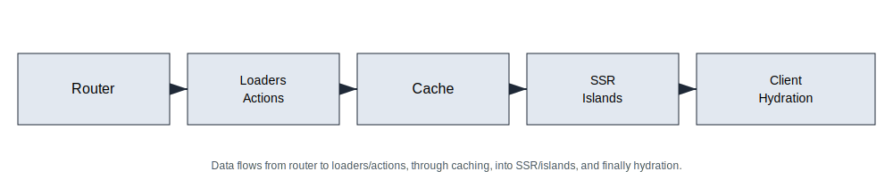

# Architecture Overview (PhilJS)

Understand how PhilJS pieces fit together from request to render.

## Layers

- **Router**: defines routes, loaders, and actions; coordinates data and navigation.
- **Core**: signals, memos, resources, stores; the reactive engine.
- **SSR/Islands**: server render + streaming + selective hydration.
- **Adapters**: platform bindings (edge/serverless/static); handle env, caches, and HTTP.
- **Tooling**: CLI, devtools, builder, migrate, lint/typecheck/budget scripts.

## Request/response flow

1) Request hits adapter (edge/serverless).
2) Router loader runs; uses caches and tags; may stream partial HTML.
3) SSR renders HTML; islands annotated for hydration.
4) Response streams to client with cache headers.
5) Client hydrates islands; resources fetch secondary data; actions mutate and invalidate.

## Data and caching

- Loaders own data fetching and caching; actions own mutations and invalidation.
- Cache tags + `staleTime` + `revalidate` drive freshness and ISR/edge caches.
- Resources handle panel-level async states; stores handle client state.

## State strategy

- Signals for local UI.
- Stores for domain state with middleware/history/persistence.
- Resources for async data; avoid putting server state in stores when loaders can cache it.

## Performance hooks

- Prefetch via router; streaming SSR; islands hydrate lazily.
- size-limit, benches, devtools flamecharts, profiling scripts.

## Observability

- Logs/metrics/traces per loader/action/SSR request.
- Cache hit/miss tagged; request ids propagated.
- Devtools for local inspection; APM for production.

## Security

- Validation in loaders/actions; sanitize inputs/outputs.
- Edge-safe APIs; secrets in env; CSP and headers set at adapter level.

## Deployment patterns

- Edge for latency-sensitive pages; regional for heavy jobs.
- Static/ISR for mostly-static routes; live widgets as islands.
- Rollouts with feature flags and cache-aware invalidation.

## Checklist

- [ ] Router/data layer designed with cache tags and revalidate hints.
- [ ] SSR + islands strategy per route.
- [ ] State split between signals/stores/resources appropriately.
- [ ] Observability/logging wired with req/trace ids.
- [ ] Security checks at boundaries; CSP/headers configured.

