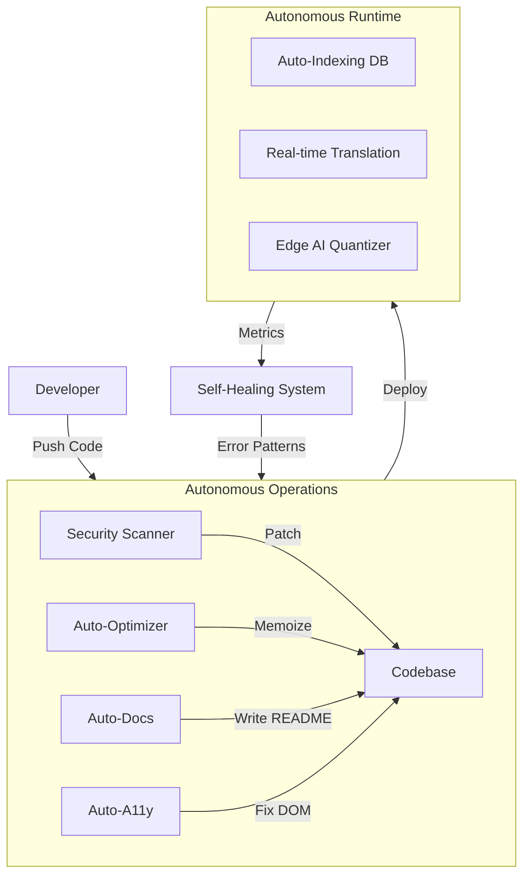
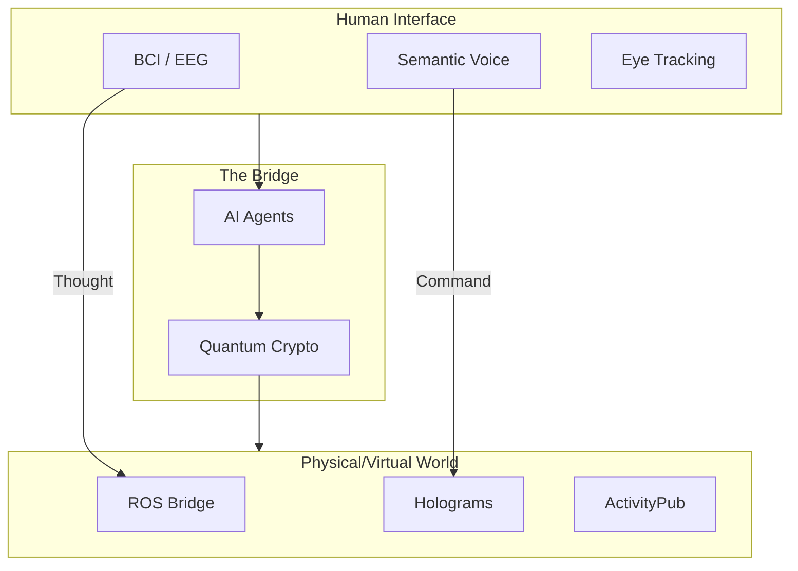

# Visual Architecture

The Singularity, visualized.

## The Autonomous Loop
How PhilJS maintains itself without human intervention.



## The Scientific Stack
From Silicon to Space.

```mermaid
graph TD
    subgraph Primitives [Core Primitives]
        Tensor[philjs-science<br/>(Tensor Math)]
    end
    subgraph Domain [Domain Specific Layers]
        Bio[philjs-bio<br/>(DNA/CRISPR)]
        Astro[philjs-astro<br/>(Ephemeris)]
        Fin[philjs-fin<br/>(Quant Models)]
        Geo[philjs-geo<br/>(Geospatial)]
    end
    Tensor --> Bio
    Tensor --> Astro
    Tensor --> Fin
    Tensor --> Geo
    subgraph App [Applications]
        Research[Lab Notebooks]
        Trading[Algo Trading]
        Space[Mission Control]
    end
    Domain --> App
```

## Future Tech Interface
Merging Man and Machine.


