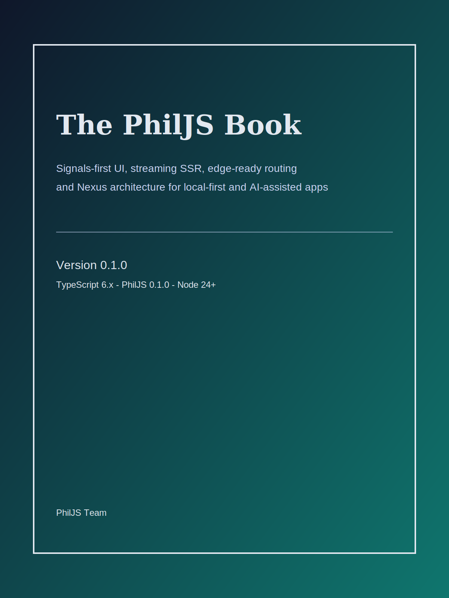

# PhilJS Book

Version: 0.1.0  
Target: TypeScript 6.x, PhilJS 0.1.0, Node 24+

> Signals-first UI, streaming SSR, edge-ready routing, and Nexus architecture for local-first and AI-assisted apps.

Authors: PhilJS Team  
License: MIT  
Repo: https://github.com/philipjohnbasile/philjs
