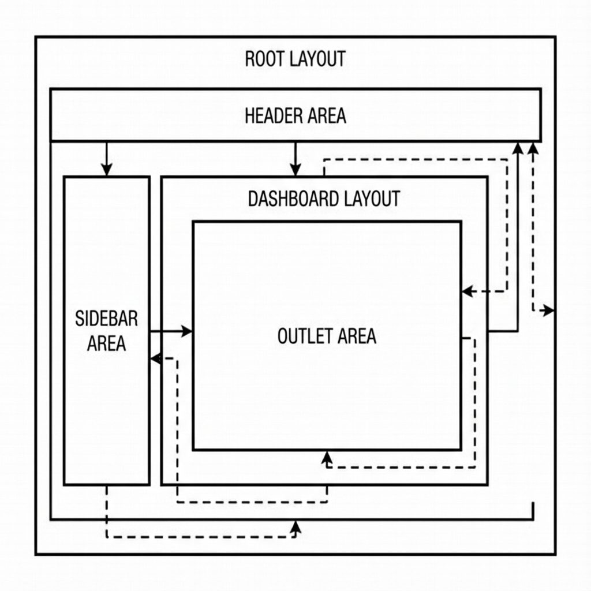

# Chapter 7: The Edge of Reason

Modern application deployment strategies have shifted from centralized origin servers to distributed edge networks.

Traditional architectures often require requests to travel significant distances to a central data center (e.g., `us-east-1`), introducing cumulative network latency.

PhilJS is optimized for **Global Edge Deployment**, Modern applications do not live on a single server. They live on the **Edge**.


*Figure 9-1: Global Edge Topology*

## The Edge First Philosophy

PhilJS is designed to be **Runtime Agnostic**. We do not care if you deploy to a V8 Isolate (Cloudflare Workers), a Node Container (Fly.io/Railway), or a Serverless Function (AWS Lambda).

The build system abstract this via **Adapters**.

```typescript
// philjs.config.ts
import adapter from '@philjs/adapter-cloudflare'; // or @philjs/adapter-node

export default {
  adapter: adapter({
    // The adapter handles the specifics of the target platform
    routes: {
      include: ['/*'],
      exclude: ['<all>']
    }
  })
};
```


*Figure 9-2: The Adapter Pattern: Build Once, Deploy Anywhere*

## Static vs Dynamic

The fastest request is the one that never hits a server. PhilJS treats **Static Site Generation (SSG)** as a first-class citizen alongside **Server Side Rendering (SSR)**.


*Figure 9-3: Unified Routing: SSG and SSR in Harmony*

You can mix them in the same app.
*   `/blog/*` -> Prerendered at build time (CDN cache).
*   `/dashboard/*` -> Rendered on request (Dynamic).

## The Database Problem

Moving compute to the edge is easy. Moving data is hard.

If your code runs in Tokyo but your Postgres database is in Virginia, you have solved nothing. PhilJS encourages using **Distributed Data** strategies:


*Figure 9-4: Edge Data Topology: Read Replicas and Global KV*

1.  **Read Replicas**: Use a managed database (like Turso, Neon, or PlanetScale) that replicates read-models to the edge.
2.  **Edge KV**: Use Key-Value stores (Cloudflare KV, Redis) for user sessions and caching.
3.  **Local-First Sync**: As discussed in the Agents chapter, move data to the *client* and sync via CRDTs.

## Docker & Self-Hosting

Not everyone wants the cloud. For the sovereign developer, PhilJS produces a production-ready Docker image.

```dockerfile
# The 'philjs build' command produces a standalone node server
FROM philjs/runtime:latest
COPY ./dist /app
CMD ["node", "/app/server.mjs"]
```

This image is tuned for Node 24, with correct memory limits and garbage collection flags pre-configured.

## Summary

*   **Deploy close to the user**.
*   **Abstract the provider**.
*   **Replicate the data**.

Your code should be liquid. It should flow to fill the container it is poured into.
