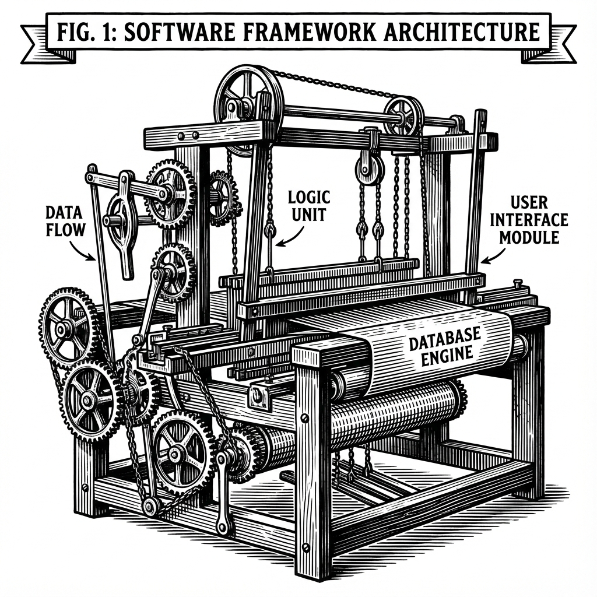
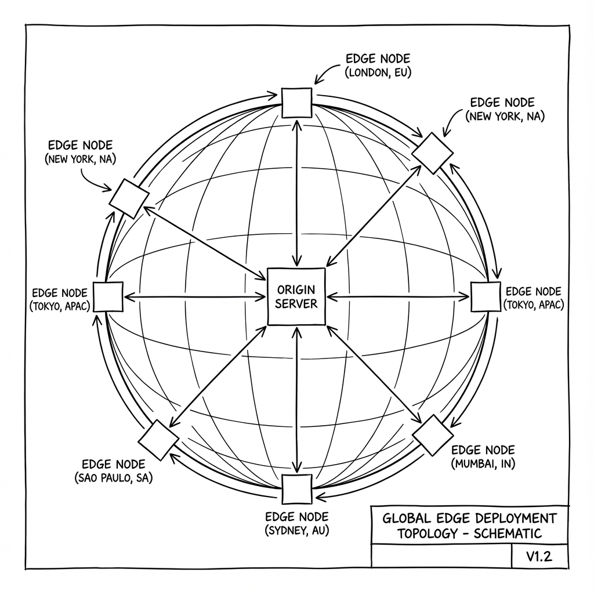

# Introduction to PhilJS

PhilJS is a TypeScript-first web framework designed for performance and scalability through architectural optimization rather than runtime heuristics.

## System Overview

PhilJS combines the component model of libraries like React and Solid with **Zero-Hydration Resumability**, a technique that eliminates the initialization costs associated with traditional Single Page Applications (SPAs). This allows applications to maintain constant Time-to-Interactive (TTI) regardless of application size.


*Figure 1-1: The PhilJS Resumability Engine Architecture*

The framework is built on **fine-grained reactivity** (Signals), ensuring that state updates propagate directly to the DOM without requiring a Virtual DOM diffing process. This approach integrates server-side rendering (SSR) and client-side interactivity into a unified model.

## Try It Yourself

Here's a simple PhilJS example you can edit and run right in your browser:

```typescript live
const count = signal(0);

const increment = () => {
  count.set(count() + 1);
};

console.log('Initial count:', count());

// Simulate clicking the button 3 times
increment();
console.log('After increment:', count());

increment();
console.log('After second increment:', count());

increment();
console.log('After third increment:', count());
```

Try modifying the code above! Change the initial value, add more increments, or experiment with the signal API.

## Core Design Principles

### 1. Resumability & Execution Latency

Unlike frameworks that hydrate the entire application state on the client, PhilJS utilizes **resumability**. The application state is serialized into the HTML, allowing the client to resume execution from the server's last state without re-running initialization logic.

**Technical implications:**
- **Elimination of Hydration Phase:** No blocking main-thread time for component re-execution.
- **Lazy Execution:** Event handlers and component logic are loaded only upon interaction.

### 2. Fine-Grained Reactivity (Signals)

PhilJS uses **signals** as the primary state primitive. This dependency-tracking system allows for O(1) updates to the DOM.

**Example:**
```typescript
// A counter that updates without re-rendering anything else
const count = signal(0);

<div>
  <h1>My App</h1>
  <p>Count: {count()}</p>  {/* Only this text node updates */}
  <button onClick={() => count.set(c => c + 1)}>+</button>
</div>
```


*Figure 1-2: Virtual DOM Diffing vs. Direct Signal Updates*

This model avoids the CPU overhead of Virtual DOM reconciliation.

### 3. Observability & Cost Attribution

PhilJS includes a native **cost tracking** module. This allows developers to measure the runtime cost (renders, data transfer) of individual components in production.


*Figure 1-3: Time to Interactive (TTI) Comparison: Hydrated vs. Resumable*

```typescript
import { useCosts } from '@philjs/core';

export function Dashboard() {
  const costs = useCosts({ component: 'Dashboard' });

  return (
    <div>
      <p>Render Count: {costs.renders}</p>
    </div>
  );
}
```

### 4. Resilient Runtime Strategy

The **Self-Healing Runtime** operates as a supervisor layer. It employs strategies such as circuit breakers and isolation boundaries to prevent partial UI failures from crashing the entire application context.

- **Circuit Breakers**: Isolation of failing components.
- **Recovery**: Automatic re-initialization of crashed component trees.

### 5. **TypeScript 6 First**

PhilJS is written in TypeScript and designed for TypeScript 6+. Every API is fully typed with excellent inference and leverages the latest TypeScript features.

```typescript
// Props are automatically inferred with TypeScript 6 features
function UserProfile({ user, onSave }: {
  user: { name: string; email: string };
  onSave: (user: User) => Promise<void>;
}) {
  const editing = signal(false);

  // TypeScript 6 knows editing is Signal<boolean>
  // Full autocomplete and type checking everywhere
}

// Using TypeScript 6 satisfies operator for config
const config = {
  theme: 'dark',
  version: 2,
} as const satisfies AppConfig;

// Using NoInfer for better generic inference
function createStore<T>(initial: NoInfer<T>): Store<T> {
  return new Store(initial);
}
```

**TypeScript 6 Benefits:**
- Isolated declarations for faster builds
- Enhanced `satisfies` operator
- `NoInfer<T>` utility type for better generics
- Improved const type parameters
- Better auto-imports and go-to-definition

### 6. **Server Functions = Zero Boilerplate APIs**

Call server code from your components like regular functions - PhilJS handles everything.

```typescript
// server.ts
export const getUser = serverFn(async (id: number) => {
  // This runs ONLY on the server
  const user = await db.users.findById(id);
  return user;
});

// client.tsx
import { getUser } from './server';

export function UserProfile({ userId }: { userId: number }) {
  const user = await getUser(userId);

  return <div>{user.name}</div>;
}
```

**No need for:**
- Separate API routes
- REST endpoint definitions
- GraphQL schemas
- API client code
- Manual serialization

Just call the function. PhilJS handles the network request, serialization, error handling, and type safety automatically.

### 7. **Islands Architecture for Maximum Performance**

Use **islands** to ship minimal JavaScript. Only interactive components get hydrated - the rest is pure HTML.

```typescript
// This button is interactive (small JS bundle)
<Counter client:load />

// This content is static HTML (0 JS)
<BlogPost post={post} />

// This loads only when visible (lazy loaded)
<Comments client:visible />
```


*Figure 1-4: The Islands Architecture: Static Seas with Interactive Islands*

**Results:**
- 90% less JavaScript shipped
- Faster page loads
- Better Core Web Vitals
- Lower bounce rates

### 8. **Batteries Included**

PhilJS comes with everything you need:

- ✅ **File-based routing** with layouts and nested routes
- ✅ **Data fetching** with caching and invalidation
- ✅ **Form handling** with validation and server actions
- ✅ **Authentication** patterns built-in
- ✅ **Real-time updates** via WebSockets/SSE
- ✅ **i18n** with locale routing
- ✅ **Testing utilities** for components and integration
- ✅ **DevTools** with time-travel debugging
- ✅ **Static generation** with ISR
- ✅ **Image optimization**
- ✅ **Code splitting** automatic and manual

No decision fatigue. No hunting for packages. Everything works together perfectly.

## Who Should Use PhilJS?

### Perfect For:

**Startups and MVPs**
- Ship fast with minimal code
- Scale without rewriting
- Built-in cost tracking helps manage budgets
- TypeScript catches bugs before users do

**E-commerce Sites**
- Fast page loads = higher conversion
- Resumability = instant interactivity
- Islands = minimal JavaScript
- Great Core Web Vitals = better SEO

**Content Sites and Blogs**
- Static generation for speed
- Dynamic data when needed
- Excellent SEO out of the box
- Great authoring experience

**Enterprise Applications**
- TypeScript-first for large teams
- Predictable performance at scale
- Cost tracking for accountability
- Excellent tooling and DevTools

**Mobile-First Applications**
- Minimal JavaScript = better mobile experience
- Fine-grained reactivity = smooth animations
- Works great on slow networks
- Battery-friendly

### When You Need Extensions

**You Need Additional Ecosystem Features**
- PhilJS is new and the ecosystem is expanding quickly
- If a dependency is missing, build a PhilJS plugin or adapter
- Use the compatibility layers during migration

**You're Building a Desktop App**
- Use PhilJS Desktop or PhilJS Native packages
- Share components between web and desktop targets

**You Need a JavaScript-Only Stack**
- PhilJS is TypeScript-first and requires TypeScript 6+
- Keep everything in TypeScript for consistency and safety

## How Is PhilJS Different?

### vs React

**What's Better:**
- ⚡ 10x faster updates (signals vs virtual DOM)
- 📦 Smaller bundle sizes (no runtime overhead)
- 🚀 Zero hydration (resumability vs hydration)
- 💰 Built-in cost tracking
- 🎯 Server functions (vs REST/GraphQL)

**Trade-offs:**
- 📚 Smaller ecosystem (newer framework)
- 🔄 Different mental model (signals vs hooks)
- 🛠️ Fewer third-party components

**PhilJS path for React-heavy stacks:**
- Use the PhilJS compatibility layers while migrating
- Wrap legacy components behind PhilJS routes
- Replace hooks-based state with signals over time

### vs Vue

**What's Better:**
- ⚡ Faster (fine-grained reactivity)
- 🚀 Resumability (vs hydration)
- 📝 TypeScript-first (better inference)
- 🎯 Server functions built-in

**Trade-offs:**
- 📚 Newer with less documentation
- 🎨 No template syntax (JSX only)

**PhilJS path for template-heavy teams:**
- Keep the core UI in PhilJS and wrap for legacy apps
- Use PhilJS components as the long-term source of truth
- Expand the PhilJS ecosystem with targeted adapters

### vs Svelte

**What's Better:**
- 🚀 Resumability (instant interactivity)
- 💰 Cost tracking
- 🌊 Better streaming SSR
- 🏝️ Islands architecture built-in

**Trade-offs:**
- 🎨 No template syntax (JSX vs Svelte syntax)
- 📚 Smaller community

**PhilJS path for Svelte-style DX:**
- Use signals and islands for compiler-friendly UI
- Keep SSR and streaming on by default for performance
- Adopt PhilJS stores for predictable state

### vs Next.js

PhilJS includes everything Next.js does plus:
- ⚡ Fine-grained reactivity (faster updates)
- 🚀 Resumability (zero hydration)
- 🏝️ Islands architecture
- 💰 Cost tracking

**PhilJS path for Next.js migrations:**
- Use the PhilJS compatibility layer for React components
- Move routing and data loading into PhilJS modules
- Replace Next.js-specific APIs with PhilJS SSR/ISR

## Quick Feature Overview

### Requirements
- **Node.js 24+** (Node 25 supported) - Required for native ESM, Promise.withResolvers(), Object.groupBy()
- **TypeScript 6+** - Required for isolated declarations and enhanced inference

### Reactivity
```typescript
import { signal, memo, effect } from '@philjs/core';

const count = signal(0);           // Reactive state
const doubled = memo(() => count() * 2);  // Computed value
effect(() => console.log(count()));       // Side effect
```

### Components
```typescript
export function Welcome({ name }: { name: string }) {
  return <h1>Hello, {name}!</h1>;
}
```

### Server Functions
```typescript
const saveUser = serverFn(async (user: User) => {
  await db.users.save(user);
});
```

### Routing
```
src/routes/
  index.tsx        → /
  about.tsx        → /about
  users/
    [id].tsx       → /users/123
```

### Data Fetching
```typescript
const user = createQuery(() => fetchUser(userId()));
```

### Forms
```typescript
<form action={createUser}>
  <input name="name" required />
  <button>Create</button>
</form>
```

## Getting Started

Ready to build something amazing? Let's go:

1. **[Installation](./installation.md)** - Get PhilJS installed in 30 seconds
2. **[Quick Start](./quick-start.md)** - Build your first app in 5 minutes
3. **[Tutorial](./tutorial-tic-tac-toe.md)** - Learn by building a game

## Community and Support

- **GitHub**: [github.com/philjs/philjs](https://github.com/philjs/philjs)
- **Discord**: [discord.gg/philjs](https://discord.gg/philjs)
- **Twitter**: [@philjs](https://twitter.com/philjs)
- **Stack Overflow**: Tag with `philjs`

## License

PhilJS is MIT licensed. Free for personal and commercial use.

---

**Next:** [Installation →](./installation.md)

