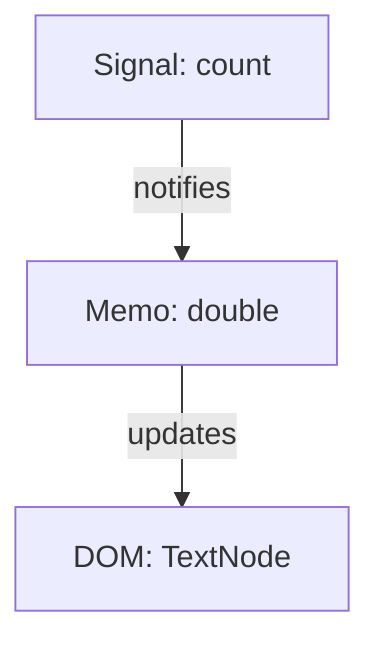

# Chapter 1: The Reactive Graph

To understand PhilJS, you must unlearn the "component lifecycle."

For the past decade, web frameworks have taught us that the fundamental unit of an application is the **Component**. In this view, an application is a tree of components that re-render top-down when state changes. This model, pioneered by React, was a massive leap forward from imperatively mutating the DOM, but it came with a cost: the framework constantly repaints the canvas to ensure consistency.

PhilJS takes a different approach. The fundamental unit of a PhilJS application is not the Component, but the **Signal**.

## The Surgeon vs. The Painter

Imagine two ways to restore a fresco painting:

1.  **The Painter (Virtual DOM)**: Takes a photo of the wall, paints a new version on a separate canvas, compares the two pixel-by-pixel, and then repaints the entire sections that look different.
2.  **The Surgeon (Signals)**: Connects a wire directly from the paint tube to the specific crack in the wall. When the tube is squeezed, the paint flows exactly where it is needed.

 PhilJS is the Surgeon. It does not diff a tree. It does not re-run component functions. It creates a static dependency graph at startup and surgically updates only the DOM nodes that traverse from a changed signal.

## Visualizing the Graph

Consider this simple application:

```typescript
const count = signal(0);
const double = memo(() => count() * 2);

function Counter() {
  return <div>{double()}</div>;
}
```

In a Virtual DOM framework, the `Counter` function would run every time `count` changes.
In PhilJS, the `Counter` function runs **exactly once**.

During that single execution, it creates a text node in the DOM. That text node subscribes to `double`. `double` subscribes to `count`.

The resulting graph looks like this:



When you call `count.set(1)`:
1.  `count` notifies `double`.
2.  `double` marks itself as stale.
3.  `C` (the text node) pulls the new value from `double`.
4.  `double` pulls the new value from `count` and recomputes.

This is the **Push-Pull** model. Change notifications are *pushed* down the graph, but values are *pulled* lazily when needed.

## Why Components Are Just Setup Functions

If components don't re-render, what are they?

In PhilJS, a component is simply a **Setup Function**. Its job is to run once, create the initial DOM structure, and wire up the signals. Closures verify that variables stay in scope, but the function itself is ephemeral.

```typescript
function UserCard() {
  // 1. Setup Phase (Runs Once)
  const name = signal("Alice");
  const upper = memo(() => name().toUpperCase());

  console.log("UserCard mounted"); 

  // 2. Wiring Phase (Returns a DOM Template)
  return (
    <div class="card">
      {/* The dependency is wired here. This text node 'owns' the subscription. */}
      <h1>{upper()}</h1> 
    </div>
  );
}
```

If you change `name`, `UserCard` does not run again. The `console.log` will never fire a second time. Instead, the `<h1>` text node updates directly.

## The Mental Shift

As you write PhilJS code, stop asking: *"When will this component re-render?"*
Start asking: *"What is this value connected to?"*

You are no longer managing lifecycles. You are managing a **live circuit board**. You place the chips (signals), verify the connections (memos), and turn on the power. The electricity flows where it must, and nowhere else.
