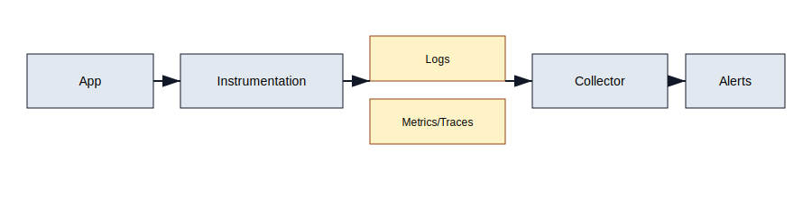

# Observability and Reliability

Visibility is mandatory when running PhilJS across edge and serverless targets. Collect logs, metrics, and traces so you can catch regressions and tune performance budgets. Reuse playbooks from `docs/observability`, `docs/performance`, and `docs/security` to keep this chapter actionable.



## What to capture

- **Logs**: structured JSON with request id, route id, loader/action names, timing, and cache hit/miss.
- **Metrics**: TTFB, render time, hydration time, error counts, cache hit ratio, queue depth.
- **Traces**: link client navigation to server render and downstream API calls.
- **RUM**: LCP/FID/CLS and navigation timings from real users (sampled).
- **Feature flags**: include flag state in logs to correlate regressions.

## Instrumentation points

- Router loaders/actions: measure execution time and tag with cache status.
- SSR render: wrap `renderToString`/`renderToStream` with timing spans.
- Edge adapters: attach platform request ids (Vercel/Netlify/CF) to logs.
- Client: capture hydration duration and key interactions (route change, data refetch).
- Stores: log undo/redo and persistence events when debugging data issues.
- Integrations: log upstream API latency and error codes.

## Tools

- Use `@philjs/observability` (if available) or platform-native exporters:
  - Vercel/Netlify/CF logs + analytics,
  - OpenTelemetry exporters for traces/metrics,
  - Console JSON logs for quick debugging.
- For front-end RUM, sample navigation timings and ship to your APM.
- Use Playwright traces to capture visual regressions and timings in CI.

## Error handling

- Use error boundaries for UI; report errors with route and loader metadata.
- Redact PII before logging; never log secrets.
- Classify errors (user, network, server) for dashboards.
- Add “why” strings to surfaced errors for user trust and supportability.

## Alerting and SLOs

- Define SLOs per surface (e.g., p95 TTFB < 400ms, error rate < 0.5%).
- Alert on budget breaches (bundle size, TTFB, cache hit ratio dropping).
- Include runbooks in alerts (how to roll back, which caches to invalidate).
- Track cold-start counts on edge/serverless targets; alert if they spike.

## Local debugging

- Enable verbose logs in dev; print cache events and loader timings.
- Use DevTools performance tab for flamecharts and signal graphs.
- Record test runs with `vitest --watch` + trace output when debugging slow specs.
- For API flakiness, use MSW to capture/inspect requests locally.

## Try it now: structured logging wrapper

```typescript
function log(event: string, data: Record<string, unknown> = {}) {
  console.info(JSON.stringify({
    event,
    ts: Date.now(),
    route: data.route,
    loader: data.loader,
    cache: data.cache,
    reqId: data.reqId,
    ...data
  }));
}

export const userLoader = loader(async ({ params, signal, cache, request }) => {
  const reqId = request.headers.get('x-request-id') ?? crypto.randomUUID();
  const start = performance.now();
  try {
    const user = await getUser(params.id, signal);
    cache.tag(['user', params.id]);
    return { user };
  } finally {
    log('loader.user', { reqId, route: '/users/:id', loader: 'userLoader', ms: performance.now() - start });
  }
});
```

Pipe these logs to your platform's log drain and add a dashboard for loader latency and cache hit ratios.

## Runbooks (examples)

- **Slow TTFB**: check edge cache headers, loader latency, and streaming flush; roll back heavy blocking code.
- **Hydration errors**: repro with Playwright + console, capture serialized data, compare server/client renders.
- **Cache misses spike**: inspect invalidation calls and cache tags; look for over-eager `invalidate(['*'])`.
- **API regressions**: use MSW in staging to isolate backend vs frontend; add alerts on 5xx rates.

