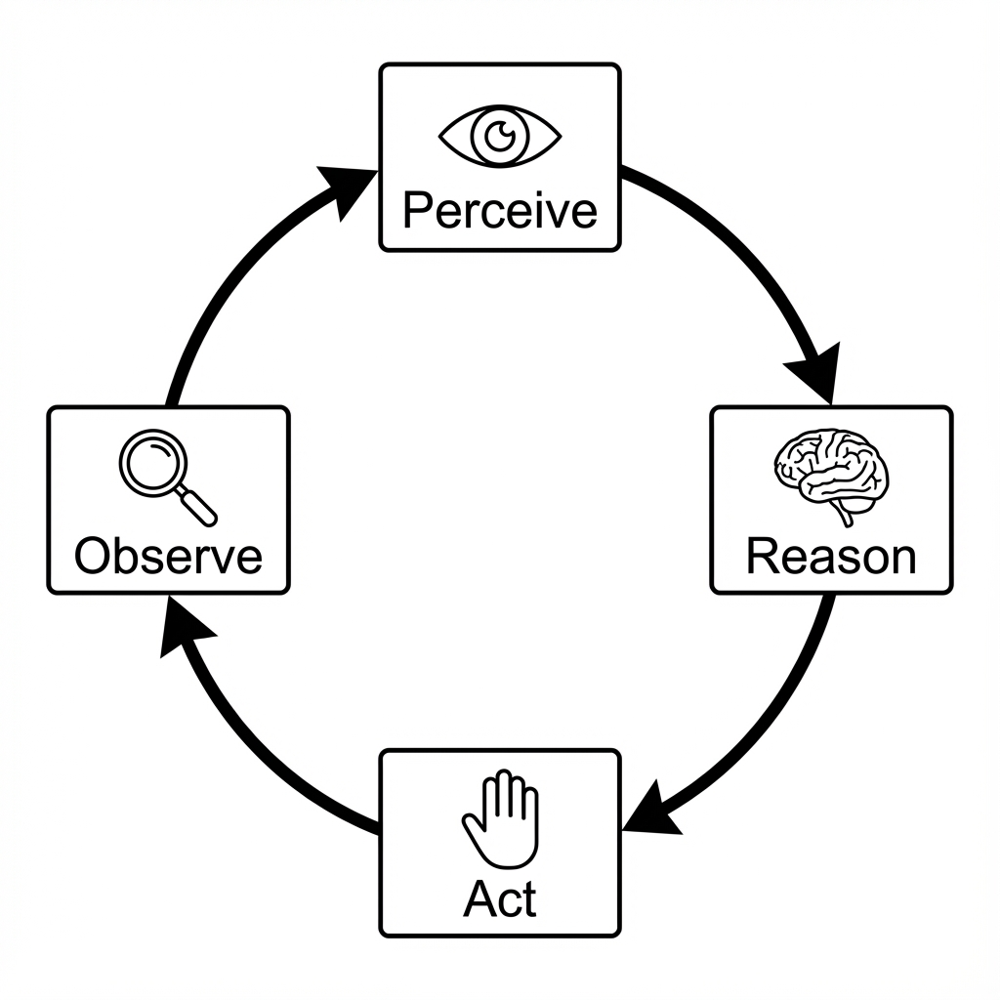

# Structured Output

Generative AI is powerful, but extracting reliable data can be challenging. `@philjs/ai` provides a robust, type-safe structured output engine powered by [Zod](https://zod.dev/).

## Features

- **Type Safety**: Full TypeScript inference from your Zod schemas.
- **Automatic Validation**: Runtime validation of AI responses.
- **Auto-Retry**: Automatically feeds validation errors back to the model to correct mistakes.
- **Streaming**: Incrementally validate and parse streaming JSON responses.


*Figure 10-1: JSON Schema Validation Pipeline*

## Basic Usage

### standard `generateStructured`

```typescript
import { z } from 'zod';
import { generateStructured } from '@philjs/ai';
import { openaiProvider } from '@philjs/ai/providers';

// 1. Define your schema
const UserSchema = z.object({
  name: z.string(),
  age: z.number(),
  role: z.enum(['admin', 'user', 'guest']),
  skills: z.array(z.string()),
});

// 2. Generate
const result = await generateStructured(
  openaiProvider,
  'Extract user info: Alice is a 28-year-old admin who knows Python and Rust.',
  UserSchema
);

// 3. Use typed data
console.log(result.data.name); // "Alice"
console.log(result.data.role); // "admin"
```

## Advanced Features

### Streaming Validation

You can stream structured data as it's being generated. The parser handles incomplete JSON gracefully.

```typescript
import { streamStructured } from '@philjs/ai';

const stream = streamStructured(provider, prompt, UserSchema);

for await (const chunk of stream) {
  if (chunk.complete) {
    console.log('Valid User:', chunk.data);
  } else {
    // chunk.raw contains partial JSON
    console.log('Loading:', chunk.raw);
  }
}
```

### Auto-Correction

If the AI generates invalid JSON or misses a required field, the engine catches the `ZodError`, reformats it as a prompt, and asks the AI to fix it—up to `maxRetries` times.

```typescript
const result = await generateStructured(provider, prompt, schema, {
  maxRetries: 3, // Default
  includeErrorInRetry: true, // Show the model what went wrong
  onValidationError: (error, attempt) => {
    console.warn(`Attempt ${attempt} failed: ${error.message}`);
  }
});
```

### Typed Generators

Create reusable, type-safe extraction functions.

```typescript
import { createStructuredGenerator } from '@philjs/ai';

const extractSentiment = createStructuredGenerator(
  provider,
  z.object({
    sentiment: z.enum(['positive', 'negative']),
    score: z.number()
  })
);

// Returns { sentiment: 'positive', score: 0.9 }
const result = await extractSentiment('This library is amazing!');
```

## Common Schemas

The package includes pre-built schemas for common tasks.

```typescript
import { commonSchemas } from '@philjs/ai';

// Includes sentiment, entities, summary, classification, translation
const result = await generateStructured(
  provider, 
  text, 
  commonSchemas.sentiment
);
```
