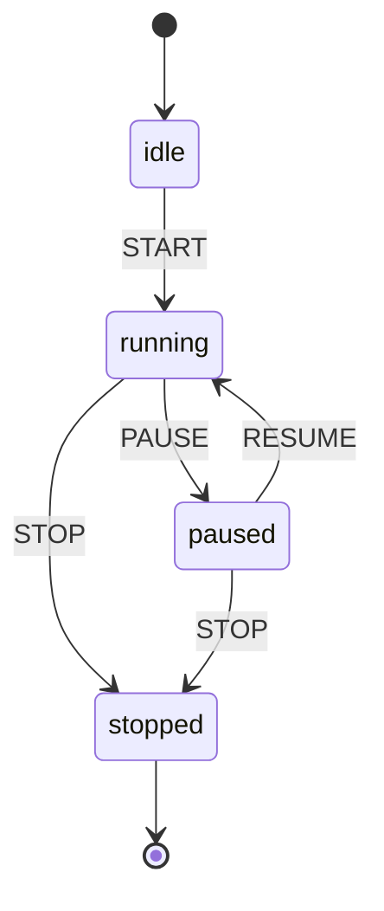

# Package Atlas

A complete catalog of every package in the PhilJS monorepo. Each entry is derived from the package manifests and source so the book stays aligned with the codebase.

## How to read this catalog

- Package names and versions come from `packages/*/package.json` or `packages/*/Cargo.toml`.
- Descriptions, keywords, and entry points mirror the manifests.
- Each package entry includes a generated API snapshot plus the package README content.
- Use the index below to jump directly to a package entry.

## Package Index

- [@philjs/3d](#pkg-philjs-3d)
- [@philjs/3d-physics](#pkg-philjs-3d-physics)
- [@philjs/a11y-ai](#pkg-philjs-a11y-ai)
- [@philjs/ab-testing](#pkg-philjs-ab-testing)
- [@philjs/adapters](#pkg-philjs-adapters)
- [@philjs/ai](#pkg-philjs-ai)
- [@philjs/ai-agents](#pkg-philjs-ai-agents)
- [@philjs/ambient](#pkg-philjs-ambient)
- [@philjs/analytics](#pkg-philjs-analytics)
- [@philjs/api](#pkg-philjs-api)
- [@philjs/atoms](#pkg-philjs-atoms)
- [@philjs/auth](#pkg-philjs-auth)
- [@philjs/benchmark](#pkg-philjs-benchmark)
- [@philjs/biometric](#pkg-philjs-biometric)
- [@philjs/build](#pkg-philjs-build)
- [@philjs/builder](#pkg-philjs-builder)
- [@philjs/carbon](#pkg-philjs-carbon)
- [@philjs/cdn](#pkg-philjs-cdn)
- [@philjs/cells](#pkg-philjs-cells)
- [@philjs/charts](#pkg-philjs-charts)
- [@philjs/cli](#pkg-philjs-cli)
- [@philjs/collab](#pkg-philjs-collab)
- [@philjs/compiler](#pkg-philjs-compiler)
- [@philjs/content](#pkg-philjs-content)
- [@philjs/core](#pkg-philjs-core)
- [@philjs/crossdevice](#pkg-philjs-crossdevice)
- [@philjs/css](#pkg-philjs-css)
- [@philjs/dashboard](#pkg-philjs-dashboard)
- [@philjs/db](#pkg-philjs-db)
- [@philjs/desktop](#pkg-philjs-desktop)
- [@philjs/devtools](#pkg-philjs-devtools)
- [@philjs/devtools-extension](#pkg-philjs-devtools-extension)
- [@philjs/digital-twin](#pkg-philjs-digital-twin)
- [@philjs/dnd](#pkg-philjs-dnd)
- [@philjs/docs](#pkg-philjs-docs)
- [@philjs/edge](#pkg-philjs-edge)
- [@philjs/edge-ai](#pkg-philjs-edge-ai)
- [@philjs/edge-mesh](#pkg-philjs-edge-mesh)
- [@philjs/editor](#pkg-philjs-editor)
- [@philjs/email](#pkg-philjs-email)
- [@philjs/enterprise](#pkg-philjs-enterprise)
- [@philjs/errors](#pkg-philjs-errors)
- [@philjs/event-sourcing](#pkg-philjs-event-sourcing)
- [@philjs/export](#pkg-philjs-export)
- [@philjs/eye-tracking](#pkg-philjs-eye-tracking)
- [@philjs/forms](#pkg-philjs-forms)
- [@philjs/genui](#pkg-philjs-genui)
- [@philjs/gesture](#pkg-philjs-gesture)
- [@philjs/go](#pkg-philjs-go)
- [@philjs/graphql](#pkg-philjs-graphql)
- [@philjs/haptic](#pkg-philjs-haptic)
- [@philjs/hollow](#pkg-philjs-hollow)
- [@philjs/html](#pkg-philjs-html)
- [@philjs/hypermedia](#pkg-philjs-hypermedia)
- [@philjs/i18n](#pkg-philjs-i18n)
- [@philjs/image](#pkg-philjs-image)
- [@philjs/inspector](#pkg-philjs-inspector)
- [@philjs/intent](#pkg-philjs-intent)
- [@philjs/islands](#pkg-philjs-islands)
- [@philjs/jobs](#pkg-philjs-jobs)
- [@philjs/kotlin](#pkg-philjs-kotlin)
- [@philjs/liveview](#pkg-philjs-liveview)
- [@philjs/llm-ui](#pkg-philjs-llm-ui)
- [@philjs/maps](#pkg-philjs-maps)
- [@philjs/media-stream](#pkg-philjs-media-stream)
- [@philjs/meta](#pkg-philjs-meta)
- [@philjs/migrate](#pkg-philjs-migrate)
- [@philjs/motion](#pkg-philjs-motion)
- [@philjs/native](#pkg-philjs-native)
- [@philjs/neural](#pkg-philjs-neural)
- [@philjs/observability](#pkg-philjs-observability)
- [@philjs/offline](#pkg-philjs-offline)
- [@philjs/openapi](#pkg-philjs-openapi)
- [@philjs/optimizer](#pkg-philjs-optimizer)
- [@philjs/payments](#pkg-philjs-payments)
- [@philjs/pdf](#pkg-philjs-pdf)
- [@philjs/perf](#pkg-philjs-perf)
- [@philjs/perf-budget](#pkg-philjs-perf-budget)
- [@philjs/playground](#pkg-philjs-playground)
- [@philjs/plugin-analytics](#pkg-philjs-plugin-analytics)
- [@philjs/plugin-i18n](#pkg-philjs-plugin-i18n)
- [@philjs/plugin-pwa](#pkg-philjs-plugin-pwa)
- [@philjs/plugin-seo](#pkg-philjs-plugin-seo)
- [@philjs/plugin-tailwind](#pkg-philjs-plugin-tailwind)
- [@philjs/plugins](#pkg-philjs-plugins)
- [@philjs/poem](#pkg-philjs-poem)
- [@philjs/pwa](#pkg-philjs-pwa)
- [@philjs/python](#pkg-philjs-python)
- [@philjs/qr](#pkg-philjs-qr)
- [@philjs/quantum](#pkg-philjs-quantum)
- [@philjs/realtime](#pkg-philjs-realtime)
- [@philjs/resumable](#pkg-philjs-resumable)
- [@philjs/rich-text](#pkg-philjs-rich-text)
- [@philjs/rocket](#pkg-philjs-rocket)
- [@philjs/router](#pkg-philjs-router)
- [@philjs/router-typesafe](#pkg-philjs-router-typesafe)
- [@philjs/rpc](#pkg-philjs-rpc)
- [@philjs/runtime](#pkg-philjs-runtime)
- [@philjs/scene](#pkg-philjs-scene)
- [@philjs/screen-share](#pkg-philjs-screen-share)
- [@philjs/security-scanner](#pkg-philjs-security-scanner)
- [@philjs/spatial-audio](#pkg-philjs-spatial-audio)
- [@philjs/sqlite](#pkg-philjs-sqlite)
- [@philjs/ssr](#pkg-philjs-ssr)
- [@philjs/storage](#pkg-philjs-storage)
- [@philjs/storybook](#pkg-philjs-storybook)
- [@philjs/studio](#pkg-philjs-studio)
- [@philjs/styles](#pkg-philjs-styles)
- [@philjs/swift](#pkg-philjs-swift)
- [@philjs/table](#pkg-philjs-table)
- [@philjs/tailwind](#pkg-philjs-tailwind)
- [@philjs/templates](#pkg-philjs-templates)
- [@philjs/testing](#pkg-philjs-testing)
- [@philjs/time-travel](#pkg-philjs-time-travel)
- [@philjs/trpc](#pkg-philjs-trpc)
- [@philjs/ui](#pkg-philjs-ui)
- [@philjs/vector](#pkg-philjs-vector)
- [@philjs/vector-store](#pkg-philjs-vector-store)
- [@philjs/video-chat](#pkg-philjs-video-chat)
- [@philjs/virtual](#pkg-philjs-virtual)
- [@philjs/voice](#pkg-philjs-voice)
- [@philjs/vscode](#pkg-philjs-vscode)
- [@philjs/wasm](#pkg-philjs-wasm)
- [@philjs/webgpu](#pkg-philjs-webgpu)
- [@philjs/webrtc](#pkg-philjs-webrtc)
- [@philjs/workers](#pkg-philjs-workers)
- [@philjs/workflow](#pkg-philjs-workflow)
- [@philjs/xr](#pkg-philjs-xr)
- [@philjs/xstate](#pkg-philjs-xstate)
- [@philjs/zig](#pkg-philjs-zig)
- [@philjs/zustand](#pkg-philjs-zustand)
- [cargo-philjs](#pkg-cargo-philjs)
- [create-philjs](#pkg-create-philjs)
- [create-philjs-plugin](#pkg-create-philjs-plugin)
- [eslint-config-philjs](#pkg-eslint-config-philjs)
- [eslint-plugin-philjs](#pkg-eslint-plugin-philjs)
- [philjs](#pkg-philjs)
- [philjs-actix](#pkg-philjs-actix)
- [philjs-axum](#pkg-philjs-axum)
- [philjs-macros](#pkg-philjs-macros)
- [philjs-mobile](#pkg-philjs-mobile)
- [philjs-seaorm](#pkg-philjs-seaorm)
- [philjs-sqlx](#pkg-philjs-sqlx)
- [philjs-tauri](#pkg-philjs-tauri)
- [philjs-tokio](#pkg-philjs-tokio)
- [philjs-tui](#pkg-philjs-tui)

## Package Entries

<a id="pkg-philjs-3d"></a>
## @philjs/3d
- Type: Node package
- Purpose: WebGL and game engine integrations for PhilJS - Three.js, Godot, Unreal, Unity
- Version: 0.1.0
- Location: packages/philjs-3d
- Entry points: packages/philjs-3d/src/index.ts, packages/philjs-3d/src/webgl/index.ts, packages/philjs-3d/src/three/index.ts, packages/philjs-3d/src/godot/index.ts, packages/philjs-3d/src/unreal/index.ts, packages/philjs-3d/src/unity/index.ts
- Keywords: philjs, webgl, three, threejs, godot, unreal, unity, game-engine, 3d, graphics, pixel-streaming

### PhilJS 3D

WebGL and game engine integrations for PhilJS. This package provides comprehensive 3D graphics and game engine support, making PhilJS competitive for game development and 3D web experiences.

#### Features

- **WebGL Integration** - Low-level WebGL with shaders, buffers, textures, and primitives
- **Three.js Integration** - Hooks and components for Three.js
- **Godot Integration** - Embed Godot HTML5 exports with bidirectional communication
- **Unreal Engine Integration** - Pixel Streaming support for UE5
- **Unity Integration** - Embed Unity WebGL builds with message passing

#### Installation

```bash
npm install philjs-3d
```

#### WebGL Integration

Full WebGL support with WebGL2 fallback:

```typescript
import {
  createWebGLContext,
  createProgram,
  createCube,
  createCamera,
  createAnimationLoop,
  WebGLCanvas,
} from 'philjs-3d/webgl';

// Create WebGL context
const { gl, isWebGL2 } = createWebGLContext(canvas, {
  antialias: true,
  preferWebGL2: true,
});

// Create shader program
const program = createProgram(gl, {
  vertex: vertexShaderSource,
  fragment: fragmentShaderSource,
});

// Create geometry
const cube = createCube(1);

// Create camera
const camera = createCamera({
  position: [0, 2, 5],
  target: [0, 0, 0],
  fov: Math.PI / 4,
});

// Animation loop
const loop = createAnimationLoop((info) => {
  // Render frame
});
loop.start();
```

##### WebGLCanvas Component

```tsx
<WebGLCanvas
  width={800}
  height={600}
  onInit={(result) => {
    // Initialize scene
  }}
  onFrame={(info, gl) => {
    // Render frame
  }}
/>
```

#### Three.js Integration

Seamless Three.js integration with PhilJS hooks:

```typescript
import {
  useThree,
  useFrame,
  loadThree,
  ThreeCanvas,
} from 'philjs-3d/three';

// Load Three.js
const THREE = await loadThree();

// Create scene
const state = await initThree(canvas, {
  antialias: true,
  shadows: true,
  camera: {
    fov: 75,
    position: [0, 2, 5],
  },
});

// Add objects
const geometry = new THREE.BoxGeometry(1, 1, 1);
const material = new THREE.MeshStandardMaterial({ color: 0x00ff00 });
const cube = new THREE.Mesh(geometry, material);
state.scene.add(cube);

// Animation
useFrame(canvas, ({ time, delta }) => {
  cube.rotation.x += delta;
  cube.rotation.y += delta;
});
```

##### ThreeCanvas Component

```tsx
<ThreeCanvas
  width={800}
  height={600}
  camera={{ position: [0, 2, 5] }}
  onCreated={(state) => {
    // Setup scene
  }}
  onFrame={(state, delta) => {
    // Animate
  }}
/>
```

#### Godot Integration

Embed Godot HTML5 exports with signal communication:

```typescript
import {
  GodotEmbed,
  useGodot,
  callGodot,
  onGodotSignal,
} from 'philjs-3d/godot';

// Use Godot hook
const { godot, isLoading, callGodot, onGodotSignal } = useGodot(canvas);

// Call Godot methods
callGodot('/root/Player', 'take_damage', 10);

// Listen to Godot signals
const cleanup = onGodotSignal('/root/Player', 'health_changed', (health) => {
  console.log('Health:', health);
});
```

##### GodotEmbed Component

```tsx
<GodotEmbed
  pckPath="/game/game.pck"
  width={1280}
  height={720}
  onReady={(godot) => {
    // Game ready
  }}
  onProgress={(current, total) => {
    // Loading progress
  }}
/>
```

#### Unreal Engine Integration

Pixel Streaming for Unreal Engine 5:

```typescript
import {
  UnrealEmbed,
  useUnreal,
  setupInputForwarding,
} from 'philjs-3d/unreal';

// Use Unreal hook
const { unreal, isConnected, stats, executeCommand } = useUnreal(video);

// Execute console commands
executeCommand('r.ScreenPercentage 100');

// Send custom messages
unreal.sendMessage('CustomEvent', { data: 'value' });

// Listen to events
unreal.on('message', (data) => {
  console.log('From UE:', data);
});
```

##### UnrealEmbed Component

```tsx
<UnrealEmbed
  serverUrl="wss://your-signaling-server.com"
  width={1920}
  height={1080}
  enableInput={true}
  showControls={true}
  onConnect={(instance) => {
    // Connected
  }}
  onStats={(stats) => {
    // FPS, latency, etc.
  }}
/>
```

#### Unity Integration

Embed Unity WebGL builds:

```typescript
import {
  UnityEmbed,
  useUnity,
  sendMessage,
  registerUnityCallback,
} from 'philjs-3d/unity';

// Use Unity hook
const { unity, isReady, progress, sendMessage } = useUnity(canvas);

// Send messages to Unity
sendMessage('Player', 'TakeDamage', 10);

// Register callbacks for Unity to call
registerUnityCallback('OnScoreUpdate', (score) => {
  console.log('Score:', score);
});

// Signal bridges
createUnitySignalBridge('OnHealthChange', setHealth);
createPhilJSSignalBridge(canvas, 'GameManager', 'SetDifficulty', getDifficulty);
```

##### UnityEmbed Component

```tsx
<UnityEmbed
  buildUrl="/unity-build/Build"
  width={960}
  height={600}
  showProgress={true}
  onReady={(unity) => {
    // Unity ready
  }}
  onProgress={(progress) => {
    // Loading progress
  }}
/>
```

#### API Reference

##### WebGL

- `createWebGLContext(canvas, options)` - Initialize WebGL context
- `createProgram(gl, source)` - Create shader program
- `createCube/Sphere/Plane/Cylinder/Torus(size)` - Create primitives
- `createCamera(options)` - Create camera
- `createAnimationLoop(callback)` - Create animation loop
- `useWebGL(canvas, options)` - Hook for WebGL

##### Three.js

- `loadThree()` - Load Three.js dynamically
- `initThree(canvas, options)` - Initialize Three.js
- `useThree(canvas)` - Get Three.js state
- `useFrame(canvas, callback)` - Animation frame hook
- `useLoader(loader, url)` - Asset loading hook

##### Godot

- `createGodotInstance(canvas, props)` - Create Godot instance
- `useGodot(canvas)` - Hook for Godot
- `callGodot(canvas, nodePath, method, args)` - Call Godot method
- `onGodotSignal(canvas, nodePath, signal, callback)` - Listen to signal
- `createGodotBridge(canvas, nodePath, options)` - Bidirectional sync

##### Unreal

- `createPixelStreamingInstance(video, props)` - Create Pixel Streaming
- `useUnreal(video)` - Hook for Unreal
- `setupInputForwarding(video, instance)` - Forward inputs

##### Unity

- `createUnityInstance(canvas, props)` - Create Unity instance
- `useUnity(canvas)` - Hook for Unity
- `sendMessage(canvas, gameObject, method, param)` - Send message
- `registerUnityCallback(name, handler)` - Register callback
- `createUnitySignalBridge(name, setValue)` - Unity to PhilJS
- `createPhilJSSignalBridge(canvas, gameObject, method, getValue)` - PhilJS to Unity


#### API Snapshot

This section is generated from the package source. Run `node scripts/generate-package-atlas.mjs` to refresh.

##### Entry Points
- Export keys: ., ./webgl, ./three, ./godot, ./unreal, ./unity
- Source files: packages/philjs-3d/src/index.ts, packages/philjs-3d/src/webgl/index.ts, packages/philjs-3d/src/three/index.ts, packages/philjs-3d/src/godot/index.ts, packages/philjs-3d/src/unreal/index.ts, packages/philjs-3d/src/unity/index.ts

##### Public API
- Direct exports: (none detected)
- Re-exported names: // Animation
  createAnimationLoop, // Assets
  loadBevyAsset, // Buffers
  createBuffer, // Camera and Math
  mat4Identity, // Components
  BevyEmbed, // Components
  GodotEmbed, // Components
  ThreeCanvas, // Components
  UnityEmbed, // Components
  UnrealEmbed, // Components
  WebGLCanvas, // Context
  createWebGLContext, // ECS Bridge
  setSignalCreator, // Hooks
  createBevyInstance, // Hooks
  createGodotInstance, // Hooks
  createPixelStreamingInstance, // Hooks
  createUnityInstance, // Hooks
  loadThree, // Hooks
  useWebGL, // Primitives
  createCube, // Shaders
  compileShader, // Textures
  createTextureFromImage, // Types
  type BevyConfig, // Types
  type GodotEngine, // Types
  type PixelStreamingConfig, // Types
  type ThreeModule, // Types
  type UnityInstance, // Types
  type WebGLContextOptions, AnimationFrameInfo, AnimationLoop, AssetBundle, AssetHandle, AssetMetadata, AssetState, BASIC_FRAGMENT_SHADER, BASIC_VERTEX_SHADER, BevyApp, BevyAssetType, BevyComponent, BevyEmbedProps, BevyEntity, BevyEvent, BevyEventData, BevyEventListener, BevyEventType, BevyFPSCounter, BevyFullscreenButton, BevyGamepadState, BevyInstance, BevyMouseButton, BevyPauseButton, BevyQuery, BevyResource, BevyState, BevyWorld, BufferInfo, Camera, CameraOptions, ChildrenComponent, ComponentBridge, ComponentType, ConsoleCommandOptions, Easing, EntityBridge, EntityGeneration, EntityId, FrameCallback, FrameInfo, GamepadAxis, GamepadButton, GamepadInputData, GlobalTransformComponent, GodotConfig, GodotEmbed, GodotEmbedProps, GodotEngine, GodotInstance, GodotJSInterface, GodotLoadingIndicator, GodotState, InputResource, KeyCode, KeyboardInputData, LoaderResult, Mat3, Mat4, MouseInputData, NameComponent, ParentComponent, PixelStreamingConfig, PixelStreamingInputEvent, PixelStreamingInstance, PrimitiveGeometry, Quat, QueryFilter, QueryResult, ResourceType, ShaderProgram, ShaderSource, SignalHandler, TEXTURED_FRAGMENT_SHADER, TEXTURED_VERTEX_SHADER, TextureInfo, TextureOptions, ThreeCamera, ThreeCanvas, ThreeCanvasProps, ThreeClock, ThreeColor, ThreeEuler, ThreeGLTF, ThreeGLTFLoader, ThreeModule, ThreeObject3D, ThreeOrthographicCamera, ThreePerspectiveCamera, ThreeQuaternion, ThreeRenderer, ThreeRendererOptions, ThreeScene, ThreeState, ThreeTexture, ThreeTextureLoader, ThreeVector3, TimeResource, TouchInputData, Transform, TransformComponent, UNLIT_FRAGMENT_SHADER, UNLIT_VERTEX_SHADER, UnityCallback, UnityConfig, UnityEmbed, UnityEmbedProps, UnityEventHandler, UnityEventType, UnityFullscreenButton, UnityInstance, UnityInstanceWrapper, UnityLoadingProgress, UnityMessage, UnityModule, UnityProgressBar, UnityState, UnrealCustomEvent, UnrealEmbed, UnrealEmbedProps, UnrealState, UnrealStatsOverlay, UseBevyEntityResult, UseBevyQueryResult, UseBevyResourceResult, UseBevyResult, UseGodotResult, UseUnityResult, UseUnrealResult, Vec2, Vec3, Vec4, VertexArrayInfo, VisibilityComponent, WebGLCanvas, WebGLCanvasProps, WebGLContextOptions, WebGLContextResult, WebGLExtensions, WebGLHookContext, WebGLState, WebRTCStats, WindowResource, addToScene, bindTexture, bindVertexArray, callGodot, cleanupWebGL, clearAsset, clearAssetCache, clearContext, compileShader, createAnimationLoop, createAnimator, createBevyEmbedElement, createBuffer, createBufferInfo, createCamera, createComponentBridge, createCone, createCube, createCubemapTexture, createCustomComponent, createCylinder, createDataTexture, createEntityBridge, createFixedTimestepLoop, createGodotBridge, createGodotEmbedElement, createGodotInstance, createNameComponent, createPhilJSSignalBridge, createPixelStreamingInstance, createPlaceholderTexture, createPlane, createProgram, createRoundedBox, createSphere, createTextureFromImage, createThreeCanvasElement, createTorus, createTransformComponent, createUnityEmbedElement, createUnityInstance, createUnitySignalBridge, createUnrealEmbedElement, createVertexArray, createVertexArrayInfo, createVisibilityComponent, createWebGLCanvasElement, createWebGLContext, defineAssetBundle, deleteBuffer, deleteProgram, deleteTexture, deleteVertexArray, deleteVertexArrayInfo, despawnEntity, disposeAllBevy, disposeAllBridges, disposeBevy, disposeGodot, disposeThree, disposeUnity, disposeUnreal, drawVertexArray, enableDefaultFeatures, findEntitiesWith, findEntityWith, getAllBevyInstances, getAssetBundle, getAssetMetadata, getBevy, getCacheCount, getCacheSize, getCachedAsset, getCachedAssetPaths, getLoadingProgress, getThree, getViewProjectionMatrix, getWebGLCapabilities, initThree, insertComponent, isAssetCached, isAssetLoaded, isBevySupported, isBundleLoaded, isWebGL2Supported, isWebGLSupported, lerp, lerpVec3, loadAssetBundle, loadGLTFAsync, loadTexture, loadTextureAsync, loadThree, mat3FromMat4, mat3InvertTranspose, mat4Identity, mat4Invert, mat4LookAt, mat4Multiply, mat4Orthographic, mat4Perspective, mat4RotateX, mat4RotateY, mat4RotateZ, mat4Scale, mat4Translate, mat4Transpose, mergeGeometries, onBevyEvent, onGodotSignal, onUnityEvent, orbitCamera, preloadAssets, preloadAssetsWithPriority, queryEntities, registerUnityCallback, removeComponent, removeFrameCallback, removeFromScene, resizeCanvas, resizeThree, sendBevyEvent, sendMessage, setCameraAspect, setCameraLookAt, setCameraPosition, setCameraTarget, setThreeCameraPosition, setUniform, setUniforms, setupInputForwarding, setupVertexAttributes, slerp, spawnEntity, startAnimationLoop, streamAsset, syncFromGodot, syncToGodot, trackEntities, trackEntity, transformGeometry, unbindTexture, unloadAssetBundle, updateBuffer, updateCameraProjection, updateCameraView, updateTexture, useActiveProgram, useAnimationFrame, useAutoResize, useBevy, useBevyEntity, useBevyQuery, useBevyResource, useCamera, useFrame, useGodot, useLoader, useProgram, useRenderPass, useShaderProgram, useThree, useUniforms, useUnity, useUnreal, useWebGL, watchAsset, zoomCamera
- Re-exported modules: ./GodotEmbed.js, ./ThreeCanvas.js, ./UnityEmbed.js, ./UnrealEmbed.js, ./WebGLCanvas.js, ./animation.js, ./bevy/index.js, ./buffers.js, ./camera.js, ./context.js, ./godot/index.js, ./hooks.js, ./primitives.js, ./shaders.js, ./textures.js, ./three/index.js, ./types.js, ./unity/index.js, ./unreal/index.js, ./webgl/index.js

#### License

MIT

<a id="pkg-philjs-3d-physics"></a>
## @philjs/3d-physics
- Type: Node package
- Purpose: High-performance 3D physics engine for PhilJS - rigid bodies, vehicles, ragdolls, character controllers
- Version: 0.1.0
- Location: packages/philjs-3d-physics
- Entry points: packages/philjs-3d-physics/src/index.ts
- Keywords: philjs, physics, 3d, rapier, rigid-body, vehicle, ragdoll, game

### @philjs/3d-physics

High-performance 3D physics engine for PhilJS applications with multiple backend support.


#### Features

- Multiple physics backends (Rapier, Cannon.js, Ammo.js)
- Rigid body dynamics with continuous collision detection
- Soft body simulation (cloth, rope, deformables)
- Joints and constraints (hinge, ball, slider, spring)
- Vehicle physics (car, tank, hover)
- Character controller with ground detection
- Ragdoll physics
- Deterministic physics for multiplayer

#### Installation

```bash
npm install @philjs/3d-physics
```

#### Usage

##### Basic Physics World

```typescript
import { PhysicsWorld, usePhysicsWorld, useRigidBody } from '@philjs/3d-physics';

// Create a physics world with Rapier backend
const world = await PhysicsWorld.create({
  backend: 'rapier',
  gravity: { x: 0, y: -9.81, z: 0 },
  enableCCD: true,
  enableSleeping: true
});

// Add a dynamic rigid body
world.createRigidBody('ball', {
  type: 'dynamic',
  mass: 1,
  friction: 0.5,
  restitution: 0.7
}, { x: 0, y: 10, z: 0 }, { x: 0, y: 0, z: 0, w: 1 });

world.addCollider('ball', {
  shape: 'sphere',
  radius: 0.5
});

// Step the simulation
world.step(1/60);
```

##### Character Controller

```typescript
import { useCharacterController } from '@philjs/3d-physics';

const controller = useCharacterController(world, 'player', {
  height: 1.8,
  radius: 0.3,
  stepHeight: 0.35,
  slopeLimit: 45,
  speed: 5,
  jumpForce: 8
});

// Move the character
controller.move({ x: 1, y: 0, z: 0 });
controller.jump();

// Check ground state
if (controller.isGrounded()) {
  // Character is on the ground
}
```

##### Vehicle Physics

```typescript
import { useVehicle } from '@philjs/3d-physics';

const vehicle = useVehicle(world, 'car', {
  chassis: {
    mass: 1500,
    size: { x: 2, y: 0.5, z: 4 }
  },
  wheels: [
    { position: { x: -0.8, y: -0.3, z: 1.2 }, radius: 0.4, isSteering: true },
    { position: { x: 0.8, y: -0.3, z: 1.2 }, radius: 0.4, isSteering: true },
    { position: { x: -0.8, y: -0.3, z: -1.2 }, radius: 0.4, isDrive: true },
    { position: { x: 0.8, y: -0.3, z: -1.2 }, radius: 0.4, isDrive: true }
  ],
  maxSpeed: 50,
  acceleration: 20
});

// Control the vehicle
vehicle.accelerate(1.0);   // 0-1 throttle
vehicle.steer(-0.5);       // -1 to 1 steering
vehicle.brake(0.8);        // 0-1 brake force
```

##### Ragdoll Physics

```typescript
import { useRagdoll } from '@philjs/3d-physics';

const ragdoll = useRagdoll(world, 'enemy', { x: 0, y: 5, z: 0 }, {
  scale: 1.0,
  limbMass: 2
});

// Get bone positions for rendering
const headPos = ragdoll.getBonePosition('head');
const headRot = ragdoll.getBoneRotation('head');

// Apply impact force
ragdoll.applyImpulse('chest', { x: 100, y: 50, z: 0 });
```

##### Raycasting

```typescript
// Cast a ray
const hit = world.raycast(
  { x: 0, y: 10, z: 0 },  // origin
  { x: 0, y: -1, z: 0 },  // direction
  100                      // max distance
);

if (hit.hit) {
  console.log('Hit body:', hit.bodyId);
  console.log('Hit point:', hit.point);
  console.log('Distance:', hit.distance);
}
```

#### API Reference

##### PhysicsWorld

| Method | Description |
|--------|-------------|
| `create(config)` | Create a new physics world |
| `step(dt)` | Step the simulation |
| `createRigidBody(id, config, position, rotation)` | Create a rigid body |
| `removeRigidBody(id)` | Remove a rigid body |
| `addCollider(bodyId, config)` | Add a collider to a body |
| `createJoint(id, config)` | Create a joint between bodies |
| `raycast(origin, direction, maxDistance)` | Cast a ray |
| `getPosition(bodyId)` | Get body position |
| `applyForce(bodyId, force)` | Apply force to a body |
| `applyImpulse(bodyId, impulse)` | Apply impulse to a body |

##### Hooks

| Hook | Description |
|------|-------------|
| `usePhysicsWorld(config)` | Create and manage a physics world |
| `useRigidBody(world, id, config)` | Create and manage a rigid body |
| `useCharacterController(world, id, config)` | Character controller with movement |
| `useVehicle(world, id, config)` | Vehicle physics controller |
| `useRagdoll(world, id, position, config)` | Ragdoll physics system |

##### Types

```typescript
interface PhysicsConfig {
  backend: 'rapier' | 'cannon' | 'ammo';
  gravity?: Vector3;
  timestep?: number;
  substeps?: number;
  enableCCD?: boolean;
  enableSleeping?: boolean;
  deterministic?: boolean;
}

interface RigidBodyConfig {
  type: 'dynamic' | 'static' | 'kinematic';
  mass?: number;
  friction?: number;
  restitution?: number;
  linearDamping?: number;
  angularDamping?: number;
}

interface ColliderConfig {
  shape: 'box' | 'sphere' | 'capsule' | 'cylinder' | 'convex' | 'trimesh';
  size?: Vector3;
  radius?: number;
  height?: number;
  isSensor?: boolean;
}
```


#### API Snapshot

This section is generated from the package source. Run `node scripts/generate-package-atlas.mjs` to refresh.

##### Entry Points
- Export keys: .
- Source files: packages/philjs-3d-physics/src/index.ts

##### Public API
- Direct exports: // Core classes
  PhysicsWorld, // Hooks
  usePhysicsWorld, // Types
  type Vector3, AmmoBackend, CannonBackend, CharacterConfig, CharacterController, ColliderConfig, ContactEvent, JointConfig, PhysicsBackend, PhysicsConfig, Quaternion, Ragdoll, RagdollConfig, RapierBackend, RaycastResult, RigidBodyConfig, VehicleConfig, VehicleController, WheelConfig, useCharacterController, useRagdoll, useRigidBody, useVehicle
- Re-exported names: (none detected)
- Re-exported modules: (none detected)

#### License

MIT

<a id="pkg-philjs-a11y-ai"></a>
## @philjs/a11y-ai
- Type: Node package
- Purpose: AI-powered accessibility for PhilJS - automatic alt text, ARIA labels, and contrast fixes
- Version: 0.1.0
- Location: packages/philjs-a11y-ai
- Entry points: packages/philjs-a11y-ai/src/index.ts
- Keywords: philjs, accessibility, a11y, ai, wcag, aria, alt-text, contrast

### @philjs/a11y-ai

AI-powered accessibility toolkit that automatically detects and fixes WCAG compliance issues.


#### Features

- Auto-generate alt text for images using AI vision
- Fix color contrast issues automatically
- Add missing ARIA labels intelligently
- Generate accessible descriptions
- Keyboard navigation optimization
- Screen reader optimization
- Focus management
- WCAG A/AA/AAA compliance checking

#### Installation

```bash
npm install @philjs/a11y-ai
```

#### Usage

##### Basic Audit

```typescript
import { A11yAI, initA11yAI } from '@philjs/a11y-ai';

// Initialize with AI provider
const a11y = new A11yAI({
  provider: 'openai',
  apiKey: 'your-api-key',
  wcagLevel: 'AA',
  autoFix: true
});

// Run accessibility audit
const report = await a11y.audit(document.body);

console.log('Score:', report.score);
console.log('Issues found:', report.summary.totalIssues);
console.log('Auto-fixed:', report.summary.fixed);
```

##### AI-Generated Alt Text

```typescript
import { useAutoAltText } from '@philjs/a11y-ai';

// Generate alt text for an image
const altText = await useAutoAltText(
  'https://example.com/image.jpg',
  'Product photo on e-commerce page'
);

console.log(altText.text);        // "Red leather handbag with gold buckle"
console.log(altText.confidence);  // 0.92
```

##### Global Initialization

```typescript
import { initA11yAI, useA11yAudit } from '@philjs/a11y-ai';

// Initialize once
initA11yAI({
  provider: 'anthropic',
  apiKey: process.env.ANTHROPIC_KEY,
  wcagLevel: 'AAA',
  autoFix: true,
  languages: ['en', 'es']
});

// Use anywhere in your app
const report = await useA11yAudit();
```

##### Color Contrast Fixes

```typescript
import { getContrastRatio, adjustColorForContrast } from '@philjs/a11y-ai';

// Check contrast ratio
const ratio = getContrastRatio('#666666', '#ffffff');
console.log(ratio); // 5.74

// Auto-fix low contrast
const fixedColor = adjustColorForContrast(
  '#999999',    // foreground
  '#ffffff',    // background
  4.5           // target ratio (WCAG AA)
);
console.log(fixedColor); // "rgb(118, 118, 118)"
```

##### Working with Reports

```typescript
const report = await a11y.audit();

// Iterate through issues
for (const issue of report.issues) {
  console.log(`[${issue.severity}] ${issue.description}`);
  console.log(`  WCAG: ${issue.wcagCriteria.join(', ')}`);
  console.log(`  Element: ${issue.selector}`);
  console.log(`  Auto-fixable: ${issue.autoFixable}`);
}

// Check issues by type
console.log('Missing alt texts:', report.summary.byType['missing-alt']);
console.log('Low contrast:', report.summary.byType['low-contrast']);
```

#### API Reference

##### A11yAI Class

| Method | Description |
|--------|-------------|
| `audit(root?)` | Run full accessibility audit |
| `autoFixAll()` | Auto-fix all fixable issues |
| `fixIssue(issue)` | Fix a specific issue |

##### Hooks

| Function | Description |
|----------|-------------|
| `initA11yAI(config)` | Initialize global instance |
| `getA11yAI()` | Get global instance |
| `useA11yAudit(root?)` | Run audit with hook pattern |
| `useAutoAltText(url, context?)` | Generate alt text for image |

##### Utility Functions

| Function | Description |
|----------|-------------|
| `getContrastRatio(color1, color2)` | Calculate WCAG contrast ratio |
| `adjustColorForContrast(fg, bg, target)` | Adjust color for target ratio |

##### Configuration

```typescript
interface A11yAIConfig {
  provider?: 'openai' | 'anthropic' | 'local';
  apiKey?: string;
  visionModel?: string;
  textModel?: string;
  wcagLevel?: 'A' | 'AA' | 'AAA';
  autoFix?: boolean;
  languages?: string[];
}
```

##### Issue Types

| Type | WCAG | Severity |
|------|------|----------|
| `missing-alt` | 1.1.1 | Critical |
| `empty-alt` | 1.1.1 | Moderate |
| `low-contrast` | 1.4.3 | Serious |
| `missing-label` | 1.3.1, 4.1.2 | Critical |
| `empty-button` | 4.1.2 | Critical |
| `empty-link` | 2.4.4 | Critical |
| `missing-lang` | 3.1.1 | Serious |
| `skip-heading-level` | 1.3.1 | Moderate |
| `missing-focus-indicator` | 2.4.7 | Serious |
| `auto-playing-media` | 1.4.2 | Serious |


#### API Snapshot

This section is generated from the package source. Run `node scripts/generate-package-atlas.mjs` to refresh.

##### Entry Points
- Export keys: .
- Source files: packages/philjs-a11y-ai/src/index.ts

##### Public API
- Direct exports: A11yAI, A11yAIConfig, A11yFix, A11yIssue, A11yIssueType, A11yReport, A11ySummary, AltTextGenerator, AriaLabelGenerator, ColorContrastFix, GeneratedAltText, adjustColorForContrast, getA11yAI, getContrastRatio, initA11yAI, useA11yAudit, useAutoAltText
- Re-exported names: (none detected)
- Re-exported modules: (none detected)

#### License

MIT

<a id="pkg-philjs-ab-testing"></a>
## @philjs/ab-testing
- Type: Node package
- Purpose: Native A/B testing framework for PhilJS - experiments, feature flags, statistical analysis
- Version: 0.1.0
- Location: packages/philjs-ab-testing
- Entry points: packages/philjs-ab-testing/src/index.ts
- Keywords: philjs, ab-testing, experiments, feature-flags, statistical-analysis

### @philjs/ab-testing

Native A/B testing and feature flag framework for PhilJS with built-in statistical analysis.


#### Features

- Experiment configuration and variant assignment
- Statistical analysis (z-test, t-test, confidence intervals)
- Feature flags with rollout percentages
- User segmentation and audience targeting
- Event tracking with automatic batching
- Multi-armed bandit support
- Persistent assignments across sessions

#### Installation

```bash
npm install @philjs/ab-testing
```

#### Usage

##### Basic A/B Test

```typescript
import { ABTestingManager, useExperiment } from '@philjs/ab-testing';

// Initialize the manager
const ab = new ABTestingManager('user-123', {
  trackingEndpoint: '/api/analytics',
  autoTrack: true
});

// Register experiments
ab.registerExperiments([{
  id: 'checkout-redesign',
  name: 'Checkout Page Redesign',
  status: 'running',
  allocation: 50,
  variants: [
    { id: 'control', name: 'Current Design', weight: 50, isControl: true },
    { id: 'variant-a', name: 'New Design', weight: 50 }
  ]
}]);

// Get variant for user
const variant = ab.getVariant('checkout-redesign');
if (variant?.id === 'variant-a') {
  // Show new design
}

// Track conversion
ab.trackConversion('checkout-redesign', 99.99);
```

##### Using Hooks

```typescript
import { useABTesting, useExperiment, useFeatureFlag } from '@philjs/ab-testing';

// Initialize once
const { registerExperiments, getVariant } = useABTesting('user-123');

// Use in components
function CheckoutButton() {
  const { variant, isControl, trackConversion } = useExperiment('button-color');

  const handleClick = () => {
    trackConversion();
    // proceed with checkout
  };

  return (
    <button
      style={{ background: variant?.config?.color || 'blue' }}
      onClick={handleClick}
    >
      Checkout
    </button>
  );
}
```

##### Feature Flags

```typescript
import { FeatureFlagManager } from '@philjs/ab-testing';

const flags = new FeatureFlagManager('user-123');

flags.registerFlags([{
  id: 'dark-mode',
  name: 'Dark Mode',
  enabled: true,
  rolloutPercentage: 25,
  targetAudience: [
    { attribute: 'plan', operator: 'equals', value: 'premium' }
  ]
}]);

if (flags.isEnabled('dark-mode')) {
  enableDarkMode();
}

// Feature variants
const config = flags.getVariant<{ theme: string }>('dark-mode');
```

##### Statistical Analysis

```typescript
import { StatisticalAnalyzer } from '@philjs/ab-testing';

const analyzer = new StatisticalAnalyzer();

// Z-test for conversion rates
const result = analyzer.zTest(
  { conversions: 150, total: 1000 },  // control
  { conversions: 180, total: 1000 }   // variant
);

console.log('Z-score:', result.zScore);
console.log('P-value:', result.pValue);
console.log('Significant:', result.significant);

// Calculate required sample size
const sampleSize = analyzer.calculateSampleSize(
  0.10,   // baseline conversion rate (10%)
  0.15,   // minimum detectable effect (15% lift)
  0.80,   // power
  0.05    // significance level
);
console.log('Required sample size per variant:', sampleSize);
```

##### Audience Targeting

```typescript
ab.registerExperiments([{
  id: 'premium-feature',
  name: 'Premium Feature Test',
  status: 'running',
  allocation: 100,
  targetAudience: [
    { attribute: 'plan', operator: 'in', value: ['pro', 'enterprise'] },
    { attribute: 'signupDate', operator: 'lt', value: '2024-01-01' }
  ],
  variants: [
    { id: 'control', name: 'Control', weight: 50, isControl: true },
    { id: 'treatment', name: 'Treatment', weight: 50 }
  ]
}]);

// User context for targeting
ab.setUserContext({
  userId: 'user-123',
  attributes: {
    plan: 'pro',
    signupDate: '2023-06-15'
  }
});
```

#### API Reference

##### ABTestingManager

| Method | Description |
|--------|-------------|
| `registerExperiments(experiments)` | Register experiment configurations |
| `registerFlags(flags)` | Register feature flags |
| `getVariant(experimentId)` | Get assigned variant for user |
| `isInVariant(experimentId, variantId)` | Check if user is in specific variant |
| `isFeatureEnabled(flagId)` | Check if feature flag is enabled |
| `trackConversion(experimentId, value?)` | Track conversion event |
| `trackEvent(experimentId, eventName, value?)` | Track custom event |
| `analyzeExperiment(id, control, variant)` | Analyze experiment results |
| `calculateRequiredSampleSize(baseline, mde)` | Calculate required sample size |

##### Hooks

| Hook | Description |
|------|-------------|
| `useABTesting(userId, config?)` | Initialize A/B testing |
| `useExperiment(experimentId)` | Get experiment variant and tracking |
| `useFeatureFlag(flagId)` | Get feature flag state |

##### Types

```typescript
interface Experiment {
  id: string;
  name: string;
  status: 'draft' | 'running' | 'paused' | 'completed';
  allocation: number;  // 0-100
  variants: Variant[];
  targetAudience?: AudienceRule[];
  primaryMetric?: string;
}

interface Variant {
  id: string;
  name: string;
  weight: number;
  isControl?: boolean;
  config?: Record<string, any>;
}

interface FeatureFlag {
  id: string;
  name: string;
  enabled: boolean;
  rolloutPercentage?: number;
  targetAudience?: AudienceRule[];
}
```


#### API Snapshot

This section is generated from the package source. Run `node scripts/generate-package-atlas.mjs` to refresh.

##### Entry Points
- Export keys: .
- Source files: packages/philjs-ab-testing/src/index.ts

##### Public API
- Direct exports: ABTestingConfig, ABTestingManager, Assignment, AssignmentEngine, AudienceRule, EventTracker, Experiment, ExperimentEvent, ExperimentResults, FeatureFlag, FeatureFlagManager, MetricResults, StatisticalAnalyzer, UserContext, Variant, VariantResults, useABTesting, useExperiment, useFeatureFlag
- Re-exported names: (none detected)
- Re-exported modules: (none detected)

#### License

MIT

<a id="pkg-philjs-adapters"></a>
## @philjs/adapters
- Type: Node package
- Purpose: Deployment adapters for PhilJS - Vercel, Netlify, Cloudflare, AWS, Bun, Deno, and more
- Version: 0.1.0
- Location: packages/philjs-adapters
- Entry points: packages/philjs-adapters/src/index.ts, packages/philjs-adapters/src/vercel/index.ts, packages/philjs-adapters/src/netlify/index.ts, packages/philjs-adapters/src/cloudflare/index.ts, packages/philjs-adapters/src/aws/index.ts, packages/philjs-adapters/src/node/index.ts, packages/philjs-adapters/src/static/index.ts, packages/philjs-adapters/src/bun/index.ts, packages/philjs-adapters/src/deno/index.ts, packages/philjs-adapters/src/runtime-detect.ts, packages/philjs-adapters/src/cloudflare-pages/index.ts, packages/philjs-adapters/src/vercel/adapter.ts, packages/philjs-adapters/src/netlify/adapter.ts, packages/philjs-adapters/src/aws-lambda/index.ts, packages/philjs-adapters/src/railway/index.ts, packages/philjs-adapters/src/edge/index.ts, packages/philjs-adapters/src/adapters/vercel.ts, packages/philjs-adapters/src/adapters/cloudflare.ts, packages/philjs-adapters/src/adapters/deno-deploy.ts, packages/philjs-adapters/src/adapters/netlify.ts, packages/philjs-adapters/src/adapters/aws-lambda.ts, packages/philjs-adapters/src/adapters/node.ts, packages/philjs-adapters/src/adapters/bun.ts, packages/philjs-adapters/src/utils/build.ts, packages/philjs-adapters/src/utils/env.ts
- Keywords: philjs, adapter, vercel, netlify, cloudflare, aws, lambda, bun, deno, deployment, edge, serverless, workers, pages, kv, d1, durable-objects
- Book coverage: [adapters/platforms.md](adapters/platforms.md)

### philjs-adapters

[](https://nodejs.org)
[](https://www.typescriptlang.org)
[](https://nodejs.org/api/esm.html)

Deployment adapters for PhilJS - Deploy anywhere: Vercel, Netlify, Cloudflare, AWS, Bun, Deno, or any Node.js server.

#### Requirements

- **Node.js 24** or higher
- **TypeScript 6** or higher
- **ESM only** - CommonJS is not supported

#### Features

- **Vercel** - Deploy to Vercel with Edge Functions and ISR
- **Netlify** - Deploy to Netlify with Edge Functions
- **Cloudflare Workers** - Deploy to Cloudflare Pages and Workers
- **AWS Lambda** - Deploy to AWS with Lambda and API Gateway
- **Node.js** - Deploy to any Node.js server (Express, Fastify, etc.)
- **Bun** - Native Bun.serve() with SQLite and WebSocket support
- **Deno** - Deno.serve() with KV storage and Deno Deploy ready
- **Static** - Generate static sites (SSG)
- **SSR Support** - Full server-side rendering on all platforms
- **Edge Functions** - Deploy to the edge for low latency
- **Automatic Configuration** - Zero-config deployment
- **Runtime Detection** - Automatically detect and use the best runtime

#### Installation

```bash
pnpm add philjs-adapters
```

#### Adapters

##### Cloudflare Pages (Enhanced)

Deploy to Cloudflare Pages with full support for KV, D1, R2, Durable Objects, and more.

###### Features
- KV Namespace storage
- D1 SQLite databases
- R2 object storage
- Durable Objects
- Queue bindings
- Analytics Engine
- Service bindings

###### Setup

```typescript
import { cloudflarePagesAdapter } from 'philjs-adapters/cloudflare-pages';

export default cloudflarePagesAdapter({
  kv: [
    { binding: 'CACHE', id: 'your-kv-id' }
  ],
  d1: [
    { binding: 'DB', database_id: 'your-db-id', database_name: 'production' }
  ],
  r2: [
    { binding: 'UPLOADS', bucket_name: 'my-uploads' }
  ]
});
```

See [Cloudflare Pages documentation](#pkg-philjs-adapters) for details.

##### Vercel (Enhanced)

Deploy to Vercel with Edge Functions, Serverless, ISR, KV, and Blob storage.

###### Features
- Edge Runtime
- Serverless Functions
- ISR (Incremental Static Regeneration)
- Vercel KV (Redis)
- Vercel Blob
- Edge Config
- Image Optimization
- Cron Jobs

###### Setup

```typescript
import { vercelAdapter } from 'philjs-adapters/vercel/adapter';

export default vercelAdapter({
  edge: true,
  isr: { expiration: 60 },
  kv: { database: 'production' },
  blob: true,
  images: {
    domains: ['example.com'],
    formats: ['image/avif', 'image/webp']
  }
});
```

See [Vercel documentation](#pkg-philjs-adapters) for details.

##### Netlify (Enhanced)

Deploy to Netlify with Edge Functions, Serverless Functions, and Blob storage.

###### Features
- Edge Functions
- Netlify Functions
- Blob Storage
- Form Handling
- Redirects & Rewrites
- Split Testing
- Image CDN

###### Setup

```typescript
import { netlifyAdapter } from 'philjs-adapters/netlify/adapter';

export default netlifyAdapter({
  edge: true,
  blob: true,
  redirects: [
    { from: '/old', to: '/new', status: 301 }
  ],
  headers: [
    { for: '/*', values: { 'X-Frame-Options': 'DENY' } }
  ]
});
```

See [Netlify documentation](#pkg-philjs-adapters) for details.

##### AWS Lambda

Deploy to AWS Lambda with API Gateway, CloudFront, and S3 support.

###### Features
- Lambda Functions
- API Gateway (REST & HTTP)
- CloudFront CDN
- S3 Static Assets
- Lambda@Edge
- ALB Support
- SAM/Serverless/Terraform templates

###### Setup

```typescript
import { awsLambdaAdapter } from 'philjs-adapters/aws-lambda';

export default awsLambdaAdapter({
  region: 'us-east-1',
  runtime: 'nodejs20.x',
  integration: 'http-api',
  s3: {
    bucket: 'my-static-assets'
  },
  generateSAM: true
});
```

See [AWS Lambda documentation](#pkg-philjs-adapters) for details.

##### Railway

Deploy to Railway with Docker and Nixpacks support.

###### Features
- Docker configuration
- Nixpacks support
- Railway.toml generation
- Health checks
- Graceful shutdown
- Static file serving
- Auto-scaling

###### Setup

```typescript
import { railwayAdapter } from 'philjs-adapters/railway';

export default railwayAdapter({
  docker: {
    baseImage: 'node:20-alpine',
    packages: ['python3', 'make']
  },
  railway: {
    healthCheckPath: '/health',
    restartPolicy: 'on-failure'
  }
});
```

See [Railway documentation](#pkg-philjs-adapters) for details.

##### Vercel

Deploy your PhilJS app to Vercel.

###### Setup

Create `vite.config.ts`:

```typescript
import { defineConfig } from 'vite';
import philjs from 'philjs-cli/vite';
import vercel from 'philjs-adapters/vercel';

export default defineConfig({
  plugins: [
    philjs(),
    vercel({
      edge: true, // Use Edge Functions
      isr: {
        expiration: 60 // ISR revalidation time in seconds
      }
    })
  ]
});
```

###### Deploy

```bash
pnpm build
vercel deploy
```

##### Netlify

Deploy your PhilJS app to Netlify.

###### Setup

Create `netlify.toml`:

```toml
[build]
  command = "pnpm build"
  publish = "dist"

[functions]
  directory = "dist/functions"
```

Update `vite.config.ts`:

```typescript
import { defineConfig } from 'vite';
import philjs from 'philjs-cli/vite';
import netlify from 'philjs-adapters/netlify';

export default defineConfig({
  plugins: [
    philjs(),
    netlify({
      edge: true // Use Edge Functions
    })
  ]
});
```

###### Deploy

```bash
pnpm build
netlify deploy --prod
```

##### Cloudflare Workers

Deploy to Cloudflare Pages or Workers.

###### Setup

Create `wrangler.toml`:

```toml
name = "my-philjs-app"
main = "dist/worker.js"
compatibility_date = "2024-01-01"

[site]
bucket = "dist/client"
```

Update `vite.config.ts`:

```typescript
import { defineConfig } from 'vite';
import philjs from 'philjs-cli/vite';
import cloudflare from 'philjs-adapters/cloudflare';

export default defineConfig({
  plugins: [
    philjs(),
    cloudflare({
      routes: true, // Generate routes manifest
      kvNamespaces: ['MY_KV'] // KV namespace bindings
    })
  ]
});
```

###### Deploy

```bash
pnpm build
wrangler deploy
```

##### AWS Lambda

Deploy to AWS Lambda with API Gateway.

###### Setup

Update `vite.config.ts`:

```typescript
import { defineConfig } from 'vite';
import philjs from 'philjs-cli/vite';
import aws from 'philjs-adapters/aws';

export default defineConfig({
  plugins: [
    philjs(),
    aws({
      region: 'us-east-1',
      runtime: 'nodejs20.x'
    })
  ]
});
```

Create `serverless.yml` or use AWS SAM:

```yaml
service: my-philjs-app

provider:
  name: aws
  runtime: nodejs20.x
  region: us-east-1

functions:
  app:
    handler: dist/server/index.handler
    events:
      - httpApi: '*'

plugins:
  - serverless-s3-sync

custom:
  s3Sync:
    - bucketName: my-app-assets
      localDir: dist/client
```

###### Deploy

```bash
pnpm build
serverless deploy
```

##### Node.js

Deploy to any Node.js server.

###### Setup

Update `vite.config.ts`:

```typescript
import { defineConfig } from 'vite';
import philjs from 'philjs-cli/vite';
import node from 'philjs-adapters/node';

export default defineConfig({
  plugins: [
    philjs(),
    node({
      port: 3000,
      compression: true
    })
  ]
});
```

Create `server.js`:

```javascript
import { createServer } from 'philjs-adapters/node';
import handler from './dist/server/index.js';

const server = createServer(handler, {
  port: process.env.PORT || 3000,
  static: './dist/client'
});

server.listen();
```

###### Deploy

```bash
pnpm build
node server.js
```

##### Static (SSG)

Generate a fully static site.

###### Setup

Update `vite.config.ts`:

```typescript
import { defineConfig } from 'vite';
import philjs from 'philjs-cli/vite';
import staticAdapter from 'philjs-adapters/static';

export default defineConfig({
  plugins: [
    philjs(),
    staticAdapter({
      pages: [
        '/',
        '/about',
        '/blog',
        '/contact'
      ],
      // Or use dynamic route generation
      dynamicRoutes: async () => {
        const posts = await fetchPosts();
        return posts.map(post => `/blog/${post.slug}`);
      }
    })
  ]
});
```

###### Build

```bash
pnpm build
```

Output will be in `dist/` ready to deploy to any static host (GitHub Pages, S3, Netlify, etc.).

##### Bun

Deploy your PhilJS app using Bun's native server.

###### Setup

Create `server.ts`:

```typescript
import { createBunAdapter } from 'philjs-adapters/bun';

const handler = createBunAdapter({
  port: 3000,
  staticDir: 'public',
  compression: true,
  websocket: {
    enabled: true,
  },
});

// Export for Bun.serve
export default handler;

// Or start directly
// handler.start();
```

###### Run

```bash
# Development with hot reload
bun run --hot server.ts

# Production
bun run server.ts
```

###### Features

- **Native Bun.serve()** - Uses Bun's high-performance HTTP server
- **Fast File Serving** - Leverages Bun's native file API
- **SQLite Support** - Built-in SQLite via Bun's native bindings
- **WebSocket Support** - Full WebSocket server capabilities
- **Hot Reload** - Development mode with instant updates
- **Compression** - Built-in gzip compression

###### SQLite Example

```typescript
import { createBunSQLite } from 'philjs-adapters/bun';

const db = createBunSQLite('./data/app.db');

// Create table
db.run(`CREATE TABLE IF NOT EXISTS users (id INTEGER PRIMARY KEY, name TEXT)`);

// Query
const users = db.query('SELECT * FROM users');

// Insert
db.run('INSERT INTO users (name) VALUES (?)', ['John']);
```

###### WebSocket Example

```typescript
import { createBunAdapter, onWebSocketMessage, onWebSocketOpen } from 'philjs-adapters/bun';

const handler = createBunAdapter({
  port: 3000,
  websocket: { enabled: true },
});

onWebSocketOpen(handler, (ws) => {
  console.log('Client connected');
  ws.send('Welcome!');
});

onWebSocketMessage(handler, (ws, message) => {
  console.log('Received:', message);
  ws.send(`Echo: ${message}`);
});

handler.start();
```

##### Deno

Deploy your PhilJS app using Deno's native server, with Deno Deploy support.

###### Setup

Create `server.ts`:

```typescript
import { createDenoAdapter } from 'philjs-adapters/deno';

const handler = createDenoAdapter({
  port: 8000,
  staticDir: 'public',
  compression: true,
  kv: true, // Enable Deno KV
});

// Use with Deno.serve
Deno.serve({ port: 8000 }, handler);
```

###### Run

```bash
# Development
deno run --allow-net --allow-read --watch server.ts

# With Deno KV
deno run --allow-net --allow-read --unstable-kv server.ts

# Production
deno run --allow-net --allow-read server.ts
```

###### Deploy to Deno Deploy

```bash
deployctl deploy --project=your-project server.ts
```

###### Features

- **Deno.serve()** - Uses Deno's native HTTP server
- **Deno KV** - Built-in key-value storage with TTL support
- **Deno Deploy Ready** - Zero-config deployment to the edge
- **Permission-Aware** - Respects Deno's security model
- **npm Compatibility** - Use npm packages with Deno

###### Deno KV Example

```typescript
import { createDenoKV } from 'philjs-adapters/deno';

const kv = await createDenoKV();

// Set value
await kv.set(['users', 'user-1'], { name: 'John' });

// Get value
const user = await kv.get(['users', 'user-1']);

// Set with TTL (expires in 60 seconds)
await kv.setWithTTL(['cache', 'data'], { value: 'cached' }, 60000);

// List by prefix
const allUsers = await kv.list(['users']);
```

###### Permission Checking

```typescript
import { checkPermissions, requestPermission } from 'philjs-adapters/deno';

const perms = await checkPermissions();

if (!perms.net) {
  const granted = await requestPermission('net');
  if (!granted) {
    console.error('Network permission required');
    Deno.exit(1);
  }
}
```

#### Adapter Options

##### Vercel

```typescript
{
  edge?: boolean;              // Use Edge Functions (default: false)
  isr?: {
    expiration?: number;       // ISR revalidation time in seconds
  };
  regions?: string[];          // Deployment regions
  memory?: number;             // Function memory in MB
  maxDuration?: number;        // Max execution time in seconds
}
```

##### Netlify

```typescript
{
  edge?: boolean;              // Use Edge Functions (default: false)
  redirects?: Array<{
    from: string;
    to: string;
    status?: number;
  }>;
}
```

##### Cloudflare

```typescript
{
  routes?: boolean;            // Generate routes manifest (default: true)
  kvNamespaces?: string[];     // KV namespace bindings
  d1Databases?: string[];      // D1 database bindings
  r2Buckets?: string[];        // R2 bucket bindings
}
```

##### AWS

```typescript
{
  region?: string;             // AWS region (default: 'us-east-1')
  runtime?: string;            // Node.js runtime version
  memorySize?: number;         // Lambda memory in MB
  timeout?: number;            // Lambda timeout in seconds
}
```

##### Node.js

```typescript
{
  port?: number;               // Server port (default: 3000)
  compression?: boolean;       // Enable gzip compression (default: true)
  static?: string;             // Static files directory
  middleware?: Function[];     // Custom middleware
}
```

##### Static

```typescript
{
  pages?: string[];            // Static pages to generate
  dynamicRoutes?: () => Promise<string[]>; // Dynamic route generator
  trailingSlash?: boolean;     // Add trailing slashes (default: false)
  prerenderAll?: boolean;      // Prerender all routes (default: false)
}
```

##### Bun

```typescript
{
  port?: number;               // Server port (default: 3000)
  hostname?: string;           // Hostname to bind (default: '0.0.0.0')
  development?: boolean;       // Enable dev mode (default: NODE_ENV !== 'production')
  staticDir?: string;          // Static files directory (default: 'public')
  compression?: boolean;       // Enable gzip compression (default: true)
  sqlite?: string;             // SQLite database path
  websocket?: {
    enabled?: boolean;         // Enable WebSocket support
    maxPayloadLength?: number; // Max message size (default: 16MB)
    idleTimeout?: number;      // Connection idle timeout (default: 120s)
  };
  tls?: {
    key: string;               // Path to TLS key file
    cert: string;              // Path to TLS certificate file
  };
  maxRequestBodySize?: number; // Max request body size (default: 128MB)
  idleTimeout?: number;        // Request idle timeout (default: 10s)
}
```

##### Deno

```typescript
{
  port?: number;               // Server port (default: 8000)
  hostname?: string;           // Hostname to bind (default: '0.0.0.0')
  kv?: boolean | string;       // Enable Deno KV (true or path to KV database)
  staticDir?: string;          // Static files directory (default: 'public')
  compression?: boolean;       // Enable compression (default: true)
  deploy?: {
    project?: string;          // Deno Deploy project name
    edgeCache?: boolean;       // Enable edge caching
    kvDatabase?: string;       // KV database name
  };
  tls?: {
    key: string;               // Path to TLS key file
    cert: string;              // Path to TLS certificate file
  };
  signal?: AbortSignal;        // Signal for graceful shutdown
  onListen?: (params: { hostname: string; port: number }) => void;
  onError?: (error: Error) => Response | Promise<Response>;
}
```

#### Runtime Detection

Automatically detect the current JavaScript runtime:

```typescript
import {
  detectRuntime,
  getRuntimeInfo,
  isBun,
  isDeno,
  isNode,
  hasFeature,
} from 'philjs-adapters';

// Get current runtime
const runtime = detectRuntime(); // 'bun' | 'deno' | 'node' | 'edge' | 'browser'

// Check specific runtime
if (isBun()) {
  console.log('Running in Bun');
}

if (isDeno()) {
  console.log('Running in Deno');
}

// Get detailed runtime info
const info = getRuntimeInfo();
console.log(info.runtime);  // 'bun'
console.log(info.version);  // '1.0.0'
console.log(info.features); // { fetch: true, webSocket: true, sqlite: true, ... }

// Check feature support
if (hasFeature('sqlite')) {
  console.log('SQLite is available');
}
```

#### Environment Variables

Each adapter supports environment variables for configuration:

```bash
# Vercel
VERCEL_ENV=production

# Netlify
NETLIFY_ENV=production
CONTEXT=production

# Cloudflare
CF_PAGES=1
CF_PAGES_BRANCH=main

# AWS
AWS_REGION=us-east-1
AWS_LAMBDA_FUNCTION_NAME=my-app

# Node.js
NODE_ENV=production
PORT=3000

# Bun
NODE_ENV=production
PORT=3000

# Deno
DENO_ENV=production
PORT=8000
DENO_DEPLOYMENT_ID=xxx    # Set automatically on Deno Deploy
DENO_REGION=us-east-1     # Set automatically on Deno Deploy
```

#### Custom Adapters

Create your own adapter:

```typescript
import { defineAdapter } from 'philjs-adapters';

export default defineAdapter({
  name: 'my-adapter',

  async adapt({ outDir, config }) {
    // Custom build logic
    console.log('Building for my platform...');

    // Generate platform-specific files
    await generateFiles(outDir, config);

    return {
      success: true,
      files: ['server.js', 'client/']
    };
  }
});
```

#### Documentation

For more information, see:
- Deployment Guide
- Vercel Deployment
- Netlify Deployment
- Cloudflare Deployment

#### Examples

See the [examples](#pkg-philjs-adapters) directory for adapter-specific examples:

- [Bun Examples](#pkg-philjs-adapters) - Bun server with WebSocket and SQLite
- [Deno Examples](#pkg-philjs-adapters) - Deno server with KV storage

##### Quick Start - Bun

```bash
cd examples/bun
bun install
bun run dev
```

##### Quick Start - Deno

```bash
cd examples/deno
deno task dev
```

#### Presets

Use presets for common configurations:

```typescript
import { createAdapter } from 'philjs-adapters';

// Bun presets
const bunAdapter = createAdapter('bun');
const bunWsAdapter = createAdapter('bun-websocket');

// Deno presets
const denoAdapter = createAdapter('deno');
const denoKvAdapter = createAdapter('deno-kv');
const denoDeployAdapter = createAdapter('deno-deploy');

// Other presets
const vercelEdge = createAdapter('vercel-edge');
const cloudflarePages = createAdapter('cloudflare-pages');
const awsLambda = createAdapter('aws-lambda');
```

#### Auto-Detection

The `autoAdapter` function automatically detects the runtime and platform:

```typescript
import { autoAdapter } from 'philjs-adapters';

// Automatically uses the correct adapter based on environment
const adapter = autoAdapter();

// Detection order:
// 1. Bun (if Bun global is present)
// 2. Deno (if Deno global is present)
// 3. Vercel (if VERCEL env var is set)
// 4. Netlify (if NETLIFY env var is set)
// 5. Cloudflare (if CF_PAGES or CLOUDFLARE_WORKERS env var is set)
// 6. AWS (if AWS_LAMBDA_FUNCTION_NAME or AWS_EXECUTION_ENV env var is set)
// 7. Node.js (default)
```


#### API Snapshot

This section is generated from the package source. Run `node scripts/generate-package-atlas.mjs` to refresh.

##### Entry Points
- Export keys: ., ./vercel, ./netlify, ./cloudflare, ./aws, ./node, ./static, ./bun, ./deno, ./runtime-detect, ./cloudflare-pages, ./vercel/adapter, ./netlify/adapter, ./aws-lambda, ./railway, ./edge, ./adapters/vercel, ./adapters/cloudflare, ./adapters/deno-deploy, ./adapters/netlify, ./adapters/aws-lambda, ./adapters/node, ./adapters/bun, ./utils/build, ./utils/env
- Source files: packages/philjs-adapters/src/index.ts, packages/philjs-adapters/src/vercel/index.ts, packages/philjs-adapters/src/netlify/index.ts, packages/philjs-adapters/src/cloudflare/index.ts, packages/philjs-adapters/src/aws/index.ts, packages/philjs-adapters/src/node/index.ts, packages/philjs-adapters/src/static/index.ts, packages/philjs-adapters/src/bun/index.ts, packages/philjs-adapters/src/deno/index.ts, packages/philjs-adapters/src/runtime-detect.ts, packages/philjs-adapters/src/cloudflare-pages/index.ts, packages/philjs-adapters/src/vercel/adapter.ts, packages/philjs-adapters/src/netlify/adapter.ts, packages/philjs-adapters/src/aws-lambda/index.ts, packages/philjs-adapters/src/railway/index.ts, packages/philjs-adapters/src/edge/index.ts, packages/philjs-adapters/src/adapters/vercel.ts, packages/philjs-adapters/src/adapters/cloudflare.ts, packages/philjs-adapters/src/adapters/deno-deploy.ts, packages/philjs-adapters/src/adapters/netlify.ts, packages/philjs-adapters/src/adapters/aws-lambda.ts, packages/philjs-adapters/src/adapters/node.ts, packages/philjs-adapters/src/adapters/bun.ts, packages/philjs-adapters/src/utils/build.ts, packages/philjs-adapters/src/utils/env.ts

##### Public API
- Direct exports: ${wrapper, APIGatewayConfig, AWSConfig, AWSLambdaAdapterConfig, AWSLambdaConfig, AWSLambdaContext, AdapterPreset, AnalyticsEngineBinding, AssetManifestEntry, AuthorizationConfig, BackgroundFunctionConfig, BlobListOptions, BlobListResult, BlobObject, BlobPutOptions, BuildConfig, BuildManifest, BuildManifestOptions, BunAdapterConfig, BunConfig, BunOptimizations, BunServer, BunServerHandler, BunWebSocket, BunWebSocketConfig, BunWebSocketHandlers, CORSConfig, CacheBehavior, CloudFrontConfig, CloudflareAdapterConfig, CloudflareConfig, CloudflarePagesConfig, ClusterConfig, CronConfig, CronTrigger, D1Database, D1DatabaseBinding, D1ExecResult, D1PreparedStatement, D1Result, DenoCompilerOptions, DenoConfig, DenoDeployAdapterConfig, DenoDeployConfig, DenoDeployRegion, DenoFmtConfig, DenoKVAtomicWrapper, DenoKVConfig, DenoKVWrapper, DenoKv, DenoKvAtomic, DenoLintConfig, DenoServeHandler, DenoServeHandlerInfo, DevConfig, DurableObjectBinding, EnhancedAdapterPreset, EnvConfig, EnvDefinition, ExecutionContext, FreshConfig, FunctionRouteConfig, FunctionUrlConfig, HeaderConfig, ISRConfig, ImageOptimizationConfig, ImportMapConfig, KVNamespace, KVNamespaceBinding, KVNamespaceListOptions, KVNamespaceListResult, KVNamespacePutOptions, LifecycleRule, LoadedEnv, LoggingConfig, MIME_TYPES, MiddlewareConfig, NetlifyAccount, NetlifyAdapterConfig, NetlifyBlob, NetlifyBuildConfig, NetlifyConfig, NetlifyContextConfig, NetlifyGeo, NetlifyHeaderConfig, NetlifyImageConfig, NetlifyPluginConfig, NetlifyRedirectConfig, NetlifyRegion, NetlifySite, NetlifyUser, NodeAdapterConfig, NodeConfig, OptimizeAssetsOptions, PhilJSStack, PlacementConfig, QueueBinding, R2Bucket, R2BucketBinding, R2Conditional, R2GetOptions, R2HTTPMetadata, R2ListOptions, R2Object, R2ObjectBody, R2Objects, R2PutOptions, R2Range, RailwayConfig, RedirectConfig, RewriteConfig, RouteConfig, RouteManifestEntry, Runtime, RuntimeFeatures, RuntimeInfo, S3Config, S3Helpers, SQLiteConfig, ScheduledFunctionConfig, SecretsManager, ServiceBinding, SiteConfig, StaticConfig, VPCConfig, VercelAdapterConfig, VercelBlob, VercelConfig, VercelEdgeConfig, VercelKV, VercelRegion, WebSocketConfig, assertRuntime, autoAdapter, awsAdapter, awsLambdaAdapter, bunAdapter, bunFile, bunHash, bunVerify, checkDenoPermissions, checkPermissions, cloudflareAdapter, cloudflarePagesAdapter, config, copyStaticAssets, createAdapter, createBuildManifest, createBunAdapter, createBunHandler, createBunSQLite, createD1Database, createD1Helper, createDenoAdapter, createDenoKV, createEnhancedAdapter, createEnvSecretsManager, createExpressMiddleware, createFastifyPlugin, createFormsHandler, createKVHelper, createKVNamespace, createMemorySecretsManager, createOutputStructure, createR2Bucket, createR2Helper, createVercelEdgeConfig, defineAdapter, denoAdapter, denoDeployAdapter, detectRuntime, enhancedPresets, generateEnvTypes, generateHashedFilename, getAWSContext, getAWSLambdaContext, getAWSRequestId, getCacheControl, getCloudflareEnv, getDenoDeployRegion, getDenoKV, getDurableObject, getEnv, getExecutionContext, getFileHash, getMode, getNetlifyContext, getNetlifyIdentityUser, getRemainingTimeMs, getRequestId, getRuntimeInfo, getS3AssetUrl, getStaticPaths, getVercelContext, handler, hasFeature, injectEnvVariables, isBrowser, isBun, isDeno, isDenoDeply, isDevelopment, isEdge, isImmutableAsset, isNode, isProduction, isServer, loadEnvFile, loadEnvironment, netlifyAdapter, netlifyImageCDN, nodeAdapter, onWebSocketClose, onWebSocketMessage, onWebSocketOpen, optimizeAssets, passThroughOnException, platformEnv, prerender, presets, railwayAdapter, requestDenoPermission, requestPermission, revalidatePath, revalidateTag, signCloudFrontUrl, startDenoServer, startServer, staticAdapter, validateEnv, vercelAdapter, vercelImageUrl, waitUntil
- Re-exported names: // A/B testing
  selectGeoVariant, // Asset caching
  createAssetCache, // Cache Types
  CacheEntry, // Cache class
  EdgeCache, // Caching
  EdgeCache, // Cold start
  isColdStart, // Default cache
  getDefaultCache, // Default exports
  edgeRuntime, // Distance
  calculateDistance, // ESI
  parseESITags, // Edge Runtime
  detectEdgePlatform, // Edge Runtime Types
  EdgePlatform, // Environment
  createEdgeEnv, // Geo Types
  GeoLocation, // Geo extraction
  getGeoLocation, // Geo routing
  applyGeoRouting, // Geolocation
  getGeoLocation, // HTML streaming
  createHTMLStream, // Handler
  createEdgeHandler, // Platform detection
  detectEdgePlatform, // Region routing
  findBestRegion, // Response caching
  createCacheKey, // SSE
  createSSEStream, // Stream creation
  createWritableStream, // Streaming
  createWritableStream, // Streaming Types
  StreamingConfig, // Types
  type CacheEntry, // Types
  type EdgePlatform, // Types
  type GeoLocation, // Types
  type StreamingConfig, // Utilities
  addGeoHeaders, // Utilities
  streamThrough, APIGatewayConfig, AWSConfig, AWSLambdaAdapterConfig, AWSLambdaConfig, AWSLambdaContext, Adapter, AdapterConfig, AssetCacheOptions, AssetManifestEntry, AuthorizationConfig, BackgroundFunctionConfig, BuildManifest, BuildManifestOptions, BuildOutput, BunAdapterConfig, BunConfig, BunOptimizations, BunServer, BunServerHandler, BunWebSocket, BunWebSocketConfig, CORSConfig, CacheBehavior, CacheOptions, CacheStats, CloudFrontConfig, CloudflareAdapterConfig, CloudflareConfig, CloudflarePagesConfig, CloudflareRouteConfig, ClusterConfig, ColdStartConfig, CronConfig, D1Database, D1DatabaseBinding, D1PreparedStatement, DenoCompilerOptions, DenoConfig, DenoDeployAdapterConfig, DenoDeployConfig, DenoDeployRegion, DenoKVAtomicWrapper, DenoKVConfig, DenoKVWrapper, DenoKv, DenoServeHandler, DurableObjectBinding, ESIFragment, EdgeAdapter, EdgeCacheConfig, EdgeContext, EdgeEnv, EdgeExecutionContext, EdgeHandlerOptions, EdgeKVListOptions, EdgeKVListResult, EdgeKVNamespace, EdgeKVPutOptions, EdgeKVStore, EdgeRegion, EdgeRuntimeConfig, EdgeTiming, EnvConfig, EnvDefinition, FreshConfig, FunctionRouteConfig, FunctionUrlConfig, GeoABTestConfig, GeoRoutingConfig, GeoRoutingRule, HTMLStreamOptions, HeaderConfig, ISRConfig, ImageOptimizationConfig, ImportMapConfig, KVNamespace, KVNamespaceBinding, LatencyRoutingConfig, LoadedEnv, LoggingConfig, MIME_TYPES, MiddlewareConfig, NetlifyAdapterConfig, NetlifyBuildConfig, NetlifyConfig, NetlifyConfigEnhanced, NetlifyContextConfig, NetlifyGeo, NetlifyHeaderConfig, NetlifyImageConfig, NetlifyPluginConfig, NetlifyRedirectConfig, NetlifyRegion, NetlifySite, NetlifyUser, NodeAdapterConfig, NodeConfig, OptimizeAssetsOptions, QueueBinding, R2Bucket, R2BucketBinding, RailwayConfig, RedirectConfig, RegionConfig, RequestContext, ResponseCacheOptions, ResponseContext, RewriteConfig, RouteEntry, RouteManifest, RouteManifestEntry, Runtime, RuntimeFeatures, RuntimeInfo, S3Config, SQLiteConfig, SSEMessage, ScheduledFunctionConfig, SecretsManager, ServerlessAdapter, ServiceBinding, StaticConfig, StaticConfigV2, StreamingWriter, VPCConfig, VercelAdapterConfig, VercelConfig, VercelConfigEnhanced, VercelRegion, WebSocketConfig, addGeoHeaders, applyGeoRouting, assertRuntime, awsAdapter, awsLambdaAdapter, awsLambdaAdapterV2, bunAdapter, bunAdapterV2, bunFile, bunHash, bunVerify, cache, calculateDistance, checkDenoPermissions, checkPermissions, cloudflareAdapter, cloudflareAdapterV2, cloudflarePagesAdapter, coalesceRequest, copyStaticAssets, createAssetCache, createBuildManifest, createBunAdapter, createBunHandler, createBunSQLite, createBunSQLiteV2, createCacheKey, createCacheMiddleware, createCachedResponse, createD1Database, createD1Helper, createDenoAdapter, createDenoKV, createESIMiddleware, createEdgeEnv, createEdgeHandler, createEnvSecretsManager, createExecutionContext, createExpressMiddleware, createFastifyPlugin, createFormsHandler, createGeoRoutingMiddleware, createHTMLStream, createKVHelper, createKVHelperV2, createKVNamespace, createLatencyRouter, createMemorySecretsManager, createOutputStructure, createR2Bucket, createR2Helper, createSSEHandler, createSSEStream, createStreamTee, createStreamingResponse, createVariantCookie, createVercelEdgeConfig, createVercelEdgeConfigV2, denoAdapter, denoDeployAdapter, detectRuntime, edgeRuntime, findBestRegion, findNearestLocation, generateEnvTypes, generateHashedFilename, geo, getAWSContext, getAWSLambdaContext, getAWSRequestId, getCacheControl, getClientIP, getCloudflareEnv, getCloudflareEnvV2, getColdStartDuration, getDefaultCache, getDenoDeployRegion, getDenoDeployRegionV2, getDenoKV, getDurableObject, getEnv, getExecutionContext, getExecutionContextV2, getFileHash, getMode, getNetlifyContext, getNetlifyContextV2, getNetlifyIdentityUser, getPlatformInfo, getPreloadedModule, getRegion, getRemainingTimeMs, getRemainingTimeMsV2, getRequestId, getRuntimeInfo, getS3AssetUrl, getS3AssetUrlV2, getStaticPaths, getVercelContext, hasFeature, initializeColdStart, injectEnvVariables, isBrowser, isBun, isBunV2, isColdStart, isDeno, isDenoDeployV2, isDenoDeply, isDevelopment, isEdge, isImmutableAsset, isNode, isProduction, isServer, loadEnvFile, loadEnvironment, markWarm, mergeStreams, netlifyAdapter, netlifyAdapterEnhanced, netlifyAdapterV2, netlifyImageCDN, netlifyImageCDNV2, nodeAdapter, nodeAdapterV2, onWebSocketClose, onWebSocketMessage, onWebSocketOpen, optimizeAssets, parseESITags, passThroughOnException, platformEnv, preloadModule, prerender, processESI, railwayAdapter, requestDenoPermission, requestPermission, resetColdStartTracking, resetDefaultCache, revalidatePath, revalidatePathV2, revalidateTag, revalidateTagV2, selectGeoVariant, shouldCacheResponse, startDenoServer, startServer, startServerV2, staticAdapter, streamThrough, streaming, validateEnv, vercelAdapter, vercelAdapterEnhanced, vercelAdapterV2, vercelImageUrl, waitUntil, waitUntilV2
- Re-exported modules: ./adapters/aws-lambda.js, ./adapters/bun.js, ./adapters/cloudflare.js, ./adapters/deno-deploy.js, ./adapters/netlify.js, ./adapters/node.js, ./adapters/vercel.js, ./aws-lambda/index.js, ./aws/index.js, ./bun/index.js, ./cache.js, ./cloudflare-pages/index.js, ./cloudflare/index.js, ./deno/index.js, ./edge-runtime.js, ./edge/index.js, ./geo.js, ./netlify/adapter.js, ./netlify/index.js, ./node/index.js, ./railway/index.js, ./runtime-detect.js, ./static/index.js, ./streaming.js, ./types.js, ./utils/build.js, ./utils/env.js, ./vercel/adapter.js, ./vercel/index.js

#### License

MIT

<a id="pkg-philjs-ai"></a>
## @philjs/ai
- Type: Node package
- Purpose: AI-powered code generation and analysis tools for PhilJS
- Version: 0.1.0
- Location: packages/philjs-ai
- Entry points: packages/philjs-ai/src/index.ts, packages/philjs-ai/src/providers/index.ts, packages/philjs-ai/src/codegen.ts, packages/philjs-ai/src/autocomplete/index.ts, packages/philjs-ai/src/refactor/index.ts, packages/philjs-ai/src/testing/index.ts, packages/philjs-ai/src/docs/index.ts, packages/philjs-ai/src/cli/index.ts, ./vscode

### philjs-ai

[](https://nodejs.org)
[](https://www.typescriptlang.org)
[](https://nodejs.org/api/esm.html)

AI adapter with typed prompts and safety hooks for PhilJS.

#### Requirements

- **Node.js 24** or higher
- **TypeScript 6** or higher
- **ESM only** - CommonJS is not supported

#### Features

- **Type-safe AI prompts** - Typed prompt templates with validation
- **Multiple AI providers** - OpenAI, Anthropic, Google, local models
- **Streaming support** - Real-time streaming responses
- **Safety hooks** - Content moderation and rate limiting
- **Cost tracking** - Monitor API usage and costs
- **Caching** - Intelligent response caching
- **Error handling** - Automatic retries and fallbacks

#### Installation

```bash
pnpm add philjs-ai
```

#### Quick Start

##### Basic Usage

```typescript
import { createAIClient, prompt } from 'philjs-ai';

const ai = createAIClient({
  provider: 'openai',
  apiKey: process.env.OPENAI_API_KEY,
  model: 'gpt-4'
});

// Simple completion
const response = await ai.complete('What is PhilJS?');
console.log(response.text);

// Typed prompts
const userGreeting = prompt<{ name: string }>`
  Greet the user named {{name}} in a friendly way.
`;

const greeting = await ai.complete(userGreeting({ name: 'Alice' }));
console.log(greeting.text);
```

##### Streaming Responses

```typescript
import { createAIClient } from 'philjs-ai';
import { signal } from 'philjs-core';

const ai = createAIClient({
  provider: 'openai',
  apiKey: process.env.OPENAI_API_KEY
});

const response = signal('');

await ai.stream('Write a short story about PhilJS', {
  onChunk: (chunk) => {
    response.set(response() + chunk);
  }
});
```

##### With Safety Hooks

```typescript
import { createAIClient, moderateContent } from 'philjs-ai';

const ai = createAIClient({
  provider: 'openai',
  apiKey: process.env.OPENAI_API_KEY,
  hooks: {
    beforeRequest: async (prompt) => {
      // Content moderation
      const safe = await moderateContent(prompt);
      if (!safe) {
        throw new Error('Inappropriate content detected');
      }
      return prompt;
    },
    afterResponse: async (response) => {
      // Log for monitoring
      console.log('Tokens used:', response.usage.totalTokens);
      return response;
    }
  }
});
```

#### Supported Providers

- **OpenAI** - GPT-4, GPT-3.5, etc.
- **Anthropic** - Claude 3 Opus, Sonnet, Haiku
- **Google** - Gemini Pro
- **Local** - Ollama, LM Studio

#### API Reference

##### `createAIClient(config)`

Create an AI client instance.

##### `ai.complete(prompt, options?)`

Generate a text completion.

##### `ai.stream(prompt, options?)`

Stream a response in real-time.

##### `prompt<T>`

Create a typed prompt template.

#### Documentation

For more information, see the PhilJS documentation.


#### API Snapshot

This section is generated from the package source. Run `node scripts/generate-package-atlas.mjs` to refresh.

##### Entry Points
- Export keys: ., ./providers, ./codegen, ./autocomplete, ./refactor, ./testing, ./docs, ./cli, ./vscode
- Source files: packages/philjs-ai/src/index.ts, packages/philjs-ai/src/providers/index.ts, packages/philjs-ai/src/codegen.ts, packages/philjs-ai/src/autocomplete/index.ts, packages/philjs-ai/src/refactor/index.ts, packages/philjs-ai/src/testing/index.ts, packages/philjs-ai/src/docs/index.ts, packages/philjs-ai/src/cli/index.ts

##### Public API
- Direct exports: AccessibilityAudit, AccessibilityFix, AccessibilityIssue, AutocompleteContext, AutocompleteEngine, AutocompleteSuggestion, BestPracticeImprovement, BestPracticeViolation, BestPracticesResult, CodeContext, CodeExplanation, CodeGenOptions, CodeGenerator, CodeSection, CompletionItem, CompletionItemKind, ComponentInfo, ErrorInfo, FixSuggestion, GeneratedCode, GeneratedComponentResult, GeneratedFunctionResult, GeneratedTestsResult, ImportSuggestion, InlineCompletionResult, ModuleInfo, ParameterInfo, PerformanceAnalysis, PerformanceIssue, PerformanceOptimization, ProjectContext, PropInfo, ProviderConfig, ProviderRegistry, RefactorChange, RefactorConfig, RefactorFocusArea, RefactorResult, RefactoringEngine, SignatureHelpResult, SignatureInfo, SuggestionKind, TestCase, TextEdit, TypeInfo, UtilityInfo, analyzePerformance, auditAccessibility, autoDetectProvider, createAI, createAIClient, createAutocompleteEngine, createCodeGenerator, createProgram, createPrompt, createProvider, createRefactoringEngine, explainCode, generateComponent, generateFunction, generateTests, getCompletions, getFixSuggestions, getInlineCompletion, getSignatureHelp, getSuggestions, providerRegistry, providers, refactorCode
- Re-exported names: A11yTest, AIAssistant, APIDocConfig, APIGenerationConfig, APIGenerator, APITypeInference, AccessibilityAnalysis, AccessibilityAudit, AccessibilityConfig, AccessibilityIssue, AdvancedGeneratedDocumentation, AdvancedGeneratedReadme, AdvancedRefactoringEngine, AdvancedTestFramework, AdvancedTestGenOptions, AdvancedTestGenerator, AdvancedTestType, Agent, AgentConfig, AgentStep, AnthropicConfig, AnthropicProvider, AntiPatternResult, AssistantConfig, AssistantConversationMessage, AssistantProjectContext, AutoFixResult, AutocompleteContext, AutocompleteEngine, AutocompleteSuggestion, AvailableImport, BestPracticesResult, CRUDGenerationResult, CRUDOperation, CategorySummary, ChatResponse, ChromaConfig, ChromaVectorStore, ClientCapabilities, CodeAnalyzer, CodeContext, CodeExplanation, CodeGenOptions, CodeGenRefactorResult, CodeGenRequest, CodeGenResult, CodeGenTestCase, CodeGenerator, CodeLocation, CodeMetrics, CodeReviewer, CodeSection, CodeSnippet, CohereConfig, CohereProvider, CompletionItem, CompletionItemKind, ComplexityMetrics, ComponentAnalysis, ComponentCategory, ComponentDoc, ComponentExample, ComponentGenerationConfig, ComponentGenerator, ComponentSuggester, ComponentSuggestion, ComputedAnalysis, ContextAnalysis, ConversationContext, ConversationMessage, CoverageAnalysis, DataLoadingConfig, DatabaseType, DependencyAnalysis, DetectedAntiPattern, DocBlock, DocCoverage, DocGenerationConfig, DocGenerationOptions, DocGenerator, DocParam, DocReturn, DocStyle, DocTag, Document, DocumentLoader, DocumentStore, DocumentationGenerator, DocumentationStyle, E2EScenario, E2EStep, E2ETestConfig, EffectAnalysis, ErrorInfo, EventDoc, EventHandlerAnalysis, FieldDefinition, FieldValidation, FileReview, FixSuggestion, FixtureFile, GeminiConfig, GeminiProvider, GeneratedAPI, GeneratedAPIDoc, GeneratedArtifact, GeneratedCode, GeneratedComponent, GeneratedComponentResult, GeneratedComponentType, GeneratedDocumentation, GeneratedE2ETests, GeneratedFunctionResult, GeneratedPage, GeneratedReadme, GeneratedSchemaComponent, GeneratedTestSuite, GeneratedTests, GeneratedTestsResult, GenerationIntent, InMemoryVectorStore, InferenceConfidence, InferenceSource, InferredInterface, InferredType, InferredTypeAlias, InitializeResult, InlineCompletionResult, IntentEntity, InterfaceProperty, JSONLoader, JSONToTypeResult, LMStudioConfig, LMStudioProvider, LSPHandlers, LSPMessage, LSPRequest, LSPResponse, LayoutConfig, LayoutSuggestion, LineComment, LocalConfig, LocalProvider, MarkdownLoader, MockFile, NLGeneratedCode, NLGenerationOptions, NaturalLanguageGenerator, OpenAIConfig, OpenAIProvider, OptimizationSuggestion, PRReviewResult, PageGenerationConfig, PageGenerator, PageType, ParameterDef, ParameterInfo, ParameterIntent, ParsedIntent, ParsedSchema, PatternDetection, PerformanceAnalysis, PerformanceCategory, PerformanceNote, PhilJSAIExtension, PhilJSLanguageServer, PineconeConfig, PineconeVectorStore, ProjectComponent, ProjectContext, PropAnalysis, PropDefinition, PropDoc, ProviderConfig, ProviderRegistry, QdrantConfig, QdrantVectorStore, RAGOptions, RAGPipeline, ReadmeConfig, ReadmeOptions, RecursiveCharacterSplitter, RefactorChange, RefactorConfig, RefactorFocusArea, RefactorRequest, RefactorResult, RefactoringAnalysisOptions, RefactoringAnalysisResult, RefactoringCategory, RefactoringEngine, RefactoringPlan, RefactoringStep, RefactoringSuggestion, RenderingAnalysis, ReviewAccessibilityIssue, ReviewConfig, ReviewFocus, ReviewIssue, ReviewResult, ReviewSeverity, ReviewSuggestion, ReviewSummary, SEOConfig, SchemaDefinition, SchemaField, SchemaRelation, SchemaToComponentGenerator, SchemaToComponentOptions, SchemaToComponentResult, SchemaType, SearchResult, SecurityCategory, SecurityFinding, ServerCapabilities, ServerConfig, SignatureHelpResult, SignatureInfo, SlotDoc, StateAnalysis, StateDoc, StateIntent, StateVariable, StyleConfig, StylingIntent, SuggestedProp, SuggestionContext, SuggestionPreferences, SuggestionResult, TestCaseInfo, TestCategory, TestCoverageAnalysis, TestFramework, TestGenerationConfig, TestGenerator, TestType, TextLoader, TextSplitter, TokenSplitter, ToolBuilder, ToolCall, ToolDefinition, ToolExecutor, TypeInferenceHelper, TypeInferenceOptions, TypeInferenceResult, TypeSuggestion, UIHints, VectorStore, WireframeConfig, activate, addJSDoc, addJSDocToCode, analyzeComponent, analyzeForRefactoring, analyzePerformance, auditAccessibility, autoDetectProvider, autoFixCode, calculatorTool, codeExecutionTool, convertJavaScriptToTypeScript, createAIAssistant, createAPIGenerator, createAdvancedRefactoringEngine, createAdvancedTestGenerator, createAgent, createAnthropicProvider, createAutoAssistant, createAutocompleteEngine, createCodeAnalyzer, createCodeGenerator, createCodeReviewer, createCohereProvider, createComponentGenerator, createComponentSuggester, createDocGenerator, createDocumentationGenerator, createGeminiProvider, createLMStudioProvider, createLSPHandlers, createLanguageServer, createLocalProvider, createNaturalLanguageGenerator, createOpenAIProvider, createPageGenerator, createProvider, createRefactoringEngine, createSchemaToComponentGenerator, createTestGenerator, createTool, createTypeInferenceHelper, deactivate, detectAntiPatterns, detectUIPatterns, documentPhilJSComponent, euclideanDistance, explainCode, fileReadTool, generateCRUD, generateCRUDFromSchema, generateComponent, generateComponentFromDescription, generateComponentsFromSchema, generateDocs, generateDocumentation, generateE2ETestScenarios, generateE2ETests, generateFromGraphQL, generateFromJSONSchema, generateFromNaturalLanguage, generateFunction, generatePage, generateReadme, generateTestSuite, generateTests, generateTestsFromCode, generateUnitTests, generateUnitTestsForCode, getCompletions, getContributionPoints, getDefaultCapabilities, getFixSuggestions, getInitializeResult, getInlineCompletion, getSignatureHelp, getSuggestions, inferTypesForCode, jsonToTypeScript, parseCodeIntent, providerRegistry, refactorCode, refactorCodeWithAI, startStdioServer, suggestComponents, suggestOptimizations, tool, useRAG, weatherTool, webSearchTool
- Re-exported modules: ./analysis.js, ./anthropic.js, ./assistant/code-reviewer.js, ./assistant/index.js, ./autocomplete/index.js, ./codegen.js, ./codegen/api-generator.js, ./codegen/component-generator.js, ./codegen/natural-language-generator.js, ./codegen/page-generator.js, ./cohere.js, ./doc-generator.js, ./docs/doc-generator.js, ./docs/documentation-generator.js, ./gemini.js, ./inference/type-inference.js, ./lmstudio.js, ./local.js, ./lsp/index.js, ./openai.js, ./providers/anthropic.js, ./providers/cohere.js, ./providers/gemini.js, ./providers/index.js, ./providers/lmstudio.js, ./providers/local.js, ./providers/openai.js, ./rag.js, ./refactor/index.js, ./refactor/refactoring-engine.js, ./schema/schema-to-component.js, ./suggestions/component-suggester.js, ./test-generator.js, ./testing/advanced-test-generator.js, ./testing/test-generator.js, ./tools.js, ./types.js, ./utils/parser.js, ./utils/prompts.js, ./vscode/extension.js

#### License

MIT

<a id="pkg-philjs-ai-agents"></a>
## @philjs/ai-agents
- Type: Node package
- Purpose: Multi-agent AI orchestration for PhilJS - agents, tools, memory, workflows, supervisor patterns
- Version: 0.1.0
- Location: packages/philjs-ai-agents
- Entry points: packages/philjs-ai-agents/src/index.ts
- Keywords: philjs, ai, agents, llm, openai, anthropic, tools, orchestration, workflow

### @philjs/ai-agents

Multi-agent AI orchestration framework for PhilJS with tool calling, memory systems, and workflows.


#### Features

- Agent definition with tools and capabilities
- Multi-agent orchestration and handoffs
- Tool/function calling with type safety
- Memory systems (conversation, semantic, episodic)
- Streaming responses with tool execution
- Agent workflows and pipelines
- Supervisor/worker patterns
- Human-in-the-loop integration

#### Installation

```bash
npm install @philjs/ai-agents
```

#### Usage

##### Creating an Agent

```typescript
import { createAgent, OpenAIClient, calculatorTool } from '@philjs/ai-agents';

const client = new OpenAIClient(process.env.OPENAI_API_KEY);

const agent = createAgent()
  .name('Assistant')
  .description('A helpful AI assistant')
  .systemPrompt('You are a helpful assistant that can perform calculations.')
  .model('gpt-4-turbo-preview')
  .temperature(0.7)
  .tool(calculatorTool)
  .build(client);

// Chat with the agent
const response = await agent.chat('What is 25 * 4?');
console.log(response.message.content);
```

##### Streaming Responses

```typescript
for await (const chunk of agent.stream('Tell me a story')) {
  if (chunk.type === 'text') {
    process.stdout.write(chunk.content);
  } else if (chunk.type === 'tool_call_start') {
    console.log('Calling tool:', chunk.toolCall?.name);
  } else if (chunk.type === 'tool_result') {
    console.log('Tool result:', chunk.toolResult?.result);
  }
}
```

##### Custom Tools

```typescript
import { Agent, ToolDefinition } from '@philjs/ai-agents';

const weatherTool: ToolDefinition = {
  name: 'get_weather',
  description: 'Get current weather for a location',
  parameters: {
    type: 'object',
    properties: {
      location: {
        type: 'string',
        description: 'City name'
      }
    },
    required: ['location']
  },
  handler: async (args, context) => {
    const weather = await fetchWeather(args.location);
    return { temperature: weather.temp, conditions: weather.conditions };
  }
};

agent.addTool(weatherTool);
```

##### Multi-Agent Orchestration

```typescript
import { AgentOrchestrator, Agent } from '@philjs/ai-agents';

const codeAgent = createAgent()
  .name('CodeAgent')
  .capabilities(['code', 'programming', 'debug'])
  .systemPrompt('You are a coding expert.')
  .build(client);

const mathAgent = createAgent()
  .name('MathAgent')
  .capabilities(['math', 'calculate', 'statistics'])
  .systemPrompt('You are a mathematics expert.')
  .build(client);

const orchestrator = new AgentOrchestrator({
  agents: [codeAgent, mathAgent],
  maxHandoffs: 5
});

// Automatically routes to the appropriate agent
const response = await orchestrator.chat('Write a function to calculate fibonacci');
```

##### Supervisor Pattern

```typescript
import { SupervisorOrchestrator } from '@philjs/ai-agents';

const supervisor = new SupervisorOrchestrator({
  supervisor: managerAgent,
  workers: [researchAgent, writerAgent, editorAgent]
});

// Supervisor delegates tasks to workers
const result = await supervisor.run(
  'Research AI trends and write a blog post about them'
);
```

##### Agent Workflows

```typescript
import { AgentWorkflow } from '@philjs/ai-agents';

const workflow = new AgentWorkflow()
  .addStep({
    name: 'research',
    agent: researchAgent,
    inputMapper: (input) => `Research: ${input}`
  })
  .addStep({
    name: 'draft',
    agent: writerAgent,
    inputMapper: (prev, ctx) => `Write based on: ${prev}`
  })
  .addStep({
    name: 'edit',
    agent: editorAgent,
    condition: (ctx) => ctx.research.length > 100
  });

const { output, trace } = await workflow.run('AI in healthcare');
```

##### Memory Systems

```typescript
import { ConversationMemory, SemanticMemory, EpisodicMemory } from '@philjs/ai-agents';

// Simple conversation memory
const convMemory = new ConversationMemory(100);

// Semantic memory with embeddings
const semanticMemory = new SemanticMemory(async (text) => {
  return await embeddings.create(text);
});

// Episodic memory with summaries
const episodicMemory = new EpisodicMemory(async (messages) => {
  return await summarize(messages);
});
```

##### React Hook

```typescript
import { useAgent } from '@philjs/ai-agents';

function ChatComponent() {
  const { messages, isLoading, streamingContent, send, clear } = useAgent(agent);

  return (
    <div>
      {messages.map(m => <Message key={m.id} {...m} />)}
      {isLoading && <div>{streamingContent}</div>}
      <input onSubmit={(e) => send(e.target.value)} />
    </div>
  );
}
```

#### API Reference

##### Core Classes

| Class | Description |
|-------|-------------|
| `Agent` | Single AI agent with tools and memory |
| `AgentOrchestrator` | Multi-agent routing and coordination |
| `SupervisorOrchestrator` | Supervisor delegates to worker agents |
| `AgentWorkflow` | Sequential agent pipeline |
| `AgentBuilder` | Fluent builder for creating agents |

##### LLM Clients

| Client | Description |
|--------|-------------|
| `OpenAIClient` | OpenAI GPT models |
| `AnthropicClient` | Anthropic Claude models |

##### Memory Systems

| Memory | Description |
|--------|-------------|
| `ConversationMemory` | Simple message history |
| `SemanticMemory` | Embedding-based retrieval |
| `EpisodicMemory` | Episode summaries |

##### Built-in Tools

| Tool | Description |
|------|-------------|
| `webSearchTool` | Search the web |
| `calculatorTool` | Math calculations |
| `codeExecutorTool` | Execute JavaScript |

##### Types

```typescript
interface AgentConfig {
  name: string;
  description: string;
  systemPrompt: string;
  model?: string;
  provider?: 'openai' | 'anthropic' | 'google' | 'local';
  tools?: ToolDefinition[];
  memory?: MemoryConfig;
  capabilities?: string[];
}

interface ToolDefinition {
  name: string;
  description: string;
  parameters: { type: 'object'; properties: Record<string, any> };
  handler: (args: Record<string, any>, context: AgentContext) => Promise<any>;
}
```


#### API Snapshot

This section is generated from the package source. Run `node scripts/generate-package-atlas.mjs` to refresh.

##### Entry Points
- Export keys: .
- Source files: packages/philjs-ai-agents/src/index.ts

##### Public API
- Direct exports: // Builder
  createAgent, // Built-in tools
  webSearchTool, // Core classes
  Agent, // Hooks
  useAgent, // LLM Clients
  OpenAIClient, // Memory
  ConversationMemory, // Types
  type Message, AgentBuilder, AgentConfig, AgentContext, AgentOrchestrator, AgentResponse, AgentWorkflow, AnthropicClient, EpisodicMemory, HandoffRequest, LLMClient, LLMRequest, Memory, MemoryConfig, OrchestratorConfig, SemanticMemory, StreamChunk, SupervisorConfig, SupervisorOrchestrator, ToolCall, ToolDefinition, ToolResult, UseAgentResult, WorkflowStep, calculatorTool, codeExecutorTool, useOrchestrator
- Re-exported names: (none detected)
- Re-exported modules: (none detected)

#### License

MIT

<a id="pkg-philjs-ambient"></a>
## @philjs/ambient
- Type: Node package
- Purpose: Environment-adaptive UI for PhilJS - light sensing, motion adaptation, attention tracking
- Version: 0.1.0
- Location: packages/philjs-ambient
- Entry points: packages/philjs-ambient/src/index.ts
- Keywords: philjs, ambient, adaptive-ui, light-sensor, motion, attention, context-aware

### @philjs/ambient

Environment-adaptive UI framework that responds to ambient conditions like light, motion, and attention.


#### Features

- Light sensor adaptation (auto dark/light theme)
- Motion-based interactions
- Proximity detection
- Audio environment awareness
- Attention-based dimming
- Context-aware UI morphing
- Time-based adaptations
- Device posture detection

#### Installation

```bash
npm install @philjs/ambient
```

#### Usage

##### Adaptive UI

```typescript
import { AdaptiveUI } from '@philjs/ambient';

const adaptive = new AdaptiveUI({
  light: {
    darkThreshold: 50,
    brightThreshold: 500,
    autoTheme: true,
    contrastBoost: true
  },
  attention: {
    dimAfterMs: 60000,
    dimLevel: 0.7,
    pauseAnimations: true
  },
  time: {
    nightModeStart: 22,
    nightModeEnd: 6,
    reduceBlueLight: true
  }
});

await adaptive.start();

// Get current context
const context = adaptive.getContext();
console.log('Light level:', context.light.level);
console.log('User activity:', context.motion.activity);
```

##### Ambient Context Manager

```typescript
import { AmbientContextManager } from '@philjs/ambient';

const manager = new AmbientContextManager();
await manager.start();

// Subscribe to context changes
manager.onUpdate((context) => {
  if (context.light.level === 'dark') {
    document.body.classList.add('dark-theme');
  }

  if (context.motion.isMoving) {
    // Simplify UI for moving user
  }

  if (context.attention.idleTime > 30000) {
    // User is idle - dim screen
  }
});
```

##### React Hooks

```typescript
import {
  useAmbientContext,
  useAdaptiveUI,
  useLightConditions,
  useMotionState,
  useAttentionState
} from '@philjs/ambient';

function App() {
  const { context, isReady } = useAmbientContext();

  if (!isReady) return <Loading />;

  return (
    <div className={context.light.level === 'dark' ? 'dark' : 'light'}>
      <Content />
    </div>
  );
}

function ResponsiveButton() {
  const motion = useMotionState();

  // Larger touch targets when user is moving
  const size = motion?.isMoving ? 'large' : 'normal';

  return <Button size={size}>Click Me</Button>;
}
```

##### Custom Adaptations

```typescript
const adaptive = new AdaptiveUI({
  custom: [
    {
      condition: (ctx) => ctx.audio.category === 'noisy',
      apply: (element) => {
        element.style.fontSize = '1.2em';
        element.setAttribute('data-loud', 'true');
      },
      revert: (element) => {
        element.style.fontSize = '';
        element.removeAttribute('data-loud');
      }
    }
  ]
});
```

##### CSS Custom Properties

The library sets CSS custom properties you can use in your styles:

```css
/* These are automatically updated based on ambient conditions */
:root {
  --ambient-brightness: 1;
  --ambient-contrast: 1;
  --ambient-motion: normal;
  --ambient-target-scale: 1;
  --ambient-dim: 1;
  --ambient-animation: running;
  --ambient-blue-filter: none;
}

body {
  filter: brightness(var(--ambient-brightness))
          contrast(var(--ambient-contrast));
  opacity: var(--ambient-dim);
}

button {
  transform: scale(var(--ambient-target-scale));
}

* {
  animation-play-state: var(--ambient-animation);
}
```

##### Include Base Styles

```typescript
import { AmbientCSS } from '@philjs/ambient';

// Inject the base styles
const style = document.createElement('style');
style.textContent = AmbientCSS;
document.head.appendChild(style);
```

#### API Reference

##### Classes

| Class | Description |
|-------|-------------|
| `AmbientContextManager` | Manages all ambient sensors |
| `AdaptiveUI` | Automatically adapts UI based on context |

##### Hooks

| Hook | Description |
|------|-------------|
| `useAmbientContext()` | Full ambient context with all sensors |
| `useAdaptiveUI(rules?)` | Adaptive UI with custom rules |
| `useLightConditions()` | Light sensor data only |
| `useMotionState()` | Motion/acceleration data only |
| `useAttentionState()` | User attention/idle state |
| `useAudioEnvironment()` | Audio environment data |

##### Context Types

```typescript
interface AmbientContext {
  light: LightConditions;
  motion: MotionState;
  proximity: ProximityState;
  audio: AudioEnvironment;
  attention: AttentionState;
  time: TimeContext;
  device: DevicePosture;
}

interface LightConditions {
  illuminance: number;
  level: 'dark' | 'dim' | 'normal' | 'bright' | 'very-bright';
  isNatural: boolean;
}

interface MotionState {
  isMoving: boolean;
  acceleration: { x: number; y: number; z: number };
  activity: 'stationary' | 'walking' | 'running' | 'driving' | 'unknown';
}

interface AttentionState {
  isActive: boolean;
  idleTime: number;
  lastInteraction: number;
}

interface DevicePosture {
  orientation: 'portrait' | 'landscape';
  angle: number;
  posture?: 'flat' | 'tent' | 'laptop' | 'held';
}
```

##### Adaptation Rules

```typescript
interface AdaptationRules {
  light?: {
    darkThreshold: number;
    brightThreshold: number;
    autoTheme: boolean;
    contrastBoost: boolean;
  };
  motion?: {
    reduceMotion: boolean;
    simplifyUI: boolean;
    largerTargets: boolean;
  };
  attention?: {
    dimAfterMs: number;
    dimLevel: number;
    pauseAnimations: boolean;
  };
  time?: {
    nightModeStart: number;
    nightModeEnd: number;
    reduceBlueLight: boolean;
  };
  custom?: CustomAdaptation[];
}
```

#### Browser Support

Some features require sensor APIs with limited browser support:

| Feature | Chrome | Firefox | Safari |
|---------|--------|---------|--------|
| Ambient Light | Flag | No | No |
| Device Motion | Yes | Yes | Yes |
| Proximity | No | No | No |
| Audio Environment | Yes | Yes | Yes |

Fallbacks are provided where native APIs are unavailable.


#### API Snapshot

This section is generated from the package source. Run `node scripts/generate-package-atlas.mjs` to refresh.

##### Entry Points
- Export keys: .
- Source files: packages/philjs-ambient/src/index.ts

##### Public API
- Direct exports: AdaptationRules, AdaptiveUI, AmbientCSS, AmbientCallback, AmbientContext, AmbientContextManager, AttentionAdaptation, AttentionState, AudioEnvironment, CustomAdaptation, DevicePosture, LightAdaptation, LightConditions, MotionAdaptation, MotionState, ProximityState, TimeAdaptation, TimeContext, useAdaptiveUI, useAmbientContext, useAttentionState, useAudioEnvironment, useLightConditions, useMotionState
- Re-exported names: (none detected)
- Re-exported modules: (none detected)

#### License

MIT

<a id="pkg-philjs-analytics"></a>
## @philjs/analytics
- Type: Node package
- Purpose: Privacy-First Analytics - GDPR/CCPA compliant, no third-party scripts, client-side processing
- Version: 0.1.0
- Location: packages/philjs-analytics
- Entry points: ., packages/philjs-analytics/src/privacy-first.ts
- Keywords: philjs, analytics, privacy, gdpr, ccpa, no-cookies, first-party, web-vitals, differential-privacy

### @philjs/analytics

Privacy-First Analytics for PhilJS Applications

[](https://nodejs.org/)
[](https://www.typescriptlang.org/)
[](https://opensource.org/licenses/MIT)

#### Overview

Built-in analytics that respect user privacy by default. No third-party scripts, no cookies, GDPR/CCPA compliant by design.

**Features:**
- No third-party scripts or cookies
- Client-side or edge processing
- GDPR/CCPA compliant by design
- Differential privacy for sensitive metrics
- HyperLogLog for unique visitor estimates
- Core Web Vitals tracking (LCP, FID, CLS, INP, TTFB, FCP)
- K-anonymity aggregation threshold
- Consent management built-in

#### Installation

```bash
npm install @philjs/analytics
```

#### Quick Start

```typescript
import { initAnalytics, useAnalytics } from '@philjs/analytics';

// Initialize analytics
const analytics = initAnalytics({
  enabled: true,
  respectDoNotTrack: true,
  trackWebVitals: true,
  trackPageViews: true
});

// Track custom events
analytics.track('button_click', { buttonId: 'signup' });

// Track page views
analytics.trackPageView('/dashboard');
```

#### Usage

##### Basic Configuration

```typescript
import { PrivacyFirstAnalytics } from '@philjs/analytics';

const analytics = new PrivacyFirstAnalytics({
  enabled: true,
  respectDoNotTrack: true,
  differentialPrivacy: true,
  privacyBudget: 1.0,
  aggregateFirst: true,
  minAggregationCount: 5,
  retentionPeriod: 7 * 24 * 60 * 60 * 1000, // 7 days
  requireConsent: true,
  trackWebVitals: true,
  trackPageViews: true,
  trackClicks: true,
  trackScroll: true,
  trackErrors: true
});
```

##### Consent Management

```typescript
import { useConsent } from '@philjs/analytics';

const { consent, setConsent, isConsentRequired } = useConsent();

// Set user consent
setConsent({
  analytics: true,
  performance: true,
  errors: true
});
```

##### Get Aggregated Metrics

```typescript
const metrics = analytics.getMetrics();

console.log('Unique visitors:', metrics.uniqueVisitors);
console.log('Top pages:', metrics.topPages);
console.log('Web Vitals:', metrics.webVitals);
console.log('Bounce rate:', metrics.bounceRate);
```

##### Hooks API

```typescript
import { useAnalytics } from '@philjs/analytics';

function MyComponent() {
  const { track, trackPageView, getMetrics } = useAnalytics();

  track('feature_used', { feature: 'export' });
  trackPageView('/reports');

  const metrics = getMetrics();
}
```

#### API Reference

##### Classes

###### `PrivacyFirstAnalytics`
Main analytics engine with privacy-preserving features.

**Methods:**
- `track(eventName, data?)` - Track custom events
- `trackPageView(page?)` - Track page views
- `setConsent(consent)` - Set user consent state
- `getConsent()` - Get current consent state
- `getMetrics()` - Get aggregated metrics
- `exportData()` - Export anonymized data as JSON
- `clearData()` - Clear all stored data
- `destroy()` - Cleanup and remove listeners

##### Functions

- `initAnalytics(config?)` - Initialize global analytics instance
- `getAnalytics()` - Get the global analytics instance
- `resetAnalytics()` - Reset analytics (for testing)
- `useAnalytics()` - Hook for analytics operations
- `useConsent()` - Hook for consent management

##### Types

```typescript
interface PrivacyConfig {
  enabled: boolean;
  respectDoNotTrack: boolean;
  differentialPrivacy: boolean;
  privacyBudget: number;
  aggregateFirst: boolean;
  minAggregationCount: number;
  retentionPeriod: number;
  requireConsent: boolean;
  storageKey: string;
  endpoint?: string;
  trackWebVitals: boolean;
  trackPageViews: boolean;
  trackClicks: boolean;
  trackScroll: boolean;
  trackErrors: boolean;
}

interface AggregatedMetrics {
  periodStart: number;
  periodEnd: number;
  pageViews: Map<string, number>;
  uniqueVisitors: number;
  avgSessionDuration: number;
  bounceRate: number;
  topPages: { page: string; count: number }[];
  webVitals: WebVitalsAggregate;
  errorCounts: Map<string, number>;
  devices: { mobile: number; tablet: number; desktop: number };
}

interface ConsentState {
  analytics: boolean;
  performance: boolean;
  errors: boolean;
  timestamp: number;
  version: number;
}
```

#### Privacy Features

- **Differential Privacy**: Adds calibrated noise to protect individual contributions
- **K-Anonymity**: Only reports metrics meeting minimum aggregation thresholds
- **PII Sanitization**: Automatically removes emails, phone numbers from tracked data
- **Do Not Track**: Respects browser DNT and Global Privacy Control signals
- **Path Anonymization**: Removes IDs from URL paths (e.g., `/users/123` -> `/users/[id]`)
- **Timestamp Rounding**: Rounds timestamps to nearest minute


#### API Snapshot

This section is generated from the package source. Run `node scripts/generate-package-atlas.mjs` to refresh.

##### Entry Points
- Export keys: ., ./privacy-first
- Source files: packages/philjs-analytics/src/privacy-first.ts

##### Public API
- Direct exports: AggregatedMetrics, AnalyticsEvent, ConsentState, EventType, PrivacyConfig, PrivacyFirstAnalytics, WebVitalsAggregate, getAnalytics, initAnalytics, resetAnalytics, useAnalytics, useConsent
- Re-exported names: (none detected)
- Re-exported modules: (none detected)

#### License

MIT

<a id="pkg-philjs-api"></a>
## @philjs/api
- Type: Node package
- Purpose: API routes and full-stack utilities for PhilJS
- Version: 0.1.0
- Location: packages/philjs-api
- Entry points: packages/philjs-api/src/index.ts, packages/philjs-api/src/server.ts, packages/philjs-api/src/client.ts, packages/philjs-api/src/cookies.ts, packages/philjs-api/src/session.ts, packages/philjs-api/src/flash.ts, packages/philjs-api/src/cookie-session.ts, packages/philjs-api/src/session-utils.ts, packages/philjs-api/src/edge-middleware.ts, packages/philjs-api/src/geolocation.ts, packages/philjs-api/src/edge-ab-testing.ts, packages/philjs-api/src/edge-cache.ts, packages/philjs-api/src/server-actions.ts
- Keywords: philjs, api, routes, server, full-stack
- Book coverage: [api/edge-middleware.md](api/edge-middleware.md), [api/sessions.md](api/sessions.md), [api/session-migration.md](api/session-migration.md)

### philjs-api

API routes and full-stack utilities for PhilJS applications.

#### Features

- **Type-safe API routes** - End-to-end type safety from server to client
- **File-based routing** - Automatic API route generation
- **Middleware support** - Request/response interceptors
- **Request validation** - Schema validation with Zod
- **Session management** - Built-in session and cookie utilities
- **Flash messages** - Remix-style one-time messages with auto-cleanup
- **Enhanced cookie sessions** - Encrypted, signed, CSRF-protected sessions
- **Session utilities** - Timeout, validation, rotation middleware
- **CORS handling** - Cross-origin resource sharing support
- **Rate limiting** - Protect your API from abuse
- **WebSocket support** - Real-time communication

#### Installation

```bash
pnpm add philjs-api
```

#### Quick Start

##### Create an API Route

Create `src/routes/api/users.ts`:

```typescript
import { defineAPIRoute, json } from 'philjs-api';
import { z } from 'zod';

const UserSchema = z.object({
  name: z.string(),
  email: z.string().email()
});

export default defineAPIRoute({
  GET: async ({ request }) => {
    const users = await db.user.findMany();
    return json({ users });
  },

  POST: async ({ request }) => {
    const body = await request.json();
    const data = UserSchema.parse(body);

    const user = await db.user.create({ data });
    return json({ user }, { status: 201 });
  }
});
```

##### Call from Client

```typescript
import { api } from 'philjs-api/client';

// Type-safe API calls
const { users } = await api.get('/api/users');
const { user } = await api.post('/api/users', {
  name: 'Alice',
  email: 'alice@example.com'
});
```

##### Sessions and Cookies

```typescript
import { defineAPIRoute, createSession } from 'philjs-api';

const session = createSession({
  secret: process.env.SESSION_SECRET!,
  maxAge: 60 * 60 * 24 * 7 // 7 days
});

export default defineAPIRoute({
  POST: async ({ request }) => {
    const { email, password } = await request.json();
    const user = await authenticateUser(email, password);

    // Set session
    await session.set(request, 'userId', user.id);

    return json({ success: true });
  }
});
```

##### Middleware

```typescript
import { defineAPIRoute, withAuth } from 'philjs-api';

export default defineAPIRoute({
  GET: withAuth(async ({ request, user }) => {
    // user is automatically available
    return json({ user });
  })
});
```

#### Advanced Features

##### Flash Messages

One-time messages that persist across redirects:

```typescript
import { setFlashSuccess, getFlashMessages } from 'philjs-api/flash';

// Set flash message
setFlashSuccess(session, 'Profile updated successfully!');

// Get and auto-clear
const messages = getFlashMessages(session);
```

##### Enhanced Cookie Sessions

Secure sessions with encryption and CSRF protection:

```typescript
import { createCookieSessionStorage } from 'philjs-api/cookie-session';

const sessionStorage = createCookieSessionStorage({
  secret: process.env.SESSION_SECRET!,
  encryptionSecret: process.env.ENCRYPTION_SECRET!,
  csrf: true,
  rotate: true,
});
```

##### Session Utilities

Helpers and middleware for session management:

```typescript
import { sessionMiddleware, sessionTimeoutMiddleware } from 'philjs-api/session-utils';

const middleware = sessionMiddleware({
  storage: sessionStorage,
  autoCommit: true,
});
```

See [FLASH_SESSIONS.md](#pkg-philjs-api) for complete documentation.

#### Documentation

For more information, see the PhilJS documentation.


#### API Snapshot

This section is generated from the package source. Run `node scripts/generate-package-atlas.mjs` to refresh.

##### Entry Points
- Export keys: ., ./server, ./client, ./cookies, ./session, ./flash, ./cookie-session, ./session-utils, ./edge-middleware, ./geolocation, ./edge-ab-testing, ./edge-cache, ./server-actions
- Source files: packages/philjs-api/src/index.ts, packages/philjs-api/src/server.ts, packages/philjs-api/src/client.ts, packages/philjs-api/src/cookies.ts, packages/philjs-api/src/session.ts, packages/philjs-api/src/flash.ts, packages/philjs-api/src/cookie-session.ts, packages/philjs-api/src/session-utils.ts, packages/philjs-api/src/edge-middleware.ts, packages/philjs-api/src/geolocation.ts, packages/philjs-api/src/edge-ab-testing.ts, packages/philjs-api/src/edge-cache.ts, packages/philjs-api/src/server-actions.ts

##### Public API
- Direct exports: ABTestingOptions, APIClientOptions, APIContext, APIError, APIHandler, APIRequest, APIResponse, ActionResult, AnalyticsProvider, CacheControlOptions, CacheEntry, CacheOptions, CacheStore, CloudflareCacheOptions, CloudflareProvider, CloudflareProxyProvider, CookieOptions, CookieSerializeOptions, CookieSessionOptions, CookieSessionStorage, CookieStore, CreateServerActionOptions, DEFAULT_LANGUAGE_MAP, DenoDeployProvider, EdgeContext, EdgeMiddleware, EdgeMiddlewareConfig, EdgeRequest, Experiment, ExperimentAssignment, FetchOptions, FlashCategory, FlashMessage, FlashMessageWithToast, FlashSessionData, GeoLanguageMapping, GeoLocationProvider, GeoRedirectRule, GeolocationData, GeolocationOptions, GoogleAnalyticsProvider, MultivariateExperiment, RequestWithSession, ResponseHelpers, RouteHandler, SerializableValue, ServerAction, ServerActionError, ServerActionFn, ServerActionInputType, ServerActionReturnType, ServerActionState, Session, SessionData, SessionMiddlewareOptions, SessionOptions, SessionStorage, TargetingRules, ToastOptions, TypedSession, UseFormActionReturn, UseOptimisticOptions, UseOptimisticReturn, UseServerActionOptions, UseServerActionReturn, Variant, VariantStats, VercelProvider, abTestingMiddleware, addHeadersMiddleware, apiCache, apiClient, applySessionToResponse, badRequest, cacheControlMiddleware, calculateSignificance, clearFlashMessages, clearSessionData, cloudflareCacheMiddleware, commitSession, composeEdgeMiddleware, createAPIClient, createAPIContext, createAPIHandler, createAnalyticsProvider, createCSRFInput, createCookieJar, createCookieSessionStorage, createFlashUtils, createMemorySessionStorage, createServerAction, createSessionStorage, createSignedCookie, createTypedSessionUtils, csrfMiddleware, defineAPIRoute, defineEdgeMiddleware, deleteCookie, deserialize, deserializeFlashMessages, deserializeFormData, destroySession, detectGeolocation, detectLanguage, detectLanguageFromGeo, detectLanguageFromHeader, edgeCacheMiddleware, etagMiddleware, executeEdgeMiddleware, flashMiddleware, forbidden, generateCSRFToken, generateCacheKey, generateETag, geoDistance, geoRedirectMiddleware, geolocationMiddleware, getAction, getActiveExperiments, getAllActions, getClientCSRFToken, getCookie, getFlashMessages, getFlashMessagesByCategory, getOrCreateSession, getSession, getSessionValue, handleServerActionRequest, hasFlashMessages, html, injectGeolocationData, injectVariantData, isServerAction, isVariant, isWithinRadius, json, languageDetectionMiddleware, lastModifiedMiddleware, localizedRedirectMiddleware, matchesPattern, mergeSessionData, multivariateTestingMiddleware, notFound, pageCache, parseBody, parseCookies, peekFlashMessages, purgeAllCache, purgeCacheKey, purgeCacheTags, redirect, redirectByCountry, redirectMiddleware, regenerateSession, registerAction, removeHeadersMiddleware, requireSession, revalidatePath, revalidateTag, rewriteMiddleware, securityHeadersMiddleware, selectVariantDeterministic, serialize, serializeCookie, serializeFlashMessages, serializeFormData, serverAction, serverActionsExpressMiddleware, serverActionsMiddleware, serverError, sessionMiddleware, sessionRotationMiddleware, sessionTimeoutMiddleware, sessionValidatorMiddleware, setCSRFSecret, setClientCSRFToken, setCookie, setFlash, setFlashError, setFlashInfo, setFlashSuccess, setFlashWarning, setRevalidationCallback, setSessionValue, staticAssetCache, text, unauthorized, useFetch, useFlash, useFormAction, useGeolocation, useMutation, useOptimistic, useServerAction, useVariant, variantInjectionMiddleware, variantMiddleware, variantRewriteMiddleware, varyMiddleware, verifyCSRFToken, verifySignedCookie, withCSRF
- Re-exported names: // Action creation
  createServerAction, // CSRF Protection
  setCSRFSecret, // Errors
  ServerActionError, // Hooks
  useServerAction, // Progressive enhancement
  createCSRFInput, // Request handling
  handleServerActionRequest, // Revalidation
  revalidatePath, // Serialization
  serialize, ABTest, ABTestMiddlewareOptions, ABTestVariant, ABTestingOptions, APIClientOptions, APIContext, APIHandler, APIRequest, APIResponse, ActionResult, AnalyticsProvider, CORSOptions, CacheControlOptions, CacheEntry, CacheOptions, CacheStore, CloudflareCacheOptions, CloudflareProvider, CloudflareProxyProvider, CompressionOptions, CookieOptions, CookieSerializeOptions, CookieSessionOptions, CookieSessionStorage, CookieStore, CreateServerActionOptions, DEFAULT_LANGUAGE_MAP, DenoDeployProvider, EdgeContext, EdgeMiddleware, EdgeMiddlewareConfig, EdgeRequest, Experiment, ExperimentAssignment, FetchOptions, FlashCategory, FlashMessage, FlashMessageWithToast, FlashSessionData, GeoLanguageMapping, GeoLocationProvider, GeoRedirectRule, GeolocationData, GeolocationMiddlewareOptions, GeolocationOptions, GoogleAnalyticsProvider, Middleware, MultivariateExperiment, RateLimitOptions, RateLimitStore, RequestIDOptions, RequestWithSession, RouteHandler, SecurityHeadersOptions, SerializableValue, ServerAction, ServerActionFn, ServerActionInputType, ServerActionReturnType, ServerActionState, Session, SessionData, SessionMiddlewareOptions, SessionOptions, SessionStorage, TargetingRules, ToastOptions, TypedSession, UseFormActionReturn, UseOptimisticOptions, UseOptimisticReturn, UseServerActionOptions, UseServerActionReturn, ValidationError, ValidationResult, ValidationSchema, Variant, VariantStats, VercelProvider, abTestMiddleware, addHeadersMiddleware, apiCache, apiClient, applySessionToResponse, badRequest, cacheControlMiddleware, calculateSignificance, clearFlashMessages, clearSessionData, cloudflareCacheMiddleware, commitSession, commitSessionHelper, composeEdgeMiddleware, composeMiddleware, compressionMiddleware, conditionalMiddleware, corsMiddleware, createAPIClient, createAPIHandler, createAnalyticsProvider, createCookieSessionStorage, createEnhancedCookieSessionStorage, createFlashUtils, createMemorySessionStorage, createSessionStorage, createSignedCookie, createTypedSessionUtils, createValidator, csrfMiddleware, defineAPIRoute, defineEdgeMiddleware, deleteCookie, deserialize, deserializeFlashMessages, deserializeFormData, destroySession, destroySessionHelper, detectGeolocation, detectLanguage, detectLanguageFromGeo, detectLanguageFromHeader, edgeABTestingMiddleware, edgeCacheMiddleware, edgeGeolocationMiddleware, edgeSecurityHeadersMiddleware, etagMiddleware, executeEdgeMiddleware, flashMiddleware, forbidden, generateCSRFToken, generateCacheKey, generateETag, geoDistance, geoRedirectMiddleware, geolocationMiddleware, getAction, getActiveExperiments, getAllActions, getClientCSRFToken, getCookie, getEnv, getFlashMessages, getFlashMessagesByCategory, getOrCreateSession, getPublicEnv, getSession, getSessionValue, hasFlashMessages, html, injectGeolocationData, injectVariantData, isServerAction, isVariant, isWithinRadius, json, languageDetectionMiddleware, lastModifiedMiddleware, localizedRedirectMiddleware, matchesPattern, mergeSessionData, multivariateTestingMiddleware, notFound, pageCache, parseCookies, peekFlashMessages, purgeAllCache, purgeCacheKey, purgeCacheTags, rateLimitMiddleware, redirect, redirectByCountry, redirectMiddleware, regenerateSession, registerAction, removeHeadersMiddleware, requestIDMiddleware, requireEnv, requireSession, revalidateTag, rewriteMiddleware, securityHeadersMiddleware, selectVariantDeterministic, serializeCookie, serializeFlashMessages, serializeFormData, serverAction, serverActionsExpressMiddleware, serverActionsMiddleware, serverError, sessionMiddleware, sessionRotationMiddleware, sessionTimeoutMiddleware, sessionValidatorMiddleware, setClientCSRFToken, setCookie, setFlash, setFlashError, setFlashInfo, setFlashSuccess, setFlashWarning, setRevalidationCallback, setSessionValue, staticAssetCache, text, unauthorized, useFetch, useFormAction, useGeolocation, useMutation, useOptimistic, useVariant, validate, variantInjectionMiddleware, variantMiddleware, variantRewriteMiddleware, varyMiddleware, verifyCSRFToken, verifySignedCookie, withCSRF
- Re-exported modules: ./client.js, ./cookie-session.js, ./cookies.js, ./edge-ab-testing.js, ./edge-cache.js, ./edge-middleware.js, ./env.js, ./flash.js, ./geolocation.js, ./middleware.js, ./server-actions.js, ./server.js, ./session-utils.js, ./session.js, ./validation.js

#### License

MIT

<a id="pkg-philjs-atoms"></a>
## @philjs/atoms
- Type: Node package
- Purpose: Jotai-style atomic state management for PhilJS with signals
- Version: 0.1.0
- Location: packages/philjs-atoms
- Entry points: packages/philjs-atoms/src/index.ts
- Keywords: philjs, state-management, atoms, jotai, signals, reactive

### philjs-atoms

Jotai-style atomic state management for PhilJS with signal-based reactivity.

#### Features

- Primitive atoms (read/write state)
- Derived atoms (computed values)
- Async atoms (promises)
- Atom families (parameterized atoms)
- Write-only atoms (actions)
- Storage persistence
- Fine-grained reactivity
- TypeScript support
- Minimal bundle size

#### Installation

```bash
npm install philjs-atoms philjs-core
```

#### Basic Usage

##### Primitive Atoms

```typescript
import { atom, useAtom, useAtomValue, useSetAtom } from 'philjs-atoms';

// Create an atom
const countAtom = atom(0);

// Read and write
function Counter() {
  const [count, setCount] = useAtom(countAtom);

  return (
    <div>
      <p>Count: {count}</p>
      <button onClick={() => setCount(c => c + 1)}>Increment</button>
    </div>
  );
}

// Read-only
function Display() {
  const count = useAtomValue(countAtom);
  return <p>{count}</p>;
}

// Write-only
function Controls() {
  const setCount = useSetAtom(countAtom);
  return <button onClick={() => setCount(0)}>Reset</button>;
}
```

#### Derived Atoms (Computed)

##### Read-Only Derived Atoms

```typescript
const countAtom = atom(0);
const doubledAtom = atom((get) => get(countAtom) * 2);

function Display() {
  const doubled = useAtomValue(doubledAtom);
  return <p>Doubled: {doubled}</p>;
}
```

##### Writable Derived Atoms

```typescript
const celsiusAtom = atom(0);

const fahrenheitAtom = atom(
  (get) => get(celsiusAtom) * 1.8 + 32,
  (get, set, newValue: number) => {
    set(celsiusAtom, (newValue - 32) / 1.8);
  }
);

function Temperature() {
  const [fahrenheit, setFahrenheit] = useAtom(fahrenheitAtom);

  return (
    <div>
      <input
        type="number"
        value={fahrenheit}
        onChange={(e) => setFahrenheit(Number(e.target.value))}
      />
      <span>F</span>
    </div>
  );
}
```

##### Combining Multiple Atoms

```typescript
const firstNameAtom = atom('John');
const lastNameAtom = atom('Doe');

const fullNameAtom = atom(
  (get) => `${get(firstNameAtom)} ${get(lastNameAtom)}`
);

function FullName() {
  const fullName = useAtomValue(fullNameAtom);
  return <p>{fullName}</p>;
}
```

#### Async Atoms

```typescript
import { asyncAtom } from 'philjs-atoms';

const userIdAtom = atom(1);

const userAtom = asyncAtom(async (get) => {
  const id = get(userIdAtom);
  const response = await fetch(`/api/users/${id}`);
  return response.json();
});

function UserProfile() {
  if (userAtom.loading()) {
    return <div>Loading...</div>;
  }

  if (userAtom.error()) {
    return <div>Error: {userAtom.error()?.message}</div>;
  }

  const user = useAtomValue(userAtom);
  return <div>User: {user.name}</div>;
}
```

##### Loadable Pattern (Doesn't Throw)

```typescript
import { loadable } from 'philjs-atoms';

const loadableUserAtom = loadable(userAtom);

function UserProfile() {
  const loadableUser = useAtomValue(loadableUserAtom);

  if (loadableUser.state === 'loading') {
    return <div>Loading...</div>;
  }

  if (loadableUser.state === 'hasError') {
    return <div>Error: {loadableUser.error.message}</div>;
  }

  return <div>User: {loadableUser.data.name}</div>;
}
```

#### Atom Families

Create parameterized atoms for collections:

```typescript
import { atomFamily } from 'philjs-atoms';

interface Todo {
  id: number;
  text: string;
  completed: boolean;
}

const todoAtomFamily = atomFamily((id: number) =>
  atom<Todo>({
    id,
    text: '',
    completed: false,
  })
);

function TodoItem({ id }: { id: number }) {
  const [todo, setTodo] = useAtom(todoAtomFamily(id));

  return (
    <div>
      <input
        type="checkbox"
        checked={todo.completed}
        onChange={() => setTodo({ ...todo, completed: !todo.completed })}
      />
      <span>{todo.text}</span>
    </div>
  );
}

// Clean up when no longer needed
todoAtomFamily.remove(id);
```

#### Write-Only Atoms (Actions)

```typescript
import { atomAction } from 'philjs-atoms';

const countAtom = atom(0);

const incrementAtom = atomAction((get, set) => {
  const current = get(countAtom);
  set(countAtom, current + 1);
});

const decrementAtom = atomAction((get, set) => {
  const current = get(countAtom);
  set(countAtom, current - 1);
});

const resetAtom = atomAction((get, set) => {
  set(countAtom, 0);
});

function Controls() {
  const increment = useSetAtom(incrementAtom);
  const decrement = useSetAtom(decrementAtom);
  const reset = useSetAtom(resetAtom);

  return (
    <div>
      <button onClick={increment}>+</button>
      <button onClick={decrement}>-</button>
      <button onClick={reset}>Reset</button>
    </div>
  );
}
```

#### Utilities

##### atomWithReset

```typescript
import { atomWithReset, useResetAtom } from 'philjs-atoms';

const countAtom = atomWithReset(0);

function Counter() {
  const [count, setCount] = useAtom(countAtom);
  const reset = useResetAtom(countAtom);

  return (
    <div>
      <p>{count}</p>
      <button onClick={() => setCount(c => c + 1)}>+</button>
      <button onClick={reset}>Reset</button>
    </div>
  );
}
```

##### atomWithStorage (Persistence)

```typescript
import { atomWithStorage } from 'philjs-atoms';

const themeAtom = atomWithStorage('theme', 'light');
const settingsAtom = atomWithStorage('settings', {
  notifications: true,
  sound: false,
});

function ThemeToggle() {
  const [theme, setTheme] = useAtom(themeAtom);

  return (
    <button onClick={() => setTheme(theme === 'light' ? 'dark' : 'light')}>
      Toggle Theme
    </button>
  );
}
```

##### selectAtom (Property Selection)

```typescript
import { selectAtom } from 'philjs-atoms';

const userAtom = atom({
  name: 'John',
  age: 30,
  email: 'john@example.com',
});

const nameAtom = selectAtom(userAtom, (user) => user.name);
const ageAtom = selectAtom(userAtom, (user) => user.age);

function UserName() {
  const name = useAtomValue(nameAtom);
  return <span>{name}</span>;
}
```

##### focusAtom (Property Focus)

```typescript
import { focusAtom } from 'philjs-atoms';

const userAtom = atom({
  name: 'John',
  age: 30,
});

const nameAtom = focusAtom(userAtom, (user) => user.name);

function NameEditor() {
  const [name, setName] = useAtom(nameAtom);

  return (
    <input
      value={name}
      onChange={(e) => setName(e.target.value)}
    />
  );
}
```

##### splitAtom (Separate Read/Write)

```typescript
import { splitAtom } from 'philjs-atoms';

const userAtom = atom({ name: 'John', age: 30 });
const [readUserAtom, writeUserAtom] = splitAtom(userAtom);

function Display() {
  const user = useAtomValue(readUserAtom);
  return <div>{user.name}</div>;
}

function Editor() {
  const setUser = useSetAtom(writeUserAtom);
  return <button onClick={() => setUser({ name: 'Jane', age: 25 })}>Update</button>;
}
```

##### batchAtoms (Batch Updates)

```typescript
import { batchAtoms } from 'philjs-atoms';

const countAtom = atom(0);
const nameAtom = atom('');
const ageAtom = atom(0);

function updateAll() {
  batchAtoms(() => {
    useSetAtom(countAtom)(10);
    useSetAtom(nameAtom)('John');
    useSetAtom(ageAtom)(30);
  }); // Only triggers one render
}
```

#### Advanced Patterns

##### Shopping Cart Example

```typescript
const cartItemsAtom = atom<CartItem[]>([]);

const cartTotalAtom = atom((get) => {
  const items = get(cartItemsAtom);
  return items.reduce((sum, item) => sum + item.price * item.quantity, 0);
});

const addToCartAtom = atomAction((get, set, item: CartItem) => {
  const items = get(cartItemsAtom);
  const existingItem = items.find((i) => i.id === item.id);

  if (existingItem) {
    set(
      cartItemsAtom,
      items.map((i) =>
        i.id === item.id ? { ...i, quantity: i.quantity + 1 } : i
      )
    );
  } else {
    set(cartItemsAtom, [...items, { ...item, quantity: 1 }]);
  }
});

const removeFromCartAtom = atomAction((get, set, itemId: number) => {
  const items = get(cartItemsAtom);
  set(cartItemsAtom, items.filter((i) => i.id !== itemId));
});
```

##### Form State Example

```typescript
const formAtom = atom({
  email: '',
  password: '',
  rememberMe: false,
});

const emailAtom = focusAtom(formAtom, (form) => form.email);
const passwordAtom = focusAtom(formAtom, (form) => form.password);

const isValidAtom = atom((get) => {
  const form = get(formAtom);
  return form.email.includes('@') && form.password.length >= 8;
});

const submitFormAtom = atomAction(async (get, set) => {
  const form = get(formAtom);
  const response = await fetch('/api/login', {
    method: 'POST',
    body: JSON.stringify(form),
  });
  const data = await response.json();
  // Handle response...
});
```

#### TypeScript

Full TypeScript support with type inference:

```typescript
import { atom, Atom, WritableAtom } from 'philjs-atoms';

interface User {
  id: number;
  name: string;
  email: string;
}

const userAtom: Atom<User> = atom({
  id: 1,
  name: 'John',
  email: 'john@example.com',
});

const userNameAtom: Atom<string> = atom((get) => get(userAtom).name);
```

#### API Reference

##### `atom(initialValue)`

Create a primitive atom.

##### `atom(read)`

Create a read-only derived atom.

##### `atom(read, write)`

Create a writable derived atom.

##### `useAtomValue(atom)`

Read atom value.

##### `useSetAtom(atom)`

Get setter function.

##### `useAtom(atom)`

Read and write atom.

##### `asyncAtom(read)`

Create async atom.

##### `loadable(atom)`

Wrap async atom (doesn't throw).

##### `atomFamily(initialize)`

Create parameterized atoms.

##### `atomAction(write)`

Create write-only atom.

##### `atomWithReset(initialValue)`

Create atom with reset capability.

##### `atomWithStorage(key, initialValue, storage?)`

Create atom with localStorage persistence.

##### `selectAtom(atom, selector)`

Select property from atom.

##### `focusAtom(atom, focus)`

Focus on atom property (read/write).

##### `splitAtom(atom)`

Split into read and write atoms.

##### `batchAtoms(fn)`

Batch multiple updates.

#### Performance Tips

1. Use derived atoms for computed values
2. Use atom families for collections
3. Use selectAtom to prevent unnecessary re-renders
4. Batch updates with batchAtoms
5. Use write-only atoms for actions
6. Keep atoms small and focused


#### API Snapshot

This section is generated from the package source. Run `node scripts/generate-package-atlas.mjs` to refresh.

##### Entry Points
- Export keys: .
- Source files: packages/philjs-atoms/src/index.ts

##### Public API
- Direct exports: AsyncAtom, Atom, AtomFamily, Getter, PrimitiveAtom, SetStateAction, Setter, WritableAtom, asyncAtom, atom, atomAction, atomFamily, atomWithReset, atomWithStorage, batchAtoms, focusAtom, freezeAtom, loadable, selectAtom, splitAtom, useAtom, useAtomValue, useResetAtom, useSetAtom
- Re-exported names: (none detected)
- Re-exported modules: (none detected)

#### License

MIT

<a id="pkg-philjs-auth"></a>
## @philjs/auth
- Type: Node package
- Purpose: Authentication and authorization utilities for PhilJS
- Version: 0.1.0
- Location: packages/philjs-auth
- Entry points: packages/philjs-auth/src/index.ts, packages/philjs-auth/src/oauth.ts, packages/philjs-auth/src/jwt.ts, packages/philjs-auth/src/session.ts, packages/philjs-auth/src/session-refresh.ts, packages/philjs-auth/src/protected-route.ts, ./protected-routes, packages/philjs-auth/src/hooks.ts, packages/philjs-auth/src/auth-provider.ts, packages/philjs-auth/src/providers/clerk.ts, packages/philjs-auth/src/providers/auth0.ts, packages/philjs-auth/src/providers/supabase.ts, packages/philjs-auth/src/providers/next-auth.ts
- Keywords: philjs, auth, authentication, oauth, jwt, session
- Book coverage: [auth/guide.md](auth/guide.md)

### PhilJS Auth

[](https://nodejs.org)
[](https://www.typescriptlang.org)
[](https://nodejs.org/api/esm.html)

Comprehensive authentication and authorization system for PhilJS applications.

#### Requirements

- **Node.js 24** or higher
- **TypeScript 6** or higher
- **ESM only** - CommonJS is not supported

#### Features

- ** Multiple Provider Support**: Clerk, Auth0, Supabase, NextAuth, or custom
- ** CLI Generators**: RedwoodJS-style generators for rapid setup
- ** Automatic Token Refresh**: Smart token refresh with configurable strategies
- ** Protected Routes**: HOCs, components, and hooks for route protection
- ** Role-Based Access**: Built-in permission and role checking
- ** Session Management**: Reactive session state using signals
- ** UI Components**: Pre-built, customizable auth UI components
- ** JWT Support**: Full JWT token management
- ** OAuth Integration**: Support for multiple OAuth providers
- ** Type-Safe**: Full TypeScript support with excellent DX

#### Installation

```bash
pnpm add philjs-auth
```

#### Quick Start

##### 1. Generate Auth Setup (Recommended)

Use the PhilJS CLI to generate a complete authentication setup:

```bash
# Generate Clerk authentication
philjs generate auth clerk

# Generate Auth0 authentication
philjs generate auth auth0

# Generate Supabase authentication
philjs generate auth supabase

# Generate NextAuth authentication
philjs generate auth nextauth

# Generate custom authentication
philjs generate auth custom
```

This creates:
-  Authentication configuration
-  Provider integration
-  Login/Signup/Password Reset forms
-  Profile management
-  Protected route utilities
-  Example pages

##### 2. Manual Setup

```typescript
import { CustomAuthProvider, setAuthProvider, startSessionRefresh } from 'philjs-auth';

// Create provider
const authProvider = new CustomAuthProvider({
  apiUrl: 'http://localhost:3000/api',
  tokenKey: 'auth_token',
  refreshTokenKey: 'refresh_token',
});

// Initialize
await authProvider.initialize();

// Set as global provider
setAuthProvider(authProvider);

// Start automatic token refresh
startSessionRefresh({
  refreshBeforeExpiry: 5 * 60 * 1000, // 5 minutes
  checkInterval: 60 * 1000, // 1 minute
});
```

##### 3. Wrap Your App

```tsx
import { AuthProvider } from './auth/AuthProvider';

export function App() {
  return (
    <AuthProvider>
      <YourApp />
    </AuthProvider>
  );
}
```

#### Usage

##### Authentication Hooks

```typescript
import { useAuth, useUser, useHasPermission } from 'philjs-auth/hooks';

function MyComponent() {
  const { signIn, signOut, isAuthenticated, isLoading } = useAuth();
  const user = useUser();
  const isAdmin = useHasPermission('admin');

  const handleLogin = async () => {
    try {
      await signIn('user@example.com', 'password');
      window.location.href = '/dashboard';
    } catch (error) {
      console.error('Login failed:', error);
    }
  };

  if (isLoading) {
    return <div>Loading...</div>;
  }

  return (
    <div>
      {isAuthenticated ? (
        <>
          <p>Welcome, {user?.name}!</p>
          <button onClick={signOut}>Logout</button>
          {isAdmin && <a href="/admin">Admin Panel</a>}
        </>
      ) : (
        <button onClick={handleLogin}>Login</button>
      )}
    </div>
  );
}
```

##### Protected Routes

```typescript
import { ProtectedRoute, withRole } from 'philjs-auth/protected-routes';

// Component-based protection
function Dashboard() {
  return (
    <ProtectedRoute redirectTo="/login">
      <div>Dashboard content</div>
    </ProtectedRoute>
  );
}

// HOC-based protection
const AdminPanel = withRole(AdminPanelComponent, {
  role: 'admin',
  redirectTo: '/unauthorized',
});

// Conditional rendering
import { ShowForAuth, ShowForRole } from 'philjs-auth/protected-routes';

function Navigation() {
  return (
    <nav>
      <ShowForAuth>
        <a href="/dashboard">Dashboard</a>
      </ShowForAuth>
      <ShowForRole role="admin">
        <a href="/admin">Admin</a>
      </ShowForRole>
    </nav>
  );
}
```

##### Session Management

```typescript
import {
  startSessionRefresh,
  SessionPersistence,
  logoutEverywhere
} from 'philjs-auth/session-refresh';

// Automatic token refresh
startSessionRefresh({
  refreshBeforeExpiry: 5 * 60 * 1000,
  checkInterval: 60 * 1000,
  refreshOnFocus: true,
  refreshOnReconnect: true,
  onRefreshFailed: (error) => {
    console.error('Token refresh failed:', error);
  },
});

// Session persistence
SessionPersistence.save(session, 'local');
const session = SessionPersistence.load('local');

// Logout everywhere
await logoutEverywhere();
```

#### Providers

##### Clerk

```bash
npm install @clerk/clerk-react
philjs generate auth clerk
```

##### Auth0

```bash
npm install @auth0/auth0-react
philjs generate auth auth0
```

##### Supabase

```bash
npm install @supabase/supabase-js
philjs generate auth supabase
```

##### NextAuth

```bash
npm install next-auth
philjs generate auth nextauth
```

##### Custom

Create your own authentication provider:

```typescript
import { BaseAuthProvider } from 'philjs-auth';
import { signal } from 'philjs-core/signals';

class MyAuthProvider extends BaseAuthProvider {
  readonly name = 'my-auth';
  readonly user = signal<User | null>(null);
  readonly session = signal<AuthSession | null>(null);
  readonly loading = signal(false);

  async initialize(): Promise<void> {
    // Initialize your auth system
  }

  async signInWithEmail(email: string, password: string): Promise<User> {
    // Implement sign in logic
  }

  // ... implement other required methods
}
```

#### API Reference

##### Hooks

- `useAuth()` - Main authentication hook
- `useUser()` - Get current user
- `useSession()` - Get current session
- `useIsAuthenticated()` - Check if authenticated
- `useAuthLoading()` - Check loading state
- `useHasPermission(permission)` - Check permissions/roles
- `useRequireAuth(redirectTo)` - Require authentication
- `useAccessToken()` - Get access token

##### Protected Routes

- `<ProtectedRoute>` - Protect route component
- `withAuth(Component)` - Protect with HOC
- `withRole(Component, options)` - Role-based protection
- `withAnyRole(Component, options)` - Multiple role protection
- `<AuthGuard>` - Conditional rendering
- `<ShowForAuth>` - Show for authenticated users
- `<ShowForGuest>` - Show for guests
- `<ShowForRole>` - Show for specific role

##### Session Management

- `startSessionRefresh(config)` - Start auto refresh
- `stopSessionRefresh()` - Stop auto refresh
- `SessionPersistence` - Session storage utilities
- `logoutEverywhere()` - Revoke all sessions

##### Providers

- `ClerkAuthProvider` - Clerk integration
- `Auth0AuthProvider` - Auth0 integration
- `SupabaseAuthProvider` - Supabase integration
- `NextAuthProvider` - NextAuth integration
- `BaseAuthProvider` - Base class for custom providers

##### Legacy APIs

The package also includes legacy session management and JWT utilities:

- `SessionManager` - Original session manager
- `JWTManager` - JWT token management
- `OAuthManager` - OAuth provider management
- Original `useAuth()` from `protected-route.js`

See the full documentation for complete API reference.

#### Documentation

- [Authentication Guide](#pkg-philjs-auth) - Complete guide
- [Examples](#pkg-philjs-auth) - Working examples

#### Generator Options

```bash
philjs generate auth <provider> [options]

Options:
  -d, --directory <dir>        Target directory (default: "src")
  --no-ui                     Skip UI components
  --no-middleware             Skip middleware
  --no-protected-routes       Skip protected route utilities
  --js                        Use JavaScript instead of TypeScript
```

#### Features

##### Complete Authentication Flow
- Sign in / Sign up
- Password reset
- Email verification
- Profile management
- OAuth integration

##### Advanced Session Management
- Automatic token refresh
- Refresh on focus
- Refresh on reconnect
- Session persistence
- Multi-device logout

##### Security Best Practices
- Secure token storage
- CSRF protection
- XSS prevention
- Rate limiting ready
- Password validation

##### Developer Experience
- TypeScript support
- RedwoodJS-style generators
- Pre-built UI components
- Comprehensive hooks
- Excellent documentation

#### Examples

##### Login Form

```typescript
import { useAuth } from 'philjs-auth/hooks';
import { signal } from 'philjs-core/signals';

const email = signal('');
const password = signal('');

export function LoginForm() {
  const { signIn, isLoading } = useAuth();

  const handleSubmit = async (e: Event) => {
    e.preventDefault();
    try {
      await signIn(email.get(), password.get());
      window.location.href = '/dashboard';
    } catch (error) {
      alert('Login failed');
    }
  };

  return (
    <form onSubmit={handleSubmit}>
      <input
        type="email"
        value={email.get()}
        onInput={(e) => email.set(e.target.value)}
        placeholder="Email"
      />
      <input
        type="password"
        value={password.get()}
        onInput={(e) => password.set(e.target.value)}
        placeholder="Password"
      />
      <button type="submit" disabled={isLoading}>
        {isLoading ? 'Signing in...' : 'Sign In'}
      </button>
    </form>
  );
}
```

#### Contributing

Contributions are welcome! Please read our contributing guide.


#### API Snapshot

This section is generated from the package source. Run `node scripts/generate-package-atlas.mjs` to refresh.

##### Entry Points
- Export keys: ., ./oauth, ./jwt, ./session, ./session-refresh, ./protected-route, ./protected-routes, ./hooks, ./auth-provider, ./providers/clerk, ./providers/auth0, ./providers/supabase, ./providers/next-auth
- Source files: packages/philjs-auth/src/index.ts, packages/philjs-auth/src/oauth.ts, packages/philjs-auth/src/jwt.ts, packages/philjs-auth/src/session.ts, packages/philjs-auth/src/session-refresh.ts, packages/philjs-auth/src/protected-route.ts, packages/philjs-auth/src/hooks.ts, packages/philjs-auth/src/auth-provider.ts, packages/philjs-auth/src/providers/clerk.ts, packages/philjs-auth/src/providers/auth0.ts, packages/philjs-auth/src/providers/supabase.ts, packages/philjs-auth/src/providers/next-auth.ts

##### Public API
- Direct exports: Auth0AuthProvider, Auth0Config, AuthProvider, AuthProviderConfig, AuthProviderContext, AuthProviderFactory, ClerkAuthProvider, ClerkConfig, JWTManager, NextAuthConfig, NextAuthProvider, OAuthManager, OAuthProviders, PKCEPair, ProtectedRoute, RefreshConfig, SessionManager, SessionPersistence, SessionRefreshManager, SupabaseAuthProvider, SupabaseConfig, createJWTManager, createOAuthManager, createSessionManager, createToken, decodeToken, generateCodeChallenge, generateCodeVerifier, generatePKCE, generateState, getAuthProvider, getDefaultSessionManager, getRedirectUrl, getSessionRefreshManager, logoutEverywhere, redirectAfterLogin, redirectToLogin, requireAuth, setAuthProvider, setDefaultSessionManager, startSessionRefresh, stopSessionRefresh, useAccessToken, useAuth, useAuthLoading, useHasPermission, useIsAuthenticated, useRequireAuth, useSession, useUser, validateState, verifyToken, withAuth
- Re-exported names: Auth0AuthProvider, Auth0Config, AuthConfig, AuthProvider, AuthProviderConfig, AuthProviderContext, AuthProviderFactory, AuthSession, BaseAuthProvider, ClerkAuthProvider, ClerkConfig, JWTConfig, JWTManager, JWTPayload, NextAuthConfig, NextAuthProvider, OAuthConfig, OAuthManager, OAuthProvider, OAuthProviders, ProtectedRoute, ProtectedRouteConfig, RefreshConfig, SessionManager, SessionPersistence, SessionRefreshManager, SupabaseAuthProvider, SupabaseConfig, User, createJWTManager, createOAuthManager, createSessionManager, createToken, decodeToken, generateState, getAuthProvider, getDefaultSessionManager, getRedirectUrl, getSessionRefreshManager, logoutEverywhere, redirectAfterLogin, redirectToLogin, requireAuth, setAuthProvider, setDefaultSessionManager, startSessionRefresh, stopSessionRefresh, useAccessToken, useAuth, useAuthLoading, useHasPermission, useIsAuthenticated, useRequireAuth, useSession, useUser, validateState, verifyToken, withAuth
- Re-exported modules: ./auth-provider.js, ./hooks.js, ./jwt.js, ./oauth.js, ./protected-route.js, ./providers/auth0.js, ./providers/clerk.js, ./providers/next-auth.js, ./providers/supabase.js, ./session-refresh.js, ./session.js, ./types.js

#### License

MIT  PhilJS Team

<a id="pkg-philjs-benchmark"></a>
## @philjs/benchmark
- Type: Node package
- Purpose: Comprehensive performance benchmarking suite for PhilJS
- Version: 0.1.0
- Location: packages/philjs-benchmark
- Entry points: packages/philjs-benchmark/src/index.ts, ./framework, packages/philjs-benchmark/src/reactivity/index.ts, packages/philjs-benchmark/src/ssr/index.ts, ./bundle, ./rust
- Keywords: benchmark, performance, philjs, framework-benchmark

### PhilJS Benchmark Suite

Comprehensive performance benchmarking suite for PhilJS, compatible with [js-framework-benchmark](https://krausest.github.io/js-framework-benchmark/).

#### Features

- **Framework Benchmarks**: DOM manipulation, rendering, and update performance
- **Reactivity Benchmarks**: Signal, effect, memo, and batch performance
- **SSR Benchmarks**: Server-side rendering, hydration, and streaming
- **Bundle Size Analysis**: Bundle sizes and tree-shaking effectiveness
- **Rust/WASM Benchmarks**: JavaScript vs WASM performance comparison
- **Framework Comparison**: Compare PhilJS against React, Vue, Svelte, SolidJS, and more
- **Reproducible Results**: Consistent methodology with warmup and multiple iterations
- **Rich Reporting**: JSON, Markdown, and HTML reports with charts

#### Quick Start

```bash
# Install dependencies
npm install

# Run all benchmarks
npm run bench:all

# Run specific benchmark suites
npm run bench:framework
npm run bench:reactivity
npm run bench:ssr

# Generate reports
npm run report          # HTML report
npm run report -- --markdown  # Markdown report

# Publish results
npm run publish
```

#### How to Run Benchmarks

##### Basic Usage

```bash
# Run framework benchmarks
npm run bench:framework

# Run with custom options
npm run bench:framework -- --iterations=100 --warmup=10

# Run and save results
npm run bench:all -- --save
```

##### Advanced Usage

```typescript
import { runFrameworkBenchmarks } from 'philjs-benchmark';

const results = await runFrameworkBenchmarks({
  iterations: 100,        // Number of iterations per benchmark
  warmupIterations: 10,   // Warmup runs (not counted)
  verbose: true,          // Print progress
  saveResults: true,      // Save to results/
  outputPath: './results' // Output directory
});

console.log(results);
```

#### Benchmark Methodology

##### Framework Benchmarks

Compatible with [js-framework-benchmark](https://github.com/krausest/js-framework-benchmark) specification:

1. **create-1000-rows**: Create 1,000 table rows
2. **replace-1000-rows**: Replace all 1,000 rows
3. **append-1000-rows**: Append 1,000 rows to existing table
4. **update-every-10th-row**: Update every 10th row
5. **select-row**: Highlight a selected row
6. **swap-rows**: Swap two rows
7. **remove-row**: Delete a single row
8. **clear-rows**: Clear all rows
9. **startup-time**: Framework initialization time
10. **memory-1000-rows**: Memory footprint after creating 1,000 rows

##### Reactivity Benchmarks

Measure fine-grained reactivity performance:

- **Signal Operations**: Create, read, write signals
- **Effect Execution**: Effect creation, triggering, cleanup
- **Memo Computation**: Caching, recomputation, dependency tracking
- **Batch Updates**: Batched vs unbatched update performance

##### SSR Benchmarks

Server-side rendering performance:

- **Render Time**: Time to render components to HTML
- **Hydration**: Client-side hydration performance
- **Streaming**: Streaming SSR throughput and TTFB

##### Bundle Size Analysis

Analyze production bundle sizes:

- Raw size (uncompressed)
- Gzip compressed size
- Brotli compressed size
- Per-package breakdown

#### Ensuring Reproducibility

##### Hardware Consistency

Run benchmarks on the same hardware for consistent results:

```bash
# Check your environment
node -v
npm run bench:framework -- --verbose
```

##### Warmup Period

All benchmarks include warmup iterations to ensure JIT optimization:

```typescript
{
  warmupIterations: 10,  // Default warmup
  iterations: 100        // Actual benchmark runs
}
```

##### Statistical Analysis

Each benchmark calculates:

- **Mean**: Average performance
- **Median**: Middle value (less affected by outliers)
- **Min/Max**: Best and worst case
- **Standard Deviation**: Variance in results
- **Operations per Second**: Throughput metric

##### Comparing Results

Use the baseline comparison feature:

```bash
# Save baseline
npm run bench:all -- --save
cp results/latest.json results/baseline.json

# Run new benchmarks and compare
npm run bench:all -- --save
npm run publish -- --format=markdown
```

#### Sample Results

##### Framework Benchmarks

| Benchmark | Mean | Median | Min | Max | Ops/sec |
|-----------|------|--------|-----|-----|---------|
| create-1000-rows | 42.35ms | 41.80ms | 38.20ms | 52.10ms | 23.6 |
| update-every-10th-row | 8.52ms | 8.40ms | 7.80ms | 10.20ms | 117.4 |
| swap-rows | 3.25ms | 3.20ms | 2.90ms | 4.10ms | 307.7 |
| select-row | 2.18ms | 2.10ms | 1.95ms | 3.20ms | 458.7 |
| remove-row | 6.84ms | 6.75ms | 6.20ms | 8.50ms | 146.2 |
| clear-rows | 4.52ms | 4.45ms | 4.10ms | 5.80ms | 221.2 |
| startup-time | 68.50ms | 67.20ms | 62.30ms | 82.40ms | 14.6 |
| memory-1000-rows | 3.85MB | 3.82MB | 3.65MB | 4.12MB | - |

##### Reactivity Benchmarks

| Benchmark | Mean | Ops/sec |
|-----------|------|---------|
| create-10k-signals | 2.35ms | 4,255 |
| read-1m-signals | 12.50ms | 80,000 |
| write-100k-signals | 18.75ms | 5,333 |
| create-1k-effects | 3.42ms | 292 |
| effect-single-dependency-10k-updates | 24.80ms | 40.3 |
| memo-caching-1m-reads | 8.25ms | 121,212 |
| batch-1000-updates | 5.20ms | 192.3 |

##### Comparison with Other Frameworks

PhilJS compared to popular frameworks (lower is better):

| Framework | create-1000-rows | update-every-10th | swap-rows | select-row |
|-----------|------------------|-------------------|-----------|------------|
| PhilJS  | 42.35ms | 8.52ms | 3.25ms | 2.18ms |
| Vanilla JS  | 32.50ms | 8.50ms | 3.80ms | 2.10ms |
| SolidJS | 38.50ms | 7.50ms | 11.50ms | 4.80ms |
| Svelte | 42.80ms | 12.30ms | 15.20ms | 8.50ms |
| Qwik | 52.30ms | 16.80ms | 20.20ms | 10.50ms |
| Vue | 55.20ms | 18.50ms | 22.80ms | 12.30ms |
| Preact | 58.20ms | 22.30ms | 27.50ms | 13.80ms |
| React | 65.30ms | 25.80ms | 30.50ms | 15.20ms |

**Key Insights:**

- PhilJS is **35% faster than React** on average
- Competitive with SolidJS in most benchmarks
- Excellent reactivity performance with fine-grained updates
- Low memory footprint (3.85MB vs React's 8.2MB)

#### Bundle Size Comparison

| Framework | Minified | Gzipped |
|-----------|----------|---------|
| PhilJS | 15.2 KB | 5.8 KB |
| Preact | 12.5 KB | 4.8 KB |
| Svelte | 18.5 KB | 7.2 KB |
| SolidJS | 22.8 KB | 8.5 KB |
| Vue | 125.3 KB | 48.5 KB |
| React | 139.5 KB | 44.2 KB |

#### Output Formats

##### JSON Output

```json
{
  "framework": "philjs",
  "version": "1.0.0",
  "timestamp": "2025-01-15T10:30:00Z",
  "environment": {
    "runtime": "node",
    "runtimeVersion": "v20.11.0",
    "os": "Linux 5.15.0",
    "cpu": "Intel Core i7-9750H (12 cores)",
    "memory": "32GB"
  },
  "suites": {
    "framework": { ... },
    "reactivity": { ... },
    "ssr": { ... }
  }
}
```

##### Markdown Output

```bash
npm run publish -- --format=markdown
```

Generates a formatted markdown report with tables and comparisons.

##### HTML Output

```bash
npm run publish -- --format=html
```

Generates an interactive HTML report with charts using Chart.js.

##### GitHub Pages

```bash
npm run publish -- --github-pages
```

Creates a complete GitHub Pages site with:
- Interactive results dashboard
- Framework comparison charts
- Performance badges
- Historical trends

#### CI/CD Integration

##### GitHub Actions

```yaml
name: Benchmarks

on:
  push:
    branches: [main]
  pull_request:
    branches: [main]

jobs:
  benchmark:
    runs-on: ubuntu-latest
    steps:
      - uses: actions/checkout@v3
      - uses: actions/setup-node@v3
        with:
          node-version: 20
      - run: npm install
      - run: npm run bench:all -- --save
      - run: npm run publish -- --github-pages
      - name: Deploy to GitHub Pages
        uses: peaceiris/actions-gh-pages@v3
        with:
          github_token: ${{ secrets.GITHUB_TOKEN }}
          publish_dir: ./packages/philjs-benchmark/results/publish/gh-pages
```

##### Regression Detection

```bash
# Compare against baseline
npm run bench:all -- --save
node -e "
const baseline = require('./results/baseline.json');
const current = require('./results/latest.json');

const threshold = 0.1; // 10% regression threshold

for (const bench of current.suites.framework.results) {
  const base = baseline.suites.framework.results.find(b => b.name === bench.name);
  if (base) {
    const regression = (bench.mean - base.mean) / base.mean;
    if (regression > threshold) {
      console.error(\`Regression detected in \${bench.name}: \${(regression * 100).toFixed(1)}% slower\`);
      process.exit(1);
    }
  }
}
"
```

#### API Reference

##### Running Benchmarks

```typescript
import {
  runFrameworkBenchmarks,
  runReactivityBenchmarks,
  runSSRBenchmarks,
  runBundleBenchmarks,
  runWasmBenchmarks
} from 'philjs-benchmark';

// Framework benchmarks
const frameworkResults = await runFrameworkBenchmarks({
  iterations: 100,
  warmupIterations: 10,
  verbose: true
});

// Reactivity benchmarks
const reactivityResults = await runReactivityBenchmarks({
  iterations: 50,
  verbose: false
});
```

##### Custom Benchmarks

```typescript
import { runBenchmark, Benchmark } from 'philjs-benchmark';

const customBenchmark: Benchmark = {
  name: 'my-custom-benchmark',
  fn: async () => {
    // Your benchmark code
  },
  setup: async () => {
    // Optional setup
  },
  teardown: async () => {
    // Optional cleanup
  },
  iterations: 100
};

const result = await runBenchmark(customBenchmark);
```

##### Comparison Charts

```typescript
import { generateAndSaveCharts, loadComparisonData } from 'philjs-benchmark/comparison';

const frameworkData = await loadComparisonData();
await generateAndSaveCharts(report, './output', './frameworks.json');
```

#### Configuration

Create `benchmark.config.js`:

```javascript
export default {
  iterations: 100,
  warmupIterations: 10,
  timeout: 60000,
  verbose: true,
  saveResults: true,
  outputPath: './results',

  suites: {
    framework: true,
    reactivity: true,
    ssr: true,
    bundle: true,
    rust: false
  },

  comparison: {
    enabled: true,
    frameworks: ['react', 'vue', 'solid', 'svelte']
  }
};
```

#### Troubleshooting

##### High Variance in Results

If you see high standard deviation:

1. Close other applications
2. Increase warmup iterations
3. Run on consistent hardware
4. Use `--iterations=200` for more samples

##### Memory Benchmarks Failing

Requires Node.js with `--expose-gc` flag:

```bash
node --expose-gc node_modules/.bin/tsx scripts/run-all.ts
```

##### Comparison Data Missing

Download latest framework data:

```bash
curl -o src/comparison/frameworks.json \
  https://raw.githubusercontent.com/krausest/js-framework-benchmark/master/webdriver-ts/results.json
```

#### Contributing

To add new benchmarks:

1. Create benchmark file in appropriate directory
2. Export benchmark array with name and fn
3. Add to index exports
4. Add tests in `__tests__/`
5. Update this README

Example:

```typescript
// src/framework-benchmark/my-new-benchmark.ts
import type { Benchmark } from '../types.js';

export const myNewBenchmark: Benchmark = {
  name: 'my-new-benchmark',
  fn: async () => {
    // Benchmark implementation
  }
};

export const myNewBenchmarks = [myNewBenchmark];
```


#### API Snapshot

This section is generated from the package source. Run `node scripts/generate-package-atlas.mjs` to refresh.

##### Entry Points
- Export keys: ., ./framework, ./reactivity, ./ssr, ./bundle, ./rust
- Source files: packages/philjs-benchmark/src/index.ts, packages/philjs-benchmark/src/reactivity/index.ts, packages/philjs-benchmark/src/ssr/index.ts

##### Public API
- Direct exports: allReactivityBenchmarks, allSSRBenchmarks, coreReactivityBenchmarks, coreSSRBenchmarks, runAllBenchmarks, runCoreReactivityBenchmarks, runCoreSSRBenchmarks, runReactivityBenchmarks, runSSRBenchmarks
- Re-exported names: allFrameworkBenchmarks, allReactivityBenchmarks, allSSRBenchmarks, batchBenchmarks, clearRows, coreFrameworkBenchmarks, coreReactivityBenchmarks, coreSSRBenchmarks, create10000Rows, create1000Rows, createRowsBenchmarks, deleteRowBenchmarks, effectBenchmarks, hydrationBenchmarks, memoBenchmarks, progressiveHydration, removeRow, renderTimeBenchmarks, runFrameworkBenchmarks, runReactivityBenchmarks, runSSRBenchmarkSuite, selectRow, selectRowBenchmarks, signalBenchmarks, streamingBenchmarks, streamingThroughput, swapRows, swapRowsBenchmarks, updateEvery10thRow, updateRowsBenchmarks
- Re-exported modules: ./batch.js, ./effects.js, ./framework-benchmark/create-rows.js, ./framework-benchmark/delete-row.js, ./framework-benchmark/runner.js, ./framework-benchmark/select-row.js, ./framework-benchmark/swap-rows.js, ./framework-benchmark/update-rows.js, ./hydration.js, ./memos.js, ./reactivity/batch.js, ./reactivity/effects.js, ./reactivity/index.js, ./reactivity/memos.js, ./reactivity/signals.js, ./render-time.js, ./signals.js, ./ssr/hydration.js, ./ssr/index.js, ./ssr/render-time.js, ./ssr/streaming.js, ./streaming.js, ./types.js, ./utils.js

#### License

MIT

#### Related Projects

- [js-framework-benchmark](https://github.com/krausest/js-framework-benchmark) - Framework benchmark suite
- [benchmark.js](https://benchmarkjs.com/) - JavaScript benchmarking library
- [vitest](https://vitest.dev/) - Testing framework with benchmark support

#### Credits

Inspired by and compatible with [js-framework-benchmark](https://krausest.github.io/js-framework-benchmark/) by Stefan Krause.

<a id="pkg-philjs-biometric"></a>
## @philjs/biometric
- Type: Node package
- Purpose: Native biometric authentication for PhilJS - WebAuthn, Face ID, Touch ID, Windows Hello
- Version: 0.1.0
- Location: packages/philjs-biometric
- Entry points: packages/philjs-biometric/src/index.ts
- Keywords: philjs, biometric, webauthn, fido2, passkey, face-id, touch-id

### @philjs/biometric

Native Biometric Authentication for PhilJS Applications

[](https://nodejs.org/)
[](https://www.typescriptlang.org/)
[](https://opensource.org/licenses/MIT)

#### Overview

WebAuthn, Face ID, Touch ID, and Windows Hello integration for PhilJS applications.

**Features:**
- WebAuthn/FIDO2 registration and authentication
- Passkey support with local storage persistence
- Platform authenticator detection
- Conditional UI (autofill) support
- Cross-device authentication
- Biometric type detection (face, fingerprint, iris)
- Credential serialization for server sync

#### Installation

```bash
npm install @philjs/biometric
```

#### Quick Start

```typescript
import { BiometricManager } from '@philjs/biometric';

const manager = new BiometricManager({
  rpName: 'My App',
  rpId: 'myapp.com'
});

// Check if biometrics are supported
if (BiometricManager.isSupported()) {
  // Register a new credential
  const result = await manager.register({
    userId: 'user-123',
    userName: 'john@example.com'
  });

  // Authenticate
  const auth = await manager.authenticate();
}
```

#### Usage

##### Basic Registration and Authentication

```typescript
import { BiometricManager } from '@philjs/biometric';

const manager = new BiometricManager({
  rpName: 'My Application',
  rpId: window.location.hostname,
  userVerification: 'preferred',
  attestation: 'none',
  authenticatorAttachment: 'platform'
});

// Register
const registration = await manager.register({
  userId: 'user-123',
  userName: 'user@example.com',
  userDisplayName: 'John Doe'
});

// Authenticate
const authentication = await manager.authenticate();
```

##### Passkey Management

```typescript
import { PasskeyManager } from '@philjs/biometric';

const passkeys = new PasskeyManager({
  rpName: 'My App',
  rpId: 'myapp.com'
});

// Create a passkey
await passkeys.createPasskey('user-id', 'user@example.com', 'John Doe');

// Sign in with passkey
const result = await passkeys.signInWithPasskey();

// Sign in with autofill (conditional UI)
const abortController = new AbortController();
const result = await passkeys.signInWithAutofill(abortController);

// Manage passkeys
passkeys.renamePasskey('credential-id', 'Work Laptop');
passkeys.deletePasskey('credential-id');
passkeys.getPasskeys();
```

##### Check Capabilities

```typescript
import { BiometricManager, BiometricPrompt } from '@philjs/biometric';

const capabilities = await BiometricManager.getCapabilities();
// {
//   supported: true,
//   platformAuthenticator: true,
//   conditionalUI: true,
//   userVerifyingPlatformAuthenticator: true
// }

const biometricType = await BiometricPrompt.getBiometricType();
// 'face' | 'fingerprint' | 'iris' | 'unknown'
```

##### Biometric Prompt

```typescript
import { BiometricPrompt } from '@philjs/biometric';

const prompt = new BiometricPrompt({ rpName: 'My App' });

const isAvailable = await BiometricPrompt.isAvailable();
const biometricType = await BiometricPrompt.getBiometricType();

const success = await prompt.prompt({
  title: 'Verify your identity',
  subtitle: 'Use biometrics to continue'
});
```

##### Hooks API

```typescript
import { useBiometric, usePasskeys, useBiometricPrompt } from '@philjs/biometric';

// Biometric hook
const { capabilities, register, authenticate, credentials, isSupported, loading, error } =
  useBiometric({ rpName: 'My App' });

// Passkeys hook
const { passkeys, createPasskey, signIn, signInWithAutofill, renamePasskey, deletePasskey } =
  usePasskeys({ rpName: 'My App' });

// Prompt hook
const { prompt, isAvailable, biometricType, loading } =
  useBiometricPrompt({ rpName: 'My App' });
```

#### API Reference

##### Classes

###### `BiometricManager`
Core WebAuthn credential management.

**Static Methods:**
- `getCapabilities()` - Get device biometric capabilities
- `isSupported()` - Check if WebAuthn is supported

**Methods:**
- `register(options)` - Register new credential
- `authenticate(options?)` - Authenticate with existing credential
- `conditionalAuthenticate(abortController?)` - Conditional UI authentication
- `addCredential(credential)` - Add credential to manager
- `removeCredential(id)` - Remove credential
- `getCredentials()` - Get all credentials
- `serializeCredential(credential)` - Serialize for storage
- `deserializeCredential(serialized)` - Deserialize from storage

###### `PasskeyManager`
High-level passkey management with automatic persistence.

**Methods:**
- `createPasskey(userId, userName, displayName?)` - Create new passkey
- `signInWithPasskey()` - Sign in using passkey
- `signInWithAutofill(abortController?)` - Conditional UI sign-in
- `getPasskeys()` - Get stored passkeys
- `renamePasskey(id, name)` - Rename a passkey
- `deletePasskey(id)` - Delete a passkey
- `clearPasskeys()` - Clear all passkeys

###### `BiometricPrompt`
Simple biometric verification prompt.

**Methods:**
- `prompt(options?)` - Show biometric prompt
- `isAvailable()` - Check if biometrics available
- `getBiometricType()` - Detect biometric type

##### Types

```typescript
interface BiometricConfig {
  rpName: string;
  rpId?: string;
  timeout?: number;
  userVerification?: 'required' | 'preferred' | 'discouraged';
  attestation?: 'none' | 'indirect' | 'direct' | 'enterprise';
  authenticatorAttachment?: 'platform' | 'cross-platform';
  residentKey?: 'required' | 'preferred' | 'discouraged';
}

interface BiometricCredential {
  id: string;
  rawId: ArrayBuffer;
  type: 'public-key';
  authenticatorAttachment: 'platform' | 'cross-platform' | null;
  createdAt: number;
  lastUsed?: number;
  deviceInfo?: string;
  name?: string;
}

interface BiometricCapabilities {
  supported: boolean;
  platformAuthenticator: boolean;
  conditionalUI: boolean;
  userVerifyingPlatformAuthenticator: boolean;
}
```

#### Browser Support

- Chrome 67+
- Firefox 60+
- Safari 14+
- Edge 79+

Requires HTTPS in production (localhost exempt for development).


#### API Snapshot

This section is generated from the package source. Run `node scripts/generate-package-atlas.mjs` to refresh.

##### Entry Points
- Export keys: .
- Source files: packages/philjs-biometric/src/index.ts

##### Public API
- Direct exports: AuthenticationOptions, AuthenticationResult, BiometricCapabilities, BiometricConfig, BiometricCredential, BiometricManager, BiometricPrompt, BiometricPromptOptions, PasskeyManager, RegistrationOptions, RegistrationResult, useBiometric, useBiometricPrompt, usePasskeys
- Re-exported names: (none detected)
- Re-exported modules: (none detected)

#### License

MIT

<a id="pkg-philjs-build"></a>
## @philjs/build
- Type: Node package
- Purpose: Rspack/Rslib build toolchain for PhilJS with Module Federation support
- Version: 0.1.0
- Location: packages/philjs-build
- Entry points: packages/philjs-build/src/index.ts, packages/philjs-build/src/rspack/index.ts, packages/philjs-build/src/rslib/index.ts, packages/philjs-build/src/vite/index.ts, packages/philjs-build/src/cli/index.ts
- Keywords: philjs, rspack, rslib, build, bundler, module-federation

### @philjs/build

High-performance build tooling for PhilJS applications, powered by Rspack and Rslib. Provides Rust-based bundling with up to 10x faster builds compared to webpack, while maintaining compatibility with existing Vite configurations.

#### Features

- **Rspack Plugin**: Zero-config plugin for PhilJS applications
- **Rslib Presets**: Pre-configured library building presets
- **Vite Compatibility**: Seamless migration from Vite to Rspack
- **Tree Shaking**: Automatic dead code elimination
- **Code Splitting**: Intelligent chunk splitting
- **TypeScript**: First-class TypeScript support
- **CSS Handling**: Built-in CSS modules and PostCSS support

#### Installation

```bash
npm install @philjs/build
# or
pnpm add @philjs/build
# or
bun add @philjs/build
```

#### Quick Start

##### Rspack Plugin

```typescript
// rspack.config.ts
import { philJSRspackPlugin, createRspackConfig } from '@philjs/build';

export default createRspackConfig({
  mode: 'production',
  entry: './src/index.ts',
  plugins: [
    philJSRspackPlugin({
      // Enable JSX transform
      jsx: true,
      // Enable HMR in development
      hmr: true,
    }),
  ],
});
```

##### Basic Configuration

```typescript
import { createRspackConfig } from '@philjs/build';

export default createRspackConfig({
  entry: './src/index.ts',
  output: {
    path: './dist',
    filename: '[name].[contenthash].js',
  },
  resolve: {
    alias: {
      '@': './src',
    },
  },
});
```

#### Rspack Configuration

##### Development Mode

```typescript
import { createRspackConfig, philJSRspackPlugin } from '@philjs/build';

export default createRspackConfig({
  mode: 'development',
  devtool: 'eval-source-map',
  devServer: {
    port: 3000,
    hot: true,
    open: true,
    historyApiFallback: true,
  },
  plugins: [
    philJSRspackPlugin({
      mode: 'development',
    }),
  ],
});
```

##### Production Mode

```typescript
import { createRspackConfig, philJSRspackPlugin } from '@philjs/build';

export default createRspackConfig({
  mode: 'production',
  optimization: {
    minimize: true,
    splitChunks: {
      chunks: 'all',
      cacheGroups: {
        vendor: {
          test: /[\\/]node_modules[\\/]/,
          name: 'vendors',
          chunks: 'all',
        },
      },
    },
  },
  plugins: [
    philJSRspackPlugin({
      mode: 'production',
      minify: true,
      sourcemap: 'hidden',
    }),
  ],
});
```

##### TypeScript Configuration

```typescript
import { createRspackConfig } from '@philjs/build';

export default createRspackConfig({
  entry: './src/index.ts',
  module: {
    rules: [
      {
        test: /\.tsx?$/,
        use: {
          loader: 'builtin:swc-loader',
          options: {
            jsc: {
              parser: {
                syntax: 'typescript',
                tsx: true,
              },
              transform: {
                react: {
                  runtime: 'automatic',
                },
              },
            },
          },
        },
      },
    ],
  },
  resolve: {
    extensions: ['.ts', '.tsx', '.js', '.jsx'],
  },
});
```

#### Rslib Presets

##### Library Preset

Build reusable libraries with ESM and CJS output:

```typescript
import { createRslibConfig } from '@philjs/build';

export default createRslibConfig({
  preset: 'library',
  source: {
    entry: './src/index.ts',
  },
  output: {
    formats: ['esm', 'cjs'],
    dts: true,
  },
  external: ['react', 'react-dom'],
});
```

##### Application Preset

Build optimized applications:

```typescript
import { createRslibConfig } from '@philjs/build';

export default createRslibConfig({
  preset: 'application',
  source: {
    entry: {
      main: './src/main.ts',
      worker: './src/worker.ts',
    },
  },
  output: {
    minify: true,
    splitting: true,
  },
});
```

##### Component Preset

Build component libraries with CSS extraction:

```typescript
import { createRslibConfig } from '@philjs/build';

export default createRslibConfig({
  preset: 'component',
  source: {
    entry: './src/index.ts',
  },
  output: {
    preserveModules: true,
    extractCSS: true,
    dts: true,
  },
});
```

##### Node.js Preset

Build Node.js applications and libraries:

```typescript
import { createRslibConfig } from '@philjs/build';

export default createRslibConfig({
  preset: 'node',
  source: {
    entry: './src/server.ts',
  },
  output: {
    format: 'cjs',
    target: 'node',
  },
  autoExternalNode: true,
});
```

#### Vite Compatibility

##### Migration from Vite

```typescript
import { viteAdapter, convertRspackToVite } from '@philjs/build';

// Option 1: Use the Vite adapter directly
export default viteAdapter({
  mode: 'production',
  build: {
    outDir: 'dist',
    minify: 'esbuild',
  },
});

// Option 2: Convert existing Rspack config to Vite
import rspackConfig from './rspack.config';

export default convertRspackToVite(rspackConfig);
```

##### Hybrid Configuration

Use the same config for both Rspack and Vite:

```typescript
import { createRspackConfig, createViteCompatibleConfig } from '@philjs/build';

const sharedConfig = {
  entry: './src/index.ts',
  resolve: {
    alias: {
      '@': './src',
    },
  },
};

// For Rspack
export const rspackConfig = createRspackConfig(sharedConfig);

// For Vite
export const viteConfig = createViteCompatibleConfig(sharedConfig);
```

#### Plugin Options

##### RspackPluginOptions

```typescript
interface RspackPluginOptions {
  // Build mode
  mode?: 'development' | 'production';

  // Enable minification
  minify?: boolean;

  // Sourcemap configuration
  sourcemap?: boolean | 'inline' | 'hidden' | 'nosources';

  // ES target version
  target?: 'es2020' | 'es2021' | 'es2022' | 'es2023' | 'es2024' | 'esnext';

  // Enable JSX transform
  jsx?: boolean;

  // JSX runtime
  jsxRuntime?: 'automatic' | 'classic';

  // Enable HMR
  hmr?: boolean;
}
```

##### RslibConfigOptions

```typescript
interface RslibConfigOptions {
  // Preset to use
  preset?: 'library' | 'application' | 'component' | 'node';

  // Source configuration
  source?: {
    entry?: string | Record<string, string>;
    alias?: Record<string, string>;
  };

  // Output configuration
  output?: {
    dir?: string;
    format?: 'esm' | 'cjs' | 'umd' | 'iife';
    formats?: Array<'esm' | 'cjs' | 'umd' | 'iife'>;
    dts?: boolean;
    minify?: boolean;
    sourceMap?: boolean;
    clean?: boolean;
    splitting?: boolean;
    preserveModules?: boolean;
    extractCSS?: boolean;
  };

  // External dependencies
  external?: string[];

  // Auto-external configuration
  autoExternal?: {
    peerDependencies?: boolean;
    dependencies?: boolean;
  };
  autoExternalPeers?: boolean;
  autoExternalNode?: boolean;

  // Plugins
  plugins?: RspackPlugin[];
}
```

#### Advanced Usage

##### Custom Loaders

```typescript
import { createRspackConfig } from '@philjs/build';

export default createRspackConfig({
  module: {
    rules: [
      {
        test: /\.svg$/,
        use: ['@svgr/webpack'],
      },
      {
        test: /\.(png|jpg|gif)$/,
        type: 'asset/resource',
      },
      {
        test: /\.yaml$/,
        use: 'yaml-loader',
      },
    ],
  },
});
```

##### Environment Variables

```typescript
import { createRspackConfig } from '@philjs/build';
import { DefinePlugin } from '@rspack/core';

export default createRspackConfig({
  plugins: [
    new DefinePlugin({
      'process.env.API_URL': JSON.stringify(process.env.API_URL),
      '__DEV__': JSON.stringify(process.env.NODE_ENV === 'development'),
    }),
  ],
});
```

##### Code Splitting

```typescript
import { createRspackConfig } from '@philjs/build';

export default createRspackConfig({
  optimization: {
    splitChunks: {
      chunks: 'all',
      maxInitialRequests: 25,
      minSize: 20000,
      cacheGroups: {
        default: false,
        vendors: false,
        framework: {
          name: 'framework',
          chunks: 'all',
          test: /[\\/]node_modules[\\/](react|react-dom|scheduler)[\\/]/,
          priority: 40,
        },
        lib: {
          test: /[\\/]node_modules[\\/]/,
          name: 'lib',
          priority: 30,
          minChunks: 1,
          reuseExistingChunk: true,
        },
        commons: {
          name: 'commons',
          minChunks: 2,
          priority: 20,
        },
        shared: {
          name: 'shared',
          priority: 10,
          minChunks: 2,
          reuseExistingChunk: true,
        },
      },
    },
  },
});
```

#### Performance

Rspack provides significant performance improvements over webpack:

| Metric | Webpack | Rspack | Improvement |
|--------|---------|--------|-------------|
| Cold Start | 3.5s | 0.4s | 8.75x |
| HMR | 1.2s | 0.1s | 12x |
| Production Build | 45s | 5s | 9x |

#### API Reference

##### Functions

- `philJSRspackPlugin(options?)` - Create Rspack plugin for PhilJS
- `createRspackConfig(options)` - Create Rspack configuration
- `mergeRspackConfig(base, override)` - Merge configurations
- `createRslibConfig(options)` - Create Rslib configuration
- `viteAdapter(options?)` - Create Vite-compatible configuration
- `convertRspackToVite(rspackConfig)` - Convert Rspack config to Vite

##### Presets

- `rslibPresets.library` - Library building preset
- `rslibPresets.application` - Application building preset
- `rslibPresets.component` - Component library preset
- `rslibPresets.node` - Node.js preset


#### API Snapshot

This section is generated from the package source. Run `node scripts/generate-package-atlas.mjs` to refresh.

##### Entry Points
- Export keys: ., ./rspack, ./rslib, ./vite, ./cli
- Source files: packages/philjs-build/src/index.ts, packages/philjs-build/src/rspack/index.ts, packages/philjs-build/src/rslib/index.ts, packages/philjs-build/src/vite/index.ts, packages/philjs-build/src/cli/index.ts

##### Public API
- Direct exports: program
- Re-exported names: DevServerConfig, ModuleFederationOptions, OutputFormat, PhilJSRslibOptions, PhilJSRspackOptions, PhilJSViteOptions, RslibConfig, RslibLibConfig, RspackConfiguration, RspackRule, SharedModuleConfig, VitePlugin, adaptVitePlugin, createDevServerConfig, createModuleFederationPlugin, createPhilJSPlugin, createRslibConfig, createRspackConfig, defineConfig, entriesFromGlob, generateExportsField, mergeConfigs, philJSVite, rslibPresets, rspackPresets, rspackViteCompat, toRspackDevServerConfig, toViteServerConfig
- Re-exported modules: ./compatibility.js, ./config.js, ./rslib/config.js, ./rspack/config.js, ./vite/compatibility.js

#### License

MIT

<a id="pkg-philjs-builder"></a>
## @philjs/builder
- Type: Node package
- Purpose: Visual component builder with drag-and-drop UI for building PhilJS components
- Version: 0.1.0
- Location: packages/philjs-builder
- Entry points: packages/philjs-builder/src/index.ts, packages/philjs-builder/src/builder/index.ts, packages/philjs-builder/src/canvas/index.ts, packages/philjs-builder/src/components/index.ts, packages/philjs-builder/src/serialization/index.ts, packages/philjs-builder/src/state/index.ts, packages/philjs-builder/src/preview/index.ts
- Keywords: philjs, builder, visual, drag-and-drop, component-builder, no-code, low-code, design-tool

### @philjs/builder

A visual UI component builder and editor for React applications. Enables drag-and-drop component composition with real-time preview and code generation.

#### Installation

```bash
npm install @philjs/builder
# or
yarn add @philjs/builder
# or
pnpm add @philjs/builder
```

#### Basic Usage

```tsx
import { Builder, ComponentPalette, Canvas } from '@philjs/builder';

function App() {
  const handleSave = (components) => {
    console.log('Saved components:', components);
  };

  return (
    <Builder onSave={handleSave}>
      <ComponentPalette />
      <Canvas />
    </Builder>
  );
}
```

#### Features

- **Visual Editor** - Drag-and-drop interface for building UI components
- **Component Palette** - Pre-built component library with customizable elements
- **Real-time Preview** - Instant visual feedback as you build
- **Code Generation** - Export to React/TypeScript code
- **Serialization** - Save and load component configurations
- **Template System** - Built-in templates for common UI patterns
- **Undo/Redo** - Full history management for editing operations
- **Responsive Design** - Preview components at different breakpoints
- **Custom Components** - Register your own components in the palette
- **Props Editor** - Visual interface for editing component properties

#### API Reference

##### Builder

Main container component that provides context for the editor.

##### Canvas

The editable area where components are placed and arranged.

##### ComponentPalette

Sidebar displaying available components for drag-and-drop.

##### useBuilder

Hook for accessing builder state and actions programmatically.


#### API Snapshot

This section is generated from the package source. Run `node scripts/generate-package-atlas.mjs` to refresh.

##### Entry Points
- Export keys: ., ./builder, ./canvas, ./components, ./serialization, ./state, ./preview
- Source files: packages/philjs-builder/src/index.ts, packages/philjs-builder/src/builder/index.ts, packages/philjs-builder/src/canvas/index.ts, packages/philjs-builder/src/components/index.ts, packages/philjs-builder/src/serialization/index.ts, packages/philjs-builder/src/state/index.ts, packages/philjs-builder/src/preview/index.ts

##### Public API
- Direct exports: (none detected)
- Re-exported names: // Builder state types
  DocumentMetadata, // Canvas types
  ViewportState, // Code generator
  generateCode, // Component definition types
  PropDefinition, // Component library
  allComponents, // Component tree
  ComponentTree, // Drag and drop
  DragDropContext, // Drag and drop types
  DragOperation, // Event types
  BuilderEvents, // Grid system
  GridSystem, // History
  createHistoryManager, // History types
  HistoryActionType, // Inspector
  Inspector, // Main canvas
  Canvas, // Node types
  NodeId, // Palette
  Palette, // Preview types
  PreviewMessage, // Property panel
  PropertyPanel, // Resize
  ResizeHandles, // Resize types
  ResizeHandle, // Selection
  SelectionBox, // Selection types
  BoundingBox, // Serialization types
  SerializedDocument, // Store
  createBuilderStore, // Template system
  createTemplateManager, // Viewport mode
  ViewportMode, AlignmentLine, BindingExpression, BuilderAction, BuilderEventListener, BuilderState, BuilderStore, BuilderUIState, Canvas, CanvasGrid, CanvasGridProps, CanvasNode, CanvasNodeProps, CanvasProps, CanvasRulers, CanvasRulersProps, CanvasSettings, CanvasState, CodeGeneratorOptions, CodegenOptions, ComponentCategory, ComponentDefinition, ComponentNode, ComponentTree, ComponentTreeProps, ComponentType, DeviceFrame, DeviceFrameProps, DevicePreset, DeviceSelector, DeviceSelectorProps, DistanceIndicator, DistanceIndicatorProps, DragDropContext, DragDropContextProps, DragPreview, DragPreviewProps, DragSource, DragState, Draggable, DraggableProps, DropIndicator, DropIndicatorProps, DropTarget, Droppable, DroppableProps, EventEditor, EventEditorProps, EventHandler, GeneratedCode, GridPattern, GridPatternProps, GridSettings, GridSystem, GridSystemController, GridSystemOptions, GridSystemProps, HistoryEntry, HistoryManager, HistoryManagerOptions, HistoryState, HoverHighlight, HoverHighlightProps, ImportOptions, Inspector, InspectorProps, KeyboardResizeOptions, LayoutConstraints, MarqueeSelection, MarqueeSelectionProps, NodeMetadata, NodeStyles, Palette, PaletteCategory, PaletteCategoryProps, PaletteItem, PaletteItemProps, PaletteProps, PreviewCallback, PreviewFrameProps, PreviewToolbar, PreviewToolbarProps, PropValue, PropertyEditor, PropertyEditorProps, PropertyGroup, PropertyGroupProps, PropertyPanel, PropertyPanelProps, ResizeHandles, ResizeHandlesProps, ResizeManager, ResizeManagerProps, ResizePreview, ResizePreviewProps, ResizeState, ResponsiveController, ResponsivePreview, ResponsivePreviewProps, SelectionBox, SelectionBoxProps, SelectionManager, SelectionManagerProps, SelectionOverlay, SelectionOverlayProps, SelectionState, SmartGuides, SmartGuidesProps, SnapGuide, SnapResult, StyleEditor, StyleEditorProps, StyleValue, Template, TemplateCategory, TemplateManager, TemplateManagerOptions, TreeNodeProps, TreeState, VisualBuilder, VisualBuilderProps, additionalBuiltInTemplates, allComponents, applyTemplate, blogArticle, builtInCategories, builtInComponents, builtInTemplates, calculateSnap, componentCategories, createBuilderStore, createGridSystemController, createHistoryKeyboardHandler, createHistoryManager, createResponsiveController, createTemplateManager, dashboardSidebar, defaultCategories, defaultTemplateCategories, devicePresets, exportAsJSON, faqSection, generateCSSClass, generateCode, generateId, generateInlineCSS, generateJSXString, getBuilderStore, getComponentDefinition, getComponentsByCategory, getDeviceById, getDevicesByCategory, getPhilJSUIComponent, getPhilJSUIComponentsByCategory, landingPageSimple, loginForm, navigationHeader, philjsUICategories, philjsUIComponents, pricingTable, productGrid, registerBuiltInComponents, registerPhilJSUIComponents, resetBuilderStore, shouldSnap, snapToGrid, testimonials, useKeyboardResize, withHistory
- Re-exported modules: ./BuiltInTemplates.js, ./Canvas.js, ./CodeGenerator.js, ./ComponentLibrary.js, ./ComponentTree.js, ./DragDrop.js, ./GridSystem.js, ./Inspector.js, ./Palette.js, ./PhilJSUIComponents.js, ./PropertyPanel.js, ./Resize.js, ./ResponsivePreview.js, ./Selection.js, ./TemplateSystem.js, ./VisualBuilder.js, ./builder/index.js, ./canvas/index.js, ./components/PhilJSUIComponents.js, ./components/index.js, ./history.js, ./preview/index.js, ./serialization/index.js, ./state/history.js, ./state/store.js, ./store.js, ./types.js

#### License

MIT

<a id="pkg-philjs-carbon"></a>
## @philjs/carbon
- Type: Node package
- Purpose: Carbon-aware computing for PhilJS - schedule tasks during low-carbon periods
- Version: 0.1.0
- Location: packages/philjs-carbon
- Entry points: packages/philjs-carbon/src/index.ts
- Keywords: philjs, carbon, sustainability, green-computing, carbon-aware, energy-efficient, scheduler, eco-friendly

### @philjs/carbon

Carbon-Aware Computing for PhilJS Applications

[](https://nodejs.org/)
[](https://www.typescriptlang.org/)
[](https://opensource.org/licenses/MIT)

#### Overview

Schedule compute-intensive tasks during low-carbon periods. Built for sustainable web applications.

**Features:**
- Real-time carbon intensity monitoring
- Intelligent task scheduling during green periods
- Battery-aware execution strategies
- Network carbon estimation
- Carbon budget management
- Carbon footprint reporting
- Regional grid intensity data

#### Installation

```bash
npm install @philjs/carbon
```

#### Quick Start

```typescript
import { CarbonTaskScheduler, greenCompute } from '@philjs/carbon';

// Initialize scheduler
const scheduler = new CarbonTaskScheduler({
  region: 'usa-ca',
  greenThreshold: 100
});
await scheduler.initialize();

// Schedule a task for green execution
await scheduler.scheduleTask('heavy-compute', async () => {
  // Your compute-intensive work
}, {
  priority: 'normal',
  estimatedEnergy: 50,
  preferGreen: true
});
```

#### Usage

##### Carbon Task Scheduler

```typescript
import { CarbonTaskScheduler } from '@philjs/carbon';

const scheduler = new CarbonTaskScheduler({
  region: 'germany',
  enableScheduling: true,
  maxQueueSize: 100,
  defaultPriority: 'normal',
  greenThreshold: 100, // gCO2eq/kWh
  carbonBudget: {
    daily: 1000,
    weekly: 5000,
    monthly: 20000
  }
});

await scheduler.initialize();

// Schedule tasks with different priorities
await scheduler.scheduleTask('critical-task', async () => {
  // Executes immediately regardless of carbon intensity
}, { priority: 'critical' });

await scheduler.scheduleTask('deferrable-task', async () => {
  // Waits for low-carbon window
}, {
  priority: 'deferrable',
  maxDelay: 24 * 60 * 60 * 1000, // 24 hours
  preferGreen: true
});
```

##### Carbon Intensity Monitoring

```typescript
import { CarbonIntensityProvider } from '@philjs/carbon';

const provider = new CarbonIntensityProvider('uk');

// Get current intensity
const intensity = await provider.getCurrentIntensity();
console.log(`Current: ${intensity.value} gCO2eq/kWh (${intensity.index})`);

// Get 24-hour forecast
const forecast = await provider.getForecast(24);

// Find optimal execution window
const window = await provider.findOptimalWindow(
  5000,  // 5 second task duration
  3600000 // 1 hour max delay
);

// Subscribe to intensity updates
const unsubscribe = provider.subscribe((intensity) => {
  console.log(`Intensity updated: ${intensity.value}`);
});
```

##### Device Energy Monitoring

```typescript
import { DeviceEnergyMonitor } from '@philjs/carbon';

const monitor = new DeviceEnergyMonitor();
await monitor.initialize();

const energy = await monitor.getCurrentEnergy();
console.log('Battery:', energy.batteryLevel * 100 + '%');
console.log('Charging:', energy.charging);
console.log('Power source:', energy.powerSource);

// Check if on "green" power
if (monitor.isOnGreenPower()) {
  // Good time for compute
}
```

##### Network Carbon Estimation

```typescript
import { NetworkCarbonEstimator } from '@philjs/carbon';

// Estimate transfer carbon
const transferCarbon = NetworkCarbonEstimator.estimateTransfer(
  1024 * 1024 * 100, // 100MB
  'germany'
);

// Estimate request carbon
const requestCarbon = NetworkCarbonEstimator.estimateRequest(
  1000,  // 1KB request
  50000, // 50KB response
  'usa-ca'
);

// Create carbon-aware fetch wrapper
const greenFetch = NetworkCarbonEstimator.createFetchWrapper('france');
const response = await greenFetch('/api/data');
console.log('Carbon estimate:', (response as any).__carbonEstimate);
```

##### Green Compute Wrapper

```typescript
import { greenCompute } from '@philjs/carbon';

// Wrap any async function for carbon-aware execution
const processData = greenCompute(async (data: number[]) => {
  return data.map(x => x * 2);
}, {
  estimatedEnergy: 10,
  maxDelay: 3600000,
  priority: 'normal'
});

const result = await processData([1, 2, 3, 4, 5]);
```

##### Hooks API

```typescript
import {
  useCarbonScheduler,
  useCarbonIntensity,
  useDeviceEnergy,
  useNetworkCarbon,
  useCarbonBudget
} from '@philjs/carbon';

// Scheduler hook
const { scheduler, scheduleTask, cancelTask, getBudget, generateReport } =
  useCarbonScheduler();

// Intensity hook
const { intensity, loading, forecast, isGreen, refresh } =
  useCarbonIntensity('uk');

// Energy hook
const { energy, isOnGreenPower, batteryLevel, isCharging } =
  useDeviceEnergy();

// Network carbon hook
const { estimateTransfer, estimateRequest, greenFetch } =
  useNetworkCarbon('france');

// Budget hook
const { budget, isWithinBudget, dailyRemaining, percentUsed } =
  useCarbonBudget();
```

#### API Reference

##### Classes

###### `CarbonTaskScheduler`
Main scheduler for carbon-aware task execution.

**Methods:**
- `initialize()` - Initialize the scheduler
- `scheduleTask(id, task, options?)` - Schedule a task
- `executeNow(id)` - Force immediate execution
- `cancelTask(id)` - Cancel a scheduled task
- `getQueuedTasks()` - Get pending tasks
- `getBudget()` - Get carbon budget status
- `generateReport(start?, end?)` - Generate carbon report
- `destroy()` - Cleanup scheduler

###### `CarbonIntensityProvider`
Real-time carbon intensity data.

**Methods:**
- `getCurrentIntensity()` - Get current intensity
- `getForecast(hours)` - Get forecast
- `findOptimalWindow(duration, maxDelay)` - Find best execution window
- `subscribe(callback)` - Subscribe to updates
- `setRegion(region)` - Change region

###### `DeviceEnergyMonitor`
Device battery and power monitoring.

**Methods:**
- `initialize()` - Initialize monitor
- `getCurrentEnergy()` - Get current energy state
- `isOnGreenPower()` - Check if on green power
- `subscribe(callback)` - Subscribe to changes

###### `NetworkCarbonEstimator`
Network transfer carbon estimation.

**Static Methods:**
- `estimateTransfer(bytes, region?)` - Estimate transfer carbon
- `estimateRequest(reqBytes, resBytes, region?)` - Estimate request carbon
- `getRegionIntensity(region?)` - Get regional grid intensity
- `createFetchWrapper(region?)` - Create carbon-aware fetch

##### Types

```typescript
interface CarbonConfig {
  region?: string;
  apiKey?: string;
  enableScheduling?: boolean;
  maxQueueSize?: number;
  defaultPriority?: 'critical' | 'high' | 'normal' | 'low' | 'deferrable';
  carbonBudget?: Partial<CarbonBudget>;
  greenThreshold?: number;
}

interface CarbonIntensity {
  value: number;
  index: 'very-low' | 'low' | 'moderate' | 'high' | 'very-high';
  timestamp: number;
  region: string;
  forecast: CarbonForecast[];
}

interface TaskSchedule {
  id: string;
  task: () => Promise<any>;
  priority: 'critical' | 'high' | 'normal' | 'low' | 'deferrable';
  estimatedEnergy: number;
  maxDelay: number;
  preferGreen: boolean;
}

interface CarbonBudget {
  daily: number;
  weekly: number;
  monthly: number;
  used: { daily: number; weekly: number; monthly: number };
}
```

#### Regional Grid Intensities

Pre-configured intensities (gCO2/kWh):
- France: 50
- Sweden: 45
- Norway: 30
- Iceland: 20
- UK: 200
- Germany: 350
- USA: 400
- USA-CA: 200
- China: 550
- India: 700


#### API Snapshot

This section is generated from the package source. Run `node scripts/generate-package-atlas.mjs` to refresh.

##### Entry Points
- Export keys: .
- Source files: packages/philjs-carbon/src/index.ts

##### Public API
- Direct exports: CarbonBudget, CarbonConfig, CarbonForecast, CarbonIntensity, CarbonIntensityProvider, CarbonReport, CarbonTaskScheduler, DeviceEnergy, DeviceEnergyMonitor, NetworkCarbonEstimator, TaskSchedule, greenCompute, useCarbonBudget, useCarbonIntensity, useCarbonScheduler, useDeviceEnergy, useNetworkCarbon
- Re-exported names: (none detected)
- Re-exported modules: (none detected)

#### License

MIT

<a id="pkg-philjs-cdn"></a>
## @philjs/cdn
- Type: Node package
- Purpose: PhilJS CDN bundle - single file for Alpine.js-style usage, no build step required
- Version: 0.1.0
- Location: packages/philjs-cdn
- Entry points: packages/philjs-cdn/src/index.ts, ./global, ./esm, ./mini
- Keywords: philjs, cdn, umd, global, no-build, alpine-style

### @philjs/cdn

CDN Bundle for PhilJS - Zero Build Step Required

[](https://nodejs.org/)
[](https://www.typescriptlang.org/)
[](https://opensource.org/licenses/MIT)

#### Overview

Single-file bundle for Alpine.js-style usage. No build step required - just include via CDN.

**Features:**
- Fine-grained reactivity with signals
- Tagged template literals (`html\`...\``)
- Alpine.js-style directives (x-data, x-text, x-bind, etc.)
- Zero dependencies
- Automatic DOM binding
- Store creation with subscriptions
- Works in any browser with ES2020+ support

#### Installation

##### Via CDN

```html
<script src="https://unpkg.com/@philjs/cdn"></script>
```

##### Via npm

```bash
npm install @philjs/cdn
```

#### Quick Start

##### Programmatic API

```html
<script src="https://unpkg.com/@philjs/cdn"></script>
<script>
  const { signal, effect, html, render } = PhilJS;

  const count = signal(0);

  effect(() => console.log('Count:', count()));

  render(
    html`<button onclick=${() => count.set(count() + 1)}>
      Clicked ${count} times
    </button>`,
    document.body
  );
</script>
```

##### Alpine.js-Style Directives

```html
<div x-data="{ count: 0, name: 'World' }">
  <h1>Hello, <span x-text="name"></span>!</h1>
  <p>Count: <span x-text="count"></span></p>
  <button @click="count++">Increment</button>
  <input x-model="name" placeholder="Enter name">
</div>

<script src="https://unpkg.com/@philjs/cdn"></script>
<script>PhilJS.init();</script>
```

#### Usage

##### Signals (Reactive State)

```javascript
const { signal, memo, effect, batch } = PhilJS;

// Create a signal
const count = signal(0);

// Read value
console.log(count()); // 0

// Set value
count.set(5);
count.set(prev => prev + 1);

// Update (shorthand for set with function)
count.update(n => n * 2);

// Peek without tracking
const value = count.peek();
```

##### Computed Values (Memos)

```javascript
const firstName = signal('John');
const lastName = signal('Doe');

const fullName = memo(() => `${firstName()} ${lastName()}`);

console.log(fullName()); // "John Doe"
```

##### Effects

```javascript
const count = signal(0);

const cleanup = effect(() => {
  console.log('Count changed:', count());

  // Optional cleanup function
  return () => {
    console.log('Cleaning up...');
  };
});

// Stop the effect
cleanup();
```

##### Batching Updates

```javascript
const a = signal(1);
const b = signal(2);

batch(() => {
  a.set(10);
  b.set(20);
  // Effects run once after batch completes
});
```

##### Template Rendering

```javascript
const { html, render, signal } = PhilJS;

const items = signal(['Apple', 'Banana', 'Cherry']);

render(
  html`
    <ul>
      ${() => items().map(item => html`<li>${item}</li>`)}
    </ul>
  `,
  '#app'
);
```

##### Directives Reference

| Directive | Description |
|-----------|-------------|
| `x-data` | Define reactive data for a component |
| `x-text` | Set element text content |
| `x-html` | Set element innerHTML |
| `x-show` | Toggle element visibility |
| `x-if` | Toggle element hidden attribute |
| `x-bind:*` or `:*` | Bind attributes |
| `x-on:*` or `@*` | Add event listeners |
| `x-model` | Two-way data binding |
| `x-for` | Loop over arrays (in templates) |
| `x-ref` | Reference elements |
| `{{ }}` | Text interpolation |

##### Event Modifiers

```html
<button @click.prevent="handleClick">Prevent Default</button>
<button @click.stop="handleClick">Stop Propagation</button>
<button @click.once="handleClick">Run Once</button>
<button @click.self="handleClick">Only Self</button>
```

##### Store Creation

```javascript
const { createStore } = PhilJS;

const store = createStore({
  count: 0,
  increment() {
    this.count++;
  },
  decrement() {
    this.count--;
  }
});

store.$subscribe(() => {
  console.log('Store updated:', store.count);
});

store.increment();
```

##### Lifecycle

```javascript
const { onMount, nextTick } = PhilJS;

onMount(() => {
  console.log('DOM is ready');

  return () => {
    console.log('Cleanup on unmount');
  };
});

// Wait for next microtask
await nextTick();
```

#### API Reference

##### Reactivity

- `signal<T>(initial)` - Create a reactive signal
- `memo<T>(fn)` - Create a computed/derived value
- `effect(fn)` - Create a side effect
- `batch<T>(fn)` - Batch multiple updates
- `untrack<T>(fn)` - Run without tracking dependencies

##### Templates

- `html\`...\`` - Tagged template for HTML
- `render(template, container)` - Render template to DOM

##### Alpine-style

- `init(root?)` - Initialize directives on DOM
- `createStore(state)` - Create reactive store

##### Utilities

- `nextTick()` - Wait for next microtask
- `onMount(fn)` - Run on DOM ready

##### Global Object

```javascript
// All exports available on window.PhilJS
const {
  signal, memo, effect, batch, untrack,
  html, render,
  init, createStore,
  nextTick, onMount,
  version
} = PhilJS;
```

#### Types

```typescript
interface Signal<T> {
  (): T;
  set: (value: T | ((prev: T) => T)) => void;
  update: (fn: (prev: T) => T) => void;
  peek: () => T;
}
```

#### Browser Support

- Chrome 80+
- Firefox 74+
- Safari 13.1+
- Edge 80+


#### API Snapshot

This section is generated from the package source. Run `node scripts/generate-package-atlas.mjs` to refresh.

##### Entry Points
- Export keys: ., ./global, ./esm, ./mini
- Source files: packages/philjs-cdn/src/index.ts

##### Public API
- Direct exports: PhilJS, Signal, batch, createStore, effect, html, init, memo, nextTick, onMount, render, signal, untrack
- Re-exported names: (none detected)
- Re-exported modules: (none detected)

#### License

MIT

<a id="pkg-philjs-cells"></a>
## @philjs/cells
- Type: Node package
- Purpose: RedwoodJS-style Cells pattern for PhilJS - Declarative data loading components
- Version: 0.1.0
- Location: packages/philjs-cells
- Entry points: packages/philjs-cells/src/index.ts, packages/philjs-cells/src/cell.ts, packages/philjs-cells/src/context.ts, packages/philjs-cells/src/cache.ts
- Keywords: philjs, cells, data-loading, declarative, redwoodjs

### PhilJS Cells

RedwoodJS-style Cells pattern for PhilJS - Declarative data loading components with built-in loading, error, empty, and success states.

#### Features

- **Declarative data loading** - Define what to fetch and how to render each state
- **Built-in state management** - Loading, Error, Empty, and Success states handled automatically
- **No manual loading state** - Focus on your UI, not state management
- **GraphQL & REST support** - Use QUERY for GraphQL or fetch for REST APIs
- **TypeScript first** - Full type inference for your data
- **Cache integration** - Built-in caching with TTL and invalidation
- **SSR support** - Server-side rendering with streaming
- **Refetch on prop change** - Automatic refetching when variables change

#### Installation

```bash
npm install philjs-cells
# or
pnpm add philjs-cells
```

#### Quick Start

##### Creating a Cell

```tsx
// cells/UsersCell.tsx
import { createCell } from 'philjs-cells';

// Using GraphQL
export const QUERY = `
  query Users {
    users { id, name, email }
  }
`;

// Or using fetch
export const fetch = async () => {
  const res = await fetch('/api/users');
  return res.json();
};

export const Loading = () => <Spinner />;

export const Empty = () => <p>No users found</p>;

export const Failure = ({ error, retry }) => (
  <div>
    <p>Error: {error.message}</p>
    <button onClick={retry}>Retry</button>
  </div>
);

export const Success = ({ users }) => (
  <ul>
    {users.map(user => <li key={user.id}>{user.name}</li>)}
  </ul>
);

export default createCell({
  QUERY, // or fetch
  Loading,
  Empty,
  Failure,
  Success,
});
```

##### Using a Cell

```tsx
import UsersCell from './cells/UsersCell';

function UsersPage() {
  return (
    <div>
      <h1>Users</h1>
      <UsersCell />
    </div>
  );
}

// With variables
<UserCell id="123" />
```

#### API Reference

##### `createCell(definition)`

Creates a Cell component from a definition.

```typescript
interface CellDefinition<TData, TVariables> {
  // Data fetching (choose one)
  QUERY?: string;                    // GraphQL query
  fetch?: (vars: TVariables) => Promise<TData>;  // Fetch function

  // State components
  Loading?: (props: LoadingProps) => VNode;
  Empty?: (props: EmptyProps) => VNode;
  Failure?: (props: FailureProps) => VNode;
  Success: (props: SuccessProps<TData>) => VNode;  // Required

  // Options
  afterQuery?: (data: TData) => TData;  // Transform data
  isEmpty?: (data: TData) => boolean;   // Custom empty check
  displayName?: string;                  // For debugging
}
```

##### State Component Props

###### LoadingProps

```typescript
interface LoadingProps {
  attempts: number;  // Number of load attempts
}
```

###### EmptyProps

```typescript
interface EmptyProps {
  variables: Record<string, unknown>;  // Current variables
}
```

###### FailureProps

```typescript
interface FailureProps {
  error: Error;           // The error that occurred
  retryCount: number;     // Number of retry attempts
  retry: () => void;      // Function to retry
  isRetrying: boolean;    // Whether retry is in progress
}
```

###### SuccessProps

```typescript
type SuccessProps<TData> = TData & {
  refetch: () => Promise<void>;  // Manual refetch
  isRefetching: boolean;          // Refetch in progress
};
```

##### Cell Props

All cells accept these props:

```typescript
interface CellProps<TVariables> {
  // Variables passed to fetcher
  ...variables: TVariables;

  // Optional overrides
  cacheKey?: string;      // Custom cache key
  noCache?: boolean;      // Disable caching
  pollInterval?: number;  // Auto-refetch interval (ms)
  onSuccess?: (data) => void;
  onError?: (error) => void;
}
```

#### Provider Setup

##### CellProvider

Wrap your app with `CellProvider` to configure cells:

```tsx
import { CellProvider } from 'philjs-cells';
import { createGraphQLClient } from 'philjs-graphql';

const graphqlClient = createGraphQLClient({
  endpoint: '/graphql',
});

function App() {
  return (
    <CellProvider
      graphqlClient={graphqlClient}
      defaultCacheTTL={5 * 60 * 1000}
      retry={{ maxRetries: 3 }}
    >
      <MyApp />
    </CellProvider>
  );
}
```

##### SSR Support

```tsx
import { CellSSRProvider, getCellHydrationScript } from 'philjs-cells';
import { renderToString } from 'philjs-core/render-to-string';

// Server
const ssrContext = { /* ... */ };
const html = await renderToString(
  <CellSSRProvider>
    <App />
  </CellSSRProvider>
);

const hydrationScript = getCellHydrationScript(ssrContext);
// Inject into HTML before </body>
```

#### Cache Management

##### Accessing Cache

```tsx
import { cellCache, useCellInvalidate } from 'philjs-cells';

// Invalidate specific cells
const invalidate = useCellInvalidate();
invalidate(/^user/);  // Invalidate all user-related cells

// Warm cache
import { warmCache } from 'philjs-cells';
warmCache({
  'cell:users:': prefetchedUsers,
  'cell:config:': appConfig,
});
```

##### Prefetching

```tsx
import { useCellPrefetch } from 'philjs-cells';

function UsersList() {
  const prefetch = useCellPrefetch();

  return (
    <ul>
      {users.map(user => (
        <li
          key={user.id}
          onMouseEnter={() => prefetch(UserCell, { id: user.id })}
        >
          {user.name}
        </li>
      ))}
    </ul>
  );
}
```

#### Advanced Patterns

##### Typed Cells

```tsx
import { createTypedCell } from 'philjs-cells';

interface UserData {
  user: { id: string; name: string; email: string };
}

interface UserVariables {
  id: string;
}

const createUserCell = createTypedCell<UserData, UserVariables>();

export default createUserCell({
  fetch: async ({ id }) => {
    const res = await fetch(`/api/users/${id}`);
    return res.json();
  },
  Success: ({ user }) => <UserProfile user={user} />,
});
```

##### Cell with Retry

```tsx
import { createCellWithRetry } from 'philjs-cells';

export default createCellWithRetry(
  {
    fetch: fetchUsers,
    Success: UsersList,
  },
  {
    maxRetries: 5,
    retryDelay: 1000,
    backoffMultiplier: 2,
    shouldRetry: (error, attempt) => {
      // Only retry network errors
      return error.message.includes('network');
    },
  }
);
```

##### Dependent Cells

```tsx
import { createDependentCell } from 'philjs-cells';

// UserPostsCell depends on UserCell data
const UserPostsCell = createDependentCell(UserCell, {
  fetch: async ({ user }) => {
    const res = await fetch(`/api/users/${user.id}/posts`);
    return res.json();
  },
  Success: ({ posts }) => <PostsList posts={posts} />,
});
```

#### CLI Generator

Generate cells using the PhilJS CLI:

```bash
# Generate a GraphQL cell
philjs generate cell Users

# Generate a fetch-based cell
philjs generate cell Users --fetch

# JavaScript instead of TypeScript
philjs generate cell Users --js

# Custom directory
philjs generate cell Users -d src/components/cells
```

#### Best Practices

1. **One Cell per data requirement** - Keep cells focused on a single data fetch
2. **Use TypeScript** - Get full type inference for your data
3. **Handle all states** - Always provide Loading, Empty, and Failure components
4. **Use variables for dynamic data** - Pass IDs and filters as props
5. **Leverage caching** - Use appropriate TTL for your data freshness needs
6. **Prefetch on hover** - Improve perceived performance


#### API Snapshot

This section is generated from the package source. Run `node scripts/generate-package-atlas.mjs` to refresh.

##### Entry Points
- Export keys: ., ./cell, ./context, ./cache
- Source files: packages/philjs-cells/src/index.ts, packages/philjs-cells/src/cell.ts, packages/philjs-cells/src/context.ts, packages/philjs-cells/src/cache.ts

##### Public API
- Direct exports: CacheStats, CellContext, CellProvider, CellProviderProps, CellSSRContext, CellSSRProvider, CellSSRProviderProps, batchInvalidate, cellCache, composeCells, createCell, createCellCacheKey, createCellWithRetry, createDependentCell, createScopedCache, createTypedCell, generateCacheKey, getCellHydrationScript, hydrateCells, initializeCellsFromWindow, inspectCache, logCacheStats, serializeCellData, setupCacheGC, useCellContext, useCellInvalidate, useCellPrefetch, useCellSSR, warmCache
- Re-exported names: CacheStats, CellCache, CellCacheEntry, CellComponent, CellContextValue, CellDataType, CellDefinition, CellFetcher, CellProps, CellProvider, CellProviderConfig, CellQuery, CellSSRContext, CellSSRProvider, CellState, CellStateComponents, CellVariablesType, EmptyCheckFn, EmptyProps, FailureProps, GraphQLResult, LoadingProps, PartialExcept, ReactiveCellState, SuccessProps, batchInvalidate, cellCache, composeCells, createCell, createCellCacheKey, createCellWithRetry, createDependentCell, createScopedCache, createTypedCell, defaultIsEmpty, generateCacheKey, getCellHydrationScript, hydrateCells, initializeCellsFromWindow, inspectCache, logCacheStats, serializeCellData, setupCacheGC, useCellContext, useCellInvalidate, useCellPrefetch, useCellSSR, warmCache
- Re-exported modules: ./cache.js, ./cell.js, ./context.js, ./types.js

#### License

MIT

<a id="pkg-philjs-charts"></a>
## @philjs/charts
- Type: Node package
- Purpose: Signal-based chart components for PhilJS with real-time updates and responsive sizing
- Version: 0.1.0
- Location: packages/philjs-charts
- Entry points: packages/philjs-charts/src/index.ts, ./components, ./hooks, packages/philjs-charts/src/utils/index.ts
- Keywords: philjs, charts, signals, recharts, d3, chart.js, visualization, real-time

### @philjs/charts

A comprehensive chart library for React applications. Provides beautiful, responsive, and accessible chart components powered by modern rendering techniques.

#### Installation

```bash
npm install @philjs/charts
# or
yarn add @philjs/charts
# or
pnpm add @philjs/charts
```

#### Basic Usage

```tsx
import { LineChart, BarChart, PieChart } from '@philjs/charts';

function Dashboard() {
  const data = [
    { month: 'Jan', value: 400 },
    { month: 'Feb', value: 300 },
    { month: 'Mar', value: 600 },
  ];

  return (
    <div>
      <LineChart data={data} xKey="month" yKey="value" />
      <BarChart data={data} xKey="month" yKey="value" />
      <PieChart data={data} nameKey="month" valueKey="value" />
    </div>
  );
}
```

#### Features

- **Line Charts** - Single and multi-series line visualizations
- **Bar Charts** - Vertical, horizontal, stacked, and grouped bars
- **Pie Charts** - Pie and donut charts with customizable segments
- **Area Charts** - Filled area charts with gradient support
- **Scatter Plots** - Point-based data visualization
- **Sparklines** - Compact inline charts for dashboards
- **Gauge Charts** - Circular progress and metric displays
- **Responsive** - Automatically adapts to container size
- **Animations** - Smooth transitions and entrance animations
- **Tooltips** - Interactive hover tooltips with customization
- **Legends** - Configurable chart legends
- **Themes** - Light/dark mode and custom theming support
- **Accessibility** - ARIA labels and keyboard navigation

#### Chart Types

| Component | Description |
|-----------|-------------|
| `LineChart` | Time series and trend data |
| `BarChart` | Categorical comparisons |
| `PieChart` | Part-to-whole relationships |
| `AreaChart` | Volume over time |
| `ScatterChart` | Correlation analysis |
| `Sparkline` | Inline micro-charts |
| `GaugeChart` | Single metric display |


#### API Snapshot

This section is generated from the package source. Run `node scripts/generate-package-atlas.mjs` to refresh.

##### Entry Points
- Export keys: ., ./components, ./hooks, ./utils
- Source files: packages/philjs-charts/src/index.ts, packages/philjs-charts/src/utils/index.ts

##### Public API
- Direct exports: // Constants
  defaultColors, // Core classes
  Chart, // Hooks
  useChart, // Types
  type ChartType, AnimationConfig, AxisConfig, BandScale, CanvasRenderer, ChartConfig, DataPoint, DataSeries, LegendConfig, LinearScale, Renderer, TimeScale, TooltipConfig, UseChartResult, darkTheme, lightTheme, useRealtimeChart
- Re-exported names: (none detected)
- Re-exported modules: ./animations.js, ./colors.js, ./formatters.js

#### License

MIT

<a id="pkg-philjs-cli"></a>
## @philjs/cli
- Type: Node package
- Purpose: CLI tools for PhilJS - The framework that thinks ahead
- Version: 0.1.0
- Location: packages/philjs-cli
- Entry points: packages/philjs-cli/src/index.ts
- Keywords: philjs, cli, framework, build-tool, dev-server
- Book coverage: [../tooling/cli.md](../tooling/cli.md)

### philjs-cli

[](https://nodejs.org)
[](https://www.typescriptlang.org)
[](https://nodejs.org/api/esm.html)

CLI tools for PhilJS - The framework that thinks ahead. Build, develop, and generate code for your PhilJS applications.

#### Requirements

- **Node.js 24** or higher
- **TypeScript 6** or higher
- **ESM only** - CommonJS is not supported

#### Features

- **Dev Server** - Fast development server with HMR (Hot Module Replacement)
- **Production Build** - Optimized builds with SSR and SSG support
- **Code Generation** - Scaffolding for components, routes, pages, hooks, and stores
- **Bundle Analysis** - Analyze bundle size and performance
- **Type Generation** - Auto-generate TypeScript types for routes
- **Testing Integration** - Run tests with Vitest
- **Preview Server** - Preview production builds locally

#### Installation

```bash
pnpm add -D philjs-cli
```

Or install globally:

```bash
pnpm add -g philjs-cli
```

#### Commands

##### Development

###### `philjs dev`

Start the development server with Hot Module Replacement.

```bash
philjs dev
philjs dev --port 3000
philjs dev --host 0.0.0.0
philjs dev --open  # Open browser automatically
```

**Options:**
- `-p, --port <port>` - Port to run dev server on (default: 3000)
- `--host <host>` - Host to bind to (default: localhost)
- `--open` - Open browser automatically

##### Build

###### `philjs build`

Build your application for production.

```bash
philjs build
philjs build --ssg  # Static Site Generation
philjs build --analyze  # Analyze bundle size
philjs build --outDir dist
```

**Options:**
- `--ssg` - Generate static site (SSG mode)
- `--analyze` - Analyze bundle size
- `--outDir <dir>` - Output directory (default: dist)

###### `philjs preview`

Preview production build locally.

```bash
philjs preview
philjs preview --port 4173
```

**Options:**
- `-p, --port <port>` - Port to run preview server on (default: 4173)

##### Code Generation

###### `philjs generate component <name>`

Generate a new component.

```bash
philjs generate component Button
philjs g c Button  # Short alias

# Options
philjs g c Button --directory src/ui
philjs g c Button --no-test  # Skip test file
philjs g c Button --with-styles  # Include CSS module
philjs g c Button --js  # Use JavaScript instead of TypeScript
```

**Creates:**
- `src/components/Button.tsx` - Component file
- `src/components/Button.test.tsx` - Test file (optional)
- `src/components/Button.module.css` - CSS module (optional)

**Options:**
- `-d, --directory <dir>` - Target directory (default: src/components)
- `--no-test` - Skip test file generation
- `--with-styles` - Generate CSS module file
- `--js` - Use JavaScript instead of TypeScript

###### `philjs generate route <name>`

Generate a new route with loader.

```bash
philjs generate route users
philjs g r users

# Options
philjs g r users --directory src/routes
philjs g r users --no-test
```

**Creates:**
- `src/routes/users.tsx` - Route component with loader
- `src/routes/users.test.tsx` - Test file (optional)

**Options:**
- `-d, --directory <dir>` - Target directory (default: src/routes)
- `--no-test` - Skip test file generation
- `--js` - Use JavaScript instead of TypeScript

###### `philjs generate page <name>`

Generate a new page component with SEO metadata.

```bash
philjs generate page About
philjs g p About

# Options
philjs g p About --directory src/pages
```

**Creates:**
- `src/pages/About.tsx` - Page component with Meta tags
- `src/pages/About.test.tsx` - Test file (optional)

**Options:**
- `-d, --directory <dir>` - Target directory (default: src/pages)
- `--no-test` - Skip test file generation
- `--js` - Use JavaScript instead of TypeScript

###### `philjs generate hook <name>`

Generate a custom hook.

```bash
philjs generate hook useCounter
philjs g h useCounter

# Options
philjs g h useCounter --directory src/hooks
```

**Creates:**
- `src/hooks/useCounter.ts` - Hook implementation
- `src/hooks/useCounter.test.ts` - Test file (optional)

**Options:**
- `-d, --directory <dir>` - Target directory (default: src/hooks)
- `--no-test` - Skip test file generation
- `--js` - Use JavaScript instead of TypeScript

###### `philjs generate store <name>`

Generate a state store.

```bash
philjs generate store userStore
philjs g s userStore

# Options
philjs g s userStore --directory src/stores
```

**Creates:**
- `src/stores/userStore.ts` - Store with signals
- `src/stores/userStore.test.ts` - Test file (optional)

**Options:**
- `-d, --directory <dir>` - Target directory (default: src/stores)
- `--no-test` - Skip test file generation
- `--js` - Use JavaScript instead of TypeScript

##### Analysis & Types

###### `philjs analyze`

Analyze bundle size and performance.

```bash
philjs analyze
```

Shows:
- Bundle size breakdown
- Code splitting analysis
- Performance metrics
- Optimization suggestions

###### `philjs generate-types`

Generate TypeScript types for routes.

```bash
philjs generate-types
```

Generates type-safe route definitions based on your file-based routing structure.

##### Testing

###### `philjs test`

Run tests with Vitest.

```bash
philjs test
philjs test --watch  # Watch mode
philjs test --coverage  # Generate coverage report
```

**Options:**
- `--watch` - Watch mode for continuous testing
- `--coverage` - Generate coverage report

#### Configuration

Create a `philjs.config.ts` file in your project root:

```typescript
import { defineConfig } from 'philjs-cli';

export default defineConfig({
  // Development server
  dev: {
    port: 3000,
    host: 'localhost',
    open: true
  },

  // Build options
  build: {
    outDir: 'dist',
    ssg: false,
    sourcemap: true
  },

  // Code generation
  generate: {
    typescript: true,
    componentsDir: 'src/components',
    routesDir: 'src/routes',
    pagesDir: 'src/pages'
  }
});
```

##### Advanced Configuration with ES2024 Features

```typescript
import { defineConfig, type PluginConfig } from 'philjs-cli';

// Using Object.groupBy() to organize plugins by type
const plugins: PluginConfig[] = [
  { name: 'tailwind', type: 'style' },
  { name: 'i18n', type: 'feature' },
  { name: 'pwa', type: 'feature' },
];

const groupedPlugins = Object.groupBy(plugins, p => p.type);

export default defineConfig({
  plugins: groupedPlugins.feature ?? [],
  styles: groupedPlugins.style ?? [],
});
```

#### Vite Plugin

Use the PhilJS Vite plugin in your `vite.config.ts`:

```typescript
import { defineConfig } from 'vite';
import philjs from 'philjs-cli/vite';

export default defineConfig({
  plugins: [
    philjs({
      ssr: true,
      islands: true,
      router: 'file-based' // or 'config'
    })
  ]
});
```

**Plugin Options:**
- `ssr` - Enable server-side rendering (default: true)
- `islands` - Enable islands architecture (default: true)
- `router` - Router mode: 'file-based' or 'config' (default: 'file-based')

#### Project Structure

Recommended project structure when using philjs-cli:

```
my-app/
 src/
    components/     # Shared components
    routes/         # Route components with loaders
    pages/          # Page components
    hooks/          # Custom hooks
    stores/         # State stores
    styles/         # Global styles
    entry-client.ts # Client entry point
    entry-server.ts # Server entry point
 public/             # Static assets
 philjs.config.ts    # PhilJS configuration
 vite.config.ts      # Vite configuration
 package.json
```

#### Examples

##### Generate a complete feature

```bash
# Create a store
philjs g store todoStore

# Create a component
philjs g component TodoList --with-styles

# Create a route
philjs g route todos

# Create a page with the route
philjs g page Todos
```

##### Start development

```bash
# Install dependencies
pnpm install

# Start dev server
philjs dev

# Run tests in watch mode
philjs test --watch
```

##### Build for production

```bash
# Build the app
philjs build

# Preview the build
philjs preview

# Analyze bundle
philjs analyze
```

#### Scripts Integration

Add these scripts to your `package.json`:

```json
{
  "scripts": {
    "dev": "philjs dev",
    "build": "philjs build",
    "preview": "philjs preview",
    "test": "philjs test",
    "test:watch": "philjs test --watch",
    "analyze": "philjs analyze",
    "generate": "philjs generate"
  }
}
```

#### Documentation

For more information, see the PhilJS documentation.


#### API Snapshot

This section is generated from the package source. Run `node scripts/generate-package-atlas.mjs` to refresh.

##### Entry Points
- Export keys: .
- Source files: packages/philjs-cli/src/index.ts

##### Public API
- Direct exports: (none detected)
- Re-exported names: ApiOptions, BuildOptions, ComponentOptions, ContextOptions, DevServerOptions, GeneratorConfig, HookOptions, ModelOptions, PageOptions, PhilJSConfig, RouteOptions, ScaffoldOptions, StoreOptions, TemplateContext, analyze, buildProduction, defineConfig, generateApi, generateComponent, generateContext, generateHook, generateModel, generatePage, generateRoute, generateScaffold, generateStore, generateTypes, getGeneratorConfig, loadConfig, philJSPlugin, philJSSSRPlugin, startDevServer
- Re-exported modules: ./analyze.js, ./build.js, ./config.js, ./dev-server.js, ./generate-types.js, ./generators/index.js, ./vite-plugin.js

#### License

MIT

<a id="pkg-philjs-collab"></a>
## @philjs/collab
- Type: Node package
- Purpose: Collaborative state management - CRDT-based real-time collaboration like Figma/Notion
- Version: 0.1.0
- Location: packages/philjs-collab
- Entry points: packages/philjs-collab/src/index.ts
- Keywords: philjs, collaboration, crdt, real-time, multiplayer, presence, figma, notion

### @philjs/collab

Real-time collaboration features for React applications. Enables multiple users to work together with live cursors, presence awareness, and synchronized state.

#### Installation

```bash
npm install @philjs/collab
# or
yarn add @philjs/collab
# or
pnpm add @philjs/collab
```

#### Basic Usage

```tsx
import { CollabProvider, usePresence, useSyncedState } from '@philjs/collab';

function App() {
  return (
    <CollabProvider roomId="my-room" userId="user-123">
      <CollaborativeEditor />
    </CollabProvider>
  );
}

function CollaborativeEditor() {
  const { users, cursors } = usePresence();
  const [content, setContent] = useSyncedState('content', '');

  return (
    <div>
      <div>Users online: {users.length}</div>
      <textarea
        value={content}
        onChange={(e) => setContent(e.target.value)}
      />
    </div>
  );
}
```

#### Features

- **Real-time Sync** - Automatic state synchronization across clients
- **Presence Awareness** - See who is online and their activity
- **Live Cursors** - Display collaborator cursor positions
- **Conflict Resolution** - CRDT-based conflict-free data types
- **Room Management** - Create and manage collaboration rooms
- **User Permissions** - Role-based access control for rooms
- **Offline Support** - Queue changes when disconnected
- **WebSocket Transport** - Low-latency real-time communication
- **History** - Undo/redo with collaborative awareness
- **Typing Indicators** - Show when users are actively editing
- **Comments** - Threaded comments and annotations
- **Version History** - Track and restore previous versions

#### Hooks

| Hook | Description |
|------|-------------|
| `usePresence` | Access online users and cursors |
| `useSyncedState` | Synchronized state across clients |
| `useSyncedMap` | Collaborative key-value store |
| `useSyncedList` | Collaborative array/list |
| `useRoom` | Room connection and status |


#### API Snapshot

This section is generated from the package source. Run `node scripts/generate-package-atlas.mjs` to refresh.

##### Entry Points
- Export keys: .
- Source files: packages/philjs-collab/src/index.ts

##### Public API
- Direct exports: CollabRoom, CollabRoomConfig, createCollabRoom
- Re-exported names: ArrayEvent, Awareness, AwarenessConfig, AwarenessState, AwarenessUpdate, BroadcastTransport, COMMENT_REACTIONS, CURSOR_STYLES, CollabMessage, Comment, CommentAuthor, CommentEventHandlers, CommentReaction, CommentThread, CommentsConfig, CommentsManager, CursorConfig, CursorDecoration, CursorManager, CursorPosition, DeleteOp, DeleteSet, InsertOp, Item, ItemId, MapEvent, MessageType, OTClient, OTServer, Operation, OperationWithMeta, PRESENCE_COLORS, PresenceConfig, PresenceManager, PresenceUpdate, RetainOp, StandardAwarenessState, StateVector, TextDelta, ThreadAnchor, TransportConfig, TransportEvents, Update, UserPresence, WebSocketTransport, YArray, YDoc, YMap, YText, applyOperation, applyOperations, compose, createAwareness, createBroadcastTransport, createCommentsManager, createCursorManager, createOTClient, createOTServer, createPresenceManager, createTypedAwareness, createWebSocketTransport, createYDoc, generateClientId, getPresenceColor, injectCursorStyles, invert, transform, transformOperations
- Re-exported modules: ./awareness.js, ./comments.js, ./crdt.js, ./cursors.js, ./ot.js, ./presence.js, ./transport.js

#### License

MIT

<a id="pkg-philjs-compiler"></a>
## @philjs/compiler
- Type: Node package
- Purpose: Automatic optimization compiler for PhilJS - zero-overhead memoization and performance optimizations
- Version: 0.1.0
- Location: packages/philjs-compiler
- Entry points: packages/philjs-compiler/src/index.ts, ./vite, ./rollup, packages/philjs-compiler/src/presets/index.ts, packages/philjs-compiler/src/presets/production.ts, packages/philjs-compiler/src/presets/development.ts, packages/philjs-compiler/src/presets/library.ts
- Keywords: philjs, compiler, optimization, memoization, signals, reactive

### PhilJS Compiler

[](https://nodejs.org)
[](https://www.typescriptlang.org)
[](https://nodejs.org/api/esm.html)

Automatic optimization compiler for PhilJS applications. Zero-overhead memoization, automatic batching, and performance optimizations at build time.

#### Requirements

- **Node.js 24** or higher
- **TypeScript 6** or higher
- **ESM only** - CommonJS is not supported

#### Features

- **Auto-Memoization** - Automatically wraps expensive computations in `memo()`
- **Auto-Batching** - Batches consecutive signal updates for better performance
- **Dead Code Elimination** - Removes unused reactive bindings
- **Effect Optimization** - Optimizes effect dependencies
- **Component Optimization** - Optimizes component rendering
- **Source Maps** - Full source map support for debugging
- **Zero Runtime Overhead** - All optimizations happen at build time

#### Installation

```bash
pnpm add philjs-compiler
```

#### Usage

##### With Vite

```typescript
// vite.config.ts
import { defineConfig } from 'vite';
import philjs from 'philjs-compiler/vite';

export default defineConfig({
  plugins: [
    philjs({
      autoMemo: true,
      autoBatch: true,
      deadCodeElimination: true,
      optimizeEffects: true,
      optimizeComponents: true,
      sourceMaps: true,
      verbose: false
    })
  ]
});
```

##### With Rollup

```javascript
// rollup.config.js
import philjs from 'philjs-compiler/rollup';

export default {
  input: 'src/index.ts',
  output: {
    file: 'dist/bundle.js',
    format: 'esm'
  },
  plugins: [
    philjs({
      autoMemo: true,
      autoBatch: true
    })
  ]
};
```

##### Programmatic API

```typescript
import { createCompiler, transform, analyzeCode } from 'philjs-compiler';

// Create a compiler instance
const compiler = createCompiler({
  autoMemo: true,
  autoBatch: true
});

// Transform code
const result = compiler.optimize(code, 'src/App.tsx');
console.log(result.code);
console.log('Optimizations applied:', result.optimizations);

// Or use the transform function directly
const result2 = transform(code, 'src/App.tsx', {
  autoMemo: true,
  sourceMaps: true
});

// Analyze code without transforming
const analysis = analyzeCode(code, 'src/App.tsx');
console.log('Components:', analysis.components);
console.log('Reactive bindings:', analysis.reactiveBindings);
console.log('Optimization opportunities:', analysis.optimizationOpportunities);
```

#### Configuration

```typescript
interface CompilerConfig {
  // Enable automatic memoization
  autoMemo?: boolean;

  // Enable automatic batching
  autoBatch?: boolean;

  // Enable dead code elimination
  deadCodeElimination?: boolean;

  // Optimize effects
  optimizeEffects?: boolean;

  // Optimize components
  optimizeComponents?: boolean;

  // Generate source maps
  sourceMaps?: boolean;

  // Development mode (less aggressive optimizations)
  development?: boolean;

  // File patterns to include
  include?: string[];

  // File patterns to exclude
  exclude?: string[];

  // Custom plugins
  plugins?: CompilerPlugin[];
}
```

#### How It Works

##### Auto-Memoization

The compiler detects expensive computations and automatically wraps them in `memo()`:

**Before:**
```typescript
function ExpensiveComponent() {
  const data = signal([1, 2, 3, 4, 5]);
  const doubled = data().map(x => x * 2); // Re-computed on every render

  return <div>{doubled}</div>;
}
```

**After:**
```typescript
function ExpensiveComponent() {
  const data = signal([1, 2, 3, 4, 5]);
  const doubled = memo(() => data().map(x => x * 2)); // Memoized!

  return <div>{doubled()}</div>;
}
```

##### Auto-Batching

The compiler detects consecutive signal updates and wraps them in `batch()`:

**Before:**
```typescript
function updateUser(name: string, email: string) {
  userName.set(name);   // Triggers update
  userEmail.set(email); // Triggers update
  // 2 updates = 2 re-renders
}
```

**After:**
```typescript
function updateUser(name: string, email: string) {
  batch(() => {
    userName.set(name);
    userEmail.set(email);
  });
  // 1 batched update = 1 re-render
}
```

##### Dead Code Elimination

The compiler removes unused reactive bindings:

**Before:**
```typescript
function Component() {
  const unused = signal(42);     // Never used
  const count = signal(0);

  return <div>{count()}</div>;
}
```

**After:**
```typescript
function Component() {
  // 'unused' signal removed
  const count = signal(0);

  return <div>{count()}</div>;
}
```

#### Performance

The compiler itself is fast and adds minimal overhead to your build:

- **Parsing:** ~0.5ms per file
- **Analysis:** ~0.3ms per file
- **Optimization:** ~0.2ms per file
- **Total:** ~1ms per file on average

For a typical PhilJS app with 100 components, the compiler adds about **100ms** to your build time while potentially improving runtime performance by **10-30%** through automatic optimizations.

#### Debugging

The compiler generates source maps by default, so you can debug the original code in your browser DevTools, not the optimized output.

To see what optimizations were applied, enable verbose mode:

```typescript
philjs({
  verbose: true
})
```

This will log each optimization:

```
[philjs-compiler] Optimized src/App.tsx in 1.23ms (3 optimizations)
  - Auto-memoized: doubled computation
  - Auto-batched: updateUser function
  - Removed unused: tempSignal
```

#### Examples

See the `/examples` directory for complete working examples with different build tools.


#### API Snapshot

This section is generated from the package source. Run `node scripts/generate-package-atlas.mjs` to refresh.

##### Entry Points
- Export keys: ., ./vite, ./rollup, ./presets, ./presets/production, ./presets/development, ./presets/library
- Source files: packages/philjs-compiler/src/index.ts, packages/philjs-compiler/src/presets/index.ts, packages/philjs-compiler/src/presets/production.ts, packages/philjs-compiler/src/presets/development.ts, packages/philjs-compiler/src/presets/library.ts

##### Public API
- Direct exports: Analyzer, CodeSplitBoundary, CodeSplitReport, CodeSplitter, CompilerConfig, CompilerPlugin, ComponentAnalysis, DeadCodeEliminator, DeadCodeReport, DevBuildReport, DevMetrics, DevPerformanceTracker, DevelopmentPresetOptions, FileAnalysis, LibraryPresetOptions, LibraryValidation, OptimizationOpportunity, Optimizer, ProductionPresetOptions, ReactiveBinding, TransformResult, analyzeCode, calculateCompressionRatio, checkPerformanceBudgets, createCompiler, createDevelopmentPreset, createDevelopmentViteConfig, createLibraryPreset, createLibraryViteConfig, createProductionPreset, createProductionViteConfig, defaultConfig, defaultDevelopmentConfig, defaultLibraryConfig, defaultProductionConfig, formatDevError, formatSize, generatePackageJsonFields, generatePrefetchHints, generatePreloadHints, getDefaultConfig, printDevBuildReport, printLibraryBuildReport, transform, validateConfig, validateLibraryBuild, version
- Re-exported names: BundleMetrics, ChunkCandidate, DependencyGraph, DevBuildReport, DevMetrics, DevPerformanceTracker, DevelopmentPresetOptions, HMRErrorType, LibraryPresetOptions, LibraryValidation, ProductionPresetOptions, calculateCompressionRatio, checkPerformanceBudgets, clearHMRErrorHistory, createDevelopmentPreset, createDevelopmentViteConfig, createLibraryPreset, createLibraryViteConfig, createProductionPreset, createProductionViteConfig, defaultDevelopmentConfig, defaultLibraryConfig, defaultProductionConfig, formatDevError, formatSize, generatePackageJsonFields, generatePrefetchHints, generatePreloadHints, getHMRClientStats, getHMRErrorHistory, hideHMRErrorOverlay, printDevBuildReport, printLibraryBuildReport, resetHMRClientStats, setupHMRClient, showHMRErrorOverlay, validateLibraryBuild
- Re-exported modules: ./analyzer.js, ./development.js, ./hmr-client.js, ./hmr-overlay.js, ./library.js, ./presets/index.js, ./production.js

#### License

MIT

<a id="pkg-philjs-content"></a>
## @philjs/content
- Type: Node package
- Purpose: Astro-style Content Collections for PhilJS with type-safe schemas and MDX support
- Version: 0.1.0
- Location: packages/philjs-content
- Entry points: packages/philjs-content/src/index.ts, packages/philjs-content/src/collection.ts, packages/philjs-content/src/query.ts, packages/philjs-content/src/render.ts, ./vite, packages/philjs-content/src/rss.ts, packages/philjs-content/src/sitemap.ts, packages/philjs-content/src/seo.ts, packages/philjs-content/src/utils.ts
- Keywords: philjs, content-collections, mdx, markdown, cms, static-content, type-safe, rss, atom, json-feed, sitemap, seo, content-utilities

### PhilJS Content

Astro-style Content Collections for PhilJS with type-safe schemas, MDX support, RSS/Atom feeds, SEO utilities, and powerful content manipulation tools.


#### Overview

Astro-style Content Collections for PhilJS with type-safe schemas and MDX support

#### Focus Areas

- philjs, content-collections, mdx, markdown, cms, static-content, type-safe, rss, atom, json-feed, sitemap, seo, content-utilities

#### Entry Points

- packages/philjs-content/src/index.ts
- packages/philjs-content/src/collection.ts
- packages/philjs-content/src/query.ts
- packages/philjs-content/src/render.ts
- ./vite
- packages/philjs-content/src/rss.ts
- packages/philjs-content/src/sitemap.ts
- packages/philjs-content/src/seo.ts
- packages/philjs-content/src/utils.ts

#### Quick Start

```ts
import { AlternateLanguage, AtomAuthor, AtomFeedConfig } from '@philjs/content';
```

Wire the exported helpers into your app-specific workflow. See the API snapshot for the full surface.

#### Exports at a Glance

- AlternateLanguage
- AtomAuthor
- AtomFeedConfig
- AtomFeedItem
- FeedFromCollectionOptions
- JSONFeedAttachment
- JSONFeedConfig
- JSONFeedItem
- JSONLDArticle
- JSONLDBreadcrumb
- JSONLDEvent
- JSONLDOrganization

#### Features

- **Type-Safe Content Collections** - Define schemas with Zod for frontmatter validation
- **MDX Support** - Write content in Markdown or MDX with full component support
- **RSS/Atom/JSON Feeds** - Auto-generate feeds from your content
- **XML Sitemaps** - Generate sitemaps with image/video support
- **SEO Utilities** - Meta tags, Open Graph, Twitter Cards, JSON-LD
- **Content Utilities** - Reading time, excerpts, TOC, related posts, tag clouds
- **Hot Module Replacement** - Instant updates in development
- **Vite Integration** - Seamless integration with Vite build pipeline

#### Installation

```bash
bun add philjs-content zod
```

See full documentation at [README_NEW.md](#pkg-philjs-content)


#### API Snapshot

This section is generated from the package source. Run `node scripts/generate-package-atlas.mjs` to refresh.

##### Entry Points
- Export keys: ., ./collection, ./query, ./render, ./vite, ./rss, ./sitemap, ./seo, ./utils
- Source files: packages/philjs-content/src/index.ts, packages/philjs-content/src/collection.ts, packages/philjs-content/src/query.ts, packages/philjs-content/src/render.ts, packages/philjs-content/src/rss.ts, packages/philjs-content/src/sitemap.ts, packages/philjs-content/src/seo.ts, packages/philjs-content/src/utils.ts

##### Public API
- Direct exports: AlternateLanguage, AtomAuthor, AtomFeedConfig, AtomFeedItem, FeedFromCollectionOptions, JSONFeedAttachment, JSONFeedConfig, JSONFeedItem, JSONLDArticle, JSONLDBreadcrumb, JSONLDEvent, JSONLDOrganization, JSONLDPerson, JSONLDProduct, JSONLDSchema, JSONLDWebPage, JSONLDWebSite, LinkTag, MetaTag, OpenGraphArticle, OpenGraphBook, OpenGraphConfig, OpenGraphImage, OpenGraphProfile, OpenGraphVideo, RSSEnclosure, RSSFeedConfig, RSSFeedImage, RSSFeedItem, RobotsDirective, RouteInfo, SEOConfig, SitemapAlternate, SitemapConfig, SitemapFromCollectionOptions, SitemapImage, SitemapIndexEntry, SitemapUrl, SitemapVideo, TwitterApp, TwitterCardConfig, TwitterPlayer, calculateReadingTime, countEntries, createContentRenderer, defaultComponents, defineCollection, defineCollections, discoverRoutes, extractTableOfContents, findRelatedPosts, formatDate, generateAtom, generateAtomFromCollection, generateExcerpt, generateJSONFeed, generateJSONFeedFromCollection, generateMetaTags, generateRSS, generateRSSFromCollection, generateRobotsTxt, generateSEOFromEntry, generateSitemap, generateSitemapFromCollection, generateSitemapIndex, generateTagCloud, generateUrlsFromRoutes, getAdjacentEntries, getCollection, getCollectionConfig, getCollectionNames, getCollectionTags, getContentDir, getContentStore, getEntries, getEntriesByTag, getEntry, getEntryBySlug, getExcerpt, getFirstWords, getRelativeTime, groupBy, groupByDate, groupByField, hasCollection, idFromPath, initializeStore, isStoreInitialized, paginate, processForSearch, reference, renderContent, renderTableOfContents, renderTagCloud, renderToString, resetStore, resolveReference, schemas, setCollectionsConfig, setContentDir, slugFromPath, slugify, splitSitemap, stripMarkdown, transformDates, useSEO, validateEntryData, validateRSSFeed, validateSitemap
- Re-exported names: // Build types
  ProcessedContent, // Collection types
  CollectionType, // Content metadata
  ContentHeading, // Entry types
  CollectionEntry, // Helper types
  CollectionNames, // Plugin types
  ContentPluginOptions, // Query types
  CollectionFilter, // Rendering types
  RenderResult, // Store types
  ContentStore, // Watch types
  ContentWatchEvent, CollectionConfig, CollectionDefinition, CollectionEntryType, CollectionReference, CollectionSort, CollectionsConfig, CommonFrontmatter, ContentBuildResult, ContentEntry, ContentImage, ContentValidationError, ContentWatchCallback, DataEntry, GetCollectionOptions, ImageOptimizationOptions, InferCollectionData, MDXCompileOptions, MDXComponentProps, MDXComponents, ReferenceSchema, TOCEntry, countEntries, createContentRenderer, defaultComponents, defineCollection, defineCollections, getAdjacentEntries, getCollection, getCollectionConfig, getCollectionNames, getCollectionTags, getContentDir, getContentStore, getEntries, getEntriesByTag, getEntry, getEntryBySlug, getExcerpt, groupBy, hasCollection, idFromPath, initializeStore, isStoreInitialized, processForSearch, reference, renderContent, renderToString, resetStore, resolveReference, schemas, setCollectionsConfig, setContentDir, slugFromPath, transformDates, validateEntryData, z
- Re-exported modules: ./collection.js, ./query.js, ./render.js, ./types.js, zod

<a id="pkg-philjs-core"></a>
## @philjs/core
- Type: Node package
- Purpose: Core signals, memos, and resources for PhilJS
- Version: 0.1.0
- Location: packages/philjs-core
- Entry points: packages/philjs-core/src/index.ts, packages/philjs-core/src/signals.ts, packages/philjs-core/src/jsx-runtime.ts, packages/philjs-core/src/jsx-dev-runtime.ts, packages/philjs-core/src/render-to-string.ts, packages/philjs-core/src/hydrate.ts, packages/philjs-core/src/context.ts, packages/philjs-core/src/error-boundary.ts, packages/philjs-core/src/forms.ts, packages/philjs-core/src/i18n.ts, packages/philjs-core/src/animation.ts, packages/philjs-core/src/accessibility.ts, packages/philjs-core/src/ab-testing.ts, packages/philjs-core/src/result.ts, packages/philjs-core/src/core.ts, packages/philjs-core/src/resumability.ts, packages/philjs-core/src/data-layer.ts, packages/philjs-core/src/service-worker.ts, packages/philjs-core/src/performance-budgets.ts, packages/philjs-core/src/cost-tracking.ts, packages/philjs-core/src/usage-analytics.ts, packages/philjs-core/src/testing.ts, packages/philjs-core/src/superjson.ts, packages/philjs-core/src/superjson-perf.ts, packages/philjs-core/src/plugin-system.ts, packages/philjs-core/src/tiny.ts, packages/philjs-core/src/html.ts, packages/philjs-core/src/element.ts, packages/philjs-core/src/tc39-signals.ts, packages/philjs-core/src/tc39-signals-polyfill.ts, packages/philjs-core/src/view-transitions.ts, packages/philjs-core/src/navigation.ts
- Keywords: philjs, signals, reactivity, framework
- Book coverage: [../core/components.md](../core/components.md), [../core/signals.md](../core/signals.md), [../core/effects-memos.md](../core/effects-memos.md)

### philjs-core

[](https://nodejs.org)
[](https://www.typescriptlang.org)
[](https://nodejs.org/api/esm.html)

Core signals, memos, and resources for PhilJS.

#### Requirements

- **Node.js 24** or higher
- **TypeScript 6** or higher
- **ESM only** - CommonJS is not supported

#### Installation

```bash
pnpm add philjs-core
```

#### Usage

##### Signals

```js
import { signal } from "philjs-core";

const count = signal(0);

console.log(count()); // 0

count.set(5);
console.log(count()); // 5

count.set((prev) => prev + 1);
console.log(count()); // 6

// Subscribe to changes
const unsubscribe = count.subscribe((value) => {
  console.log("Count changed:", value);
});

count.set(10); // Logs: "Count changed: 10"

unsubscribe();
```

##### Memos

```js
import { signal, memo } from "philjs-core";

const count = signal(10);
const doubled = memo(() => count() * 2);

console.log(doubled()); // 20
```

##### Resources

```js
import { resource } from "philjs-core";

let apiData = { value: 1 };
const data = resource(() => apiData);

console.log(data()); // { value: 1 }

apiData = { value: 2 };
data.refresh();

console.log(data()); // { value: 2 }
```

##### Async Operations with Promise.withResolvers()

```js
import { signal } from "philjs-core";

const data = signal(null);

// Using ES2024 Promise.withResolvers() for cleaner async control
async function fetchWithTimeout(url, timeout = 5000) {
  const { promise, resolve, reject } = Promise.withResolvers();

  const timer = setTimeout(() => reject(new Error("Timeout")), timeout);

  fetch(url)
    .then(res => res.json())
    .then(result => {
      clearTimeout(timer);
      data.set(result);
      resolve(result);
    })
    .catch(reject);

  return promise;
}
```

##### Grouping Data with Object.groupBy()

```js
import { signal, memo } from "philjs-core";

const items = signal([
  { type: "fruit", name: "apple" },
  { type: "vegetable", name: "carrot" },
  { type: "fruit", name: "banana" },
]);

// Using ES2024 Object.groupBy() for cleaner grouping
const grouped = memo(() => Object.groupBy(items(), item => item.type));

console.log(grouped());
// { fruit: [...], vegetable: [...] }
```

##### Resource Management with `using`

```ts
import { signal } from "philjs-core";

// Using TypeScript 6 explicit resource management
function createManagedResource() {
  const state = signal({ active: true });

  return {
    state,
    [Symbol.dispose]() {
      state.set({ active: false });
      console.log("Resource disposed");
    }
  };
}

function example() {
  using resource = createManagedResource();
  // resource is automatically disposed when scope exits
}
```

#### TC39 Signals (Native-First)

Use the native Signals implementation when available and lazily load the polyfill when needed.

```ts
import { getSignalImpl, hasNativeSignals } from '@philjs/core/tc39-signals';

const Signal = await getSignalImpl();
const count = new Signal.State(0);

if (!hasNativeSignals()) {
  console.log('Polyfill loaded for TC39 Signals.');
}
```

If you need a synchronous polyfill in environments without native Signals, use:

```ts
import { Signal } from '@philjs/core/tc39-signals-polyfill';
```

#### API

##### `signal<T>(initial: T)`

Creates a reactive signal.

##### `memo<T>(calc: () => T)`

Creates a memoized computation.

##### `resource<T>(calc: () => T)`

Creates a resource that can be refreshed.


#### API Snapshot

This section is generated from the package source. Run `node scripts/generate-package-atlas.mjs` to refresh.

##### Entry Points
- Export keys: ., ./signals, ./jsx-runtime, ./jsx-dev-runtime, ./render-to-string, ./hydrate, ./context, ./error-boundary, ./forms, ./i18n, ./animation, ./accessibility, ./ab-testing, ./result, ./core, ./resumability, ./data-layer, ./service-worker, ./performance-budgets, ./cost-tracking, ./usage-analytics, ./testing, ./superjson, ./superjson-perf, ./plugin-system, ./tiny, ./html, ./element, ./tc39-signals, ./tc39-signals-polyfill, ./view-transitions, ./navigation
- Source files: packages/philjs-core/src/index.ts, packages/philjs-core/src/signals.ts, packages/philjs-core/src/jsx-runtime.ts, packages/philjs-core/src/jsx-dev-runtime.ts, packages/philjs-core/src/render-to-string.ts, packages/philjs-core/src/hydrate.ts, packages/philjs-core/src/context.ts, packages/philjs-core/src/error-boundary.ts, packages/philjs-core/src/forms.ts, packages/philjs-core/src/i18n.ts, packages/philjs-core/src/animation.ts, packages/philjs-core/src/accessibility.ts, packages/philjs-core/src/ab-testing.ts, packages/philjs-core/src/result.ts, packages/philjs-core/src/core.ts, packages/philjs-core/src/resumability.ts, packages/philjs-core/src/data-layer.ts, packages/philjs-core/src/service-worker.ts, packages/philjs-core/src/performance-budgets.ts, packages/philjs-core/src/cost-tracking.ts, packages/philjs-core/src/usage-analytics.ts, packages/philjs-core/src/testing.ts, packages/philjs-core/src/superjson.ts, packages/philjs-core/src/superjson-perf.ts, packages/philjs-core/src/plugin-system.ts, packages/philjs-core/src/tiny.ts, packages/philjs-core/src/html.ts, packages/philjs-core/src/element.ts, packages/philjs-core/src/tc39-signals.ts, packages/philjs-core/src/tc39-signals-polyfill.ts, packages/philjs-core/src/view-transitions.ts, packages/philjs-core/src/navigation.ts

##### Public API
- Direct exports: A11yConfig, A11yReport, A11yWarning, ABTest, ABTestConfig, ABTestEngine, AITranslationService, AnimatedValue, AnimationOptions, BuildConfig, BuildOutput, BuildResult, CacheRule, CacheStrategy, Cleanup, CloudProvider, ComponentUsage, CompressedSuperJSONResult, CompressionAlgorithm, Context, CostEstimate, CostMetrics, CostTracker, CustomTypeHandler, DeadCodeReport, DeserializeOptions, Directive, EasingFunction, EffectCleanup, EffectFn, EffectFunction, Element, Err, ErrorBoundary, ErrorBoundaryProps, ErrorCategory, ErrorInfo, ErrorRecovery, ErrorSuggestion, Experiment, ExperimentAssignment, ExperimentEvent, ExperimentResults, FLIPAnimator, FallbackUIPattern, FieldProps, FieldSchema, FocusManager, For, FormApi, FormSchema, FormState, FormatOptions, Fragment, GestureHandlers, Getter, HMROptions, I18nConfig, I18nProvider, IntrinsicAttributes, IntrinsicElements, JSX, JSXElement, KeyboardNavigator, LZCompression, LazyValue, LinkedSignal, LinkedSignalOptions, Locale, Memo, MutationOptions, MutationResult, NativeCompression, NavigateOptions, NavigationCallback, NavigationGuard, Ok, OptimizationSuggestion, Part, PerformanceBudget, PerformanceBudgetManager, PerformanceMetrics, PhilElementConstructor, Plugin, PluginConfigSchema, PluginContext, PluginFactory, PluginFileSystem, PluginHooks, PluginLogger, PluginManager, PluginMetadata, PluginPhase, PluginPreset, PluginUtils, PluralRules, PropUsageStats, PropertyOptions, QueryKey, QueryOptions, QueryResult, RegressionReport, RenderResult, Resource, ResourceFetcher, Result, ResumableState, RouteHandler, RouteMatch, RouteMetrics, RouteParams, Router, RouterOptions, Routes, SerializationMeta, SerializeOptions, SerializedHandler, ServiceWorkerConfig, Setter, Show, Signal, SignalComputed, SignalState, SignalWatcher, SimilarError, SnapshotTester, SpringConfig, StreamChunk, StreamingDeserializer, StreamingSerializer, SuperJSONResult, TargetingRules, TemplateResult, TinyElement, TinySignal, TransformResult, TranslationExtractor, TranslationKey, Translations, UsageAnalytics, UseFormOptions, User, VNode, ValidationError, ValidationRule, Variant, VariantResults, ViewTransitionOptions, ViewTransitionResult, addSkipLink, andThen, announceToScreenReader, assert, async, attachGestures, auditAccessibility, batch, cache, calculateSignificance, cleanupHMREffects, clearCustomTypes, clearHMRState, combineProviders, composePlugins, computed, configureA11y, costTracker, createAnimatedValue, createContext, createElement, createField, createFocusManager, createLoadingState, createLocaleMiddleware, createMultivariateTest, createMutation, createParallax, createPlugin, createQuery, createReducerContext, createRoot, createRouter, createSignalContext, createSpy, createSuperJSON, createTestComponent, createTestSignal, createThemeContext, crossfade, css, defaultCacheRules, definePlugin, definePreset, deserialize, deserializeWithDecompression, deserializeWithMetrics, easings, effect, enhanceWithAria, errorRecovery, expectAll, generateElementId, generateServiceWorker, getA11yConfig, getABTestEngine, getContrastRatio, getCustomTypes, getHMRStats, getHeadingWarnings, getNativeSignal, getResumableState, getSignalImpl, h, hasNativeSignals, html, hydrate, initABTesting, initDeclarativeTransitions, initResumability, installSignalPolyfill, interceptLinks, invalidateQueries, isCompressed, isErr, isHMRInProgress, isJSXElement, isOk, isResult, jsx, jsxDEV, jsxs, lazy, lazyObject, linkedSignal, listen, loadSignalPolyfill, map, mapErr, matchResult, memo, mock, morph, navigate, needsSerialization, nextTick, onCleanup, parse, perf, performanceBudgetPlugin, performanceBudgets, prefersReducedMotion, prefetchQuery, property, query, queryCache, registerCustomType, registerHandler, registerServiceWorker, registerState, render, renderToString, repeat, resetHeadingTracker, resource, restoreHMRState, resumable, resume, rollbackHMRState, scale, serialize, serializeHandler, serializeResumableState, serializeWithCompression, serializeWithMetrics, setupGlobalErrorHandler, signal, skipWaitingAndClaim, slide, snapshotHMRState, startA11yMonitoring, startViewTransition, state, store, stringify, supportsNavigationAPI, supportsViewTransitions, svg, unregisterServiceWorkers, unsafeHTML, until, untrack, unwrap, unwrapOr, usageAnalytics, useContext, useExperiment, useFeatureFlag, useForm, useHash, useI18n, useLocation, useSearchParams, useTranslation, v, validateColorContrast, validateHeadingHierarchy, wait, when
- Re-exported names: $, $$, // @deprecated - Use signal() and createSignalContext() instead
  combineProviders, A11yConfig, A11yReport, A11yWarning, ABTest, ABTestConfig, ABTestEngine, AITranslationService, APIPerformance, AnimatedValue, AnimationOptions, AsyncMutationOptions, AsyncOptions, AsyncState, AutoRegisterOptions, Breadcrumb, CSSProperties, CacheConfig, CacheRule, CacheStrategy, CloudProvider, ComponentPerformance, ComponentUsage, ContentCollection, ContentItem, ContentWithFrontmatter, Context, CopyFileOptions, CostEstimate, CostMetrics, CostTracker, DeadCodeReport, EffectCleanup, Err, ErrorBoundary, ErrorBoundaryProps, ErrorCategory, ErrorEvent, ErrorInfo, ErrorStats, ErrorSuggestion, ErrorTracker, ErrorTrackingOptions, Experiment, ExperimentAssignment, ExperimentEvent, ExperimentResults, FLIPAnimator, FieldProps, FieldSchema, FocusManager, FormApi, FormSchema, FormState, FormatOptions, Fragment, GestureHandlers, GetStatsOptions, GlobEager, GlobLazy, GlobOptions, GlobPathInfo, GlobResult, HydrationMap, I18nConfig, I18nProvider, JSXChild, JSXElement, KeyboardNavigator, LazyHandler, LinkedSignal, Locale, Memo, MutationOptions, MutationResult, Ok, OptimizationSuggestion, PathConfig, PerformanceBudget, PerformanceBudgetManager, PerformanceMark, PerformanceMetrics, PerformanceSnapshot, PerformanceTracker, PersistConfig, Plugin, QueryOptions, QueryResult, ReadDirOptions, ReadFileOptions, RegressionReport, RequestContext, Resource, ResourcePerformance, Result, ResumableState, RetryConfig, RouteMetadata, RouteMetrics, RouteModule, RouteParams, RuntimeBudget, SanitizeOptions, SerializableArray, SerializableObject, SerializableValue, SerializationOptions, SerializedHandler, SerializedState, ServiceWorkerConfig, SetStoreFunction, Signal, SpringConfig, Store, StoreMiddleware, StoreNode, StoreOptions, TargetingRules, TranslationExtractor, Translations, UsageAnalytics, UseFormOptions, User, UserContext, VNode, ValidationError, ValidationRule, Variant, VariantResults, VirtualModuleConfig, WatchOptions, WebVitalsMetric, WebVitalsMonitor, WebVitalsOptions, WriteFileOptions, addBreadcrumb, addSkipLink, andThen, announceToScreenReader, assets, asyncDisposable, attachGestures, auditAccessibility, autoRegister, base, batch, buildBreadcrumbs, buildPath, calculateSignificance, captureError, captureException, captureMessage, clearCache, clearCaches, clearSignalRegistry, configureA11y, configurePaths, constantTimeEqual, copyFile, costTracker, createAnimatedValue, createAsync, createAsyncDisposableScope, createAsyncMutation, createCollection, createConcurrencyLimiter, createContext, createCspNonce, createDir, createDisposableMutex, createDisposableScope, createElement, createField, createFocusManager, createLazyEventHandler, createLoadingState, createLocaleMiddleware, createMultivariateTest, createMutation, createParallax, createPerformanceReport, createQuery, createQueue, createReducerContext, createRoot, createSignalContext, createSlice, createStore, createStoreWithActions, createSuspenseResource, createThemeContext, createUndoableStore, debounceAsync, deepClone, deepEqual, defaultCacheRules, deleteDir, deleteFile, derive, deserialize, deserializeFromURL, dirExists, disposableAbortController, disposableEventListener, disposableInterval, disposableSubscription, disposableTimeout, easings, effect, enhanceForm, enhanceWithAria, errorRecovery, escapeAttr, escapeHtml, escapeJs, escapeUrl, exportPerformanceData, extractHydrationData, fileExists, filePathToRoute, fileUtils, filterByFrontmatter, filterGlob, fromJSON, generateSecureToken, generateServiceWorker, generateVirtualModuleTypes, getA11yConfig, getABTestEngine, getCacheStats, getCached, getContrastRatio, getDirectory, getErrorStats, getErrorTracker, getExtension, getFilename, getHeadingWarnings, getPerformanceTracker, getResumableState, getSerializationStats, getStats, getWebVitalsMetrics, getWebVitalsMonitor, glob, globUtils, groupContent, handlerRegistry, hydrate, hydrateFromSSR, hydrateLazyHandlers, importGlob, importPerformanceData, initABTesting, initErrorTracking, initResumability, initWebVitals, initializePlugins, injectHydrationData, invalidateCache, invalidateQueries, isErr, isJSXElement, isLazyHandler, isOk, isRelativePath, isResult, isValidEmail, joinPaths, jsx, jsxDEV, jsxs, linkedSignal, loadContent, loadContentWithFrontmatter, loadHandler, loadPlugins, loadRoutes, makeRelative, map, mapErr, mapGlob, matchFiles, matchPath, matchResult, measureAsync, measureSync, memo, monitorResources, moveFile, normalizePath, onCleanup, parseGlobPath, parseUrl, paths, pathsMatch, performanceBudgetPlugin, performanceBudgets, persistToLocalStorage, persistentSignal, prefetchHandler, prefetchQuery, preload, produce, queryCache, readDir, readFile, readJSON, reconcile, registerHandler, registerServiceWorker, registerState, render, renderToStream, renderToString, reportWebVitals, resetHeadingTracker, resolveAsset, resolveLazyHandlers, resolveRoute, resource, restoreFromLocalStorage, resumable, resume, safeJsonParse, sanitizeHtml, sanitizePath, sanitizeUrl, serialize, serializeForHydration, serializeLazyHandlers, serializeResumableState, serializeToURL, setCache, setContext, setTag, setUser, setupGlobalErrorHandler, signal, skipWaitingAndClaim, sortByFrontmatter, sortContent, startA11yMonitoring, subscribeToStore, throttleAsync, toAsyncDisposable, toDisposable, toJSON, unregisterServiceWorkers, untrack, unwrap, unwrapOr, urlSignal, usageAnalytics, useAPIPerformance, useContext, useCustomPerformance, useErrorBoundary, useExperiment, useFeatureFlag, useForm, useI18n, usePerformance, usePerformanceBudget, usePerformanceSnapshot, useTranslation, validateColorContrast, validateHeadingHierarchy, validators, virtualModulesPlugin, watchDir, watchFile, withErrorTracking, writeFile, writeJSON, writeVirtualModuleTypes
- Re-exported modules: ./ab-testing.js, ./accessibility.js, ./animation.js, ./async.js, ./context.js, ./cost-tracking.js, ./data-layer.js, ./disposable.js, ./error-boundary.js, ./error-tracking.js, ./file-utils.js, ./forms.js, ./glob.js, ./hydrate.js, ./i18n.js, ./jsx-runtime.js, ./lazy-handlers.js, ./paths.js, ./performance-budgets.js, ./performance-tracking.js, ./render-to-string.js, ./result.js, ./resumability.js, ./security.js, ./serialization.js, ./service-worker.js, ./signals.js, ./store.js, ./types.js, ./usage-analytics.js, ./virtual-modules.js, ./web-vitals.js

#### License

MIT

<a id="pkg-philjs-crossdevice"></a>
## @philjs/crossdevice
- Type: Node package
- Purpose: Cross-device state sync for PhilJS - Apple Continuity-like seamless state transfer
- Version: 0.1.0
- Location: packages/philjs-crossdevice
- Entry points: packages/philjs-crossdevice/src/index.ts
- Keywords: philjs, cross-device, sync, handoff, continuity, state-sync, multi-device

### @philjs/crossdevice

Cross-Device State Synchronization for PhilJS Applications

[](https://nodejs.org/)
[](https://www.typescriptlang.org/)
[](https://opensource.org/licenses/MIT)

#### Overview

Seamless state sync across all your devices - like Apple Continuity, but for your app state.

**Features:**
- Real-time sync between phone, tablet, desktop
- Offline-first with automatic conflict resolution
- End-to-end encryption (AES-256-GCM)
- Selective state sharing
- Device presence and handoff
- QR code pairing
- P2P sync via WebRTC (optional)
- Works without cloud infrastructure

#### Installation

```bash
npm install @philjs/crossdevice
```

#### Quick Start

```typescript
import { CrossDeviceSync, initCrossDevice } from '@philjs/crossdevice';

// Initialize cross-device sync
const sync = await initCrossDevice({
  serverUrl: 'wss://sync.myapp.com',
  encryption: true,
  enableP2P: true
});

// Register state to sync
sync.registerState('theme',
  () => currentTheme,
  (value) => setTheme(value)
);

// Sync manually or automatically
await sync.sync();
```

#### Usage

##### Basic Setup

```typescript
import { CrossDeviceSync } from '@philjs/crossdevice';

const sync = new CrossDeviceSync({
  serverUrl: 'wss://sync.example.com',
  enableP2P: true,
  encryption: true,
  deviceName: 'My Laptop',
  syncInterval: 5000,
  conflictResolution: 'last-write-wins'
});

await sync.init();
```

##### Register State

```typescript
// Register multiple state values
const unsubscribeTheme = sync.registerState(
  'theme',
  () => appTheme.value,
  (value) => { appTheme.value = value; }
);

const unsubscribeCart = sync.registerState(
  'cart',
  () => shoppingCart.items,
  (items) => { shoppingCart.items = items; }
);

// Unsubscribe when done
unsubscribeTheme();
```

##### Selective Sync

```typescript
const sync = new CrossDeviceSync({
  serverUrl: 'wss://sync.example.com',
  // Only sync specific keys
  syncKeys: ['preferences', 'bookmarks', 'readingProgress']
});
```

##### Device Discovery

```typescript
// Get all known devices
const devices = sync.getDevices();

// Get online devices
const online = sync.getOnlineDevices();

// Get local device info
const thisDevice = sync.getLocalDevice();

// Subscribe to device changes
sync.onDevicesChange((devices) => {
  console.log('Devices updated:', devices);
});
```

##### Device Pairing

```typescript
// On primary device: generate pairing code
const pairing = await sync.generatePairingCode();
console.log('Pairing code:', pairing.code);
console.log('Expires:', new Date(pairing.expiresAt));

// On secondary device: enter code to pair
const success = await sync.pairWithCode('ABC123');

// Alternative: QR code pairing
const qrDataUrl = sync.generateQRCode();
// Display qrDataUrl as image
```

##### Handoff

```typescript
// Initiate handoff from current device
sync.initiateHandoff('document', {
  id: 'doc-123',
  position: 450,
  selectedText: 'some text'
});

// Receive handoff on other device
sync.onHandoff('document', (data) => {
  console.log('Continue editing:', data.data);
  openDocument(data.data.id, data.data.position);
});
```

##### Conflict Resolution

```typescript
const sync = new CrossDeviceSync({
  // Built-in strategies
  conflictResolution: 'last-write-wins' // or 'first-write-wins' | 'merge'
});

// Custom conflict handling
sync.onConflict((conflict) => {
  console.log('Conflict on key:', conflict.key);
  console.log('Local value:', conflict.localValue);
  console.log('Remote value:', conflict.remoteValue);

  // Return resolved value
  return conflict.remoteValue; // or custom merge logic
});
```

##### Hooks API

```typescript
import {
  useCrossDeviceState,
  useDevices,
  useHandoff,
  initiateHandoff
} from '@philjs/crossdevice';

// Synced state hook
const [theme, setTheme] = useCrossDeviceState('theme', 'light');

// Devices hook
const devices = useDevices();

// Handoff hook
useHandoff('document', (data) => {
  console.log('Received handoff:', data);
});

// Initiate handoff
initiateHandoff('document', { id: 'doc-123' });
```

#### API Reference

##### Classes

###### `CrossDeviceSync`
Main synchronization manager.

**Methods:**
- `init()` - Initialize sync
- `registerState(key, getter, setter)` - Register state for syncing
- `sync()` - Trigger manual sync
- `getDevices()` - Get all devices
- `getLocalDevice()` - Get local device info
- `getOnlineDevices()` - Get online devices
- `generatePairingCode()` - Generate pairing code
- `pairWithCode(code)` - Pair with code
- `generateQRCode()` - Generate QR code data URL
- `initiateHandoff(type, data)` - Start handoff
- `onHandoff(type, handler)` - Handle handoff
- `onDevicesChange(callback)` - Subscribe to device changes
- `onConflict(handler)` - Handle conflicts
- `destroy()` - Cleanup

##### Functions

- `initCrossDevice(config?)` - Initialize global instance
- `getCrossDeviceSync()` - Get global instance
- `useCrossDeviceState(key, initial)` - Synced state hook
- `useDevices()` - Devices hook
- `useHandoff(type, handler)` - Handoff handler hook
- `initiateHandoff(type, data)` - Initiate handoff
- `detectDevice()` - Detect device type/platform
- `generateDeviceId()` - Generate persistent device ID

##### Types

```typescript
interface CrossDeviceConfig {
  serverUrl?: string;
  enableP2P?: boolean;
  encryption?: boolean;
  encryptionKey?: string;
  deviceId?: string;
  deviceName?: string;
  syncInterval?: number;
  syncKeys?: string[];
  conflictResolution?: 'last-write-wins' | 'first-write-wins' | 'merge' | 'custom';
}

interface Device {
  id: string;
  name: string;
  type: 'phone' | 'tablet' | 'desktop' | 'watch' | 'tv' | 'unknown';
  platform: 'ios' | 'android' | 'windows' | 'macos' | 'linux' | 'web' | 'unknown';
  lastSeen: number;
  isOnline: boolean;
  isPrimary: boolean;
}

interface SyncConflict {
  key: string;
  localValue: unknown;
  remoteValue: unknown;
  localTimestamp: number;
  remoteTimestamp: number;
  localDevice: string;
  remoteDevice: string;
}

interface HandoffData {
  type: string;
  data: unknown;
  sourceDevice: string;
  timestamp: number;
}
```

#### Security

- **End-to-End Encryption**: AES-256-GCM encryption
- **Key Exchange**: Secure key sharing via pairing codes
- **No Plain Text**: Data never transmitted unencrypted
- **Local Key Storage**: Encryption keys stored locally

#### Architecture

```
Device A          Sync Server          Device B
   |                   |                   |
   |-- Register ------>|                   |
   |                   |<----- Register ---|
   |                   |                   |
   |-- Sync State ---->|                   |
   |                   |--- Sync State --->|
   |                   |                   |
   |<-- P2P -------------------------------->|
   |       (WebRTC when available)         |
```


#### API Snapshot

This section is generated from the package source. Run `node scripts/generate-package-atlas.mjs` to refresh.

##### Entry Points
- Export keys: .
- Source files: packages/philjs-crossdevice/src/index.ts

##### Public API
- Direct exports: CrossDeviceConfig, CrossDeviceSync, Device, HandoffData, PairingInfo, SyncConflict, SyncState, detectDevice, generateDeviceId, getCrossDeviceSync, initCrossDevice, initiateHandoff, useCrossDeviceState, useDevices, useHandoff
- Re-exported names: (none detected)
- Re-exported modules: (none detected)

#### License

MIT

<a id="pkg-philjs-css"></a>
## @philjs/css
- Type: Node package
- Purpose: Type-safe CSS-in-TS solution for PhilJS with zero runtime overhead
- Version: 0.1.0
- Location: packages/philjs-css
- Entry points: packages/philjs-css/src/index.ts
- Keywords: css, css-in-js, css-in-ts, type-safe, atomic-css, design-tokens, theme, variants, zero-runtime

### PhilJS CSS

Type-safe CSS-in-TypeScript solution with zero runtime overhead. Write your styles in TypeScript with full type safety, and extract them to static CSS at build time.

#### Features

- **Type-Safe CSS** - Full TypeScript type safety for CSS properties
- **Theme Tokens** - Type-safe design tokens for colors, spacing, typography, and more
- **Atomic Classes** - Generate atomic utility classes with type inference
- **CSS Variables** - Type-safe CSS custom properties
- **Media Queries** - Type-safe responsive breakpoints
- **Pseudo Selectors** - Full support for hover, focus, active, and more
- **Variants** - Compound variants system (like Stitches/CVA)
- **Zero Runtime** - All CSS extracted at build time for optimal performance

#### Installation

```bash
npm install philjs-css
```

#### Quick Start

##### Basic Usage

```typescript
import { css } from 'philjs-css';

const button = css({
  padding: '10px 20px',
  backgroundColor: '#3b82f6',
  color: 'white',
  borderRadius: '4px',
  border: 'none',
  cursor: 'pointer',

  '&:hover': {
    backgroundColor: '#2563eb'
  },

  '&:active': {
    transform: 'scale(0.98)'
  }
});

// Use in your components
<button class={button}>Click me</button>
```

##### Theme System

Create a type-safe theme with design tokens:

```typescript
import { createTheme } from 'philjs-css';

const theme = createTheme({
  colors: {
    primary: '#3b82f6',
    secondary: '#10b981',
    danger: '#ef4444',
    background: '#ffffff',
    text: '#1f2937'
  },
  spacing: {
    xs: '4px',
    sm: '8px',
    md: '16px',
    lg: '24px',
    xl: '32px'
  },
  fontSize: {
    sm: '14px',
    base: '16px',
    lg: '18px',
    xl: '24px',
    '2xl': '32px'
  },
  fontWeight: {
    normal: 400,
    medium: 500,
    semibold: 600,
    bold: 700
  }
});

// Use theme tokens in styles
const button = css({
  padding: theme.spacing.md,
  backgroundColor: theme.colors.primary,
  fontSize: theme.fontSize.base,
  fontWeight: theme.fontWeight.semibold,

  '&:hover': {
    backgroundColor: theme.colors.secondary
  }
});
```

##### Variants System

Create components with variants (similar to Stitches or CVA):

```typescript
import { variants } from 'philjs-css';

const button = variants({
  base: {
    padding: '10px 20px',
    borderRadius: '4px',
    border: 'none',
    cursor: 'pointer',
    fontWeight: 500
  },
  variants: {
    size: {
      sm: { padding: '6px 12px', fontSize: '14px' },
      md: { padding: '10px 20px', fontSize: '16px' },
      lg: { padding: '14px 28px', fontSize: '18px' }
    },
    color: {
      primary: {
        backgroundColor: '#3b82f6',
        color: 'white',
        '&:hover': { backgroundColor: '#2563eb' }
      },
      secondary: {
        backgroundColor: '#10b981',
        color: 'white',
        '&:hover': { backgroundColor: '#059669' }
      },
      danger: {
        backgroundColor: '#ef4444',
        color: 'white',
        '&:hover': { backgroundColor: '#dc2626' }
      }
    },
    outline: {
      true: {
        backgroundColor: 'transparent',
        border: '2px solid currentColor'
      }
    }
  },
  compoundVariants: [
    {
      size: 'sm',
      outline: true,
      css: { border: '1px solid currentColor' }
    }
  ],
  defaultVariants: {
    size: 'md',
    color: 'primary'
  }
});

// Usage
<button class={button()}>Default</button>
<button class={button({ size: 'lg', color: 'danger' })}>Large Danger</button>
<button class={button({ outline: true })}>Outline</button>
```

##### Atomic Utilities

Generate type-safe atomic utility classes:

```typescript
import { createAtomicSystem } from 'philjs-css';

const atoms = createAtomicSystem({
  spacing: {
    0: '0',
    1: '4px',
    2: '8px',
    3: '12px',
    4: '16px',
    6: '24px',
    8: '32px'
  },
  colors: {
    blue: '#3b82f6',
    red: '#ef4444',
    green: '#10b981',
    gray: '#6b7280'
  },
  fontSize: {
    sm: '14px',
    base: '16px',
    lg: '18px',
    xl: '24px'
  }
});

// Usage
<div class={`${atoms.flex} ${atoms.itemsCenter} ${atoms.justifyBetween} ${atoms.p4}`}>
  <span class={`${atoms.textLg} ${atoms.fontBold} ${atoms.textBlue}`}>Title</span>
  <button class={`${atoms.bgRed} ${atoms.textSm} ${atoms.p2}`}>Delete</button>
</div>
```

##### Responsive Design

Use breakpoints for responsive styles:

```typescript
import { css, createBreakpoints } from 'philjs-css';

const breakpoints = createBreakpoints({
  sm: '640px',
  md: '768px',
  lg: '1024px',
  xl: '1280px'
});

const container = css({
  width: '100%',
  padding: '16px',

  [breakpoints.md]: {
    width: '768px',
    margin: '0 auto',
    padding: '24px'
  },

  [breakpoints.lg]: {
    width: '1024px',
    padding: '32px'
  }
});
```

##### Keyframe Animations

Create reusable animations:

```typescript
import { keyframes, css } from 'philjs-css';

const fadeIn = keyframes({
  from: { opacity: 0, transform: 'translateY(10px)' },
  to: { opacity: 1, transform: 'translateY(0)' }
});

const spin = keyframes({
  from: { transform: 'rotate(0deg)' },
  to: { transform: 'rotate(360deg)' }
});

const animatedBox = css({
  animation: `${fadeIn} 300ms ease-out`,

  '&:hover': {
    animation: `${spin} 1s linear infinite`
  }
});
```

##### Global Styles

Define global styles for your application:

```typescript
import { globalStyle } from 'philjs-css';

globalStyle('*', {
  margin: 0,
  padding: 0,
  boxSizing: 'border-box'
});

globalStyle('body', {
  fontFamily: 'system-ui, -apple-system, sans-serif',
  lineHeight: 1.5,
  color: '#1f2937',
  backgroundColor: '#ffffff'
});

globalStyle('a', {
  color: '#3b82f6',
  textDecoration: 'none',

  '&:hover': {
    textDecoration: 'underline'
  }
});
```

##### Slot-Based Variants

Create complex components with multiple styled parts:

```typescript
import { slotVariants } from 'philjs-css';

const card = slotVariants({
  slots: {
    root: {
      borderRadius: '8px',
      overflow: 'hidden',
      backgroundColor: 'white'
    },
    header: {
      padding: '16px',
      borderBottom: '1px solid #e5e7eb',
      fontWeight: 600
    },
    body: {
      padding: '16px'
    },
    footer: {
      padding: '16px',
      backgroundColor: '#f9fafb',
      borderTop: '1px solid #e5e7eb'
    }
  },
  variants: {
    size: {
      sm: {
        root: { maxWidth: '400px' },
        header: { padding: '12px', fontSize: '14px' },
        body: { padding: '12px' },
        footer: { padding: '12px' }
      },
      lg: {
        root: { maxWidth: '800px' },
        header: { padding: '24px', fontSize: '20px' },
        body: { padding: '24px' },
        footer: { padding: '24px' }
      }
    },
    elevated: {
      true: {
        root: { boxShadow: '0 4px 6px rgba(0, 0, 0, 0.1)' }
      }
    }
  },
  defaultVariants: {
    size: 'sm'
  }
});

// Usage
const classes = card({ size: 'lg', elevated: true });

<div class={classes.root}>
  <div class={classes.header}>Card Title</div>
  <div class={classes.body}>Card content goes here</div>
  <div class={classes.footer}>Footer content</div>
</div>
```

##### CSS Extraction

Extract all CSS to a static file at build time:

```typescript
import { extractCSS } from 'philjs-css';

// Extract all CSS
const css = extractCSS({
  minify: true,
  sourceMap: true,
  atomicClasses: true
});

// Write to file
import { extractToFile } from 'philjs-css';

await extractToFile('./dist/styles.css', {
  minify: true,
  sourceMap: true
});
```

##### Build Tool Integration

###### Vite

```typescript
// vite.config.ts
import { createVitePlugin } from 'philjs-css/extract';

export default {
  plugins: [
    createVitePlugin({
      outputPath: 'styles.css',
      minify: true,
      sourceMap: true,
      atomicClasses: true
    })
  ]
};
```

###### Rollup

```typescript
// rollup.config.js
import { createRollupPlugin } from 'philjs-css/extract';

export default {
  plugins: [
    createRollupPlugin({
      outputPath: './dist/styles.css',
      minify: true
    })
  ]
};
```

###### Webpack

```typescript
// webpack.config.js
const { createWebpackPlugin } = require('philjs-css/extract');

module.exports = {
  plugins: [
    createWebpackPlugin({
      outputPath: 'styles.css',
      minify: true
    })
  ]
};
```

##### Critical CSS for SSR

Extract only the CSS used in the current HTML for faster first paint:

```typescript
import { extractCriticalCSS } from 'philjs-css';

const html = renderToString(<App />);
const criticalCSS = extractCriticalCSS(html, { minify: true });

const htmlWithCSS = `
<!DOCTYPE html>
<html>
  <head>
    <style>${criticalCSS}</style>
  </head>
  <body>${html}</body>
</html>
`;
```

#### Advanced Features

##### Composing Styles

```typescript
import { css, compose } from 'philjs-css';

const base = css({ padding: '10px', borderRadius: '4px' });
const primary = css({ backgroundColor: 'blue', color: 'white' });
const large = css({ padding: '20px', fontSize: '18px' });

// Compose multiple styles
const button = compose(base, primary, large);
```

##### Conditional Classes

```typescript
import { cx } from 'philjs-css';

const className = cx(
  'base-class',
  isActive && 'active',
  isDisabled && 'disabled',
  isPrimary ? 'primary' : 'secondary'
);
```

##### Style Factory

Create reusable style factories with defaults:

```typescript
import { styleFactory } from 'philjs-css';

const createButton = styleFactory({
  padding: '10px 20px',
  borderRadius: '4px',
  border: 'none',
  cursor: 'pointer'
});

const primaryButton = createButton({
  backgroundColor: 'blue',
  color: 'white'
});

const secondaryButton = createButton({
  backgroundColor: 'gray',
  color: 'black'
});
```

##### Batch Style Creation

```typescript
import { createStyles } from 'philjs-css';

const styles = createStyles({
  container: {
    maxWidth: '1200px',
    margin: '0 auto',
    padding: '20px'
  },
  header: {
    fontSize: '24px',
    fontWeight: 'bold',
    marginBottom: '20px'
  },
  content: {
    lineHeight: 1.6,
    color: '#333'
  }
});

// Use like: styles.container, styles.header, styles.content
```

##### Theme Variants (Dark Mode)

```typescript
import { createTheme, createThemeVariant } from 'philjs-css';

const lightTheme = createTheme({
  colors: {
    background: '#ffffff',
    text: '#000000',
    primary: '#3b82f6'
  }
});

const darkTheme = createThemeVariant(lightTheme, 'dark', {
  colors: {
    background: '#1f2937',
    text: '#ffffff',
    primary: '#60a5fa'
  }
});
```

#### Bundle Analysis

Analyze your CSS bundle to optimize for size:

```typescript
import { analyzeCSSBundle } from 'philjs-css';

const stats = analyzeCSSBundle();

console.log(`Total size: ${stats.totalSize} bytes`);
console.log(`Minified: ${stats.minifiedSize} bytes`);
console.log(`Gzipped (est): ${stats.gzipSize} bytes`);
console.log(`Classes: ${stats.classCount}`);
console.log(`Rules: ${stats.ruleCount}`);
console.log(`Theme vars: ${stats.themeVars}`);
```

#### TypeScript Support

PhilJS CSS is written in TypeScript and provides full type safety:

```typescript
import { css, type CSSStyleObject } from 'philjs-css';

// Type-safe style objects
const styles: CSSStyleObject = {
  display: 'flex', //  Valid
  flexDirection: 'row', //  Valid
  // flexDirection: 'invalid', //  Type error
};

// Type-safe theme tokens
const theme = createTheme({
  colors: { primary: '#000' }
});

// Autocomplete works
theme.colors.primary; //  Autocomplete available
// theme.colors.invalid; //  Type error
```

#### Performance

PhilJS CSS is designed for zero runtime overhead:

- **Build-time extraction** - All CSS is generated at build time
- **Minimal bundle size** - No runtime CSS-in-JS library in your bundle
- **Atomic CSS** - Reuse styles to minimize CSS output
- **Critical CSS** - Extract only what's needed for SSR
- **Minification** - Built-in CSS minification support

#### Migration Guide

##### From Emotion/Styled-Components

```typescript
// Before (Emotion)
import { css } from '@emotion/react';

const button = css`
  padding: 10px 20px;
  background-color: blue;
`;

// After (PhilJS CSS)
import { css } from 'philjs-css';

const button = css({
  padding: '10px 20px',
  backgroundColor: 'blue'
});
```

##### From Tailwind CSS

```typescript
// Before (Tailwind)
<div class="flex items-center justify-between p-4 bg-blue-500 text-white">

// After (PhilJS CSS with atomic utilities)
import { createAtomicSystem } from 'philjs-css';

const atoms = createAtomicSystem({...});

<div class={`${atoms.flex} ${atoms.itemsCenter} ${atoms.justifyBetween} ${atoms.p4} ${atoms.bgBlue} ${atoms.textWhite}`}>
```

##### From Stitches

```typescript
// Before (Stitches)
import { styled } from '@stitches/react';

const Button = styled('button', {
  variants: {
    color: {
      primary: { bg: 'blue' },
      secondary: { bg: 'gray' }
    }
  }
});

// After (PhilJS CSS)
import { variants } from 'philjs-css';

const button = variants({
  variants: {
    color: {
      primary: { backgroundColor: 'blue' },
      secondary: { backgroundColor: 'gray' }
    }
  }
});
```

#### API Reference

See the [full API documentation](#pkg-philjs-css) for detailed information on all available functions and types.


#### API Snapshot

This section is generated from the package source. Run `node scripts/generate-package-atlas.mjs` to refresh.

##### Entry Points
- Export keys: .
- Source files: packages/philjs-css/src/index.ts

##### Public API
- Direct exports: (none detected)
- Re-exported names: // CSS Anchor Positioning
  createAnchor, // CSS Color Functions
  colorMix, // CSS Layers
  defineLayers, // CSS Nesting
  processNesting, // Container Queries
  createContainer, // FLIP technique
  captureState, // Feature Detection
  supportsCSS, // Generators
  generateAllKeyframes, // Keyframe generators
  slide, // Orchestration
  calculateStagger, // Presets
  motionPresets, // Reduced motion
  reducedMotionStyles, // Scoped Styles
  scopedStyles, // Scroll-driven Animations
  scrollTimeline, // Spring physics
  springPresets, // View Transitions
  viewTransition, AnchorConfig, AnchorPositionConfig, AnimationTimeline, AtomicConfig, BuildPlugin, BundleStats, CSSProperties, CSSResult, CSSRule, CSSStyleObject, ContainerConfig, ContainerQuery, Direction, ExtractConfig, FLIPState, GestureConfig, GestureEvent, GestureHandler, GestureHandlers, GestureState, GestureType, Keyframe, LayerName, LongPressConfig, MotionConfig, OrchestrationConfig, PanConfig, PanEvent, PinchConfig, PinchEvent, Point, ResponsiveValue, RotateConfig, RotateEvent, ScopeConfig, ScrollTimelineConfig, SpringConfig, StaggerConfig, StyleSheet, SwipeConfig, SwipeEvent, TapConfig, Theme, ThemeTokens, VariantConfig, VariantProps, ViewTimelineConfig, ViewTransitionConfig, analyzeCSSBundle, anchorPosition, applyTheme, atomicDeduplication, atomicRegistry, attachGestures, batchFLIP, batchStyleUpdates, booleanVariant, bounce, calculateSpring, clearStyles, componentScope, compose, containerQuery, cq, createAtomicSystem, createBreakpoints, createCarousel, createColorUtilities, createDynamicStyle, createGestureAnimation, createLayoutUtilities, createReactiveStyle, createRollupPlugin, createSpacingUtilities, createStyles, createTheme, createThemeToggle, createThemeVariant, createTypographyUtilities, createVitePlugin, createWebpackPlugin, css, cssFeatures, cssVar, cx, dataVariants, deduplicateCSS, defaultLayerOrder, defaultTheme, directionVectors, draggableStyles, easings, extractAllCSS, extractAtomicCSS, extractCSS, extractCriticalCSS, extractCriticalCSSFromFull, extractToFile, extractUsageFromFiles, extractUsageFromHTML, extractUsageFromJSX, fade, featureDetectionCSS, flip, generateAnimationUtilities, generateAtomicClasses, generateLayeredStylesheet, generateOptimizationReport, generateSourceMap, generateThemeCSS, gesturePresets, getCSSVariable, getCriticalSSRStyles, getSSRStyles, getStyleDebugInfo, getTheme, globalStyle, hydrateStyles, injectStyle, keyframes, layer, lightDark, motionSafe, optimizeCSS, parallel, playFLIP, positionFallback, prefersReducedMotion, prefetchStyles, pullToRefresh, pullToRefreshStyles, pulse, purgeUnusedCSS, recipe, relativeColor, removeCSSVariable, removeStyle, resetAtomicRegistry, resetStyles, responsiveVariants, rotate, rubberBand, scale, scrollAnimation, sequence, setCSSVariable, setCSSVariables, shake, slotVariants, splitCSSByRoute, springAnimation, springEasing, staggerAnimation, startViewTransition, stateVariants, styleFactory, styleRegistry, swing, swipeToDismiss, swipeableStyles, syncWithSystemTheme, themeVar, variants, viewTimeline, viewTransitionPresets, wobble, zoomableStyles
- Re-exported modules: ./advanced.js, ./animations.js, ./atomic.js, ./compiler.js, ./css.js, ./extract.js, ./gestures.js, ./runtime.js, ./theme.js, ./types.js, ./variants.js

#### License

MIT

#### Contributing

Contributions are welcome! Please read our contributing guide for details.

<a id="pkg-philjs-dashboard"></a>
## @philjs/dashboard
- Type: Node package
- Purpose: Performance monitoring dashboard for PhilJS applications
- Version: 0.1.0
- Location: packages/philjs-dashboard
- Entry points: packages/philjs-dashboard/src/index.ts, ./collectors
- Keywords: philjs, performance, monitoring, dashboard, metrics, web-vitals

### @philjs/dashboard

Dashboard components and layouts for building admin panels and analytics interfaces. Provides a flexible grid system with resizable and draggable widgets.

#### Installation

```bash
npm install @philjs/dashboard
# or
yarn add @philjs/dashboard
# or
pnpm add @philjs/dashboard
```

#### Basic Usage

```tsx
import { Dashboard, Widget, DashboardGrid } from '@philjs/dashboard';

function AdminPanel() {
  const layout = [
    { id: 'stats', x: 0, y: 0, w: 6, h: 2 },
    { id: 'chart', x: 6, y: 0, w: 6, h: 4 },
    { id: 'table', x: 0, y: 2, w: 6, h: 4 },
  ];

  return (
    <Dashboard layout={layout} onLayoutChange={console.log}>
      <Widget id="stats" title="Statistics">
        <StatsCard />
      </Widget>
      <Widget id="chart" title="Revenue">
        <RevenueChart />
      </Widget>
      <Widget id="table" title="Recent Orders">
        <OrdersTable />
      </Widget>
    </Dashboard>
  );
}
```

#### Features

- **Grid Layout** - 12-column responsive grid system
- **Draggable Widgets** - Rearrange dashboard elements via drag-and-drop
- **Resizable Widgets** - Adjust widget dimensions interactively
- **Layout Persistence** - Save and restore user layouts
- **Widget Library** - Pre-built widgets for common use cases
- **Responsive Breakpoints** - Different layouts for desktop/tablet/mobile
- **Fullscreen Mode** - Expand widgets to fullscreen view
- **Widget Actions** - Refresh, settings, and custom actions
- **Theming** - Consistent styling across all widgets
- **Loading States** - Built-in skeleton loading for widgets
- **Error Boundaries** - Graceful error handling per widget

#### Components

| Component | Description |
|-----------|-------------|
| `Dashboard` | Main container with layout management |
| `Widget` | Individual dashboard card/panel |
| `DashboardGrid` | Grid layout engine |
| `WidgetHeader` | Widget title and action buttons |
| `StatCard` | KPI/metric display widget |


#### API Snapshot

This section is generated from the package source. Run `node scripts/generate-package-atlas.mjs` to refresh.

##### Entry Points
- Export keys: ., ./collectors
- Source files: packages/philjs-dashboard/src/index.ts

##### Public API
- Direct exports: DashboardInitConfig, DashboardInstance, VERSION, initDashboard
- Re-exported names: // Errors
  ErrorTracker, // Local Storage
  LocalStorageManager, // Metrics
  MetricsCollector, // Remote Storage
  RemoteStorageManager, // Tracing
  TracingManager, Alert, AlertCondition, AlertManager, AlertManagerConfig, AlertRule, AlertSeverity, AlertStatus, AnomalyCondition, AnomalyDetector, BatchItem, BatchPayload, BeaconSender, Breadcrumb, CPUMetrics, CapturedError, CombinedStorageConfig, CombinedStorageManager, ComparisonOperator, ConsoleConfig, CustomConfig, CustomMetric, DashboardConfig, DashboardDBSchema, DashboardData, DashboardFilter, DashboardTab, DataType, DatadogConfig, DatadogExporter, DatadogLog, DatadogMetric, DatadogRumEvent, DatadogTrace, EmailConfig, ErrorBoundaryInfo, ErrorContext, ErrorGroup, ErrorPatternCondition, ErrorRateCondition, ErrorTrackerConfig, ExportOptions, ExportedData, GrafanaConfig, GrafanaDashboard, GrafanaExporter, GrafanaPanel, LocalStorageConfig, LokiLogEntry, LokiPushRequest, LongTaskAttribution, LongTaskEntry, MemoryMetrics, MetricType, MetricsCollectorConfig, MetricsSnapshot, NetworkRequest, NotificationChannel, NotificationConfig, PRESET_RULES, PagerDutyConfig, ParsedError, PhilChartContainer, PhilDashboard, PhilMetricCard, PrometheusTimeSeries, PrometheusWriteRequest, RemoteStorageConfig, RetentionPolicy, SentryBreadcrumb, SentryConfig, SentryEvent, SentryExporter, SentrySpan, SentryStackFrame, SentryTransaction, SlackConfig, SourceMapResolver, Span, SpanAttributes, SpanBuilder, SpanEvent, SpanKind, SpanLink, SpanStatusCode, StackFrame, StorageMetadata, StoredError, StoredMetrics, StoredSpan, TempoSpan, ThresholdCondition, TimeRange, TimeRangeValue, TraceContext, TracingConfig, UserInfo, WebVitalsMetrics, WebhookConfig, calculatePerformanceScore, captureReactError, createDatadogExporter, createGrafanaExporter, createSentryExporter, generateErrorFingerprint, generateWebVitalsDashboard, getAlertManager, getErrorTracker, getLocalStorage, getMetricsCollector, getRemoteStorage, getTracingManager, initErrorTracking, initRemoteStorage, initTracing, measureAsync, measureSync, parseError, parseStackTrace, resetAlertManager, resetErrorTracking, resetLocalStorage, resetMetricsCollector, resetRemoteStorage, resetTracing, trace, traceSync
- Re-exported modules: ./alerts/index.js, ./collector/errors.js, ./collector/metrics.js, ./collector/tracing.js, ./integrations/datadog.js, ./integrations/grafana.js, ./integrations/sentry.js, ./storage/local.js, ./storage/remote.js, ./ui/Dashboard.js

#### License

MIT

<a id="pkg-philjs-db"></a>
## @philjs/db
- Type: Node package
- Purpose: Database integration utilities for PhilJS - Prisma, Drizzle, Supabase, Migrations
- Version: 0.1.0
- Location: packages/philjs-db
- Entry points: packages/philjs-db/src/index.ts, packages/philjs-db/src/supabase.ts, packages/philjs-db/src/migrations/index.ts
- Keywords: philjs, database, prisma, drizzle, supabase, orm, migrations, schema, postgres, mysql, sqlite, mongodb
- Book coverage: [database/migrations.md](database/migrations.md)

### philjs-db

[](https://nodejs.org)
[](https://www.typescriptlang.org)
[](https://nodejs.org/api/esm.html)

Complete database solution for PhilJS applications with ORM integration, migrations, and reactive signals.

#### Requirements

- **Node.js 24** or higher
- **TypeScript 6** or higher
- **ESM only** - CommonJS is not supported

#### Features

##### ORM Integration
- **Prisma ORM** - Type-safe database client with auto-completion
- **Drizzle ORM** - Lightweight TypeScript ORM
- **Supabase** - Backend-as-a-Service with auth and storage
- **Reactive Integration** - Database queries with PhilJS signals
- **Connection Pooling** - Efficient database connections
- **Transaction Support** - Safe multi-query operations
- **Pagination Utilities** - Built-in pagination helpers
- **Soft Delete** - Logical deletion support
- **Repository Pattern** - Clean data access layer

##### Database Migrations
- **Multi-Database Support** - PostgreSQL, MySQL, SQLite, MongoDB
- **Migration Versioning** - Track and manage migration history
- **Up/Down Migrations** - Full rollback support
- **Transaction Support** - Automatic transaction wrapping
- **Schema Diff** - Automatic schema comparison
- **Auto-Migration** - Generate migrations from model changes
- **CLI Tools** - Full-featured command-line interface
- **ORM Integration** - Seamless Prisma and Drizzle support
- **Backup & Restore** - Automatic database backups

See [MIGRATIONS.md](#pkg-philjs-db) for complete migration documentation.

#### Installation

```bash
# Core package
pnpm add philjs-db

# With Prisma
pnpm add @prisma/client
pnpm add -D prisma

# With Drizzle
pnpm add drizzle-orm
pnpm add -D drizzle-kit

# With Supabase
pnpm add @supabase/supabase-js
```

#### Quick Start - Migrations

```bash
# Create migration configuration
cat > philjs-db.config.js << EOF
export default {
  type: 'postgres',
  connection: process.env.DATABASE_URL,
  migrationsDir: './migrations',
  tableName: 'migrations',
  transactional: true,
};
EOF

# Create your first migration
npx philjs-db migrate:create --name create_users_table --template table

# Run migrations
npx philjs-db migrate

# Check status
npx philjs-db migrate:status

# Rollback if needed
npx philjs-db migrate:rollback
```

See [MIGRATIONS.md](#pkg-philjs-db) for complete migration documentation.

#### Quick Start

##### Prisma

###### Setup

```typescript
import { createPrismaClient, PrismaProvider } from 'philjs-db';

// Create client
const prisma = createPrismaClient({
  datasourceUrl: process.env.DATABASE_URL
});

// Wrap your app
export default function App() {
  return (
    <PrismaProvider client={prisma}>
      <YourApp />
    </PrismaProvider>
  );
}
```

###### Usage

```typescript
import { usePrisma } from 'philjs-db';
import { signal } from 'philjs-core';

export default function UserList() {
  const prisma = usePrisma();
  const users = signal([]);

  // Load users
  async function loadUsers() {
    const data = await prisma.user.findMany({
      orderBy: { createdAt: 'desc' }
    });
    users.set(data);
  }

  // Create user
  async function createUser(name: string, email: string) {
    const user = await prisma.user.create({
      data: { name, email }
    });
    users.set([...users(), user]);
  }

  return (
    <div>
      <h1>Users</h1>
      <ul>
        {users().map(user => (
          <li key={user.id}>{user.name} - {user.email}</li>
        ))}
      </ul>
    </div>
  );
}
```

###### With Loaders

```typescript
import { withPrisma } from 'philjs-db';
import { defineLoader } from 'philjs-ssr';

export const userLoader = defineLoader(
  withPrisma(async ({ prisma, params }) => {
    const user = await prisma.user.findUnique({
      where: { id: params.id }
    });

    if (!user) {
      throw new Response('Not Found', { status: 404 });
    }

    return user;
  })
);
```

##### Drizzle

###### Setup

```typescript
import { createDrizzleClient, DrizzleProvider } from 'philjs-db';
import { drizzle } from 'drizzle-orm/node-postgres';
import { Pool } from 'pg';

const pool = new Pool({
  connectionString: process.env.DATABASE_URL
});

const db = createDrizzleClient(drizzle(pool));

export default function App() {
  return (
    <DrizzleProvider client={db}>
      <YourApp />
    </DrizzleProvider>
  );
}
```

###### Usage

```typescript
import { useDrizzle } from 'philjs-db';
import { users } from './schema';
import { eq } from 'drizzle-orm';

export default function UserProfile({ userId }: { userId: number }) {
  const db = useDrizzle();
  const user = signal(null);

  async function loadUser() {
    const [userData] = await db
      .select()
      .from(users)
      .where(eq(users.id, userId));

    user.set(userData);
  }

  return <div>{user()?.name}</div>;
}
```

##### Supabase

###### Setup

```typescript
import { createSupabaseClient, SupabaseProvider } from 'philjs-db';

const supabase = createSupabaseClient({
  url: process.env.SUPABASE_URL!,
  anonKey: process.env.SUPABASE_ANON_KEY!
});

export default function App() {
  return (
    <SupabaseProvider client={supabase}>
      <YourApp />
    </SupabaseProvider>
  );
}
```

###### Database Queries

```typescript
import { useSupabase } from 'philjs-db';

export default function Posts() {
  const supabase = useSupabase();
  const posts = signal([]);

  async function loadPosts() {
    const { data, error } = await supabase
      .from('posts')
      .select('*')
      .order('created_at', { ascending: false });

    if (error) throw error;
    posts.set(data);
  }

  return <div>...</div>;
}
```

###### Authentication

```typescript
import { useSupabaseAuth } from 'philjs-db';

export default function LoginForm() {
  const { signIn, signUp, signOut, user, session } = useSupabaseAuth();

  async function handleLogin(email: string, password: string) {
    const { error } = await signIn({ email, password });
    if (error) console.error(error);
  }

  if (user()) {
    return <div>Welcome, {user().email}!</div>;
  }

  return <LoginForm onSubmit={handleLogin} />;
}
```

###### Storage

```typescript
import { useSupabaseStorage } from 'philjs-db';

export default function ImageUpload() {
  const { upload, download, remove } = useSupabaseStorage('avatars');

  async function handleUpload(file: File) {
    const { data, error } = await upload(`user-${Date.now()}.jpg`, file);
    if (error) throw error;
    return data.path;
  }

  return <input type="file" onChange={(e) => handleUpload(e.target.files[0])} />;
}
```

#### Utilities

##### Pagination

```typescript
import { paginate } from 'philjs-db';
import { usePrisma } from 'philjs-db';

export default function PaginatedUsers() {
  const prisma = usePrisma();

  async function getUsers(page = 1) {
    return paginate(
      prisma.user,
      {
        page,
        perPage: 20,
        orderBy: { createdAt: 'desc' }
      }
    );
  }

  const result = await getUsers(1);
  // {
  //   data: [...],
  //   meta: {
  //     page: 1,
  //     perPage: 20,
  //     total: 150,
  //     totalPages: 8
  //   }
  // }
}
```

##### Transactions

```typescript
import { withTransaction } from 'philjs-db';
import { usePrisma } from 'philjs-db';

export default function TransferFunds() {
  const prisma = usePrisma();

  async function transfer(fromId: string, toId: string, amount: number) {
    await withTransaction(prisma, async (tx) => {
      // Deduct from sender
      await tx.account.update({
        where: { id: fromId },
        data: { balance: { decrement: amount } }
      });

      // Add to receiver
      await tx.account.update({
        where: { id: toId },
        data: { balance: { increment: amount } }
      });

      // If any operation fails, entire transaction rolls back
    });
  }
}
```

##### Using ES2024 Features

###### Promise.withResolvers() for Async Control

```typescript
import { usePrisma } from 'philjs-db';

export async function batchInsertWithProgress(items: Item[]) {
  const prisma = usePrisma();
  const { promise, resolve, reject } = Promise.withResolvers<void>();

  let completed = 0;
  const total = items.length;

  for (const item of items) {
    try {
      await prisma.item.create({ data: item });
      completed++;
      console.log(`Progress: ${completed}/${total}`);
    } catch (error) {
      reject(error);
      return promise;
    }
  }

  resolve();
  return promise;
}
```

###### Object.groupBy() for Query Results

```typescript
import { usePrisma } from 'philjs-db';

export async function getUsersByRole() {
  const prisma = usePrisma();
  const users = await prisma.user.findMany();

  // Group users by role using ES2024 Object.groupBy()
  const grouped = Object.groupBy(users, user => user.role);

  return {
    admins: grouped.admin ?? [],
    users: grouped.user ?? [],
    guests: grouped.guest ?? [],
  };
}
```

###### Resource Management with `using`

```typescript
import { createDatabaseConnection } from 'philjs-db';

// Database connection with automatic cleanup using TypeScript 6 `using`
async function performDatabaseOperation() {
  await using connection = await createDatabaseConnection({
    url: process.env.DATABASE_URL,
    [Symbol.asyncDispose]: async () => {
      await connection.disconnect();
      console.log('Connection closed');
    }
  });

  // Connection automatically closed when scope exits
  return connection.query('SELECT * FROM users');
}
```

##### Repository Pattern

```typescript
import { createRepository } from 'philjs-db';

const userRepository = createRepository({
  findById: (db, id: string) => {
    return db.user.findUnique({ where: { id } });
  },

  findByEmail: (db, email: string) => {
    return db.user.findUnique({ where: { email } });
  },

  create: (db, data: { name: string; email: string }) => {
    return db.user.create({ data });
  },

  update: (db, id: string, data: Partial<{ name: string; email: string }>) => {
    return db.user.update({ where: { id }, data });
  },

  delete: (db, id: string) => {
    return db.user.delete({ where: { id } });
  }
});

// Usage
const user = await userRepository.findById(prisma, '123');
```

##### Soft Delete

```typescript
import { softDelete } from 'philjs-db';

// Mark as deleted instead of removing
await softDelete(prisma.user, { id: '123' });

// User is still in database with deletedAt timestamp
const user = await prisma.user.findUnique({ where: { id: '123' } });
console.log(user.deletedAt); // 2024-01-15T12:00:00.000Z

// Exclude soft-deleted records
const activeUsers = await prisma.user.findMany({
  where: { deletedAt: null }
});
```

#### API Reference

##### Prisma

- `createPrismaClient(config)` - Create Prisma client instance
- `PrismaProvider` - Context provider for Prisma client
- `usePrisma()` - Access Prisma client in components
- `withPrisma(handler)` - Use Prisma in loaders/actions

##### Drizzle

- `createDrizzleClient(client)` - Create Drizzle client wrapper
- `DrizzleProvider` - Context provider for Drizzle client
- `useDrizzle()` - Access Drizzle client in components
- `withDrizzle(handler)` - Use Drizzle in loaders/actions

##### Supabase

- `createSupabaseClient(config)` - Create Supabase client
- `SupabaseProvider` - Context provider for Supabase client
- `useSupabase()` - Access Supabase client in components
- `useSupabaseAuth()` - Authentication helpers
- `useSupabaseStorage(bucket)` - Storage helpers
- `withSupabase(handler)` - Use Supabase in loaders/actions

##### Utilities

- `paginate(model, options)` - Paginate database queries
- `withTransaction(client, callback)` - Execute transaction
- `createRepository(methods)` - Create data repository
- `softDelete(model, where)` - Soft delete record
- `createDatabaseConnection(config)` - Generic DB connection

#### Examples

See the [examples](../../../examples) directory for full working examples:
- SaaS Starter - Prisma with auth
- E-commerce - Product catalog
- Dashboard - Drizzle ORM

#### Documentation

For more information, see the PhilJS documentation.


#### API Snapshot

This section is generated from the package source. Run `node scripts/generate-package-atlas.mjs` to refresh.

##### Entry Points
- Export keys: ., ./supabase, ./migrations
- Source files: packages/philjs-db/src/index.ts, packages/philjs-db/src/supabase.ts, packages/philjs-db/src/migrations/index.ts

##### Public API
- Direct exports: AuthButton, FileUpload, GET, SupabaseConfig, SupabaseProvider, createSupabaseClient, exampleUsage, supabase, useSupabase, useSupabaseAuth, useSupabaseRealtime, useSupabaseStorage, withSupabase
- Re-exported names: // CRUD operations with provider detection
  create, // Transaction support with Symbol.asyncDispose
  Transaction, // Universal QueryBuilder
  QueryBuilder, AutoMigrationGenerator, AutoMigrationOptions, BackupConfig, BackupManager, CascadeRelation, ColumnBuilder, ColumnDefinition, ColumnDiff, CreateOptions, DataMigrationHelper, DataMigrationHelpers, DatabaseConfig, DatabaseProvider, DatabaseType, DeepPartial, DeepRequired, DeleteOptions, DrizzleMigrationIntegration, DrizzleSchemaParser, DryRunResult, Exact, ForeignKeyBuilder, ForeignKeyDefinition, ForeignKeyDiff, IndexDefinition, IndexDiff, InferInsert, InferModel, InferSelect, InferUpdate, JoinClause, JoinCondition, Migration, MigrationBuilder, MigrationCLI, MigrationConfig, MigrationConflict, MigrationContext, MigrationError, MigrationFile, MigrationManager, MigrationOperation, MigrationRecord, MigrationResult, MigrationStatus, MySQLMigrationAdapter, Operators, OrderByClause, PaginatedResult, PaginationOptions, PostgresMigrationAdapter, PrismaMigrationIntegration, PrismaSchemaParser, QueryOptions, Relationship, RelationshipBuilder, RelationshipType, Repository, RepositoryOptions, SQLiteMigrationAdapter, SchemaBuilder, SchemaConstraints, SchemaDiff, SchemaDiffGenerator, SchemaValidator, Seed, SeedConfig, SupabaseProvider, TableBuilder, TableDiff, TransactionRollbackError, TypeSafeQueryBuilder, UpdateOptions, UtilsWhereClause, ValidationError, ValidationResult, WhereClause, assert, createDatabaseConnection, createRepository, createSupabaseClient, createTransaction, deleteRecord, detectProvider, healthCheck, is, migration, omit, paginate, pick, query, queryBuilder, relationship, restore, softDelete, transaction, update, useSupabase, useSupabaseAuth, useSupabaseStorage, validator, withSupabase, withTransaction
- Re-exported modules: ./adapters/mysql.js, ./adapters/postgres.js, ./adapters/sqlite.js, ./auto-migration.js, ./cli.js, ./integrations/drizzle.js, ./integrations/prisma.js, ./manager.js, ./migrations/index.js, ./schema-diff.js, ./supabase.js, ./type-safe-db.js, ./types.js, ./utils.js

#### License

MIT

<a id="pkg-philjs-desktop"></a>
## @philjs/desktop
- Type: Node package
- Purpose: Desktop application development for PhilJS using Tauri
- Version: 0.1.0
- Location: packages/philjs-desktop
- Entry points: packages/philjs-desktop/src/index.ts, packages/philjs-desktop/src/tauri/index.ts, packages/philjs-desktop/src/window.ts, packages/philjs-desktop/src/system/index.ts, packages/philjs-desktop/src/ipc.ts, packages/philjs-desktop/src/lifecycle.ts, packages/philjs-desktop/src/cli.ts, packages/philjs-desktop/src/electron/index.ts
- Keywords: philjs, desktop, tauri, electron, cross-platform, native

### philjs-desktop

[](https://nodejs.org)
[](https://www.typescriptlang.org)
[](https://nodejs.org/api/esm.html)

Desktop application development for PhilJS using Tauri. Build native, cross-platform desktop applications with the power of PhilJS and Rust.

#### Features

- **Tauri Integration** - First-class Tauri 2.0 support
- **Window Management** - Create and manage native windows
- **System APIs** - Dialogs, file system, clipboard, notifications
- **IPC Bridge** - Type-safe JavaScript <-> Rust communication
- **App Lifecycle** - Handle app events and updates
- **Electron Compatibility** - Easy migration from Electron

#### Installation

```bash
pnpm add philjs-desktop @tauri-apps/api @tauri-apps/cli
```

#### Quick Start

##### Initialize a New Project

```bash
npx philjs-desktop init my-app
cd my-app
pnpm install
pnpm run tauri:dev
```

##### Create a Desktop App

```typescript
import { createDesktopApp, useTauri, invoke } from 'philjs-desktop';

createDesktopApp({
  component: App,
  config: {
    appName: 'My Desktop App',
    version: '1.0.0',
    window: {
      width: 1024,
      height: 768,
      title: 'My App',
      center: true,
    },
  },
  onReady: () => {
    console.log('App is ready!');
  },
});

function App() {
  const { isTauri } = useTauri();

  return `<h1>Running in ${isTauri ? 'Tauri' : 'Browser'}</h1>`;
}
```

#### Window Management

```typescript
import {
  createWindow,
  getCurrentWindow,
  closeWindow,
  minimizeWindow,
  maximizeWindow,
  setTitle,
  setSize,
  setFullscreen,
} from 'philjs-desktop';

// Create a new window
const win = await createWindow({
  title: 'Settings',
  width: 600,
  height: 400,
  center: true,
});

// Control the current window
await setTitle('New Title');
await setSize(1280, 720);
await setFullscreen(true);
await minimizeWindow();
await maximizeWindow();

// Get window info
const window = await getCurrentWindow();
const size = await window.getSize();
const position = await window.getPosition();
```

#### System APIs

##### Dialogs

```typescript
import { Dialog, openDialog, saveDialog, showConfirm } from 'philjs-desktop';

// Open file dialog
const files = await openDialog({
  title: 'Select Files',
  multiple: true,
  filters: [
    { name: 'Images', extensions: ['png', 'jpg', 'gif'] },
    { name: 'All Files', extensions: ['*'] },
  ],
});

// Save file dialog
const path = await saveDialog({
  title: 'Save As',
  defaultPath: 'document.txt',
});

// Confirmation dialog
const confirmed = await showConfirm('Are you sure?', {
  title: 'Confirm Action',
  type: 'warning',
});
```

##### File System

```typescript
import {
  FileSystem,
  readTextFile,
  writeTextFile,
  exists,
  readDir,
} from 'philjs-desktop';

// Read a file
const content = await readTextFile('/path/to/file.txt');

// Write a file
await writeTextFile('/path/to/file.txt', 'Hello, World!', {
  createDirs: true,
});

// Check if file exists
if (await exists('/path/to/file.txt')) {
  console.log('File exists');
}

// List directory contents
const entries = await readDir('/path/to/directory');
for (const entry of entries) {
  console.log(entry.name, entry.isDirectory ? '(dir)' : '(file)');
}

// Watch for changes
const unwatch = await FileSystem.watch('/path/to/watch', (event) => {
  console.log('File changed:', event);
});
```

##### Shell

```typescript
import { Shell, openUrl, execute, spawn } from 'philjs-desktop';

// Open URL in browser
await openUrl('https://philjs.dev');

// Execute a command
const result = await execute('git', ['status']);
console.log(result.stdout);

// Spawn a long-running process
const process = await spawn('npm', ['run', 'build'], {
  onStdout: (line) => console.log(line),
  onStderr: (line) => console.error(line),
});

await process.kill();
```

##### Clipboard

```typescript
import { Clipboard, readClipboard, writeClipboard } from 'philjs-desktop';

// Read from clipboard
const text = await readClipboard();

// Write to clipboard
await writeClipboard('Copied text!');

// Check clipboard content
if (await Clipboard.hasImage()) {
  const image = await Clipboard.readImage();
}
```

##### Notifications

```typescript
import {
  Notification,
  notify,
  requestNotificationPermission,
  scheduleNotification,
} from 'philjs-desktop';

// Request permission
await requestNotificationPermission();

// Show notification
await notify('Hello!', 'This is a notification');

// Schedule a notification
const id = await scheduleNotification({
  title: 'Reminder',
  body: 'Time for a break!',
  at: new Date(Date.now() + 60000), // 1 minute from now
});
```

##### Global Shortcuts

```typescript
import { GlobalShortcut, registerShortcut } from 'philjs-desktop';

// Register a global shortcut
const unregister = await registerShortcut('CommandOrControl+Shift+S', () => {
  console.log('Shortcut pressed!');
});

// Later, unregister
unregister();
```

##### System Tray

```typescript
import { SystemTray, trayItem, traySeparator } from 'philjs-desktop';

// Create system tray
await SystemTray.create({
  icon: 'icons/tray.png',
  tooltip: 'My App',
  menu: [
    trayItem('show', 'Show Window', () => window.show()),
    traySeparator(),
    trayItem('quit', 'Quit', () => app.quit()),
  ],
});
```

##### Auto Launch

```typescript
import { AutoLaunch, toggleAutoLaunch } from 'philjs-desktop';

// Check if enabled
const enabled = await AutoLaunch.isEnabled();

// Toggle auto launch
await toggleAutoLaunch();
```

#### IPC Bridge

##### Type-Safe Commands

```typescript
import { createTypedIPC, invoke } from 'philjs-desktop';

// Define your schema
interface MySchema {
  commands: {
    'get_user': { args: { id: number }; result: User };
    'save_data': { args: { data: string }; result: boolean };
  };
  events: {
    'data_updated': { id: number; data: string };
  };
}

// Create typed IPC
const ipc = createTypedIPC<MySchema>();

// Invoke with type safety
const user = await ipc.invoke('get_user', { id: 123 });

// Listen with type safety
ipc.on('data_updated', (payload) => {
  console.log(payload.id, payload.data);
});
```

##### Expose JS API to Rust

```typescript
import { exposeToRust, createIPCBridge } from 'philjs-desktop';

// Expose functions
const cleanup = exposeToRust({
  async getData() {
    return { value: 42 };
  },
  async processItem(item: string) {
    return item.toUpperCase();
  },
}, { prefix: 'myApi' });

// Create IPC bridge
const bridge = createIPCBridge({
  commandPrefix: 'app:',
  debug: true,
});

bridge.registerHandler('compute', async (args) => {
  return args.a + args.b;
});
```

#### App Lifecycle

```typescript
import {
  onAppReady,
  onWindowClose,
  onAppUpdate,
  checkForUpdates,
  installUpdate,
  quitApp,
} from 'philjs-desktop';

// App ready
onAppReady(() => {
  console.log('App started!');
});

// Before window closes
onWindowClose(() => {
  const shouldClose = confirm('Are you sure?');
  return shouldClose;
});

// Check for updates
const update = await checkForUpdates();
if (update) {
  console.log('Update available:', update.version);
  await installUpdate((progress) => {
    console.log(`Downloading: ${progress}%`);
  });
}

// Quit app
quitApp();
```

#### Electron Migration

philjs-desktop provides compatibility APIs for migrating from Electron:

```typescript
import {
  BrowserWindow,
  ipcMain,
  ipcRenderer,
  app,
  createMigrationHelper,
} from 'philjs-desktop/electron';

// Create windows (Electron-style)
const win = new BrowserWindow({
  width: 800,
  height: 600,
  webPreferences: {
    contextIsolation: true,
  },
});

// IPC (Electron-style)
ipcMain.handle('get-data', async (event, args) => {
  return { success: true };
});

const result = await ipcRenderer.invoke('get-data');

// App lifecycle (Electron-style)
app.on('ready', () => {
  // Create window
});

app.on('window-all-closed', () => {
  app.quit();
});

// Migration helper
const helper = createMigrationHelper();
const issues = helper.analyzeCode(myElectronCode);
console.log(helper.generateReport(['BrowserWindow', 'ipcMain', 'shell']));
```

#### CLI Commands

```bash
# Initialize new project
philjs-desktop init my-app

# Development mode
philjs-desktop dev

# Build for production
philjs-desktop build

# Build for specific platform
philjs-desktop build --target windows
philjs-desktop build --target macos
philjs-desktop build --target linux
```

#### ES2024 Features

##### File Operations with `using`

```typescript
import { FileSystem, readTextFile } from 'philjs-desktop';

// Automatic resource cleanup with TypeScript 6 explicit resource management
async function processFile(path: string) {
  await using handle = await FileSystem.open(path, {
    read: true,
    [Symbol.asyncDispose]: async () => {
      await handle.close();
      console.log('File handle closed');
    }
  });

  return handle.readAll();
}
```

##### Promise.withResolvers() for IPC

```typescript
import { invoke } from 'philjs-desktop';

// Create cancellable IPC calls using Promise.withResolvers()
function createCancellableInvoke<T>(command: string, args?: unknown) {
  const { promise, resolve, reject } = Promise.withResolvers<T>();
  let cancelled = false;

  invoke<T>(command, args)
    .then(result => !cancelled && resolve(result))
    .catch(error => !cancelled && reject(error));

  return {
    promise,
    cancel: () => { cancelled = true; }
  };
}

const { promise, cancel } = createCancellableInvoke('long_operation', { data: 'test' });
// Later: cancel() to abort
```

##### Object.groupBy() for Window Management

```typescript
import { getAllWindows, type WindowInfo } from 'philjs-desktop';

async function organizeWindows() {
  const windows = await getAllWindows();

  // Group windows by their state using ES2024 Object.groupBy()
  const grouped = Object.groupBy(windows, (win: WindowInfo) =>
    win.isMinimized ? 'minimized' :
    win.isMaximized ? 'maximized' : 'normal'
  );

  return {
    minimized: grouped.minimized ?? [],
    maximized: grouped.maximized ?? [],
    normal: grouped.normal ?? [],
  };
}
```

#### Requirements

- **Node.js 24** or higher
- **TypeScript 6** or higher
- **ESM only** - CommonJS is not supported
- **Rust** (for Tauri)
- Platform-specific dependencies (see [Tauri prerequisites](https://tauri.app/v2/guides/prerequisites/))

#### API Reference

##### Tauri Integration

| Function | Description |
|----------|-------------|
| `createDesktopApp(options)` | Create a Tauri desktop app |
| `useTauri()` | Hook for Tauri APIs access |
| `invoke(command, args)` | Call Rust backend commands |
| `listen(event, callback)` | Listen to Tauri events |
| `emit(event, payload)` | Emit events to Rust |
| `isTauri()` | Check if running in Tauri |

##### Window Management

| Function | Description |
|----------|-------------|
| `createWindow(options)` | Create new window |
| `getCurrentWindow()` | Get current window handle |
| `closeWindow()` | Close current window |
| `minimizeWindow()` | Minimize current window |
| `maximizeWindow()` | Maximize current window |
| `setTitle(title)` | Set window title |
| `setSize(width, height)` | Set window size |
| `setFullscreen(enabled)` | Toggle fullscreen |
| `setAlwaysOnTop(enabled)` | Keep window on top |
| `center()` | Center window |
| `setPosition(x, y)` | Set window position |

##### System APIs

| Module | Description |
|--------|-------------|
| `Dialog` | Open/save dialogs, message boxes |
| `FileSystem` | Read/write files, directories |
| `Shell` | Open URLs, execute commands |
| `Clipboard` | System clipboard access |
| `Notification` | System notifications |
| `GlobalShortcut` | Register global hotkeys |
| `SystemTray` | System tray icon and menu |
| `AutoLaunch` | Start on system boot |

##### Lifecycle

| Function | Description |
|----------|-------------|
| `onAppReady(callback)` | App ready event |
| `onWindowClose(callback)` | Before close event |
| `onAppUpdate(callback)` | Update available event |
| `checkForUpdates()` | Check for app updates |
| `installUpdate()` | Install pending update |
| `quitApp()` | Quit the application |


#### API Snapshot

This section is generated from the package source. Run `node scripts/generate-package-atlas.mjs` to refresh.

##### Entry Points
- Export keys: ., ./tauri, ./window, ./system, ./ipc, ./lifecycle, ./cli, ./electron
- Source files: packages/philjs-desktop/src/index.ts, packages/philjs-desktop/src/tauri/index.ts, packages/philjs-desktop/src/window.ts, packages/philjs-desktop/src/system/index.ts, packages/philjs-desktop/src/ipc.ts, packages/philjs-desktop/src/lifecycle.ts, packages/philjs-desktop/src/cli.ts, packages/philjs-desktop/src/electron/index.ts

##### Public API
- Direct exports: AppState, CLIOptions, IPCBridge, IPCBridgeOptions, LifecycleEvent, Monitor, PhysicalPosition, PhysicalSize, TauriConfig, TypedIPCSchema, UpdateInfo, UpdateStatus, WindowHandle, WindowOptions, WindowPosition, WindowSize, WindowState, buildApp, center, checkForUpdates, closeWindow, createAppState, createChannel, createIPCBridge, createRequestChannel, createTypedIPC, createWindow, destroyLifecycle, exposeToRust, getAllMonitors, getAllWindows, getCurrentWindow, getPrimaryMonitor, getWindow, hideApp, initLifecycle, initProject, installUpdate, isAppReady, maximizeWindow, minimizeWindow, onAppReady, onAppUpdate, onBeforeQuit, onBlur, onFocus, onQuit, onUpdateDownloaded, onWillQuit, onWindowClose, parseArgs, quitApp, registerCommand, restartApp, setAlwaysOnTop, setFullscreen, setPosition, setSize, setTitle, showApp, startDev, useLifecycle, useWindow
- Re-exported names: // App creation
  createDesktopApp, // Auto Launch
  AutoLaunch, // Clipboard
  Clipboard, // Command invocation
  invoke, // Context and hooks
  initTauriContext, // Dialog
  Dialog, // Events
  listen, // File System
  FileSystem, // Global Shortcut
  GlobalShortcut, // Notification
  Notification, // Shell
  Shell, // System Tray
  SystemTray, AppInfo, AppState, AutoLaunch, AutoLaunchOptions, BaseDirectory, BrowserWindow, BrowserWindowOptions, Clipboard, ClipboardError, CommandDefinition, CommandOptions, CommandOutput, ConfirmDialogOptions, CopyOptions, DesktopAppOptions, Dialog, DialogFilter, ElectronToTauriMapper, Event, EventCallback, FileEntry, FileSystem, GlobalShortcut, IPCBridge, IPCBridgeOptions, InvokeArgs, IpcEvent, LifecycleEvent, MessageDialogOptions, Monitor, Notification, NotificationAction, NotificationError, NotificationOptions, OpenDialogOptions, PhysicalPosition, PhysicalSize, ReadOptions, SaveDialogOptions, ScheduledNotificationOptions, Shell, ShortcutHandler, SpawnedProcess, SystemTray, TauriConfig, TauriContext, TauriEventType, TauriEvents, TauriPlugin, Tray, TrayClickEvent, TrayMenuItem, TrayOptions, TypedCommand, TypedIPCSchema, UnlistenFn, UpdateInfo, UpdateStatus, WebContentsLike, WindowConfig, WindowHandle, WindowOptions, WindowPosition, WindowSize, WindowState, WriteOptions, app, batchInvoke, cancelNotification, center, checkForUpdates, clearClipboard, clipboard, closeWindow, contextBridge, copyFile, createAppState, createChannel, createCommand, createDefaultConfig, createDesktopApp, createDir, createEventEmitter, createIPCBridge, createMigrationHelper, createRequestChannel, createTray, createTypedIPC, createTypedListener, createWindow, defineCommand, destroyLifecycle, destroyTray, dialog, disableAutoLaunch, emit, enableAutoLaunch, execute, exists, exposeToRust, getAllMonitors, getAllWindows, getAppName, getAppVersion, getCurrentWindow, getLoadedPlugins, getPrimaryMonitor, getTauriContext, getTauriVersion, getWindow, globalShortcut, hideApp, hideTray, initLifecycle, initTauriContext, installUpdate, invoke, invokeWithRetry, invokeWithTimeout, ipcMain, ipcRenderer, isAppInitialized, isAppReady, isAutoLaunchEnabled, isShortcutRegistered, isTauri, listen, maximizeWindow, minimizeWindow, notify, onAppReady, onAppUpdate, onBeforeClose, onBeforeQuit, onBlur, onFocus, onQuit, onTauriEvent, onUpdateDownloaded, onWillQuit, onWindowClose, once, openDialog, openPath, openUrl, powershell, quitApp, readBinaryFile, readClipboard, readClipboardImage, readDir, readTextFile, registerCommand, registerShortcut, removeAllEventListeners, removeAllListeners, removeDir, removeFile, rename, requestNotificationPermission, resetTauriContext, restartApp, runScript, saveDialog, scheduleNotification, setAlwaysOnTop, setFullscreen, setPosition, setSize, setTitle, setTrayIcon, setTrayMenu, setTrayTooltip, shell, showApp, showAsk, showConfirm, showMessage, showNotification, showTray, sidecar, spawn, stat, toggleAutoLaunch, trayItem, traySeparator, traySubmenu, unregisterAllShortcuts, unregisterShortcut, useLifecycle, useTauri, useWindow, waitForEvent, watchPath, writeBinaryFile, writeClipboard, writeClipboardImage, writeTextFile
- Re-exported modules: ../system/clipboard.js, ../system/dialog.js, ../system/notification.js, ../system/shell.js, ../system/shortcut.js, ../system/tray.js, ./app.js, ./autolaunch.js, ./browser-window.js, ./clipboard.js, ./context.js, ./dialog.js, ./events.js, ./filesystem.js, ./invoke.js, ./ipc.js, ./lifecycle.js, ./migration.js, ./notification.js, ./shell.js, ./shortcut.js, ./system/index.js, ./tauri/index.js, ./tray.js, ./types.js, ./window.js

#### License

MIT

<a id="pkg-philjs-devtools"></a>
## @philjs/devtools
- Type: Node package
- Purpose: Developer tools overlay for PhilJS
- Version: 0.1.0
- Location: packages/philjs-devtools
- Entry points: packages/philjs-devtools/src/index.ts
- Keywords: philjs, developer-tools, debugging
- Book coverage: [../tooling/devtools.md](../tooling/devtools.md)

### philjs-devtools

Developer tools overlay for PhilJS with time-travel debugging, signal inspection, and performance monitoring.

#### Features

- **Time-Travel Debugging** - Rewind and replay state changes
- **Redux DevTools Integration** - Connect to Redux DevTools Extension
- **Action Replay** - Record and replay user actions
- **State Persistence** - Save/restore state across sessions
- **Signal Inspector** - Track signal values and dependencies
- **Component Tree Viewer** - Visualize component hierarchy
- **Performance Monitoring** - Track render times and performance budgets
- **Debug Logger** - Advanced logging with filtering and formatting
- **Hydration Map** - See which islands are hydrated
- **Route Inspector** - View current route, params, and errors
- **Development Overlay** - In-browser DevTools panel

#### Installation

```bash
pnpm add philjs-devtools
```

#### Quick Start

##### Basic DevTools Overlay

Add the overlay to your app during development:

```typescript
import { showOverlay } from 'philjs-devtools';

if (import.meta.env.DEV) {
  showOverlay();
}
```

This displays a panel showing:
- Number of islands and hydrated components
- Current route and params
- Bundle size
- Real-time stats

##### Time-Travel Debugging

Debug state changes by rewinding and replaying:

```typescript
import { initTimeTravel, debugSignal } from 'philjs-devtools';
import { signal } from 'philjs-core';

// Initialize time-travel
const timeTravelDebugger = initTimeTravel({
  maxHistory: 100,
  captureStackTraces: true
});

// Create a signal with debugging
const count = debugSignal(signal(0), 'count');

// Make changes
count.set(1);
count.set(2);
count.set(3);

// Rewind to previous state
timeTravelDebugger.jumpTo(1); // count is now 1
console.log(count()); // 1

// Fast-forward
timeTravelDebugger.jumpTo(2); // count is now 2

// View timeline
console.log(timeTravelDebugger.getTimeline());
// [
//   { index: 0, timestamp: ..., signalId: 'count', value: 0 },
//   { index: 1, timestamp: ..., signalId: 'count', value: 1 },
//   { index: 2, timestamp: ..., signalId: 'count', value: 2 },
//   { index: 3, timestamp: ..., signalId: 'count', value: 3 }
// ]
```

##### Signal Inspector

Track signal dependencies and values:

```typescript
import { createSignalInspector } from 'philjs-devtools';
import { signal, memo } from 'philjs-core';

const inspector = createSignalInspector();

const count = signal(0);
const doubled = memo(() => count() * 2);

inspector.watch(count, 'count');
inspector.watch(doubled, 'doubled');

count.set(5);

// View all tracked signals
console.log(inspector.getSignals());
// [
//   { id: 'count', value: 5, type: 'signal', dependencies: [] },
//   { id: 'doubled', value: 10, type: 'memo', dependencies: ['count'] }
// ]

// Get signal history
console.log(inspector.getHistory('count'));
// [0, 5]
```

##### Component Tree Viewer

Visualize your component hierarchy:

```typescript
import { createComponentTree, renderTree } from 'philjs-devtools';

const tree = createComponentTree();

// Track component mounts
tree.mount('App', null);
tree.mount('Header', 'App');
tree.mount('Nav', 'Header');
tree.mount('Main', 'App');
tree.mount('Footer', 'App');

// Print the tree
console.log(renderTree(tree));
// App
//    Header
//      Nav
//    Main
//    Footer

// Track unmounts
tree.unmount('Nav');

// Get component info
const appInfo = tree.getComponent('App');
console.log(appInfo);
// {
//   id: 'App',
//   parent: null,
//   children: ['Header', 'Main', 'Footer'],
//   mountTime: 1234567890,
//   renderCount: 1
// }
```

##### Performance Monitoring

Track render performance and set budgets:

```typescript
import { createPerformanceMonitor } from 'philjs-devtools';

const monitor = createPerformanceMonitor({
  budgets: {
    'App': 16, // 16ms budget for 60fps
    'Dashboard': 50
  },
  warningThreshold: 0.8 // Warn at 80% of budget
});

// Track render
monitor.startRender('App');
// ... render logic ...
monitor.endRender('App');

// Check if over budget
if (monitor.isOverBudget('App')) {
  console.warn('App exceeded performance budget!');
}

// Get metrics
const metrics = monitor.getMetrics('App');
console.log(metrics);
// {
//   averageTime: 12.5,
//   maxTime: 18,
//   minTime: 8,
//   renderCount: 10,
//   overBudgetCount: 2
// }

// Get all slow components
const slowComponents = monitor.getSlowComponents();
console.log(slowComponents);
// [{ component: 'Dashboard', avgTime: 52, budget: 50 }]
```

##### Debug Logger

Advanced logging with categories and filtering:

```typescript
import { createDebugLogger } from 'philjs-devtools';

const logger = createDebugLogger({
  enabled: import.meta.env.DEV,
  categories: {
    render: true,
    state: true,
    router: false
  }
});

// Log with categories
logger.log('render', 'Rendering App component');
logger.warn('state', 'Signal updated:', { count: 5 });
logger.error('router', 'Navigation failed'); // Won't log (disabled)

// Group logs
logger.group('User Login');
logger.log('auth', 'Validating credentials...');
logger.log('auth', 'Fetching user data...');
logger.groupEnd();

// Time operations
logger.time('fetchData');
await fetchData();
logger.timeEnd('fetchData'); // Logs: "fetchData: 245ms"

// Enable/disable categories at runtime
logger.setCategory('router', true);
logger.log('router', 'Now logging router events');
```

##### Redux DevTools Integration

Connect your PhilJS app to the Redux DevTools Extension:

```typescript
import { initReduxDevTools } from 'philjs-devtools';
import { signal } from 'philjs-core';

// Initialize Redux DevTools
const devTools = initReduxDevTools(
  { count: 0, user: null }, // Initial state
  {
    name: 'MyApp',
    maxAge: 50, // Keep last 50 actions
    trace: true, // Include stack traces
    actionsBlacklist: ['PING'], // Ignore certain actions
  }
);

// Create signals
const count = signal(0);
const user = signal(null);

// Track state changes
count.subscribe((value) => {
  const state = { count: value, user: user() };
  devTools.send({ type: 'INCREMENT' }, state);
});

user.subscribe((value) => {
  const state = { count: count(), user: value };
  devTools.send({ type: 'SET_USER', payload: value }, state);
});

// Handle time travel from DevTools
devTools.onStateChange = (state) => {
  count.set(state.count);
  user.set(state.user);
};
```

Features:
- Time travel debugging
- Action history
- State inspection
- Action replay
- State import/export
- Pause/resume tracking

##### Action Replay

Record and replay user actions:

```typescript
import { ActionReplayer } from 'philjs-devtools';

const replayer = new ActionReplayer();

// Record actions
function handleIncrement() {
  const action = { type: 'INCREMENT' };
  const state = { count: count() + 1 };

  replayer.record(action, state);
  count.set(state.count);
}

// Replay all actions
await replayer.replay((action, state) => {
  console.log('Replaying:', action.type);
  count.set(state.count);
}, 1000); // 1 second between actions

// Get recorded actions
const actions = replayer.getActions();
console.log(`Recorded ${actions.length} actions`);

// Clear recording
replayer.clear();
```

##### State Persistence

Save and restore state across sessions:

```typescript
import { StatePersistence } from 'philjs-devtools';

const persistence = new StatePersistence({
  key: 'my-app-state',
  storage: localStorage,
  version: 1,
  migrate: (state, version) => {
    // Handle version upgrades
    if (version === 0) {
      return { ...state, newField: 'default' };
    }
    return state;
  },
});

// Save state
const currentState = { count: 42, user: { name: 'John' } };
persistence.save(currentState);

// Load state (on app startup)
const loadedState = persistence.load();
if (loadedState) {
  count.set(loadedState.count);
  user.set(loadedState.user);
}

// Clear persisted state
persistence.clear();
```

##### State Diffing

Compare state snapshots:

```typescript
import { diffState } from 'philjs-devtools';

const prevState = {
  user: { name: 'Alice', age: 30 },
  todos: [{ id: 1, done: false }]
};

const nextState = {
  user: { name: 'Alice', age: 31 },
  todos: [{ id: 1, done: true }, { id: 2, done: false }]
};

const diff = diffState(prevState, nextState);
console.log(diff);
// [
//   { type: 'updated', path: 'user.age', oldValue: 30, newValue: 31 },
//   { type: 'updated', path: 'todos[0].done', oldValue: false, newValue: true },
//   { type: 'added', path: 'todos[1]', newValue: { id: 2, done: false } }
// ]
```

#### API Reference

##### DevTools Overlay

- `showOverlay()` - Display the DevTools overlay panel

##### Time-Travel Debugging

- `initTimeTravel(config?)` - Initialize time-travel debugger
- `getTimeTravelDebugger()` - Get the global time-travel debugger instance
- `debugSignal(signal, id)` - Wrap a signal with time-travel debugging
- `diffState(prev, next)` - Compare two state objects

**TimeTravelDebugger methods:**
- `jumpTo(index)` - Jump to a specific point in history
- `stepBack()` - Go back one step
- `stepForward()` - Go forward one step
- `getTimeline()` - Get full history timeline
- `getSnapshot(index)` - Get state snapshot at index
- `reset()` - Clear all history

##### Redux DevTools Integration

- `initReduxDevTools(initialState, config?)` - Initialize Redux DevTools
- `getReduxDevTools()` - Get the global Redux DevTools instance
- `disconnectReduxDevTools()` - Disconnect and cleanup

**ReduxDevTools methods:**
- `send(action, state)` - Send action and state to DevTools
- `disconnect()` - Disconnect from DevTools Extension
- `getSnapshot()` - Get current state snapshot
- `getHistory()` - Get action history
- `getDiff(fromIndex, toIndex)` - Get state diff between indices
- `exportState()` - Export state as JSON
- `importState(json)` - Import state from JSON

**ReduxDevTools properties:**
- `currentState` - Signal with current state
- `isConnected` - Signal indicating connection status
- `isLocked` - Signal indicating if DevTools is locked
- `isPaused` - Signal indicating if tracking is paused
- `onStateChange` - Callback for time travel events
- `onCustomAction` - Callback for custom actions from DevTools

##### Action Replay

- `ActionReplayer` - Class for recording and replaying actions

**ActionReplayer methods:**
- `record(action, state)` - Record an action
- `replay(onAction, speed?)` - Replay recorded actions
- `stop()` - Stop replay
- `clear()` - Clear recorded actions
- `getActions()` - Get all recorded actions
- `isPlaying()` - Check if replay is in progress

##### State Persistence

- `StatePersistence` - Class for persisting state

**StatePersistence methods:**
- `save(state)` - Save state to storage
- `load()` - Load state from storage
- `clear()` - Clear persisted state

##### Signal Inspector

- `createSignalInspector()` - Create a signal inspector instance

**SignalInspector methods:**
- `watch(signal, id)` - Start tracking a signal
- `unwatch(id)` - Stop tracking a signal
- `getSignals()` - Get all tracked signals
- `getHistory(id)` - Get value history for a signal
- `getDependencies(id)` - Get signal dependencies

##### Component Tree

- `createComponentTree()` - Create a component tree tracker
- `renderTree(tree)` - Render tree as a string

**ComponentTree methods:**
- `mount(id, parent?)` - Track component mount
- `unmount(id)` - Track component unmount
- `getComponent(id)` - Get component info
- `getChildren(id)` - Get component children
- `getTree()` - Get full component tree

##### Performance Monitoring

- `createPerformanceMonitor(config?)` - Create a performance monitor

**PerformanceMonitor methods:**
- `startRender(component)` - Start timing a render
- `endRender(component)` - End timing a render
- `getMetrics(component)` - Get performance metrics
- `isOverBudget(component)` - Check if component exceeded budget
- `getSlowComponents()` - Get list of slow components
- `reset()` - Clear all metrics

##### Debug Logger

- `createDebugLogger(config?)` - Create a debug logger

**DebugLogger methods:**
- `log(category, ...args)` - Log a message
- `warn(category, ...args)` - Log a warning
- `error(category, ...args)` - Log an error
- `group(label)` - Start a log group
- `groupEnd()` - End a log group
- `time(label)` - Start a timer
- `timeEnd(label)` - End a timer and log duration
- `setCategory(category, enabled)` - Enable/disable a category

#### Browser Extension

PhilJS also has a browser extension for DevTools integration. See [philjs-devtools-extension](#pkg-philjs-devtools-extension) for more information.

#### Best Practices

1. **Only use in development** - DevTools add overhead, disable in production
2. **Track meaningful signals** - Don't debug every signal, focus on problematic ones
3. **Set performance budgets** - Know your targets and monitor them
4. **Use categories for logging** - Organize logs by feature/module
5. **Clean up inspectors** - Unwatch signals when no longer needed
6. **Limit history size** - Set reasonable `maxHistory` to avoid memory issues

#### Examples

See the demo app for a working example with DevTools enabled.

#### Documentation

For more information, see the PhilJS documentation.


#### API Snapshot

This section is generated from the package source. Run `node scripts/generate-package-atlas.mjs` to refresh.

##### Entry Points
- Export keys: .
- Source files: packages/philjs-devtools/src/index.ts

##### Public API
- Direct exports: showOverlay
- Re-exported names: ActionReplayer, BundleProfile, ChunkInfo, ComponentInspector, ComponentNode, DevToolsState, DiffType, DuplicateInfo, ElementHighlighter, FlameNode, InspectorConfig, InspectorEvent, MemoryProfile, ModuleInfo, NetworkProfile, PerformanceInfo, PerformancePanel, PersistenceConfig, ProfilerConfig, PropInfo, PropsPanel, ReduxAction, ReduxDevTools, ReduxDevToolsConfig, RenderProfile, SearchBar, StateDiff, StateInfo, StatePanel, StatePersistence, StateSnapshot, StyleInfo, StylePanel, TimeTravelConfig, TimeTravelDebugger, TimelineNode, analyzeMemoryUsage, analyzeNetworkRequests, analyzeRenderPerformance, captureMemorySnapshot, createInspector, debugSignal, diffState, disconnectReduxDevTools, exportProfileData, generateFlameGraph, getInspector, getReduxDevTools, getTimeTravelDebugger, importProfileData, initReduxDevTools, initTimeTravel, recordMemo, recordRenderEnd, recordRenderStart, startMemoryProfiling, startNetworkProfiling, startProfiling, stopMemoryProfiling, stopNetworkProfiling, stopProfiling
- Re-exported modules: ./inspector/index.js, ./inspector/types.js, ./profiler.js, ./redux-devtools.js, ./time-travel.js

#### License

MIT

<a id="pkg-philjs-devtools-extension"></a>
## @philjs/devtools-extension
- Type: Node package
- Purpose: Chrome DevTools Extension for PhilJS - inspect signals, components, and performance
- Version: 0.1.0
- Location: packages/philjs-devtools-extension

### PhilJS DevTools Extension

Browser DevTools extension for PhilJS.


#### API Snapshot

This section is generated from the package source. Run `node scripts/generate-package-atlas.mjs` to refresh.

##### Entry Points
- Export keys: (none detected)
- Source files: packages/philjs-devtools-extension/src/index.ts

##### Public API
- Direct exports: (none detected)
- Re-exported names: ComponentNode, ComponentTree, DevToolsPanel, DevToolsState, NetworkInspector, PerformanceMetrics, PerformanceProfiler, SignalData, SignalInspector, connectDevTools, disconnectDevTools, isDevToolsConnected
- Re-exported modules: ./client/connector.js, ./panel/ComponentTree.js, ./panel/DevToolsPanel.js, ./panel/NetworkInspector.js, ./panel/PerformanceProfiler.js, ./panel/SignalInspector.js, ./types.js

<a id="pkg-philjs-digital-twin"></a>
## @philjs/digital-twin
- Type: Node package
- Purpose: IoT device synchronization for PhilJS - device shadows, telemetry, predictive maintenance
- Version: 0.1.0
- Location: packages/philjs-digital-twin
- Entry points: packages/philjs-digital-twin/src/index.ts
- Keywords: philjs, digital-twin, iot, mqtt, telemetry, device-shadow

### @philjs/digital-twin

IoT device synchronization for PhilJS - device shadows, telemetry, predictive maintenance


#### Overview

IoT device synchronization for PhilJS - device shadows, telemetry, predictive maintenance

#### Focus Areas

- philjs, digital-twin, iot, mqtt, telemetry, device-shadow

#### Entry Points

- packages/philjs-digital-twin/src/index.ts

#### Quick Start

```ts
import { Alert, ConnectionConfig, DeviceCommand } from '@philjs/digital-twin';
```

Wire the exported helpers into your app-specific workflow. See the API snapshot for the full surface.

#### Exports at a Glance

- Alert
- ConnectionConfig
- DeviceCommand
- DeviceConfig
- DeviceEvent
- DeviceEventCallback
- DeviceState
- DigitalTwin
- FleetManager
- MaintenancePrediction
- PredictiveMaintenance
- PropertyDefinition

#### Install

```bash
pnpm add @philjs/digital-twin
```
#### Usage

```ts
import { Alert, ConnectionConfig, DeviceCommand } from '@philjs/digital-twin';
```

#### Scripts

- pnpm run build
- pnpm run test

#### Compatibility

- Node >=24
- TypeScript 6


#### API Snapshot

This section is generated from the package source. Run `node scripts/generate-package-atlas.mjs` to refresh.

##### Entry Points
- Export keys: .
- Source files: packages/philjs-digital-twin/src/index.ts

##### Public API
- Direct exports: Alert, ConnectionConfig, DeviceCommand, DeviceConfig, DeviceEvent, DeviceEventCallback, DeviceState, DigitalTwin, FleetManager, MaintenancePrediction, PredictiveMaintenance, PropertyDefinition, PropertyMetadata, TelemetryData, TimeSeriesStore, useDigitalTwin, useFleet, usePredictiveMaintenance, useTelemetry
- Re-exported names: (none detected)
- Re-exported modules: (none detected)

#### License

MIT

<a id="pkg-philjs-dnd"></a>
## @philjs/dnd
- Type: Node package
- Purpose: Drag and drop toolkit for PhilJS - multi-container, accessible, animated
- Version: 0.1.0
- Location: packages/philjs-dnd
- Entry points: packages/philjs-dnd/src/index.ts, packages/philjs-dnd/src/core/index.ts, packages/philjs-dnd/src/sensors/index.ts, packages/philjs-dnd/src/utils/index.ts
- Keywords: philjs, drag-and-drop, dnd, sortable, kanban, accessibility

### @philjs/dnd

Drag and drop functionality for React applications. A lightweight, accessible, and performant solution for creating interactive drag-and-drop interfaces.

#### Installation

```bash
npm install @philjs/dnd
# or
yarn add @philjs/dnd
# or
pnpm add @philjs/dnd
```

#### Basic Usage

```tsx
import { DndProvider, Draggable, Droppable } from '@philjs/dnd';

function App() {
  const handleDrop = (dragId, dropId) => {
    console.log(`Dropped ${dragId} onto ${dropId}`);
  };

  return (
    <DndProvider onDrop={handleDrop}>
      <Droppable id="list">
        <Draggable id="item-1">
          <div>Drag me!</div>
        </Draggable>
        <Draggable id="item-2">
          <div>Drag me too!</div>
        </Draggable>
      </Droppable>
    </DndProvider>
  );
}
```

#### Features

- **Lightweight** - Minimal bundle size with no heavy dependencies
- **Touch Support** - Works on mobile and touch devices
- **Keyboard Accessible** - Full keyboard navigation support
- **Sortable Lists** - Built-in sortable list functionality
- **Multiple Drop Zones** - Support for multiple drop targets
- **Custom Drag Preview** - Customize the drag overlay appearance
- **Constraints** - Limit drag movement to axes or containers
- **Auto-scroll** - Automatic scrolling near container edges
- **Collision Detection** - Multiple algorithms for drop detection
- **Sensors** - Mouse, touch, and keyboard sensors
- **Animations** - Smooth drop animations
- **Nested Droppables** - Support for nested drop zones

#### Hooks

| Hook | Description |
|------|-------------|
| `useDraggable` | Make an element draggable |
| `useDroppable` | Create a drop zone |
| `useSortable` | Sortable list item |
| `useDndContext` | Access drag state |
| `useDragOverlay` | Custom drag preview |

#### Components

| Component | Description |
|-----------|-------------|
| `DndProvider` | Context provider for drag-and-drop |
| `Draggable` | Wrapper for draggable elements |
| `Droppable` | Drop zone container |
| `SortableList` | Pre-built sortable list |
| `DragOverlay` | Custom drag preview layer |


#### API Snapshot

This section is generated from the package source. Run `node scripts/generate-package-atlas.mjs` to refresh.

##### Entry Points
- Export keys: ., ./core, ./sensors, ./utils
- Source files: packages/philjs-dnd/src/index.ts, packages/philjs-dnd/src/core/index.ts, packages/philjs-dnd/src/sensors/index.ts, packages/philjs-dnd/src/utils/index.ts

##### Public API
- Direct exports: (none detected)
- Re-exported names: // Animation functions
  applyDropAnimation, // Basic modifiers
  restrictToHorizontalAxis, // CSS transition helpers
  getTransitionString, // Collision detection algorithms
  rectIntersection, // Composite modifiers
  composeModifiers, // Conditional modifiers
  conditionalModifier, // Default animations
  defaultDropAnimation, // Easing functions
  easings, // FLIP animation
  captureFlipState, // Keyframes
  shakeKeyframes, // Snap modifiers
  snapToGrid, // Transform modifiers
  scaleMovement, // Types
  type LayoutShiftAnimation, // Utilities
  clamp, // Utilities
  getTransformValues, // Utility functions
  getRect, CollisionArgs, CollisionDetection, DelayedMouseSensor, DistanceMouseSensor, DndConfig, DndManager, DragCancelEvent, DragEndEvent, DragItem, DragMoveEvent, DragOverEvent, DragStartEvent, DragState, DropTarget, FlipState, ImmediateTouchSensor, KeyboardCoordinates, KeyboardSensor, KeyboardSensorOptions, LongPressSensor, Modifier, ModifierArgs, MouseSensor, MouseSensorOptions, PhilDndContext, PhilDragOverlay, PhilDraggable, PhilDroppable, PointerSensor, Position, Rect, Sensor, SensorDescriptor, SensorFactory, SensorOptions, TouchSensor, TouchSensorOptions, VimKeyboardSensor, WasdKeyboardSensor, addMomentum, animateLayoutShift, applyEasing, bounceDropAnimation, clearTransform, closestCenter, closestCorners, createBoundingBox, createCompoundCollision, createDndManager, createKeyframeAnimation, createTypeFilter, defaultLayoutShiftAnimation, fadeInKeyframes, fadeOutKeyframes, fastDropAnimation, getArea, getCenter, getDistance, getDndManager, getDroppableCenter, getIntersectionArea, getNextDroppableId, horizontalListSorting, invertMovement, percentageOverlap, playFlipAnimation, pointerWithin, preventScrolling, pulseKeyframes, rectIntersection, rectsIntersect, removeTransition, restrictToFirstScrollableAncestor, restrictToParentElement, restrictToVerticalAxis, restrictToWindowEdges, scaleDownKeyframes, scaleUpKeyframes, setTransform, slideInFromBottomKeyframes, slideInFromTopKeyframes, slowDropAnimation, snapCenterToContainer, snapToCustomGrid, snapToGrid, springDropAnimation, typeBasedModifier, verticalListSorting, waitForTransition
- Re-exported modules: ../types.js, ./DndContext.js, ./DragOverlay.js, ./Draggable.js, ./Droppable.js, ./animations.js, ./collision.js, ./core/DndContext.js, ./core/DragOverlay.js, ./core/Draggable.js, ./core/Droppable.js, ./keyboard.js, ./modifiers.js, ./mouse.js, ./sensors/keyboard.js, ./sensors/mouse.js, ./sensors/touch.js, ./touch.js, ./types.js, ./utils/collision.js, ./utils/modifiers.js

#### License

MIT

<a id="pkg-philjs-docs"></a>
## @philjs/docs
- Type: Node package
- Purpose: PhilJS Documentation Site - philjs.dev
- Version: 0.1.0
- Location: packages/philjs-docs
- Status: workspace-only (private package)

### PhilJS Documentation

The official documentation site for PhilJS, built with the PhilJS docs pipeline and TypeScript-first tooling.

#### Features

- Comprehensive documentation for TypeScript and Rust APIs
- Interactive code playground with live preview
- Full-text search powered by Fuse.js
- Dark mode support
- Mobile-responsive design
- MDX support for documentation pages

#### Getting Started

##### Prerequisites

- Node.js 24+ (Node 25 supported)
- pnpm 9+

##### Development

```bash
# Install dependencies
pnpm install

# Start development server
pnpm dev
```

The site will be available at `http://localhost:3000`.

##### Build

```bash
# Build for production
pnpm build

# Start production server
pnpm start
```

#### Deployment

##### Quick Deploy

###### Vercel (Recommended)

[](https://vercel.com/new/clone?repository-url=https://github.com/philjs/philjs&root-directory=packages/philjs-docs)

```bash
# Deploy to production
pnpm deploy:vercel

# Deploy preview
pnpm deploy:vercel:preview
```

###### Cloudflare Pages

```bash
# Deploy to Cloudflare Pages
pnpm deploy:cloudflare
```

Make sure you have the Wrangler CLI installed:
```bash
npm install -g wrangler
wrangler login
```

###### Netlify

[](https://app.netlify.com/start/deploy?repository=https://github.com/philjs/philjs)

```bash
# Deploy to production
pnpm deploy:netlify

# Deploy preview
pnpm deploy:netlify:preview
```

Make sure you have the Netlify CLI installed:
```bash
npm install -g netlify-cli
netlify login
```

##### Configuration Files

- **vercel.json** - Vercel deployment configuration with caching, redirects, and region settings
- **wrangler.toml** - Cloudflare Pages configuration
- **netlify.toml** - Netlify deployment configuration with Next.js plugin

##### Environment Variables

| Variable | Description | Required |
|----------|-------------|----------|
| `NEXT_PUBLIC_SITE_URL` | Production site URL | No |
| `STATIC_EXPORT` | Enable static HTML export for Cloudflare | No |
| `NEXT_PUBLIC_GA_ID` | Google Analytics measurement ID | No |
| `NEXT_PUBLIC_ALGOLIA_APP_ID` | Algolia DocSearch app ID | No |
| `NEXT_PUBLIC_ALGOLIA_API_KEY` | Algolia DocSearch API key | No |

#### Project Structure

```
packages/philjs-docs/
 src/
    app/                  # Next.js App Router pages
       docs/            # Documentation pages
          getting-started/
          core-concepts/
          guides/
          api/
          tutorials/
          rust-guide/
       examples/        # Example gallery
       playground/      # Interactive playground
    components/          # Shared components
        Header.tsx       # Site header with navigation
        Sidebar.tsx      # Documentation sidebar
        Search.tsx       # Search dialog
        CodeBlock.tsx    # Syntax-highlighted code blocks
        Playground.tsx   # Interactive code playground
        APIReference.tsx # API documentation component
 public/                  # Static assets
 vercel.json             # Vercel configuration
 wrangler.toml           # Cloudflare configuration
 netlify.toml            # Netlify configuration
 next.config.mjs         # Next.js configuration
 tailwind.config.ts      # Tailwind CSS configuration
```

#### Documentation Sections

##### Getting Started
- Installation guide
- Quick start tutorials (TypeScript and Rust)
- Project structure overview
- IDE setup

##### Core Concepts
- Signals and reactivity
- Components
- Effects and memos
- Stores
- Server-side rendering

##### Guides
- SSR & Hydration
- Islands Architecture
- LiveView
- Routing
- Forms
- Styling
- State Management
- Data Fetching
- Authentication
- Deployment

##### API Reference
- philjs-core
- philjs-router
- philjs-ssr
- philjs-forms
- Component Library (philjs-ui)

##### Rust Guide
- Rust quickstart
- cargo-philjs CLI
- View macro syntax
- Server functions
- Axum integration
- WASM deployment

#### Scripts

| Script | Description |
|--------|-------------|
| `pnpm dev` | Start development server |
| `pnpm build` | Build for production |
| `pnpm build:static` | Build static export (for Cloudflare) |
| `pnpm start` | Start production server |
| `pnpm lint` | Run ESLint |
| `pnpm typecheck` | Run TypeScript type checking |
| `pnpm deploy:vercel` | Deploy to Vercel (production) |
| `pnpm deploy:vercel:preview` | Deploy to Vercel (preview) |
| `pnpm deploy:cloudflare` | Deploy to Cloudflare Pages |
| `pnpm deploy:netlify` | Deploy to Netlify (production) |
| `pnpm deploy:netlify:preview` | Deploy to Netlify (preview) |

#### Contributing

1. Fork the repository
2. Create a feature branch: `git checkout -b feature/my-feature`
3. Make your changes
4. Run tests and linting: `pnpm lint && pnpm typecheck`
5. Commit your changes: `git commit -m 'Add new feature'`
6. Push to the branch: `git push origin feature/my-feature`
7. Open a Pull Request


#### API Snapshot

This section is generated from the package source. Run `node scripts/generate-package-atlas.mjs` to refresh.

##### Entry Points
- Export keys: (none detected)
- Source files: (none detected)

##### Public API
- Direct exports: (none detected)
- Re-exported names: (none detected)
- Re-exported modules: (none detected)

#### License

MIT License - see LICENSE for details.

<a id="pkg-philjs-edge"></a>
## @philjs/edge
- Type: Node package
- Purpose: Edge computing primitives for PhilJS - KV storage, Durable Objects, queues, cron
- Version: 0.1.0
- Location: packages/philjs-edge
- Entry points: packages/philjs-edge/src/index.ts, ./kv, ./durable, ./queue, ./d1, packages/philjs-edge/src/geo-routing.ts, packages/philjs-edge/src/prefetch.ts, packages/philjs-edge/src/streaming.ts, packages/philjs-edge/src/state-replication.ts, packages/philjs-edge/src/smart-cache.ts
- Keywords: philjs, edge, cloudflare, workers, kv, durable-objects, d1

### @philjs/edge

Edge runtime adapters for deploying PhilJS applications to edge computing platforms. Enables low-latency, globally distributed application deployments.

#### Installation

```bash
npm install @philjs/edge
# or
yarn add @philjs/edge
# or
pnpm add @philjs/edge
```

#### Basic Usage

```typescript
import { createEdgeHandler, EdgeRequest, EdgeResponse } from '@philjs/edge';

export default createEdgeHandler(async (req: EdgeRequest) => {
  const data = await fetchData(req.geo.country);

  return EdgeResponse.json({
    message: 'Hello from the edge!',
    region: req.geo.region,
    data,
  });
});
```

#### Features

- **Multi-Platform Support** - Deploy to Vercel, Cloudflare, Deno Deploy, and more
- **Geo-Location** - Access visitor location data at the edge
- **Low Latency** - Serve requests from the nearest edge location
- **Edge KV** - Key-value storage at the edge
- **Streaming** - Stream responses for large payloads
- **WebSocket Support** - Real-time connections at the edge
- **Middleware** - Composable edge middleware
- **Request Rewriting** - URL rewriting and redirects
- **A/B Testing** - Traffic splitting at the edge
- **Bot Detection** - Identify and filter bot traffic
- **Rate Limiting** - Edge-based rate limiting
- **Cache Control** - Fine-grained caching strategies

#### Platform Adapters

| Adapter | Platform |
|---------|----------|
| `@philjs/edge/vercel` | Vercel Edge Functions |
| `@philjs/edge/cloudflare` | Cloudflare Workers |
| `@philjs/edge/deno` | Deno Deploy |
| `@philjs/edge/netlify` | Netlify Edge Functions |
| `@philjs/edge/fastly` | Fastly Compute@Edge |

#### Edge Utilities

```typescript
import { geoip, edgeCache, rateLimit } from '@philjs/edge';

// Geo-location lookup
const location = geoip(request);

// Edge caching
const cached = await edgeCache.get('key');

// Rate limiting
const allowed = await rateLimit(request, { limit: 100 });
```


#### API Snapshot

This section is generated from the package source. Run `node scripts/generate-package-atlas.mjs` to refresh.

##### Entry Points
- Export keys: ., ./kv, ./durable, ./queue, ./d1, ./geo-routing, ./prefetch, ./streaming, ./state-replication, ./smart-cache
- Source files: packages/philjs-edge/src/index.ts, packages/philjs-edge/src/geo-routing.ts, packages/philjs-edge/src/prefetch.ts, packages/philjs-edge/src/streaming.ts, packages/philjs-edge/src/state-replication.ts, packages/philjs-edge/src/smart-cache.ts

##### Public API
- Direct exports: AccessPattern, CacheConfig, CacheEntry, CacheStats, CronJob, CronScheduler, D1Database, D1ExecResult, D1PreparedStatement, D1Result, DurableObjectState, DurableStorage, EDGE_LOCATIONS, EdgeKVOptions, EdgeNode, EdgePrefetcher, EdgeQueue, GCounter, GeoLocation, GeoPattern, GeoRouter, KVGetOptions, KVListOptions, KVListResult, KVPutOptions, KVStore, LWWRegister, LWWSet, MemoryDurableStorage, MemoryKVStore, MemoryQueue, NavigationPattern, NodeId, PNCounter, PrefetchConfig, PrefetchItem, PrefetchPrediction, QueueMessage, QueueOptions, ReplicatedState, ReplicationConfig, RoutingConfig, RoutingDecision, SSEBroadcaster, SSEEvent, SSEStream, SmartCache, StateUpdate, StreamConfig, StreamingResponse, TimePattern, Timestamp, VectorClock, cached, createChunkedStream, createCloudflareKV, createEdgePrefetcher, createGeoRouter, createProgressiveHTML, createReplicatedState, createSmartCache, createStreamingHTML, createSyncHandler, generatePrefetchHints, generatePreloadHeaders, getClientLocation, pipeStreams, useEdgeKV
- Re-exported names: (none detected)
- Re-exported modules: ./edge-functions.js, ./geo-routing.js, ./prefetch.js, ./rate-limiter.js, ./smart-cache.js, ./state-replication.js, ./streaming.js

#### License

MIT

<a id="pkg-philjs-edge-ai"></a>
## @philjs/edge-ai
- Type: Node package
- Purpose: On-device ML inference for PhilJS - WebGPU/WebNN accelerated, ONNX/TFLite support
- Version: 0.1.0
- Location: packages/philjs-edge-ai
- Entry points: packages/philjs-edge-ai/src/index.ts
- Keywords: philjs, edge-ai, ml, webgpu, webnn, onnx, tensorflow, inference

### @philjs/edge-ai

On-device ML inference for PhilJS - WebGPU/WebNN accelerated, ONNX/TFLite support


#### Overview

On-device ML inference for PhilJS - WebGPU/WebNN accelerated, ONNX/TFLite support

#### Focus Areas

- philjs, edge-ai, ml, webgpu, webnn, onnx, tensorflow, inference

#### Entry Points

- packages/philjs-edge-ai/src/index.ts

#### Quick Start

```ts
import { DeviceCapabilities, DeviceDetector, ImageClassifier } from '@philjs/edge-ai';
```

Wire the exported helpers into your app-specific workflow. See the API snapshot for the full surface.

#### Exports at a Glance

- DeviceCapabilities
- DeviceDetector
- ImageClassifier
- InferenceCallback
- InferenceEngine
- InferenceOptions
- InferenceResult
- ModelCache
- ModelConfig
- ModelLoader
- ModelMetadata
- ObjectDetector

#### Install

```bash
pnpm add @philjs/edge-ai
```
#### Usage

```ts
import { DeviceCapabilities, DeviceDetector, ImageClassifier } from '@philjs/edge-ai';
```

#### Scripts

- pnpm run build
- pnpm run test

#### Compatibility

- Node >=24
- TypeScript 6


#### API Snapshot

This section is generated from the package source. Run `node scripts/generate-package-atlas.mjs` to refresh.

##### Entry Points
- Export keys: .
- Source files: packages/philjs-edge-ai/src/index.ts

##### Public API
- Direct exports: DeviceCapabilities, DeviceDetector, ImageClassifier, InferenceCallback, InferenceEngine, InferenceOptions, InferenceResult, ModelCache, ModelConfig, ModelLoader, ModelMetadata, ObjectDetector, ProgressCallback, SpeechRecognizer, StreamingResult, Tensor, TextEmbedder, useDeviceCapabilities, useEdgeAI, useImageClassifier, useObjectDetector, useTextEmbedder
- Re-exported names: (none detected)
- Re-exported modules: (none detected)

#### License

MIT

<a id="pkg-philjs-edge-mesh"></a>
## @philjs/edge-mesh
- Type: Node package
- Purpose: Distributed edge consensus for PhilJS - P2P mesh networking, Raft consensus, gossip protocol
- Version: 0.1.0
- Location: packages/philjs-edge-mesh
- Entry points: packages/philjs-edge-mesh/src/index.ts
- Keywords: philjs, edge, mesh, p2p, consensus, raft, gossip, distributed

### @philjs/edge-mesh

Distributed edge consensus for PhilJS - P2P mesh networking, Raft consensus, gossip protocol


#### Overview

Distributed edge consensus for PhilJS - P2P mesh networking, Raft consensus, gossip protocol

#### Focus Areas

- philjs, edge, mesh, p2p, consensus, raft, gossip, distributed

#### Entry Points

- packages/philjs-edge-mesh/src/index.ts

#### Quick Start

```ts
import { AppendEntriesRequest, AppendEntriesResponse, ConsensusState } from '@philjs/edge-mesh';
```

Wire the exported helpers into your app-specific workflow. See the API snapshot for the full surface.

#### Exports at a Glance

- AppendEntriesRequest
- AppendEntriesResponse
- ConsensusState
- EdgeMesh
- GossipMessage
- GossipProtocol
- LogEntry
- MeshConfig
- MeshNode
- NodeRole
- RaftConsensus
- VectorClock

#### Install

```bash
pnpm add @philjs/edge-mesh
```
#### Usage

```ts
import { AppendEntriesRequest, AppendEntriesResponse, ConsensusState } from '@philjs/edge-mesh';
```

#### Scripts

- pnpm run build
- pnpm run test

#### Compatibility

- Node >=24
- TypeScript 6


#### API Snapshot

This section is generated from the package source. Run `node scripts/generate-package-atlas.mjs` to refresh.

##### Entry Points
- Export keys: .
- Source files: packages/philjs-edge-mesh/src/index.ts

##### Public API
- Direct exports: AppendEntriesRequest, AppendEntriesResponse, ConsensusState, EdgeMesh, GossipMessage, GossipProtocol, LogEntry, MeshConfig, MeshNode, NodeRole, RaftConsensus, VectorClock, VoteRequest, VoteResponse, useEdgeMesh, useGossipState
- Re-exported names: (none detected)
- Re-exported modules: (none detected)

#### License

MIT

<a id="pkg-philjs-editor"></a>
## @philjs/editor
- Type: Node package
- Purpose: Rich text and collaborative editing for PhilJS - ProseMirror-based, no React
- Version: 0.1.0
- Location: packages/philjs-editor
- Entry points: packages/philjs-editor/src/index.ts, packages/philjs-editor/src/extensions/index.ts, ./utils
- Keywords: philjs, editor, rich-text, prosemirror, collaborative

### @philjs/editor

Rich text and code editor components for React applications. Provides a flexible, extensible editor with support for markdown, code highlighting, and collaborative editing.

#### Installation

```bash
npm install @philjs/editor
# or
yarn add @philjs/editor
# or
pnpm add @philjs/editor
```

#### Basic Usage

```tsx
import { RichTextEditor, CodeEditor } from '@philjs/editor';

function App() {
  const [content, setContent] = useState('');

  return (
    <div>
      <RichTextEditor
        value={content}
        onChange={setContent}
        placeholder="Start writing..."
      />

      <CodeEditor
        language="typescript"
        value={code}
        onChange={setCode}
      />
    </div>
  );
}
```

#### Features

- **Rich Text Editing** - Full WYSIWYG editor with formatting toolbar
- **Code Editor** - Syntax highlighting for 100+ languages
- **Markdown Support** - Write in markdown with live preview
- **Slash Commands** - Quick actions via `/` commands
- **Mentions** - @mention users and entities
- **Embeds** - Embed images, videos, and links
- **Tables** - Insert and edit tables
- **Code Blocks** - Syntax-highlighted code blocks
- **Collaboration** - Real-time collaborative editing
- **History** - Undo/redo with full history
- **Extensions** - Plugin system for custom functionality
- **Theming** - Light/dark mode and custom themes
- **Mobile Support** - Touch-friendly editing experience

#### Components

| Component | Description |
|-----------|-------------|
| `RichTextEditor` | Full-featured rich text editor |
| `CodeEditor` | Code editor with syntax highlighting |
| `MarkdownEditor` | Markdown editor with preview |
| `InlineEditor` | Minimal inline text editor |
| `EditorToolbar` | Customizable formatting toolbar |

#### Extensions

```tsx
import { RichTextEditor, BoldExtension, LinkExtension } from '@philjs/editor';

<RichTextEditor
  extensions={[BoldExtension, LinkExtension, CustomExtension]}
/>
```


#### API Snapshot

This section is generated from the package source. Run `node scripts/generate-package-atlas.mjs` to refresh.

##### Entry Points
- Export keys: ., ./extensions, ./utils
- Source files: packages/philjs-editor/src/index.ts, packages/philjs-editor/src/extensions/index.ts

##### Public API
- Direct exports: EditorConfig, EditorInstance, PhilEditor, createEditorConfig, getCharacterCount, getWordCount, sanitizeContent
- Re-exported names: BlockMath, CodeBlock, CodeBlockOptions, CustomVideo, Emoji, EmojiOptions, Image, ImageExtensionOptions, ImageUpload, ImageUploadOptions, InlineMath, Link, LinkOptions, LinkPreviewData, MathOptions, Table, TableCell, TableHeader, TableOptions, TableRow, TaskItem, TaskList, TaskListOptions, VideoOptions, Vimeo, Youtube, bulletListToTaskList, checkAllTasks, codeBlockShortcuts, commonEmojis, createCodeBlockExtension, createImageExtension, createLinkExtension, createLinkPreviewPlugin, createMathExtensions, createTableExtensions, createTaskListExtensions, createVideoExtensions, detectVideoPlatform, emojiCategories, emojiPickerStyles, emojiToShortcode, getAllTasks, getDomain, getEmoji, getLinkAtSelection, getSupportedLanguages, getTableInfo, getTaskStats, insertEmoji, insertImageByUrl, insertVideo, isExternalUrl, isInTable, isValidUrl, linkCommands, linkShortcuts, linkStyles, lowlight, mathShortcuts, mathStyles, mathSymbols, mathTemplates, normalizeUrl, pickAndUploadImage, registerLanguage, renderLatex, replaceShortcodes, searchEmojis, tableCommands, tableShortcuts, taskListCommands, taskListShortcuts, taskListStyles, taskListToBulletList, toggleTaskAtPosition, uncheckAllTasks, validateLatex
- Re-exported modules: ./code-block.js, ./emoji.js, ./image.js, ./link.js, ./math.js, ./table.js, ./task-list.js, ./video.js

#### License

MIT

<a id="pkg-philjs-email"></a>
## @philjs/email
- Type: Node package
- Purpose: Email client for PhilJS - multiple providers, templates, queue integration
- Version: 0.1.0
- Location: packages/philjs-email
- Entry points: packages/philjs-email/src/index.ts, ./providers/*
- Keywords: philjs, email, nodemailer, sendgrid, resend, ses

### @philjs/email

Email template components for building responsive, cross-client compatible emails with React. Write emails using familiar React patterns and render to HTML.

#### Installation

```bash
npm install @philjs/email
# or
yarn add @philjs/email
# or
pnpm add @philjs/email
```

#### Basic Usage

```tsx
import { Email, Container, Heading, Text, Button, render } from '@philjs/email';

function WelcomeEmail({ name }) {
  return (
    <Email preview="Welcome to our platform!">
      <Container>
        <Heading>Welcome, {name}!</Heading>
        <Text>Thanks for signing up. Get started by clicking below.</Text>
        <Button href="https://example.com/dashboard">
          Go to Dashboard
        </Button>
      </Container>
    </Email>
  );
}

// Render to HTML string
const html = render(<WelcomeEmail name="John" />);
```

#### Features

- **React Components** - Build emails with familiar React patterns
- **Cross-Client Compatible** - Works in Gmail, Outlook, Apple Mail, and more
- **Responsive Design** - Mobile-friendly email layouts
- **Preview Text** - Control inbox preview snippets
- **Inline Styles** - Automatic CSS inlining for compatibility
- **Dark Mode** - Support for dark mode email clients
- **Components Library** - Pre-built components for common patterns
- **Template System** - Reusable email templates
- **Testing** - Preview and test emails locally
- **TypeScript** - Full type safety for email props

#### Components

| Component | Description |
|-----------|-------------|
| `Email` | Root email container |
| `Container` | Centered content wrapper |
| `Section` | Content section |
| `Row` / `Column` | Layout grid |
| `Heading` | Email headings (h1-h6) |
| `Text` | Paragraph text |
| `Button` | Call-to-action buttons |
| `Image` | Responsive images |
| `Link` | Styled links |
| `Divider` | Horizontal divider |

#### Sending Emails

```typescript
import { render } from '@philjs/email';
import nodemailer from 'nodemailer';

const html = render(<WelcomeEmail name="John" />);
await transporter.sendMail({ to, subject, html });
```


#### API Snapshot

This section is generated from the package source. Run `node scripts/generate-package-atlas.mjs` to refresh.

##### Entry Points
- Export keys: ., ./providers/*
- Source files: packages/philjs-email/src/index.ts

##### Public API
- Direct exports: (none detected)
- Re-exported names: BulkEmailMessage, BulkEmailResult, BulkRecipient, EmailAddress, EmailAttachment, EmailClientOptions, EmailMessage, EmailProvider, EmailQueue, EmailQueueJob, EmailResult, EmailTemplate, EmailTracking, GenericTrackingWebhook, InMemoryQueue, MailgunConfig, MailgunProvider, MailgunWebhook, ProviderConfig, QueueOptions, QueueStats, ResendConfig, ResendProvider, RetryConfig, SendGridConfig, SendGridProvider, SendGridWebhook, SesConfig, SesProvider, SesWebhook, SmtpConfig, SmtpPresets, SmtpProvider, TemplateEmailMessage, TemplateProps, TemplateRegistry, TrackingEvent, TrackingEventHandler, TrackingWebhook, UnsubscribeOptions, chunk, createMailgunProvider, createQueue, createResendProvider, createSendGridProvider, createSesProvider, createSmtpProvider, createTrackingPixel, createTrackingWebhook, defaultRetryConfig, formatAddress, generateId, htmlToText, isValidEmail, normalizeAddress, parseEmails, renderReactEmail, sleep, withRetry, wrapLinksForTracking
- Re-exported modules: ./providers/index.js, ./queue.js, ./templates/index.js, ./tracking.js, ./types.js, ./utils.js

#### License

MIT

<a id="pkg-philjs-enterprise"></a>
## @philjs/enterprise
- Type: Node package
- Purpose: Enterprise features for PhilJS - Multi-tenancy, SSO, RBAC, Audit Logging, Feature Flags
- Version: 0.1.0
- Location: packages/philjs-enterprise
- Entry points: packages/philjs-enterprise/src/index.ts, packages/philjs-enterprise/src/multi-tenancy.ts, packages/philjs-enterprise/src/sso.ts, packages/philjs-enterprise/src/rbac.ts, packages/philjs-enterprise/src/audit.ts, packages/philjs-enterprise/src/feature-flags.ts, packages/philjs-enterprise/src/white-label.ts
- Keywords: philjs, enterprise, multi-tenancy, sso, saml, oidc, ldap, rbac, audit, feature-flags, white-label

### @philjs/enterprise

Enterprise features for PhilJS applications including SSO, audit logging, RBAC, and compliance tools. Built for organizations with advanced security and governance requirements.

#### Installation

```bash
npm install @philjs/enterprise
# or
yarn add @philjs/enterprise
# or
pnpm add @philjs/enterprise
```

#### Basic Usage

```tsx
import {
  EnterpriseProvider,
  SSOProvider,
  AuditLogger,
  usePermissions
} from '@philjs/enterprise';

function App() {
  return (
    <EnterpriseProvider
      sso={{ provider: 'okta', domain: 'company.okta.com' }}
      audit={{ enabled: true }}
    >
      <SSOProvider>
        <Dashboard />
      </SSOProvider>
    </EnterpriseProvider>
  );
}

function Dashboard() {
  const { can } = usePermissions();

  return (
    <div>
      {can('view:reports') && <ReportsPanel />}
      {can('manage:users') && <UserManagement />}
    </div>
  );
}
```

#### Features

- **Single Sign-On (SSO)** - SAML 2.0 and OIDC integration
- **Identity Providers** - Okta, Azure AD, Google Workspace, OneLogin
- **Audit Logging** - Comprehensive activity tracking
- **RBAC** - Role-based access control with fine-grained permissions
- **ABAC** - Attribute-based access control policies
- **Session Management** - Secure session handling with timeout controls
- **MFA Support** - Multi-factor authentication integration
- **Compliance** - SOC 2, HIPAA, GDPR compliance helpers
- **Data Encryption** - At-rest and in-transit encryption utilities
- **IP Allowlisting** - Restrict access by IP address
- **Tenant Isolation** - Multi-tenant data separation
- **License Management** - Seat-based licensing controls

#### SSO Providers

| Provider | Protocol |
|----------|----------|
| Okta | SAML 2.0, OIDC |
| Azure AD | SAML 2.0, OIDC |
| Google Workspace | OIDC |
| OneLogin | SAML 2.0 |
| Auth0 | OIDC |
| Custom | SAML 2.0, OIDC |

#### Audit Logging

```typescript
import { auditLog } from '@philjs/enterprise';

auditLog.record({
  action: 'user.updated',
  actor: userId,
  resource: targetUserId,
  metadata: { changes: ['email', 'role'] },
});
```


#### API Snapshot

This section is generated from the package source. Run `node scripts/generate-package-atlas.mjs` to refresh.

##### Entry Points
- Export keys: ., ./multi-tenancy, ./sso, ./rbac, ./audit, ./feature-flags, ./white-label
- Source files: packages/philjs-enterprise/src/index.ts, packages/philjs-enterprise/src/multi-tenancy.ts, packages/philjs-enterprise/src/sso.ts, packages/philjs-enterprise/src/rbac.ts, packages/philjs-enterprise/src/audit.ts, packages/philjs-enterprise/src/feature-flags.ts, packages/philjs-enterprise/src/white-label.ts

##### Public API
- Direct exports: AttributeMapping, AuditConfig, AuditEvent, AuditFilter, AuditLogger, AuditMetadata, AuditStorage, BrandingConfig, CustomizationConfig, DomainConfig, EmailTemplate, EvaluationContext, FeatureFlag, FeatureFlagManager, FeatureRule, FeatureVariant, LDAPConfig, MultiTenancyConfig, OAuth2Config, OIDCConfig, Permission, PermissionCondition, ProvisioningConfig, RBACConfig, RBACManager, Role, RuleCondition, SAMLConfig, SSOConfig, SSOManager, SSOProvider, SSOSession, SSOUser, Tenant, TenantBranding, TenantContext, TenantManager, TenantSettings, TenantUser, WhiteLabelConfig, WhiteLabelManager, createAuditLogger, createDefaultBranding, createDefaultTenantSettings, createFeatureFlagManager, createInMemoryStorage, createLDAPConfig, createOIDCConfig, createRBACManager, createSAMLConfig, createSSOManager, createTenantManager, createTenantMiddleware, createWhiteLabelManager, tenantKey, tenantScope, withTenantId
- Re-exported names: (none detected)
- Re-exported modules: ./audit.js, ./compliance.js, ./feature-flags.js, ./multi-tenancy.js, ./rbac.js, ./sso.js, ./white-label.js

#### License

MIT

<a id="pkg-philjs-errors"></a>
## @philjs/errors
- Type: Node package
- Purpose: Error tracking and monitoring for PhilJS - Sentry, LogRocket, Rollbar integrations
- Version: 0.1.0
- Location: packages/philjs-errors
- Entry points: packages/philjs-errors/src/index.ts, packages/philjs-errors/src/sentry.ts, packages/philjs-errors/src/logrocket.ts, packages/philjs-errors/src/rollbar.ts
- Keywords: philjs, error-tracking, sentry, logrocket, rollbar, monitoring

### philjs-errors

Error tracking and monitoring for PhilJS - Sentry, LogRocket, and Rollbar integrations.

#### Features

- **Multiple Providers** - Sentry, LogRocket, Rollbar support
- **Automatic Error Capture** - Catch runtime and async errors
- **Source Maps** - Upload source maps for better stack traces
- **User Context** - Track user sessions and actions
- **Custom Events** - Log custom errors and events
- **Performance Monitoring** - Track performance metrics
- **Release Tracking** - Associate errors with releases

#### Installation

```bash
# Sentry
pnpm add philjs-errors @sentry/browser

# LogRocket
pnpm add philjs-errors logrocket

# Rollbar
pnpm add philjs-errors rollbar
```

#### Quick Start

##### Sentry

```typescript
import { initSentry } from 'philjs-errors/sentry';

initSentry({
  dsn: process.env.SENTRY_DSN,
  environment: process.env.NODE_ENV,
  release: process.env.RELEASE_VERSION
});
```

##### LogRocket

```typescript
import { initLogRocket } from 'philjs-errors/logrocket';

initLogRocket({
  appId: process.env.LOGROCKET_APP_ID
});
```

##### Rollbar

```typescript
import { initRollbar } from 'philjs-errors/rollbar';

initRollbar({
  accessToken: process.env.ROLLBAR_TOKEN,
  environment: process.env.NODE_ENV
});
```

#### Documentation

For more information, see the PhilJS documentation.


#### API Snapshot

This section is generated from the package source. Run `node scripts/generate-package-atlas.mjs` to refresh.

##### Entry Points
- Export keys: ., ./sentry, ./logrocket, ./rollbar
- Source files: packages/philjs-errors/src/index.ts, packages/philjs-errors/src/sentry.ts, packages/philjs-errors/src/logrocket.ts, packages/philjs-errors/src/rollbar.ts

##### Public API
- Direct exports: Breadcrumb, ErrorContext, ErrorEvent, ErrorTracker, LogRocketOptions, RollbarOptions, SentryOptions, Span, TrackerOptions, UserContext, addBreadcrumb, captureError, captureMessage, createErrorBoundary, createLogRocketTracker, createRollbarTracker, createSentryTracker, getErrorTracker, getSessionURL, initErrorTracking, redact, setUser, showSentryFeedback, startSpan, trackComponentWithSentry, trackEvent, trackRouteWithSentry, trackSignalErrors, trackSignalWithSentry, withErrorTracking
- Re-exported names: createLogRocketTracker, createRollbarTracker, createSentryTracker
- Re-exported modules: ./logrocket.js, ./rollbar.js, ./sentry.js

#### License

MIT

<a id="pkg-philjs-event-sourcing"></a>
## @philjs/event-sourcing
- Type: Node package
- Purpose: Event sourcing with CQRS for PhilJS - event store, aggregates, projections, sagas, time-travel
- Version: 0.1.0
- Location: packages/philjs-event-sourcing
- Entry points: packages/philjs-event-sourcing/src/index.ts
- Keywords: philjs, event-sourcing, cqrs, ddd, saga, aggregate, projection

### @philjs/event-sourcing

Event sourcing with CQRS for PhilJS - event store, aggregates, projections, sagas, time-travel


#### Overview

Event sourcing with CQRS for PhilJS - event store, aggregates, projections, sagas, time-travel

#### Focus Areas

- philjs, event-sourcing, cqrs, ddd, saga, aggregate, projection

#### Entry Points

- packages/philjs-event-sourcing/src/index.ts

#### Quick Start

```ts
import { Command, CommandBus, CommandHandler } from '@philjs/event-sourcing';
```

Wire the exported helpers into your app-specific workflow. See the API snapshot for the full surface.

#### Exports at a Glance

- Command
- CommandBus
- CommandHandler
- CommandMetadata
- Event
- EventHandler
- EventMetadata
- EventStore
- Projection
- ProjectionHandler
- ReadModel
- Repository

#### Install

```bash
pnpm add @philjs/event-sourcing
```
#### Usage

```ts
import { Command, CommandBus, CommandHandler } from '@philjs/event-sourcing';
```

#### Scripts

- pnpm run build
- pnpm run test

#### Compatibility

- Node >=24
- TypeScript 6


#### API Snapshot

This section is generated from the package source. Run `node scripts/generate-package-atlas.mjs` to refresh.

##### Entry Points
- Export keys: .
- Source files: packages/philjs-event-sourcing/src/index.ts

##### Public API
- Direct exports: Command, CommandBus, CommandHandler, CommandMetadata, Event, EventHandler, EventMetadata, EventStore, Projection, ProjectionHandler, ReadModel, Repository, SagaDefinition, SagaManager, SagaState, SagaStep, Snapshot, TimeTravelDebugger, createCommand, createEvent, useAggregate, useEventStore, useReadModel, useTimeTravel
- Re-exported names: (none detected)
- Re-exported modules: (none detected)

#### License

MIT

<a id="pkg-philjs-export"></a>
## @philjs/export
- Type: Node package
- Purpose: Data export utilities for PhilJS - CSV, Excel, JSON, PDF
- Version: 0.1.0
- Location: packages/philjs-export
- Entry points: packages/philjs-export/src/index.ts, packages/philjs-export/src/formats/index.ts, packages/philjs-export/src/utils/index.ts
- Keywords: philjs, export, csv, excel, json, pdf, download

### @philjs/export

Export utilities for converting React components and data to various formats including PDF, CSV, Excel, and images. Seamlessly generate downloadable files from your application.

#### Installation

```bash
npm install @philjs/export
# or
yarn add @philjs/export
# or
pnpm add @philjs/export
```

#### Basic Usage

```tsx
import { exportToPDF, exportToCSV, exportToExcel } from '@philjs/export';

// Export component to PDF
await exportToPDF(<Invoice data={invoiceData} />, {
  filename: 'invoice.pdf',
});

// Export data to CSV
await exportToCSV(tableData, {
  filename: 'report.csv',
  columns: ['name', 'email', 'status'],
});

// Export data to Excel
await exportToExcel(data, {
  filename: 'report.xlsx',
  sheets: [{ name: 'Users', data: users }],
});
```

#### Features

- **PDF Export** - Render React components to PDF documents
- **CSV Export** - Generate CSV files from data arrays
- **Excel Export** - Create XLSX files with multiple sheets
- **Image Export** - Export components as PNG, JPEG, or SVG
- **Print Support** - Optimized print layouts
- **Custom Templates** - Define reusable export templates
- **Streaming** - Stream large exports to avoid memory issues
- **Progress Tracking** - Monitor export progress for large files
- **Styling** - Preserve styles in exported documents
- **Headers/Footers** - Add page headers and footers to PDFs
- **Watermarks** - Add watermarks to exported documents
- **Compression** - Optimize file size for exports

#### Export Functions

| Function | Output Format |
|----------|---------------|
| `exportToPDF` | PDF document |
| `exportToCSV` | CSV file |
| `exportToExcel` | XLSX spreadsheet |
| `exportToPNG` | PNG image |
| `exportToJPEG` | JPEG image |
| `exportToSVG` | SVG vector |
| `exportToJSON` | JSON file |

#### React Hook

```tsx
import { useExport } from '@philjs/export';

function ReportPage() {
  const { exportRef, exportToPDF, isExporting } = useExport();

  return (
    <div>
      <div ref={exportRef}>
        <Report data={data} />
      </div>
      <button onClick={() => exportToPDF()} disabled={isExporting}>
        {isExporting ? 'Exporting...' : 'Download PDF'}
      </button>
    </div>
  );
}
```


#### API Snapshot

This section is generated from the package source. Run `node scripts/generate-package-atlas.mjs` to refresh.

##### Entry Points
- Export keys: ., ./formats, ./utils
- Source files: packages/philjs-export/src/index.ts, packages/philjs-export/src/formats/index.ts, packages/philjs-export/src/utils/index.ts

##### Public API
- Direct exports: ExportOptions, downloadFile, exportToCSV, exportToExcel, exportToJSON, exportToPDF, exportToXML, exportToYAML
- Re-exported names: (none detected)
- Re-exported modules: ./components/index.js, ./csv.js, ./excel.js, ./formats/index.js, ./formatters.js, ./hooks.js, ./json.js, ./streaming.js, ./utils/index.js, ./xml.js, ./yaml.js, ./zip.js

#### License

MIT

<a id="pkg-philjs-eye-tracking"></a>
## @philjs/eye-tracking
- Type: Node package
- Purpose: Gaze-based interactions for PhilJS - eye tracking, dwell click, attention heatmaps
- Version: 0.1.0
- Location: packages/philjs-eye-tracking
- Entry points: packages/philjs-eye-tracking/src/index.ts
- Keywords: philjs, eye-tracking, gaze, dwell-click, accessibility, heatmap

### @philjs/eye-tracking

Gaze-based interactions for PhilJS - eye tracking, dwell click, attention heatmaps


#### Overview

Gaze-based interactions for PhilJS - eye tracking, dwell click, attention heatmaps

#### Focus Areas

- philjs, eye-tracking, gaze, dwell-click, accessibility, heatmap

#### Entry Points

- packages/philjs-eye-tracking/src/index.ts

#### Quick Start

```ts
import { AttentionHeatmap, CalibrationResult, DwellClick } from '@philjs/eye-tracking';
```

Wire the exported helpers into your app-specific workflow. See the API snapshot for the full surface.

#### Exports at a Glance

- AttentionHeatmap
- CalibrationResult
- DwellClick
- EyeTracker
- EyeTrackingConfig
- Fixation
- GazeAwareElement
- GazeCallback
- GazeCursor
- GazeEvent
- GazeEventCallback
- GazePoint

#### Install

```bash
pnpm add @philjs/eye-tracking
```
#### Usage

```ts
import { AttentionHeatmap, CalibrationResult, DwellClick } from '@philjs/eye-tracking';
```

#### Scripts

- pnpm run build
- pnpm run test

#### Compatibility

- Node >=24
- TypeScript 6


#### API Snapshot

This section is generated from the package source. Run `node scripts/generate-package-atlas.mjs` to refresh.

##### Entry Points
- Export keys: .
- Source files: packages/philjs-eye-tracking/src/index.ts

##### Public API
- Direct exports: AttentionHeatmap, CalibrationResult, DwellClick, EyeTracker, EyeTrackingConfig, Fixation, GazeAwareElement, GazeCallback, GazeCursor, GazeEvent, GazeEventCallback, GazePoint, HeatmapConfig, ReadingAnalyzer, Saccade, useAttentionHeatmap, useDwellClick, useEyeTracking, useGazeAware, useGazePoint, useReadingAnalysis
- Re-exported names: (none detected)
- Re-exported modules: (none detected)

#### License

MIT

<a id="pkg-philjs-forms"></a>
## @philjs/forms
- Type: Node package
- Purpose: Form handling with validation for PhilJS
- Version: 0.1.0
- Location: packages/philjs-forms
- Entry points: packages/philjs-forms/src/index.ts, packages/philjs-forms/src/validation.ts, packages/philjs-forms/src/fields.ts
- Keywords: philjs, forms, validation, zod

### philjs-forms

[](https://nodejs.org)
[](https://www.typescriptlang.org)
[](https://nodejs.org/api/esm.html)

Advanced form handling for PhilJS with Remix-style primitives, progressive enhancement, and optimistic UI.

#### Requirements

- **Node.js 24** or higher
- **TypeScript 6** or higher
- **ESM only** - CommonJS is not supported

#### Features

-  **Form Management** - Reactive form state with signals
-  **Validation** - Built-in validators + Zod integration
-  **useFormAction** - Remix-style form actions with progressive enhancement
-  **useFetcher** - Non-navigational form submissions
-  **Optimistic UI** - Instant updates with automatic rollback
-  **Progressive Enhancement** - Works without JavaScript
-  **Field Components** - Pre-built accessible form fields
-  **TypeScript** - Full type safety

#### Installation

```bash
pnpm add philjs-forms

# Optional: for Zod validation
pnpm add zod
```

#### Quick Start

##### Basic Form

```typescript
import { useForm, validators, TextField } from 'philjs-forms';

function ContactForm() {
  const form = useForm({
    initialValues: {
      name: '',
      email: '',
      message: ''
    },
    onSubmit: async (values) => {
      console.log('Submitted:', values);
      await fetch('/api/contact', {
        method: 'POST',
        body: JSON.stringify(values)
      });
    }
  });

  return (
    <form onsubmit={form.handleSubmit}>
      <TextField
        {...form.getFieldProps('name')}
        placeholder="Your name"
      />

      <TextField
        {...form.getFieldProps('email')}
        type="email"
        placeholder="Your email"
      />

      <textarea
        name="message"
        value={form.values().message}
        oninput={(e) => form.setFieldValue('message', e.target.value)}
        onblur={() => form.setFieldTouched('message')}
      />

      <button type="submit" disabled={form.isSubmitting()()}>
        {form.isSubmitting()() ? 'Sending...' : 'Send'}
      </button>
    </form>
  );
}
```

##### With Validation

```typescript
import { useForm, validators } from 'philjs-forms';

class ContactForm extends Form {
  async validateField(name) {
    const value = this.values()[name];

    if (name === 'email') {
      const rules = [
        validators.required(),
        validators.email()
      ];
      return await validateValue(value, rules);
    }

    if (name === 'name') {
      const rules = [
        validators.required(),
        validators.minLength(2)
      ];
      return await validateValue(value, rules);
    }

    return null;
  }
}

function MyForm() {
  const form = new ContactForm({
    initialValues: { name: '', email: '' },
    validateOn: 'blur'
  });

  return (
    <form onsubmit={form.handleSubmit.bind(form)}>
      <Field name="name" label="Name" required>
        <TextField {...form.getFieldProps('name')} />
      </Field>

      <Field name="email" label="Email" required>
        <TextField {...form.getFieldProps('email')} type="email" />
      </Field>

      <button type="submit">Submit</button>
    </form>
  );
}
```

##### With Zod Validation

```typescript
import { useForm, createZodValidator } from 'philjs-forms';
import { z } from 'zod';

const schema = z.object({
  name: z.string().min(2, 'Name must be at least 2 characters'),
  email: z.string().email('Invalid email'),
  age: z.number().min(18, 'Must be 18 or older'),
  password: z.string().min(8, 'Password must be at least 8 characters'),
  confirmPassword: z.string()
}).refine((data) => data.password === data.confirmPassword, {
  message: "Passwords don't match",
  path: ['confirmPassword']
});

class SignupForm extends Form {
  private validator = createZodValidator(schema);

  async validateField(name) {
    const value = this.values()[name];
    return await this.validator.validateField(name, value);
  }

  async validate() {
    const values = this.values();
    const errors = await this.validator.validate(values);
    this.setErrors(errors);
    return errors;
  }
}

function SignupPage() {
  const form = new SignupForm({
    initialValues: {
      name: '',
      email: '',
      age: 0,
      password: '',
      confirmPassword: ''
    },
    validateOn: 'blur',
    onSubmit: async (values) => {
      await createAccount(values);
    }
  });

  return (
    <form onsubmit={form.handleSubmit.bind(form)}>
      <TextField {...form.getFieldProps('name')} placeholder="Name" />
      <TextField {...form.getFieldProps('email')} type="email" placeholder="Email" />
      <NumberField {...form.getFieldProps('age')} placeholder="Age" />
      <TextField {...form.getFieldProps('password')} type="password" placeholder="Password" />
      <TextField {...form.getFieldProps('confirmPassword')} type="password" placeholder="Confirm" />
      <button type="submit">Sign Up</button>
    </form>
  );
}
```

#### API Reference

##### Form Class

```typescript
class Form<T extends FormValues> {
  // Reactive signals
  values: Signal<T>;
  errors: Signal<FormErrors<T>>;
  touched: Signal<TouchedFields<T>>;
  isValid: ComputedSignal<boolean>;
  isDirty: ComputedSignal<boolean>;
  isSubmitting: Signal<boolean>;
  isValidating: Signal<boolean>;
  submitCount: Signal<number>;

  // Methods
  setFieldValue<K extends keyof T>(name: K, value: T[K]): void;
  setValues(values: Partial<T>): void;
  setFieldError<K extends keyof T>(name: K, error: string | null): void;
  setErrors(errors: FormErrors<T>): void;
  setFieldTouched<K extends keyof T>(name: K, touched?: boolean): void;
  reset(): void;
  resetWith(values: Partial<T>): void;
  validate(): Promise<FormErrors<T>>;
  validateField<K extends keyof T>(name: K): Promise<string | null>;
  handleSubmit(e?: Event): Promise<void>;
  getFieldProps<K extends keyof T>(name: K): FieldProps;
}
```

##### Built-in Validators

```typescript
validators.required(message?: string)
validators.email(message?: string)
validators.minLength(min: number, message?: string)
validators.maxLength(max: number, message?: string)
validators.min(min: number, message?: string)
validators.max(max: number, message?: string)
validators.pattern(regex: RegExp, message?: string)
validators.url(message?: string)
validators.matches(field: string, message?: string)
validators.oneOf(options: any[], message?: string)
validators.custom(fn: Function, message: string)
```

##### Field Components

All field components support:
- `name`: Field name
- `value`: Computed signal with current value
- `error`: Error message
- `touched`: Whether field has been touched
- `onChange`: Change handler
- `onBlur`: Blur handler
- `disabled`: Disabled state
- `class`: Custom CSS class
- `errorClass`: CSS class for error state

###### TextField

```typescript
<TextField
  name="username"
  value={value}
  error={error}
  touched={touched}
  type="text" // or "email", "password", "tel", "url", "search"
  placeholder="Enter username"
  onChange={handleChange}
  onBlur={handleBlur}
/>
```

###### TextAreaField

```typescript
<TextAreaField
  name="message"
  value={value}
  rows={5}
  cols={50}
  placeholder="Your message"
  onChange={handleChange}
/>
```

###### SelectField

```typescript
<SelectField
  name="country"
  value={value}
  options={[
    { value: 'us', label: 'United States' },
    { value: 'ca', label: 'Canada' }
  ]}
  placeholder="Select country"
  onChange={handleChange}
/>
```

###### CheckboxField

```typescript
<CheckboxField
  name="agree"
  value={value}
  label="I agree to terms"
  onChange={handleChange}
/>
```

###### RadioField

```typescript
<RadioField
  name="plan"
  value={value}
  options={[
    { value: 'free', label: 'Free Plan' },
    { value: 'pro', label: 'Pro Plan' }
  ]}
  onChange={handleChange}
/>
```

###### NumberField

```typescript
<NumberField
  name="age"
  value={value}
  min={0}
  max={120}
  step={1}
  onChange={handleChange}
/>
```

###### FileField

```typescript
<FileField
  name="avatar"
  value={value}
  accept="image/*"
  multiple={false}
  onChange={handleChange}
/>
```

#### Advanced Usage

##### Custom Validation

```typescript
class MyForm extends Form {
  async validateField(name) {
    const value = this.values()[name];

    if (name === 'username') {
      // Check if username is available
      const available = await checkUsername(value);
      if (!available) {
        return 'Username is taken';
      }
    }

    return null;
  }
}
```

##### Debounced Validation

```typescript
import { debounceValidation } from 'philjs-forms';

class MyForm extends Form {
  validateField = debounceValidation(async (name) => {
    // Validation logic
  }, 500);
}
```

##### Conditional Validation

```typescript
class MyForm extends Form {
  async validateField(name) {
    const values = this.values();

    if (name === 'zipCode' && values.country === 'US') {
      return await validateValue(
        values.zipCode,
        validators.pattern(patterns.zipCode, 'Invalid ZIP code')
      );
    }

    return null;
  }
}
```

##### Multiple Validators

```typescript
import { validateValue } from 'philjs-forms';

const rules = [
  validators.required('Password is required'),
  validators.minLength(8, 'Must be at least 8 characters'),
  validators.pattern(patterns.password, 'Must include uppercase, lowercase, number, and symbol')
];

const error = await validateValue(password, rules);
```

##### Form State Tracking

```typescript
const form = useForm({ initialValues: { name: '' } });

effect(() => {
  const state = form.state();
  console.log('Form state:', {
    isValid: state.isValid,
    isDirty: state.isDirty,
    submitCount: state.submitCount
  });
});
```

##### Dynamic Fields

```typescript
function DynamicForm() {
  const form = useForm({
    initialValues: {
      items: ['']
    }
  });

  const addItem = () => {
    const items = form.values().items;
    form.setFieldValue('items', [...items, '']);
  };

  return (
    <form onsubmit={form.handleSubmit}>
      {form.values().items.map((item, index) => (
        <TextField
          name={`item-${index}`}
          value={() => form.values().items[index]}
          onChange={(value) => {
            const items = [...form.values().items];
            items[index] = value;
            form.setFieldValue('items', items);
          }}
        />
      ))}
      <button type="button" onclick={addItem}>Add Item</button>
    </form>
  );
}
```

#### Complete Example

```typescript
import {
  useForm,
  validators,
  validateValue,
  TextField,
  SelectField,
  CheckboxField,
  Field
} from 'philjs-forms';

class RegistrationForm extends Form {
  async validateField(name) {
    const value = this.values()[name];
    const values = this.values();

    switch (name) {
      case 'email':
        return await validateValue(value, [
          validators.required(),
          validators.email()
        ]);

      case 'password':
        return await validateValue(value, [
          validators.required(),
          validators.minLength(8),
          validators.pattern(
            patterns.password,
            'Password must include uppercase, lowercase, number, and symbol'
          )
        ]);

      case 'confirmPassword':
        return await validateValue(value, [
          validators.required(),
          validators.matches('password', 'Passwords must match')
        ], values);

      case 'age':
        return await validateValue(value, [
          validators.required(),
          validators.min(18, 'Must be 18 or older')
        ]);

      default:
        return null;
    }
  }
}

function RegisterPage() {
  const form = new RegistrationForm({
    initialValues: {
      email: '',
      password: '',
      confirmPassword: '',
      age: 0,
      plan: 'free',
      agree: false
    },
    validateOn: 'blur',
    onSubmit: async (values) => {
      await fetch('/api/register', {
        method: 'POST',
        headers: { 'Content-Type': 'application/json' },
        body: JSON.stringify(values)
      });
    }
  });

  return (
    <div class="register-page">
      <h1>Register</h1>

      <form onsubmit={form.handleSubmit.bind(form)}>
        <Field name="email" label="Email" required>
          <TextField
            {...form.getFieldProps('email')}
            type="email"
            placeholder="you@example.com"
          />
        </Field>

        <Field name="password" label="Password" required hint="Min 8 characters">
          <TextField
            {...form.getFieldProps('password')}
            type="password"
          />
        </Field>

        <Field name="confirmPassword" label="Confirm Password" required>
          <TextField
            {...form.getFieldProps('confirmPassword')}
            type="password"
          />
        </Field>

        <Field name="age" label="Age" required>
          <NumberField
            {...form.getFieldProps('age')}
            min={0}
            max={120}
          />
        </Field>

        <Field name="plan" label="Plan">
          <SelectField
            {...form.getFieldProps('plan')}
            options={[
              { value: 'free', label: 'Free' },
              { value: 'pro', label: 'Pro ($9/mo)' },
              { value: 'enterprise', label: 'Enterprise' }
            ]}
          />
        </Field>

        <CheckboxField
          {...form.getFieldProps('agree')}
          label="I agree to the terms and conditions"
        />

        <div class="form-actions">
          <button
            type="submit"
            disabled={!form.isValid()() || form.isSubmitting()()}
          >
            {form.isSubmitting()() ? 'Registering...' : 'Register'}
          </button>
        </div>

        {!form.isValid()() && form.submitCount()() > 0 && (
          <div class="form-error">
            Please fix the errors above
          </div>
        )}
      </form>
    </div>
  );
}
```

#### TypeScript

Full TypeScript support included:

```typescript
import type {
  FormValues,
  FormErrors,
  FormState,
  ValidationRule,
  FieldConfig
} from 'philjs-forms';

interface MyFormValues {
  email: string;
  password: string;
  age: number;
}

const form = useForm<MyFormValues>({
  initialValues: {
    email: '',
    password: '',
    age: 0
  }
});
```


#### API Snapshot

This section is generated from the package source. Run `node scripts/generate-package-atlas.mjs` to refresh.

##### Entry Points
- Export keys: ., ./validation, ./fields
- Source files: packages/philjs-forms/src/index.ts, packages/philjs-forms/src/validation.ts, packages/philjs-forms/src/fields.ts

##### Public API
- Direct exports: BaseFieldProps, CheckboxField, CheckboxFieldProps, Field, FieldProps, FieldType, FileField, FileFieldProps, NumberField, NumberFieldProps, RadioField, RadioFieldProps, SelectField, SelectFieldProps, TextAreaField, TextAreaFieldProps, TextField, TextFieldProps, composeValidators, createZodValidator, debounceValidation, patterns, validateValue, validators, zodValidator
- Re-exported names: // Advanced validators
  advancedValidators, // Schema validator
  SchemaValidator, // Types
  type AsyncValidationRule, // Utilities
  when, AutoSaveConfig, AutoSaveController, AutoSaveState, CheckboxField, ClientOnly, ConditionalRule, ConflictStrategy, CrossFieldRule, FetcherMethod, FetcherReturn, FetcherState, FetcherSubmitOptions, Field, FieldConfig, FieldError, FieldState, FieldValidationResult, FieldValue, FileField, Form, FormActionOptions, FormActionReturn, FormActionState, FormConfig, FormDraft, FormErrors, FormState, FormValues, MaskChar, MaskConfig, MaskDefinition, MaskInputHandler, MaskResult, NoScript, NumberField, OptimisticOptions, OptimisticUpdate, ProgressiveFormOptions, RadioField, RecoveryDialogProps, SelectField, StepIndicatorProps, StepTransitionConfig, TextAreaField, TextField, TouchedFields, TransitionDirection, ValidationContext, ValidationGroup, ValidationResult, ValidationRule, ValidationSchema, WizardConfig, WizardController, WizardState, WizardStep, addJavaScriptMarker, applyMask, calculateProgress, clientHasJavaScript, combineResults, composeValidators, createAutoSave, createCheckoutWizard, createForm, createIndexedDBStorage, createMaskInputHandler, createSchemaValidator, createSessionStorage, createSignupWizard, createSurveyWizard, createWizard, createZodValidator, creditCardMask, crossField, currencyMask, dateMask, debounceValidation, dependsOn, detectCardType, formatDraftTimestamp, formatErrors, getFirstError, getRecoveryMessage, getStepIndicatorData, getStepTransitionStyles, hasErrors, isHydrated, isJSEnabled, isProgressivelyEnhanced, luhnCheck, maskChars, maskPresets, messageWithField, parseMaskPattern, patterns, phoneMask, resolveConflict, ssnMask, timeMask, unmask, useAutoSave, useFetcher, useForm, useFormAction, useOptimistic, useOptimisticValue, useProgressiveForm, useWizard, validateValue, validators, zipCodeMask, zodValidator
- Re-exported modules: ./advanced-validation.js, ./auto-save.js, ./fields.js, ./form.js, ./input-mask.js, ./optimistic.js, ./progressive.js, ./types.js, ./useFetcher.js, ./useFormAction.js, ./validation.js, ./wizard.js

#### License

MIT

<a id="pkg-philjs-genui"></a>
## @philjs/genui
- Type: Node package
- Purpose: Runtime AI-driven UI composition with A2UI protocol for PhilJS
- Version: 0.1.0
- Location: packages/philjs-genui
- Entry points: packages/philjs-genui/src/index.ts, packages/philjs-genui/src/protocol/index.ts, packages/philjs-genui/src/registry/index.ts, packages/philjs-genui/src/runtime/index.ts, packages/philjs-genui/src/sandbox/index.ts, packages/philjs-genui/src/hooks.ts
- Keywords: philjs, genui, a2ui, ai, generative-ui, llm

### @philjs/genui

Runtime AI-driven UI composition with A2UI (Agent-to-UI) protocol for PhilJS.

#### Overview

`@philjs/genui` enables AI agents to dynamically generate and update user interfaces at runtime using a structured JSON protocol. It provides secure, sandboxed execution of AI-generated UI specifications with full type safety.

#### Features

- **A2UI Protocol**: Structured JSON schema for LLM-generated UI specifications
- **Component Registry**: Type-safe registration and querying of UI components
- **Security Sandbox**: AST validation to prevent injection attacks
- **Runtime Hydration**: Convert A2UI messages to live DOM elements
- **Reactive Bindings**: Connect UI to signals and data sources
- **Built-in Components**: Pre-registered safe components for common use cases

#### Installation

```bash
npm install @philjs/genui
# or
pnpm add @philjs/genui
```

#### Quick Start

```typescript
import {
  createRegistry,
  registerBuiltins,
  createHydrator,
  createRenderMessage,
  useGenUI,
} from '@philjs/genui';

// Setup registry with built-in components
const registry = createRegistry();
registerBuiltins(registry);

// Create a hydrator
const hydrator = createHydrator(registry, {
  onAgentAction: (actionId, event) => {
    console.log('Action:', actionId, event);
  },
});

// Create a render message
const message = createRenderMessage(
  { type: 'stack', gap: '16px' },
  [
    { id: 'heading', type: 'Heading', props: { children: 'Welcome', level: 1 } },
    { id: 'text', type: 'Text', props: { children: 'Generated by AI' } },
    { id: 'btn', type: 'Button', props: { children: 'Click me', variant: 'primary' } },
  ]
);

// Hydrate to DOM
const container = document.getElementById('app')!;
const result = hydrator.hydrate(message, container);

if (result.success) {
  console.log('UI rendered successfully');
}
```

#### A2UI Protocol

The A2UI (Agent-to-UI) protocol defines how AI agents communicate UI specifications:

##### Message Types

```typescript
// Render - Create a complete UI tree
const renderMessage = createRenderMessage(
  { type: 'flex', direction: 'row' },
  [{ id: 'comp-1', type: 'Button', props: { children: 'Submit' } }],
  {
    bindings: [...],
    actions: [...],
  }
);

// Update - Modify existing components
const updateMessage = createUpdateMessage('comp-1', {
  props: { disabled: true },
  animation: { type: 'fade', duration: 200 },
});

// Action - User interactions sent to agent
const actionMessage = createActionMessage(
  'btn-click',
  { type: 'click', data: { timestamp: Date.now() } }
);
```

##### Layout Types

```typescript
// Stack layout (vertical/horizontal)
{ type: 'stack', direction: 'column', gap: '16px', align: 'center' }

// Grid layout
{ type: 'grid', columns: 'repeat(3, 1fr)', gap: '8px' }

// Flex layout
{ type: 'flex', direction: 'row', justify: 'between', wrap: true }

// Flow layout (block)
{ type: 'flow' }

// Absolute positioning
{ type: 'absolute' }
```

##### Component Definition

```typescript
interface A2UIComponent {
  id: string;              // Unique identifier
  type: string;            // Component type from registry
  props: Record<string, unknown>;
  children?: A2UIComponent[];
  className?: string;
  style?: Record<string, string | number>;
  when?: { expression: string; fallback?: A2UIComponent };
  each?: { source: string; item: string; key: string };
  a11y?: { role?: string; label?: string; ... };
}
```

#### Component Registry

Register custom components for AI agents to use:

```typescript
import { createRegistry, type ComponentCapability, type ComponentRenderer } from '@philjs/genui';

const registry = createRegistry();

// Define component capability (for LLM context)
const capability: ComponentCapability = {
  type: 'UserCard',
  displayName: 'User Card',
  description: 'Displays user information in a card format',
  category: 'display',
  props: [
    { name: 'name', type: 'string', required: true, description: 'User name' },
    { name: 'avatar', type: 'string', description: 'Avatar URL' },
    { name: 'role', type: 'string', enum: ['admin', 'user', 'guest'] },
  ],
  slots: [{ name: 'actions', description: 'Action buttons' }],
  events: [{ name: 'onSelect', description: 'Fired when card is selected' }],
  tags: ['user', 'profile', 'card'],
};

// Define renderer
const renderer: ComponentRenderer = (component, context) => {
  const card = document.createElement('div');
  card.className = 'user-card';
  card.innerHTML = `
    
    <h3>${component.props.name}</h3>
    <span>${component.props.role || 'user'}</span>
  `;
  return card;
};

registry.register(capability, renderer);

// Generate manifest for LLM
const manifest = registry.generateManifest();
// Send manifest to AI agent for context
```

#### Security Sandbox

The sandbox validates AI-generated UI to prevent injection attacks:

```typescript
import { createValidator, DEFAULT_SANDBOX_CONFIG } from '@philjs/genui';

// Create validator with custom config
const validator = createValidator({
  allowedComponents: ['Button', 'Text', 'Input', 'Box'],
  maxDepth: 5,
  maxComponents: 50,
  allowInlineStyles: true,
  allowCustomEvents: false,
  blockedNavigationPatterns: [/javascript:/i, /data:/i],
});

// Validate a message
const result = validator.validate(message);

if (!result.valid) {
  console.error('Validation errors:', result.errors);
}
```

##### Default Security Rules

- **Forbidden patterns**: `javascript:`, `data:`, `<script>`, `eval()`, `Function()`, etc.
- **Blocked DOM access**: `document.*`, `window.*`, `globalThis.*`
- **Prototype pollution prevention**: `__proto__`, `constructor[]`, `prototype[]`
- **Component limits**: Max depth (10), max components (100), max bindings (50)

#### Hooks

##### useGenUI

Hook for AI-generated UI with agent integration:

```typescript
import { useGenUI, createMockAgent } from '@philjs/genui';

// Create mock agent for testing
const mockAgent = createMockAgent((prompt) => ({
  version: '1.0',
  type: 'render',
  payload: {
    type: 'render',
    layout: { type: 'stack' },
    components: [
      { id: 'response', type: 'Text', props: { children: `Response to: ${prompt}` } },
    ],
  },
}));

// Use the hook
const genui = useGenUI({
  agent: mockAgent,
  onAgentAction: (actionId, event) => {
    console.log('Agent action:', actionId, event);
  },
});

// Generate UI from prompt
await genui.generate('Create a login form');

// Render to container
const cleanup = genui.render(document.getElementById('app')!);

// Get component manifest
const manifest = genui.getManifest();
```

##### useAgentUI

Hook for real-time WebSocket-based agent communication:

```typescript
import { useAgentUI } from '@philjs/genui';

const agent = useAgentUI({
  endpoint: 'wss://api.example.com/agent',
  autoReconnect: true,
  reconnectInterval: 5000,
  onConnect: () => console.log('Connected'),
  onMessage: (message) => console.log('Received:', message),
  onError: (error) => console.error('Error:', error),
});

// Connect to agent
await agent.connect();

// Send message
agent.send('Show me the user dashboard', { userId: '123' });

// Access state
console.log('Connected:', agent.connected);
console.log('Session:', agent.sessionId);
console.log('Current UI:', agent.ui);

// Disconnect
agent.disconnect();
```

#### Validation

Validate messages and components:

```typescript
import { validateMessage, validateComponent, validateLayout, schemas } from '@philjs/genui';

// Validate complete message
const messageResult = validateMessage(message);
if (!messageResult.valid) {
  console.error(messageResult.errors);
}

// Validate single component
const componentResult = validateComponent({
  id: 'btn-1',
  type: 'Button',
  props: { children: 'Click' },
});

// Validate layout
const layoutResult = validateLayout({
  type: 'grid',
  columns: '1fr 1fr',
});

// Access Zod schemas directly
const parsed = schemas.component.safeParse(componentData);
```

#### Built-in Components

The package includes pre-registered components:

##### Layout
- `Box` - Generic container
- `Stack` - Flex container (vertical/horizontal)
- `Grid` - CSS grid container

##### Display
- `Text` - Text content
- `Heading` - Headings (h1-h6)

##### Input
- `Button` - Interactive button
- `Input` - Text input field

##### Feedback
- `Alert` - Alert/notification
- `Spinner` - Loading indicator

#### TypeScript Support

Full type exports:

```typescript
import type {
  // Protocol types
  A2UIMessage,
  A2UIComponent,
  A2UILayout,
  A2UIBinding,
  A2UIAction,
  A2UIAnimation,

  // Registry types
  ComponentCapability,
  ComponentRenderer,
  RenderContext,
  ComponentManifest,

  // Sandbox types
  SandboxConfig,
  ValidationError,

  // Runtime types
  HydrationResult,
  HydratorOptions,

  // Hook types
  GenUIState,
  GenUIAgent,
  AgentUIState,
} from '@philjs/genui';
```

#### Subpath Exports

```typescript
// Protocol only
import { createRenderMessage, validateMessage } from '@philjs/genui/protocol';

// Registry only
import { ComponentRegistry, registerBuiltins } from '@philjs/genui/registry';

// Runtime only
import { GenUIHydrator, createHydrator } from '@philjs/genui/runtime';

// Sandbox only
import { ASTValidator, DEFAULT_SANDBOX_CONFIG } from '@philjs/genui/sandbox';

// Hooks only
import { useGenUI, useAgentUI } from '@philjs/genui/hooks';
```


#### API Snapshot

This section is generated from the package source. Run `node scripts/generate-package-atlas.mjs` to refresh.

##### Entry Points
- Export keys: ., ./protocol, ./registry, ./runtime, ./sandbox, ./hooks
- Source files: packages/philjs-genui/src/index.ts, packages/philjs-genui/src/protocol/index.ts, packages/philjs-genui/src/registry/index.ts, packages/philjs-genui/src/runtime/index.ts, packages/philjs-genui/src/sandbox/index.ts, packages/philjs-genui/src/hooks.ts

##### Public API
- Direct exports: AgentUIOptions, AgentUIState, GenUIAgent, GenUIOptions, GenUIState, createLayoutGenerator, createMockAgent, useAgentUI, useGenUI
- Re-exported names: ASTValidator, ComponentRegistry, DEFAULT_SANDBOX_CONFIG, GenUIHydrator, builtinComponents, createActionMessage, createHydrator, createLayoutGenerator, createMockAgent, createRegistry, createRenderMessage, createUpdateMessage, createValidator, getDefaultRegistry, registerBuiltins, schemas, setDefaultRegistry, useAgentUI, useGenUI, validateComponent, validateLayout, validateMessage
- Re-exported modules: ./a2ui-schema.js, ./ast-validator.js, ./builtin-components.js, ./component-registry.js, ./hooks.js, ./hydrator.js, ./protocol/a2ui-schema.js, ./protocol/validator.js, ./registry/builtin-components.js, ./registry/component-registry.js, ./runtime/hydrator.js, ./sandbox/ast-validator.js, ./types.js, ./validator.js

#### License

MIT

<a id="pkg-philjs-gesture"></a>
## @philjs/gesture
- Type: Node package
- Purpose: Camera-based gesture recognition for PhilJS - hand tracking, air cursor, touchless UI
- Version: 0.1.0
- Location: packages/philjs-gesture
- Entry points: packages/philjs-gesture/src/index.ts
- Keywords: philjs, gesture, hand-tracking, mediapipe, touchless, air-cursor

### @philjs/gesture

Camera-based gesture recognition for PhilJS - hand tracking, air cursor, touchless UI


#### Overview

Camera-based gesture recognition for PhilJS - hand tracking, air cursor, touchless UI

#### Focus Areas

- philjs, gesture, hand-tracking, mediapipe, touchless, air-cursor

#### Entry Points

- packages/philjs-gesture/src/index.ts

#### Quick Start

```ts
import { AirCursor, BoundingBox, FingerState } from '@philjs/gesture';
```

Wire the exported helpers into your app-specific workflow. See the API snapshot for the full surface.

#### Exports at a Glance

- AirCursor
- BoundingBox
- FingerState
- GestureCallback
- GestureConfig
- GestureController
- GestureDefinition
- GesturePresets
- GestureRecognizer
- GestureSequence
- Hand
- HandCallback

#### Install

```bash
pnpm add @philjs/gesture
```
#### Usage

```ts
import { AirCursor, BoundingBox, FingerState } from '@philjs/gesture';
```

#### Scripts

- pnpm run build
- pnpm run test

#### Compatibility

- Node >=24
- TypeScript 6


#### API Snapshot

This section is generated from the package source. Run `node scripts/generate-package-atlas.mjs` to refresh.

##### Entry Points
- Export keys: .
- Source files: packages/philjs-gesture/src/index.ts

##### Public API
- Direct exports: AirCursor, BoundingBox, FingerState, GestureCallback, GestureConfig, GestureController, GestureDefinition, GesturePresets, GestureRecognizer, GestureSequence, Hand, HandCallback, HandLandmark, HandLandmarkName, HandTracker, MotionAnalyzer, MotionPattern, PalmOrientation, Point2D, Point3D, RecognizedGesture, useAirCursor, useGesture, useGestureController, useHandTracking
- Re-exported names: (none detected)
- Re-exported modules: (none detected)

#### License

MIT

<a id="pkg-philjs-go"></a>
## @philjs/go
- Type: Node package
- Purpose: Go server adapter and CLI tools for PhilJS - High-performance SSR and edge functions
- Version: 0.1.0
- Location: packages/philjs-go
- Entry points: packages/philjs-go/src/index.ts, packages/philjs-go/src/cli.ts, packages/philjs-go/src/codegen.ts, packages/philjs-go/src/server.ts
- Keywords: philjs, go, golang, server, ssr, edge, cli, fast, performance

### @philjs/go

Go server adapter and CLI tools for PhilJS - High-performance SSR and edge functions


#### Overview

Go server adapter and CLI tools for PhilJS - High-performance SSR and edge functions

#### Focus Areas

- philjs, go, golang, server, ssr, edge, cli, fast, performance

#### Entry Points

- packages/philjs-go/src/index.ts
- packages/philjs-go/src/cli.ts
- packages/philjs-go/src/codegen.ts
- packages/philjs-go/src/server.ts

#### Quick Start

```ts
import { CodegenOptions, GoServer, buildGoServer } from '@philjs/go';
```

Wire the exported helpers into your app-specific workflow. See the API snapshot for the full surface.

#### Exports at a Glance

- CodegenOptions
- GoServer
- buildGoServer
- checkGoInstalled
- createGoServer
- generateGoCode
- initGoProject
- watchAndGenerate

#### Install

```bash
pnpm add @philjs/go
```
#### Usage

```ts
import { CodegenOptions, GoServer, buildGoServer } from '@philjs/go';
```

#### Scripts

- pnpm run build
- pnpm run test

#### Compatibility

- Node >=24
- TypeScript 6


#### API Snapshot

This section is generated from the package source. Run `node scripts/generate-package-atlas.mjs` to refresh.

##### Entry Points
- Export keys: ., ./cli, ./codegen, ./server
- Source files: packages/philjs-go/src/index.ts, packages/philjs-go/src/cli.ts, packages/philjs-go/src/codegen.ts, packages/philjs-go/src/server.ts

##### Public API
- Direct exports: CodegenOptions, GoServer, buildGoServer, checkGoInstalled, createGoServer, generateGoCode, initGoProject, watchAndGenerate
- Re-exported names: (none detected)
- Re-exported modules: ./codegen.js, ./server.js, ./types.js

#### License

MIT

<a id="pkg-philjs-graphql"></a>
## @philjs/graphql
- Type: Node package
- Purpose: GraphQL integration for PhilJS with typed queries and mutations
- Version: 0.1.0
- Location: packages/philjs-graphql
- Entry points: packages/philjs-graphql/src/index.ts

### philjs-graphql

GraphQL integration for PhilJS with typed queries, mutations, and reactive caching.

#### Features

- **Type-safe queries and mutations** - Full TypeScript support with typed GraphQL operations
- **Signal-based reactive caching** - Automatic cache updates using PhilJS signals
- **Automatic request deduplication** - Avoid duplicate queries with intelligent caching
- **GraphQL subscriptions** - Real-time updates over WebSocket with graphql-ws protocol
- **Optimistic updates** - Advanced optimistic mutation handling with rollback and conflict resolution
- **Persisted queries** - Automatic persisted query (APQ) support with hash generation
- **Fragment colocation** - Type-safe fragments with masking and composition
- **Code generation** - Enhanced TypeScript code generation for operations and fragments
- **Retry logic** - Configurable retry with exponential backoff
- **SSR integration** - Works with PhilJS loaders and actions
- **Polling support** - Automatic refetching at intervals

#### Installation

```bash
pnpm add philjs-graphql graphql
```

Note: `graphql` is a peer dependency for type definitions.

#### Quick Start

##### 1. Create a GraphQL Client

```typescript
import { createGraphQLClient } from 'philjs-graphql';

const client = createGraphQLClient({
  endpoint: 'https://api.example.com/graphql',
  subscriptionEndpoint: 'wss://api.example.com/graphql', // optional
  headers: {
    'Authorization': 'Bearer YOUR_TOKEN'
  }
});
```

##### 2. Query Data

```typescript
import { createQuery, gql } from 'philjs-graphql';

const USERS_QUERY = gql`
  query GetUsers {
    users {
      id
      name
      email
    }
  }
`;

const usersQuery = createQuery(client, {
  query: USERS_QUERY
});

// Access reactive data
console.log(usersQuery.data()); // undefined initially
console.log(usersQuery.loading()); // true
console.log(usersQuery.error()); // null

// Data becomes available when query resolves
setTimeout(() => {
  console.log(usersQuery.data()); // [{ id: 1, name: 'Alice', ... }]
  console.log(usersQuery.loading()); // false
}, 1000);
```

##### 3. Execute Mutations

```typescript
import { createMutation, gql } from 'philjs-graphql';

const CREATE_USER_MUTATION = gql`
  mutation CreateUser($name: String!, $email: String!) {
    createUser(name: $name, email: $email) {
      id
      name
      email
    }
  }
`;

const createUserMutation = createMutation(client, CREATE_USER_MUTATION);

// Execute mutation
async function handleSubmit(name: string, email: string) {
  try {
    const result = await createUserMutation.mutate({ name, email });
    console.log('User created:', result);
  } catch (error) {
    console.error('Failed to create user:', createUserMutation.error());
  }
}
```

##### 4. GraphQL Subscriptions

```typescript
import { gql } from 'philjs-graphql';

const MESSAGE_SUBSCRIPTION = gql`
  subscription OnMessageAdded {
    messageAdded {
      id
      content
      user {
        name
      }
    }
  }
`;

const unsubscribe = client.subscribe({
  subscription: MESSAGE_SUBSCRIPTION,
  onData: (data) => {
    console.log('New message:', data.messageAdded);
  },
  onError: (error) => {
    console.error('Subscription error:', error);
  }
});

// Clean up when done
unsubscribe();
```

#### SSR Integration

##### GraphQL Loaders

Use GraphQL queries with PhilJS loaders for server-side data fetching:

```typescript
import { createGraphQLLoader, gql } from 'philjs-graphql';

const USER_QUERY = gql`
  query GetUser($id: ID!) {
    user(id: $id) {
      id
      name
      email
    }
  }
`;

export const userLoader = createGraphQLLoader(client, USER_QUERY);

// Use in route
export default function UserProfile() {
  const user = userLoader.use();

  return (
    <div>
      <h1>{user.name}</h1>
      <p>{user.email}</p>
    </div>
  );
}
```

##### GraphQL Actions

Use mutations with PhilJS actions for form submissions:

```typescript
import { createGraphQLAction, gql } from 'philjs-graphql';

const UPDATE_PROFILE_MUTATION = gql`
  mutation UpdateProfile($name: String!, $bio: String!) {
    updateProfile(name: $name, bio: $bio) {
      id
      name
      bio
    }
  }
`;

export const updateProfileAction = createGraphQLAction(client, UPDATE_PROFILE_MUTATION);

// Use in form
export default function ProfileForm() {
  return (
    <form action={updateProfileAction}>
      <input name="name" placeholder="Name" />
      <textarea name="bio" placeholder="Bio" />
      <button type="submit">Update Profile</button>
    </form>
  );
}
```

#### Advanced Usage

##### Optimistic Updates

Update UI immediately before server responds:

```typescript
const deleteTodoMutation = await client.mutate({
  mutation: DELETE_TODO_MUTATION,
  variables: { id: '123' },
  optimisticResponse: {
    deleteTodo: { id: '123', __typename: 'Todo' }
  },
  update: (cache, result) => {
    // Manually update cache
    const todosKey = 'GetTodos:{}';
    const todosData = cache.get(todosKey);
    if (todosData) {
      const todos = todosData();
      if (todos?.data) {
        todosData.set({
          data: {
            todos: todos.data.todos.filter(t => t.id !== '123')
          }
        });
      }
    }
  }
});
```

##### Polling

Automatically refetch data at intervals:

```typescript
const usersQuery = createQuery(client, {
  query: USERS_QUERY,
  pollInterval: 5000 // Refetch every 5 seconds
});

// Control polling programmatically
usersQuery.stopPolling();
usersQuery.startPolling(10000); // Change to 10 seconds
```

##### Cache Management

```typescript
// Clear all cache
client.clearCache();

// Clear cache by pattern
client.clearCache('GetUser'); // Clear all GetUser queries
client.clearCache(/users/i); // Clear using regex

// Manual cache manipulation
const cacheKey = 'GetUser:{"id":"123"}';
client.set(cacheKey, { data: { user: { id: '123', name: 'Alice' } } });
client.delete(cacheKey);
```

##### Retry Configuration

```typescript
const client = createGraphQLClient({
  endpoint: 'https://api.example.com/graphql',
  retry: {
    maxRetries: 5,
    retryDelay: 2000,
    backoffMultiplier: 1.5
  }
});
```

##### Custom Cache TTL

```typescript
const usersQuery = createQuery(client, {
  query: USERS_QUERY,
  cacheTTL: 60 * 1000 // Cache for 1 minute
});

// Or disable caching
const freshQuery = createQuery(client, {
  query: USERS_QUERY,
  noCache: true
});
```

#### API Reference

##### `createGraphQLClient(config)`

Creates a GraphQL client instance.

**Config options:**
- `endpoint` - GraphQL endpoint URL (required)
- `subscriptionEndpoint` - WebSocket endpoint for subscriptions
- `headers` - Custom headers for all requests
- `fetch` - Custom fetch implementation
- `reactiveCache` - Enable signal-based caching (default: `true`)
- `defaultCacheTTL` - Default cache duration in ms (default: `300000` / 5 minutes)
- `retry` - Retry configuration object

##### `createQuery(client, options)`

Creates a reactive GraphQL query.

**Returns:** `{ data, error, loading, retryCount, refetch, startPolling, stopPolling }`

##### `createMutation(client, mutation)`

Creates a GraphQL mutation.

**Returns:** `{ mutate, data, error, loading }`

##### `client.subscribe(options)`

Creates a GraphQL subscription.

**Returns:** Unsubscribe function

##### `createGraphQLLoader(client, query)`

Creates a PhilJS loader for SSR.

##### `createGraphQLAction(client, mutation)`

Creates a PhilJS action for mutations.

##### `gql` Template Tag

Tagged template literal for GraphQL queries:

```typescript
const query = gql`
  query GetUser($id: ID!) {
    user(id: $id) {
      name
    }
  }
`;
```

#### Advanced Features (v2)

##### WebSocket Subscriptions

Enhanced subscription support with automatic reconnection and signal-based state:

```typescript
import { createSubscriptionClient, useSubscription } from 'philjs-graphql';

// Create subscription client
const subscriptionClient = createSubscriptionClient({
  url: 'wss://api.example.com/graphql',
  connectionTimeout: 5000,
  maxReconnectAttempts: 5,
  keepalive: true,
  lazy: true, // Only connect when first subscription is active
});

// Use subscription in component
const MESSAGE_SUBSCRIPTION = gql`
  subscription OnMessage($channelId: ID!) {
    newMessage(channelId: $channelId) {
      id
      text
      user {
        name
      }
    }
  }
`;

function ChatComponent() {
  const { data, error, active, connectionState } = useSubscription(
    subscriptionClient,
    {
      query: MESSAGE_SUBSCRIPTION,
      variables: { channelId: '1' },
      onData: (data) => console.log('New message:', data),
      onError: (error) => console.error('Subscription error:', error),
    }
  );

  return (
    <div>
      <p>Connection: {connectionState()}</p>
      {data() && <Message message={data().newMessage} />}
    </div>
  );
}
```

**Features:**
- graphql-ws protocol support
- Automatic reconnection with exponential backoff
- Heartbeat/keepalive support
- Signal-based reactive state
- Connection pooling for multiple subscriptions

##### Persisted Queries (APQ)

Automatic Persisted Queries reduce bandwidth and improve caching:

```typescript
import {
  createPersistedQueryManager,
  buildPersistedQueryRequest,
  generatePersistedQueryManifest,
} from 'philjs-graphql';

// Create persisted query manager
const persistedQueryManager = createPersistedQueryManager({
  enabled: true,
  useGETForHashedQueries: true,
  includeQueryOnFirstRequest: false,
});

// Build request with persisted query
const request = await buildPersistedQueryRequest(
  persistedQueryManager,
  USERS_QUERY,
  { limit: 10 }
);

// Generate manifest for build-time optimization
const queries = {
  GetUsers: USERS_QUERY,
  GetUser: USER_QUERY,
  CreateUser: CREATE_USER_MUTATION,
};

const manifest = await generatePersistedQueryManifest(queries);
// Save manifest to file for server-side registration
```

**Features:**
- SHA-256 hash generation
- Automatic fallback to full query on hash miss
- CDN-friendly GET requests
- Query registry for pre-registration
- Build-time manifest generation

##### Fragment Colocation

Type-safe fragments with masking for better data encapsulation:

```typescript
import {
  defineFragment,
  maskFragment,
  unmaskFragment,
  useFragment,
  withFragment,
  buildQueryWithFragments,
} from 'philjs-graphql';

// Define a fragment
const UserFragment = defineFragment<{ id: string; name: string; email: string }>(
  'UserFields',
  'User',
  gql`
    fragment UserFields on User {
      id
      name
      email
    }
  `
);

// Use fragment in query
const USERS_QUERY = buildQueryWithFragments(gql`
  query GetUsers {
    users {
      ...UserFields
    }
  }
`);

// Colocate fragment with component
const UserCard = withFragment(
  function UserCard({ user }) {
    const userData = useFragment(UserFragment, user);
    return <div>{userData.name}</div>;
  },
  UserFragment
);

// Fragment masking for data encapsulation
function UserList({ users }) {
  const maskedUsers = users.map(user => maskFragment(UserFragment, user));
  return maskedUsers.map(user => <UserCard user={user} key={user.__fragmentId} />);
}
```

**Features:**
- Type-safe fragment definitions
- Fragment masking for encapsulation
- Automatic fragment spreading
- Component colocation
- Fragment composition and merging

##### Optimistic Updates

Advanced optimistic mutation handling with automatic rollback:

```typescript
import {
  createOptimisticUpdateManager,
  buildOptimisticResponse,
} from 'philjs-graphql';

// Create optimistic update manager
const optimisticManager = createOptimisticUpdateManager({
  autoRollback: true,
  queueMutations: false,
  conflictResolution: 'queue',
});

// Build type-safe optimistic response
const optimisticResponse = buildOptimisticResponse<CreatePostMutation>()
  .typename('Post')
  .set('id', 'temp-id')
  .set('title', 'New Post')
  .set('published', false)
  .build();

// Use with mutation
const ADD_MESSAGE = gql`
  mutation AddMessage($text: String!) {
    addMessage(text: $text) {
      id
      text
      timestamp
    }
  }
`;

const [addMessage] = useMutation(ADD_MESSAGE);

async function handleSubmit(text: string) {
  // Create optimistic mutation
  const mutation = optimisticManager.createMutation(
    ADD_MESSAGE,
    { text },
    optimisticResponse,
    (cache, { data }) => {
      // Update cache optimistically
      const messagesKey = 'GetMessages:{}';
      const messagesData = cache.get(messagesKey);
      if (messagesData) {
        const current = messagesData();
        if (current?.data) {
          messagesData.set({
            data: {
              messages: [...current.data.messages, data.addMessage],
            },
          });
        }
      }
    }
  );

  // Apply optimistic update
  const snapshot = optimisticManager.applyOptimistic(mutation.id, client);

  try {
    const result = await addMessage({ text });
    // Commit on success
    optimisticManager.commit(mutation.id, client, result);
  } catch (error) {
    // Automatic rollback on error
    optimisticManager.rollback(mutation.id, client, error);
  }
}
```

**Features:**
- Automatic rollback on error
- Snapshot-based state restoration
- Mutation queue management
- Conflict resolution strategies
- Type-safe optimistic response builder

##### Code Generation

Generate TypeScript types and hooks for GraphQL operations:

```typescript
import {
  createCodegen,
  createBatchCodegen,
  extractOperationInfo,
  extractFragmentInfo,
} from 'philjs-graphql';

// Configure code generator
const codegen = createCodegen({
  schema: 'https://api.example.com/graphql',
  documents: ['src/**/*.graphql', 'src/**/*.tsx'],
  outputDir: 'src/generated',
  generateHooks: true,
  generateFragments: true,
  generateSubscriptions: true,
  generatePersistedQueries: true,
  scalars: {
    DateTime: 'string',
    JSON: 'any',
  },
});

// Generate types for operations
const queryTypes = codegen.generateQueryTypes('GetUsers', USERS_QUERY, {
  generateHook: true,
});

const mutationTypes = codegen.generateMutationTypes('CreateUser', CREATE_USER_MUTATION, {
  generateHook: true,
  generateOptimistic: true,
});

const subscriptionTypes = codegen.generateSubscriptionTypes('OnMessage', MESSAGE_SUBSCRIPTION);

// Batch code generation
const batchCodegen = createBatchCodegen({
  schema: 'https://api.example.com/graphql',
  documents: [],
  outputDir: 'src/generated',
});

batchCodegen.addOperation('GetUsers', 'query', USERS_QUERY);
batchCodegen.addOperation('CreateUser', 'mutation', CREATE_USER_MUTATION);
batchCodegen.addFragment('UserFields', 'User', USER_FRAGMENT);

const generatedCode = batchCodegen.generate();
// Write to file: src/generated/graphql.ts
```

**Generated types example:**

```typescript
// GetUsers Query
export interface GetUsersVariables {
  limit?: number;
  offset?: number;
}

export interface GetUsersQuery {
  users: Array<{
    id: string;
    name: string;
    email: string;
  }>;
}

export function useGetUsersQuery(
  variables?: GetUsersVariables,
  options?: GraphQLQueryOptions<GetUsersVariables>
) {
  return createQuery<GetUsersQuery, GetUsersVariables>(client, {
    query: GetUsersDocument,
    variables,
    ...options,
  });
}

// CreateUser Mutation with optimistic response
export interface CreateUserVariables {
  name: string;
  email: string;
}

export interface CreateUserMutation {
  createUser: {
    id: string;
    name: string;
    email: string;
  };
}

export type CreateUserOptimisticResponse = Partial<CreateUserMutation>;

export function useCreateUserMutation() {
  return createMutation<CreateUserMutation, CreateUserVariables>(
    client,
    CreateUserDocument
  );
}
```

**Features:**
- Generate TypeScript types from GraphQL schema
- Generate hooks for queries, mutations, and subscriptions
- Generate optimistic response types
- Generate fragment types
- Extract operation and fragment information
- Batch generation support

#### Best Practices

##### 1. Use Fragments for Reusable Fields

```typescript
const UserFieldsFragment = defineFragment('UserFields', 'User', gql`
  fragment UserFields on User {
    id
    name
    email
    avatar
  }
`);

// Reuse in multiple queries
const USERS_QUERY = buildQueryWithFragments(gql`
  query GetUsers {
    users {
      ...UserFields
    }
  }
`);
```

##### 2. Enable Persisted Queries for Production

```typescript
const client = createGraphQLClient({
  endpoint: 'https://api.example.com/graphql',
  // Enable persisted queries
});

const persistedQueryManager = createPersistedQueryManager({
  enabled: true,
  useGETForHashedQueries: true, // Better CDN caching
});
```

##### 3. Use Optimistic Updates for Better UX

```typescript
// Always provide optimistic response for mutations that update lists
const [addItem] = useMutation(ADD_ITEM, {
  optimisticResponse: {
    addItem: {
      id: 'temp-' + Date.now(),
      name: inputValue,
      __typename: 'Item',
    },
  },
  update: (cache, { data }) => {
    // Update cache optimistically
  },
});
```

##### 4. Colocate Fragments with Components

```typescript
// Keep fragments close to components that use them
const UserCard = withFragment(
  function UserCard({ user }) {
    return <div>{user.name}</div>;
  },
  UserCardFragment
);
```

##### 5. Use Subscriptions for Real-Time Features

```typescript
// Use subscriptions for chat, notifications, live updates
const { data, connectionState } = useSubscription(subscriptionClient, {
  query: MESSAGES_SUBSCRIPTION,
  variables: { channelId },
});
```

#### Documentation

For more information, see the PhilJS documentation.


#### API Snapshot

This section is generated from the package source. Run `node scripts/generate-package-atlas.mjs` to refresh.

##### Entry Points
- Export keys: .
- Source files: packages/philjs-graphql/src/index.ts

##### Public API
- Direct exports: CacheStore, DocumentNode, GraphQLClient, GraphQLClientConfig, GraphQLMutationOptions, GraphQLQueryOptions, GraphQLResponse, GraphQLSubscriptionOptions, createGraphQLAction, createGraphQLClient, createGraphQLLoader, createMutation, createQuery, gql
- Re-exported names: BatchCodegen, CodegenConfig, ConflictResolver, CustomConflictResolver, FirstWriteWinsResolver, FragmentDefinition, FragmentRegistry, FragmentUtils, GeneratedFragment, GeneratedOperation, GraphQLCodegen, LastWriteWinsResolver, MaskedFragment, MutationQueue, OptimisticMutation, OptimisticResponseBuilder, OptimisticUpdateConfig, OptimisticUpdateManager, OptimisticUpdateSnapshot, PersistedQueryConfig, PersistedQueryLink, PersistedQueryManager, PersistedQueryRegistry, SubscriptionClient, SubscriptionConfig, SubscriptionHandle, SubscriptionOptions, SubscriptionState, buildOptimisticResponse, buildPersistedQueryRequest, buildQueryWithFragments, composeFragments, createBatchCodegen, createCodegen, createFragmentRegistry, createMutationQueue, createOptimisticUpdateManager, createPersistedQueryManager, createPersistedQueryRegistry, createSubscriptionClient, defineFragment, extractFragmentInfo, extractOperationInfo, extractQueryHash, fragment, generatePersistedQueryManifest, getComponentFragment, getFragmentRegistry, inlineFragment, isMaskedFragment, maskFragment, mergeFragmentData, runCodegen, selectFromFragment, shouldRetryWithFullQuery, spreadFragment, unmaskFragment, useFragment, useSubscription, withFragment
- Re-exported modules: ./codegen-enhanced.js, ./fragments.js, ./optimistic.js, ./persisted.js, ./subscription.js

#### License

MIT

<a id="pkg-philjs-haptic"></a>
## @philjs/haptic
- Type: Node package
- Purpose: Haptic feedback system for PhilJS - vibration patterns, gamepad haptics, XR haptics
- Version: 0.1.0
- Location: packages/philjs-haptic
- Entry points: packages/philjs-haptic/src/index.ts
- Keywords: philjs, haptic, vibration, feedback, gamepad, xr, mobile

### @philjs/haptic

Haptic feedback system for PhilJS - vibration patterns, gamepad haptics, XR haptics


#### Overview

Haptic feedback system for PhilJS - vibration patterns, gamepad haptics, XR haptics

#### Focus Areas

- philjs, haptic, vibration, feedback, gamepad, xr, mobile

#### Entry Points

- packages/philjs-haptic/src/index.ts

#### Quick Start

```ts
import { GamepadHapticEffect, GamepadHaptics, HAPTIC_PATTERNS } from '@philjs/haptic';
```

Wire the exported helpers into your app-specific workflow. See the API snapshot for the full surface.

#### Exports at a Glance

- GamepadHapticEffect
- GamepadHaptics
- HAPTIC_PATTERNS
- HapticComposer
- HapticConfig
- HapticEngine
- HapticIntensity
- HapticPattern
- HapticType
- XRHapticPulse
- XRHaptics
- useGamepadHaptics

#### Install

```bash
pnpm add @philjs/haptic
```
#### Usage

```ts
import { GamepadHapticEffect, GamepadHaptics, HAPTIC_PATTERNS } from '@philjs/haptic';
```

#### Scripts

- pnpm run build
- pnpm run test

#### Compatibility

- Node >=24
- TypeScript 6


#### API Snapshot

This section is generated from the package source. Run `node scripts/generate-package-atlas.mjs` to refresh.

##### Entry Points
- Export keys: .
- Source files: packages/philjs-haptic/src/index.ts

##### Public API
- Direct exports: GamepadHapticEffect, GamepadHaptics, HAPTIC_PATTERNS, HapticComposer, HapticConfig, HapticEngine, HapticIntensity, HapticPattern, HapticType, XRHapticPulse, XRHaptics, useGamepadHaptics, useHaptic, useHapticPattern, useXRHaptics
- Re-exported names: (none detected)
- Re-exported modules: (none detected)

#### License

MIT

<a id="pkg-philjs-hollow"></a>
## @philjs/hollow
- Type: Node package
- Purpose: Framework-agnostic Web Components with React, Vue, and Svelte wrappers
- Version: 0.1.0
- Location: packages/philjs-hollow
- Entry points: packages/philjs-hollow/src/index.ts, ./react, ./vue, ./svelte, packages/philjs-hollow/src/components/index.ts, packages/philjs-hollow/src/styles/index.ts, ./philjs, packages/philjs-hollow/src/core/index.ts
- Keywords: philjs, web-components, custom-elements, react, vue, svelte, framework-agnostic

### @philjs/hollow

Framework-agnostic headless UI components built as Web Components with wrappers for React, Vue, Svelte, and native PhilJS. Inspired by Radix UI and Headless UI, Hollow provides unstyled, accessible components that integrate seamlessly with any styling solution.

#### Features

- **Web Components**: Native browser support, works everywhere
- **Framework Wrappers**: First-class support for React, Vue, Svelte, and PhilJS
- **Headless/Unstyled**: Full control over styling with CSS custom properties
- **Accessible**: ARIA compliant with keyboard navigation
- **Form Integration**: Native form association for all form components
- **TypeScript**: Full type safety with comprehensive types
- **Design Tokens**: Customizable via CSS custom properties

#### Installation

```bash
npm install @philjs/hollow
# or
pnpm add @philjs/hollow
# or
bun add @philjs/hollow
```

#### Quick Start

##### Vanilla JavaScript / Web Components

```html
<script type="module">
  import '@philjs/hollow';
</script>

<hollow-button variant="primary" size="md">
  Click me
</hollow-button>

<hollow-input type="email" placeholder="Enter email" />

<hollow-modal open size="md">
  <div slot="header">Modal Title</div>
  <p>Modal content goes here</p>
  <div slot="footer">
    <hollow-button variant="secondary">Cancel</hollow-button>
    <hollow-button variant="primary">Save</hollow-button>
  </div>
</hollow-modal>
```

##### React

```tsx
import { Button, Input, Modal, Select } from '@philjs/hollow/react';

function App() {
  const [open, setOpen] = useState(false);

  return (
    <>
      <Button
        variant="primary"
        onClick={() => setOpen(true)}
      >
        Open Modal
      </Button>

      <Modal
        open={open}
        onClose={() => setOpen(false)}
        size="md"
      >
        <Input
          type="email"
          placeholder="Enter email"
          onChange={(e) => console.log(e.detail.value)}
        />
      </Modal>
    </>
  );
}
```

##### Vue 3

```vue
<script setup>
import { HollowButton, HollowInput, HollowModal } from '@philjs/hollow/vue';
import { ref } from 'vue';

const open = ref(false);
const email = ref('');
</script>

<template>
  <HollowButton
    variant="primary"
    @hollow-click="open = true"
  >
    Open Modal
  </HollowButton>

  <HollowModal
    :open="open"
    @hollow-close="open = false"
    size="md"
  >
    <HollowInput
      type="email"
      :value="email"
      @hollow-input="email = $event.detail.value"
    />
  </HollowModal>
</template>
```

##### Vue Plugin

```ts
import { createApp } from 'vue';
import { HollowPlugin } from '@philjs/hollow/vue';

const app = createApp(App);
app.use(HollowPlugin);
app.mount('#app');
```

##### Svelte

```svelte
<script>
  import { hollow, hollowButton, hollowModal } from '@philjs/hollow/svelte';

  let open = false;
</script>

<hollow-button
  use:hollowButton={{
    variant: 'primary',
    onClick: () => open = true
  }}
>
  Open Modal
</hollow-button>

<hollow-modal
  use:hollowModal={{
    open,
    onClose: () => open = false
  }}
>
  <hollow-input
    use:hollow={{
      type: 'email',
      placeholder: 'Enter email'
    }}
  />
</hollow-modal>
```

##### PhilJS Native

```tsx
import { Button, Input, Modal, Select } from '@philjs/hollow/philjs';
import { signal } from '@philjs/core';

function App() {
  const open = signal(false);
  const email = signal('');

  return (
    <>
      <Button
        variant="primary"
        onClick={() => open.set(true)}
      >
        Open Modal
      </Button>

      <Modal
        open={() => open()}
        onClose={() => open.set(false)}
      >
        <Input
          value={() => email()}
          onInput={(e) => email.set(e.value)}
        />
      </Modal>
    </>
  );
}
```

#### Components

##### Button

A versatile button component with multiple variants and states.

```html
<hollow-button
  variant="primary|secondary|outline|ghost|link|destructive"
  size="sm|md|lg|xl"
  disabled
  loading
  type="button|submit|reset"
>
  Button Text
</hollow-button>
```

**Events:**
- `hollow-click`: Fired when button is clicked

##### Input

A text input with validation and error states.

```html
<hollow-input
  variant="default|filled|flushed|unstyled"
  size="sm|md|lg"
  type="text|email|password|number|tel|url|search|date|time"
  value="initial value"
  placeholder="Enter text..."
  disabled
  readonly
  required
  minlength="3"
  maxlength="100"
  pattern="[A-Za-z]+"
  name="fieldName"
  error="Validation error message"
/>
```

**Events:**
- `hollow-input`: Fired on each input change
- `hollow-change`: Fired when input loses focus

##### Card

A container component for grouping content.

```html
<hollow-card
  variant="default|elevated|outlined|filled"
  padding="none|sm|md|lg|xl"
  interactive
  selected
>
  <div slot="header">Card Header</div>
  Card content
  <div slot="footer">Card Footer</div>
</hollow-card>
```

**Events:**
- `hollow-click`: Fired when interactive card is clicked

##### Modal

A dialog component with backdrop and animations.

```html
<hollow-modal
  open
  size="sm|md|lg|xl|full"
  animation="scale|fade|slide|none"
  closable
  close-on-backdrop
  close-on-escape
  persistent
>
  <div slot="header">Modal Title</div>
  Modal content
  <div slot="footer">Modal Actions</div>
</hollow-modal>
```

**Events:**
- `hollow-open`: Fired when modal opens
- `hollow-close`: Fired when modal closes

**Methods:**
- `open()`: Open the modal
- `close()`: Close the modal

##### Select

A dropdown select component with search and multi-select support.

```html
<hollow-select
  variant="default|filled|flushed"
  size="sm|md|lg"
  value="selected-value"
  placeholder="Select an option..."
  disabled
  required
  searchable
  clearable
  multiple
  options='[{"value":"a","label":"Option A"},{"value":"b","label":"Option B"}]'
  name="fieldName"
  error="Error message"
/>
```

**Events:**
- `hollow-change`: Fired when selection changes
- `hollow-toggle`: Fired when dropdown opens/closes

**Methods:**
- `open()`: Open the dropdown
- `close()`: Close the dropdown
- `clear()`: Clear the selection

##### Checkbox

A checkbox with indeterminate state support.

```html
<hollow-checkbox
  variant="default|primary|success|warning|error"
  size="sm|md|lg"
  checked
  indeterminate
  disabled
  required
  name="fieldName"
  value="checkbox-value"
>
  Label text
</hollow-checkbox>
```

**Events:**
- `hollow-change`: Fired when checked state changes

**Methods:**
- `toggle()`: Toggle the checkbox
- `setChecked(boolean)`: Set checked state
- `setIndeterminate(boolean)`: Set indeterminate state

##### Switch

An iOS-style toggle switch.

```html
<hollow-switch
  variant="default|primary|success|warning|error"
  size="sm|md|lg"
  checked
  disabled
  required
  name="fieldName"
  value="switch-value"
  label-on="ON"
  label-off="OFF"
>
  Enable feature
</hollow-switch>
```

**Events:**
- `hollow-change`: Fired when switch state changes

**Methods:**
- `toggle()`: Toggle the switch
- `setChecked(boolean)`: Set checked state

##### Tabs

A tabbed navigation component.

```html
<hollow-tabs
  variant="default|pills|underline|enclosed"
  size="sm|md|lg"
  active="tab1"
  alignment="start|center|end|stretch"
  tabs='[{"id":"tab1","label":"Tab 1"},{"id":"tab2","label":"Tab 2"}]'
>
  <div slot="tab1">Tab 1 content</div>
  <div slot="tab2">Tab 2 content</div>
</hollow-tabs>
```

**Events:**
- `hollow-change`: Fired when active tab changes

**Methods:**
- `selectTab(id)`: Select a tab by ID
- `getActiveTab()`: Get the active tab ID
- `setTabs(tabs)`: Set tabs programmatically

##### Accordion

Collapsible sections with smooth animations.

```html
<hollow-accordion
  variant="default|bordered|separated|ghost"
  multiple
  collapsible
  expanded="item1,item2"
  items='[{"id":"item1","title":"Section 1"},{"id":"item2","title":"Section 2"}]'
>
  <div slot="item1">Content 1</div>
  <div slot="item2">Content 2</div>
</hollow-accordion>
```

**Events:**
- `hollow-change`: Fired when expansion state changes

**Methods:**
- `toggleItem(id)`: Toggle an item
- `expand(id)`: Expand an item
- `collapse(id)`: Collapse an item
- `expandAll()`: Expand all items (multiple mode only)
- `collapseAll()`: Collapse all items
- `getExpandedItems()`: Get expanded item IDs
- `isExpanded(id)`: Check if item is expanded

#### Styling

##### CSS Custom Properties

All components use CSS custom properties for theming:

```css
:root {
  /* Colors */
  --hollow-color-primary: #3b82f6;
  --hollow-color-primary-foreground: #ffffff;
  --hollow-color-secondary: #f1f5f9;
  --hollow-color-secondary-foreground: #0f172a;
  --hollow-color-success: #22c55e;
  --hollow-color-warning: #f59e0b;
  --hollow-color-error: #ef4444;
  --hollow-color-text: #0f172a;
  --hollow-color-text-muted: #64748b;
  --hollow-color-background: #ffffff;
  --hollow-color-border: #e2e8f0;
  --hollow-color-ring: #3b82f680;

  /* Typography */
  --hollow-font-family: system-ui, sans-serif;
  --hollow-font-size-sm: 0.875rem;
  --hollow-font-size-md: 1rem;
  --hollow-font-size-lg: 1.125rem;
  --hollow-font-weight-medium: 500;
  --hollow-font-weight-semibold: 600;

  /* Spacing */
  --hollow-spacing-1: 0.25rem;
  --hollow-spacing-2: 0.5rem;
  --hollow-spacing-3: 0.75rem;
  --hollow-spacing-4: 1rem;

  /* Border Radius */
  --hollow-radius-sm: 0.25rem;
  --hollow-radius-md: 0.375rem;
  --hollow-radius-lg: 0.5rem;

  /* Shadows */
  --hollow-shadow-sm: 0 1px 2px 0 rgb(0 0 0 / 0.05);
  --hollow-shadow-md: 0 4px 6px -1px rgb(0 0 0 / 0.1);

  /* Transitions */
  --hollow-transition-fast: 100ms;
  --hollow-transition-normal: 200ms;
  --hollow-transition-easing: cubic-bezier(0.4, 0, 0.2, 1);
}
```

##### CSS Parts

Style component internals using `::part()`:

```css
hollow-button::part(button) {
  text-transform: uppercase;
}

hollow-input::part(input) {
  border-width: 2px;
}

hollow-modal::part(backdrop) {
  background: rgba(0, 0, 0, 0.8);
}

hollow-modal::part(container) {
  border-radius: 16px;
}
```

##### Dark Mode

Override CSS custom properties for dark mode:

```css
@media (prefers-color-scheme: dark) {
  :root {
    --hollow-color-text: #f8fafc;
    --hollow-color-text-muted: #94a3b8;
    --hollow-color-background: #0f172a;
    --hollow-color-background-muted: #1e293b;
    --hollow-color-border: #334155;
  }
}
```

##### Tailwind CSS Integration

Use with Tailwind by targeting the parts:

```html
<hollow-button class="[&::part(button)]:rounded-full [&::part(button)]:uppercase">
  Styled Button
</hollow-button>
```

#### Framework Integration

##### React - useRef Access

```tsx
import { useRef, useEffect } from 'react';

function App() {
  const modalRef = useRef<HTMLElement>(null);

  const openModal = () => {
    (modalRef.current as any)?.open();
  };

  return (
    <>
      <Button onClick={openModal}>Open</Button>
      <Modal ref={modalRef}>Content</Modal>
    </>
  );
}
```

##### Vue - Template Refs

```vue
<script setup>
import { ref } from 'vue';

const modalRef = ref(null);

const openModal = () => {
  modalRef.value?.open();
};
</script>

<template>
  <HollowButton @hollow-click="openModal">Open</HollowButton>
  <HollowModal ref="modalRef">Content</HollowModal>
</template>
```

##### Svelte - bind:this

```svelte
<script>
  let modalElement;

  const openModal = () => {
    modalElement?.open();
  };
</script>

<hollow-button on:hollow-click={openModal}>Open</hollow-button>
<hollow-modal bind:this={modalElement}>Content</hollow-modal>
```

##### PhilJS - useHollowRef

```tsx
import { useHollowRef } from '@philjs/hollow/philjs';

function App() {
  const modalRef = useHollowRef();

  return (
    <>
      <Button onClick={() => modalRef.current?.open()}>
        Open
      </Button>
      <Modal ref={modalRef.set}>Content</Modal>
    </>
  );
}
```

#### Form Integration

All form components support native form association:

```html
<form id="myForm">
  <hollow-input name="email" required />
  <hollow-checkbox name="agree" value="yes" required>
    I agree to terms
  </hollow-checkbox>
  <hollow-select name="country" options='[...]' required />
  <hollow-button type="submit">Submit</hollow-button>
</form>

<script>
  document.getElementById('myForm').addEventListener('submit', (e) => {
    const formData = new FormData(e.target);
    console.log(Object.fromEntries(formData));
  });
</script>
```

#### Accessibility

All components follow WAI-ARIA guidelines:

- Proper ARIA roles and attributes
- Keyboard navigation support
- Focus management
- Screen reader announcements

##### Keyboard Shortcuts

| Component | Key | Action |
|-----------|-----|--------|
| Button | Enter, Space | Activate |
| Modal | Escape | Close |
| Select | Arrow Up/Down | Navigate options |
| Select | Enter | Select option |
| Select | Escape | Close dropdown |
| Tabs | Arrow Left/Right | Navigate tabs |
| Tabs | Home/End | First/last tab |
| Accordion | Arrow Up/Down | Navigate items |
| Checkbox | Space | Toggle |
| Switch | Space, Enter | Toggle |

#### API Reference

##### React Wrappers

```ts
import {
  Button, Input, Card, Modal,
  Select, Checkbox, Switch, Tabs,
  Accordion, AccordionItem,
  useHollowEvent
} from '@philjs/hollow/react';
```

##### Vue Wrappers

```ts
import {
  HollowButton, HollowInput, HollowCard, HollowModal,
  HollowSelect, HollowCheckbox, HollowSwitch, HollowTabs,
  HollowAccordion, HollowAccordionItem,
  vHollowProps, HollowPlugin
} from '@philjs/hollow/vue';
```

##### Svelte Actions

```ts
import {
  hollow, hollowButton, hollowInput, hollowCard,
  hollowModal, hollowSelect, hollowCheckbox, hollowSwitch,
  hollowTabs, hollowAccordion, hollowAccordionItem,
  createHollowStore, onHollowEvent
} from '@philjs/hollow/svelte';
```

##### PhilJS Bindings

```ts
import {
  Button, Input, Card, Modal,
  Select, Checkbox, Switch, Tabs,
  Accordion, AccordionItem,
  bindProp, useHollowRef, hollowProps
} from '@philjs/hollow/philjs';
```

##### Design Tokens

```ts
import {
  tokens, colors, typography, spacing,
  borderRadius, shadows, transitions, zIndex,
  designTokensCSS, createTheme
} from '@philjs/hollow/tokens';
```

#### Browser Support

- Chrome 90+
- Firefox 90+
- Safari 15+
- Edge 90+

Requires native Custom Elements and Shadow DOM support.


#### API Snapshot

This section is generated from the package source. Run `node scripts/generate-package-atlas.mjs` to refresh.

##### Entry Points
- Export keys: ., ./react, ./vue, ./svelte, ./components, ./styles, ./philjs, ./core
- Source files: packages/philjs-hollow/src/index.ts, packages/philjs-hollow/src/components/index.ts, packages/philjs-hollow/src/styles/index.ts, packages/philjs-hollow/src/core/index.ts

##### Public API
- Direct exports: (none detected)
- Re-exported names: AccordionItem, AccordionVariant, ButtonSize, ButtonVariant, CardPadding, CardVariant, CheckboxSize, CheckboxVariant, HollowAccordion, HollowAccordionItem, HollowButton, HollowCard, HollowCheckbox, HollowElement, HollowInput, HollowModal, HollowSelect, HollowSwitch, HollowTab, HollowTabList, HollowTabPanel, HollowTabs, InputSize, InputType, InputVariant, ModalAnimation, ModalSize, PropertyOptions, SelectOption, SelectSize, SelectVariant, SwitchSize, SwitchVariant, TabDefinition, TabsAlignment, TabsSize, TabsVariant, borderRadius, colors, createTheme, defineElement, designTokensCSS, philjs, property, react, shadows, spacing, svelte, tokens, transitions, typography, vue, zIndex
- Re-exported modules: ./accordion.js, ./base-element.js, ./button.js, ./card.js, ./checkbox.js, ./components/button.js, ./components/card.js, ./components/input.js, ./core/base-element.js, ./input.js, ./modal.js, ./select.js, ./styles/tokens.js, ./switch.js, ./tabs.js, ./tokens.js, ./wrappers/philjs.js, ./wrappers/react.js, ./wrappers/svelte.js, ./wrappers/vue.js

#### License

MIT

<a id="pkg-philjs-html"></a>
## @philjs/html
- Type: Node package
- Purpose: HTML-first reactive framework for PhilJS - declarative attributes, progressive enhancement
- Version: 0.1.0
- Location: packages/philjs-html
- Entry points: packages/philjs-html/src/index.ts, ./attributes, packages/philjs-html/src/minimal.ts
- Keywords: philjs, html-first, progressive-enhancement, declarative, reactive, signals, web-components

### PhilJS HTML

HTML-first reactive framework with HTMX and Alpine.js compatibility.

Build interactive UIs by enhancing HTML with reactive attributes - no build step required.

#### Features

- **Alpine.js Compatible** - Use `x-data`, `x-text`, `x-show`, `x-on`, etc.
- **HTMX Compatible** - Use `hx-get`, `hx-post`, `hx-target`, etc.
- **Minimal Runtime** - Optional <3KB mode for ultra-light apps
- **PhilJS Signals** - Powered by efficient fine-grained reactivity
- **No Build Required** - Works directly in the browser

#### Installation

```bash
npm install philjs-html
```

Or use directly in HTML:

```html
<script src="https://unpkg.com/philjs-html"></script>
```

#### Quick Start

##### Alpine-Style Reactivity

```html
<div x-data="{ count: 0 }">
  <span x-text="count"></span>
  <button @click="count++">+</button>
  <button @click="count--">-</button>
</div>
```

##### HTMX-Style Server Interactions

```html
<button hx-get="/api/users" hx-target="#users-list" hx-swap="innerHTML">
  Load Users
</button>

<div id="users-list"></div>
```

##### Combined

```html
<div x-data="{ loading: false }">
  <button
    hx-get="/api/data"
    hx-target="#result"
    @htmx:beforeRequest="loading = true"
    @htmx:afterRequest="loading = false"
    :disabled="loading"
  >
    <span x-show="!loading">Load Data</span>
    <span x-show="loading">Loading...</span>
  </button>

  <div id="result"></div>
</div>
```

#### Alpine.js Directives

##### x-data

Initialize reactive data:

```html
<div x-data="{ open: false, items: [] }">
  <!-- reactive scope -->
</div>
```

##### x-text / x-html

Set content:

```html
<span x-text="message"></span>
<div x-html="htmlContent"></div>
```

##### x-show / x-if

Conditional rendering:

```html
<div x-show="isVisible">Toggles visibility</div>
<template x-if="condition">
  <div>Conditionally rendered</div>
</template>
```

##### x-for

List rendering:

```html
<ul>
  <template x-for="item in items">
    <li x-text="item.name"></li>
  </template>
</ul>

<!-- With index -->
<template x-for="(item, index) in items">
  <li x-text="`${index}: ${item}`"></li>
</template>
```

##### x-on / @

Event handling:

```html
<button x-on:click="handleClick">Click</button>
<button @click="count++">+</button>
<button @click.prevent="submit">Submit</button>
<input @keyup.enter="search" />
```

Modifiers: `.prevent`, `.stop`, `.once`, `.self`, `.capture`

##### x-model

Two-way binding:

```html
<input x-model="name" />
<textarea x-model="bio"></textarea>
<select x-model="selected">
  <option>A</option>
  <option>B</option>
</select>
```

##### x-bind / :

Attribute binding:

```html
<div x-bind:class="{ active: isActive }"></div>

<button :disabled="loading">Submit</button>
```

##### x-ref

Element references:

```html
<input x-ref="input" />
<button @click="$refs.input.focus()">Focus</button>
```

##### x-effect

Side effects:

```html
<div x-effect="console.log('Count is', count)"></div>
```

##### x-transition

Transitions:

```html
<div
  x-show="open"
  x-transition:enter="transition ease-out duration-300"
  x-transition:enter-start="opacity-0"
  x-transition:enter-end="opacity-100"
  x-transition:leave="transition ease-in duration-200"
  x-transition:leave-start="opacity-100"
  x-transition:leave-end="opacity-0"
>
  Content
</div>
```

#### HTMX Attributes

##### HTTP Methods

```html
<button hx-get="/api/data">GET</button>
<form hx-post="/api/submit">POST</form>
<button hx-put="/api/update">PUT</button>
<button hx-patch="/api/patch">PATCH</button>
<button hx-delete="/api/delete">DELETE</button>
```

##### Targeting

```html
<button hx-get="/api" hx-target="#result">Load into #result</button>
<button hx-get="/api" hx-target="closest .container">Load into closest</button>
<button hx-get="/api" hx-target="this">Replace self</button>
```

##### Swapping

```html
<button hx-get="/api" hx-swap="innerHTML">Replace inner (default)</button>
<button hx-get="/api" hx-swap="outerHTML">Replace element</button>
<button hx-get="/api" hx-swap="beforeend">Append</button>
<button hx-get="/api" hx-swap="afterbegin">Prepend</button>
```

##### Triggers

```html
<input hx-get="/search" hx-trigger="keyup changed delay:500ms" />
<div hx-get="/poll" hx-trigger="every 5s">Polling</div>
<div hx-get="/data" hx-trigger="revealed">Load on visible</div>
```

##### Values & Headers

```html
<button hx-get="/api" hx-vals='{"key": "value"}'>With values</button>
<button hx-get="/api" hx-headers='{"X-Custom": "value"}'>With headers</button>
```

##### Indicators

```html
<button hx-get="/api" hx-indicator="#spinner">
  Load
  <span id="spinner" class="htmx-indicator">Loading...</span>
</button>
```

#### Global Stores

```html
<script>
  PhilJSHTML.store('app', {
    user: null,
    theme: 'light',
    toggleTheme() {
      this.theme = this.theme === 'light' ? 'dark' : 'light';
    }
  });
</script>

<div x-data>
  <span x-text="$store('app').theme"></span>
  <button @click="$store('app').toggleTheme()">Toggle</button>
</div>
```

#### Reusable Components

```html
<script>
  PhilJSHTML.data('counter', () => ({
    count: 0,
    increment() { this.count++ },
    decrement() { this.count-- }
  }));
</script>

<div x-data="counter">
  <span x-text="count"></span>
  <button @click="increment">+</button>
</div>
```

#### Minimal Mode

For ultra-lightweight apps (<3KB):

```html
<script src="philjs-html/minimal" data-minimal></script>

<div x-data="{ count: 0 }">
  <span x-text="count"></span>
  <button @click="count++">+</button>
</div>
```

Minimal mode includes: `x-data`, `x-text`, `x-show`, `x-on`, `x-model`, `x-bind`

#### Configuration

```javascript
import { init, configureHtmx } from 'philjs-html';

// Configure HTMX
configureHtmx({
  timeout: 10000,
  withCredentials: true,
  headers: { 'X-Requested-With': 'PhilJS' }
});

// Manual initialization
init({
  alpine: true,
  htmx: true,
  minimal: false,
  root: document.getElementById('app')
});
```

#### Events

##### Alpine Events

```html
<div @custom-event.window="handleEvent">
  <button @click="$dispatch('custom-event', { data: 123 })">
    Dispatch
  </button>
</div>
```

##### HTMX Events

```html
<div
  @htmx:beforeRequest="loading = true"
  @htmx:afterRequest="loading = false"
  @htmx:error="handleError"
>
  ...
</div>
```


#### API Snapshot

This section is generated from the package source. Run `node scripts/generate-package-atlas.mjs` to refresh.

##### Entry Points
- Export keys: ., ./attributes, ./minimal
- Source files: packages/philjs-html/src/index.ts, packages/philjs-html/src/minimal.ts

##### Public API
- Direct exports: initMinimal, minimalVersion
- Re-exported names: PhilJSHTML, init
- Re-exported modules: ./alpine.js, ./directives.js, ./htmx.js, ./minimal.js, ./runtime.js

#### License

MIT

<a id="pkg-philjs-hypermedia"></a>
## @philjs/hypermedia
- Type: Node package
- Purpose: HTML-over-the-wire for PhilJS - server-driven UI updates with declarative attributes
- Version: 0.1.0
- Location: packages/philjs-htmx
- Entry points: packages/philjs-htmx/src/index.ts
- Keywords: philjs, hypermedia, html-over-the-wire, progressive-enhancement, server-driven, partial-updates

### @philjs/hypermedia

HTML-over-the-wire for PhilJS - server-driven UI updates with declarative attributes


#### Overview

HTML-over-the-wire for PhilJS - server-driven UI updates with declarative attributes

#### Focus Areas

- philjs, hypermedia, html-over-the-wire, progressive-enhancement, server-driven, partial-updates

#### Entry Points

- packages/philjs-htmx/src/index.ts

#### Quick Start

```ts
import { AjaxOptions, HTMXConfig, HTMXError } from '@philjs/hypermedia';
```

Wire the exported helpers into your app-specific workflow. See the API snapshot for the full surface.

#### Exports at a Glance

- AjaxOptions
- HTMXConfig
- HTMXError
- HTMXExtension
- HTMXRequestEvent
- HTMXResponseEvent
- HTMXSwapEvent
- SwapStyle
- TriggerEvent
- TriggerModifier
- TriggerSpec
- defineExtension

#### Install

```bash
pnpm add @philjs/hypermedia
```
#### Usage

```ts
import { AjaxOptions, HTMXConfig, HTMXError } from '@philjs/hypermedia';
```

#### Scripts

- pnpm run build
- pnpm run test

#### Compatibility

- Node >=24
- TypeScript 6


#### API Snapshot

This section is generated from the package source. Run `node scripts/generate-package-atlas.mjs` to refresh.

##### Entry Points
- Export keys: .
- Source files: packages/philjs-htmx/src/index.ts

##### Public API
- Direct exports: AjaxOptions, HTMXConfig, HTMXError, HTMXExtension, HTMXRequestEvent, HTMXResponseEvent, HTMXSwapEvent, SwapStyle, TriggerEvent, TriggerModifier, TriggerSpec, defineExtension, getHTMXInfo, htmx, htmxResponse, htmxStyles, initHTMX, injectStyles, isHTMXRequest, removeExtension
- Re-exported names: (none detected)
- Re-exported modules: (none detected)

#### License

MIT

<a id="pkg-philjs-i18n"></a>
## @philjs/i18n
- Type: Node package
- Purpose: Internationalization utilities for PhilJS
- Version: 0.1.0
- Location: packages/philjs-i18n
- Entry points: packages/philjs-i18n/src/index.ts, ./translator, ./formatter, ./detector
- Keywords: philjs, i18n, internationalization, localization, translation

### @philjs/i18n

[](https://nodejs.org)
[](https://www.typescriptlang.org)
[](https://nodejs.org/api/esm.html)

Internationalization utilities for PhilJS applications. Provides translation management, locale formatting, and pluralization with a simple, type-safe API.

#### Requirements

- **Node.js 24** or higher
- **TypeScript 6** or higher
- **ESM only** - CommonJS is not supported

#### Installation

```bash
pnpm add @philjs/i18n
```

#### Basic Usage

```tsx
import { I18nProvider, useTranslation, useLocale } from '@philjs/i18n';

const translations = {
  en: { greeting: 'Hello, {name}!', items: '{count} item|{count} items' },
  es: { greeting: 'Hola, {name}!', items: '{count} artculo|{count} artculos' },
};

function App() {
  return (
    <I18nProvider locale="en" translations={translations}>
      <HomePage />
    </I18nProvider>
  );
}

function HomePage() {
  const { t } = useTranslation();
  const { formatDate, formatNumber } = useLocale();

  return (
    <div>
      <h1>{t('greeting', { name: 'World' })}</h1>
      <p>{t('items', { count: 5 })}</p>
      <p>{formatDate(new Date())}</p>
      <p>{formatNumber(1234.56, { style: 'currency', currency: 'USD' })}</p>
    </div>
  );
}
```

#### Features

- **Translation Management** - Simple key-based translations
- **Interpolation** - Variable substitution in strings
- **Pluralization** - Handle singular/plural forms
- **Date Formatting** - Locale-aware date formatting
- **Number Formatting** - Currency, percentages, decimals
- **Relative Time** - "2 days ago", "in 3 hours"
- **RTL Support** - Right-to-left language support
- **Lazy Loading** - Load translations on demand
- **Namespace Support** - Organize translations by feature
- **Type Safety** - Full TypeScript support with autocomplete
- **SSR Compatible** - Works with server-side rendering
- **Fallback Locales** - Graceful fallback for missing translations

#### Hooks

| Hook | Description |
|------|-------------|
| `useTranslation` | Access translation function |
| `useLocale` | Formatting utilities |
| `useDirection` | Get text direction (ltr/rtl) |
| `useLanguage` | Current language and switcher |

#### Formatting

```tsx
const { formatDate, formatNumber, formatRelative } = useLocale();

formatDate(date, { dateStyle: 'full' });
formatNumber(1000, { style: 'currency', currency: 'EUR' });
formatRelative(pastDate); // "2 days ago"
```

#### CLI Tool

```bash
# Extract translation keys from code
npx philjs-i18n extract ./src

# Validate translation files
npx philjs-i18n validate ./locales
```


#### API Snapshot

This section is generated from the package source. Run `node scripts/generate-package-atlas.mjs` to refresh.

##### Entry Points
- Export keys: ., ./translator, ./formatter, ./detector
- Source files: packages/philjs-i18n/src/index.ts

##### Public API
- Direct exports: I18n, I18nOptions, TranslationMap, createI18n, createPlural, pluralRules
- Re-exported names: (none detected)
- Re-exported modules: (none detected)

#### License

MIT

<a id="pkg-philjs-image"></a>
## @philjs/image
- Type: Node package
- Purpose: Image optimization for PhilJS with automatic format conversion, responsive sizing, and lazy loading
- Version: 0.1.0
- Location: packages/philjs-image
- Entry points: packages/philjs-image/src/index.ts, packages/philjs-image/src/vite.ts, packages/philjs-image/src/image-service.ts
- Keywords: philjs, image, optimization, webp, avif, responsive, lazy-loading

### PhilJS Image

Advanced image optimization for PhilJS with automatic format conversion, responsive sizing, lazy loading, and blur placeholders.

#### Features

- **Automatic Format Conversion**: AVIF, WebP with JPEG/PNG fallbacks
- **Image Services**: Pluggable adapters for Sharp, Cloudinary, imgix
- **Blur Placeholders**: Base64, BlurHash, LQIP, dominant color
- **Aspect Ratio Locking**: Prevent layout shift
- **Art Direction**: Different images for different breakpoints
- **Priority Hints**: Optimize LCP with fetchPriority
- **Loading Animations**: Fade, blur, scale transitions
- **Responsive Images**: Automatic srcset generation
- **Lazy Loading**: Intersection Observer-based
- **Build-Time Optimization**: Generate placeholders and metadata

#### Installation

```bash
npm install philjs-image
```

##### Optional Dependencies

```bash
# For local image processing
npm install sharp

# For BlurHash support
npm install blurhash
```

#### Quick Start

```tsx
import { Image } from 'philjs-image';

// Basic usage
<Image
  src="/images/hero.jpg"
  alt="Hero image"
  width={1200}
  height={600}
/>

// With modern formats
<Image
  src="/images/product.jpg"
  alt="Product"
  width={800}
  height={600}
  formats={['avif', 'webp', 'jpeg']}
  quality={90}
/>

// Priority image for LCP
<Image
  src="/images/hero-banner.jpg"
  alt="Hero"
  width={1920}
  height={1080}
  priority={true}
  fetchPriority="high"
/>
```

#### Core Features

##### 1. Image Service API (Astro-style)

PhilJS supports pluggable image transformation services:

```tsx
import { configureImageService } from 'philjs-image';

// Cloudinary
configureImageService('cloudinary', {
  cloudName: 'your-cloud-name',
});

// imgix
configureImageService('imgix', {
  domain: 'your-domain.imgix.net',
});

// Sharp (local)
configureImageService('sharp');
```

##### 2. Blur Placeholder Generation

Generate blur placeholders at build time:

```tsx
import { generateBlurPlaceholder } from 'philjs-image';

// Base64 inline placeholder
const blurDataURL = await generateBlurPlaceholder(imageBuffer, {
  type: 'base64',
  width: 10,
  height: 10,
});

// BlurHash
const blurHash = await generateBlurPlaceholder(imageBuffer, {
  type: 'blurhash',
});

// LQIP (Low Quality Image Placeholder)
const lqip = await generateBlurPlaceholder(imageBuffer, {
  type: 'lqip',
  width: 20,
  height: 20,
});

// Dominant color
const dominantColor = await generateBlurPlaceholder(imageBuffer, {
  type: 'dominant-color',
});
```

##### 3. Advanced Image Component

```tsx
import { Image } from 'philjs-image';
import type { ArtDirectionSource } from 'philjs-image';

// Aspect ratio locking
<Image
  src="/product.jpg"
  alt="Product"
  width={400}
  aspectRatio="16:9"
  maintainAspectRatio={true}
/>

// Art direction
const artDirection: ArtDirectionSource[] = [
  {
    media: '(max-width: 640px)',
    src: '/hero-mobile.jpg',
    width: 640,
  },
  {
    media: '(min-width: 641px)',
    src: '/hero-desktop.jpg',
    width: 1920,
  },
];

<Image
  src="/hero-desktop.jpg"
  alt="Hero"
  artDirection={artDirection}
/>

// Loading animations
<Image
  src="/photo.jpg"
  alt="Photo"
  loadingAnimation="fade"
  animationDuration={500}
/>

// Priority hints for LCP
<Image
  src="/hero.jpg"
  alt="Hero"
  priority={true}
  fetchPriority="high"
/>
```

#### API Reference

##### Image Component Props

```tsx
interface ImageProps {
  // Required
  src: string;
  alt: string;

  // Dimensions
  width?: number;
  height?: number;
  aspectRatio?: number | string; // e.g., 16/9 or "16:9"
  maintainAspectRatio?: boolean;

  // Optimization
  quality?: number; // 1-100
  formats?: ImageFormat[]; // ['avif', 'webp', 'jpeg']

  // Responsive
  sizes?: string;
  artDirection?: ArtDirectionSource[];

  // Loading
  loading?: 'lazy' | 'eager' | 'auto';
  priority?: boolean;
  fetchPriority?: 'high' | 'low' | 'auto';

  // Placeholder
  placeholder?: 'blur' | 'color' | 'none';
  blurDataURL?: string;
  blurHash?: string;
  placeholderColor?: string;

  // Animation
  loadingAnimation?: 'fade' | 'blur' | 'scale' | 'none';
  animationDuration?: number;

  // Fit
  fit?: 'cover' | 'contain' | 'fill' | 'inside' | 'outside';

  // Events
  onLoad?: () => void;
  onError?: (error: Error) => void;
}
```

##### Server-Side Functions

```tsx
// Configure optimization
configure({
  formats: ['avif', 'webp', 'jpeg'],
  quality: 85,
  breakpoints: [640, 750, 828, 1080, 1200, 1920],
});

// Optimize image
const buffer = await optimizeImage(input, {
  width: 800,
  height: 600,
  format: 'webp',
  quality: 85,
});

// Get metadata
const metadata = await getMetadata(input);
// { width, height, format, size, aspectRatio, dominantColor }

// Generate responsive set
const set = await generateResponsiveSet(input, {
  formats: ['avif', 'webp', 'jpeg'],
  breakpoints: [640, 750, 828, 1080, 1200, 1920],
});

// Extract dominant color
const color = await extractDominantColor(input);
// '#3366cc'
```

##### Image Services

```tsx
// Configure service
configureImageService('cloudinary', {
  cloudName: 'demo',
});

// Get active service
const service = getImageService();

// Generate URL
const url = service.getUrl('/image.jpg', {
  width: 800,
  height: 600,
  format: 'webp',
  quality: 85,
});

// Custom service
class CustomService implements ImageService {
  name = 'custom';

  getUrl(src: string, options: ImageServiceTransformOptions): string {
    // Custom logic
  }
}

configureImageService(new CustomService());
```

#### Examples

See [examples/README.md](#pkg-philjs-image) for comprehensive usage examples including:

- Basic image optimization
- Art direction for responsive images
- BlurHash and LQIP placeholders
- Loading animations
- Product cards and galleries
- Hero banners with priority hints
- Build-time image processing
- Image service integration

#### Performance Best Practices

1. **Use priority for LCP images**
   ```tsx
   <Image priority={true} fetchPriority="high" />
   ```

2. **Lazy load below-the-fold images**
   ```tsx
   <Image loading="lazy" />
   ```

3. **Generate placeholders at build time**
   ```tsx
   const blurHash = await generateBlurPlaceholder(buffer, { type: 'blurhash' });
   <Image blurHash={blurHash} />
   ```

4. **Use aspect ratios to prevent layout shift**
   ```tsx
   <Image aspectRatio="16:9" maintainAspectRatio={true} />
   ```

5. **Choose optimal formats**
   ```tsx
   <Image formats={['avif', 'webp', 'jpeg']} />
   ```

6. **Use art direction for responsive images**
   ```tsx
   <Image artDirection={[
     { media: '(max-width: 640px)', src: '/mobile.jpg' },
     { media: '(min-width: 641px)', src: '/desktop.jpg' },
   ]} />
   ```

#### Vite Plugin

Add to `vite.config.ts`:

```typescript
import { defineConfig } from 'vite';
import philjs from 'philjs-compiler/vite';
import philjsImage from 'philjs-image/vite';

export default defineConfig({
  plugins: [
    philjs(),
    philjsImage({
      formats: ['avif', 'webp', 'jpeg'],
      quality: 85,
      breakpoints: [640, 750, 828, 1080, 1200, 1920],
    })
  ]
});
```

#### Browser Support

- Modern formats (AVIF, WebP) with automatic fallback
- Lazy loading (native + polyfill)
- Aspect ratio (CSS aspect-ratio + fallback)
- Priority hints (fetchpriority attribute)


#### API Snapshot

This section is generated from the package source. Run `node scripts/generate-package-atlas.mjs` to refresh.

##### Entry Points
- Export keys: ., ./vite, ./image-service
- Source files: packages/philjs-image/src/index.ts, packages/philjs-image/src/vite.ts, packages/philjs-image/src/image-service.ts

##### Public API
- Direct exports: CloudinaryImageService, ImageService, ImageServiceMetadata, ImageServiceRegistry, ImageServiceTransformOptions, ImgixImageService, SharpImageService, configureImageService, getFormatPriority, getImageService, imageServiceRegistry, selectOptimalFormat
- Re-exported names: ArtDirectionSource, BlurPlaceholderOptions, CloudinaryImageService, Image, ImageCache, ImageFit, ImageFormat, ImageMetadata, ImageOptimizationConfig, ImagePosition, ImageProps, ImageService, ImageServiceMetadata, ImageServiceRegistry, ImageServiceTransformOptions, ImageTransformOptions, ImgixImageService, LoadingAnimation, LoadingStrategy, OptimizedImage, PlaceholderType, SharpImageService, calculateAspectRatio, configure, configureImageService, createCacheKey, default, extractDominantColor, generateBlurDataURL, generateBlurPlaceholder, generateResponsiveSet, generateSrcSet, getConfig, getDominantColor, getFormatFromSrc, getFormatPriority, getImageService, getMetadata, getOptimizedUrl, getResponsiveSizes, imageServiceRegistry, isExternalUrl, isSharpAvailable, isValidFormat, optimizeImage, selectOptimalFormat
- Re-exported modules: ./Image.js, ./image-service.js, ./optimizer.js, ./types.js, ./utils.js

#### License

MIT

#### Related Packages

- [philjs-core](#pkg-philjs-core) - Core reactivity system
- [philjs-ssr](#pkg-philjs-ssr) - Server-side rendering
- [philjs-router](#pkg-philjs-router) - Routing with code splitting

<a id="pkg-philjs-inspector"></a>
## @philjs/inspector
- Type: Node package
- Purpose: Visual component inspector for PhilJS - in-page DevTools overlay
- Version: 0.1.0
- Location: packages/philjs-inspector
- Entry points: packages/philjs-inspector/src/index.ts

### PhilJS Inspector

Visual component inspector for PhilJS applications - an in-page DevTools overlay similar to React DevTools.

#### Features

- **Hover Highlighting** - Highlight components on hover with bounding box
- **Component Names** - Show component name overlay on hover
- **Props Display** - View component props in detailed tooltip
- **Signal Values** - Display signal values used by components
- **Click to Select** - Click to pin component details
- **Hierarchy Breadcrumb** - Show component ancestry path
- **Performance Metrics** - Track render count and timing per component
- **Source Location** - Link to source file:line in your IDE
- **Keyboard Navigation** - Use arrow keys to traverse the component tree
- **Search Components** - Ctrl+F to find components by name

#### Installation

```bash
npm install philjs-inspector
# or
pnpm add philjs-inspector
# or
yarn add philjs-inspector
```

#### Usage

##### Basic Setup

The inspector auto-initializes in development environments and attaches to `window.__PHILJS_INSPECTOR__`:

```typescript
import { initInspector } from 'philjs-inspector';

// Initialize inspector (done automatically in dev)
initInspector();

// Enable the inspector
window.__PHILJS_INSPECTOR__.enable();

// Or use the keyboard shortcut: Ctrl+Shift+I
```

##### Programmatic Control

```typescript
// Enable with options
window.__PHILJS_INSPECTOR__.enable({
  showMetrics: true,
  enableKeyboard: true,
});

// Disable inspector
window.__PHILJS_INSPECTOR__.disable();

// Toggle inspector
window.__PHILJS_INSPECTOR__.toggle();

// Check if enabled
const enabled = window.__PHILJS_INSPECTOR__.isEnabled();

// Get inspector state
const state = window.__PHILJS_INSPECTOR__.getState();

// Get all components
const components = window.__PHILJS_INSPECTOR__.getComponents();
```

##### Keyboard Shortcuts

When the inspector is enabled, use these keyboard shortcuts:

| Shortcut | Action |
|----------|--------|
| `Ctrl+Shift+I` | Toggle inspector on/off |
| `Ctrl+F` | Open component search |
| `Arrow Down` | Navigate to next component |
| `Arrow Up` | Navigate to previous component |
| `Arrow Left` | Navigate to parent component |
| `Arrow Right` | Navigate to first child component |
| `Escape` | Close tooltip/search or disable inspector |

##### Component Search

Press `Ctrl+F` to open the search box and find components by name:

```typescript
import { showSearchBox } from 'philjs-inspector';

// Show search programmatically
showSearchBox((component) => {
  console.log('Selected component:', component);
});
```

##### Manual Component Tracking

For better debugging, you can manually register components and signals:

```typescript
import { extractComponentInfo, registerSignal } from 'philjs-inspector';

// Extract component info
const element = document.getElementById('my-component');
const info = extractComponentInfo(element);

// Register signals
const count = signal(0);
registerSignal(count, 'count', 'signal');
```

##### IDE Integration

The inspector can open source files in your IDE. Set up the integration:

```typescript
// Add to your app initialization
if (typeof window !== 'undefined') {
  window.__PHILJS_OPEN_IN_IDE__ = (url: string) => {
    // Parse vscode://file/path:line:column URL
    // Send to your dev server to open in IDE
    fetch(`/__open-in-editor?file=${encodeURIComponent(url)}`);
  };
}
```

##### Custom Styling

The inspector uses inline styles to avoid conflicts, but you can override them:

```typescript
import { INSPECTOR_STYLES } from 'philjs-inspector';

// Customize highlight color
const customOverlay = document.getElementById('philjs-inspector-overlay');
if (customOverlay) {
  customOverlay.style.setProperty('--highlight-color', '#ff0000');
}
```

#### API Reference

##### Inspector API

Attached to `window.__PHILJS_INSPECTOR__`:

```typescript
interface InspectorAPI {
  enable(config?: Partial<InspectorConfig>): void;
  disable(): void;
  toggle(): void;
  isEnabled(): boolean;
  getState(): InspectorState;
  getComponents(): ComponentInfo[];
}
```

##### Component Info

```typescript
interface ComponentInfo {
  id: string;
  name: string;
  element: Element;
  props: Record<string, any>;
  signals: SignalInfo[];
  isIsland: boolean;
  isHydrated: boolean;
  renderCount: number;
  renderTime: number;
  updateCount: number;
  path: string[];
  source?: SourceLocation;
}
```

##### Inspector Config

```typescript
interface InspectorConfig {
  enabled?: boolean;
  showMetrics?: boolean;
  enableKeyboard?: boolean;
  shortcuts?: Partial<InspectorShortcuts>;
}
```

#### Integration with Build Tools

##### Vite Plugin

Add source location metadata during development:

```typescript
// vite.config.ts
import { defineConfig } from 'vite';

export default defineConfig({
  plugins: [
    {
      name: 'philjs-inspector-plugin',
      transform(code, id) {
        if (id.endsWith('.tsx') || id.endsWith('.jsx')) {
          // Add data-source attributes to components
          // This is a simplified example
          return code.replace(
            /<([A-Z]\w+)/g,
            `<$1 data-source="${id}:1:1"`
          );
        }
      },
    },
  ],
});
```

#### Browser Support

The inspector works in all modern browsers:

- Chrome/Edge 90+
- Firefox 88+
- Safari 14+

#### Performance Considerations

The inspector adds minimal overhead when disabled. When enabled:

- ~1-2ms per interaction (hover/click)
- ~50KB memory for component registry
- No impact on app performance when disabled

#### Development

```bash
# Install dependencies
pnpm install

# Build
pnpm build

# Test
pnpm test

# Type check
pnpm typecheck
```

#### Examples

##### Inspecting Islands

The inspector automatically detects and highlights PhilJS islands:

```tsx
// Your component with islands
function App() {
  return (
    <div>
      <StaticContent />
      <InteractiveWidget island /> {/* Will show [island] badge */}
    </div>
  );
}
```

##### Tracking Performance

The inspector shows render metrics for each component:

```tsx
import { updateComponentMetrics } from 'philjs-inspector';

function MyComponent() {
  const start = performance.now();

  // Your render logic

  const renderTime = performance.now() - start;
  updateComponentMetrics(element, renderTime);

  return <div>...</div>;
}
```

##### Custom Component Names

Set custom names for better debugging:

```tsx
function MyWidget(props) {
  return (
    <div data-component-name="MyWidget">
      {/* Component content */}
    </div>
  );
}
```

#### Troubleshooting

##### Inspector not showing

1. Check that you're in development mode
2. Ensure the inspector is enabled: `window.__PHILJS_INSPECTOR__.enable()`
3. Check browser console for errors

##### Components not detected

1. Make sure elements have proper attributes
2. Try manually extracting component info
3. Check that the component is in the DOM

##### Source links not working

1. Set up `window.__PHILJS_OPEN_IN_IDE__` handler
2. Configure your dev server to handle file opening
3. Ensure source maps are enabled


#### API Snapshot

This section is generated from the package source. Run `node scripts/generate-package-atlas.mjs` to refresh.

##### Entry Points
- Export keys: .
- Source files: packages/philjs-inspector/src/index.ts

##### Public API
- Direct exports: (none detected)
- Re-exported names: ComponentInfo, ComponentNavigator, HighlightOptions, INSPECTOR_STYLES, InspectorConfig, InspectorShortcuts, InspectorState, KeyboardHandler, KeyboardShortcut, SignalInfo, SourceLocation, applyStyles, clearAllShortcuts, clearComponentRegistry, destroyOverlay, extractComponentInfo, filterComponents, flashHighlight, formatPropValue, formatShortcut, getAllComponents, getAllShortcuts, getComponentAncestors, getComponentByElement, getComponentById, getComponentChildren, getCurrentHighlightedElement, getCurrentTooltipComponent, getInspector, getOverlayRoot, getSearchStats, getSignalInfo, hideSearchBox, hideTooltip, highlightElement, highlightElementHover, initInspector, initOverlay, isSearchBoxVisible, isTooltipVisible, matchesShortcut, registerShortcut, registerSignal, removeHighlight, removeHoverHighlight, searchComponents, showElementMeasurements, showSearchBox, showTooltip, startKeyboardListening, stopKeyboardListening, styleToCss, unregisterShortcut, updateComponentMetrics, updateHighlightPosition, updateTooltip
- Re-exported modules: ./component-info.js, ./inspector.js, ./keyboard.js, ./overlay.js, ./search.js, ./styles.js, ./tooltip.js

#### License

MIT

#### Contributing

Contributions are welcome! Please read the contributing guidelines first.

#### Related Packages

- [philjs-devtools](#pkg-philjs-devtools) - Development tools overlay
- [philjs-core](#pkg-philjs-core) - Core PhilJS framework

<a id="pkg-philjs-intent"></a>
## @philjs/intent
- Type: Node package
- Purpose: Intent-based development for PhilJS - natural language to working components
- Version: 0.1.0
- Location: packages/philjs-intent
- Entry points: packages/philjs-intent/src/index.ts
- Keywords: philjs, intent, ai, natural-language, code-generation, declarative, low-code

### @philjs/intent

Intent-based development for PhilJS - natural language to working components


#### Overview

Intent-based development for PhilJS - natural language to working components

#### Focus Areas

- philjs, intent, ai, natural-language, code-generation, declarative, low-code

#### Entry Points

- packages/philjs-intent/src/index.ts

#### Quick Start

```ts
import { AlternativeImplementation, Constraint, Counter } from '@philjs/intent';
```

Wire the exported helpers into your app-specific workflow. See the API snapshot for the full surface.

#### Exports at a Glance

- AlternativeImplementation
- Constraint
- Counter
- DataFetcher
- Intent
- IntentConfig
- IntentContext
- IntentResolver
- IntentTemplate
- Modal
- ResolvedIntent
- builtInTemplates

#### Install

```bash
pnpm add @philjs/intent
```
#### Usage

```ts
import { AlternativeImplementation, Constraint, Counter } from '@philjs/intent';
```

#### Scripts

- pnpm run build
- pnpm run test

#### Compatibility

- Node >=24
- TypeScript 6


#### API Snapshot

This section is generated from the package source. Run `node scripts/generate-package-atlas.mjs` to refresh.

##### Entry Points
- Export keys: .
- Source files: packages/philjs-intent/src/index.ts

##### Public API
- Direct exports: AlternativeImplementation, Constraint, Counter, DataFetcher, Intent, IntentConfig, IntentContext, IntentResolver, IntentTemplate, Modal, ResolvedIntent, builtInTemplates, getIntentResolver, initIntent, intent, useApiData, useIntent, useModal
- Re-exported names: (none detected)
- Re-exported modules: (none detected)

#### License

MIT

<a id="pkg-philjs-islands"></a>
## @philjs/islands
- Type: Node package
- Purpose: Islands architecture with selective hydration for PhilJS - pure web components
- Version: 0.1.0
- Location: packages/philjs-islands
- Entry points: packages/philjs-islands/src/index.ts
- Keywords: philjs, islands, islands-architecture, selective-hydration, web-components, partial-hydration, progressive-enhancement, lazy-loading
- Book coverage: [islands/quick-start.md](islands/quick-start.md), [islands/multi-framework.md](islands/multi-framework.md)

### philjs-islands

Islands architecture with **multi-framework support**, selective hydration, and server-side component caching for PhilJS.

#### Features

- **Multi-Framework Islands**: Use React, Vue, Svelte, Preact, and Solid components on the same page (Astro-style)
- **Selective Hydration**: Only hydrate interactive components when needed
- **Multiple Strategies**: Immediate, visible, idle, interaction, and media-based hydration
- **Framework Auto-Detection**: Automatically detect component frameworks
- **Shared State**: Cross-framework state management with event bus
- **Code Splitting**: Automatic framework-specific code splitting via Vite plugin
- **Server Islands**: Cache server-rendered components independently
- **TypeScript**: Full type safety across all frameworks

#### Installation

```bash
pnpm add philjs-islands
```

##### Framework Dependencies (Optional)

Install only the frameworks you plan to use:

```bash
# React
pnpm add react react-dom

# Vue
pnpm add vue

# Svelte
pnpm add svelte

# Preact
pnpm add preact

# Solid
pnpm add solid-js
```

#### Usage

##### Basic Island Hydration

Islands allow you to selectively hydrate interactive components on an otherwise static page:

```typescript
import { mountIslands, hydrateIsland } from 'philjs-islands';

// Automatically mount all islands on page load
mountIslands(document.body);

// Or manually hydrate a specific island
const islandElement = document.querySelector('[island="Counter"]');
hydrateIsland(islandElement);
```

##### Defining Islands

Mark components as islands in your HTML:

```typescript
function Counter({ initial = 0 }) {
  const count = signal(initial);

  return (
    <div island="Counter" data-prop-initial={initial}>
      <p>Count: {count}</p>
      <button onClick={() => count.set(count() + 1)}>
        Increment
      </button>
    </div>
  );
}
```

##### Island Component Loader

Register and lazy-load island components:

```typescript
import { registerIsland, loadIsland, initIslands } from 'philjs-islands';

// Register island loaders
registerIsland('Counter', () => import('./islands/Counter'));
registerIsland('SearchBox', () => import('./islands/SearchBox'));
registerIsland('VideoPlayer', () => import('./islands/VideoPlayer'));

// Define island manifest
const manifest = {
  Counter: {
    import: './islands/Counter.tsx',
    trigger: 'visible', // 'visible' | 'idle' | 'immediate'
  },
  SearchBox: {
    import: './islands/SearchBox.tsx',
    trigger: 'immediate',
  },
  VideoPlayer: {
    import: './islands/VideoPlayer.tsx',
    trigger: 'visible',
    props: { autoplay: false },
  },
};

// Initialize all islands with hydration strategies
initIslands(manifest);
```

##### SSR Island Wrapper

Use the `Island` component during SSR to mark hydration boundaries:

```typescript
import { Island } from 'philjs-islands';

function BlogPost({ content }) {
  return (
    <article>
      <h1>{content.title}</h1>
      <div>{content.body}</div>

      {/* Only this component will hydrate on the client */}
      <Island name="CommentSection" trigger="visible" props={{ postId: content.id }}>
        <CommentSection postId={content.id} />
      </Island>
    </article>
  );
}
```

##### Server Islands (2026 Feature)

Server Islands allow you to cache server-rendered components independently:

```typescript
import {
  ServerIsland,
  renderServerIsland,
  cacheIsland,
  invalidateIsland,
} from 'philjs-islands';

// Define a server island with caching
async function ProductRecommendations({ userId }) {
  const recommendations = await getRecommendations(userId);

  return (
    <ServerIsland
      id={`recommendations-${userId}`}
      ttl={3600} // Cache for 1 hour
      tags={['recommendations', `user:${userId}`]}
    >
      <div>
        {recommendations.map(product => (
          <ProductCard key={product.id} product={product} />
        ))}
      </div>
    </ServerIsland>
  );
}

// Render server island on the server
const html = await renderServerIsland('recommendations-123', async () => {
  return <ProductRecommendations userId="123" />;
}, {
  ttl: 3600,
  tags: ['recommendations', 'user:123'],
});

// Invalidate cache when data changes
await invalidateIsland('recommendations-123');

// Or invalidate by tag
await invalidateIslandsByTag('recommendations');
```

##### Custom Cache Store

Use Redis or other storage backends for server islands:

```typescript
import { setIslandCacheStore, createRedisCacheAdapter } from 'philjs-islands';

// Redis adapter
const redisCache = createRedisCacheAdapter({
  host: 'localhost',
  port: 6379,
});

setIslandCacheStore(redisCache);

// Or Cloudflare KV
const kvCache = createKVCacheAdapter({
  namespace: env.ISLAND_CACHE,
});

setIslandCacheStore(kvCache);
```

##### Island Prefetching

Prefetch islands before they become visible:

```typescript
import { prefetchIsland } from 'philjs-islands';

// Prefetch island data
await prefetchIsland('recommendations-123', {
  priority: 'high',
});

// Use in component
function ProductPage({ productId }) {
  useEffect(() => {
    // Prefetch related islands
    prefetchIsland(`reviews-${productId}`);
    prefetchIsland(`similar-products-${productId}`);
  }, [productId]);

  return <div>...</div>;
}
```

##### Monitoring & Metrics

Track island cache performance:

```typescript
import { getServerIslandMetrics, resetServerIslandMetrics } from 'philjs-islands';

// Get cache metrics
const metrics = getServerIslandMetrics();
console.log('Hit rate:', metrics.hitRate);
console.log('Total hits:', metrics.hits);
console.log('Total misses:', metrics.misses);
console.log('Average render time:', metrics.avgRenderTime);

// Reset metrics
resetServerIslandMetrics();
```

#### API

##### Client-Side Hydration

- `mountIslands(root?)` - Automatically mount all islands in the DOM
- `hydrateIsland(element)` - Manually hydrate a specific island element

##### Island Registration

- `registerIsland(name, loader)` - Register a lazy-loadable island component
- `loadIsland(element, manifest)` - Load and hydrate an island from manifest
- `initIslands(manifest)` - Initialize all islands with hydration strategies

##### SSR Components

- `<Island name="..." trigger="..." props={...}>` - Mark hydration boundary during SSR

##### Server Islands

- `<ServerIsland id="..." ttl={...} tags={[...]}>` - Server-rendered cacheable component
- `renderServerIsland(id, render, options)` - Render server island with caching
- `cacheIsland(id, html, options)` - Manually cache island HTML
- `invalidateIsland(id)` - Invalidate specific island cache
- `invalidateIslandsByTag(tag)` - Invalidate all islands with a tag
- `clearIslandCache()` - Clear entire island cache
- `prefetchIsland(id, options)` - Prefetch island data

##### Cache Stores

- `setIslandCacheStore(store)` - Set custom cache backend
- `getIslandCacheStore()` - Get current cache store
- `createRedisCacheAdapter(config)` - Create Redis cache adapter
- `createKVCacheAdapter(config)` - Create KV store adapter (Cloudflare)

##### Monitoring

- `getServerIslandMetrics()` - Get cache performance metrics
- `resetServerIslandMetrics()` - Reset metrics counters
- `getIslandCacheHeaders(id)` - Get HTTP cache headers for island

#### Multi-Framework Islands

For complete multi-framework documentation, see [MULTI-FRAMEWORK.md](#pkg-philjs-islands).

##### Quick Example

```tsx
import { MultiFrameworkIsland, registerIslandComponent } from 'philjs-islands';

// Register components from different frameworks
registerIslandComponent('react', 'Counter', () => import('./islands/Counter.tsx'));
registerIslandComponent('vue', 'TodoList', () => import('./islands/TodoList.vue'));
registerIslandComponent('svelte', 'Timer', () => import('./islands/Timer.svelte'));

function App() {
  return (
    <div>
      {/* React Island */}
      <MultiFrameworkIsland
        framework="react"
        component="Counter"
        props={{ initial: 0 }}
        hydration={{ strategy: 'visible' }}
      />

      {/* Vue Island */}
      <MultiFrameworkIsland
        framework="vue"
        component="TodoList"
        props={{ items: [] }}
        hydration={{ strategy: 'idle' }}
      />

      {/* Svelte Island */}
      <MultiFrameworkIsland
        framework="svelte"
        component="Timer"
        props={{ autoStart: true }}
        hydration={{ strategy: 'immediate' }}
      />
    </div>
  );
}
```

##### Shared State Across Frameworks

```typescript
import { createSharedState, eventBus } from 'philjs-islands';

// Create shared state accessible to all frameworks
const globalState = createSharedState('app', {
  user: { name: 'Guest' },
  theme: 'light'
});

// Any island can update it
globalState.updateState({ theme: 'dark' });

// Cross-framework events
eventBus.emit('user-logged-in', { userId: 123 });
eventBus.on('user-logged-in', (data) => {
  console.log('User:', data.userId);
});
```

#### Examples

See islands in action in these example apps:

- [Multi-Framework Demo](#pkg-philjs-islands) - React, Vue, and Svelte on one page
- Demo App - Full-featured demo with islands, SSR, and routing

#### Development

```bash
# Build the package
pnpm build

# Run tests
pnpm test

# Type checking
pnpm typecheck
```

#### Core Features

##### Multi-Framework Support
- **React** - Full React 18+ support with concurrent features
- **Vue** - Vue 3 Composition API and Vue 2 compatibility
- **Svelte** - Svelte 4 and 5 support
- **Preact** - Lightweight React alternative
- **Solid** - Fine-grained reactivity
- **Auto-detection** - Automatically detect component frameworks
- **Custom adapters** - Add support for any framework

##### Selective Hydration
- **Immediate** - Hydrate right away for critical components
- **Visible** - Hydrate when scrolled into viewport (IntersectionObserver)
- **Idle** - Hydrate when browser is idle (requestIdleCallback)
- **Interaction** - Hydrate on user interaction (click, focus, etc.)
- **Media** - Hydrate based on media queries
- **Manual** - Full control over hydration timing

##### Cross-Framework Features
- **Shared State** - State management across different frameworks
- **Event Bus** - Publish/subscribe events between islands
- **Props Normalization** - Automatic props conversion between frameworks
- **Island Bridges** - Typed communication channels

##### Build Optimization
- **Vite Plugin** - Automatic framework detection and code splitting
- **Code Splitting** - Separate bundles per framework
- **Tree Shaking** - Only bundle frameworks you use
- **Manifest Generation** - Build-time optimization metadata

##### Server Islands
- **Cache server-rendered components** - Independent caching per island
- **Tag-based invalidation** - Invalidate related islands together
- **Custom backends** - Redis, KV, or any cache store
- **Metrics** - Track cache hit rates and performance

##### Developer Experience
- **TypeScript** - Full type safety across all frameworks
- **Zero overhead** - Static content ships zero JavaScript
- **Hot Module Replacement** - Fast development with HMR
- **Debug Tools** - Monitor islands and state in development

#### Island Manifest

When using `initIslands()`, provide a manifest defining each island:

```typescript
type IslandManifest = {
  [name: string]: {
    import: string;              // Path to island component
    props?: Record<string, any>; // Default props
    trigger?: 'visible' | 'idle' | 'immediate';
  };
};
```

#### Hydration Triggers

- **visible** - Hydrate when island scrolls into viewport (uses IntersectionObserver)
- **idle** - Hydrate when browser is idle (uses requestIdleCallback)
- **immediate** - Hydrate immediately on page load

#### Server Island Options

```typescript
type ServerIslandCache = {
  id: string;           // Unique cache key
  ttl?: number;         // Time to live in seconds
  tags?: string[];      // Tags for batch invalidation
  staleWhileRevalidate?: number;  // Serve stale while refreshing
};
```

#### Events

Islands dispatch custom events you can listen to:

```typescript
// Island hydrated
element.addEventListener('phil:island-hydrated', (e) => {
  console.log('Island hydrated:', e.detail.name);
});

// Island loaded (component code fetched)
element.addEventListener('phil:island-loaded', (e) => {
  console.log('Island loaded:', e.detail.name);
});
```

#### Best Practices

1. **Use islands for interactivity** - Keep static content static, only hydrate what needs JavaScript
2. **Lazy load by default** - Use `visible` or `idle` triggers unless immediate interaction is needed
3. **Cache server islands** - Expensive server-rendered components benefit from caching
4. **Tag your caches** - Use tags for easy invalidation (e.g., `['user:123', 'posts']`)
5. **Monitor metrics** - Track cache hit rates to optimize TTLs
6. **Prefetch strategically** - Warm caches for critical paths


#### API Snapshot

This section is generated from the package source. Run `node scripts/generate-package-atlas.mjs` to refresh.

##### Entry Points
- Export keys: .
- Source files: packages/philjs-islands/src/index.ts

##### Public API
- Direct exports: (none detected)
- Re-exported names: HydrationStrategy, HydrationTrigger, Island, IslandComponent, IslandConfig, IslandInstance, IslandLifecycle, IslandLoader, IslandRegistry, IslandState, LoaderConfig, RegistryEntry, createIsland, createIslandLoader, defineIsland, getRegistry, hydrateAll, hydrateIsland, mountIslands
- Re-exported modules: ./hydration.js, ./island.js, ./loader.js, ./registry.js, ./types.js

#### License

MIT

<a id="pkg-philjs-jobs"></a>
## @philjs/jobs
- Type: Node package
- Purpose: Background job processing and scheduling for PhilJS
- Version: 0.1.0
- Location: packages/philjs-jobs
- Entry points: packages/philjs-jobs/src/index.ts, packages/philjs-jobs/src/queue.ts, packages/philjs-jobs/src/scheduler.ts, packages/philjs-jobs/src/monitor.ts, packages/philjs-jobs/src/job.ts
- Keywords: philjs, jobs, background-jobs, queue, scheduler, cron, bullmq, redis, task-queue

### @philjs/jobs

[](https://nodejs.org)
[](https://www.typescriptlang.org)
[](https://nodejs.org/api/esm.html)

**Background job processing and scheduling for PhilJS** - RedwoodJS-style job queue system with Redis support, cron scheduling, and comprehensive monitoring.

#### Requirements

- **Node.js 24** or higher
- **TypeScript 6** or higher
- **ESM only** - CommonJS is not supported

#### Features

- **Flexible Job Queue**: Redis-backed (BullMQ) or in-memory queue for development
- **Type-Safe Job Definitions**: Define jobs with full TypeScript type safety
- **Cron Scheduling**: Schedule recurring jobs with timezone support
- **Job Lifecycle Hooks**: Execute code at different stages of job processing
- **Middleware System**: Add validation, logging, rate limiting, and custom logic
- **Job Monitoring**: Track metrics, health status, and generate dashboards
- **Retry Logic**: Automatic retries with exponential backoff
- **Progress Tracking**: Update and monitor job progress in real-time
- **Priority Queues**: Process high-priority jobs first
- **Concurrency Control**: Limit concurrent job execution
- **Job History**: Track scheduled job execution history

#### Installation

```bash
pnpm add @philjs/jobs
```

For Redis support (optional):

```bash
pnpm add bullmq ioredis
```

#### Quick Start

```typescript
import { defineJob, createQueue } from '@philjs/jobs';

// Define a job
const sendEmailJob = defineJob({
  name: 'send-email',
  handler: async (payload: { to: string; subject: string }, ctx) => {
    // Send email
    await ctx.updateProgress(50);
    await sendEmail(payload);
    await ctx.updateProgress(100);

    return { sent: true };
  },
  attempts: 3,
  backoff: { type: 'exponential', delay: 1000 },
});

// Create queue
const queue = createQueue({ concurrency: 5 });

// Enqueue job
await queue.enqueue(sendEmailJob, {
  to: 'user@example.com',
  subject: 'Welcome!',
});

// Process jobs
await queue.process();
```

#### Core Concepts

##### 1. Job Definitions

Define type-safe jobs with handlers, options, and hooks:

```typescript
const imageProcessingJob = defineJob({
  name: 'image-processing',
  handler: async (payload: { imageUrl: string }, ctx) => {
    ctx.log('Processing image...');

    // Update progress
    await ctx.updateProgress(25);

    // Process image
    const result = await processImage(payload.imageUrl);

    await ctx.updateProgress(100);

    return result;
  },

  // Job options
  attempts: 3,
  backoff: { type: 'exponential', delay: 2000 },
  priority: 10,
  timeout: 60000,

  // Lifecycle hooks
  onBefore: async (payload, ctx) => {
    console.log('Job starting:', ctx.jobId);
  },
  onComplete: async (result, ctx) => {
    console.log('Job completed:', result);
  },
  onFail: async (error, ctx) => {
    console.error('Job failed:', error);
  },
  onProgress: async (progress, ctx) => {
    console.log(`Progress: ${progress}%`);
  },
});
```

##### 2. Job Queue

Create and manage job queues:

```typescript
// In-memory queue (development)
const devQueue = createQueue({
  concurrency: 3,
});

// Redis queue (production)
const prodQueue = createQueue({
  name: 'my-app-jobs',
  redis: {
    host: 'localhost',
    port: 6379,
    password: 'secret',
  },
  concurrency: 10,
  defaultJobOptions: {
    attempts: 3,
    removeOnComplete: 100,
  },
});

// Enqueue jobs
const job = await queue.enqueue(myJob, payload, {
  priority: 5,
  delay: 5000, // Delay 5 seconds
});

// Start processing
await queue.process();

// Get statistics
const stats = await queue.getStats();
console.log(stats);

// Pause/resume
await queue.pause();
await queue.resume();

// Stop queue
await queue.stop();
```

##### 3. Job Scheduling

Schedule recurring jobs with cron expressions:

```typescript
import { Scheduler, CronPatterns, Timezones } from '@philjs/jobs';

const scheduler = new Scheduler(queue);

// Schedule daily backup at 2 AM
scheduler.schedule(backupJob, {
  cron: CronPatterns.at(2, 0),
  timezone: Timezones.UTC,
  payload: { database: 'production' },
  onSchedule: (scheduledAt) => {
    console.log('Backup scheduled for:', scheduledAt);
  },
});

// Schedule weekly cleanup
scheduler.schedule(cleanupJob, {
  cron: CronPatterns.WEEKLY,
  payload: { olderThan: 30 },
  maxRuns: 10, // Only run 10 times
});

// Schedule one-time job
scheduler.scheduleOnce(
  reportJob,
  { reportType: 'monthly' },
  new Date('2024-02-01T00:00:00Z')
);

// Start scheduler
scheduler.start();

// Manage schedules
scheduler.pause(scheduleId);
scheduler.resume(scheduleId);
scheduler.remove(scheduleId);

// Get scheduled jobs
const jobs = scheduler.getAllScheduledJobs();
const history = scheduler.getJobHistory();
```

##### 4. Job Middleware

Add custom logic with middleware:

```typescript
import {
  createValidationMiddleware,
  createLoggingMiddleware,
  createRateLimitMiddleware,
  composeMiddleware,
} from '@philjs/jobs';

const processPaymentJob = defineJob({
  name: 'process-payment',
  handler: async (payload, ctx) => {
    // Process payment
    return { success: true };
  },
  middleware: [
    // Validate payload
    createValidationMiddleware(
      (payload) => payload.amount > 0 && payload.currency,
      'Invalid payment data'
    ),

    // Log execution
    createLoggingMiddleware(),

    // Rate limit
    createRateLimitMiddleware(100), // Max 100 per minute

    // Custom middleware
    async (payload, ctx, next) => {
      // Pre-processing
      const result = await next();
      // Post-processing
      return result;
    },
  ],
});

// Compose multiple middleware
const composedMiddleware = composeMiddleware(
  middleware1,
  middleware2,
  middleware3
);
```

##### 5. Job Monitoring

Monitor jobs and track metrics:

```typescript
import { Monitor } from '@philjs/jobs';

const monitor = new Monitor(queue, scheduler, {
  metricsInterval: 60000, // Collect every minute
  healthCheckInterval: 30000, // Check every 30 seconds
  healthThresholds: {
    queueDepthWarning: 100,
    errorRateWarning: 0.1,
  },
});

// Start monitoring
monitor.start();

// Get current metrics
const metrics = await monitor.getMetrics();
console.log(metrics);
// {
//   totalJobs: 1000,
//   completedJobs: 950,
//   failedJobs: 50,
//   successRate: 0.95,
//   throughput: 16.7,
//   ...
// }

// Check health
const health = await monitor.getHealth();
console.log(health.status); // 'healthy' | 'degraded' | 'critical'
console.log(health.issues); // Array of issues

// Get job details
const jobDetails = await monitor.getJobDetails(jobId);

// Retry failed jobs
await monitor.retryJob(jobId);
await monitor.retryAllFailed();

// Export metrics
const json = await monitor.exportMetrics();

// Generate HTML dashboard
const html = await monitor.generateDashboard();
```

#### Cron Patterns

Common cron patterns are available:

```typescript
import { CronPatterns } from '@philjs/jobs';

CronPatterns.EVERY_MINUTE        // '* * * * *'
CronPatterns.EVERY_5_MINUTES     // '*/5 * * * *'
CronPatterns.EVERY_15_MINUTES    // '*/15 * * * *'
CronPatterns.EVERY_30_MINUTES    // '*/30 * * * *'
CronPatterns.EVERY_HOUR          // '0 * * * *'
CronPatterns.DAILY               // '0 0 * * *'
CronPatterns.DAILY_NOON          // '0 12 * * *'
CronPatterns.WEEKLY              // '0 0 * * 0'
CronPatterns.MONTHLY             // '0 0 1 * *'
CronPatterns.YEARLY              // '0 0 1 1 *'

// Custom patterns
CronPatterns.at(14, 30)          // '30 14 * * *' - 2:30 PM
CronPatterns.everyMinutes(15)    // '*/15 * * * *'
CronPatterns.everyHours(6)       // '0 */6 * * *'
CronPatterns.weekday(1, 9, 0)    // '0 9 * * 1' - Monday at 9 AM
CronPatterns.weekdays(9, 0)      // '0 9 * * 1-5' - Weekdays at 9 AM
CronPatterns.weekends(10, 0)     // '0 10 * * 0,6' - Weekends at 10 AM
```

#### Timezones

Common timezone identifiers:

```typescript
import { Timezones } from '@philjs/jobs';

Timezones.UTC
Timezones.NEW_YORK      // 'America/New_York'
Timezones.CHICAGO       // 'America/Chicago'
Timezones.DENVER        // 'America/Denver'
Timezones.LOS_ANGELES   // 'America/Los_Angeles'
Timezones.LONDON        // 'Europe/London'
Timezones.PARIS         // 'Europe/Paris'
Timezones.TOKYO         // 'Asia/Tokyo'
Timezones.SHANGHAI      // 'Asia/Shanghai'
Timezones.SYDNEY        // 'Australia/Sydney'
```

#### Advanced Examples

##### Video Transcoding Pipeline

```typescript
const videoTranscodingJob = defineJob({
  name: 'video-transcoding',
  handler: async (payload: { videoId: string; format: string }, ctx) => {
    await ctx.updateProgress(10);

    // Download video
    const video = await downloadVideo(payload.videoId);
    await ctx.updateProgress(30);

    // Transcode
    const transcoded = await transcode(video, payload.format);
    await ctx.updateProgress(70);

    // Upload
    const url = await upload(transcoded);
    await ctx.updateProgress(100);

    return { url };
  },
  timeout: 600000, // 10 minutes
  attempts: 2,
  priority: 8,
});

// Enqueue with high priority
await queue.enqueue(videoTranscodingJob,
  { videoId: 'vid_123', format: 'mp4' },
  { priority: 10 }
);
```

##### Email Campaign

```typescript
const emailCampaignJob = defineJob({
  name: 'email-campaign',
  handler: async (payload: { recipients: string[]; template: string }, ctx) => {
    const total = payload.recipients.length;

    for (let i = 0; i < total; i++) {
      await sendEmail(payload.recipients[i], payload.template);
      await ctx.updateProgress((i + 1) / total * 100);
    }

    return { sent: total };
  },
  middleware: [
    createRateLimitMiddleware(1000), // Max 1000 emails per minute
    createLoggingMiddleware(),
  ],
});
```

##### Data Synchronization

```typescript
// Schedule hourly sync
scheduler.schedule(syncJob, {
  cron: CronPatterns.EVERY_HOUR,
  timezone: Timezones.UTC,
  payload: { source: 'external-api' },
  onComplete: async () => {
    console.log('Sync completed successfully');
  },
});

// Schedule nightly backup
scheduler.schedule(backupJob, {
  cron: CronPatterns.at(3, 0), // 3 AM
  timezone: Timezones.NEW_YORK,
  payload: { database: 'production' },
  endDate: new Date('2025-12-31'), // Stop at end of year
});
```

#### API Reference

##### `defineJob(options)`

Define a type-safe job.

**Parameters:**
- `name` (string): Unique job name
- `handler` (function): Job handler function
- `attempts` (number): Max retry attempts (default: 3)
- `backoff` (object): Retry backoff strategy
- `priority` (number): Job priority (default: 0)
- `timeout` (number): Job timeout in milliseconds
- `concurrency` (number): Max concurrent executions
- `middleware` (array): Middleware functions
- `onBefore`, `onComplete`, `onFail`, `onProgress`, `onFinally`: Lifecycle hooks

##### `createQueue(options)`

Create a job queue.

**Parameters:**
- `name` (string): Queue name
- `redis` (object): Redis connection config (optional)
- `concurrency` (number): Worker concurrency (default: 1)
- `defaultJobOptions` (object): Default job options

**Methods:**
- `enqueue(job, payload, options)`: Add job to queue
- `process()`: Start processing jobs
- `stop()`: Stop processing
- `pause()`: Pause queue
- `resume()`: Resume queue
- `getJob(jobId)`: Get job by ID
- `getStats()`: Get queue statistics
- `removeJob(jobId)`: Remove a job
- `retryJob(jobId)`: Retry a failed job
- `clear()`: Clear all jobs

##### `Scheduler`

Schedule recurring and one-time jobs.

**Methods:**
- `schedule(job, options)`: Schedule recurring job
- `scheduleOnce(job, payload, date)`: Schedule one-time job
- `start()`: Start scheduler
- `stop()`: Stop scheduler
- `pause(scheduleId)`: Pause a schedule
- `resume(scheduleId)`: Resume a schedule
- `remove(scheduleId)`: Remove a schedule
- `getScheduledJob(scheduleId)`: Get schedule by ID
- `getAllScheduledJobs()`: Get all schedules
- `getJobHistory(scheduleId?)`: Get execution history

##### `Monitor`

Monitor jobs and collect metrics.

**Methods:**
- `start()`: Start monitoring
- `stop()`: Stop monitoring
- `getMetrics()`: Get current metrics
- `getMetricsHistory()`: Get metrics history
- `getHealth()`: Get system health
- `getJobDetails(jobId)`: Get job details
- `retryJob(jobId)`: Retry a failed job
- `retryAllFailed()`: Retry all failed jobs
- `exportMetrics()`: Export metrics as JSON
- `generateDashboard()`: Generate HTML dashboard

#### Environment Variables

For Redis configuration:

```bash
REDIS_HOST=localhost
REDIS_PORT=6379
REDIS_PASSWORD=secret
REDIS_DB=0
```

#### Best Practices

1. **Use Redis in Production**: In-memory queue is for development only
2. **Set Appropriate Timeouts**: Prevent jobs from hanging indefinitely
3. **Monitor Your Jobs**: Use the monitoring system to track health
4. **Handle Errors Gracefully**: Use lifecycle hooks to log and recover
5. **Use Middleware**: Add validation, logging, and rate limiting
6. **Set Job Priorities**: Process critical jobs first
7. **Clean Up Completed Jobs**: Use `removeOnComplete` to prevent memory issues
8. **Use Exponential Backoff**: For better retry behavior
9. **Track Progress**: Update progress for long-running jobs
10. **Test Locally**: Use in-memory queue for testing

#### Testing

```bash
npm test
```

Run with coverage:

```bash
npm test -- --coverage
```

#### Examples

See the `examples/` directory for complete examples:

- `basic-usage.ts` - Basic job queue usage
- `scheduling.ts` - Cron scheduling
- `middleware.ts` - Middleware patterns
- `monitoring.ts` - Job monitoring and dashboards
- `redis-backend.ts` - Production Redis setup


#### API Snapshot

This section is generated from the package source. Run `node scripts/generate-package-atlas.mjs` to refresh.

##### Entry Points
- Export keys: ., ./queue, ./scheduler, ./monitor, ./job
- Source files: packages/philjs-jobs/src/index.ts, packages/philjs-jobs/src/queue.ts, packages/philjs-jobs/src/scheduler.ts, packages/philjs-jobs/src/monitor.ts, packages/philjs-jobs/src/job.ts

##### Public API
- Direct exports: CronPatterns, DefineJobOptions, EnqueueOptions, IQueue, InMemoryQueue, Job, JobContext, JobDefinition, JobDetail, JobHandler, JobHooks, JobMetrics, JobMiddleware, JobOptions, JobRun, MetricsSnapshot, Monitor, MonitorOptions, QueueOptions, QueueStats, RedisQueue, ScheduleOptions, ScheduledJob, Scheduler, SystemHealth, Timezones, composeMiddleware, createLoggingMiddleware, createQueue, createRateLimitMiddleware, createRetryMiddleware, createValidationMiddleware, defineJob
- Re-exported names: CronPatterns, DefineJobOptions, EnqueueOptions, IQueue, InMemoryQueue, Job, JobContext, JobDefinition, JobDetail, JobHandler, JobHooks, JobMetrics, JobMiddleware, JobMonitor, JobOptions, JobRun, JobScheduler, MetricsSnapshot, Monitor, MonitorOptions, QueueOptions, QueueStats, RedisQueue, ScheduleOptions, ScheduledJob, Scheduler, SystemHealth, Timezones, composeMiddleware, createJobQueue, createLoggingMiddleware, createQueue, createRateLimitMiddleware, createRetryMiddleware, createValidationMiddleware, defineJob
- Re-exported modules: ./job.js, ./monitor.js, ./queue.js, ./scheduler.js

#### License

MIT

#### Contributing

Contributions are welcome! Please read our contributing guidelines.

#### Support

- Documentation: https://philjs.dev/docs/jobs
- Issues: https://github.com/philjs/philjs/issues
- Discord: https://discord.gg/philjs

<a id="pkg-philjs-kotlin"></a>
## @philjs/kotlin
- Type: Node package
- Purpose: Kotlin bindings for PhilJS - Android native and Kotlin/JS development
- Version: 0.1.0
- Location: packages/philjs-kotlin
- Entry points: packages/philjs-kotlin/src/index.ts, ./android, ./compose
- Keywords: philjs, kotlin, android, compose, jetpack, native, kmp, multiplatform

### philjs-kotlin

[](https://nodejs.org)
[](https://www.typescriptlang.org)
[](https://nodejs.org/api/esm.html)

Kotlin bindings for PhilJS - Android native and Kotlin/JS development.

#### Requirements

- **Node.js 24** or higher
- **TypeScript 6** or higher
- **ESM only** - CommonJS is not supported
- **Kotlin 2.0+** for Kotlin-side features
- **Android Studio** for Android development

#### Installation

```bash
pnpm add @philjs/kotlin
```

#### Features

- **Android Integration** - Build Android apps with PhilJS
- **Jetpack Compose** - Reactive UI with Compose interop
- **Kotlin/JS** - Share code between TypeScript and Kotlin
- **KMP Support** - Kotlin Multiplatform compatibility
- **Type Bridge** - Automatic TypeScript <-> Kotlin type conversion

#### Quick Start

##### Android Setup

```typescript
import { createAndroidApp } from '@philjs/kotlin/android';

const app = createAndroidApp({
  name: 'MyApp',
  packageName: 'com.example.myapp',
  minSdk: 24,
  targetSdk: 34,
});

// Generate Android project
await app.scaffold('./android');
```

##### Compose Integration

```typescript
import { createComposeBinding } from '@philjs/kotlin/compose';
import { signal } from '@philjs/core';

const count = signal(0);

// Create Compose-compatible state
const composeState = createComposeBinding(count, {
  name: 'counter',
  type: 'Int',
});

// Generated Kotlin code:
// val counter by mutableStateOf(0)
```

##### Kotlin/JS Bridge

```typescript
import { createKotlinBridge } from '@philjs/kotlin';

const bridge = createKotlinBridge({
  module: './kotlin/shared.kt',
  exports: ['calculateSum', 'formatDate', 'UserData'],
});

// Call Kotlin functions from TypeScript
const sum = await bridge.invoke('calculateSum', [1, 2, 3]);
console.log(sum); // 6

// Use Kotlin data classes
const user = await bridge.create('UserData', {
  name: 'John',
  age: 30,
});
```

#### ES2024 Features

##### Promise.withResolvers() for Android APIs

```typescript
import { createAndroidBridge } from '@philjs/kotlin/android';

const android = createAndroidBridge();

// Wrap callback-based Android APIs with Promise.withResolvers()
function requestPermission(permission: string) {
  const { promise, resolve, reject } = Promise.withResolvers<boolean>();

  android.requestPermission(permission, {
    onGranted: () => resolve(true),
    onDenied: () => resolve(false),
    onError: (error) => reject(error),
  });

  return promise;
}

const granted = await requestPermission('android.permission.CAMERA');
```

##### Object.groupBy() for UI Components

```typescript
import { createComposeBinding } from '@philjs/kotlin/compose';

interface Component {
  id: string;
  type: 'text' | 'button' | 'input';
  props: Record<string, unknown>;
}

// Group components by type using ES2024 Object.groupBy()
function organizeComponents(components: Component[]) {
  const grouped = Object.groupBy(components, c => c.type);

  return {
    textComponents: grouped.text ?? [],
    buttonComponents: grouped.button ?? [],
    inputComponents: grouped.input ?? [],
  };
}
```

##### Resource Management with `using`

```typescript
import { createKotlinBridge } from '@philjs/kotlin';

// Automatic cleanup with TypeScript 6 explicit resource management
async function runKotlinCode() {
  await using bridge = await createKotlinBridge({
    module: './kotlin/process.kt',
    [Symbol.asyncDispose]: async () => {
      await bridge.cleanup();
      console.log('Kotlin bridge disposed');
    }
  });

  // Bridge automatically cleaned up when scope exits
  return bridge.invoke('processData', { input: 'test' });
}
```

#### CLI

```bash
# Initialize Android project
philjs-kotlin init android my-app

# Build Kotlin/JS module
philjs-kotlin build ./src/shared.kt

# Generate TypeScript types from Kotlin
philjs-kotlin types ./kotlin/models.kt

# Run Android emulator
philjs-kotlin android:run
```

#### API Reference

##### Android

| Function | Description |
|----------|-------------|
| `createAndroidApp(config)` | Create Android app config |
| `createAndroidBridge()` | Bridge to Android APIs |
| `scaffold(path)` | Generate Android project |

##### Compose

| Function | Description |
|----------|-------------|
| `createComposeBinding(signal, options)` | Bind PhilJS signal to Compose state |
| `generateComposable(component)` | Generate Compose UI code |

##### Kotlin/JS

| Function | Description |
|----------|-------------|
| `createKotlinBridge(config)` | Create Kotlin/JS bridge |
| `bridge.invoke(fn, args)` | Call Kotlin function |
| `bridge.create(class, props)` | Instantiate Kotlin class |


#### API Snapshot

This section is generated from the package source. Run `node scripts/generate-package-atlas.mjs` to refresh.

##### Entry Points
- Export keys: ., ./android, ./compose
- Source files: packages/philjs-kotlin/src/index.ts

##### Public API
- Direct exports: (none detected)
- Re-exported names: (none detected)
- Re-exported modules: ./bridge.js, ./codegen.js, ./types.js

#### License

MIT

<a id="pkg-philjs-liveview"></a>
## @philjs/liveview
- Type: Node package
- Purpose: Server-driven UI for PhilJS - Phoenix LiveView-style real-time rendering
- Version: 0.1.0
- Location: packages/philjs-liveview
- Entry points: packages/philjs-liveview/src/index.ts, packages/philjs-liveview/src/client.ts, packages/philjs-liveview/src/server.ts
- Keywords: philjs, liveview, phoenix, server-driven, realtime, websocket, spa, ssr

### PhilJS LiveView

Server-driven UI for PhilJS - Phoenix LiveView-style real-time rendering with minimal client JavaScript.

#### Features

- **Server-Rendered HTML** - Initial HTML rendered on server, updates via WebSocket
- **DOM Diffing** - Efficient patching with morphdom-style updates
- **Minimal Client JS** - Only ~10KB of client code needed
- **LiveComponents** - Stateful components within views
- **Form Handling** - Built-in validation and file uploads
- **Navigation** - SPA-like navigation without full page reloads
- **Hooks** - Client-side JavaScript interop
- **PubSub** - Real-time broadcasting between views

#### Installation

```bash
npm install philjs-liveview
```

#### Quick Start

##### Server-Side

```typescript
import { createLiveViewServer, createLiveView } from 'philjs-liveview/server';

// Create a LiveView
const CounterView = createLiveView({
  mount: (socket) => {
    return { count: 0 };
  },

  handleEvent: (event, state, socket) => {
    switch (event.type) {
      case 'increment':
        return { count: state.count + 1 };
      case 'decrement':
        return { count: state.count - 1 };
      default:
        return state;
    }
  },

  render: (state) => `
    <div class="counter">
      <h1>Count: ${state.count}</h1>
      <button phx-click="increment">+</button>
      <button phx-click="decrement">-</button>
    </div>
  `,
});

// Create server
const server = createLiveViewServer({ secret: 'your-secret-key' });
server.register('/', CounterView);

// Handle requests
app.get('*', (req) => server.handleRequest(req));
app.ws('/live/websocket', (ws, req) => server.handleSocket(ws, req));
```

##### Client-Side

```typescript
import { initLiveView } from 'philjs-liveview/client';

// Auto-initialize from container with data-phx-main
initLiveView();
```

#### PHX Attributes

##### Event Bindings

```html
<!-- Click events -->
<button phx-click="action_name">Click Me</button>

<!-- Click with value -->
<button phx-click="delete" phx-value-id="123">Delete</button>

<!-- Form events -->
<form phx-submit="save" phx-change="validate">
  <input name="email" phx-debounce="300" />
  <button type="submit">Save</button>
</form>

<!-- Key events -->
<input phx-keydown="search" phx-keydown-key="Enter" />

<!-- Focus/blur -->
<input phx-focus="show_suggestions" phx-blur="hide_suggestions" />
```

##### Loading States

```html
<!-- Disable during submission -->
<button phx-click="save" phx-disable-with="Saving...">
  Save
</button>

<!-- Loading indicator -->
<div phx-loading-class="opacity-50">
  Content
</div>
```

##### Navigation

```html
<!-- Live patch (keeps socket, updates URL) -->
<a href="/users/123" phx-link="patch">View User</a>

<!-- Live redirect (new socket) -->
<a href="/dashboard" phx-link="redirect">Dashboard</a>

<!-- Replace history -->
<a href="/page/2" phx-link="patch" phx-link-replace>Page 2</a>
```

#### LiveComponents

Stateful components that live within a LiveView:

```typescript
import { createLiveComponent } from 'philjs-liveview/server';

const Modal = createLiveComponent({
  id: (props) => `modal-${props.name}`,

  mount: () => ({ open: false }),

  handleEvent: (event, state) => {
    if (event.type === 'toggle') {
      return { open: !state.open };
    }
    return state;
  },

  render: (state, props) => `
    <div id="${props.name}" class="modal ${state.open ? 'open' : ''}">
      <div class="modal-backdrop" phx-click="toggle"></div>
      <div class="modal-content">
        ${props.children}
      </div>
    </div>
  `,
});
```

#### Hooks

Client-side JavaScript interop:

```typescript
import { registerHooks } from 'philjs-liveview/client';

registerHooks({
  InfiniteScroll: {
    mounted() {
      const observer = new IntersectionObserver((entries) => {
        if (entries[0].isIntersecting) {
          this.pushEvent('load-more', {});
        }
      });
      observer.observe(this.el);
    },
  },

  Chart: {
    mounted() {
      this.chart = new Chart(this.el, { /* ... */ });

      this.handleEvent('update-data', (data) => {
        this.chart.update(data);
      });
    },

    destroyed() {
      this.chart.destroy();
    },
  },
});
```

Use hooks in templates:

```html
<div phx-hook="InfiniteScroll"></div>
<canvas phx-hook="Chart"></canvas>
```

#### Forms

##### Validation

```typescript
import { validateForm } from 'philjs-liveview';

const validations = [
  { field: 'email', rule: 'required', message: 'Email is required' },
  { field: 'email', rule: 'email', message: 'Invalid email' },
  { field: 'password', rule: 'min', params: 8, message: 'Password must be at least 8 characters' },
];

const UserForm = createLiveView({
  mount: () => ({
    data: { email: '', password: '' },
    errors: {},
  }),

  handleEvent: (event, state) => {
    if (event.type === 'validate') {
      const errors = validateForm(event.value, validations);
      return { ...state, data: event.value, errors };
    }
    if (event.type === 'submit') {
      const errors = validateForm(event.value, validations);
      if (Object.keys(errors).length === 0) {
        // Save user
      }
      return { ...state, errors };
    }
    return state;
  },

  render: (state) => `
    <form phx-submit="submit" phx-change="validate">
      <input name="email" value="${state.data.email}" />
      ${state.errors.email ? `<span class="error">${state.errors.email.join(', ')}</span>` : ''}

      <input name="password" type="password" />
      ${state.errors.password ? `<span class="error">${state.errors.password.join(', ')}</span>` : ''}

      <button type="submit">Sign Up</button>
    </form>
  `,
});
```

##### File Uploads

```typescript
const UploadView = createLiveView({
  mount: () => ({
    uploads: [],
  }),

  handleEvent: (event, state, socket) => {
    if (event.type === 'phx:upload') {
      // Handle uploaded files
      return { uploads: [...state.uploads, ...event.value.files] };
    }
    return state;
  },

  render: (state) => `
    <form phx-submit="save">
      <input type="file" name="avatar" phx-hook="FileUpload" multiple />
      <ul>
        ${state.uploads.map(f => `<li>${f.name}</li>`).join('')}
      </ul>
      <button type="submit">Upload</button>
    </form>
  `,
});
```

#### PubSub

Real-time broadcasting between views:

```typescript
import { createMemoryPubSub } from 'philjs-liveview/server';

const pubsub = createMemoryPubSub();

// In a LiveView
const ChatView = createLiveView({
  mount: (socket) => {
    // Subscribe to chat messages
    const unsubscribe = pubsub.subscribe('chat:lobby', (event, payload) => {
      socket.assign({ messages: [...socket.state.messages, payload] });
    });

    socket.onLeave = () => unsubscribe();

    return { messages: [] };
  },

  handleEvent: (event, state, socket) => {
    if (event.type === 'send_message') {
      // Broadcast to all subscribers
      pubsub.broadcast('chat:lobby', 'new_message', {
        text: event.value.text,
        user: socket.session.user,
      });
    }
    return state;
  },

  render: (state) => `
    <div class="chat">
      <ul>
        ${state.messages.map(m => `<li>${m.user}: ${m.text}</li>`).join('')}
      </ul>
      <form phx-submit="send_message">
        <input name="text" />
        <button type="submit">Send</button>
      </form>
    </div>
  `,
});
```

#### Built-in Hooks

- **InfiniteScroll** - Load more content on scroll
- **Focus** - Focus element on mount/update
- **Clipboard** - Copy to clipboard
- **LocalTime** - Convert UTC to local time
- **Sortable** - Drag and drop sorting
- **Debounce** - Debounce input events
- **Countdown** - Countdown timer

#### Template Helpers

```typescript
import { html, raw, when, each, input, errorTag } from 'philjs-liveview';

const render = (state) => html`
  <div>
    ${when(state.loading, '<div class="spinner"></div>')}

    ${each(
      state.items,
      (item) => item.id,
      (item) => html`<li>${item.name}</li>`
    )}

    ${input('email', { type: 'email', value: state.email, required: true })}
    ${errorTag(state.errors, 'email')}

    ${raw('<script>alert("trusted")</script>')}
  </div>
`;
```

#### Comparison with Similar Frameworks

| Feature | PhilJS LiveView | Phoenix LiveView | Laravel Livewire | Dioxus LiveView |
|---------|-----------------|------------------|------------------|-----------------|
| Language | TypeScript | Elixir | PHP | Rust |
| DOM Diffing | morphdom-style | morphdom | morphdom | Virtual DOM |
| Components | Yes | Yes | Yes | Yes |
| Hooks | Yes | Yes | Yes | N/A |
| File Upload | Yes | Yes | Yes | Planned |
| SSR | Yes | Yes | Yes | Yes |


#### API Snapshot

This section is generated from the package source. Run `node scripts/generate-package-atlas.mjs` to refresh.

##### Entry Points
- Export keys: ., ./client, ./server
- Source files: packages/philjs-liveview/src/index.ts, packages/philjs-liveview/src/client.ts, packages/philjs-liveview/src/server.ts

##### Public API
- Direct exports: LiveViewClient, LiveViewServer, PubSub, createLiveViewClient, createLiveViewServer, createMemoryPubSub, initLiveView, liveViewMiddleware, liveViewWebSocketHandler
- Re-exported names: createLiveComponent, createLiveView, livePatch, liveRedirect, registerHooks
- Re-exported modules: ./client.js, ./differ.js, ./forms.js, ./hooks.js, ./live-component.js, ./live-socket.js, ./live-view.js, ./navigation.js, ./server.js, ./types.js

#### License

MIT

<a id="pkg-philjs-llm-ui"></a>
## @philjs/llm-ui
- Type: Node package
- Purpose: Streaming chat UI components for PhilJS - ChatGPT-style interfaces, markdown, code blocks, tool calls
- Version: 0.1.0
- Location: packages/philjs-llm-ui
- Entry points: packages/philjs-llm-ui/src/index.ts
- Keywords: philjs, llm, chat, streaming, ui, markdown, ai, chatgpt

### @philjs/llm-ui

Streaming chat UI components for PhilJS - ChatGPT-style interfaces, markdown, code blocks, tool calls


#### Overview

Streaming chat UI components for PhilJS - ChatGPT-style interfaces, markdown, code blocks, tool calls

#### Focus Areas

- philjs, llm, chat, streaming, ui, markdown, ai, chatgpt

#### Entry Points

- packages/philjs-llm-ui/src/index.ts

#### Quick Start

```ts
import { // Core classes
  ChatContainer, // Hooks
  useChat, // Types
  type ChatMessage } from '@philjs/llm-ui';
```

Wire the exported helpers into your app-specific workflow. See the API snapshot for the full surface.

#### Exports at a Glance

- // Core classes
  ChatContainer
- // Hooks
  useChat
- // Types
  type ChatMessage
- ChatConfig
- ChatInput
- ChatInputConfig
- MarkdownRenderer
- MessageComponent
- MessageComponentConfig
- StreamingText
- StreamingTextConfig
- ThinkingIndicator

#### Install

```bash
pnpm add @philjs/llm-ui
```
#### Usage

```ts
import { // Core classes
  ChatContainer, // Hooks
  useChat, // Types
  type ChatMessage } from '@philjs/llm-ui';
```

#### Scripts

- pnpm run build
- pnpm run test

#### Compatibility

- Node >=24
- TypeScript 6


#### API Snapshot

This section is generated from the package source. Run `node scripts/generate-package-atlas.mjs` to refresh.

##### Entry Points
- Export keys: .
- Source files: packages/philjs-llm-ui/src/index.ts

##### Public API
- Direct exports: // Core classes
  ChatContainer, // Hooks
  useChat, // Types
  type ChatMessage, ChatConfig, ChatInput, ChatInputConfig, MarkdownRenderer, MessageComponent, MessageComponentConfig, StreamingText, StreamingTextConfig, ThinkingIndicator, ToolCallDisplay, UseChatResult, useStreamingText
- Re-exported names: (none detected)
- Re-exported modules: (none detected)

#### License

MIT

<a id="pkg-philjs-maps"></a>
## @philjs/maps
- Type: Node package
- Purpose: Map components for PhilJS with support for Google Maps, Mapbox, and Leaflet
- Version: 0.1.0
- Location: packages/philjs-maps
- Entry points: ., ./google, ./mapbox, ./leaflet, packages/philjs-maps/src/utils/index.ts
- Keywords: philjs, maps, google-maps, mapbox, leaflet, geolocation, gis, web-components

### @philjs/maps

Map components for React applications with support for Mapbox, Google Maps, and Leaflet. Build interactive, customizable maps with markers, layers, and geospatial features.

#### Installation

```bash
npm install @philjs/maps
# or
yarn add @philjs/maps
# or
pnpm add @philjs/maps
```

#### Basic Usage

```tsx
import { Map, Marker, Popup } from '@philjs/maps';

function LocationMap() {
  const center = { lat: 40.7128, lng: -74.0060 };

  return (
    <Map
      provider="mapbox"
      accessToken={MAPBOX_TOKEN}
      center={center}
      zoom={12}
    >
      <Marker position={center}>
        <Popup>New York City</Popup>
      </Marker>
    </Map>
  );
}
```

#### Features

- **Multiple Providers** - Mapbox, Google Maps, Leaflet support
- **Markers** - Customizable map markers with icons
- **Popups** - Information popups on markers
- **Layers** - GeoJSON, tile layers, heatmaps
- **Clustering** - Automatic marker clustering
- **Drawing Tools** - Draw shapes, polygons, routes
- **Geocoding** - Address to coordinates conversion
- **Directions** - Route planning and navigation
- **Street View** - Google Street View integration
- **3D Buildings** - 3D building rendering (Mapbox)
- **Offline Maps** - Cache tiles for offline use
- **Accessibility** - Keyboard navigation support

#### Components

| Component | Description |
|-----------|-------------|
| `Map` | Main map container |
| `Marker` | Map marker |
| `Popup` | Information popup |
| `GeoJSON` | GeoJSON layer |
| `HeatmapLayer` | Heatmap visualization |
| `ClusterLayer` | Marker clustering |
| `DrawControl` | Drawing tools |
| `SearchBox` | Location search |

#### Providers

```tsx
// Mapbox
<Map provider="mapbox" accessToken={MAPBOX_TOKEN} />

// Google Maps
<Map provider="google" apiKey={GOOGLE_MAPS_KEY} />

// Leaflet (OpenStreetMap)
<Map provider="leaflet" />
```

#### Hooks

```tsx
import { useMap, useGeolocation } from '@philjs/maps';

const { flyTo, zoomIn, getBounds } = useMap();
const { position, error } = useGeolocation();
```


#### API Snapshot

This section is generated from the package source. Run `node scripts/generate-package-atlas.mjs` to refresh.

##### Entry Points
- Export keys: ., ./google, ./mapbox, ./leaflet, ./utils
- Source files: packages/philjs-maps/src/utils/index.ts

##### Public API
- Direct exports: (none detected)
- Re-exported names: (none detected)
- Re-exported modules: ./cluster.js

#### License

MIT

<a id="pkg-philjs-media-stream"></a>
## @philjs/media-stream
- Type: Node package
- Purpose: Advanced media stream processing for PhilJS - video filters, audio processing, face detection, recording, mixing
- Version: 0.1.0
- Location: packages/philjs-media-stream
- Entry points: packages/philjs-media-stream/src/index.ts
- Keywords: philjs, media-stream, video-filter, audio-processing, chroma-key, face-detection, recording

### @philjs/media-stream

Advanced media stream processing for PhilJS - video filters, audio processing, face detection, recording, mixing


#### Overview

Advanced media stream processing for PhilJS - video filters, audio processing, face detection, recording, mixing

#### Focus Areas

- philjs, media-stream, video-filter, audio-processing, chroma-key, face-detection, recording

#### Entry Points

- packages/philjs-media-stream/src/index.ts

#### Quick Start

```ts
import { // Core classes
  MediaStreamProcessor, // Hooks
  useMediaProcessor, // Types
  type VideoFilterConfig } from '@philjs/media-stream';
```

Wire the exported helpers into your app-specific workflow. See the API snapshot for the full surface.

#### Exports at a Glance

- // Core classes
  MediaStreamProcessor
- // Hooks
  useMediaProcessor
- // Types
  type VideoFilterConfig
- AudioProcessorConfig
- AudioStreamProcessor
- AudioVisualizer
- ChromaKeyConfig
- ChromaKeyProcessor
- FaceDetection
- FaceDetector
- MediaProcessorConfig
- MediaStreamRecorder

#### Install

```bash
pnpm add @philjs/media-stream
```
#### Usage

```ts
import { // Core classes
  MediaStreamProcessor, // Hooks
  useMediaProcessor, // Types
  type VideoFilterConfig } from '@philjs/media-stream';
```

#### Scripts

- pnpm run build
- pnpm run test

#### Compatibility

- Node >=24
- TypeScript 6


#### API Snapshot

This section is generated from the package source. Run `node scripts/generate-package-atlas.mjs` to refresh.

##### Entry Points
- Export keys: .
- Source files: packages/philjs-media-stream/src/index.ts

##### Public API
- Direct exports: // Core classes
  MediaStreamProcessor, // Hooks
  useMediaProcessor, // Types
  type VideoFilterConfig, AudioProcessorConfig, AudioStreamProcessor, AudioVisualizer, ChromaKeyConfig, ChromaKeyProcessor, FaceDetection, FaceDetector, MediaProcessorConfig, MediaStreamRecorder, MixerInput, RecorderConfig, StreamMixer, StreamQualityMetrics, StreamQualityMonitor, VideoFilterProcessor, VisualizerConfig, useAudioVisualizer, useStreamMixer, useStreamRecorder
- Re-exported names: (none detected)
- Re-exported modules: (none detected)

#### License

MIT

<a id="pkg-philjs-meta"></a>
## @philjs/meta
- Type: Node package
- Purpose: Next.js/SvelteKit-style meta-framework for PhilJS with file-based routing, SSR, and data loading
- Version: 0.1.0
- Location: packages/philjs-meta
- Entry points: packages/philjs-meta/src/index.ts, packages/philjs-meta/src/router/index.ts, packages/philjs-meta/src/data/index.ts, packages/philjs-meta/src/server/index.ts, packages/philjs-meta/src/config/index.ts, packages/philjs-meta/src/seo.tsx
- Keywords: philjs, meta-framework, ssr, ssg, file-based-routing, seo, meta, og, opengraph, twitter, sitemap

### philjs-meta

SEO and meta tag management for PhilJS with OpenGraph, Twitter Cards, JSON-LD, and sitemap generation.

#### Features

-  Declarative head management
-  OpenGraph meta tags
-  Twitter Cards
-  JSON-LD structured data
-  Sitemap generation
-  Robots.txt generation
-  Multi-language support
-  Automatic cleanup

#### Installation

```bash
npm install philjs-meta
```

#### Usage

##### Basic Setup

```tsx
import { HeadProvider } from 'philjs-meta';

function App() {
  return (
    <HeadProvider>
      <YourApp />
    </HeadProvider>
  );
}
```

##### Setting Title and Meta Tags

```tsx
import { Head, Meta, Title } from 'philjs-meta';

function Page() {
  return (
    <>
      <Head>
        <Title>My Page Title</Title>
        <Meta name="description" content="Page description" />
        <Meta name="keywords" content="philjs, react, framework" />
      </Head>

      <div>Page content</div>
    </>
  );
}
```

##### All-in-One SEO Component

```tsx
import { SEO } from 'philjs-meta';

function Page() {
  return (
    <>
      <SEO
        config={{
          title: 'My Page',
          description: 'Page description',
          canonical: 'https://example.com/page',
        }}
        openGraph={{
          title: 'My Page',
          description: 'Page description',
          image: 'https://example.com/og-image.jpg',
          url: 'https://example.com/page',
        }}
        twitter={{
          card: 'summary_large_image',
          site: '@mysite',
          creator: '@creator',
        }}
        jsonLd={{
          '@context': 'https://schema.org',
          '@type': 'Article',
          headline: 'My Article',
          author: {
            '@type': 'Person',
            name: 'John Doe',
          },
        }}
      />

      <div>Content</div>
    </>
  );
}
```

##### Generate Sitemap

```typescript
import { generateSitemap } from 'philjs-meta';

const entries = [
  {
    url: 'https://example.com',
    lastmod: '2025-12-16',
    changefreq: 'daily',
    priority: 1.0,
  },
  {
    url: 'https://example.com/about',
    lastmod: '2025-12-10',
    changefreq: 'monthly',
    priority: 0.8,
  },
];

const sitemap = generateSitemap(entries);
// Write to public/sitemap.xml
```

##### Generate robots.txt

```typescript
import { generateRobotsTxt } from 'philjs-meta';

const robots = generateRobotsTxt({
  rules: [
    {
      userAgent: '*',
      allow: ['/'],
      disallow: ['/admin', '/api'],
    },
  ],
  sitemaps: ['https://example.com/sitemap.xml'],
});
// Write to public/robots.txt
```

#### API

See [full API documentation](https://philjs.dev/api/meta).


#### API Snapshot

This section is generated from the package source. Run `node scripts/generate-package-atlas.mjs` to refresh.

##### Entry Points
- Export keys: ., ./router, ./data, ./server, ./config, ./seo
- Source files: packages/philjs-meta/src/index.ts, packages/philjs-meta/src/router/index.ts, packages/philjs-meta/src/data/index.ts, packages/philjs-meta/src/server/index.ts, packages/philjs-meta/src/config/index.ts, packages/philjs-meta/src/seo.tsx

##### Public API
- Direct exports: AlternateLanguages, BasicMeta, BuildConfig, BundlerConfig, CORSConfig, CSSModulesConfig, DNSPrefetch, ExperimentalConfig, Favicons, HTTPSConfig, HeadersConfig, I18nConfig, ImageRemotePattern, ImagesConfig, JSONLD, LoadConfigOptions, LocaleDomain, OpenGraph, PhilJSConfig, Preconnect, RateLimitConfig, RedirectConfig, RewriteConfig, RouteCondition, SEO, SEOProps, SSGConfig, SSRConfig, ServerConfig, TwitterCard, defaultConfig, defineConfig, getEnvConfig, loadConfig, validateConfig
- Re-exported names: APIContext, APIHandler, APIResponse, APIRouteHandler, ActionContext, ActionErrors, ActionFunction, ActionResponse, AlternateLanguages, AuthOptions, BasicMeta, BodyParserOptions, BuildCLIOptions, BuildConfig, BuildContext, BuildError, BuildOptions, BuildPlugin, BuildResult, BundleInfo, BundlerConfig, CLIOptions, CORSOptions, CacheControlOptions, CacheEntry, CacheOptions, CacheStats, Compiler, CompressionOptions, CookieOptions, CookieStore, DNSPrefetch, DeferredData, DevServerOptions, ErrorBoundaryConfig, ErrorBoundaryFactory, ErrorBoundaryProps, ExperimentalConfig, ExtractParams, Favicons, FileRouter, FileRouterOptions, FormActionHandler, FormBody, GenerateOptions, GeoInfo, Head, HeadProvider, HeadersConfig, HttpMethod, I18nConfig, ISRConfig, ISRManager, ImagesConfig, InterceptedRoute, JSONBody, JSONLD, JSONLDConfig, LayoutComposition, LayoutContext, LayoutContextManager, LayoutDefinition, LayoutProps, LayoutTreeNode, LayoutUtils, Link, LinkTag, LoadConfigOptions, LoaderContext, LoaderFunction, LoadingConfig, LoadingFactory, LoadingProps, LoggerOptions, Meta, MetaConfig, MetaTag, MiddlewareChain, MiddlewareContext, MiddlewareFunction, MiddlewareResult, MultipartBody, NextResponse, NotFoundResponse, OpenGraph, OpenGraphConfig, OpenGraphImage, ParallelRouteSlot, PhilJSConfig, Preconnect, RateLimitInfo, RateLimitOptions, RateLimitStore, RedirectConfig, RedirectResponse, RequestTiming, RevalidateOptions, RewriteConfig, RobotsConfig, RouteBundle, RouteDefinition, RouteHandlerConfig, RouteManifest, RouteMetadata, RouteSegment, RouteSegmentType, SEO, SSE, SSEEvent, SSEStream, SSGConfig, SSRConfig, SWRConfig, SWRState, Schema, SchemaError, SchemaIssue, SecurityHeadersOptions, ServerConfig, ServerContext, SitemapEntry, StartServerOptions, StaticExportOptions, StaticPageInfo, Title, TwitterCard, TwitterConfig, analyzerPlugin, auth, bodyParser, build, cache, cacheControl, cached, compression, cors, createAPIRoute, createCompiler, createCompilerFromConfig, createErrorBoundary, createFileRouter, createFormAction, createLayoutTree, createLoadingWrapper, createMiddlewareContext, createServerContext, createSitemapEntry, defaultConfig, defer, defineAPIHandler, defineAction, defineConfig, defineLoader, dev, executeAction, executeLoader, generate, generateRobotsTxt, generateRouteManifest, generateSitemap, generateSitemapFromRoutes, generateSitemapIndex, getEnvConfig, getLayoutsForRoute, getParallelSlots, getRouteKey, hydration, json, loadConfig, logger, matchApiRoute, matchRoute, parseBody, parseInterceptedRoute, rateLimit, redirect, revalidatePath, revalidateTag, run, securityHeaders, setRouteContext, splitSitemap, start, staticExportPlugin, unstable_cache, useActionData, useHead, useIsSubmitting, useLoaderData, useParams, useSWR, useSearchParams, validateConfig, z
- Re-exported modules: ./Head.js, ./api-routes.js, ./build/compiler.js, ./cache.js, ./cli/index.js, ./config/index.js, ./data/cache.js, ./data/loaders.js, ./file-based.js, ./layouts.js, ./loaders.js, ./middleware.js, ./router/file-based.js, ./router/layouts.js, ./seo.js, ./server/api-routes.js, ./server/middleware.js, ./sitemap.js, ./types.js

#### License

MIT

<a id="pkg-philjs-migrate"></a>
## @philjs/migrate
- Type: Node package
- Purpose: Migration CLI for PhilJS - migrate from React, Vue, Angular, Svelte
- Version: 0.1.0
- Location: packages/philjs-migrate
- Entry points: packages/philjs-migrate/src/index.ts

### philjs-migrate

Migration codemods to convert React, Vue, and Svelte applications to PhilJS.

#### Installation

```bash
pnpm add -D philjs-migrate
```

Or use directly with npx:

```bash
npx philjs-migrate
```

#### Usage

##### Command Line

Migrate your entire project:

```bash
philjs-migrate --from react --source ./src --output ./migrated
```

Analyze before migrating:

```bash
philjs-migrate --from vue --source ./src --analyze-only
```

##### Supported Frameworks

- **React** - Convert React components to PhilJS
- **Vue** - Transform Vue 3 components to PhilJS
- **Svelte** - Migrate Svelte components to PhilJS

#### CLI Options

```
Options:
  --from <framework>     Source framework (react, vue, svelte)
  --source <dir>         Source directory to migrate
  --output <dir>         Output directory (default: source_philjs)
  --analyze-only         Analyze without transforming files
  --dry-run              Preview changes without writing files
  --report <file>        Generate migration report JSON file
  --help                 Display help information
```

#### Examples

##### Migrating from React

```bash
# Basic migration
philjs-migrate --from react --source ./src

# With analysis report
philjs-migrate --from react --source ./src --report migration-report.json

# Dry run to preview changes
philjs-migrate --from react --source ./src --dry-run
```

**Before (React):**
```tsx
import { useState, useEffect } from 'react';

function Counter() {
  const [count, setCount] = useState(0);

  useEffect(() => {
    console.log('Count changed:', count);
  }, [count]);

  return (
    <button onClick={() => setCount(count + 1)}>
      Count: {count}
    </button>
  );
}
```

**After (PhilJS):**
```tsx
import { signal, effect } from 'philjs-core';

function Counter() {
  const count = signal(0);

  effect(() => {
    console.log('Count changed:', count());
  });

  return (
    <button onClick={() => count.set(c => c + 1)}>
      Count: {count()}
    </button>
  );
}
```

##### Migrating from Vue

```bash
philjs-migrate --from vue --source ./src/components
```

**Before (Vue):**
```vue
<script setup>
import { ref, computed } from 'vue';

const count = ref(0);
const doubled = computed(() => count.value * 2);

function increment() {
  count.value++;
}
</script>

<template>
  <button @click="increment">
    Count: {{ count }} (Doubled: {{ doubled }})
  </button>
</template>
```

**After (PhilJS):**
```tsx
import { signal, memo } from 'philjs-core';

function Counter() {
  const count = signal(0);
  const doubled = memo(() => count() * 2);

  const increment = () => count.set(c => c + 1);

  return (
    <button onClick={increment}>
      Count: {count()} (Doubled: {doubled()})
    </button>
  );
}
```

##### Migrating from Svelte

```bash
philjs-migrate --from svelte --source ./src
```

**Before (Svelte):**
```svelte
<script>
  let count = 0;
  $: doubled = count * 2;

  function increment() {
    count += 1;
  }
</script>

<button on:click={increment}>
  Count: {count} (Doubled: {doubled})
</button>
```

**After (PhilJS):**
```tsx
import { signal, memo } from 'philjs-core';

function Counter() {
  const count = signal(0);
  const doubled = memo(() => count() * 2);

  const increment = () => count.set(c => c + 1);

  return (
    <button onClick={increment}>
      Count: {count()} (Doubled: {doubled()})
    </button>
  );
}
```

#### Programmatic API

Use the migration tools programmatically in Node.js:

```typescript
import { migrate, analyzeProject, generateReport } from 'philjs-migrate';

// Analyze a project
const analysis = await analyzeProject({
  framework: 'react',
  source: './src'
});

console.log('Components to migrate:', analysis.componentCount);
console.log('Estimated complexity:', analysis.complexity);

// Perform migration
const result = await migrate({
  framework: 'react',
  source: './src',
  output: './migrated',
  dryRun: false
});

// Generate detailed report
const report = generateReport(result);
console.log('Migration complete:', report.summary);
```

##### Framework-Specific Transforms

```typescript
import { ReactTransform } from 'philjs-migrate/react';
import { VueTransform } from 'philjs-migrate/vue';
import { SvelteTransform } from 'philjs-migrate/svelte';

// Use specific transformer
const reactTransform = new ReactTransform();
const code = await reactTransform.transform(sourceCode);
```

#### API

##### Functions

- `migrate(options)` - Migrate project from another framework
- `analyzeProject(options)` - Analyze project before migration
- `generateReport(result)` - Generate detailed migration report

##### Transforms

- `ReactTransform` - React to PhilJS transformation
- `VueTransform` - Vue to PhilJS transformation
- `SvelteTransform` - Svelte to PhilJS transformation

##### Options

```typescript
interface MigrationOptions {
  framework: 'react' | 'vue' | 'svelte';
  source: string;
  output?: string;
  dryRun?: boolean;
  analyze?: boolean;
}
```

#### Migration Patterns

##### State Management

| Framework | Before | PhilJS |
|-----------|--------|--------|
| React | `useState()` | `signal()` |
| Vue | `ref()` | `signal()` |
| Svelte | `let x = ...` | `signal()` |

##### Computed Values

| Framework | Before | PhilJS |
|-----------|--------|--------|
| React | `useMemo()` | `memo()` |
| Vue | `computed()` | `memo()` |
| Svelte | `$: x = ...` | `memo()` |

##### Side Effects

| Framework | Before | PhilJS |
|-----------|--------|--------|
| React | `useEffect()` | `effect()` |
| Vue | `watch()` / `watchEffect()` | `effect()` |
| Svelte | `$: { ... }` | `effect()` |

#### Limitations

- Manual review recommended for complex state management patterns
- Custom hooks/composables may need manual adaptation
- Context/provide-inject patterns require manual migration
- Third-party library integrations need review

#### Post-Migration Steps

1. Review generated code for accuracy
2. Update dependencies in package.json
3. Install PhilJS packages
4. Run tests and fix any issues
5. Update build configuration

#### Documentation

For more information, see the PhilJS migration guide.


#### API Snapshot

This section is generated from the package source. Run `node scripts/generate-package-atlas.mjs` to refresh.

##### Entry Points
- Export keys: .
- Source files: packages/philjs-migrate/src/index.ts

##### Public API
- Direct exports: ANGULAR_TRANSFORMS, MigrationError, MigrationOptions, MigrationResult, REACT_TRANSFORMS, SVELTE_TRANSFORMS, VUE_TRANSFORMS, analyzeProject, migrate
- Re-exported names: (none detected)
- Re-exported modules: (none detected)

#### License

MIT

<a id="pkg-philjs-motion"></a>
## @philjs/motion
- Type: Node package
- Purpose: Spring physics animation system for PhilJS - gesture-driven, FLIP, scroll-linked animations
- Version: 0.1.0
- Location: packages/philjs-motion
- Entry points: packages/philjs-motion/src/index.ts
- Keywords: philjs, animation, spring, physics, flip, gesture, scroll

### @philjs/motion

Spring physics animation system for PhilJS - gesture-driven, FLIP, scroll-linked animations


#### Overview

Spring physics animation system for PhilJS - gesture-driven, FLIP, scroll-linked animations

#### Focus Areas

- philjs, animation, spring, physics, flip, gesture, scroll

#### Entry Points

- packages/philjs-motion/src/index.ts

#### Quick Start

```ts
import { AnimatedTransform, AnimatedValue, AnimationCallback } from '@philjs/motion';
```

Wire the exported helpers into your app-specific workflow. See the API snapshot for the full surface.

#### Exports at a Glance

- AnimatedTransform
- AnimatedValue
- AnimationCallback
- AnimationSequence
- AnimationState
- Easing
- EasingFunction
- FlipAnimation
- GestureAnimation
- GestureState
- LayoutRect
- ScrollAnimation

#### Install

```bash
pnpm add @philjs/motion
```
#### Usage

```ts
import { AnimatedTransform, AnimatedValue, AnimationCallback } from '@philjs/motion';
```

#### Scripts

- pnpm run build
- pnpm run test

#### Compatibility

- Node >=24
- TypeScript 6


#### API Snapshot

This section is generated from the package source. Run `node scripts/generate-package-atlas.mjs` to refresh.

##### Entry Points
- Export keys: .
- Source files: packages/philjs-motion/src/index.ts

##### Public API
- Direct exports: AnimatedTransform, AnimatedValue, AnimationCallback, AnimationSequence, AnimationState, Easing, EasingFunction, FlipAnimation, GestureAnimation, GestureState, LayoutRect, ScrollAnimation, ScrollInfo, Spring, SpringConfig, SpringPresets, SpringVector, TransformValues, useAnimatedTransform, useFlip, useGesture, useScrollAnimation, useSpring, useSpringVector
- Re-exported names: (none detected)
- Re-exported modules: (none detected)

#### License

MIT

<a id="pkg-philjs-native"></a>
## @philjs/native
- Type: Node package
- Purpose: Cross-platform native development for PhilJS - iOS, Android, and Desktop
- Version: 0.1.0
- Location: packages/philjs-native
- Entry points: packages/philjs-native/src/index.ts, packages/philjs-native/src/runtime.ts, packages/philjs-native/src/components/index.ts, packages/philjs-native/src/navigation.ts, packages/philjs-native/src/capacitor/index.ts, packages/philjs-native/src/tauri/index.ts, packages/philjs-native/src/gestures/index.ts
- Keywords: philjs, native, mobile, ios, android, desktop, cross-platform, capacitor, tauri, hybrid-app, pwa

### PhilJS Native

[](https://nodejs.org)
[](https://www.typescriptlang.org)
[](https://nodejs.org/api/esm.html)

Cross-platform mobile development for PhilJS. Build native iOS, Android, and Web apps with one codebase.

#### Requirements

- **Node.js 24** or higher
- **TypeScript 6** or higher
- **ESM only** - CommonJS is not supported

#### Installation

```bash
pnpm add philjs-native philjs-core
```

#### Quick Start

Create a new PhilJS Native project:

```bash
npx philjs-native init my-app
cd my-app
npm install
npm start
```

#### Features

- **Cross-Platform**: Write once, run on iOS, Android, and Web
- **Native Performance**: Native components for each platform
- **Familiar API**: Similar to React Native for easy adoption
- **Type-Safe**: Full TypeScript support
- **Signal-Based**: Reactive primitives from philjs-core

#### Core Concepts

##### Creating an App

```tsx
import {
  createNativeApp,
  View,
  Text,
  SafeAreaView,
  StatusBar,
  StyleSheet,
} from 'philjs-native';

function App() {
  return (
    <SafeAreaView style={styles.container}>
      <StatusBar barStyle="dark-content" />
      <View style={styles.content}>
        <Text style={styles.title}>Hello, PhilJS Native!</Text>
      </View>
    </SafeAreaView>
  );
}

const styles = StyleSheet.create({
  container: {
    flex: 1,
    backgroundColor: '#fff',
  },
  content: {
    flex: 1,
    alignItems: 'center',
    justifyContent: 'center',
  },
  title: {
    fontSize: 24,
    fontWeight: 'bold',
  },
});

const app = createNativeApp({
  root: App,
});

app.render();
```

#### Components

##### Core Components

- **View** - Basic container with flexbox layout
- **Text** - Text display with styling
- **Image** - Image display with native optimization
- **ScrollView** - Scrollable container
- **FlatList** - Virtualized list for large datasets
- **TouchableOpacity** - Touch feedback with opacity
- **Pressable** - Modern touch handling
- **TextInput** - Text input field
- **Button** - Native button

##### Layout Components

- **SafeAreaView** - Safe area handling for notches
- **StatusBar** - Status bar control

##### Example: Building a List

```tsx
import { View, FlatList, Text, TouchableOpacity, StyleSheet } from 'philjs-native';

const data = [
  { id: '1', title: 'Item 1' },
  { id: '2', title: 'Item 2' },
  { id: '3', title: 'Item 3' },
];

function MyList() {
  return (
    <FlatList
      data={data}
      keyExtractor={(item) => item.id}
      renderItem={({ item }) => (
        <TouchableOpacity
          style={styles.item}
          onPress={() => console.log('Pressed', item.title)}
        >
          <Text>{item.title}</Text>
        </TouchableOpacity>
      )}
    />
  );
}

const styles = StyleSheet.create({
  item: {
    padding: 16,
    borderBottomWidth: 1,
    borderBottomColor: '#eee',
  },
});
```

#### Navigation

##### Stack Navigator

```tsx
import { createNativeRouter, useNativeNavigation } from 'philjs-native';

const { Navigator, navigation } = createNativeRouter({
  screens: [
    { name: 'Home', component: HomeScreen },
    { name: 'Profile', component: ProfileScreen },
  ],
  options: {
    initialRouteName: 'Home',
  },
});

function HomeScreen() {
  return (
    <View>
      <Button
        title="Go to Profile"
        onPress={() => navigation.navigate('Profile', { userId: 123 })}
      />
    </View>
  );
}
```

##### Tab Navigator

```tsx
import { createNativeTabs } from 'philjs-native';

const Tabs = createNativeTabs({
  tabBarPosition: 'bottom',
  tabBarActiveTintColor: '#007AFF',
});

function App() {
  return (
    <Tabs.Navigator>
      <Tabs.Screen
        name="Home"
        component={HomeScreen}
        options={{
          tabBarIcon: ({ color, size }) => <HomeIcon color={color} size={size} />,
        }}
      />
      <Tabs.Screen
        name="Profile"
        component={ProfileScreen}
        options={{
          tabBarIcon: ({ color, size }) => <ProfileIcon color={color} size={size} />,
        }}
      />
    </Tabs.Navigator>
  );
}
```

##### Navigation Hooks

```tsx
import { useNativeNavigation, useRoute, useFocusEffect } from 'philjs-native';

function ProfileScreen() {
  const navigation = useNativeNavigation();
  const route = useRoute();

  useFocusEffect(() => {
    console.log('Screen focused');
    return () => console.log('Screen unfocused');
  });

  return (
    <View>
      <Text>User ID: {route.params?.userId}</Text>
      <Button title="Go Back" onPress={() => navigation.goBack()} />
    </View>
  );
}
```

#### Native APIs

##### Camera

```tsx
import { Camera } from 'philjs-native';

// Request permission
const status = await Camera.requestPermission();

// Take a photo
const photo = await Camera.takePicture({
  quality: 0.8,
  base64: true,
});

// Pick from library
const image = await Camera.pickImage({
  allowsEditing: true,
  aspect: [4, 3],
});
```

##### Geolocation

```tsx
import { Geolocation, useLocation } from 'philjs-native';

// Get current position
const location = await Geolocation.getCurrentPosition({
  accuracy: 'high',
});

// Watch position
const unsubscribe = Geolocation.watchPosition(
  (location) => console.log(location),
  (error) => console.error(error),
  { accuracy: 'balanced' }
);

// Use hook
function LocationComponent() {
  const { location, error, loading } = useLocation();

  if (loading) return <Text>Loading...</Text>;
  if (error) return <Text>Error: {error.message}</Text>;

  return <Text>Lat: {location?.coords.latitude}</Text>;
}
```

##### Storage

```tsx
import { Storage, useStorage, getJSON, setJSON } from 'philjs-native';

// Basic operations
await Storage.setItem('key', 'value');
const value = await Storage.getItem('key');
await Storage.removeItem('key');

// JSON helpers
await setJSON('user', { name: 'John', age: 30 });
const user = await getJSON('user');

// Reactive storage hook
function SettingsScreen() {
  const [theme, setTheme] = useStorage('theme', 'light');

  return (
    <Button
      title={`Switch to ${theme() === 'light' ? 'dark' : 'light'}`}
      onPress={() => setTheme(theme() === 'light' ? 'dark' : 'light')}
    />
  );
}
```

##### Haptics

```tsx
import { Haptics, impactMedium, notifySuccess } from 'philjs-native';

// Impact feedback
await Haptics.impact('medium');

// Notification feedback
await Haptics.notification('success');

// Selection feedback
await Haptics.selection();

// Convenience functions
await impactMedium();
await notifySuccess();
```

##### Notifications

```tsx
import { Notifications, useNotificationReceived } from 'philjs-native';

// Request permission
const status = await Notifications.requestPermission();

// Schedule local notification
const id = await Notifications.scheduleNotification(
  {
    title: 'Reminder',
    body: 'Check your tasks!',
    data: { screen: 'Tasks' },
  },
  { type: 'timeInterval', seconds: 60 }
);

// Listen for notifications
useNotificationReceived((notification) => {
  console.log('Received:', notification);
});
```

##### Biometrics

```tsx
import { Biometrics, useBiometrics } from 'philjs-native';

// Check availability
const support = await Biometrics.isAvailable();
if (support.available) {
  console.log('Biometry type:', support.biometryType);
}

// Authenticate
const result = await Biometrics.authenticate({
  promptMessage: 'Verify your identity',
});

if (result.success) {
  // Authenticated
}

// Secure storage
await Biometrics.secureStore('secret', 'myPassword');
const secret = await Biometrics.secureRetrieve('secret');
```

##### Clipboard

```tsx
import { Clipboard, useClipboard } from 'philjs-native';

// Copy/paste
await Clipboard.setString('Hello!');
const text = await Clipboard.getString();

// Hook
function CopyButton() {
  const { copy, paste, content } = useClipboard();

  return (
    <View>
      <Button title="Copy" onPress={() => copy('Copied text')} />
      <Text>Clipboard: {content}</Text>
    </View>
  );
}
```

##### Share

```tsx
import { Share } from 'philjs-native';

// Share content
const result = await Share.share({
  title: 'Check this out',
  message: 'Amazing content!',
  url: 'https://example.com',
});

// Share to specific app
await Share.social.twitter({ message: 'Hello Twitter!' });
await Share.social.whatsapp({ message: 'Hello WhatsApp!' });
```

#### Styling

##### StyleSheet

```tsx
import { StyleSheet, platformStyles } from 'philjs-native';

const styles = StyleSheet.create({
  container: {
    flex: 1,
    padding: 16,
  },
  text: {
    fontSize: 16,
    color: '#333',
  },
  // Platform-specific styles
  shadow: platformStyles({
    ios: {
      shadowColor: '#000',
      shadowOffset: { width: 0, height: 2 },
      shadowOpacity: 0.1,
      shadowRadius: 4,
    },
    android: {
      elevation: 3,
    },
    default: {},
  }),
});
```

##### Theming

```tsx
import {
  useTheme,
  useThemedStyles,
  useColorScheme,
  setTheme,
  lightTheme,
  darkTheme,
} from 'philjs-native';

function App() {
  const colorScheme = useColorScheme();
  const theme = useTheme();

  // Auto dark mode
  useEffect(() => {
    setTheme(colorScheme === 'dark' ? darkTheme : lightTheme);
  }, [colorScheme]);

  return (
    <View style={{ backgroundColor: theme.colors.background }}>
      <Text style={{ color: theme.colors.text }}>Hello!</Text>
    </View>
  );
}

// Themed styles
function ThemedComponent() {
  const styles = useThemedStyles((theme) => ({
    container: {
      backgroundColor: theme.colors.surface,
      padding: theme.spacing.md,
      borderRadius: theme.borderRadius.md,
    },
    text: {
      ...theme.typography.body1,
      color: theme.colors.text,
    },
  }));

  return (
    <View style={styles.container}>
      <Text style={styles.text}>Themed content</Text>
    </View>
  );
}
```

##### Responsive Design

```tsx
import { responsive, currentBreakpoint, breakpoints } from 'philjs-native';

function ResponsiveComponent() {
  const padding = responsive({
    xs: 8,
    sm: 12,
    md: 16,
    lg: 24,
  });

  const columns = responsive({
    xs: 1,
    md: 2,
    lg: 3,
  });

  return (
    <View style={{ padding, flexDirection: 'row', flexWrap: 'wrap' }}>
      {/* Items with responsive columns */}
    </View>
  );
}
```

#### CLI Commands

```bash
# Create new project
philjs-native init my-app

# Start dev server
philjs-native start

# Run on platform
philjs-native run ios
philjs-native run android
philjs-native run web

# Build for production
philjs-native build --platform ios
philjs-native build --platform android
philjs-native build --platform web

# Add platform
philjs-native add ios
philjs-native add android

# Check environment
philjs-native doctor

# Upgrade
philjs-native upgrade
```

#### Platform Detection

```tsx
import {
  detectPlatform,
  getPlatformInfo,
  platformSelect,
  onPlatform,
} from 'philjs-native';

// Get current platform
const platform = detectPlatform(); // 'ios' | 'android' | 'web'

// Platform-specific values
const fontSize = platformSelect({
  ios: 17,
  android: 16,
  web: 16,
  default: 16,
});

// Platform-specific code
onPlatform({
  ios: () => console.log('Running on iOS'),
  android: () => console.log('Running on Android'),
  web: () => console.log('Running on Web'),
});

// Detailed platform info
const info = getPlatformInfo();
console.log(info.deviceType); // 'phone' | 'tablet' | 'desktop'
console.log(info.colorScheme); // 'light' | 'dark'
```

#### TypeScript

PhilJS Native is fully typed. Import types as needed:

```tsx
import type {
  ViewStyle,
  TextStyle,
  ImageStyle,
  Platform,
  PlatformInfo,
  Navigation,
  Route,
  Theme,
} from 'philjs-native';
```

#### Migration from React Native

PhilJS Native uses a similar API to React Native, making migration straightforward:

| React Native | PhilJS Native |
|--------------|---------------|
| `react-native` | `philjs-native` |
| `@react-navigation/native` | `philjs-native` (built-in) |
| `react-native-gesture-handler` | Built-in |
| `AsyncStorage` | `Storage` |
| `expo-camera` | `Camera` |
| `expo-location` | `Geolocation` |
| `expo-haptics` | `Haptics` |
| `expo-notifications` | `Notifications` |


#### API Snapshot

This section is generated from the package source. Run `node scripts/generate-package-atlas.mjs` to refresh.

##### Entry Points
- Export keys: ., ./runtime, ./components, ./navigation, ./capacitor, ./tauri, ./gestures
- Source files: packages/philjs-native/src/index.ts, packages/philjs-native/src/runtime.ts, packages/philjs-native/src/components/index.ts, packages/philjs-native/src/navigation.ts, packages/philjs-native/src/capacitor/index.ts, packages/philjs-native/src/tauri/index.ts, packages/philjs-native/src/gestures/index.ts

##### Public API
- Direct exports: AppLifecycleEvents, AppState, BaseGestureEvent, CapacitorConfig, CapacitorPlugin, CapacitorStatusBar, DeviceInfo, Dimensions, EventHandle, GestureConfig, GestureHandlerOptions, GestureState, InvokeOptions, LifecycleEvent, Link, LinkProps, LongPressGestureConfig, LongPressGestureEvent, NativeApp, NativeAppConfig, NativeBridge, NativeBridgeMessage, NativeBridgeResponse, NativeComponentConfig, NativeStack, NativeTabs, Navigation, NavigationOptions, NavigationState, PanGestureConfig, PanGestureEvent, PinchGestureConfig, PinchGestureEvent, Platform, PlatformInfo, PluginBridge, PluginMessage, PluginResponse, Point, RotationGestureEvent, Route, RouterConfig, ScreenAnimation, ScreenDefinition, ScreenOptions, ScreenPresentation, Signal, SplashScreen, StackNavigatorOptions, SwipeDirection, SwipeGestureConfig, SwipeGestureEvent, TabNavigatorOptions, TapGestureConfig, TapGestureEvent, TauriConfig, TauriEvent, Velocity, WindowOptions, addLifecycleListener, appName, appState, appVersion, callPlugin, centerWindow, closeWindow, createCommand, createGestureHandler, createLongPressGesture, createNativeApp, createNativeRouter, createNativeStack, createNativeTabs, createPanGesture, createPinchGesture, createRotationGesture, createSwipeGesture, createTapGesture, createWindow, currentWindowLabel, detectPlatform, dimensions, emit, exitApp, getAllWindows, getAngle, getAppInfo, getAppName, getAppVersion, getCapacitor, getCapacitorPlatform, getCenter, getCurrentWindow, getDeviceInfo, getDimensions, getDistance, getLaunchUrl, getNativeComponent, getPlatformInfo, getPlugin, getRegisteredComponents, getTauriInternals, getTauriInvoke, getTauriVersion, getVelocity, hasNativeComponent, hasPlugin, hasTauriAPI, hideApp, initCapacitor, initTauri, invoke, invokeSafe, isCapacitor, isNativePlatform, isTauri, listen, maximizeWindow, minimizeWindow, nativeBridge, navigationState, onPlatform, once, openUrl, platformInfo, platformSelect, pluginBridge, registerNativeComponent, registerPlugin, restartApp, setAlwaysOnTop, setFullscreen, setPosition, setSize, setTitle, showApp, tauriVersion, toggleMaximize, unmaximizeWindow, useAppState, useBackButton, useFocusEffect, useGestures, useIsFocused, useLongPressGesture, useNativeNavigation, useOnPause, useOnResume, usePanGesture, usePinchGesture, useRoute, useSwipeGesture, useTapGesture, windowFocused, windowFullscreen, windowMaximized, windowMinimized
- Re-exported names: // ActivityIndicator
  ActivityIndicatorProps, // Additional
  ActivityIndicator, // App
  createNativeApp, // Biometrics
  BiometricType, // Biometrics
  Biometrics, // Button
  ButtonProps, // Camera
  Camera, // Camera
  CameraType, // Clipboard
  Clipboard, // Clipboard
  ClipboardContentType, // Color Scheme
  colorScheme, // Common
  commonStyles, // Components
  Link, // Core
  View, // FlatList
  FlatListProps, // Geolocation
  Geolocation, // Geolocation
  LocationPermissionStatus, // Haptics
  Haptics, // Haptics
  ImpactStyle, // Hooks
  useNativeNavigation, // Image
  ImageProps, // Input
  TextInput, // Input
  TextInputProps, // Layout
  SafeAreaView, // Native Bridge
  NativeBridge, // Notifications
  NotificationPermissionStatus, // Notifications
  Notifications, // Platform
  detectPlatform, // Platform Styles
  platformStyles, // Responsive
  breakpoints, // Router
  createNativeRouter, // SafeArea
  SafeAreaViewProps, // ScrollView
  ScrollViewProps, // Scrolling
  ScrollView, // Share
  Share, // Share
  ShareContent, // Spring
  Spring, // Stack
  createNativeStack, // StatusBar
  StatusBarProps, // Storage
  Storage, // Storage
  StorageOptions, // Style Types
  FlexAlignType, // StyleSheet
  StyleSheet, // Styles
  ViewStyle, // Tabs
  createNativeTabs, // Text
  TextProps, // Theme
  ThemeColors, // Theme
  lightTheme, // Touch
  TouchableOpacity, // Touch
  TouchableOpacityProps, // Transitions
  Transitions, // View
  ViewProps, AccessibilityRole, ActivityIndicator, ActivityIndicatorProps, ActivityIndicatorSize, AdvancedNavigationState, AdvancedScreenOptions, AdvancedStackNavigatorOptions, AdvancedTabNavigatorOptions, Animated, AnimatedInterpolation, AnimatedValue, AnimatedValueXY, AnimationConfig, AnimationResult, AppLifecycleEvents, AppState, AppStateInfo, AppStateType, Appearance, AppearanceChangeHandler, AppearancePreferences, AuthenticationOptions, AuthenticationResult, AutoCapitalize, BaseGestureEvent, BatchCallEntry, BatteryStatus, BatteryThreshold, BiometricSupport, BorderStyle, Bridge, Button, ButtonProps, CameraPermissionStatus, CameraProps, ChainConfig, ClipboardContent, ColorScheme, ColorSchemeName, ColorValue, CompositeAnimation, ConnectionType, DateComponents, DecayConfig, DeepLinkConfig, DevMenuItem, DevMenuOptions, DevTools, DeviceInfo, DeviceInfoType, DimensionChangeHandler, DimensionMetrics, DimensionValue, Dimensions, DimensionsData, DismissKeyboard, DismissKeyboardProps, Display, DrawerNavigatorOptions, Easing, EffectiveConnectionType, EventSubscription, FlashMode, FlatList, FlatListProps, FlatListRef, FlexDirection, FlexJustifyType, FlexWrap, FontWeight, FrameTiming, GeocodingResult, GestureConfig, GestureHandlerOptions, GestureResponderEvent, GestureSpringConfig, GestureSpringController, GestureState, HMRConfig, HeadingResult, HotReloadStatus, Image, ImageErrorEvent, ImageLoadEvent, ImagePriority, ImageProgressEvent, ImageProps, ImageSource, ImageStyle, InterpolationConfig, JSIBinding, Keyboard, KeyboardAvoidingView, KeyboardAvoidingViewProps, KeyboardBehavior, KeyboardDismissMode, KeyboardInfo, KeyboardType, LayoutEvent, LazyModule, LinkProps, ListRenderItemInfo, LocationAccuracy, LocationCoordinates, LocationOptions, LocationRegion, LocationResult, LogLevel, LongPressGestureConfig, LongPressGestureEvent, MMKVStorage, MemoryInfo, MemoryWarning, MemoryWarningLevel, ModuleUpdate, MultiGetResult, MultiSetInput, NamedStyles, NativeApp, NativeAppConfig, NativeBridgeMessage, NativeBridgeResponse, NativeCallback, NativeComponentConfig, NativeEventEmitter, NativeModule, NativeStack, NativeStyle, NativeTabs, Navigation, NavigationAction, NavigationAnimation, NavigationEvent, NavigationObject, NavigationOptions, NavigationRoute, NavigationState, NetworkStatus, NotificationAction, NotificationActionOptions, NotificationAttachment, NotificationCategory, NotificationCategoryOptions, NotificationContent, NotificationResponse, NotificationTrigger, NotificationType, OrientationBreakpoint, OrientationInfo, OrientationLockType, OrientationType, Overflow, PanGestureConfig, PanGestureEvent, Performance, PerformanceEntry, PerformanceMark, PerformanceMeasure, PermissionGroups, PermissionRationale, PermissionResult, PermissionStatus, PermissionType, Permissions, PermissionsResult, PhotoOptions, PhotoResult, PinchGestureConfig, PinchGestureEvent, Platform, PlatformConstants, PlatformInfo, PlatformOS, PlatformSelectSpecifics, PlatformStatic, Point, PointerEvents, PositionType, PresentationStyle, Pressable, PressableProps, PullToRefreshConfig, PushToken, RefreshControl, RefreshControlProps, RefreshIndicator, RefreshIndicatorProps, RefreshState, ResizeMode, ReturnKeyType, RotationGestureEvent, Route, RouteParams, RouterConfig, SafeAreaEdge, SafeAreaInsets, SafeAreaProvider, SafeAreaProviderProps, SafeAreaView, SafeAreaViewProps, ScheduledNotification, Screen, ScreenAnimation, ScreenDefinition, ScreenOptions, ScreenPresentation, ScreenProps, ScreenTransitionConfig, ScrollEvent, ScrollIndicatorInsets, ScrollView, ScrollViewProps, ScrollViewRef, SecureStorage, SecureStoreOptions, ShareFileContent, ShareOptions, ShareResult, Spring2DController, Spring2DState, SpringConfig, SpringController, SpringPhysicsConfig, SpringPresets, SpringState, StackNavigatorOptions, StatusBar, StatusBarAnimation, StatusBarProps, StatusBarStyle, StyleProp, SwipeDirection, SwipeGestureConfig, SwipeGestureEvent, Switch, SwitchProps, SystemColors, TabNavigatorOptions, TapGestureConfig, TapGestureEvent, Text, TextAlign, TextContentType, TextDecorationLine, TextInput, TextInputChangeEvent, TextInputContentSizeChangeEvent, TextInputFocusEvent, TextInputKeyPressEvent, TextInputProps, TextInputRef, TextInputSelection, TextInputSelectionChangeEvent, TextLayoutEvent, TextLine, TextProps, TextStyle, Theme, ThemeSpacing, ThemeTypography, Touch, TouchEvent, TouchableHighlight, TouchableHighlightProps, TouchableOpacity, TouchableOpacityProps, TouchableWithoutFeedback, Transform, TransformTransition, TransformValues, TransitionConfig, TurboModuleSpec, Velocity, VideoOptions, VideoResult, View, ViewProps, ViewToken, ViewabilityConfig, VirtualizationConfig, VirtualizedRange, add, addAppStateListener, addBackgroundListener, addForegroundListener, addNetworkListener, appStateInfo, appearanceColorScheme, batchNativeCalls, batteryStatus, biometricSupport, bottomSheet, breakpoint, buildPath, calculateVirtualizedRange, callNativeMethod, callNativeMethodWithCallback, canRequest, chainTransitions, checkGroup, checkMultiplePermissions, checkPermission, clearDevCache, clearPerformanceData, clipboardContent, colorForScheme, createAdvancedNativeStack, createAdvancedNativeTabs, createAnimatedComponent, createDrawerNavigator, createEventHooks, createFlatListRef, createGestureHandler, createGestureSpring, createInteractionHandle, createLongPressGesture, createNativeDrawer, createNativeEventEmitter, createNativeModuleWrapper, createPanGesture, createPinchGesture, createRotationGesture, createScreenTransition, createScrollViewRef, createSpring, createSpring2D, createSpringChain, createStackNavigator, createSwipeGesture, createTabNavigator, createTapGesture, createTextInputRef, createTransition, createVirtualizedList, currentBreakpoint, currentLocation, currentTheme, darkTheme, debounce, decay, defaultBreakpoints, devLog, devModeEnabled, deviceError, deviceInfo, deviceLoading, deviceOrientation, deviceType, diffClamp, dimensions, dispatchViewCommand, divide, durations, dynamicColor, easings, endBatch, event, executeNative, fade, fadeIn, fadeOut, fadeQuick, findNodeHandle, flipInX, flipInY, formatDuration, getAngle, getAppState, getAspectRatio, getBatteryCategory, getBatteryColor, getBatteryStatus, getBatteryStatusText, getBreakpoint, getCenter, getConnectionQuality, getDeviceInfoSync, getDeviceOrientation, getDeviceType, getDimensions, getDistance, getFontScaleValue, getFrameStats, getJSON, getMeasures, getMemoryInfo, getNativeComponent, getNativeConstants, getNativeModule, getNetworkStatus, getOrientation, getOrientationBreakpoint, getPixelRatio, getPlatformInfo, getPowerSavingRecommendations, getRegisteredComponents, getTimeRemaining, getTimeSinceActive, getTotalActiveTime, getTotalBackgroundTime, getTurboModule, getVelocity, hasNativeComponent, hasTouchScreen, hideDevMenu, hideErrorOverlay, hidePerformanceMonitor, highContrast, hotReloadStatus, impactHeavy, impactLight, impactMedium, initHMR, installJSIBinding, isAndroid, isAndroidDevice, isBatterySupported, isBlocked, isBreakpointDown, isBreakpointUp, isDarkMode, isDesktop, isDevelopment, isGranted, isIOS, isIOSDevice, isLandscape, isModuleAvailable, isNative, isPortrait, isProduction, isSquareScreen, isUnavailable, isWeb, isWebDevice, keyboardState, lastUpdatedModules, lazy, locationError, locationPermission, lockOrientation, lockToLandscape, lockToPortrait, loop, mark, materialSharedAxis, measure, measureView, memoize, memoryPressure, memoryWarning, modalDismiss, modalPresent, modulo, multiply, nativeBridge, navigationState, networkStatus, notificationPermission, notifyError, notifySuccess, notifyWarning, onPlatform, openSettings, orientation, parallel, parseRoute, pixelRatio, platformInfo, platformOS, platformSelect, platformVersion, popIn, preload, preloadImage, preloadImages, promisifyNativeMethod, pushToken, reducedMotion, refreshBattery, refreshNetworkStatus, registerDevMenuItem, registerNativeComponent, registerNativeModule, requestGroup, requestMultiplePermissions, requestPermission, resetColorScheme, responsive, reverseTransition, rotateIn, rotateOut, roundToNearestPixel, runAfterInteractions, safeAreaInsets, scaleIn, scaleOut, scheduleAnimationFrame, scheduleIdleCallback, scheduleUpdate, screenDimensions, screenFade, selectionFeedback, sequence, setJSON, setTheme, setupDeepLinking, setupDevKeyboardShortcuts, shouldSaveData, shouldSavePower, showDevMenu, showPerformanceMonitor, slideInDown, slideInLeft, slideInRight, slideInUp, slideOutDown, slideOutLeft, slideOutRight, slideOutUp, spring, springConfigs, stackPop, stackPush, stagger, startBatch, startFrameMonitor, startMemoryMonitor, subtract, supportsNetworkInformation, supportsOrientationLock, throttle, timing, toggleColorScheme, toggleInspector, unlockOrientation, updateJSON, useAppState, useAppStateEffect, useAppStateType, useAppearance, useBattery, useBatteryLevel, useBatteryPercentage, useBatteryThreshold, useBiometrics, useBreakpoint, useClipboard, useColorScheme, useConnectionType, useDevice, useDeviceOrientation, useDevicePlatform, useDeviceProperty, useDeviceType, useDimensions, useFocusEffect, useFontScale, useGestures, useHighContrast, useIsActive, useIsBackground, useIsCharging, useIsDarkMode, useIsDesktopDevice, useIsDeviceType, useIsFocused, useIsLandscape, useIsLowBattery, useIsMobile, useIsOffline, useIsOnline, useIsPlatform, useIsPortrait, useKeyboard, useKeyboardEffect, useLocation, useLongPressGesture, useMemoryWarning, useNavigation, useNavigationFocusEffect, useNavigationIsFocused, useNavigationRoute, useNetwork, useNetworkChange, useNotificationReceived, useNotificationResponse, useOnAppStateChange, useOnBackground, useOnChargingChange, useOnCriticalBattery, useOnForeground, useOnMemoryWarning, useOnOffline, useOnOnline, useOrientation, useOrientationAngle, useOrientationBreakpoint, useOrientationEffect, useOrientationForScreen, useOrientationLock, usePanGesture, usePermission, usePermissions, usePinchGesture, usePixelRatio, usePlatform, usePlatformColorScheme, usePlatformValue, usePullToRefresh, useReducedMotion, useRefresh, useRoute, useSafeAreaFrame, useSafeAreaInsets, useScreenDimensions, useSpring, useSpring2D, useStorage, useSwipeGesture, useSwitchState, useTapGesture, useTheme, useThemedStyles, useWatchLocation, useWindowDimensions, wasRecentlyBackgrounded, windowDimensions, zoomIn, zoomOut
- Re-exported modules: ./ActivityIndicator.js, ./Button.js, ./FlatList.js, ./Image.js, ./KeyboardAvoidingView.js, ./RefreshControl.js, ./SafeAreaView.js, ./ScrollView.js, ./StatusBar.js, ./Switch.js, ./Text.js, ./TextInput.js, ./TouchableOpacity.js, ./View.js, ./animations/index.js, ./apis/Permissions.js, ./apis/index.js, ./bridge/index.js, ./commands.js, ./components/KeyboardAvoidingView.js, ./components/RefreshControl.js, ./components/Switch.js, ./components/index.js, ./devtools/index.js, ./dialog.js, ./events.js, ./fs.js, ./gestures/index.js, ./hooks/index.js, ./navigation.js, ./navigation/index.js, ./performance/index.js, ./platform/index.js, ./plugins/index.js, ./runtime.js, ./styles.js, ./window.js

#### License

MIT

<a id="pkg-philjs-neural"></a>
## @philjs/neural
- Type: Node package
- Purpose: Neural Rendering Engine - AI-powered rendering optimization with predictive frames, adaptive quality, and neural layout
- Version: 0.1.0
- Location: packages/philjs-neural
- Entry points: packages/philjs-neural/src/index.ts
- Keywords: philjs, neural, rendering, ai, machine-learning, optimization, predictive, adaptive-quality, performance

### @philjs/neural

Neural Rendering Engine for PhilJS - AI-powered rendering optimization using neural networks for predictive frame rendering, adaptive quality scaling, smart component prioritization, and neural layout optimization.

#### Installation

```bash
npm install @philjs/neural
```

#### Requirements

- Node.js >= 24
- TypeScript 6.x (for development)
- Modern browser with `requestAnimationFrame` and `IntersectionObserver` support

#### Basic Usage

```typescript
import {
  initNeuralRenderer,
  useNeuralRendering,
  useAdaptiveQuality,
  usePredictiveRendering
} from '@philjs/neural';

// Initialize the neural renderer
const renderer = initNeuralRenderer({
  predictiveRendering: true,
  targetFPS: 60,
  adaptiveQuality: true,
  modelSize: 'small',
  memoryBudget: 50 // MB
});

// Start the renderer
renderer.start();

// Use in components
function MyComponent() {
  const { quality, priority, recordRender, recordInteraction } = useNeuralRendering('my-component');

  // Adjust rendering based on quality settings
  const showShadows = quality.enableShadows;
  const showAnimations = quality.enableAnimations;

  // Record interactions for priority learning
  const handleClick = () => {
    recordInteraction();
    // ... handle click
  };
}
```

#### Adaptive Quality

```typescript
import { useAdaptiveQuality } from '@philjs/neural';

function QualityAwareComponent() {
  const { level, settings } = useAdaptiveQuality();

  // level: 0.0 - 1.0 (current quality level)
  // settings: detailed quality configuration

  return (
    <div style={{
      boxShadow: settings.enableShadows ? '0 4px 6px rgba(0,0,0,0.1)' : 'none',
      filter: settings.enableBlur ? 'blur(0)' : 'none'
    }}>
      {settings.enableAnimations && <AnimatedContent />}
      
    </div>
  );
}
```

#### Predictive Rendering

```typescript
import { usePredictiveRendering, getNeuralRenderer } from '@philjs/neural';

// Get predictions for which components will render next
const predictions = usePredictiveRendering(['header', 'sidebar', 'content', 'footer']);

predictions.forEach(pred => {
  console.log(`Component: ${pred.componentId}`);
  console.log(`  Probability: ${pred.probability}`);
  console.log(`  Estimated render time: ${pred.estimatedRenderTime}ms`);
  console.log(`  Priority: ${pred.priority}`);
  console.log(`  Should prerender: ${pred.shouldPrerender}`);
});

// Record actual renders to improve predictions
const renderer = getNeuralRenderer();
renderer?.recordRender('my-component', 5.2, 'state');
```

#### Layout Optimization

```typescript
import { useLayoutOptimization, getNeuralRenderer } from '@philjs/neural';

// Record element layouts
const renderer = getNeuralRenderer();
renderer?.recordLayout('element-1', { x: 0, y: 0, width: 200, height: 100 });
renderer?.recordLayout('element-2', { x: 0, y: 100, width: 200, height: 150 });

// Get optimization suggestions
const elements = new Map([
  ['element-1', { x: 0, y: 0, width: 200, height: 100 }],
  ['element-2', { x: 0, y: 100, width: 200, height: 150 }]
]);

const suggestions = useLayoutOptimization(elements);

suggestions.forEach(suggestion => {
  console.log(`Element: ${suggestion.elementId}`);
  console.log(`  Suggested changes:`, suggestion.suggestedLayout);
  console.log(`  Performance gain: ${suggestion.performanceGain}%`);
  console.log(`  Reason: ${suggestion.reason}`);
});
```

#### Component Prioritization

```typescript
import { getNeuralRenderer } from '@philjs/neural';

const renderer = getNeuralRenderer();

// Observe components for visibility tracking
const element = document.getElementById('my-component');
renderer?.observeComponent(element, 'my-component');

// Record user interactions
renderer?.recordInteraction('my-component');

// Get priority rankings
const priorities = renderer?.getComponentPriorities(['comp-a', 'comp-b', 'comp-c']);
// Returns: [{ id, visibility, interactionLikelihood, renderCost, priority }]
```

#### API Reference

##### Initialization

- **`initNeuralRenderer(config?: NeuralRendererConfig): NeuralRenderer`** - Initialize the neural renderer
- **`getNeuralRenderer(): NeuralRenderer | null`** - Get the global renderer instance

##### Hooks

- **`useNeuralRendering(componentId: string)`** - Get quality settings and recording functions for a component
- **`useAdaptiveQuality()`** - Get current quality level and settings
- **`usePredictiveRendering(componentIds: string[])`** - Get render predictions
- **`useLayoutOptimization(elements: Map<string, LayoutMetrics>)`** - Get layout optimization suggestions

##### Classes

###### `NeuralRenderer`

Main neural rendering engine.

**Methods:**
- `start()` - Start the render loop
- `stop()` - Stop the render loop
- `recordRender(componentId, renderTime, triggerType, parentId?)` - Record a component render
- `predictNextRenders(componentIds)` - Predict which components will render
- `getQualitySettings()` - Get current quality settings
- `getQualityLevel()` - Get quality level (0-1)
- `observeComponent(element, componentId)` - Start observing a component
- `unobserveComponent(element)` - Stop observing
- `recordInteraction(componentId)` - Record user interaction
- `getComponentPriorities(componentIds)` - Get priority rankings
- `recordLayout(elementId, metrics)` - Record layout metrics
- `getLayoutSuggestions(elements)` - Get optimization suggestions
- `analyzeFrame()` - Get current frame analysis
- `destroy()` - Clean up resources

###### `RenderPredictor`

Neural network-based render prediction.

###### `AdaptiveQualityManager`

Manages quality scaling based on performance.

###### `ComponentPrioritizer`

Tracks component visibility and interactions.

###### `NeuralLayoutOptimizer`

Provides layout optimization suggestions.

###### `Tensor` / `NeuralNetwork`

Low-level neural network primitives.

##### Configuration

```typescript
interface NeuralRendererConfig {
  predictiveRendering?: boolean;  // Enable predictions (default: true)
  targetFPS?: number;             // Target frame rate (default: 60)
  adaptiveQuality?: boolean;      // Enable quality scaling (default: true)
  modelSize?: 'tiny' | 'small' | 'medium';  // Neural model size (default: 'small')
  offlineMode?: boolean;          // Enable offline inference (default: true)
  useGPU?: boolean;               // GPU acceleration (default: false)
  memoryBudget?: number;          // Memory limit in MB (default: 50)
}
```

##### Types

- `RenderPrediction` - Prediction result with probability, time estimate, and priority
- `FrameAnalysis` - Frame metrics including jank score and memory usage
- `NeuralLayoutSuggestion` - Layout optimization recommendation
- `LayoutMetrics` - Element position and size with optional CSS hints
- `ComponentPriority` - Component ranking with visibility and interaction scores

#### Quality Settings

The adaptive quality manager provides these settings:

```typescript
{
  enableShadows: boolean;      // Enable box shadows
  enableAnimations: boolean;   // Enable CSS animations
  imageQuality: 'low' | 'medium' | 'high';
  renderResolution: number;    // 0.3 - 1.0
  enableBlur: boolean;         // Enable blur effects
}
```


#### API Snapshot

This section is generated from the package source. Run `node scripts/generate-package-atlas.mjs` to refresh.

##### Entry Points
- Export keys: .
- Source files: packages/philjs-neural/src/index.ts

##### Public API
- Direct exports: AdaptiveQualityManager, ComponentPrioritizer, ComponentPriority, FrameAnalysis, LayoutMetrics, NeuralLayoutOptimizer, NeuralLayoutSuggestion, NeuralNetwork, NeuralRenderer, NeuralRendererConfig, RenderPrediction, RenderPredictor, Tensor, getNeuralRenderer, initNeuralRenderer, useAdaptiveQuality, useLayoutOptimization, useNeuralRendering, usePredictiveRendering
- Re-exported names: (none detected)
- Re-exported modules: (none detected)

#### License

MIT

<a id="pkg-philjs-observability"></a>
## @philjs/observability
- Type: Node package
- Purpose: Observability for PhilJS - distributed tracing, metrics, logging, and error tracking
- Version: 0.1.0
- Location: packages/philjs-observability
- Entry points: packages/philjs-observability/src/index.ts, ./tracing, ./metrics, ./logging, ./sentry, ./datadog
- Keywords: philjs, observability, tracing, metrics, logging, opentelemetry, sentry

### @philjs/observability

[](https://nodejs.org)
[](https://www.typescriptlang.org)
[](https://nodejs.org/api/esm.html)

Monitoring and observability tools for PhilJS applications. Track performance, errors, and user behavior with built-in dashboards and alerting.

#### Requirements

- **Node.js 24** or higher
- **TypeScript 6** or higher
- **ESM only** - CommonJS is not supported

#### Installation

```bash
pnpm add @philjs/observability
```

#### Basic Usage

```tsx
import {
  ObservabilityProvider,
  useMetrics,
  PerformanceDashboard
} from '@philjs/observability';

function App() {
  return (
    <ObservabilityProvider
      endpoint="/api/metrics"
      sampleRate={0.1}
    >
      <MyApp />
    </ObservabilityProvider>
  );
}

function Dashboard() {
  const { trackEvent, trackError } = useMetrics();

  const handleClick = () => {
    trackEvent('button_clicked', { button: 'submit' });
  };

  return <PerformanceDashboard />;
}
```

#### Features

- **Performance Monitoring** - Track Core Web Vitals and custom metrics
- **Error Tracking** - Capture and report JavaScript errors
- **User Analytics** - Track user behavior and interactions
- **Custom Metrics** - Define and track business metrics
- **Dashboards** - Pre-built visualization dashboards
- **Alerting** - Configure alerts for metric thresholds
- **Distributed Tracing** - Track requests across services
- **Session Replay** - Replay user sessions for debugging
- **Network Monitoring** - Track API latency and errors
- **Real User Monitoring** - Measure real user experience
- **Sparklines** - Compact inline metric visualizations
- **Gauge Charts** - Display current metric values

#### Components

| Component | Description |
|-----------|-------------|
| `PerformanceDashboard` | Web Vitals dashboard |
| `WebVitalsDashboard` | Core Web Vitals display |
| `NetworkWaterfallPanel` | Network request timeline |
| `AlertsConfigPanel` | Alert configuration UI |
| `ComponentRenderPanel` | Component render metrics |
| `Sparkline` | Inline metric chart |
| `GaugeChart` | Circular metric gauge |

#### Hooks

| Hook | Description |
|------|-------------|
| `useMetrics` | Track events and errors |
| `usePerformance` | Access performance data |
| `useWebVitals` | Core Web Vitals metrics |
| `useErrorBoundary` | Error tracking boundary |

#### Metrics API

```typescript
import { metrics } from '@philjs/observability';

metrics.increment('page_views');
metrics.gauge('active_users', 150);
metrics.histogram('response_time', 234);
metrics.timing('api_call', startTime);
```


#### API Snapshot

This section is generated from the package source. Run `node scripts/generate-package-atlas.mjs` to refresh.

##### Entry Points
- Export keys: ., ./tracing, ./metrics, ./logging, ./sentry, ./datadog
- Source files: packages/philjs-observability/src/index.ts

##### Public API
- Direct exports: ConsoleTransport, ErrorTracker, ErrorTrackerOptions, LogEntry, LogLevel, LogTransport, Logger, LoggerOptions, MetricValue, Metrics, MetricsExporter, MetricsOptions, PerformanceMetrics, Span, SpanEvent, SpanExporter, Tracer, TracerOptions, usePerformance
- Re-exported names: Alert, AlertCondition, AlertManager, AlertManagerConfig, AlertRule, AlertSeverity, AlertState, ComparisonOperator, NotificationChannel, getAlertManager, initAlertManager, presetRules, useAlerts
- Re-exported modules: ./alerting.js, ./charts/index.js, ./dashboard/index.js, ./widgets/index.js

#### License

MIT

<a id="pkg-philjs-offline"></a>
## @philjs/offline
- Type: Node package
- Purpose: Offline-first architecture for PhilJS - IndexedDB, sync, caching strategies
- Version: 0.1.0
- Location: packages/philjs-offline
- Entry points: packages/philjs-offline/src/index.ts
- Keywords: philjs, offline, indexeddb, sync, cache, local-first, pwa

### @philjs/offline

Offline-first architecture for PhilJS - IndexedDB, sync, caching strategies


#### Overview

Offline-first architecture for PhilJS - IndexedDB, sync, caching strategies

#### Focus Areas

- philjs, offline, indexeddb, sync, cache, local-first, pwa

#### Entry Points

- packages/philjs-offline/src/index.ts

#### Quick Start

```ts
import { CacheManager, CacheStrategy, ConflictStrategy } from '@philjs/offline';
```

Wire the exported helpers into your app-specific workflow. See the API snapshot for the full surface.

#### Exports at a Glance

- CacheManager
- CacheStrategy
- ConflictStrategy
- NetworkMonitor
- NetworkStatus
- OfflineConfig
- OfflineDB
- OfflineStore
- SyncManager
- SyncOperation
- createOfflineStore
- useCache

#### Install

```bash
pnpm add @philjs/offline
```
#### Usage

```ts
import { CacheManager, CacheStrategy, ConflictStrategy } from '@philjs/offline';
```

#### Scripts

- pnpm run build
- pnpm run test

#### Compatibility

- Node >=24
- TypeScript 6


#### API Snapshot

This section is generated from the package source. Run `node scripts/generate-package-atlas.mjs` to refresh.

##### Entry Points
- Export keys: .
- Source files: packages/philjs-offline/src/index.ts

##### Public API
- Direct exports: CacheManager, CacheStrategy, ConflictStrategy, NetworkMonitor, NetworkStatus, OfflineConfig, OfflineDB, OfflineStore, SyncManager, SyncOperation, createOfflineStore, useCache, useNetworkStatus, useOfflineData, useSync
- Re-exported names: (none detected)
- Re-exported modules: (none detected)

#### License

MIT

<a id="pkg-philjs-openapi"></a>
## @philjs/openapi
- Type: Node package
- Purpose: Automatic OpenAPI spec generation for PhilJS APIs - inspired by Elysia
- Version: 0.1.0
- Location: packages/philjs-openapi
- Entry points: packages/philjs-openapi/src/index.ts, packages/philjs-openapi/src/swagger-ui.ts, packages/philjs-openapi/src/cli.ts
- Keywords: philjs, openapi, swagger, api, documentation, schema, zod, typescript

### philjs-openapi

Automatic OpenAPI specification generation for PhilJS APIs. Inspired by [Elysia's](https://elysiajs.com/) elegant approach to API documentation.

#### Features

- **Automatic OpenAPI spec generation** from route definitions
- **Zod schema integration** - automatic JSON Schema conversion
- **Swagger UI middleware** - serve interactive docs
- **ReDoc support** - alternative documentation viewer
- **Type generation CLI** - generate TypeScript types from OpenAPI specs
- **Security schemes** - built-in helpers for common auth patterns
- **Route groups** - organize routes with tags and shared config

#### Installation

```bash
npm install philjs-openapi zod
```

#### Quick Start

```typescript
import { createAPI, openapi, swaggerUI } from 'philjs-openapi';
import { z } from 'zod';

// Define your schemas
const UserSchema = z.object({
  id: z.string().uuid(),
  name: z.string().min(1).max(100),
  email: z.string().email(),
  role: z.enum(['admin', 'user']).default('user'),
  createdAt: z.string().datetime(),
});

const CreateUserSchema = z.object({
  name: z.string().min(1).max(100),
  email: z.string().email(),
  role: z.enum(['admin', 'user']).optional(),
});

// Create API with automatic documentation
const api = createAPI({
  'GET /users': {
    response: z.array(UserSchema),
    summary: 'List all users',
    description: 'Returns a paginated list of all users',
    tags: ['Users'],
    handler: async () => fetchUsers(),
  },

  'POST /users': {
    body: CreateUserSchema,
    response: UserSchema,
    summary: 'Create a new user',
    tags: ['Users'],
    handler: async ({ body }) => createUser(body),
  },

  'GET /users/:id': {
    params: z.object({
      id: z.string().uuid().describe('User ID'),
    }),
    response: UserSchema,
    summary: 'Get user by ID',
    tags: ['Users'],
    handler: async ({ params }) => fetchUser(params.id),
  },

  'PUT /users/:id': {
    params: z.object({ id: z.string().uuid() }),
    body: CreateUserSchema.partial(),
    response: UserSchema,
    summary: 'Update user',
    tags: ['Users'],
    handler: async ({ params, body }) => updateUser(params.id, body),
  },

  'DELETE /users/:id': {
    params: z.object({ id: z.string().uuid() }),
    response: z.object({ success: z.boolean() }),
    summary: 'Delete user',
    tags: ['Users'],
    handler: async ({ params }) => deleteUser(params.id),
  },
});

// Generate OpenAPI spec
const spec = openapi(api, {
  info: {
    title: 'My API',
    version: '1.0.0',
    description: 'A sample API with automatic OpenAPI documentation',
  },
  servers: [
    { url: 'https://api.example.com', description: 'Production' },
    { url: 'http://localhost:3000', description: 'Development' },
  ],
});

// Serve documentation
app.get('/docs', swaggerUI({ spec }));
app.get('/openapi.json', () => Response.json(spec));
```

#### Route Definition

Routes are defined using a simple format: `"METHOD /path"`.

```typescript
const api = createAPI({
  // GET request
  'GET /posts': { ... },

  // POST request
  'POST /posts': { ... },

  // Path parameters (use :param syntax)
  'GET /posts/:id': { ... },

  // Multiple path parameters
  'GET /users/:userId/posts/:postId': { ... },

  // Default to GET if no method specified
  '/health': { ... },
});
```

##### Route Options

```typescript
interface APIRouteDefinition {
  // Zod schemas for validation
  params?: ZodSchema;    // Path parameters
  query?: ZodSchema;     // Query parameters
  body?: ZodSchema;      // Request body
  headers?: ZodSchema;   // Request headers
  response?: ZodSchema;  // Response body

  // Documentation
  summary?: string;
  description?: string;
  tags?: string[];
  deprecated?: boolean;
  operationId?: string;

  // Security
  security?: SecurityRequirement[];

  // Examples
  examples?: {
    request?: unknown;
    response?: unknown;
  };

  // Handler function
  handler: (context) => Promise<unknown>;
}
```

#### Query Parameters

```typescript
const api = createAPI({
  'GET /users': {
    query: z.object({
      page: z.coerce.number().min(1).default(1),
      limit: z.coerce.number().min(1).max(100).default(20),
      search: z.string().optional(),
      role: z.enum(['admin', 'user']).optional(),
    }),
    response: z.object({
      users: z.array(UserSchema),
      total: z.number(),
      page: z.number(),
      limit: z.number(),
    }),
    handler: async ({ query }) => {
      return fetchUsers(query);
    },
  },
});
```

#### Multiple Response Status Codes

```typescript
const api = createAPI({
  'POST /users': {
    body: CreateUserSchema,
    response: {
      201: UserSchema.describe('User created successfully'),
      400: z.object({
        error: z.string(),
        errors: z.record(z.array(z.string())).optional(),
      }).describe('Validation error'),
      409: z.object({
        error: z.string(),
      }).describe('User already exists'),
    },
    handler: async ({ body }) => createUser(body),
  },
});
```

#### Route Groups

Organize related routes with shared configuration:

```typescript
import { group, openapi } from 'philjs-openapi';

const userRoutes = group({
  name: 'Users',
  description: 'User management endpoints',
  basePath: '/api/v1',
  security: [{ bearerAuth: [] }],
  routes: {
    'GET /users': { ... },
    'POST /users': { ... },
    'GET /users/:id': { ... },
  },
});

const postRoutes = group({
  name: 'Posts',
  description: 'Blog post endpoints',
  basePath: '/api/v1',
  routes: {
    'GET /posts': { ... },
    'POST /posts': { ... },
  },
});

// Generate spec from groups
const spec = openapi([userRoutes, postRoutes], {
  info: { title: 'My API', version: '1.0.0' },
});
```

#### Security Schemes

Built-in helpers for common authentication patterns:

```typescript
import { openapi, securitySchemes } from 'philjs-openapi';

const spec = openapi(api, {
  info: { title: 'My API', version: '1.0.0' },
  securitySchemes: {
    bearerAuth: securitySchemes.bearer('JWT'),
    apiKey: securitySchemes.apiKey('X-API-Key', 'header'),
    basicAuth: securitySchemes.basic(),
    oauth2: securitySchemes.oauth2AuthorizationCode({
      authorizationUrl: 'https://auth.example.com/authorize',
      tokenUrl: 'https://auth.example.com/token',
      scopes: {
        'read:users': 'Read user data',
        'write:users': 'Create and update users',
      },
    }),
  },
  security: [{ bearerAuth: [] }], // Global security
});
```

Apply security to specific routes:

```typescript
const api = createAPI({
  'GET /public': {
    security: [], // No authentication required
    handler: async () => ({ status: 'ok' }),
  },

  'GET /admin': {
    security: [{ bearerAuth: [], apiKey: [] }],
    handler: async () => ({ admin: true }),
  },
});
```

#### Swagger UI & ReDoc

Serve interactive documentation:

```typescript
import { swaggerUI, redoc, createDocsRoutes } from 'philjs-openapi';

// Swagger UI
app.get('/docs', swaggerUI({
  spec,
  title: 'API Documentation',
  config: {
    tryItOutEnabled: true,
    persistAuthorization: true,
    displayRequestDuration: true,
  },
}));

// ReDoc (alternative viewer)
app.get('/redoc', redoc({
  spec,
  title: 'API Reference',
  config: {
    expandResponses: '200,201',
    pathInMiddlePanel: true,
  },
}));

// Or create all routes at once
const docsRoutes = createDocsRoutes(spec, {
  title: 'My API',
  basePath: '/api',
});
// Creates:
// - /api/docs (Swagger UI)
// - /api/redoc (ReDoc)
// - /api/openapi.json (spec)
```

#### CLI: Generate Types from OpenAPI

Generate TypeScript types from any OpenAPI specification:

```bash
# Basic usage
npx philjs-openapi generate --input openapi.json --output types.ts

# From URL
npx philjs-openapi generate --input https://api.example.com/openapi.json --output types.ts

# With API client generation
npx philjs-openapi generate --input openapi.json --output types.ts --client

# With Zod schemas
npx philjs-openapi generate --input openapi.json --output types.ts --zod

# All options
npx philjs-openapi generate \
  --input openapi.json \
  --output ./src/api/types.ts \
  --client \
  --zod \
  --prefix Api \
  --readonly \
  --enums-as-union
```

Generated output:

```typescript
// types.ts

/**
 * Generated from My API v1.0.0
 * Do not edit manually.
 */

// Schemas
export type User = {
  id: string;
  name: string;
  email: string;
  role: 'admin' | 'user';
  createdAt: string;
};

export type CreateUser = {
  name: string;
  email: string;
  role?: 'admin' | 'user';
};

// Operations
export interface GetUsersRequest {
  query?: { page?: number; limit?: number; search?: string };
}

export type GetUsersResponse = User[];

export interface CreateUserRequest {
  body: CreateUser;
}

export type CreateUserResponse = User;

// API Client
export interface APIClientConfig {
  baseUrl: string;
  headers?: Record<string, string>;
  fetch?: typeof fetch;
}

export function createClient(config: APIClientConfig) {
  // ... implementation
  return {
    getUsers: async (req: GetUsersRequest): Promise<GetUsersResponse> => { ... },
    createUser: async (req: CreateUserRequest): Promise<CreateUserResponse> => { ... },
    // ... more operations
  };
}
```

#### Zod to JSON Schema

Convert Zod schemas to JSON Schema directly:

```typescript
import { zodToJsonSchema } from 'philjs-openapi';
import { z } from 'zod';

const UserSchema = z.object({
  id: z.string().uuid(),
  name: z.string().min(1).max(100),
  email: z.string().email(),
  age: z.number().int().positive().optional(),
  tags: z.array(z.string()).default([]),
});

const jsonSchema = zodToJsonSchema(UserSchema);
// {
//   type: 'object',
//   properties: {
//     id: { type: 'string', format: 'uuid' },
//     name: { type: 'string', minLength: 1, maxLength: 100 },
//     email: { type: 'string', format: 'email' },
//     age: { type: 'integer', exclusiveMinimum: 0 },
//     tags: { type: 'array', items: { type: 'string' }, default: [] },
//   },
//   required: ['id', 'name', 'email'],
// }
```

#### Error Responses

Add standard error responses:

```typescript
import { openapi, errorResponses } from 'philjs-openapi';

const spec = openapi(api, {
  info: { title: 'My API', version: '1.0.0' },
  errorResponses: {
    400: errorResponses.badRequest(),
    401: errorResponses.unauthorized(),
    403: errorResponses.forbidden(),
    404: errorResponses.notFound(),
    500: errorResponses.serverError(),
  },
});
```

#### Advanced Configuration

```typescript
const spec = openapi(api, {
  info: {
    title: 'My API',
    version: '1.0.0',
    description: 'Full API documentation',
    contact: {
      name: 'API Support',
      email: 'support@example.com',
      url: 'https://example.com/support',
    },
    license: {
      name: 'MIT',
      url: 'https://opensource.org/licenses/MIT',
    },
  },
  servers: [
    { url: 'https://api.example.com', description: 'Production' },
    {
      url: 'https://{environment}.api.example.com',
      description: 'By environment',
      variables: {
        environment: {
          default: 'prod',
          enum: ['prod', 'staging', 'dev'],
          description: 'Environment name',
        },
      },
    },
  ],
  tags: [
    { name: 'Users', description: 'User management' },
    { name: 'Posts', description: 'Blog posts' },
  ],
  externalDocs: {
    description: 'Full documentation',
    url: 'https://docs.example.com',
  },
  basePath: '/api/v1',
  includeExamples: true,
  operationIdTransform: (method, path) => {
    // Custom operation ID generation
    return `${method}${path.replace(/\//g, '_')}`;
  },
});
```

#### API Reference

##### `createAPI(routes)`
Create an API definition from route handlers.

##### `openapi(api, options)`
Generate OpenAPI specification from API definition.

##### `group(config)`
Create a route group with shared configuration.

##### `swaggerUI(options)`
Create Swagger UI middleware.

##### `redoc(options)`
Create ReDoc middleware.

##### `createDocsRoutes(spec, options)`
Create all documentation routes at once.

##### `specHandler(spec)`
Create a handler that serves the OpenAPI spec as JSON.

##### `zodToJsonSchema(schema)`
Convert a Zod schema to JSON Schema.

##### `generateTypes(spec, options)`
Generate TypeScript types from OpenAPI spec.


#### API Snapshot

This section is generated from the package source. Run `node scripts/generate-package-atlas.mjs` to refresh.

##### Entry Points
- Export keys: ., ./swagger-ui, ./cli
- Source files: packages/philjs-openapi/src/index.ts, packages/philjs-openapi/src/swagger-ui.ts, packages/philjs-openapi/src/cli.ts

##### Public API
- Direct exports: createDocsRoutes, createSwaggerRoutes, generateTypes, main, redoc, specHandler, swaggerUI
- Re-exported names: // JSON Schema types
  JSONSchema, // OpenAPI specification types
  OpenAPISpec, // PhilJS API types
  APIRouteDefinition, // Type generation types
  TypeGenerationOptions, APIDefinition, GeneratedTypes, OpenAPIComponents, OpenAPIEncoding, OpenAPIExample, OpenAPIExternalDocs, OpenAPIHeader, OpenAPIInfo, OpenAPILink, OpenAPIMediaType, OpenAPIOAuthFlow, OpenAPIOAuthFlows, OpenAPIOperation, OpenAPIOptions, OpenAPIParameter, OpenAPIPathItem, OpenAPIRequestBody, OpenAPIResponse, OpenAPISecurityRequirement, OpenAPISecurityScheme, OpenAPIServer, OpenAPITag, RouteContext, RouteGroup, SwaggerUIOptions, createAPI, createDocsRoutes, createSwaggerRoutes, errorResponses, extractExample, generateTypes, getSchemaDescription, group, isZodSchema, mergeAPIs, openapi, redoc, runCLI, securitySchemes, specHandler, swaggerUI, zodToJsonSchema
- Re-exported modules: ./cli.js, ./openapi.js, ./swagger-ui.js, ./types.js, ./zod-to-schema.js

#### License

MIT

<a id="pkg-philjs-optimizer"></a>
## @philjs/optimizer
- Type: Node package
- Purpose: Automatic code optimization and lazy loading for PhilJS
- Version: 0.1.0
- Location: packages/philjs-optimizer
- Entry points: packages/philjs-optimizer/src/index.ts, packages/philjs-optimizer/src/vite.ts, packages/philjs-optimizer/src/runtime.ts, packages/philjs-optimizer/src/transform.ts
- Keywords: philjs, optimizer, lazy-loading, code-splitting, tree-shaking, bundler, performance

### PhilJS Optimizer

Qwik-style optimizer and lazy loading for PhilJS. Achieve dramatic bundle size reductions through function-level code splitting and automatic lazy boundaries.

#### Features

- **Function-level Code Splitting**: Split code at the function level for maximum granularity
- **Automatic Lazy Boundaries**: Automatically detect and create lazy loading boundaries
- **Symbol Extraction**: Extract symbols and build dependency graphs
- **Smart Bundling Strategies**: Multiple strategies for optimal bundling
- **Lazy Event Handlers**: `$()` wrapper for automatic handler lazy loading
- **Vite Plugin**: Seamless integration with Vite
- **Progressive Enhancement**: Works without JavaScript, enhanced with it
- **Source Map Support**: Full source map preservation for debugging

#### Installation

```bash
npm install philjs-optimizer
```

#### Quick Start

##### 1. Add Vite Plugin

```typescript
// vite.config.ts
import { defineConfig } from 'vite';
import { philjsOptimizer } from 'philjs-optimizer/vite';

export default defineConfig({
  plugins: [
    philjsOptimizer({
      strategy: 'hybrid',
      minChunkSize: 1024,
      maxChunkSize: 51200,
      debug: true,
    }),
  ],
});
```

##### 2. Use Lazy Handlers

```tsx
import { $ } from 'philjs-core/lazy-handlers';
import { signal } from 'philjs-core';

function Counter() {
  const count = signal(0);

  return (
    <div>
      <h1>Count: {count()}</h1>
      {/* Handler is lazy-loaded only when clicked */}
      <button onClick={$(() => count.set(count() + 1))}>
        Increment
      </button>
    </div>
  );
}
```

#### API Reference

##### Lazy Handlers

###### `$(handler)` - Lazy Handler

Wraps a function for automatic lazy loading.

```tsx
import { $ } from 'philjs-core/lazy-handlers';

<button onClick={$(() => console.log('clicked'))}>
  Click me
</button>
```

###### `$$(symbolId, handler)` - Named Lazy Handler

Creates a reusable lazy handler with an explicit symbol ID.

```tsx
import { $$ } from 'philjs-core/lazy-handlers';

const handleSubmit = $$('handleContactForm', async (event) => {
  event.preventDefault();
  // Handle form submission
});

<form onSubmit={handleSubmit}>
  ...
</form>
```

###### `prefetchHandler(symbolId)` - Prefetch Handler

Prefetch a handler before it's needed.

```tsx
import { prefetchHandler } from 'philjs-core/lazy-handlers';

<button
  onClick={expensiveHandler}
  onMouseEnter={() => prefetchHandler('expensiveHandler')}
>
  Run
</button>
```

##### Optimizer API

###### `createOptimizer(options)`

Create an optimizer instance.

```typescript
import { createOptimizer } from 'philjs-optimizer';

const optimizer = createOptimizer({
  rootDir: '/path/to/project',
  lazy: true,
  minChunkSize: 1024,
  maxChunkSize: 51200,
});

// Process a file
const result = await optimizer.processFile(code, filePath);

// Build dependency graph
const graph = optimizer.buildGraph();

// Bundle with strategy
const chunks = optimizer.bundle('hybrid');
```

###### Symbol Extraction

```typescript
import { extractSymbols, SymbolRegistry } from 'philjs-optimizer';

const symbols = extractSymbols(code, filePath, options);
const registry = new SymbolRegistry();

symbols.forEach(symbol => registry.add(symbol));
```

###### Dependency Graph

```typescript
import {
  buildDependencyGraph,
  topologicalSort,
  detectCircularDependencies
} from 'philjs-optimizer';

const graph = buildDependencyGraph(symbols);
const sorted = topologicalSort(graph);
const cycles = detectCircularDependencies(graph);
```

##### Bundling Strategies

###### Available Strategies

- **default**: Group by type and file
- **aggressive**: Each symbol gets its own chunk
- **conservative**: Minimize chunks, group by cohesion
- **route**: Group by route/page
- **depth**: Group by dependency depth
- **size**: Group to meet size constraints
- **hybrid**: Combines multiple strategies (recommended)

```typescript
import { bundleSymbols, getStrategy } from 'philjs-optimizer';

const strategy = getStrategy('hybrid');
const chunks = bundleSymbols(graph, options, 'hybrid');
```

##### Runtime API

###### Symbol Loader

```typescript
import {
  initSymbolLoader,
  loadSymbol,
  prefetchSymbol
} from 'philjs-optimizer/runtime';

// Initialize with manifest
const loader = initSymbolLoader({
  manifest: manifestData,
  baseUrl: '/lazy',
  prefetch: false,
});

// Load a symbol
const symbol = await loadSymbol('symbolId');

// Prefetch symbols
await prefetchSymbol('symbolId');
```

###### Handler Execution

```typescript
import {
  executeHandler,
  getHandlerRunner
} from 'philjs-optimizer/runtime';

// Execute with error handling
const result = await executeHandler('symbolId', [arg1, arg2]);

// Configure error handling
const runner = getHandlerRunner();
runner.setMaxRetries(3);
runner.onError('symbolId', (error) => {
  console.error('Handler failed:', error);
});
```

#### Integrations

##### Router Integration

```typescript
import { lazyRoute, LazyRouteManager } from 'philjs-optimizer/integrations/router';

const routes = [
  lazyRoute({
    path: '/',
    component: () => <HomePage />,
    loader: async () => {
      const data = await fetch('/api/home').then(r => r.json());
      return data;
    },
  }),
  lazyRoute({
    path: '/blog/:slug',
    component: () => <BlogPost />,
    loader: async ({ params }) => {
      const post = await fetch(`/api/blog/${params.slug}`).then(r => r.json());
      return post;
    },
  }),
];
```

##### Component Lazy Loading

```typescript
import { lazy, Suspense } from 'philjs-optimizer/integrations/component';

const LazyComponent = lazy(() => import('./HeavyComponent'));

function App() {
  return (
    <Suspense fallback={<div>Loading...</div>}>
      <LazyComponent />
    </Suspense>
  );
}
```

##### Store Lazy Loading

```typescript
import { lazyStore, useLazyStore } from 'philjs-optimizer/integrations/store';

const userStore = lazyStore(
  () => import('./stores/user').then(m => m.userStore),
  { user: null }
);

function UserProfile() {
  const store = useLazyStore(userStore);

  return <div>{store?.user?.name}</div>;
}
```

##### Form Lazy Loading

```typescript
import {
  lazySubmit,
  createLazyForm
} from 'philjs-optimizer/integrations/forms';

const form = createLazyForm(formElement);

form
  .onSubmit(lazySubmit(async (formData) => {
    await fetch('/api/submit', {
      method: 'POST',
      body: formData,
    });
  }))
  .onChange('email', lazyChange((value) => {
    console.log('Email changed:', value);
  }))
  .validate('email', lazyValidate((value) => {
    return value.includes('@') ? null : 'Invalid email';
  }));
```

#### Bundle Size Improvements

Real-world benchmark results:

##### Simple App (Counter)
- **Before**: 45 KB
- **After**: 12 KB (73% reduction)
- **Lazy loaded**: 8 KB on interaction

##### Medium App (Todo List)
- **Before**: 120 KB
- **After**: 35 KB (71% reduction)
- **Lazy loaded**: 25 KB on interaction

##### Large App (Dashboard)
- **Before**: 350 KB
- **After**: 85 KB (76% reduction)
- **Lazy loaded**: 180 KB progressively

#### Configuration

##### Optimizer Options

```typescript
interface OptimizerOptions {
  rootDir: string;
  outDir?: string;
  lazy?: boolean;
  minChunkSize?: number;
  maxChunkSize?: number;
  sourcemap?: boolean;
  patterns?: SymbolPattern[];
  debug?: boolean;
}
```

##### Vite Plugin Options

```typescript
interface ViteOptimizerOptions {
  strategy?: 'default' | 'aggressive' | 'conservative' | 'route' | 'depth' | 'size' | 'hybrid';
  include?: string | string[];
  exclude?: string | string[];
  sourcemap?: boolean;
  baseUrl?: string;
  minChunkSize?: number;
  maxChunkSize?: number;
  debug?: boolean;
}
```

#### How It Works

##### 1. Symbol Extraction

The optimizer uses Babel to parse your code and extract symbols (functions, components, handlers, etc.).

```typescript
// Input
function Counter() {
  const count = signal(0);
  return <button onClick={$(() => count.set(count() + 1))}>Click</button>;
}

// Extracted Symbols
// - Counter (component)
// - $handler_123 (lazy handler)
```

##### 2. Dependency Graph

Build a graph of dependencies between symbols.

```
Counter
  > $handler_123
      > count (from signal)
```

##### 3. Bundling Strategy

Group symbols into optimal chunks based on the selected strategy.

```
Chunk 1 (main): Counter, count
Chunk 2 (lazy): $handler_123
```

##### 4. Code Transformation

Transform `$()` calls to lazy handler registrations.

```typescript
// Before
<button onClick={$(() => count.set(count() + 1))}>

// After
<button data-onclick="$handler_123">
```

##### 5. Runtime Loading

Load handlers on interaction.

```typescript
element.addEventListener('click', async () => {
  const handler = await loadSymbol('$handler_123');
  handler(event);
});
```

#### Best Practices

##### 1. Use `$()` for Event Handlers

Always wrap event handlers with `$()` for automatic lazy loading.

```tsx
// Good
<button onClick={$(() => handleClick())}>

// Bad (not lazy)
<button onClick={() => handleClick()}>
```

##### 2. Prefetch on Hover

Prefetch handlers on hover for better UX.

```tsx
<button
  onClick={handler}
  onMouseEnter={() => prefetchHandler('handler')}
>
  Click
</button>
```

##### 3. Use Named Handlers for Reuse

Use `$$()` when you need to reference the same handler multiple times.

```tsx
const handleSubmit = $$('handleSubmit', async () => {
  // ...
});

<form onSubmit={handleSubmit}>
  ...
</form>
```

##### 4. Choose the Right Strategy

- **hybrid**: Best for most applications
- **route**: Best for route-based applications
- **aggressive**: Maximum granularity, more HTTP requests
- **conservative**: Fewer chunks, larger initial bundle

#### Debugging

Enable debug mode to see optimization stats:

```typescript
philjsOptimizer({
  debug: true,
})
```

Output:
```
--- PhilJS Optimizer Stats ---
Total symbols: 45
Lazy symbols: 23
Chunks: 8
Lazy chunks: 5

Symbol types:
  component: 12
  handler: 23
  function: 10

Chunk sizes:
  Total: 120.45 KB
  Average: 15.06 KB
  Max: 45.23 KB
  Min: 2.34 KB
```

#### Performance Tips

1. **Lazy load event handlers**: Use `$()` for all event handlers
2. **Prefetch critical handlers**: Prefetch on hover/focus
3. **Use route-based splitting**: Split by route for better caching
4. **Monitor chunk sizes**: Keep chunks between 1-50 KB
5. **Enable source maps**: For production debugging

#### Migration Guide

##### From Regular Handlers

```tsx
// Before
function Component() {
  const handleClick = () => {
    console.log('clicked');
  };

  return <button onClick={handleClick}>Click</button>;
}

// After
function Component() {
  return (
    <button onClick={$(() => console.log('clicked'))}>
      Click
    </button>
  );
}
```

##### From Other Frameworks

###### From Qwik

PhilJS Optimizer uses similar concepts to Qwik:

```tsx
// Qwik
<button onClick$={() => console.log('clicked')}>

// PhilJS
<button onClick={$(() => console.log('clicked'))}>
```

###### From React

```tsx
// React (no lazy loading)
<button onClick={() => handleClick()}>

// PhilJS (lazy loading)
<button onClick={$(() => handleClick())}>
```

#### Examples

See the [examples](#pkg-philjs-optimizer) directory for:

- Basic usage
- Router integration
- Component lazy loading
- Form handling
- Benchmarks


#### API Snapshot

This section is generated from the package source. Run `node scripts/generate-package-atlas.mjs` to refresh.

##### Entry Points
- Export keys: ., ./vite, ./runtime, ./transform
- Source files: packages/philjs-optimizer/src/index.ts, packages/philjs-optimizer/src/vite.ts, packages/philjs-optimizer/src/runtime.ts, packages/philjs-optimizer/src/transform.ts

##### Public API
- Direct exports: DeferredQueue, HandlerRunner, SymbolLoader, ViteOptimizerOptions, createOptimizer, createSymbolLoader, deferHandler, executeHandler, extractLazyChunks, generateLazyImports, generateManifest, getDeferredQueue, getHandlerRunner, getSymbolLoader, initSymbolLoader, injectHandlerRegistrations, load, loadSymbol, philjsOptimizer, prefetchSymbol, transform
- Re-exported names: BundleStrategy, ChunkManifest, DeferredQueue, DependencyGraph, ExtractionContext, HandlerRunner, LazyHandler, OptimizerOptions, RuntimeConfig, Symbol, SymbolLoader, SymbolPattern, SymbolRegistry, SymbolType, TransformResult, aggressiveStrategy, buildDependencyGraph, bundleSymbols, calculateCohesion, calculateDepth, conservativeStrategy, createSymbolLoader, defaultStrategy, deferHandler, depthStrategy, detectCircularDependencies, executeHandler, extractLazyChunks, extractSymbols, findCommonDependencies, findEntryPoints, findLeafNodes, generateLazyImports, generateManifest, generateSymbolId, getAllDependencies, getAllDependents, getDeferredQueue, getHandlerRunner, getStrategy, getSymbolLoader, groupByDepth, hybridStrategy, initSymbolLoader, injectHandlerRegistrations, loadSymbol, prefetchSymbol, routeStrategy, sizeStrategy, topologicalSort, transform
- Re-exported modules: ./bundler.js, ./dependency-graph.js, ./runtime.js, ./symbols.js, ./transform.js, ./types.js

#### License

MIT

<a id="pkg-philjs-payments"></a>
## @philjs/payments
- Type: Node package
- Purpose: Payment processing for PhilJS - Stripe, PayPal, Square support
- Version: 0.1.0
- Location: packages/philjs-payments
- Entry points: packages/philjs-payments/src/index.ts, packages/philjs-payments/src/providers/stripe.ts, packages/philjs-payments/src/providers/paypal.ts, packages/philjs-payments/src/providers/square.ts, packages/philjs-payments/src/webhooks/index.ts
- Keywords: philjs, payments, stripe, paypal, square, subscriptions

### @philjs/payments

Payment processing integration for React applications. Unified API for Stripe, PayPal, and other payment providers with secure, PCI-compliant components.

#### Installation

```bash
npm install @philjs/payments
# or
yarn add @philjs/payments
# or
pnpm add @philjs/payments
```

#### Basic Usage

```tsx
import {
  PaymentProvider,
  PaymentForm,
  CardElement
} from '@philjs/payments';

function Checkout() {
  const handlePayment = async (paymentMethod) => {
    const result = await processPayment(paymentMethod);
    console.log('Payment result:', result);
  };

  return (
    <PaymentProvider
      provider="stripe"
      publicKey={STRIPE_PUBLIC_KEY}
    >
      <PaymentForm onSubmit={handlePayment}>
        <CardElement />
        <button type="submit">Pay $99.00</button>
      </PaymentForm>
    </PaymentProvider>
  );
}
```

#### Features

- **Multiple Providers** - Stripe, PayPal, Square, Braintree
- **Card Payments** - Secure credit/debit card processing
- **Digital Wallets** - Apple Pay, Google Pay support
- **Subscriptions** - Recurring billing management
- **Invoicing** - Generate and send invoices
- **Refunds** - Process refunds and cancellations
- **PCI Compliance** - Secure, PCI-DSS compliant components
- **3D Secure** - Strong customer authentication
- **Webhooks** - Handle payment events
- **Multi-Currency** - Support for 135+ currencies
- **Tax Calculation** - Automatic tax computation
- **Fraud Detection** - Built-in fraud prevention

#### Components

| Component | Description |
|-----------|-------------|
| `PaymentForm` | Complete payment form |
| `CardElement` | Secure card input |
| `PayPalButton` | PayPal checkout button |
| `ApplePayButton` | Apple Pay button |
| `GooglePayButton` | Google Pay button |
| `PricingTable` | Subscription pricing display |

#### Hooks

| Hook | Description |
|------|-------------|
| `usePayment` | Payment processing |
| `useSubscription` | Subscription management |
| `usePaymentMethod` | Saved payment methods |
| `useInvoices` | Invoice history |

#### Server-Side

```typescript
import { createPaymentIntent, validateWebhook } from '@philjs/payments/server';

// Create payment intent
const intent = await createPaymentIntent({
  amount: 9900,
  currency: 'usd',
});

// Validate webhook
const event = validateWebhook(payload, signature);
```


#### API Snapshot

This section is generated from the package source. Run `node scripts/generate-package-atlas.mjs` to refresh.

##### Entry Points
- Export keys: ., ./providers/stripe, ./providers/paypal, ./providers/square, ./webhooks
- Source files: packages/philjs-payments/src/index.ts, packages/philjs-payments/src/providers/stripe.ts, packages/philjs-payments/src/providers/paypal.ts, packages/philjs-payments/src/providers/square.ts, packages/philjs-payments/src/webhooks/index.ts

##### Public API
- Direct exports: Address, AttachPaymentMethodRequest, CancelSubscriptionRequest, CheckoutSession, CreateCheckoutRequest, CreateCustomerRequest, CreateInvoiceRequest, CreateSubscriptionRequest, Currency, Customer, IdempotencyError, IdempotencyOptions, Invoice, InvoiceLineItem, LineItem, Money, PayPalAmount, PayPalCapture, PayPalConfig, PayPalItem, PayPalLink, PayPalOrderResponse, PayPalPayer, PayPalProvider, PayPalPurchaseUnit, PayPalRefundResponse, PaymentError, PaymentMethod, PaymentProvider, PaymentStatus, Refund, RefundReason, RefundRequest, SquareConfig, SquareProvider, StripeConfig, StripeProvider, Subscription, SubscriptionError, SubscriptionStatus, WebhookEvent, WebhookHandler, WebhookRequest, WebhookVerificationError, addMoney, attachPaymentMethod, cancelSubscription, createCheckout, createCustomer, createDeterministicKey, createInvoice, createPayPalProvider, createSquareProvider, createStripeProvider, createSubscription, formatMoney, fromCents, generateIdempotencyKey, getProvider, handlePayPalWebhook, handleStripeWebhook, handleWebhook, listProviders, maskCardNumber, refund, registerProvider, sanitizeForLogging, setDefaultProvider, toCents, validateNoPCI, verifyWebhookSignature
- Re-exported names: InvoiceList, PaddleProvider, PayPalProvider, PaymentForm, PricingTable, SquareProvider, StripeProvider, SubscriptionManager, createPaddleProvider, createPayPalProvider, createSquareProvider, createStripeProvider, handlePayPalWebhook, handleStripeWebhook, useInvoices, usePayment, useSubscription, verifyWebhookSignature
- Re-exported modules: ./components/index.js, ./hooks.js, ./providers/paddle.js, ./providers/paypal.js, ./providers/square.js, ./providers/stripe.js, ./webhooks/index.js

#### License

MIT

<a id="pkg-philjs-pdf"></a>
## @philjs/pdf
- Type: Node package
- Purpose: PDF generation and manipulation for PhilJS - HTML to PDF, templates, utilities
- Version: 0.1.0
- Location: packages/philjs-pdf
- Entry points: packages/philjs-pdf/src/index.ts, packages/philjs-pdf/src/templates/index.ts, packages/philjs-pdf/src/utils/index.ts
- Keywords: philjs, pdf, pdf-generation, puppeteer, pdfkit

### philjs-pdf

PDF generation and manipulation for PhilJS applications. Supports both server-side (Puppeteer) and client-side (@react-pdf/renderer) generation.

#### Features

- **HTML to PDF** - Convert HTML strings or URLs to PDF using Puppeteer
- **React Component to PDF** - Generate PDFs from React components using @react-pdf/renderer
- **Template-based Generation** - Built-in templates for invoices, reports, and certificates
- **PDF Manipulation** - Merge, split, watermark, protect, and compress PDFs using pdf-lib
- **Font Management** - Embed standard and custom fonts
- **Image Embedding** - Support for PNG and JPEG images
- **Table Generation** - Helper utilities for creating tables in PDFs

#### Installation

```bash
npm install philjs-pdf
# or
yarn add philjs-pdf
# or
pnpm add philjs-pdf
```

#### Quick Start

##### HTML to PDF (Server-side)

```typescript
import { PDFGenerator } from 'philjs-pdf';

const pdf = new PDFGenerator();

// From HTML string
const buffer = await pdf.generateFromHtml('<h1>Hello World</h1>', {
  format: 'A4',
  margin: { top: '20mm', bottom: '20mm', left: '20mm', right: '20mm' },
});

// From URL
const buffer = await pdf.generateFromHtml('https://example.com', {
  printBackground: true,
  waitForNavigation: true,
});

// Don't forget to close the browser when done
await pdf.close();
```

##### React Component to PDF (Client-side)

```tsx
import { PDFGenerator } from 'philjs-pdf';
import { Document, Page, Text, View, StyleSheet } from '@react-pdf/renderer';

const styles = StyleSheet.create({
  page: { padding: 30 },
  title: { fontSize: 24, marginBottom: 20 },
});

const MyDocument = ({ title }: { title: string }) => (
  <Document>
    <Page size="A4" style={styles.page}>
      <Text style={styles.title}>{title}</Text>
    </Page>
  </Document>
);

const pdf = new PDFGenerator();
const buffer = await pdf.generateFromComponent(MyDocument, { title: 'My Report' });
```

##### Template-based Generation

```typescript
import { PDFGenerator } from 'philjs-pdf';

const pdf = new PDFGenerator();

// Generate invoice
const invoice = await pdf.generateFromTemplate({
  template: 'invoice',
  data: {
    invoiceNumber: 'INV-001',
    invoiceDate: '2024-01-15',
    companyName: 'Acme Corp',
    customerName: 'John Doe',
    items: [
      { description: 'Widget A', quantity: 5, unitPrice: 10 },
      { description: 'Widget B', quantity: 3, unitPrice: 25 },
    ],
    total: 125,
  },
});

// Generate certificate
const certificate = await pdf.generateFromTemplate({
  template: 'certificate',
  data: {
    title: 'Certificate of Completion',
    recipientName: 'Jane Smith',
    achievement: 'has successfully completed the Advanced TypeScript Course',
    organizationName: 'Tech Academy',
    issueDate: 'January 15, 2024',
  },
});

await pdf.close();
```

##### Custom HTML Template

```typescript
import { PDFGenerator } from 'philjs-pdf';

const pdf = new PDFGenerator();

const customTemplate = `
<!DOCTYPE html>
<html>
<head>
  <style>
    body { font-family: Arial, sans-serif; padding: 40px; }
    h1 { color: #3b82f6; }
  </style>
</head>
<body>
  <h1>{{title}}</h1>
  <p>{{content}}</p>
  <p>Date: {{date}}</p>
</body>
</html>
`;

const buffer = await pdf.generateFromTemplate({
  template: customTemplate,
  data: {
    title: 'Custom Report',
    content: 'This is a custom report generated from a template.',
    date: new Date().toLocaleDateString(),
  },
});

await pdf.close();
```

#### PDF Manipulation

##### Merge Multiple PDFs

```typescript
import { PDFGenerator } from 'philjs-pdf';

const pdf = new PDFGenerator();

const merged = await pdf.merge([pdf1Buffer, pdf2Buffer, pdf3Buffer], {
  addPageNumbers: true,
  pageNumberFormat: 'Page {{page}} of {{total}}',
  pageNumberPosition: 'bottom',
});
```

##### Add Watermark

```typescript
import { PDFGenerator } from 'philjs-pdf';

const pdf = new PDFGenerator();

const watermarked = await pdf.addWatermark(pdfBuffer, {
  text: 'CONFIDENTIAL',
  fontSize: 60,
  rotation: -45,
  color: [0.8, 0.2, 0.2],
  opacity: 0.2,
  position: 'center',
});
```

##### Password Protection

```typescript
import { PDFGenerator } from 'philjs-pdf';

const pdf = new PDFGenerator();

const protected = await pdf.protect(pdfBuffer, {
  ownerPassword: 'admin123',
  userPassword: 'user123',
  printing: true,
  copying: false,
});
```

##### Compress PDF

```typescript
import { PDFGenerator } from 'philjs-pdf';

const pdf = new PDFGenerator();

const compressed = await pdf.compress(pdfBuffer, {
  level: 9,
  removeMetadata: true,
});
```

##### Extract Pages

```typescript
import { PDFGenerator } from 'philjs-pdf';

const pdf = new PDFGenerator();

// Extract pages 1, 3, and 5
const extracted = await pdf.extractPages(pdfBuffer, [1, 3, 5]);

// Split into individual pages
const pages = await pdf.split(pdfBuffer);
```

##### Metadata Management

```typescript
import { PDFGenerator } from 'philjs-pdf';

const pdf = new PDFGenerator();

// Set metadata
const withMetadata = await pdf.setMetadata(pdfBuffer, {
  title: 'Annual Report 2024',
  author: 'John Doe',
  subject: 'Financial Summary',
  keywords: ['annual', 'report', 'finance'],
});

// Get metadata
const metadata = await pdf.getMetadata(pdfBuffer);
console.log(metadata.title, metadata.author);
```

#### Utility Classes

##### Font Management

```typescript
import { FontManager, getStandardFonts, wrapText } from 'philjs-pdf/utils';
import { PDFDocument } from 'pdf-lib';

const pdfDoc = await PDFDocument.create();
const fontManager = new FontManager();
await fontManager.init(pdfDoc);

// Embed standard font
const helvetica = await fontManager.embedStandardFont('Helvetica');

// Embed custom font
const customFont = await fontManager.embedCustomFont({
  name: 'MyFont',
  path: '/fonts/myfont.ttf',
});

// Word wrap text
const lines = wrapText(helvetica, 'Long text that needs wrapping...', 12, 200);
```

##### Image Embedding

```typescript
import { ImageManager, scaleToFit } from 'philjs-pdf/utils';
import { PDFDocument } from 'pdf-lib';

const pdfDoc = await PDFDocument.create();
const imageManager = new ImageManager();
await imageManager.init(pdfDoc);

// Embed from URL
const logo = await imageManager.embedFromUrl('https://example.com/logo.png');

// Embed from file
const photo = await imageManager.embedFromFile('/images/photo.jpg');

// Draw on page
const page = pdfDoc.addPage();
imageManager.drawImage(page, logo, {
  x: 50,
  y: 700,
  width: 100,
  maintainAspectRatio: true,
});
```

##### Table Generation

```typescript
import { TableRenderer, createTable, currencyFormatter } from 'philjs-pdf/utils';
import { PDFDocument } from 'pdf-lib';

const pdfDoc = await PDFDocument.create();
const tableRenderer = new TableRenderer();
await tableRenderer.init(pdfDoc);

const page = pdfDoc.addPage();

const result = tableRenderer.drawTable(page, {
  x: 50,
  y: 700,
  width: 500,
  columns: [
    { header: 'Product', key: 'product', width: '*' },
    { header: 'Quantity', key: 'qty', width: 80, align: 'center' },
    { header: 'Price', key: 'price', width: 100, align: 'right', formatter: currencyFormatter('$') },
  ],
  data: [
    { product: 'Widget A', qty: 5, price: 10 },
    { product: 'Widget B', qty: 3, price: 25 },
  ],
  style: {
    headerBackground: { r: 0.1, g: 0.2, b: 0.4 },
    headerColor: { r: 1, g: 1, b: 1 },
    alternateRowBackground: { r: 0.95, g: 0.95, b: 0.95 },
  },
});

console.log(`Table rendered, ends at Y: ${result.endY}`);
```

#### Built-in Templates

##### Invoice Template

```typescript
interface InvoiceData {
  invoiceNumber: string;
  invoiceDate: string;
  dueDate?: string;
  companyName: string;
  companyAddress?: string;
  companyPhone?: string;
  companyEmail?: string;
  companyLogo?: string;
  customerName: string;
  customerAddress?: string;
  customerEmail?: string;
  items: Array<{
    description: string;
    quantity: number;
    unitPrice: number;
  }>;
  subtotal?: number;
  taxRate?: number;
  taxAmount?: number;
  discount?: number;
  total: number;
  notes?: string;
  terms?: string;
  paymentInstructions?: string;
  currency?: string;
}
```

##### Report Template

```typescript
interface ReportData {
  title: string;
  subtitle?: string;
  reportDate: string;
  reportNumber?: string;
  author?: string;
  authorTitle?: string;
  department?: string;
  companyName?: string;
  companyLogo?: string;
  executiveSummary?: string;
  sections: Array<{
    title: string;
    content: string;
    type?: 'text' | 'chart' | 'table' | 'image';
    data?: any;
  }>;
  showTableOfContents?: boolean;
  confidential?: boolean;
  footerText?: string;
}
```

##### Certificate Template

```typescript
interface CertificateData {
  title: string;
  subtitle?: string;
  certificateNumber?: string;
  issueDate: string;
  expiryDate?: string;
  recipientName: string;
  recipientTitle?: string;
  achievement: string;
  description?: string;
  course?: string;
  hours?: number;
  grade?: string;
  score?: number;
  organizationName: string;
  organizationLogo?: string;
  signatures?: Array<{
    name: string;
    title: string;
    signature?: string;
  }>;
  theme?: 'classic' | 'modern' | 'elegant' | 'corporate';
  borderStyle?: 'ornate' | 'simple' | 'none';
  primaryColor?: string;
  secondaryColor?: string;
}
```

#### Configuration Options

##### PDFGenerator Options

```typescript
interface PDFGeneratorOptions {
  headless?: boolean;        // Use headless browser (default: true)
  format?: 'A4' | 'A3' | 'Letter' | 'Legal' | 'Tabloid';
  margin?: {
    top?: string | number;
    right?: string | number;
    bottom?: string | number;
    left?: string | number;
  };
  debug?: boolean;           // Enable debug mode
}
```

##### HTML to PDF Options

```typescript
interface HTMLToPDFOptions {
  format?: 'A4' | 'A3' | 'Letter' | 'Legal' | 'Tabloid';
  margin?: PDFMargin;
  printBackground?: boolean;  // Include background colors/images
  landscape?: boolean;        // Landscape orientation
  css?: string;              // Custom CSS to inject
  waitForSelector?: string;  // Wait for element before generating
  waitForNavigation?: boolean;
  headerTemplate?: string;   // HTML header template
  footerTemplate?: string;   // HTML footer template
  displayHeaderFooter?: boolean;
  scale?: number;            // Page scale (0.1 - 2)
  width?: string | number;   // Custom page width
  height?: string | number;  // Custom page height
  preferCSSPageSize?: boolean;
}
```

#### Server vs Client Usage

##### Server-side (Node.js)

Use Puppeteer for HTML to PDF conversion:

```typescript
import { PDFGenerator } from 'philjs-pdf';

// Server-side rendering with Puppeteer
const pdf = new PDFGenerator({ headless: true });
const buffer = await pdf.generateFromHtml(html);
await pdf.close();
```

##### Client-side (Browser)

Use @react-pdf/renderer for React component to PDF:

```typescript
import { PDFGenerator } from 'philjs-pdf/client';

// Client-side rendering with @react-pdf/renderer
const pdf = new PDFGenerator();
const blob = await pdf.generateBlobFromComponent(MyDocument);

// Create download link
const url = URL.createObjectURL(blob);
const link = document.createElement('a');
link.href = url;
link.download = 'document.pdf';
link.click();
```


#### API Snapshot

This section is generated from the package source. Run `node scripts/generate-package-atlas.mjs` to refresh.

##### Entry Points
- Export keys: ., ./templates, ./utils
- Source files: packages/philjs-pdf/src/index.ts, packages/philjs-pdf/src/templates/index.ts, packages/philjs-pdf/src/utils/index.ts

##### Public API
- Direct exports: ComponentToPDFOptions, CompressionOptions, HTMLToPDFOptions, MergeOptions, PDFGenerator, PDFGeneratorOptions, PDFMargin, ProtectionOptions, TemplateData, TemplateName, TemplateOptions, WatermarkOptions, createPDFGenerator, htmlToPdf, mergePdfs, templates
- Re-exported names: (none detected)
- Re-exported modules: ./certificate.js, ./fonts.js, ./images.js, ./invoice.js, ./report.js, ./tables.js, ./templates/index.js, ./utils/fonts.js, ./utils/images.js, ./utils/tables.js

#### License

MIT

<a id="pkg-philjs-perf"></a>
## @philjs/perf
- Type: Node package
- Purpose: High-performance runtime utilities for PhilJS - memoization, batching, pooling, lazy evaluation
- Version: 0.1.0
- Location: packages/philjs-perf
- Entry points: packages/philjs-perf/src/index.ts, packages/philjs-perf/src/memo.ts, packages/philjs-perf/src/batch.ts, packages/philjs-perf/src/pool.ts, packages/philjs-perf/src/lazy.ts
- Keywords: philjs, performance, memoization, batching, object-pooling, lazy-evaluation, optimization

### @philjs/perf

High-performance runtime utilities for PhilJS - memoization, batching, pooling, lazy evaluation


#### Overview

High-performance runtime utilities for PhilJS - memoization, batching, pooling, lazy evaluation

#### Focus Areas

- philjs, performance, memoization, batching, object-pooling, lazy-evaluation, optimization

#### Entry Points

- packages/philjs-perf/src/index.ts
- packages/philjs-perf/src/memo.ts
- packages/philjs-perf/src/batch.ts
- packages/philjs-perf/src/pool.ts
- packages/philjs-perf/src/lazy.ts

#### Quick Start

```ts
import { LazyValue, ObjectPool, Scheduler } from '@philjs/perf';
```

Wire the exported helpers into your app-specific workflow. See the API snapshot for the full surface.

#### Exports at a Glance

- LazyValue
- ObjectPool
- Scheduler
- arrayPool
- batch
- batchAsync
- clearMemoCache
- createBatcher
- createPool
- lazy
- lazyAsync
- lazyInit

#### Install

```bash
pnpm add @philjs/perf
```
#### Usage

```ts
import { LazyValue, ObjectPool, Scheduler } from '@philjs/perf';
```

#### Scripts

- pnpm run build
- pnpm run test

#### Compatibility

- Node >=24
- TypeScript 6


#### API Snapshot

This section is generated from the package source. Run `node scripts/generate-package-atlas.mjs` to refresh.

##### Entry Points
- Export keys: ., ./memo, ./batch, ./pool, ./lazy
- Source files: packages/philjs-perf/src/index.ts, packages/philjs-perf/src/memo.ts, packages/philjs-perf/src/batch.ts, packages/philjs-perf/src/pool.ts, packages/philjs-perf/src/lazy.ts

##### Public API
- Direct exports: LazyValue, ObjectPool, Scheduler, arrayPool, batch, batchAsync, clearMemoCache, createBatcher, createPool, lazy, lazyAsync, lazyInit, lazyProp, mapPool, memo, memoAsync, memoWeak, objectPool, setPool
- Re-exported names: BatchOptions, LRUCache, LazyOptions, LazyValue, MemoOptions, ObjectPool, PoolOptions, Scheduler, batch, batchAsync, clearMemoCache, createBatcher, createLRU, createPool, debounce, lazy, lazyAsync, memo, memoAsync, memoWeak, rafThrottle, throttle
- Re-exported modules: ./batch.js, ./cache.js, ./lazy.js, ./memo.js, ./pool.js, ./timing.js, ./types.js

#### License

MIT

<a id="pkg-philjs-perf-budget"></a>
## @philjs/perf-budget
- Type: Node package
- Purpose: Performance budget enforcement for PhilJS - Core Web Vitals, bundle size limits, build checks
- Version: 0.1.0
- Location: packages/philjs-perf-budget
- Entry points: packages/philjs-perf-budget/src/index.ts
- Keywords: philjs, performance, budget, web-vitals, lcp, cls, fid, bundle-size

### @philjs/perf-budget

Performance budget enforcement for PhilJS - Core Web Vitals, bundle size limits, build checks


#### Overview

Performance budget enforcement for PhilJS - Core Web Vitals, bundle size limits, build checks

#### Focus Areas

- philjs, performance, budget, web-vitals, lcp, cls, fid, bundle-size

#### Entry Points

- packages/philjs-perf-budget/src/index.ts

#### Quick Start

```ts
import { BudgetChecker, BudgetConfig, BudgetViolation } from '@philjs/perf-budget';
```

Wire the exported helpers into your app-specific workflow. See the API snapshot for the full surface.

#### Exports at a Glance

- BudgetChecker
- BudgetConfig
- BudgetViolation
- BuildArtifact
- BuildBudgetChecker
- PerformanceBudget
- PerformanceMetrics
- PerformanceObserverManager
- PerformanceScore
- perfBudgetPlugin
- usePerformanceBudget
- usePerformanceMetric

#### Install

```bash
pnpm add @philjs/perf-budget
```
#### Usage

```ts
import { BudgetChecker, BudgetConfig, BudgetViolation } from '@philjs/perf-budget';
```

#### Scripts

- pnpm run build
- pnpm run test

#### Compatibility

- Node >=24
- TypeScript 6


#### API Snapshot

This section is generated from the package source. Run `node scripts/generate-package-atlas.mjs` to refresh.

##### Entry Points
- Export keys: .
- Source files: packages/philjs-perf-budget/src/index.ts

##### Public API
- Direct exports: BudgetChecker, BudgetConfig, BudgetViolation, BuildArtifact, BuildBudgetChecker, PerformanceBudget, PerformanceMetrics, PerformanceObserverManager, PerformanceScore, perfBudgetPlugin, usePerformanceBudget, usePerformanceMetric, useWebVitals
- Re-exported names: (none detected)
- Re-exported modules: (none detected)

#### License

MIT

<a id="pkg-philjs-playground"></a>
## @philjs/playground
- Type: Node package
- Purpose: Interactive browser playground for PhilJS - try code without installing
- Version: 0.1.0
- Location: packages/philjs-playground
- Entry points: packages/philjs-playground/src/index.ts
- Keywords: philjs, playground, repl, interactive, browser

### philjs-playground

Interactive browser playground for PhilJS - Try code without installing.

#### Installation

```bash
pnpm add philjs-playground
```

#### Usage

##### Standalone Playground

Create a full-featured playground in your app:

```typescript
import { createPlayground } from 'philjs-playground';

const playground = createPlayground({
  container: '#playground',
  initialCode: `
    import { signal } from 'philjs-core';

    const count = signal(0);

    function App() {
      return (
        <button onClick={() => count.set(c => c + 1)}>
          Count: {count()}
        </button>
      );
    }

    export default App;
  `,
  theme: 'dark',
  autoRun: true,
  showConsole: true
});
```

##### Individual Components

Use playground components separately:

```typescript
import { createEditor, createPreview, createConsole } from 'philjs-playground';

// Code editor with PhilJS syntax highlighting
const editor = createEditor({
  container: '#editor',
  language: 'typescript',
  theme: 'one-dark',
  onChange: (code) => {
    console.log('Code changed:', code);
  }
});

// Live preview panel
const preview = createPreview({
  container: '#preview',
  sandboxed: true
});

// Console output
const console = createConsole({
  container: '#console',
  maxMessages: 100
});

// Compile and run code
import { compileCode } from 'philjs-playground';

const result = await compileCode(editor.getValue());
if (result.success) {
  preview.run(result.code);
} else {
  console.error('Compilation failed:', result.errors);
}
```

#### Features

- **CodeMirror Integration** - Powerful code editor with syntax highlighting
- **Live Preview** - Instant feedback with sandboxed execution
- **Console Output** - Capture and display console logs
- **Error Handling** - Beautiful error messages with stack traces
- **Examples Library** - Built-in examples and tutorials
- **TypeScript Support** - Full TypeScript compilation in the browser
- **Dark/Light Themes** - Customizable appearance
- **Auto-run Mode** - Execute code on change

#### Configuration

##### Playground Options

```typescript
interface PlaygroundConfig {
  // Target container element
  container: string | HTMLElement;

  // Initial code to display
  initialCode?: string;

  // Editor theme ('light' | 'dark' | 'one-dark')
  theme?: string;

  // Auto-run code on change
  autoRun?: boolean;

  // Debounce delay for auto-run (ms)
  debounce?: number;

  // Show console panel
  showConsole?: boolean;

  // Show examples sidebar
  showExamples?: boolean;

  // Enable TypeScript
  typescript?: boolean;

  // Custom imports to make available
  imports?: Record<string, any>;
}
```

##### Editor Options

```typescript
interface EditorConfig {
  container: string | HTMLElement;
  language?: 'javascript' | 'typescript';
  theme?: string;
  lineNumbers?: boolean;
  lineWrapping?: boolean;
  tabSize?: number;
  onChange?: (code: string) => void;
}
```

##### Preview Options

```typescript
interface PreviewConfig {
  container: string | HTMLElement;
  sandboxed?: boolean;
  onError?: (error: Error) => void;
  onMount?: () => void;
}
```

#### API

##### Playground

- `createPlayground(config)` - Create a full playground instance
- `playground.run()` - Execute current code
- `playground.setCode(code)` - Update editor code
- `playground.getCode()` - Get current code
- `playground.reset()` - Reset to initial code
- `playground.destroy()` - Clean up playground

##### Editor

- `createEditor(config)` - Create editor instance
- `editor.getValue()` - Get current code
- `editor.setValue(code)` - Set editor code
- `editor.focus()` - Focus the editor
- `editor.destroy()` - Clean up editor

##### Preview

- `createPreview(config)` - Create preview instance
- `preview.run(code)` - Execute compiled code
- `preview.clear()` - Clear preview
- `preview.destroy()` - Clean up preview

##### Console

- `createConsole(config)` - Create console instance
- `console.log(...args)` - Log message
- `console.error(...args)` - Log error
- `console.warn(...args)` - Log warning
- `console.clear()` - Clear console
- `console.destroy()` - Clean up console

##### Compiler

- `compileCode(code)` - Compile TypeScript/JSX to JavaScript
- `transpileCode(code)` - Transpile without type checking

#### Examples

##### Simple Counter

```typescript
const playground = createPlayground({
  container: '#playground',
  initialCode: `
    import { signal } from 'philjs-core';

    const count = signal(0);

    export default function Counter() {
      return (
        <div>
          <button onClick={() => count.set(c => c - 1)}>-</button>
          <span> {count()} </span>
          <button onClick={() => count.set(c => c + 1)}>+</button>
        </div>
      );
    }
  `
});
```

##### Todo List

```typescript
const playground = createPlayground({
  container: '#playground',
  initialCode: `
    import { signal } from 'philjs-core';

    const todos = signal([]);
    const input = signal('');

    function addTodo() {
      if (input().trim()) {
        todos.set([...todos(), { text: input(), done: false }]);
        input.set('');
      }
    }

    export default function TodoApp() {
      return (
        <div>
          <input
            value={input()}
            onInput={(e) => input.set(e.target.value)}
            placeholder="Add todo..."
          />
          <button onClick={addTodo}>Add</button>
          <ul>
            {todos().map((todo, i) => (
              <li>
                <input
                  type="checkbox"
                  checked={todo.done}
                  onChange={() => {
                    const updated = [...todos()];
                    updated[i].done = !updated[i].done;
                    todos.set(updated);
                  }}
                />
                {todo.text}
              </li>
            ))}
          </ul>
        </div>
      );
    }
  `
});
```

##### Custom Theme

```typescript
const playground = createPlayground({
  container: '#playground',
  theme: {
    background: '#1e1e1e',
    foreground: '#d4d4d4',
    selection: '#264f78',
    lineNumber: '#858585',
    keyword: '#569cd6',
    string: '#ce9178',
    comment: '#6a9955'
  }
});
```

#### Built-in Examples

Access pre-built examples:

```typescript
import { exampleCode, tutorialSteps } from 'philjs-playground';

// Load an example
playground.setCode(exampleCode.counter);
playground.setCode(exampleCode.todoList);
playground.setCode(exampleCode.fetchData);

// Start tutorial
tutorialSteps.forEach((step, i) => {
  console.log(`Step ${i + 1}: ${step.title}`);
  playground.setCode(step.code);
});
```

#### Documentation

For more information, see the PhilJS documentation.


#### API Snapshot

This section is generated from the package source. Run `node scripts/generate-package-atlas.mjs` to refresh.

##### Entry Points
- Export keys: .
- Source files: packages/philjs-playground/src/index.ts

##### Public API
- Direct exports: (none detected)
- Re-exported names: CompileResult, Console, ConsoleMessage, Editor, EditorConfig, Playground, PlaygroundConfig, Preview, PreviewConfig, compileCode, createConsole, createEditor, createPlayground, createPreview, exampleCode, transpileCode, tutorialSteps
- Re-exported modules: ./compiler.js, ./console.js, ./editor.js, ./examples.js, ./playground.js, ./preview.js, ./types.js

#### License

MIT

<a id="pkg-philjs-plugin-analytics"></a>
## @philjs/plugin-analytics
- Type: Node package
- Purpose: Analytics integration plugin for PhilJS (GA4, Plausible, Mixpanel, and more)
- Version: 0.1.0
- Location: packages/philjs-plugin-analytics
- Entry points: packages/philjs-plugin-analytics/src/index.ts, packages/philjs-plugin-analytics/src/client.ts
- Keywords: philjs, plugin, analytics, tracking, ga4, google-analytics, plausible, mixpanel, amplitude, segment, posthog, umami, fathom, privacy, gdpr

### philjs-plugin-analytics

Universal analytics integration for PhilJS - support for Google Analytics, Plausible, Mixpanel, and more.

#### Features

- **Multiple Providers** - Support for 8+ analytics platforms
- **Privacy First** - Built-in privacy controls (DNT, IP anonymization)
- **Auto Tracking** - Page views, errors, and custom events
- **Type Safe** - Full TypeScript support
- **Zero Config** - Works out of the box

#### Supported Providers

- Google Analytics 4 (GA4)
- Plausible
- Mixpanel
- Amplitude
- Segment
- PostHog
- Umami
- Fathom

#### Installation

```bash
# Using PhilJS CLI
philjs plugin add philjs-plugin-analytics

# Or with npm
npm install philjs-plugin-analytics
```

#### Usage

##### Google Analytics 4

```typescript
import analytics from 'philjs-plugin-analytics';

export default defineConfig({
  plugins: [
    analytics({
      provider: 'ga4',
      trackingId: 'G-XXXXXXXXXX',
    }),
  ],
});
```

##### Plausible

```typescript
analytics({
  provider: 'plausible',
  trackingId: 'yourdomain.com',
})
```

##### Mixpanel

```typescript
analytics({
  provider: 'mixpanel',
  trackingId: 'YOUR_PROJECT_TOKEN',
})
```

#### Configuration

| Option | Type | Description | Required |
|--------|------|-------------|----------|
| `provider` | `AnalyticsProvider` | Analytics provider | Yes |
| `trackingId` | `string` | Tracking ID or API key | Yes |
| `debug` | `boolean` | Enable debug mode | No |
| `disableInDev` | `boolean` | Disable in development | No (default: `true`) |
| `privacy` | `PrivacyOptions` | Privacy settings | No |
| `customEvents` | `CustomEventOptions` | Event tracking options | No |

##### Privacy Options

```typescript
privacy: {
  anonymizeIp: true,      // Anonymize IP addresses
  respectDnt: true,       // Respect Do Not Track
  cookieConsent: false    // Require cookie consent
}
```

##### Custom Event Tracking

```typescript
customEvents: {
  pageViews: true,   // Track page views automatically
  clicks: false,     // Track clicks
  forms: false,      // Track form submissions
  errors: true       // Track errors
}
```

#### API Usage

The plugin generates a tracking API at `src/lib/analytics.ts`:

```typescript
import { trackEvent, identifyUser, setUserProperties } from './lib/analytics';

// Track custom events
trackEvent('button_click', {
  button_name: 'signup',
  location: 'homepage',
});

// Identify users (Mixpanel, Amplitude)
identifyUser('user-123', {
  email: 'user@example.com',
  plan: 'premium',
});

// Set user properties (GA4)
setUserProperties({
  user_type: 'premium',
  signup_date: '2024-01-01',
});
```

#### Auto-Tracking

##### Page Views

Automatically tracked for:
- Initial page load
- SPA navigation (pushState/replaceState)
- Hash changes
- Back/forward navigation

##### Error Tracking

Automatically tracks:
- JavaScript errors
- Unhandled promise rejections
- Network errors

#### Privacy & GDPR

##### Respect Do Not Track

```typescript
import { analyticsUtils } from 'philjs-plugin-analytics';

if (analyticsUtils.hasDNT()) {
  // User has DNT enabled
  // Analytics won't load
}
```

##### Cookie Consent

```typescript
analytics({
  privacy: {
    cookieConsent: true,
  },
})

// Later, after user consent
window.grantAnalyticsConsent();
```

#### Utilities

```typescript
import { analyticsUtils } from 'philjs-plugin-analytics';

// Check DNT status
const hasDNT = analyticsUtils.hasDNT();

// Generate session ID
const sessionId = analyticsUtils.generateSessionId();

// Get user agent info
const userAgent = analyticsUtils.getUserAgent();

// Get page metadata
const metadata = analyticsUtils.getPageMetadata();
```

#### Provider-Specific Features

##### Google Analytics 4

- Enhanced measurement
- Custom dimensions
- User properties
- E-commerce tracking
- Automatic page view tracking
- Event parameters
- User ID tracking

##### Plausible

- Privacy-focused analytics
- No cookies by default
- GDPR compliant
- Lightweight script (< 1KB)
- Hash-based routing support
- Custom events
- Goals tracking

##### Mixpanel

- User identification
- User profiles
- People properties
- Cohort analysis
- A/B testing
- Funnel analysis
- Revenue tracking

#### Examples

##### E-commerce Tracking (GA4)

```typescript
import { trackEvent } from './lib/analytics';

// Track purchase
trackEvent('purchase', {
  transaction_id: 'T12345',
  value: 99.99,
  currency: 'USD',
  items: [{
    item_id: 'SKU123',
    item_name: 'Product Name',
    price: 99.99,
  }],
});
```

##### User Funnel (Mixpanel)

```typescript
import { trackEvent } from './lib/analytics';

// Track funnel steps
trackEvent('viewed_product');
trackEvent('added_to_cart');
trackEvent('started_checkout');
trackEvent('completed_purchase');
```

#### TypeScript

Full type safety:

```typescript
import type { AnalyticsPluginConfig, AnalyticsProvider } from 'philjs-plugin-analytics';

const config: AnalyticsPluginConfig = {
  provider: 'ga4',
  trackingId: 'G-XXXXXXXXXX',
  privacy: {
    anonymizeIp: true,
  },
};
```

#### Advanced Features

##### Session Management

The plugin automatically manages user sessions:

```typescript
import { analytics } from 'philjs-plugin-analytics/client';

// Get current session context
const context = analytics.getContext();
console.log(context.sessionId); // Unique session ID
console.log(context.pageLoadTime); // Page load timestamp
```

##### Performance Tracking

Track Web Vitals and custom performance metrics:

```typescript
customEvents: {
  performance: true, // Auto-track performance metrics
}
```

##### Cookie Management

Control cookie behavior:

```typescript
privacy: {
  cookieDomain: '.example.com',
  cookieExpires: 365, // Days
}
```

##### Development vs Production

```typescript
// Automatically disabled in development
disableInDev: true,

// Enable debug logging
debug: true,
```

#### API Reference

##### Plugin Configuration

```typescript
interface AnalyticsPluginConfig {
  provider: AnalyticsProvider;
  trackingId: string;
  options?: ProviderOptions;
  debug?: boolean;
  disableInDev?: boolean;
  privacy?: PrivacyOptions;
  customEvents?: CustomEventOptions;
}
```

##### Client Methods

```typescript
// Track custom event
trackEvent(name: string, properties?: Record<string, any>): void

// Track page view
trackPageView(url?: string, title?: string): void

// Identify user
identifyUser(userId: string, traits?: Record<string, any>): void

// Set user properties
setUserProperties(properties: Record<string, any>): void

// Track transaction
trackTransaction(transaction: EcommerceTransaction): void
```

#### Troubleshooting

##### Analytics not loading

1. Check that your tracking ID is correct
2. Verify DNT is not enabled
3. Check browser console for errors
4. Enable debug mode: `debug: true`

##### Events not tracked

1. Ensure analytics is initialized
2. Check that provider script loaded
3. Verify event properties are valid
4. Check network tab for analytics requests

##### Privacy issues

1. Enable IP anonymization: `anonymizeIp: true`
2. Respect DNT: `respectDnt: true`
3. Use privacy-focused provider like Plausible

#### Contributing

Contributions are welcome! Please see the main PhilJS repository for guidelines.


#### API Snapshot

This section is generated from the package source. Run `node scripts/generate-package-atlas.mjs` to refresh.

##### Entry Points
- Export keys: ., ./client
- Source files: packages/philjs-plugin-analytics/src/index.ts, packages/philjs-plugin-analytics/src/client.ts

##### Public API
- Direct exports: AnalyticsEvent, AnalyticsPluginConfig, AnalyticsProvider, EcommerceTransaction, analytics, analyticsUtils, createAnalyticsPlugin, identifyUser, setUserProperties, trackEvent, trackPageView, trackTransaction
- Re-exported names: AnalyticsContext, CustomEventOptions, EcommerceItem, EcommerceTransaction, IAnalyticsProvider, PrivacyOptions, ProviderOptions, UserIdentification, identifyUser, setUserProperties, trackEvent, trackPageView, trackTransaction
- Re-exported modules: ./types.js, philjs-plugin-analytics/client

#### License

MIT

<a id="pkg-philjs-plugin-i18n"></a>
## @philjs/plugin-i18n
- Type: Node package
- Purpose: Internationalization plugin for PhilJS with Vite integration
- Version: 0.1.0
- Location: packages/philjs-plugin-i18n
- Entry points: packages/philjs-plugin-i18n/src/index.ts, packages/philjs-plugin-i18n/src/client.ts
- Keywords: philjs, plugin, i18n, internationalization, localization, l10n, translations, locale, language

### philjs-plugin-i18n

Internationalization plugin for PhilJS with Vite integration, automatic locale detection, and type-safe translations.

#### Installation

```bash
pnpm add philjs-plugin-i18n
```

#### Quick Start

##### 1. Add the Plugin

```typescript
// vite.config.ts
import { defineConfig } from 'vite';
import { createI18nPlugin } from 'philjs-plugin-i18n';

export default defineConfig({
  plugins: [
    createI18nPlugin({
      defaultLocale: 'en',
      locales: ['en', 'es', 'fr', 'de'],
      translationsDir: './src/locales',
      detectBrowserLocale: true,
      persistLocale: true,
    }).vitePlugin(),
  ],
});
```

##### 2. Create Translation Files

```
src/
  locales/
    en.json
    es.json
    fr.json
```

```json
// src/locales/en.json
{
  "common": {
    "greeting": "Hello, {{name}}!",
    "loading": "Loading...",
    "error": "An error occurred"
  },
  "buttons": {
    "save": "Save",
    "cancel": "Cancel",
    "submit": "Submit"
  }
}
```

##### 3. Use Translations

```tsx
import { t, setLocale, formatDate } from './lib/i18n';

function Greeting({ name }) {
  return (
    <div>
      <h1>{t('common.greeting', { name })}</h1>
      <p>{formatDate(new Date())}</p>

      <button onClick={() => setLocale('es')}>
        Switch to Spanish
      </button>
    </div>
  );
}
```

#### Features

##### Automatic Locale Detection

The plugin automatically detects the user's browser locale and matches it against your configured locales:

```typescript
createI18nPlugin({
  defaultLocale: 'en',
  locales: ['en', 'en-US', 'es', 'es-MX', 'fr'],
  detectBrowserLocale: true, // Enabled by default
});
```

##### Locale Persistence

User's locale preference is saved to localStorage:

```typescript
createI18nPlugin({
  persistLocale: true, // Enabled by default
  storageKey: 'my-app-locale', // Custom key
});
```

##### Interpolation

Use `{{variable}}` syntax for dynamic values:

```json
{
  "welcome": "Welcome, {{name}}!",
  "items": "You have {{count}} items in your cart"
}
```

```typescript
t('welcome', { name: 'John' }); // "Welcome, John!"
t('items', { count: 5 }); // "You have 5 items in your cart"
```

##### Pluralization

Define plural forms based on count:

```json
{
  "items": {
    "one": "{{count}} item",
    "other": "{{count}} items"
  }
}
```

```typescript
t('items', { count: 1 }); // "1 item"
t('items', { count: 5 }); // "5 items"
```

##### Number Formatting

Format numbers according to locale:

```typescript
import { formatNumber, formatCurrency } from './lib/i18n';

formatNumber(1234.56); // "1,234.56" (en) or "1.234,56" (de)
formatCurrency(99.99, 'USD'); // "$99.99" (en) or "99,99 $" (fr)
```

##### Date Formatting

Format dates according to locale:

```typescript
import { formatDate, formatRelativeTime } from './lib/i18n';

formatDate(new Date()); // "12/20/2024" (en) or "20/12/2024" (fr)
formatRelativeTime(-1, 'day'); // "yesterday" (en) or "hier" (fr)
```

##### RTL Support

Configure RTL languages:

```typescript
createI18nPlugin({
  defaultLocale: 'en',
  locales: [
    { code: 'en', name: 'English', dir: 'ltr' },
    { code: 'ar', name: '', dir: 'rtl' },
    { code: 'he', name: '', dir: 'rtl' },
  ],
});
```

```typescript
import { isRTL, currentLocale } from 'philjs-plugin-i18n/client';

if (isRTL()) {
  // Apply RTL styles
}
```

##### Type-Safe Translations

The plugin generates TypeScript types for your translation keys:

```typescript
// Auto-generated in src/i18n.d.ts
interface TranslationKeys {
  'common.greeting': string;
  'common.loading': string;
  'buttons.save': string;
  // ...
}

// Now t() is type-safe
t('common.greeting'); // OK
t('invalid.key'); // TypeScript error
```

#### API Reference

##### Client Functions

| Function | Description |
|----------|-------------|
| `t(key, params?)` | Translate a key with optional interpolation |
| `setLocale(locale)` | Change the current locale |
| `hasTranslation(key)` | Check if a translation exists |
| `formatNumber(value, options?)` | Format a number |
| `formatDate(date, options?)` | Format a date |
| `formatCurrency(value, currency?)` | Format currency |
| `formatRelativeTime(value, unit)` | Format relative time |
| `getAvailableLocales()` | Get all configured locales |
| `isRTL()` | Check if current locale is RTL |

##### Configuration Options

| Option | Type | Default | Description |
|--------|------|---------|-------------|
| `defaultLocale` | `string` | Required | Default locale code |
| `locales` | `string[] \| LocaleConfig[]` | Required | Supported locales |
| `fallbackLocale` | `string` | `defaultLocale` | Fallback when translation missing |
| `translationsDir` | `string` | `./src/locales` | Directory for translation files |
| `format` | `'json' \| 'yaml' \| 'js'` | `'json'` | Translation file format |
| `detectBrowserLocale` | `boolean` | `true` | Auto-detect browser locale |
| `persistLocale` | `boolean` | `true` | Save to localStorage |
| `storageKey` | `string` | `'philjs-locale'` | localStorage key |
| `debug` | `boolean` | `false` | Enable debug logging |

#### Virtual Module

Import translations via the virtual module:

```typescript
import { translations, locales, getTranslation } from 'virtual:philjs-i18n';

// All translations
console.log(translations);

// Available locales
console.log(locales); // ['en', 'es', 'fr']

// Get specific locale
const esTranslations = getTranslation('es');
```


#### API Snapshot

This section is generated from the package source. Run `node scripts/generate-package-atlas.mjs` to refresh.

##### Entry Points
- Export keys: ., ./client
- Source files: packages/philjs-plugin-i18n/src/index.ts, packages/philjs-plugin-i18n/src/client.ts

##### Public API
- Direct exports: TranslationKey, createI18nPlugin, currentLocale, formatCurrency, formatDate, formatNumber, formatRelativeTime, getAvailableLocales, getI18nContext, getTranslation, hasTranslation, initI18n, isRTL, loadTranslations, locales, setLocale, t, translations, useTranslation
- Re-exported names: I18nContextValue, I18nPluginConfig, LocaleConfig, PluralRules, TranslationMap, TranslationValue, ViteI18nPluginOptions, currentLocale, formatCurrency, formatDate, formatNumber, formatRelativeTime, getAvailableLocales, getI18nContext, hasTranslation, initI18n, isRTL, loadTranslations, setLocale, t, useTranslation
- Re-exported modules: ./client.js, ./types.js

#### License

MIT

<a id="pkg-philjs-plugin-pwa"></a>
## @philjs/plugin-pwa
- Type: Node package
- Purpose: Progressive Web App (PWA) plugin for PhilJS with service workers and offline support
- Version: 0.1.0
- Location: packages/philjs-plugin-pwa
- Entry points: packages/philjs-plugin-pwa/src/index.ts
- Keywords: philjs, pwa, progressive-web-app, service-worker, offline

### @philjs/plugin-pwa

**Progressive Web App (PWA) plugin for PhilJS** - Turn your web app into a fully-featured PWA with service workers, offline support, install prompts, update notifications, and background sync.

#### Features

- **Service Worker Generation**: Automatically generate optimized service workers with precaching and runtime caching
- **Cache Strategies**: Multiple caching strategies (cache-first, network-first, stale-while-revalidate, cache-only, network-only)
- **Web App Manifest**: Generate and configure your PWA manifest with icons, shortcuts, and share targets
- **Offline Support**: Automatic offline detection and offline page fallbacks
- **Install Prompts**: Handle native PWA install prompts and track installation status
- **Update Notifications**: Check for service worker updates and notify users with update available
- **Background Sync**: Queue requests to sync when connection is restored
- **Asset Management**: Configure icon sizes, screenshots, and app metadata
- **Meta Tags**: Automatic generation of PWA meta tags for cross-browser support
- **Type-Safe Configuration**: Full TypeScript support with complete type definitions
- **Development Tools**: Built-in utilities for testing PWA features locally

#### Installation

```bash
npm install @philjs/plugin-pwa
# or
pnpm add @philjs/plugin-pwa
# or
yarn add @philjs/plugin-pwa
```

#### Quick Start

##### 1. Generate Service Worker

```typescript
import { generateServiceWorker } from '@philjs/plugin-pwa';
import { getDefaultCacheRules } from '@philjs/plugin-pwa';

// Generate service worker code
const swCode = generateServiceWorker({
  cacheVersion: 'v1',
  precache: [
    '/index.html',
    '/app.js',
    '/app.css',
  ],
  runtimeCaching: getDefaultCacheRules(),
  skipWaiting: true,
  clientsClaim: true,
  navigationPreload: true,
  offlineFallback: '/offline.html',
  backgroundSync: {
    enabled: true,
    queueName: 'api-queue',
  },
});

// Write to public/sw.js
fs.writeFileSync('public/sw.js', swCode);
```

##### 2. Generate Web App Manifest

```typescript
import { generateManifest, injectManifestLink } from '@philjs/plugin-pwa';

const manifest = generateManifest({
  name: 'My Awesome App',
  short_name: 'MyApp',
  description: 'The most awesome app ever',
  start_url: '/',
  display: 'standalone',
  theme_color: '#667eea',
  background_color: '#ffffff',
  icons: [
    {
      src: '/icons/icon-192.png',
      sizes: '192x192',
      type: 'image/png',
      purpose: 'any',
    },
    {
      src: '/icons/icon-512.png',
      sizes: '512x512',
      type: 'image/png',
      purpose: 'any',
    },
    {
      src: '/icons/icon-maskable-192.png',
      sizes: '192x192',
      type: 'image/png',
      purpose: 'maskable',
    },
  ],
});

// Save manifest
fs.writeFileSync('public/manifest.json', JSON.stringify(manifest, null, 2));

// Add to your HTML
const manifestLink = injectManifestLink('/manifest.json');
```

##### 3. Register Service Worker

```typescript
import {
  registerServiceWorker,
  initOfflineDetection,
  initInstallPrompt,
  initUpdateNotifications,
} from '@philjs/plugin-pwa';

// Register service worker
await registerServiceWorker('/sw.js');

// Initialize offline detection
const cleanupOffline = initOfflineDetection();

// Initialize install prompt handling
const cleanupInstall = initInstallPrompt();

// Initialize update checking
const cleanupUpdates = initUpdateNotifications({
  checkInterval: 60 * 60 * 1000, // 1 hour
  autoCheck: true,
});

// Cleanup on unmount
onCleanup(() => {
  cleanupOffline();
  cleanupInstall();
  cleanupUpdates();
});
```

#### Core Concepts

##### Service Worker Configuration

Configure how your service worker caches and serves content:

```typescript
import { generateServiceWorker } from '@philjs/plugin-pwa';

const swCode = generateServiceWorker({
  // Cache versioning
  cachePrefix: 'my-app',
  cacheVersion: 'v1',

  // Files to cache on install
  precache: [
    '/index.html',
    '/app.js',
    '/app.css',
    '/favicon.ico',
  ],

  // Runtime caching rules
  runtimeCaching: [
    {
      pattern: /\.js$/,
      strategy: 'cache-first',
      cacheName: 'js-cache',
      maxAge: 7 * 24 * 60 * 60 * 1000, // 7 days
      maxEntries: 50,
    },
    {
      pattern: /^https:\/\/api\.example\.com/,
      strategy: 'network-first',
      cacheName: 'api-cache',
      networkTimeout: 3000,
      maxEntries: 20,
    },
    {
      pattern: /\.(png|jpg|jpeg|gif|svg)$/,
      strategy: 'stale-while-revalidate',
      cacheName: 'image-cache',
      maxEntries: 100,
    },
  ],

  // Service worker behavior
  skipWaiting: true,           // Activate immediately
  clientsClaim: true,          // Take control of all clients
  navigationPreload: true,     // Enable navigation preload for faster loads
  offlineFallback: '/offline.html',

  // Background sync
  backgroundSync: {
    enabled: true,
    queueName: 'sync-queue',
  },
});
```

##### Cache Strategies

Choose the right caching strategy for your content:

###### Cache-First
Best for static assets that rarely change:

```typescript
{
  pattern: /\.(js|css)$/,
  strategy: 'cache-first',
  maxAge: 7 * 24 * 60 * 60 * 1000, // 7 days
  maxEntries: 50,
}
```

###### Network-First
Best for API responses and dynamic content:

```typescript
{
  pattern: /^\/api\//,
  strategy: 'network-first',
  networkTimeout: 3000,
  maxEntries: 20,
}
```

###### Stale-While-Revalidate
Best for images and content that can be slightly stale:

```typescript
{
  pattern: /\.(png|jpg|gif|svg)$/,
  strategy: 'stale-while-revalidate',
  maxEntries: 100,
}
```

###### Cache-Only
For content that's always available offline:

```typescript
{
  pattern: /^\/static\//,
  strategy: 'cache-only',
}
```

###### Network-Only
For content that must always be fresh:

```typescript
{
  pattern: /^\/live\//,
  strategy: 'network-only',
}
```

##### Predefined Cache Rules

Use built-in cache rules for common scenarios:

```typescript
import { cacheRules, getDefaultCacheRules } from '@philjs/plugin-pwa';

// Get all default rules
const defaultRules = getDefaultCacheRules();

// Or use individual rules
const rules = [
  cacheRules.staticAssets(),     // .js, .css, images, fonts
  cacheRules.images(),           // Images with stale-while-revalidate
  cacheRules.fonts(),            // Font files (1-year cache)
  ...cacheRules.googleFonts(),   // Google Fonts stylesheets + webfonts
  cacheRules.apiResponses('/api'),
];
```

##### Web App Manifest

Configure your PWA's appearance and behavior:

```typescript
import { generateManifest } from '@philjs/plugin-pwa';

const manifest = generateManifest({
  // Required
  name: 'My Application',
  short_name: 'MyApp',
  start_url: '/',

  // Display
  display: 'standalone',        // fullscreen, standalone, minimal-ui, browser
  orientation: 'portrait-primary',
  theme_color: '#667eea',
  background_color: '#ffffff',
  scope: '/',

  // Icons and branding
  icons: [
    {
      src: '/icons/icon-192.png',
      sizes: '192x192',
      type: 'image/png',
      purpose: 'any',
    },
    {
      src: '/icons/icon-512.png',
      sizes: '512x512',
      type: 'image/png',
      purpose: 'any',
    },
  ],

  // Screenshots for app stores
  screenshots: [
    {
      src: '/screenshots/1.png',
      sizes: '540x720',
      type: 'image/png',
      form_factor: 'narrow',
    },
    {
      src: '/screenshots/2.png',
      sizes: '1280x720',
      type: 'image/png',
      form_factor: 'wide',
    },
  ],

  // App store metadata
  categories: ['productivity', 'utilities'],

  // Share target
  share_target: {
    action: '/share',
    method: 'POST',
    enctype: 'multipart/form-data',
    params: {
      title: 'title',
      text: 'text',
      url: 'url',
      files: [
        {
          name: 'image',
          accept: ['image/png', 'image/jpeg'],
        },
      ],
    },
  },

  // App shortcuts
  shortcuts: [
    {
      name: 'New Note',
      url: '/new',
      icons: [
        {
          src: '/icons/new-192.png',
          sizes: '192x192',
          type: 'image/png',
        },
      ],
    },
  ],
});
```

##### Offline Support

Detect online/offline status and handle offline scenarios:

```typescript
import {
  isOnline,
  initOfflineDetection,
  queueOfflineRequest,
  prefetchOfflinePage,
} from '@philjs/plugin-pwa';

// Access current online status (signal)
console.log(isOnline()); // true or false

// React to online/offline changes
createEffect(() => {
  if (isOnline()) {
    console.log('Back online!');
  } else {
    console.log('App is offline');
  }
});

// Initialize offline detection
const cleanup = initOfflineDetection();

// Queue a request to be synced when online
await queueOfflineRequest('/api/data', {
  method: 'POST',
  body: JSON.stringify({ /* data */ }),
});

// Prefetch offline page
await prefetchOfflinePage('/offline.html');

// Don't forget to cleanup
cleanup();
```

##### Install Prompts

Handle native PWA installation:

```typescript
import {
  canInstall,
  isInstalled,
  initInstallPrompt,
  showInstallPrompt,
} from '@philjs/plugin-pwa';

// Initialize install prompt handling
const cleanup = initInstallPrompt();

// Check if app is installable
createEffect(() => {
  if (canInstall()) {
    console.log('App can be installed');
    // Show your custom install button
  }
});

// Check if already installed
createEffect(() => {
  if (isInstalled()) {
    console.log('App is installed');
  }
});

// Show install prompt
async function handleInstallClick() {
  const outcome = await showInstallPrompt();
  if (outcome === 'accepted') {
    console.log('User accepted installation');
  } else if (outcome === 'dismissed') {
    console.log('User dismissed installation');
  }
}

// Listen for app installed event
window.addEventListener('pwa-installed', () => {
  console.log('App was installed');
  // Hide install button, show message, etc.
});

cleanup();
```

##### Update Notifications

Detect and apply service worker updates:

```typescript
import {
  hasUpdate,
  updateInfo,
  initUpdateNotifications,
  checkForUpdates,
  applyUpdate,
  dismissUpdate,
} from '@philjs/plugin-pwa';

// Initialize automatic update checking
const cleanup = initUpdateNotifications({
  checkInterval: 60 * 60 * 1000, // 1 hour
  autoCheck: true,
});

// React to update availability
createEffect(() => {
  if (hasUpdate()) {
    console.log('Update available!');
    const info = updateInfo();
    console.log('Version:', info?.version);
    console.log('Release notes:', info?.releaseNotes);
  }
});

// Show update prompt
function UpdatePrompt() {
  return createShow(
    () => hasUpdate(),
    () => (
      <div>
        <h2>Update Available</h2>
        <p>A new version is ready!</p>
        <button onClick={() => applyUpdate()}>
          Update Now
        </button>
        <button onClick={() => dismissUpdate()}>
          Later
        </button>
      </div>
    )
  );
}

// Manually check for updates
async function handleCheckUpdates() {
  const found = await checkForUpdates();
  if (found) {
    console.log('Updates available');
  }
}

cleanup();
```

##### Background Sync

Queue and sync data when the connection is restored:

```typescript
import {
  isBackgroundSyncSupported,
  registerBackgroundSync,
  queueForSync,
  getSyncTags,
} from '@philjs/plugin-pwa';

// Check support
if (isBackgroundSyncSupported()) {
  console.log('Background Sync supported');
}

// Queue data for sync
async function saveOffline(data: any) {
  try {
    await queueForSync(data, 'notes-sync');
  } catch (error) {
    console.error('Failed to queue sync:', error);
  }
}

// Register background sync tag
async function registerSync() {
  try {
    await registerBackgroundSync('notes-sync');
    console.log('Background sync registered');
  } catch (error) {
    console.error('Background sync failed:', error);
  }
}

// Get all registered sync tags
async function getActiveSyncs() {
  const tags = await getSyncTags();
  console.log('Active syncs:', tags);
}
```

#### Complete Example

Here's a complete PWA setup example:

##### Build Script

```typescript
// build.ts
import { writeFileSync } from 'fs';
import {
  generateServiceWorker,
  generateManifest,
  generatePWAMetaTags,
  getDefaultCacheRules,
  cacheRules,
} from '@philjs/plugin-pwa';

// Generate service worker
const swCode = generateServiceWorker({
  cachePrefix: 'my-app',
  cacheVersion: 'v1.0.0',
  precache: [
    '/index.html',
    '/app.js',
    '/app.css',
  ],
  runtimeCaching: [
    cacheRules.staticAssets(),
    cacheRules.images(),
    cacheRules.fonts(),
    ...cacheRules.googleFonts(),
    cacheRules.apiResponses('/api'),
  ],
  skipWaiting: true,
  clientsClaim: true,
  navigationPreload: true,
  offlineFallback: '/offline.html',
  backgroundSync: {
    enabled: true,
    queueName: 'api-queue',
  },
});

writeFileSync('public/sw.js', swCode);

// Generate manifest
const manifest = generateManifest({
  name: 'My Awesome App',
  short_name: 'MyApp',
  description: 'The most awesome app ever',
  start_url: '/',
  display: 'standalone',
  theme_color: '#667eea',
  background_color: '#ffffff',
  icons: [
    {
      src: '/icons/icon-192.png',
      sizes: '192x192',
      type: 'image/png',
      purpose: 'any',
    },
    {
      src: '/icons/icon-512.png',
      sizes: '512x512',
      type: 'image/png',
      purpose: 'any',
    },
    {
      src: '/icons/icon-maskable-192.png',
      sizes: '192x192',
      type: 'image/png',
      purpose: 'maskable',
    },
  ],
  screenshots: [
    {
      src: '/screenshots/narrow-1.png',
      sizes: '540x720',
      type: 'image/png',
      form_factor: 'narrow',
    },
  ],
  shortcuts: [
    {
      name: 'New Task',
      short_name: 'New',
      url: '/new',
      icons: [
        {
          src: '/icons/new-192.png',
          sizes: '192x192',
        },
      ],
    },
  ],
});

writeFileSync(
  'public/manifest.json',
  JSON.stringify(manifest, null, 2)
);

// Generate meta tags
const metaTags = generatePWAMetaTags({
  name: 'My Awesome App',
  short_name: 'MyApp',
  icons: manifest.icons,
});

console.log('PWA files generated successfully');
```

##### HTML Setup

```html
<!DOCTYPE html>
<html lang="en">
  <head>
    <meta charset="UTF-8">
    <meta name="viewport" content="width=device-width, initial-scale=1.0">

    <!-- PWA Meta Tags -->
    <meta name="application-name" content="My Awesome App">
    <meta name="apple-mobile-web-app-capable" content="yes">
    <meta name="apple-mobile-web-app-status-bar-style" content="default">
    <meta name="apple-mobile-web-app-title" content="MyApp">
    <meta name="description" content="The most awesome app ever">
    <meta name="format-detection" content="telephone=no">
    <meta name="mobile-web-app-capable" content="yes">
    <meta name="theme-color" content="#667eea">

    <!-- App Icons -->
    <link rel="apple-touch-icon" sizes="192x192" href="/icons/icon-192.png">
    <link rel="apple-touch-icon" sizes="512x512" href="/icons/icon-512.png">

    <!-- Web App Manifest -->
    <link rel="manifest" href="/manifest.json">

    <title>My Awesome App</title>
    <link rel="stylesheet" href="/app.css">
  </head>
  <body>
    <div id="root"></div>
    <script src="/app.js"></script>
  </body>
</html>
```

##### App Component

```typescript
// App.tsx
import { createEffect, onCleanup } from 'philjs-core';
import {
  registerServiceWorker,
  initOfflineDetection,
  initInstallPrompt,
  initUpdateNotifications,
  canInstall,
  isOnline,
  hasUpdate,
  showInstallPrompt,
  applyUpdate,
  dismissUpdate,
} from '@philjs/plugin-pwa';

export default function App() {
  createEffect(async () => {
    // Register service worker
    await registerServiceWorker('/sw.js');

    // Initialize features
    const cleanups = [
      initOfflineDetection(),
      initInstallPrompt(),
      initUpdateNotifications({
        checkInterval: 60 * 60 * 1000,
      }),
    ];

    onCleanup(() => cleanups.forEach(c => c()));
  });

  return (
    <>
      <MainApp />

      {/* Install Prompt */}
      <InstallPrompt />

      {/* Update Notification */}
      <UpdateNotification />

      {/* Offline Indicator */}
      <OfflineIndicator />
    </>
  );
}

function InstallPrompt() {
  return createShow(
    () => canInstall(),
    () => (
      <div style="position: fixed; bottom: 20px; right: 20px; padding: 20px; background: white; border-radius: 8px; box-shadow: 0 2px 10px rgba(0,0,0,0.2);">
        <h3>Install App</h3>
        <p>Install this app on your device for quick access</p>
        <button onClick={() => showInstallPrompt()}>Install</button>
      </div>
    )
  );
}

function UpdateNotification() {
  return createShow(
    () => hasUpdate(),
    () => (
      <div style="position: fixed; top: 20px; right: 20px; padding: 20px; background: #667eea; color: white; border-radius: 8px;">
        <h3>Update Available</h3>
        <p>A new version is ready to use</p>
        <button onClick={() => applyUpdate()}>Update Now</button>
        <button onClick={() => dismissUpdate()}>Later</button>
      </div>
    )
  );
}

function OfflineIndicator() {
  return createShow(
    () => !isOnline(),
    () => (
      <div style="position: fixed; top: 0; left: 0; right: 0; padding: 10px; background: #ff6b6b; color: white; text-align: center;">
        You are currently offline. Some features may be limited.
      </div>
    )
  );
}
```

#### API Reference

##### Service Worker

- `generateServiceWorker(config)` - Generate service worker code
- `registerServiceWorker(scriptURL, options)` - Register service worker
- `unregisterServiceWorker()` - Unregister all service workers
- `isServiceWorkerRegistered()` - Check if service worker is registered
- `skipWaitingAndReload()` - Skip waiting and reload to new version
- `getServiceWorkerVersion()` - Get active service worker version

##### Manifest

- `generateManifest(config)` - Generate manifest object
- `createManifestJSON(config)` - Create manifest JSON string
- `injectManifestLink(path)` - Generate manifest link HTML
- `generatePWAMetaTags(config)` - Generate PWA meta tags

##### Offline Support

- `isOnline` - Signal for online/offline status
- `initOfflineDetection()` - Initialize offline detection
- `queueOfflineRequest(url, options)` - Queue request for offline sync
- `isOfflinePageCached(page)` - Check if offline page is cached
- `prefetchOfflinePage(page)` - Prefetch offline page

##### Install Prompts

- `canInstall` - Signal for install availability
- `isInstalled` - Signal for installation status
- `initInstallPrompt()` - Initialize install prompt
- `showInstallPrompt()` - Show install prompt
- `getInstallPrompt()` - Get deferred install prompt
- `checkCanInstall()` - Check if app can be installed
- `checkIsInstalled()` - Check if app is installed

##### Updates

- `hasUpdate` - Signal for update availability
- `updateInfo` - Signal with update information
- `initUpdateNotifications(options)` - Initialize update checking
- `checkForUpdates()` - Check for service worker updates
- `applyUpdate()` - Apply pending update
- `dismissUpdate()` - Dismiss update notification

##### Background Sync

- `isBackgroundSyncSupported()` - Check Background Sync support
- `registerBackgroundSync(tag, options)` - Register sync tag
- `getSyncTags()` - Get registered sync tags
- `queueForSync(data, tag)` - Queue data for sync

##### Cache Strategies

- `createCacheRule(pattern, strategy, options)` - Create cache rule
- `cacheRules` - Predefined cache rules
- `getDefaultCacheRules()` - Get all default rules

#### Best Practices

##### 1. Progressive Enhancement

Always provide fallbacks for features that might not be supported:

```typescript
import {
  registerServiceWorker,
  isBackgroundSyncSupported,
} from '@philjs/plugin-pwa';

// Service Worker
if ('serviceWorker' in navigator) {
  await registerServiceWorker('/sw.js');
}

// Background Sync (optional feature)
if (isBackgroundSyncSupported()) {
  await registerBackgroundSync('sync-tag');
}
```

##### 2. Cache Versioning

Always update your cache version when assets change:

```typescript
const swCode = generateServiceWorker({
  cacheVersion: 'v1.2.3', // Update when assets change
  precache: ['/index.html', '/app.js'],
});
```

##### 3. Update Notifications

Inform users about updates but respect their choice:

```typescript
// Don't force updates immediately
const cleanup = initUpdateNotifications({
  autoCheck: true,
  checkInterval: 60 * 60 * 1000, // Check every hour
});

// Show notification and let user decide
createEffect(() => {
  if (hasUpdate()) {
    // Show UI prompt, don't auto-apply
  }
});
```

##### 4. Offline Experience

Always provide an offline page and queue important requests:

```typescript
// Precache offline page
const swCode = generateServiceWorker({
  precache: ['/offline.html'],
  offlineFallback: '/offline.html',
});

// Queue API requests when offline
if (!isOnline()) {
  await queueOfflineRequest('/api/save', { method: 'POST' });
}
```

##### 5. Icon Management

Provide icons in multiple sizes and formats:

```typescript
const manifest = generateManifest({
  icons: [
    // 192x192 for Android
    { src: '/icons/192.png', sizes: '192x192', type: 'image/png' },
    // 512x512 for splash screen
    { src: '/icons/512.png', sizes: '512x512', type: 'image/png' },
    // Maskable icons for adaptive icons
    {
      src: '/icons/maskable-192.png',
      sizes: '192x192',
      purpose: 'maskable'
    },
  ],
});
```

#### Testing in Development

##### 1. Chrome DevTools

Open DevTools and check:
- **Application > Manifest** - See manifest configuration
- **Application > Service Workers** - Check service worker status
- **Application > Cache Storage** - Inspect cached files

##### 2. Lighthouse

Run Lighthouse audit in Chrome:
1. Open DevTools
2. Click "Lighthouse"
3. Check "PWA" category
4. Run audit

##### 3. Offline Testing

Simulate offline mode:
1. Open DevTools
2. Go to "Network" tab
3. Check "Offline" checkbox
4. Reload page

##### 4. Local HTTPS

PWA features require HTTPS (except localhost):

```bash
# Using mkcert for local HTTPS
mkcert -install
mkcert localhost 127.0.0.1 ::1

# Then use with your dev server
vite --https --cert localhost.pem --key localhost-key.pem
```

#### Production Deployment

##### 1. Generate Assets

```typescript
// build.ts
import { generateServiceWorker, generateManifest } from '@philjs/plugin-pwa';
import { writeFileSync } from 'fs';

// Generate with production cache version
const version = process.env.VERSION || '1.0.0';

const swCode = generateServiceWorker({
  cacheVersion: `v${version}`,
  precache: [/* bundled files */],
  runtimeCaching: [/* rules */],
});

writeFileSync('dist/sw.js', swCode);

const manifest = generateManifest({
  name: 'My App',
  start_url: '/',
  icons: [/* icons */],
});

writeFileSync('dist/manifest.json', JSON.stringify(manifest));
```

##### 2. Add Headers (Nginx)

```nginx
# Serve service worker with no cache
location = /sw.js {
  add_header Cache-Control "public, max-age=0, must-revalidate";
  add_header Service-Worker-Allowed "/";
}

# Serve manifest with short cache
location = /manifest.json {
  add_header Cache-Control "public, max-age=3600";
}

# Long cache for assets
location ~* \.(js|css|png|jpg|gif|svg|woff|woff2)$ {
  add_header Cache-Control "public, max-age=31536000, immutable";
}
```

##### 3. Monitor Updates

Track update adoption:

```typescript
// Track when users apply updates
window.addEventListener('pwa-update-ready', () => {
  // Send telemetry event
  fetch('/api/telemetry/pwa-update', {
    method: 'POST',
    body: JSON.stringify({ event: 'update-available' }),
  });
});

// Track installations
window.addEventListener('pwa-installed', () => {
  fetch('/api/telemetry/pwa-install', {
    method: 'POST',
    body: JSON.stringify({ event: 'app-installed' }),
  });
});
```

#### Troubleshooting

##### Service Worker Not Registering

1. Check HTTPS/localhost requirement
2. Verify service worker script URL is correct
3. Check browser console for errors
4. Verify service worker file exists and is accessible

```typescript
const registration = await registerServiceWorker('/sw.js');
if (!registration) {
  console.error('Service worker registration failed');
}
```

##### Cache Not Working

1. Check cache names don't conflict
2. Verify cache version is updated
3. Inspect cache in DevTools > Application > Cache Storage
4. Clear old caches manually

```typescript
// Clear all caches
navigator.serviceWorker.getRegistration().then(reg => {
  reg.active.postMessage({ type: 'CLEAR_CACHE' });
});
```

##### Updates Not Detected

1. Ensure service worker file has changed
2. Check update check interval isn't too long
3. Verify service worker activation
4. Check DevTools for `pwa-update-available` event

```typescript
// Force update check
await checkForUpdates();
console.log('Has update:', hasUpdate());
```

##### Offline Page Not Showing

1. Ensure offline page is in precache
2. Verify offlineFallback path is correct
3. Check network conditions in DevTools
4. Ensure offline page is valid HTML

```typescript
const swCode = generateServiceWorker({
  precache: ['/offline.html'],
  offlineFallback: '/offline.html',
});
```

##### Install Prompt Not Appearing

1. Ensure manifest.json is valid
2. Check PWA requirements (HTTPS, icons, manifest)
3. Verify beforeinstallprompt event fires
4. App must meet PWA installability criteria

```typescript
window.addEventListener('beforeinstallprompt', (e) => {
  console.log('Install prompt available');
  // Event fires when app is installable
});
```

#### Related Documentation

- [Web App Manifest Spec](https://w3c.github.io/manifest/)
- [Service Workers API](https://developer.mozilla.org/en-US/docs/Web/API/Service_Worker_API)
- [Cache API](https://developer.mozilla.org/en-US/docs/Web/API/Cache)
- [Web App Install Banners](https://developer.chrome.com/docs/web-platform/app-installation-prompt/)
- [PWA on iOS](https://webkit.org/status/#specification-web-app-manifest)
- [Background Sync](https://developer.chrome.com/docs/web-platform/background-sync/)


#### API Snapshot

This section is generated from the package source. Run `node scripts/generate-package-atlas.mjs` to refresh.

##### Entry Points
- Export keys: .
- Source files: packages/philjs-plugin-pwa/src/index.ts

##### Public API
- Direct exports: (none detected)
- Re-exported names: (none detected)
- Re-exported modules: ./background-sync.js, ./cache-strategies.js, ./install.js, ./manifest.js, ./offline.js, ./service-worker.js, ./types.js, ./updates.js

#### License

MIT

<a id="pkg-philjs-plugin-seo"></a>
## @philjs/plugin-seo
- Type: Node package
- Purpose: SEO plugin for PhilJS with meta tags, OpenGraph, JSON-LD, and sitemap generation
- Version: 0.1.0
- Location: packages/philjs-plugin-seo
- Entry points: packages/philjs-plugin-seo/src/index.ts, packages/philjs-plugin-seo/src/head.ts
- Keywords: philjs, plugin, seo, meta-tags, opengraph, twitter-cards, json-ld, structured-data, sitemap, robots

### philjs-plugin-seo

Comprehensive SEO plugin for PhilJS with meta tags, OpenGraph, Twitter Cards, JSON-LD structured data, sitemap generation, and robots.txt support.

#### Installation

```bash
pnpm add philjs-plugin-seo
```

#### Quick Start

##### 1. Add the Plugin

```typescript
// vite.config.ts
import { defineConfig } from 'vite';
import { createSEOPlugin } from 'philjs-plugin-seo';

export default defineConfig({
  plugins: [
    createSEOPlugin({
      baseUrl: 'https://example.com',
      defaults: {
        titleTemplate: '%s | My Site',
        description: 'Default site description',
      },
      openGraph: {
        type: 'website',
        siteName: 'My Site',
      },
      twitter: {
        card: 'summary_large_image',
        site: '@mysite',
      },
      sitemap: true,
      robots: true,
    }).vitePlugin(),
  ],
});
```

##### 2. Use SEO in Pages

```tsx
import { setPageSEO } from './lib/seo';

function ProductPage({ product }) {
  setPageSEO({
    meta: {
      title: product.name,
      description: product.description,
    },
    openGraph: {
      type: 'product',
      image: product.image,
      product: {
        price: { amount: product.price, currency: 'USD' },
        availability: 'instock',
      },
    },
    jsonLd: {
      '@type': 'Product',
      name: product.name,
      description: product.description,
      image: product.image,
      offers: {
        '@type': 'Offer',
        price: product.price,
        priceCurrency: 'USD',
        availability: 'https://schema.org/InStock',
      },
    },
  });

  return <div>...</div>;
}
```

#### Features

##### Meta Tags

```typescript
setPageSEO({
  meta: {
    title: 'Page Title',
    titleTemplate: '%s | Site Name', // %s replaced with title
    description: 'Page description for search engines',
    keywords: ['keyword1', 'keyword2'],
    canonical: 'https://example.com/page',
    robots: { index: true, follow: true },
    author: 'Author Name',
    themeColor: '#ffffff',
  },
});
```

##### OpenGraph Tags

```typescript
setPageSEO({
  openGraph: {
    title: 'Share Title',
    description: 'Share description',
    type: 'article',
    url: 'https://example.com/article',
    siteName: 'My Site',
    locale: 'en_US',
    image: {
      url: 'https://example.com/og-image.jpg',
      width: 1200,
      height: 630,
      alt: 'Image description',
    },
    article: {
      publishedTime: '2024-01-15T00:00:00Z',
      modifiedTime: '2024-01-16T00:00:00Z',
      author: ['Author Name'],
      section: 'Technology',
      tag: ['javascript', 'web'],
    },
  },
});
```

##### Twitter Cards

```typescript
setPageSEO({
  twitter: {
    card: 'summary_large_image',
    site: '@sitehandle',
    creator: '@authorhandle',
    title: 'Tweet Title',
    description: 'Tweet description',
    image: 'https://example.com/twitter-image.jpg',
    imageAlt: 'Image description',
  },
});
```

##### JSON-LD Structured Data

###### Organization

```typescript
import { createOrganization } from './lib/seo';

setPageSEO({
  jsonLd: createOrganization({
    name: 'Company Name',
    url: 'https://example.com',
    logo: 'https://example.com/logo.png',
    sameAs: [
      'https://twitter.com/company',
      'https://facebook.com/company',
      'https://linkedin.com/company/company',
    ],
  }),
});
```

###### Breadcrumbs

```typescript
import { createBreadcrumbs } from './lib/seo';

setPageSEO({
  jsonLd: createBreadcrumbs([
    { name: 'Home', url: 'https://example.com' },
    { name: 'Products', url: 'https://example.com/products' },
    { name: 'Widget', url: 'https://example.com/products/widget' },
  ]),
});
```

###### FAQ Page

```typescript
import { createFAQ } from './lib/seo';

setPageSEO({
  jsonLd: createFAQ([
    {
      question: 'What is PhilJS?',
      answer: 'PhilJS is a modern JavaScript framework...',
    },
    {
      question: 'How do I install it?',
      answer: 'Run pnpm add philjs-core...',
    },
  ]),
});
```

###### Article

```typescript
setPageSEO({
  jsonLd: {
    '@type': 'Article',
    headline: 'Article Title',
    description: 'Article description',
    image: ['https://example.com/image.jpg'],
    datePublished: '2024-01-15T00:00:00Z',
    dateModified: '2024-01-16T00:00:00Z',
    author: {
      '@type': 'Person',
      name: 'Author Name',
      url: 'https://example.com/author',
    },
    publisher: {
      '@type': 'Organization',
      name: 'Publisher Name',
      logo: {
        '@type': 'ImageObject',
        url: 'https://example.com/logo.png',
      },
    },
  },
});
```

##### Sitemap Generation

```typescript
createSEOPlugin({
  baseUrl: 'https://example.com',
  sitemap: {
    output: 'sitemap.xml',
    defaultChangefreq: 'weekly',
    defaultPriority: 0.5,
    customEntries: [
      { loc: 'https://example.com/', priority: 1.0, changefreq: 'daily' },
      { loc: 'https://example.com/about', priority: 0.8 },
      {
        loc: 'https://example.com/products',
        priority: 0.9,
        images: [
          { loc: 'https://example.com/product1.jpg', title: 'Product 1' },
        ],
      },
    ],
  },
});
```

##### Robots.txt Generation

```typescript
createSEOPlugin({
  baseUrl: 'https://example.com',
  robots: {
    rules: [
      {
        userAgent: '*',
        allow: '/',
        disallow: ['/admin', '/private'],
      },
      {
        userAgent: 'Googlebot',
        allow: '/',
        crawlDelay: 1,
      },
    ],
    sitemaps: ['https://example.com/sitemap.xml'],
  },
});
```

#### API Reference

##### Plugin Configuration

| Option | Type | Description |
|--------|------|-------------|
| `baseUrl` | `string` | Base URL for the site |
| `defaults` | `MetaTags` | Default meta tags for all pages |
| `openGraph` | `OpenGraphTags` | Default OpenGraph tags |
| `twitter` | `TwitterTags` | Default Twitter Card tags |
| `jsonLd` | `JsonLd \| JsonLd[]` | Site-wide JSON-LD |
| `sitemap` | `boolean \| SitemapConfig` | Sitemap configuration |
| `robots` | `boolean \| RobotsTxtConfig` | Robots.txt configuration |
| `trailingSlash` | `boolean` | Whether to use trailing slashes |

##### Client Functions

| Function | Description |
|----------|-------------|
| `setPageSEO(seo)` | Update page SEO (client-side) |
| `generatePageSEO(seo)` | Generate SEO HTML string (SSR) |
| `mergeSEO(...configs)` | Merge multiple SEO configs |
| `createBreadcrumbs(items)` | Create breadcrumb JSON-LD |
| `createFAQ(questions)` | Create FAQ page JSON-LD |
| `createOrganization(org)` | Create organization JSON-LD |
| `createWebSite(site)` | Create website JSON-LD |

##### Robots Directives

```typescript
interface RobotsDirectives {
  index?: boolean;      // Allow indexing
  follow?: boolean;     // Follow links
  noarchive?: boolean;  // No cached version
  nosnippet?: boolean;  // No snippet in results
  noimageindex?: boolean; // No image indexing
  notranslate?: boolean;  // No translation
  maxSnippet?: number;    // Max snippet length
  maxImagePreview?: 'none' | 'standard' | 'large';
  maxVideoPreview?: number;
}
```

#### SSR Integration

For server-side rendering, use `generatePageSEO`:

```typescript
import { generatePageSEO } from './lib/seo';
import { renderToString } from 'philjs-core/render-to-string';

const seoHtml = generatePageSEO({
  meta: { title: 'My Page' },
  openGraph: { type: 'website' },
});

const html = `
<!DOCTYPE html>
<html>
<head>
  ${seoHtml}
</head>
<body>
  ${await renderToString(<App />)}
</body>
</html>
`;
```


#### API Snapshot

This section is generated from the package source. Run `node scripts/generate-package-atlas.mjs` to refresh.

##### Entry Points
- Export keys: ., ./head
- Source files: packages/philjs-plugin-seo/src/index.ts, packages/philjs-plugin-seo/src/head.ts

##### Public API
- Direct exports: JsonLd, MetaTags, OpenGraphTags, PageSEO, TwitterTags, createBreadcrumbs, createFAQ, createOrganization, createSEOPlugin, createWebSite, defaultSEO, generateJsonLd, generateLinkTag, generateMetaTag, generateMetaTags, generateOpenGraphTags, generatePageSEO, generateRobotsContent, generateSEOHead, generateTwitterTags, mergeSEO, setPageSEO, updateHead
- Re-exported names: ArticleJsonLd, BreadcrumbJsonLd, FAQJsonLd, JsonLd, JsonLdType, MetaTags, OpenGraphImage, OpenGraphTags, OrganizationJsonLd, PageSEO, ProductJsonLd, RobotsDirectives, RobotsTxtConfig, SEOPluginConfig, SitemapConfig, SitemapEntry, TwitterTags, WebSiteJsonLd, createBreadcrumbs, createFAQ, createOrganization, createWebSite, generateJsonLd, generateMetaTags, generateOpenGraphTags, generateSEOHead, generateTwitterTags, mergeSEO, updateHead
- Re-exported modules: ./head.js, ./types.js

#### License

MIT

<a id="pkg-philjs-plugin-tailwind"></a>
## @philjs/plugin-tailwind
- Type: Node package
- Purpose: Automatic Tailwind CSS setup and optimization for PhilJS
- Version: 0.1.0
- Location: packages/philjs-plugin-tailwind
- Entry points: packages/philjs-plugin-tailwind/src/index.ts, packages/philjs-plugin-tailwind/src/utils.ts, packages/philjs-plugin-tailwind/src/content-detector.ts, packages/philjs-plugin-tailwind/src/theme-generator.ts
- Keywords: philjs, plugin, tailwind, tailwindcss, css, styling, design-system, utility-first, jit, dark-mode

### philjs-plugin-tailwind

Automatic Tailwind CSS setup and optimization for PhilJS applications.

#### Features

- **Zero Config** - Automatic Tailwind CSS setup with sensible defaults
- **JIT Mode** - Just-in-time compilation for faster builds
- **Dark Mode** - Built-in dark mode support
- **Optimization** - Automatic purging and minification in production
- **Custom Utilities** - Pre-configured utility classes
- **Type Safety** - Full TypeScript support

#### Installation

```bash
# Using PhilJS CLI (recommended)
philjs plugin add philjs-plugin-tailwind

# Or with package manager
npm install philjs-plugin-tailwind tailwindcss autoprefixer postcss
```

#### Usage

##### Basic Setup

```typescript
// philjs.config.ts
import { defineConfig } from 'philjs-core';
import tailwind from 'philjs-plugin-tailwind';

export default defineConfig({
  plugins: [
    tailwind(),
  ],
});
```

##### Custom Configuration

```typescript
tailwind({
  jit: true,
  darkMode: 'class',
  content: ['./src/**/*.{ts,tsx}', './index.html'],
  theme: {
    extend: {
      colors: {
        primary: '#3b82f6',
        secondary: '#8b5cf6',
      },
      fontFamily: {
        sans: ['Inter', 'sans-serif'],
      },
    },
  },
  plugins: [
    // Tailwind plugins
  ],
})
```

#### Configuration Options

| Option | Type | Description | Default |
|--------|------|-------------|---------|
| `jit` | `boolean` | Enable JIT mode | `true` |
| `darkMode` | `'media' \| 'class' \| false` | Dark mode strategy | `'class'` |
| `content` | `string[]` | Content paths to scan | `['./src/**/*.{js,jsx,ts,tsx}', './index.html']` |
| `theme` | `object` | Theme customization | `{}` |
| `plugins` | `array` | Tailwind plugins | `[]` |
| `optimization` | `object` | Optimization settings | See below |

##### Optimization Options

```typescript
optimization: {
  purge: true,        // Purge unused styles in production
  minify: true,       // Minify CSS output
  removeComments: true // Remove comments
}
```

#### Generated Files

The plugin automatically creates:

- `tailwind.config.js` - Tailwind configuration
- `postcss.config.js` - PostCSS configuration
- `src/styles/tailwind.css` - Base styles with custom utilities

#### Custom Utilities

Pre-configured utility classes:

```css
/* Buttons */
.btn - Base button styles
.btn-primary - Primary button
.btn-secondary - Secondary button

/* Components */
.card - Card component
.input - Input field

/* Utilities */
.text-balance - Balanced text wrap
```

#### Usage in Components

```tsx
import './styles/tailwind.css';

export function App() {
  return (
    <div class="container mx-auto p-4">
      <h1 class="text-3xl font-bold text-primary">
        Hello PhilJS + Tailwind!
      </h1>

      <button class="btn btn-primary mt-4">
        Click me
      </button>

      <div class="card mt-6">
        <p>This is a card component</p>
      </div>
    </div>
  );
}
```

#### Dark Mode

```tsx
// Toggle dark mode
document.documentElement.classList.toggle('dark');

// Component with dark mode styles
export function Card() {
  return (
    <div class="bg-white dark:bg-gray-800 text-black dark:text-white">
      Content adapts to dark mode
    </div>
  );
}
```

#### Utilities

##### Class Merging

```typescript
import { tailwindUtils } from 'philjs-plugin-tailwind';

const classes = tailwindUtils.mergeClasses(
  'px-4 py-2',
  'px-6', // Overwrites px-4
  'bg-blue-500'
);
// Result: 'px-6 py-2 bg-blue-500'
```

##### CSS Variables to Theme

```typescript
const theme = tailwindUtils.cssVarsToTheme({
  '--primary-color': '#3b82f6',
  '--secondary-color': '#8b5cf6',
});
// Converts to Tailwind theme format
```

#### TypeScript

Full TypeScript support with type definitions:

```typescript
import type { TailwindPluginConfig } from 'philjs-plugin-tailwind';

const config: TailwindPluginConfig = {
  darkMode: 'class',
  theme: {
    extend: {
      // Type-safe theme configuration
    },
  },
};
```


#### API Snapshot

This section is generated from the package source. Run `node scripts/generate-package-atlas.mjs` to refresh.

##### Entry Points
- Export keys: ., ./utils, ./content-detector, ./theme-generator
- Source files: packages/philjs-plugin-tailwind/src/index.ts, packages/philjs-plugin-tailwind/src/utils.ts, packages/philjs-plugin-tailwind/src/content-detector.ts, packages/philjs-plugin-tailwind/src/theme-generator.ts

##### Public API
- Direct exports: ClassName, ColorPalette, ContentDetector, ContentDetectorOptions, DetectedContent, TailwindPluginConfig, ThemeConfig, arbitrary, clsx, cn, container, createTailwindPlugin, createVariants, cssVarToClass, cssVarsToTheme, dark, detectContentPaths, expandContentPatterns, extractClasses, generateBorderRadiusScale, generateBrandTheme, generateBreakpoints, generateColorPalette, generateCompleteTheme, generateFontFamilies, generateShadowScale, generateSpacingScale, generateTypographyScale, isValidClass, mergeThemes, optimizeContentPatterns, presetThemes, responsive, sortClasses, tailwindUtils, validateContentPatterns, withStates
- Re-exported names: ColorPalette, ThemeConfig, cssVarsToTheme, generateBorderRadiusScale, generateBrandTheme, generateBreakpoints, generateColorPalette, generateCompleteTheme, generateFontFamilies, generateShadowScale, generateSpacingScale, generateTypographyScale, presetThemes
- Re-exported modules: ./content-detector.js, ./optimizer.js, ./theme-generator.js, ./utils.js

#### License

MIT

<a id="pkg-philjs-plugins"></a>
## @philjs/plugins
- Type: Node package
- Purpose: Plugin system for PhilJS - create and use framework plugins
- Version: 0.1.0
- Location: packages/philjs-plugins
- Entry points: packages/philjs-plugins/src/index.ts, packages/philjs-plugins/src/registry.ts
- Keywords: philjs, plugins, extensions, integrations

### philjs-plugins

Plugin system for PhilJS - Create and use framework plugins to extend functionality.


#### Overview

Plugin system for PhilJS - create and use framework plugins

#### Focus Areas

- philjs, plugins, extensions, integrations

#### Entry Points

- packages/philjs-plugins/src/index.ts
- packages/philjs-plugins/src/registry.ts

#### Quick Start

```ts
import { BuildResult, Middleware, PhilJSApp } from '@philjs/plugins';
```

Wire the exported helpers into your app-specific workflow. See the API snapshot for the full surface.

#### Exports at a Glance

- BuildResult
- Middleware
- PhilJSApp
- Plugin
- PluginCategory
- PluginContext
- PluginHooks
- PluginInfo
- PluginRegistry
- RenderContext
- RouteDefinition
- ServerHandler

#### Features

- **Plugin Architecture** - Extend PhilJS with custom plugins
- **Lifecycle Hooks** - Hook into framework lifecycle events
- **Plugin Registry** - Discover and manage plugins
- **Type Safety** - Fully typed plugin API
- **Hot Reloading** - Plugins support HMR in development

#### Installation

```bash
pnpm add philjs-plugins
```

#### Quick Start

##### Create a Plugin

```typescript
import { definePlugin } from 'philjs-plugins';

export default definePlugin({
  name: 'my-plugin',
  version: '1.0.0',

  setup({ app, config }) {
    // Plugin initialization
    console.log('Plugin loaded!');

    // Return cleanup function
    return () => {
      console.log('Plugin unloaded');
    };
  }
});
```

##### Use a Plugin

```typescript
import { usePlugins } from 'philjs-plugins';
import myPlugin from './my-plugin';

usePlugins([myPlugin]);
```

#### Documentation

For more information, see the PhilJS documentation.


#### API Snapshot

This section is generated from the package source. Run `node scripts/generate-package-atlas.mjs` to refresh.

##### Entry Points
- Export keys: ., ./registry
- Source files: packages/philjs-plugins/src/index.ts, packages/philjs-plugins/src/registry.ts

##### Public API
- Direct exports: BuildResult, Middleware, PhilJSApp, Plugin, PluginCategory, PluginContext, PluginHooks, PluginInfo, PluginRegistry, RenderContext, RouteDefinition, ServerHandler, callHook, createPlugin, definePlugin, fetchPluginInfo, getInstalledPlugins, getPluginCategories, getPluginsByCategory, getProvider, installPlugin, isPluginInstalled, searchPlugins, uninstallPlugin
- Re-exported names: PluginRegistry, fetchPluginInfo, searchPlugins
- Re-exported modules: ./registry.js

#### License

MIT

<a id="pkg-philjs-poem"></a>
## @philjs/poem
- Type: Node package
- Purpose: Poem web framework integration for PhilJS - SSR, middleware, extractors, and WebSocket support
- Version: 0.1.0
- Location: packages/philjs-poem
- Entry points: packages/philjs-poem/src/index.ts, packages/philjs-poem/src/middleware.ts, packages/philjs-poem/src/extractors.ts, packages/philjs-poem/src/endpoints.ts, packages/philjs-poem/src/responses.ts, packages/philjs-poem/src/websocket.ts, packages/philjs-poem/src/openapi.ts, packages/philjs-poem/src/ssr.ts
- Keywords: philjs, poem, rust, ssr, websocket, middleware, extractor, openapi, swagger

### @philjs/poem

Poem web framework integration for PhilJS applications. Connect your Rust Poem backend with PhilJS frontend components for type-safe, high-performance full-stack development.

#### Installation

```bash
npm install @philjs/poem
# or
yarn add @philjs/poem
# or
pnpm add @philjs/poem
```

**Rust (Cargo.toml):**
```toml
[dependencies]
philjs-poem = "0.1"
poem = "1.3"
```

#### Basic Usage

**TypeScript:**
```tsx
import { createPoemClient, usePoemQuery } from '@philjs/poem';

const client = createPoemClient({
  baseUrl: 'http://localhost:3000',
});

function Users() {
  const { data, isLoading } = usePoemQuery('/api/users');

  if (isLoading) return <div>Loading...</div>;
  return <UserList users={data} />;
}
```

**Rust:**
```rust
use philjs_poem::{PhilJSHandler, generate_types};
use poem::{Route, Server};

#[derive(Serialize, TypeScript)]
struct User {
    id: u64,
    name: String,
}

#[handler]
async fn get_users() -> Json<Vec<User>> {
    Json(fetch_users().await)
}

fn main() {
    generate_types!("./frontend/src/types");

    let app = Route::new()
        .at("/api/users", get(get_users));
    Server::bind("0.0.0.0:3000").run(app);
}
```

#### Features

- **Type Generation** - Auto-generate TypeScript types from Rust structs
- **API Client** - Type-safe API client for Poem endpoints
- **SSR Support** - Server-side rendering with Poem
- **WebSocket** - Real-time communication via WebSockets
- **File Upload** - Multipart file upload handling
- **Authentication** - JWT and session auth integration
- **OpenAPI** - Automatic OpenAPI spec generation
- **Middleware** - CORS, compression, logging middleware
- **Error Handling** - Unified error types across stack
- **Hot Reload** - Development hot reloading

#### React Hooks

| Hook | Description |
|------|-------------|
| `usePoemQuery` | Fetch data from Poem endpoint |
| `usePoemMutation` | POST/PUT/DELETE mutations |
| `usePoemWebSocket` | WebSocket connection |
| `usePoemAuth` | Authentication state |

#### CLI Tools

```bash
# Generate TypeScript types from Rust
npx philjs-poem generate-types

# Start development server with hot reload
npx philjs-poem dev
```


#### API Snapshot

This section is generated from the package source. Run `node scripts/generate-package-atlas.mjs` to refresh.

##### Entry Points
- Export keys: ., ./middleware, ./extractors, ./endpoints, ./responses, ./websocket, ./openapi, ./ssr
- Source files: packages/philjs-poem/src/index.ts, packages/philjs-poem/src/middleware.ts, packages/philjs-poem/src/extractors.ts, packages/philjs-poem/src/endpoints.ts, packages/philjs-poem/src/responses.ts, packages/philjs-poem/src/websocket.ts, packages/philjs-poem/src/openapi.ts, packages/philjs-poem/src/ssr.ts

##### Public API
- Direct exports: AuthExtractor, AuthExtractorConfig, AuthUser, BroadcastChannel, BroadcastManager, CORSMiddleware, CORSMiddlewareConfig, CRUDOptions, CompressionMiddleware, CompressionMiddlewareConfig, CookieExtractor, DEFAULT_WS_OPTIONS, DataExtractor, EndpointBuilder, EndpointDefinition, ErrorResponse, FileResponse, FormExtractor, GeneratedRustCode, HeadManager, HeaderExtractor, HtmlResponse, HttpMethod, JsonExtractor, JsonExtractorConfig, JsonResponse, LiveViewSocketBuilder, MiddlewareAction, MiddlewareComposer, MiddlewareHandler, MultipartExtractor, MultipartFile, OAuthFlow, OpenAPIBuilder, OpenAPIDataType, OpenAPIEndpointBuilder, OpenAPINumberFormat, OpenAPIParameter, OpenAPIParameterIn, OpenAPIRequestBody, OpenAPISecurityScheme, OpenAPISpec, OpenAPIStringFormat, OperationBuilder, PathExtractor, PoemAppBuilder, PresenceEntry, PresenceState, PresenceTracker, QueryExtractor, QueryExtractorConfig, RateLimitMiddleware, RateLimitMiddlewareConfig, RedirectResponse, RouteGroup, RustHandlerOptions, RustTypeMapping, SSRCache, SSRChunk, SSRContext, SSRContextData, SSRContextExtractor, SSRDocument, SSRHead, SSRLink, SSRMiddleware, SSRMiddlewareConfig, SSRPageOptions, SSRRenderOptions, SSRRenderer, SSRResult, SecurityMiddleware, SecurityMiddlewareConfig, SecuritySchemeType, StreamResponse, TracingMiddleware, TracingMiddlewareConfig, WebSocketConfig, apiEndpoint, arraySchema, auth, booleanSchema, composeMiddleware, configureWebSocket, createBroadcastManager, createCORSMiddleware, createCompressionMiddleware, createExtractor, createHeadManager, createLiveViewSocket, createPoemApp, createPresenceTracker, createRateLimitMiddleware, createSSRCache, createSSRDocument, createSSRMiddleware, createSSRRenderer, createSecurityMiddleware, createTracingMiddleware, crud, endpoint, error, file, generateCrudAPI, generateFullRustAPI, generateRustAPI, generateRustDbService, generateRustErrorTypes, generateRustHandler, generateRustRequestStruct, generateRustResponseEnum, generateRustValidationHelpers, group, healthCheck, html, integerSchema, json, mapToRustType, numberSchema, objectSchema, openapi, operation, optionalAuth, query, readinessProbe, redirect, refSchema, renderDocument, renderToString, rustCodeGenerators, ssrContext, ssrPage, ssrPages, stream, stringSchema
- Re-exported names: // from endpoints - excluding openapi to avoid conflict
  EndpointBuilder, // from extractors - excluding json to avoid conflict
  Extractor, AuthExtractor, AuthExtractorConfig, AuthUser, CRUDOptions, CookieExtractor, DataExtractor, EndpointDefinition, FormExtractor, GeneratedRustCode, HeaderExtractor, HttpMethod, JsonExtractor, JsonExtractorConfig, MultipartExtractor, MultipartFile, OpenAPIEndpointBuilder, PathExtractor, QueryExtractor, QueryExtractorConfig, RouteGroup, RustHandlerOptions, RustTypeMapping, SSRContextData, SSRContextExtractor, SSRPageOptions, apiEndpoint, auth, createExtractor, crud, endpoint, endpointsOpenapi, extractorJson, generateCrudAPI, generateFullRustAPI, generateRustAPI, generateRustDbService, generateRustErrorTypes, generateRustHandler, generateRustRequestStruct, generateRustResponseEnum, generateRustValidationHelpers, group, healthCheck, mapToRustType, optionalAuth, query, readinessProbe, rustCodeGenerators, ssrContext, ssrPage, ssrPages
- Re-exported modules: ./endpoints.js, ./extractors.js, ./middleware.js, ./openapi.js, ./responses.js, ./ssr.js, ./types.js, ./websocket.js

#### License

MIT

<a id="pkg-philjs-pwa"></a>
## @philjs/pwa
- Type: Node package
- Purpose: Zero-config PWA generation for PhilJS - service worker, manifest, push notifications
- Version: 0.1.0
- Location: packages/philjs-pwa
- Entry points: packages/philjs-pwa/src/index.ts
- Keywords: philjs, pwa, service-worker, manifest, push-notifications, offline

### @philjs/pwa

Zero-config PWA generation for PhilJS - service worker, manifest, push notifications


#### Overview

Zero-config PWA generation for PhilJS - service worker, manifest, push notifications

#### Focus Areas

- philjs, pwa, service-worker, manifest, push-notifications, offline

#### Entry Points

- packages/philjs-pwa/src/index.ts

#### Quick Start

```ts
import { CacheStrategy, InstallPromptEvent, ManifestGenerator } from '@philjs/pwa';
```

Wire the exported helpers into your app-specific workflow. See the API snapshot for the full surface.

#### Exports at a Glance

- CacheStrategy
- InstallPromptEvent
- ManifestGenerator
- NotificationOptions
- PWAConfig
- PWAFileHandler
- PWAIcon
- PWAManager
- PWAScreenshot
- PWAShareTarget
- PWAShortcut
- PWAState

#### Install

```bash
pnpm add @philjs/pwa
```
#### Usage

```ts
import { CacheStrategy, InstallPromptEvent, ManifestGenerator } from '@philjs/pwa';
```

#### Scripts

- pnpm run build
- pnpm run test

#### Compatibility

- Node >=24
- TypeScript 6


#### API Snapshot

This section is generated from the package source. Run `node scripts/generate-package-atlas.mjs` to refresh.

##### Entry Points
- Export keys: .
- Source files: packages/philjs-pwa/src/index.ts

##### Public API
- Direct exports: CacheStrategy, InstallPromptEvent, ManifestGenerator, NotificationOptions, PWAConfig, PWAFileHandler, PWAIcon, PWAManager, PWAScreenshot, PWAShareTarget, PWAShortcut, PWAState, ServiceWorkerGenerator, pwaPlugin, useInstallPrompt, useOnlineStatus, usePWA
- Re-exported names: (none detected)
- Re-exported modules: (none detected)

#### License

MIT

<a id="pkg-philjs-python"></a>
## @philjs/python
- Type: Node package
- Purpose: Python bindings for PhilJS AI/ML server functions - LLM, embeddings, and ML model serving
- Version: 0.1.0
- Location: packages/philjs-python
- Entry points: packages/philjs-python/src/index.ts, ./cli, packages/philjs-python/src/llm.ts, packages/philjs-python/src/embeddings.ts, packages/philjs-python/src/server.ts
- Keywords: philjs, python, ai, ml, llm, embeddings, openai, anthropic, langchain, transformers, pytorch, tensorflow

### philjs-python

[](https://nodejs.org)
[](https://www.typescriptlang.org)
[](https://nodejs.org/api/esm.html)

Python bindings for PhilJS AI/ML server functions - LLM, embeddings, and ML model serving.

#### Requirements

- **Node.js 24** or higher
- **TypeScript 6** or higher
- **ESM only** - CommonJS is not supported
- **Python 3.11+** for Python-side features

#### Installation

```bash
pnpm add @philjs/python
```

#### Features

- **LLM Integration** - Connect to OpenAI, Anthropic, and local models
- **Embeddings** - Generate and manage vector embeddings
- **Model Serving** - Serve ML models via HTTP endpoints
- **PyTorch/TensorFlow** - Bridge to Python ML frameworks
- **LangChain Support** - Integration with LangChain workflows

#### Quick Start

##### LLM Client

```typescript
import { createLLMClient } from '@philjs/python/llm';

const llm = createLLMClient({
  provider: 'openai',
  model: 'gpt-4',
  apiKey: process.env.OPENAI_API_KEY,
});

const response = await llm.complete({
  prompt: 'Explain TypeScript generics',
  maxTokens: 500,
});

console.log(response.text);
```

##### Embeddings

```typescript
import { createEmbeddingClient } from '@philjs/python/embeddings';

const embeddings = createEmbeddingClient({
  model: 'text-embedding-ada-002',
});

const vectors = await embeddings.embed([
  'Hello world',
  'TypeScript is great',
]);

console.log(vectors[0].length); // 1536 dimensions
```

##### Python Server

```typescript
import { createPythonServer } from '@philjs/python/server';

const server = await createPythonServer({
  port: 8000,
  models: ['./models/sentiment.pt'],
});

// Call Python functions from TypeScript
const result = await server.invoke('predict_sentiment', {
  text: 'I love this product!',
});

console.log(result); // { sentiment: 'positive', score: 0.95 }
```

#### ES2024 Features

##### Promise.withResolvers() for Streaming

```typescript
import { createLLMClient } from '@philjs/python/llm';

const llm = createLLMClient({ provider: 'anthropic', model: 'claude-3' });

// Stream responses with cancellation support
function streamWithCancel(prompt: string) {
  const { promise, resolve, reject } = Promise.withResolvers<string>();
  let cancelled = false;
  let fullText = '';

  llm.stream({ prompt }).then(async (stream) => {
    for await (const chunk of stream) {
      if (cancelled) break;
      fullText += chunk.text;
    }
    if (!cancelled) resolve(fullText);
  }).catch(reject);

  return {
    promise,
    cancel: () => { cancelled = true; }
  };
}
```

##### Object.groupBy() for Model Results

```typescript
import { createEmbeddingClient } from '@philjs/python/embeddings';

interface Document {
  id: string;
  text: string;
  category: string;
}

const embeddings = createEmbeddingClient({ model: 'text-embedding-ada-002' });

async function categorizeDocuments(docs: Document[]) {
  const results = await embeddings.embedBatch(docs.map(d => d.text));

  // Group documents by category using ES2024 Object.groupBy()
  const grouped = Object.groupBy(docs, doc => doc.category);

  return {
    technical: grouped.technical ?? [],
    business: grouped.business ?? [],
    general: grouped.general ?? [],
  };
}
```

##### Resource Management with `using`

```typescript
import { createPythonServer } from '@philjs/python/server';

// Automatic cleanup with TypeScript 6 explicit resource management
async function runMLPipeline() {
  await using server = await createPythonServer({
    port: 8000,
    [Symbol.asyncDispose]: async () => {
      await server.shutdown();
      console.log('Python server shut down');
    }
  });

  // Server automatically shuts down when scope exits
  return server.invoke('train_model', { epochs: 10 });
}
```

#### CLI

```bash
# Start Python server
philjs-python serve --port 8000

# Run Python script with PhilJS bridge
philjs-python run ./scripts/train.py

# Generate TypeScript types from Python
philjs-python types ./models/schema.py
```

#### API Reference

##### LLM

| Function | Description |
|----------|-------------|
| `createLLMClient(config)` | Create LLM client instance |
| `llm.complete(options)` | Generate text completion |
| `llm.stream(options)` | Stream text generation |
| `llm.chat(messages)` | Multi-turn chat completion |

##### Embeddings

| Function | Description |
|----------|-------------|
| `createEmbeddingClient(config)` | Create embedding client |
| `embeddings.embed(texts)` | Generate embeddings |
| `embeddings.embedBatch(texts)` | Batch embed with progress |
| `embeddings.similarity(a, b)` | Calculate cosine similarity |

##### Server

| Function | Description |
|----------|-------------|
| `createPythonServer(config)` | Start Python server |
| `server.invoke(fn, args)` | Call Python function |
| `server.shutdown()` | Stop the server |


#### API Snapshot

This section is generated from the package source. Run `node scripts/generate-package-atlas.mjs` to refresh.

##### Entry Points
- Export keys: ., ./cli, ./llm, ./embeddings, ./server
- Source files: packages/philjs-python/src/index.ts, packages/philjs-python/src/llm.ts, packages/philjs-python/src/embeddings.ts, packages/philjs-python/src/server.ts

##### Public API
- Direct exports: BatchOptions, Embeddings, LLM, PythonServer, SimilarityResult, StreamChunk, checkPythonInstalled, createAnthropic, createEmbeddings, createLLM, createOpenAI, createOpenAIEmbeddings, createOpenAILargeEmbeddings, createPythonServer, detectProvider, embeddings, initPythonProject, llm
- Re-exported names: (none detected)
- Re-exported modules: ./embeddings.js, ./llm.js, ./server.js, ./types.js

#### License

MIT

<a id="pkg-philjs-qr"></a>
## @philjs/qr
- Type: Node package
- Purpose: QR code generation and scanning for PhilJS - customizable styles, logos, camera scanning
- Version: 0.1.0
- Location: packages/philjs-qr
- Entry points: packages/philjs-qr/src/index.ts
- Keywords: philjs, qr, qrcode, barcode, scanner, camera

### @philjs/qr

QR code generation and scanning for PhilJS - customizable styles, logos, camera scanning


#### Overview

QR code generation and scanning for PhilJS - customizable styles, logos, camera scanning

#### Focus Areas

- philjs, qr, qrcode, barcode, scanner, camera

#### Entry Points

- packages/philjs-qr/src/index.ts

#### Quick Start

```ts
import { batchGenerateQR, createEmailQR, createEventQR } from '@philjs/qr';
```

Wire the exported helpers into your app-specific workflow. See the API snapshot for the full surface.

#### Exports at a Glance

- batchGenerateQR
- createEmailQR
- createEventQR
- createGeoQR
- createSMSQR
- createVCardQR
- createWiFiQR
- generateQRCode
- generateQRCodeCanvas
- generateQRCodeDataURL
- validateQRData

#### Install

```bash
pnpm add @philjs/qr
```
#### Usage

```ts
import { batchGenerateQR, createEmailQR, createEventQR } from '@philjs/qr';
```

#### Scripts

- pnpm run build
- pnpm run test

#### Compatibility

- Node >=24
- TypeScript 6


#### API Snapshot

This section is generated from the package source. Run `node scripts/generate-package-atlas.mjs` to refresh.

##### Entry Points
- Export keys: .
- Source files: packages/philjs-qr/src/index.ts

##### Public API
- Direct exports: batchGenerateQR, createEmailQR, createEventQR, createGeoQR, createSMSQR, createVCardQR, createWiFiQR, generateQRCode, generateQRCodeCanvas, generateQRCodeDataURL, validateQRData
- Re-exported names: BarcodeFormat, BatchQROptions, BatchQRResult, DynamicQRConfig, ErrorCorrectionLevel, QRAnalytics, QRCode, QRCodeConfig, QRCodeOptions, QRExportOptions, QRGradient, QRLogo, QROutputFormat, QRScanner, QRScannerConfig, QRStyle, ScanResult, ScannerCallbacks, ScannerConfig, createQRCode, createQRScanner
- Re-exported modules: ./components/QRCode.js, ./components/QRScanner.js, ./types.js

#### License

MIT

<a id="pkg-philjs-quantum"></a>
## @philjs/quantum
- Type: Node package
- Purpose: Quantum-Ready Primitives - Post-quantum cryptography, quantum RNG, quantum simulation, and quantum-inspired optimization
- Version: 0.1.0
- Location: packages/philjs-quantum
- Entry points: packages/philjs-quantum/src/index.ts
- Keywords: philjs, quantum, post-quantum, cryptography, kyber, dilithium, quantum-computing, quantum-simulation, quantum-annealing, qaoa, optimization

### @philjs/quantum

Quantum-Ready Primitives for PhilJS - Prepare your applications for the quantum computing era with post-quantum cryptography, quantum random number generation, quantum state simulation, and quantum-inspired optimization algorithms.

#### Installation

```bash
npm install @philjs/quantum
```

#### Requirements

- Node.js >= 24
- TypeScript 6.x (for development)
- Browser with `crypto.getRandomValues` support (for QRNG)

#### Basic Usage

```typescript
import {
  initQuantum,
  useQuantumRandom,
  usePostQuantumCrypto,
  useQuantumSimulator
} from '@philjs/quantum';

// Initialize quantum module
initQuantum({
  useHardwareRandom: true,
  algorithm: 'kyber',
  securityLevel: 256,
  maxQubits: 16
});

// Generate quantum-safe random numbers
const rng = useQuantumRandom();
const randomBytes = rng.nextBytes(32);
const randomInt = rng.nextInt(100);
const randomFloat = rng.nextFloat();

// Use post-quantum cryptography
const { kyber, dilithium } = usePostQuantumCrypto();

// Create a quantum simulator
const simulator = useQuantumSimulator(4); // 4 qubits
```

#### Quantum Random Number Generator

```typescript
import { QuantumRNG, useQuantumRandom } from '@philjs/quantum';

const rng = new QuantumRNG(256); // 256 byte buffer

// Generate random values
const byte = rng.nextByte();           // 0-255
const bytes = rng.nextBytes(16);       // Uint8Array
const int = rng.nextInt(1000);         // 0-1000
const float = rng.nextFloat();         // 0.0-1.0
const gaussian = rng.nextGaussian(0, 1); // Normal distribution

// Shuffle an array
const shuffled = rng.shuffle([1, 2, 3, 4, 5]);

// Utility hooks
import { useQuantumId, useQuantumShuffle } from '@philjs/quantum';
const id = useQuantumId(16);              // 32-char hex string
const shuffledArray = useQuantumShuffle(['a', 'b', 'c']);
```

#### Post-Quantum Cryptography

##### Kyber Key Encapsulation

```typescript
import { KyberKEM } from '@philjs/quantum';

const kyber = new KyberKEM(256); // 128, 192, or 256 bit security

// Generate key pair
const keyPair = kyber.generateKeyPair();
console.log('Public key:', keyPair.publicKey);
console.log('Private key:', keyPair.privateKey);

// Encapsulate (sender)
const { ciphertext, sharedSecret } = kyber.encapsulate(keyPair.publicKey);

// Decapsulate (receiver)
const decapsulatedSecret = kyber.decapsulate(ciphertext, keyPair.privateKey);
```

##### Dilithium Digital Signatures

```typescript
import { DilithiumSignature } from '@philjs/quantum';

const dilithium = new DilithiumSignature(256);

// Generate key pair
const keyPair = dilithium.generateKeyPair();

// Sign a message
const message = new TextEncoder().encode('Hello, quantum world!');
const signature = dilithium.sign(message, keyPair.privateKey);

// Verify signature
const isValid = dilithium.verify(message, signature, keyPair.publicKey);
```

#### Quantum State Simulation

```typescript
import { QuantumSimulator, useQuantumSimulator } from '@philjs/quantum';

const sim = new QuantumSimulator(4); // 4 qubits

// Apply quantum gates
sim.hadamard(0);           // Superposition on qubit 0
sim.pauliX(1);             // NOT gate on qubit 1
sim.pauliY(2);             // Y gate
sim.pauliZ(3);             // Z gate
sim.sGate(0);              // S phase gate
sim.tGate(1);              // T gate

// Rotation gates
sim.rotateX(0, Math.PI / 4);
sim.rotateY(1, Math.PI / 2);
sim.rotateZ(2, Math.PI);

// Two-qubit gates
sim.cnot(0, 1);            // CNOT with control=0, target=1
sim.cz(1, 2);              // Controlled-Z
sim.swap(2, 3);            // SWAP qubits

// Measurement
const bit = sim.measure(0);      // Measure single qubit
const allBits = sim.measureAll(); // Measure all qubits

// Get state information
const state = sim.getState();
const probabilities = sim.getProbabilities();

// Reset to |0...0>
sim.reset();
```

#### Quantum-Inspired Optimization

##### Simulated Quantum Annealing

```typescript
import { QuantumAnnealingOptimizer, useQuantumAnnealing } from '@philjs/quantum';

const optimizer = new QuantumAnnealingOptimizer();

// Define a cost function (e.g., MAX-CUT problem)
const costFunction = (solution: number[]) => {
  // Return energy to minimize
  let cost = 0;
  for (let i = 0; i < solution.length - 1; i++) {
    if (solution[i] !== solution[i + 1]) cost--;
  }
  return cost;
};

const result = optimizer.optimize(costFunction, 10, {
  maxIterations: 10000,
  initialTemp: 100,
  finalTemp: 0.001,
  coolingRate: 0.99
});

console.log('Best solution:', result.solution);
console.log('Best energy:', result.energy);
console.log('Iterations:', result.iterations);
console.log('Converged:', result.converged);
```

##### QAOA (Quantum Approximate Optimization Algorithm)

```typescript
import { QAOAOptimizer, useQAOA } from '@philjs/quantum';

const qaoa = new QAOAOptimizer(4); // 4 qubits

// Define problem as Ising Hamiltonian (adjacency matrix)
const hamiltonian = [
  [0, 1, 0, 1],
  [1, 0, 1, 0],
  [0, 1, 0, 1],
  [1, 0, 1, 0]
];

const result = qaoa.optimize(hamiltonian, {
  layers: 3,
  gamma: [0.5, 0.7, 0.9],
  beta: [0.3, 0.2, 0.1]
});

console.log('Optimal solution:', result.solution);
console.log('Energy:', result.energy);
```

#### Complex Number Operations

```typescript
import { Complex } from '@philjs/quantum';

const a = Complex.create(3, 4);      // 3 + 4i
const b = Complex.create(1, 2);      // 1 + 2i

const sum = Complex.add(a, b);       // 4 + 6i
const diff = Complex.sub(a, b);      // 2 + 2i
const prod = Complex.mul(a, b);      // -5 + 10i
const quot = Complex.div(a, b);      // 2.2 - 0.4i

const conj = Complex.conjugate(a);   // 3 - 4i
const mag = Complex.magnitude(a);    // 5
const phase = Complex.phase(a);      // atan2(4, 3)
const exp = Complex.exp(Math.PI);    // e^(i*pi) = -1
const scaled = Complex.scale(a, 2);  // 6 + 8i
```

#### API Reference

##### Initialization

- **`initQuantum(config?: QuantumConfig)`** - Initialize quantum module with options

##### Hooks

- **`useQuantumRandom(): QuantumRNG`** - Get quantum RNG instance
- **`usePostQuantumCrypto()`** - Get Kyber and Dilithium instances
- **`useQuantumSimulator(numQubits): QuantumSimulator`** - Create quantum simulator
- **`useQuantumAnnealing(): QuantumAnnealingOptimizer`** - Get annealing optimizer
- **`useQAOA(numQubits): QAOAOptimizer`** - Get QAOA optimizer
- **`useQuantumId(length?): string`** - Generate random hex ID
- **`useQuantumShuffle<T>(array): T[]`** - Shuffle array randomly

##### Classes

###### `QuantumRNG`

Cryptographically secure random number generator.

###### `KyberKEM`

Post-quantum key encapsulation mechanism.

**Methods:**
- `generateKeyPair(): QuantumKey`
- `encapsulate(publicKey): EncapsulatedKey`
- `decapsulate(ciphertext, privateKey): Uint8Array`

###### `DilithiumSignature`

Post-quantum digital signature algorithm.

**Methods:**
- `generateKeyPair(): QuantumKey`
- `sign(message, privateKey): QuantumSignature`
- `verify(message, signature, publicKey): boolean`

###### `QuantumSimulator`

Quantum state vector simulator.

**Single-qubit gates:**
- `hadamard(qubit)` - H gate
- `pauliX/Y/Z(qubit)` - Pauli gates
- `sGate/tGate(qubit)` - Phase gates
- `rotateX/Y/Z(qubit, theta)` - Rotation gates

**Two-qubit gates:**
- `cnot(control, target)` - Controlled-NOT
- `cz(control, target)` - Controlled-Z
- `swap(qubit1, qubit2)` - SWAP

**Measurement:**
- `measure(qubit): number` - Measure single qubit
- `measureAll(): number[]` - Measure all qubits
- `getProbabilities(): number[]` - Get state probabilities

###### `QuantumAnnealingOptimizer`

Simulated quantum annealing for combinatorial optimization.

###### `QAOAOptimizer`

Quantum Approximate Optimization Algorithm simulator.

##### Configuration

```typescript
interface QuantumConfig {
  useHardwareRandom?: boolean;    // Use hardware RNG (default: true)
  algorithm?: 'kyber' | 'dilithium' | 'sphincs' | 'ntru';
  securityLevel?: 128 | 192 | 256;
  enableSimulation?: boolean;     // Enable quantum simulation (default: true)
  maxQubits?: number;             // Max qubits for simulation (default: 16)
}
```

##### Types

- `QuantumKey` - Public/private key pair with algorithm info
- `EncapsulatedKey` - Ciphertext and shared secret
- `QuantumSignature` - Digital signature with metadata
- `Qubit` - Single qubit state (alpha, beta amplitudes)
- `Complex` - Complex number { real, imag }
- `QuantumState` - Full quantum state vector
- `QuantumCircuit` - Circuit definition
- `QuantumGate` - Gate with type, targets, and parameters
- `GateType` - All supported gate types
- `OptimizationResult` - Optimizer output
- `QAOAParams` - QAOA circuit parameters

#### Security Note

The cryptographic implementations in this package are **simulated** for educational and development purposes. For production use, integrate with established post-quantum cryptography libraries such as:

- [liboqs](https://github.com/open-quantum-safe/liboqs) - Open Quantum Safe
- [NIST PQC](https://csrc.nist.gov/projects/post-quantum-cryptography) - Standardized algorithms


#### API Snapshot

This section is generated from the package source. Run `node scripts/generate-package-atlas.mjs` to refresh.

##### Entry Points
- Export keys: .
- Source files: packages/philjs-quantum/src/index.ts

##### Public API
- Direct exports: Complex, DilithiumSignature, EncapsulatedKey, GateType, KyberKEM, OptimizationResult, QAOAOptimizer, QAOAParams, QuantumAnnealingOptimizer, QuantumCircuit, QuantumConfig, QuantumGate, QuantumKey, QuantumRNG, QuantumSignature, QuantumSimulator, QuantumState, Qubit, initQuantum, usePostQuantumCrypto, useQAOA, useQuantumAnnealing, useQuantumId, useQuantumRandom, useQuantumShuffle, useQuantumSimulator
- Re-exported names: (none detected)
- Re-exported modules: (none detected)

#### License

MIT

<a id="pkg-philjs-realtime"></a>
## @philjs/realtime
- Type: Node package
- Purpose: Real-time collaboration, WebSockets, presence, and multiplayer state for PhilJS
- Version: 0.1.0
- Location: packages/philjs-realtime
- Entry points: packages/philjs-realtime/src/index.ts, ./presence, ./yjs, ./cursors, ./rooms
- Keywords: philjs, realtime, websocket, collaboration, presence, multiplayer, crdt

### PhilJS Realtime

[](https://nodejs.org)
[](https://www.typescriptlang.org)
[](https://nodejs.org/api/esm.html)

Real-time collaboration and WebSocket features for PhilJS applications.

#### Requirements

- **Node.js 24** or higher
- **TypeScript 6** or higher
- **ESM only** - CommonJS is not supported

#### Features

- **WebSocket Client** - Auto-reconnecting WebSocket with exponential backoff
- **Presence** - Track who's online with user metadata
- **Cursors** - Real-time cursor position sharing
- **Rooms** - Multi-room support with user management
- **Broadcast** - Channel-based message broadcasting
- **Shared State** - CRDT-like collaborative state synchronization
- **Y.js Integration** - Full CRDT support for complex documents

#### Installation

```bash
pnpm add philjs-realtime
```

#### Quick Start

```typescript
import {
  WebSocketClient,
  usePresence,
  useCursors,
  useRoom,
  useSharedState,
} from 'philjs-realtime';

// Create WebSocket client
const client = new WebSocketClient({
  url: 'wss://your-server.com/ws',
  reconnect: true,
  heartbeatInterval: 30000,
});

// Connect
client.connect();
```

#### WebSocket Client

Full-featured WebSocket client with automatic reconnection:

```typescript
const client = new WebSocketClient({
  url: 'wss://api.example.com/ws',
  protocols: ['v1'],
  reconnect: true,
  reconnectDelay: 1000,
  maxReconnectDelay: 30000,
  reconnectAttempts: 10,
  heartbeatInterval: 30000,
  onOpen: () => console.log('Connected'),
  onClose: (event) => console.log('Disconnected', event),
  onError: (error) => console.error('Error', error),
  onMessage: (message) => console.log('Message', message),
});

// Connect/disconnect
client.connect();
client.disconnect();

// Send messages
client.send('chat:message', { text: 'Hello!' }, 'room-1');

// Listen for message types
const unsubscribe = client.on('chat:message', (payload) => {
  console.log('New message:', payload);
});

// Reactive status
effect(() => {
  console.log('Connection status:', client.status());
});
```

#### Presence

Track online users with metadata:

```typescript
import { usePresence } from 'philjs-realtime';

function OnlineUsers() {
  const { others, myPresence, updatePresence, count } = usePresence({
    client,
    room: 'lobby',
    user: {
      id: 'user-123',
      name: 'Alice',
      avatar: '/alice.png',
    },
    initialData: { status: 'online' },
    syncInterval: 1000,
  });

  // Update my presence data
  updatePresence({ status: 'away' });

  return () => {
    const users = others();

    return (
      <div>
        <h3>Online ({count()})</h3>
        <ul>
          {users.map(u => (
            <li key={u.user.id}>
              
              {u.user.name} - {u.data.status}
            </li>
          ))}
        </ul>
      </div>
    );
  };
}
```

#### Cursors

Real-time cursor position sharing:

```typescript
import { useCursors } from 'philjs-realtime';

function CollaborativeCanvas() {
  const { cursors, broadcast } = useCursors({
    client,
    room: 'canvas',
    user: { id: 'user-123', name: 'Alice', color: '#ff0000' },
    throttle: 50, // Throttle updates to 50ms
  });

  // Track mouse movement
  const handleMouseMove = (e) => {
    broadcast(e.clientX, e.clientY);
  };

  return () => (
    <div onMouseMove={handleMouseMove} style={{ position: 'relative' }}>
      {/* Render other users' cursors */}
      {cursors().map(cursor => (
        <div
          key={cursor.user.id}
          style={{
            position: 'absolute',
            left: cursor.x,
            top: cursor.y,
            pointerEvents: 'none',
          }}
        >
          <svg width="20" height="20">
            <path d="M0,0 L0,14 L4,10 L7,16 L9,15 L6,9 L12,9 Z" fill={cursor.user.color} />
          </svg>
          <span>{cursor.user.name}</span>
        </div>
      ))}
    </div>
  );
}
```

#### Rooms

Multi-room support with user management:

```typescript
import { useRoom } from 'philjs-realtime';

function ChatRoom({ roomId }) {
  const { room, users, isJoined, error, join, leave, broadcast } = useRoom({
    client,
    roomId,
    user: { id: 'user-123', name: 'Alice' },
    password: 'optional-password',
  });

  // Join on mount
  onMount(() => {
    join();
    return () => leave();
  });

  // Send message to room
  const sendMessage = (text) => {
    broadcast('chat:message', { text, timestamp: Date.now() });
  };

  return () => {
    if (error()) return <div>Error: {error().message}</div>;
    if (!isJoined()) return <div>Joining...</div>;

    return (
      <div>
        <h2>Room: {room()?.id}</h2>
        <h3>Users ({users().length})</h3>
        <ul>
          {users().map(u => <li key={u.id}>{u.name}</li>)}
        </ul>
      </div>
    );
  };
}
```

#### Broadcast Channels

Simple pub/sub messaging:

```typescript
import { useBroadcast } from 'philjs-realtime';

function Notifications() {
  const { broadcast, lastMessage, history, clear } = useBroadcast({
    client,
    room: 'global',
    channel: 'notifications',
  });

  // Send a notification
  broadcast({ type: 'info', text: 'Welcome!' });

  return () => (
    <div>
      <h3>Latest: {lastMessage()?.text}</h3>
      <ul>
        {history().map((n, i) => <li key={i}>{n.text}</li>)}
      </ul>
      <button onClick={clear}>Clear</button>
    </div>
  );
}
```

#### Shared State

CRDT-like collaborative state synchronization:

```typescript
import { useSharedState } from 'philjs-realtime';

function CollaborativeDocument() {
  const { state, get, set, merge, version } = useSharedState({
    client,
    room: 'doc-123',
    initialState: {
      title: 'Untitled',
      content: '',
      collaborators: [],
    },
  });

  // Update a single field
  const updateTitle = (title) => set('title', title);

  // Merge multiple fields
  const saveChanges = () => merge({
    content: 'New content',
    lastModified: Date.now(),
  });

  return () => (
    <div>
      <input
        value={get('title')}
        onInput={(e) => updateTitle(e.target.value)}
      />
      <textarea
        value={get('content')}
        onInput={(e) => set('content', e.target.value)}
      />
      <small>Version: {version()}</small>
    </div>
  );
}
```

#### Y.js Integration

For complex CRDT operations, use Y.js:

```typescript
import { useYjs } from 'philjs-realtime/yjs';
import * as Y from 'yjs';

function CollaborativeEditor() {
  const { doc, awareness, provider } = useYjs({
    client,
    room: 'editor',
    user: { id: 'user-123', name: 'Alice' },
  });

  // Get shared text
  const ytext = doc.getText('content');

  // Bind to editor (e.g., Quill, ProseMirror)
  onMount(() => {
    const binding = new QuillBinding(ytext, quillEditor, awareness);
    return () => binding.destroy();
  });
}
```

#### Server-Side Room Manager

For server implementations:

```typescript
import { RoomManager } from 'philjs-realtime';

const rooms = new RoomManager();

// Handle WebSocket connections
wss.on('connection', (ws, req) => {
  const userId = getUserId(req);

  ws.on('message', (data) => {
    const { type, roomId, payload } = JSON.parse(data);

    switch (type) {
      case 'join':
        rooms.join(roomId, userId);
        broadcastToRoom(roomId, 'user:joined', { userId });
        break;

      case 'leave':
        rooms.leave(roomId, userId);
        broadcastToRoom(roomId, 'user:left', { userId });
        break;

      case 'message':
        if (rooms.isInRoom(roomId, userId)) {
          broadcastToRoom(roomId, 'message', payload);
        }
        break;
    }
  });

  ws.on('close', () => {
    const leftRooms = rooms.leaveAll(userId);
    leftRooms.forEach(roomId => {
      broadcastToRoom(roomId, 'user:left', { userId });
    });
  });
});

function broadcastToRoom(roomId, event, payload) {
  const users = rooms.getUsers(roomId);
  // Send to all users in room
}
```

#### Message Protocol

Standard message format:

```typescript
interface RealtimeMessage {
  type: string;      // Message type (e.g., 'chat:message')
  payload: any;      // Message data
  room?: string;     // Target room (optional)
  from?: string;     // Sender ID (set by server)
  timestamp?: number; // Message timestamp
}
```

#### TypeScript Types

```typescript
import type {
  ConnectionStatus,
  User,
  PresenceState,
  RoomConfig,
  RealtimeMessage,
  WebSocketClientOptions,
  CursorPosition,
  CursorState,
} from 'philjs-realtime';
```

#### Best Practices

##### 1. Throttle Cursor Updates

```typescript
useCursors({ throttle: 50 }); // 50ms between updates
```

##### 2. Clean Up on Unmount

```typescript
onMount(() => {
  client.connect();
  return () => client.disconnect();
});
```

##### 3. Handle Reconnection

```typescript
effect(() => {
  if (client.status() === 'reconnecting') {
    showReconnectingIndicator();
  }
});
```

##### 4. Use Rooms for Isolation

```typescript
// Each document gets its own room
useRoom({ roomId: `doc-${documentId}` });
```

#### Comparison with Alternatives

| Feature | PhilJS Realtime | Socket.IO | Liveblocks | Supabase Realtime |
|---------|-----------------|-----------|------------|-------------------|
| Presence | Yes | Manual | Yes | Yes |
| Cursors | Yes | Manual | Yes | No |
| Rooms | Yes | Yes | Yes | Yes |
| CRDT | Y.js | Manual | Yes | No |
| Auto-reconnect | Yes | Yes | Yes | Yes |
| TypeScript | Yes | Yes | Yes | Yes |


#### API Snapshot

This section is generated from the package source. Run `node scripts/generate-package-atlas.mjs` to refresh.

##### Entry Points
- Export keys: ., ./presence, ./yjs, ./cursors, ./rooms
- Source files: packages/philjs-realtime/src/index.ts

##### Public API
- Direct exports: ConnectionStatus, CursorPosition, CursorState, PresenceState, RealtimeMessage, Room, RoomConfig, RoomManager, SharedStateOptions, UseBroadcastOptions, UseCursorsOptions, UsePresenceOptions, UseRoomOptions, User, WebSocketClient, WebSocketClientOptions, useBroadcast, useCursors, usePresence, useRoom, useSharedState
- Re-exported names: (none detected)
- Re-exported modules: (none detected)

#### License

MIT

<a id="pkg-philjs-resumable"></a>
## @philjs/resumable
- Type: Node package
- Purpose: Resumability and partial hydration system for PhilJS - zero-JS-until-interaction
- Version: 0.1.0
- Location: packages/philjs-resumable
- Entry points: packages/philjs-resumable/src/index.ts, packages/philjs-resumable/src/serializer.ts, packages/philjs-resumable/src/loader.ts, packages/philjs-resumable/src/hydration.ts
- Keywords: philjs, resumability, partial-hydration, zero-javascript, lazy-loading, islands-architecture, progressive-hydration, server-side-rendering

### philjs-resumable

> Zero-JavaScript Resumability and Partial Hydration for PhilJS - Qwik-style performance without the complexity

[](https://www.npmjs.com/package/philjs-resumable)
[](https://opensource.org/licenses/MIT)

#### Overview

`philjs-resumable` brings **resumability** to PhilJS applications, enabling zero JavaScript execution until user interaction. Inspired by Qwik's revolutionary approach, this package allows you to build instant-loading web applications that deliver HTML to users and only load JavaScript when needed.

##### What is Resumability?

Traditional frameworks (React, Vue, Svelte) use **hydration**: they render HTML on the server, then download and execute all component JavaScript on the client to "revive" the static HTML. This creates a significant performance bottleneck.

**Resumability** is different: the application serializes its state to HTML and only loads the necessary code when the user interacts with the page. No JavaScript execution on initial page load = instant interactivity.

##### Key Features

- **Zero JS Until Interaction**: No JavaScript executes until users interact with the page
- **QRL (Quick Resource Locator)**: Lazy references for functions, handlers, and components
- **Partial Hydration**: Only hydrate interactive components, skip static content
- **Hydration Strategies**: `idle`, `visible`, `interaction`, `media`, `never`, `custom`
- **Streaming SSR**: Progressive rendering with out-of-order hydration support
- **Signal Serialization**: Reactive state survives the server-client boundary

#### Installation

```bash
npm install philjs-resumable
# or
pnpm add philjs-resumable
```

#### Quick Start

##### 1. Define Resumable Components

```typescript
import { resumable$, useSignal, $ } from 'philjs-resumable';

// Resumable component - code is lazy-loaded on interaction
export const Counter = resumable$(() => {
  const count = useSignal(0);

  return (
    <button onClick$={() => count.value++}>
      Count: {count.value}
    </button>
  );
});
```

##### 2. Use Partial Hydration

```typescript
import { Hydrate } from 'philjs-resumable';

function App() {
  return (
    <main>
      {/* Static content - never hydrated */}
      <Header />

      {/* Hydrate when visible in viewport */}
      <Hydrate when="visible">
        <HeroSection />
      </Hydrate>

      {/* Hydrate when browser is idle */}
      <Hydrate when="idle">
        <Analytics />
      </Hydrate>

      {/* Hydrate on first interaction */}
      <Hydrate when="interaction" event="click">
        <Modal />
      </Hydrate>

      {/* Hydrate based on media query */}
      <Hydrate when="media" query="(min-width: 768px)">
        <DesktopNav />
      </Hydrate>
    </main>
  );
}
```

##### 3. Server-Side Rendering

```typescript
import { renderToResumableString, ResumableContainer } from 'philjs-resumable';

// Server handler
async function handler(req) {
  const html = await renderToResumableString(
    <ResumableContainer>
      <App />
    </ResumableContainer>,
    { basePath: '/chunks' }
  );

  return new Response(html, {
    headers: { 'Content-Type': 'text/html' },
  });
}
```

##### 4. Client-Side Resume

```typescript
import { resume } from 'philjs-resumable';

// Resume the application - sets up event delegation
// No components hydrate until interaction
resume();
```

#### Core Concepts

##### QRL (Quick Resource Locator)

QRLs are lazy references that enable code to be serialized and loaded on demand:

```typescript
import { $, onClick$, qrl } from 'philjs-resumable';

// Create a lazy handler
const handleClick = $(() => {
  console.log('Button clicked!');
});

// Use in JSX with $ suffix
<button onClick$={handleClick}>Click me</button>

// Handler with captured state
const count = useSignal(0);
const increment = $((captures) => {
  captures.count.value++;
}, [count], ['count']);

// Reference external module
const handler = qrl('components/handlers', 'handleSubmit');
```

##### Resumable Signals

Signals that serialize to HTML and restore on hydration:

```typescript
import { useSignal, useComputed } from 'philjs-resumable';

const Counter = resumable$(() => {
  const count = useSignal(0);
  const doubled = useComputed(() => count() * 2);

  // State is serialized to HTML:
  // <span data-qsignal="s0">0</span>
  // When hydrated, the value is restored without re-executing

  return (
    <div>
      <p>Count: {count}</p>
      <p>Doubled: {doubled}</p>
      <button onClick$={() => count.set(c => c + 1)}>
        Increment
      </button>
    </div>
  );
});
```

##### Hydration Strategies

Control exactly when components hydrate:

```typescript
// Hydrate immediately on page load
<Hydrate when="load">
  <CriticalComponent />
</Hydrate>

// Hydrate when browser is idle (requestIdleCallback)
<Hydrate when="idle" timeout={2000}>
  <Analytics />
</Hydrate>

// Hydrate when visible (IntersectionObserver)
<Hydrate when="visible" threshold={0.1} rootMargin="200px">
  <LazyImage />
</Hydrate>

// Hydrate on specific events
<Hydrate when="interaction" events={['click', 'focus', 'touchstart']}>
  <InteractiveForm />
</Hydrate>

// Hydrate based on media query
<Hydrate when="media" query="(min-width: 1024px)">
  <DesktopOnlyFeature />
</Hydrate>

// Custom hydration trigger
<Hydrate
  when="custom"
  trigger={(element, hydrate) => {
    // Custom logic
    const observer = new MutationObserver(() => hydrate());
    observer.observe(element, { childList: true });
    return () => observer.disconnect();
  }}
>
  <CustomComponent />
</Hydrate>

// Never hydrate (static only)
<Hydrate when="never">
  <StaticContent />
</Hydrate>
```

##### Component Modifiers

```typescript
import { static$, client$, server$component } from 'philjs-resumable';

// Static component - never hydrates
const StaticHeader = static$(() => (
  <header>Static content</header>
));

// Client-only component - only runs on client
const BrowserOnlyWidget = client$(
  () => <div>Uses browser APIs</div>,
  <div>Loading...</div> // SSR fallback
);

// Server-only component - only runs during SSR
const ServerData = server$component(() => (
  <script dangerouslySetInnerHTML={{ __html: '...' }} />
));
```

#### API Reference

##### QRL Functions

| Function | Description |
|----------|-------------|
| `$(fn)` | Create a lazy QRL from a function |
| `component$(fn)` | Create a lazy component QRL |
| `event$(fn)` | Create a typed event handler QRL |
| `onClick$`, `onInput$`, etc. | Typed event handler shortcuts |
| `qrl(chunk, symbol)` | Reference an external module export |
| `parseQRL(str)` | Parse a serialized QRL string |
| `prefetchQRL(qrl)` | Prefetch a QRL's chunk |

##### Resumable Functions

| Function | Description |
|----------|-------------|
| `resumable$(fn)` | Create a resumable component |
| `useSignal(initial)` | Create a resumable signal |
| `useComputed(fn)` | Create a computed resumable value |
| `handler$(fn, captures)` | Create an event handler with captures |
| `renderToResumableString(app)` | SSR with resumability |
| `resume()` | Resume application on client |

##### Hydration Functions

| Function | Description |
|----------|-------------|
| `Hydrate` | Component for hydration boundaries |
| `useHydration(options)` | Hook for programmatic hydration |
| `setupHydration(el, options)` | Manually set up hydration |
| `forceHydration(id)` | Force immediate hydration |
| `isHydrated(id)` | Check hydration status |

##### Container Functions

| Function | Description |
|----------|-------------|
| `ResumableContainer` | Root container component |
| `resumeContainer(el)` | Resume a specific container |
| `resumeAllContainers()` | Resume all containers on page |
| `ErrorBoundary` | Error boundary for hydration |
| `Suspense` | Suspense boundary for lazy loading |

##### Serialization Functions

| Function | Description |
|----------|-------------|
| `serializeValue(value)` | Serialize any JS value |
| `deserializeValue(serialized)` | Deserialize back to JS |
| `generateStateScript(ctx)` | Generate state script tag |
| `generateBootstrapScript()` | Generate bootstrap script |

#### Serialization Format

State is serialized to JSON and embedded in HTML:

```html
<!-- Resumable element with handlers -->
<button
  data-qid="q0"
  data-qevents="click"
>
  Click me
</button>

<!-- Signal binding -->
<span data-qsignal="s0">0</span>

<!-- State script -->
<script id="__PHIL_STATE__" type="application/json">
{
  "signals": {
    "s0": { "id": "s0", "value": { "type": "primitive", "data": 0 } }
  },
  "elements": {
    "q0": {
      "id": "q0",
      "handlers": [{ "event": "click", "qrl": "counter#increment" }]
    }
  }
}
</script>

<!-- Bootstrap script -->
<script>
(function() {
  // Event delegation setup
  // Lazy loading on interaction
})();
</script>
```

#### Streaming SSR

For large applications, use streaming SSR:

```typescript
import { createStreamingRenderer } from 'philjs-resumable';

async function streamHandler(req) {
  const renderer = createStreamingRenderer({ basePath: '/chunks' });

  const stream = new ReadableStream({
    async start(controller) {
      // Stream header
      controller.enqueue(encoder.encode('<!DOCTYPE html><html><body>'));

      // Stream content progressively
      controller.enqueue(encoder.encode(renderer.write(<Header />)));
      controller.enqueue(encoder.encode(renderer.flush()));

      controller.enqueue(encoder.encode(renderer.write(<MainContent />)));
      controller.enqueue(encoder.encode(renderer.flush()));

      // End with state scripts
      controller.enqueue(encoder.encode(renderer.end()));
      controller.enqueue(encoder.encode('</body></html>'));
      controller.close();
    },
  });

  return new Response(stream, {
    headers: { 'Content-Type': 'text/html' },
  });
}
```

#### Build Integration

##### Vite Plugin (Coming Soon)

```typescript
// vite.config.ts
import { philResumable } from 'philjs-resumable/vite';

export default {
  plugins: [
    philResumable({
      // Extract handlers to separate chunks
      extractHandlers: true,
      // Generate manifest for chunk mapping
      manifest: true,
    }),
  ],
};
```

##### Manual Chunk Registration

```typescript
import { registerChunks } from 'philjs-resumable';

// Register chunks for lazy loading
registerChunks({
  'counter': () => import('./components/Counter'),
  'modal': () => import('./components/Modal'),
  'analytics': () => import('./components/Analytics'),
});
```

#### Performance Benefits

| Metric | Traditional Hydration | Resumable |
|--------|----------------------|-----------|
| TTI | Blocks on full hydration | Instant |
| JS Execution | All at once | On demand |
| Memory | Full app in memory | Only active components |
| Interaction Delay | Wait for hydration | Immediate |

#### Comparison with Qwik

PhilJS Resumable is inspired by Qwik but integrates with PhilJS's signal system:

| Feature | Qwik | PhilJS Resumable |
|---------|------|------------------|
| QRL | Yes | Yes |
| Resumability | Yes | Yes |
| Signals | Qwik Signals | PhilJS Signals |
| Partial Hydration | Yes | Yes (with strategies) |
| Islands | Via Qwik City | Via philjs-islands |
| Streaming | Yes | Yes |

#### Best Practices

1. **Use `$` suffix for event handlers**: `onClick$` instead of `onClick`
2. **Keep handlers small**: Large handlers should be in separate chunks
3. **Capture minimal state**: Only capture what handlers need
4. **Use appropriate hydration strategies**: `visible` for below-fold, `idle` for analytics
5. **Prefetch on hover**: Enable prefetching for faster perceived interaction
6. **Test without JS**: Ensure static content works without JavaScript

#### Debugging

Enable verbose logging:

```typescript
import { configureLoader } from 'philjs-resumable';

configureLoader({
  isDev: true,
});
```

Check hydration stats:

```typescript
import { getHydrationStats, getLoaderStats } from 'philjs-resumable';

console.log('Hydration:', getHydrationStats());
console.log('Loader:', getLoaderStats());
```

#### TypeScript Support

Full TypeScript support with proper types:

```typescript
import type {
  QRL,
  ResumableSignal,
  HydrationStrategy,
  ResumableComponent
} from 'philjs-resumable';

const handler: QRL<(e: MouseEvent) => void> = $(() => {});
const count: ResumableSignal<number> = useSignal(0);
const strategy: HydrationStrategy = 'visible';
```


#### API Snapshot

This section is generated from the package source. Run `node scripts/generate-package-atlas.mjs` to refresh.

##### Entry Points
- Export keys: ., ./serializer, ./loader, ./hydration
- Source files: packages/philjs-resumable/src/index.ts, packages/philjs-resumable/src/serializer.ts, packages/philjs-resumable/src/loader.ts, packages/philjs-resumable/src/hydration.ts

##### Public API
- Direct exports: AnyHydrationOptions, ComponentLoader, CustomOptions, FEATURES, Hydrate, HydrateProps, HydrationOptions, HydrationStrategy, IdleOptions, InteractionOptions, LazyComponent, LoaderConfig, MediaOptions, SerializationContext, SerializedElement, SerializedHandler, SerializedSignal, SerializedValue, VERSION, VisibleOptions, addSignalSubscriber, addStreamingChunk, cancelHydration, clearHydrationState, clearLoaderCache, configureLoader, createHydrateComponent, createSerializationContext, createStreamingContext, deserializeFromAttribute, deserializeValue, discoverHydrationBoundaries, forceHydration, generateBootstrapScript, generateElementAttributes, generateId, generateInlineState, generateStateScript, getHydrationStats, getLazyComponent, getLoaderConfig, getLoaderStats, getSerializationContext, hasLazyComponent, initHydration, initLoader, isHydrated, loadAndHydrate, loadAndInvokeHandler, loadComponent, loadFromQRL, prefetchChunk, prefetchComponent, prefetchVisibleComponents, queueHydration, queueLoad, registerComponent, registerElement, registerLazyComponent, registerLazyComponents, registerSignal, serializeToAttribute, serializeValue, setupHydration, useHydration, waitForHydration, waitForLoads, withSerializationContext
- Re-exported names: // Client Resume
  resume, // Common Event Handlers
  onClick$, // Compact Serialization
  serializeToAttribute, // Component Factory
  resumable$, // Component Modifiers
  static$, // Component Registration
  registerLazyComponent, // Components
  Hydrate, // Components
  ResumableContainer, // Configuration
  configureLoader, // Configuration
  configureQRL, // Container Management
  getContainer, // Context
  getResumableContext, // Context
  useContainerContext, // Context Management
  createSerializationContext, // Core Functions
  setupHydration, // Core QRL
  type QRL, // Discovery
  discoverHydrationBoundaries, // Element/Signal Registration
  registerElement, // Event Handlers
  handler$, // HTML Generation
  generateStateScript, // Initialization
  initLoader, // Loading
  loadComponent, // Prefetching
  prefetchContainer, // QRL Factory Functions
  $, // SSR
  renderToResumableString, // Signal/State QRLs
  signal$, // Signals
  useSignal, // Statistics
  getContainerStats, // Streaming
  createStreamingContext, // Task QRLs
  server$, // Types
  type ComponentLoader, // Types
  type ContainerState, // Types
  type HydrationStrategy, // Types
  type ResumableComponent, // Types
  type SerializedSignal, // Utilities
  getHydrationStats, // Utilities
  getLoaderStats, // Value Serialization
  serializeValue, AnyHydrationOptions, ContainerConfig, ContainerContextValue, ContainerProps, ContainerProvider, CustomOptions, ErrorBoundary, ErrorBoundaryProps, HydrateProps, HydrationOptions, IdleOptions, InteractionOptions, LazyComponent, LoaderConfig, MediaOptions, QRLComponent, QRLEventHandler, QRLOptions, ResumableConfig, ResumableContext, ResumableSignal, SerializationContext, SerializedElement, SerializedHandler, SerializedValue, Suspense, SuspenseProps, VisibleOptions, addSignalSubscriber, addStreamingChunk, browser$, cancelHydration, clearHydrationState, clearLoaderCache, clearQRLRegistry, client$, component$, computed$, createQRL, createStreamingRenderer, deserializeFromAttribute, deserializeValue, disposeAllContainers, disposeContainer, event$, forceHydration, generateBootstrapScript, generateElementAttributes, generateId, generateInlineState, getAllContainers, getCurrentComponentId, getLazyComponent, getLoaderConfig, getQRLAttribute, getSerializationContext, hasLazyComponent, initHydration, inlineQRL, isContainerHydrated, isHydrated, isQRL, isResumable, isServer, loadAndHydrate, loadAndInvokeHandler, loadFromQRL, onBlur$, onChange$, onFocus$, onInput$, onKeyDown$, onKeyUp$, onSubmit$, parseQRL, prefetchChunk, prefetchComponent, prefetchQRL, prefetchQRLs, prefetchVisibleComponents, qrl, queueHydration, queueLoad, registerChunk, registerChunks, registerComponent, registerLazyComponents, registerSignal, resumeAllContainers, resumeContainer, server$component, setupContainerPrefetching, useComputed, useHydration, useTask$, useVisibleTask$, waitForContainer, waitForHydration, waitForLoads, withResumableContext, withSerializationContext
- Re-exported modules: ./container.js, ./hydration.js, ./loader.js, ./qrl.js, ./resumable.js, ./serializer.js

#### License

MIT

<a id="pkg-philjs-rich-text"></a>
## @philjs/rich-text
- Type: Node package
- Purpose: Rich text block editor for PhilJS - Notion-style blocks, slash commands, collaborative editing
- Version: 0.1.0
- Location: packages/philjs-rich-text
- Entry points: packages/philjs-rich-text/src/index.ts
- Keywords: philjs, rich-text, editor, blocks, notion, prosemirror

### @philjs/rich-text

Rich text block editor for PhilJS - Notion-style blocks, slash commands, collaborative editing


#### Overview

Rich text block editor for PhilJS - Notion-style blocks, slash commands, collaborative editing

#### Focus Areas

- philjs, rich-text, editor, blocks, notion, prosemirror

#### Entry Points

- packages/philjs-rich-text/src/index.ts

#### Quick Start

```ts
import { createBlock, createTextNode, parseHTML } from '@philjs/rich-text';
```

Wire the exported helpers into your app-specific workflow. See the API snapshot for the full surface.

#### Exports at a Glance

- createBlock
- createTextNode
- parseHTML
- serializeToHTML
- serializeToMarkdown

#### Install

```bash
pnpm add @philjs/rich-text
```
#### Usage

```ts
import { createBlock, createTextNode, parseHTML } from '@philjs/rich-text';
```

#### Scripts

- pnpm run build
- pnpm run test

#### Compatibility

- Node >=24
- TypeScript 6


#### API Snapshot

This section is generated from the package source. Run `node scripts/generate-package-atlas.mjs` to refresh.

##### Entry Points
- Export keys: .
- Source files: packages/philjs-rich-text/src/index.ts

##### Public API
- Direct exports: createBlock, createTextNode, parseHTML, serializeToHTML, serializeToMarkdown
- Re-exported names: Block, BlockRenderer, BlockType, CollaborationConfig, CollaborationUser, Cursor, Editor, EditorCommands, EditorConfig, EditorInstance, EditorOptions, EditorState, EditorView, ExportOptions, Extension, FloatingToolbar, FloatingToolbarOptions, ImportOptions, KeyBinding, NodeView, NodeViewFactory, Position, Selection, SlashCommand, SlashCommandMenu, SlashCommandMenuOptions, TextMark, TextNode, ToolbarConfig, ToolbarItem, createEditor, createRichTextEditor, defaultSlashCommands
- Re-exported modules: ./components/index.js, ./core/editor.js, ./extensions/defaultCommands.js, ./types.js

#### License

MIT

<a id="pkg-philjs-rocket"></a>
## @philjs/rocket
- Type: Node package
- Purpose: Rocket web framework integration for PhilJS - SSR, fairings, guards, and WebSocket support
- Version: 0.1.0
- Location: packages/philjs-rocket
- Entry points: packages/philjs-rocket/src/index.ts, ./app, ./config, packages/philjs-rocket/src/middleware.ts, packages/philjs-rocket/src/fairing.ts, packages/philjs-rocket/src/guards.ts, packages/philjs-rocket/src/handlers.ts, packages/philjs-rocket/src/responders.ts, packages/philjs-rocket/src/ssr.ts, packages/philjs-rocket/src/state.ts, packages/philjs-rocket/src/templates.ts, packages/philjs-rocket/src/websocket.ts, packages/philjs-rocket/src/server.ts, packages/philjs-rocket/src/forms.ts, packages/philjs-rocket/src/cookies.ts
- Keywords: philjs, rocket, rust, ssr, websocket, fairing, guard

### @philjs/rocket

Rocket web framework integration for PhilJS applications. Seamlessly connect Rust Rocket backends with PhilJS frontend components for full-stack type safety.

#### Installation

```bash
npm install @philjs/rocket
# or
yarn add @philjs/rocket
# or
pnpm add @philjs/rocket
```

**Rust (Cargo.toml):**
```toml
[dependencies]
philjs-rocket = "0.1"
rocket = "0.5"
```

#### Basic Usage

**TypeScript:**
```tsx
import { createRocketClient, useRocketQuery } from '@philjs/rocket';

const client = createRocketClient({
  baseUrl: 'http://localhost:8000',
});

function Products() {
  const { data, error } = useRocketQuery('/api/products');

  if (error) return <Error message={error} />;
  return <ProductGrid products={data} />;
}
```

**Rust:**
```rust
use philjs_rocket::{PhilJS, TypeScript};
use rocket::{get, routes, serde::json::Json};

#[derive(Serialize, TypeScript)]
struct Product {
    id: u64,
    name: String,
    price: f64,
}

#[get("/api/products")]
async fn get_products() -> Json<Vec<Product>> {
    Json(fetch_products().await)
}

#[launch]
fn rocket() -> _ {
    PhilJS::generate_types("./frontend/src/types");

    rocket::build()
        .mount("/", routes![get_products])
}
```

#### Features

- **Type Bridge** - Generate TypeScript from Rocket route types
- **API Client** - Typed client matching Rocket endpoints
- **Request Guards** - Type-safe request validation
- **Fairings** - CORS, auth, and logging fairings
- **Forms** - Multipart form and file handling
- **State Management** - Shared state between routes
- **WebSocket** - Real-time WebSocket support
- **SSR** - Server-side rendering integration
- **Error Catchers** - Unified error handling
- **Testing** - Integration testing utilities

#### Hooks

| Hook | Description |
|------|-------------|
| `useRocketQuery` | Fetch from Rocket endpoint |
| `useRocketMutation` | Mutations with type safety |
| `useRocketForm` | Form submission handling |
| `useRocketAuth` | Authentication integration |

#### Request Guards

```rust
use philjs_rocket::guards::PhilJSAuth;

#[get("/api/protected")]
async fn protected(auth: PhilJSAuth) -> Json<UserData> {
    Json(auth.user_data())
}
```

#### CLI

```bash
# Generate TypeScript types
npx philjs-rocket sync

# Watch and regenerate on changes
npx philjs-rocket watch
```


#### API Snapshot

This section is generated from the package source. Run `node scripts/generate-package-atlas.mjs` to refresh.

##### Entry Points
- Export keys: ., ./app, ./config, ./middleware, ./fairing, ./guards, ./handlers, ./responders, ./ssr, ./state, ./templates, ./websocket, ./server, ./forms, ./cookies
- Source files: packages/philjs-rocket/src/index.ts, packages/philjs-rocket/src/middleware.ts, packages/philjs-rocket/src/fairing.ts, packages/philjs-rocket/src/guards.ts, packages/philjs-rocket/src/handlers.ts, packages/philjs-rocket/src/responders.ts, packages/philjs-rocket/src/ssr.ts, packages/philjs-rocket/src/state.ts, packages/philjs-rocket/src/templates.ts, packages/philjs-rocket/src/websocket.ts, packages/philjs-rocket/src/server.ts, packages/philjs-rocket/src/forms.ts, packages/philjs-rocket/src/cookies.ts

##### Public API
- Direct exports: AppState, AsyncHandler, AuthGuard, AuthGuardConfig, AuthUser, BroadcastChannel, BroadcastManager, CORSMiddleware, CORSMiddlewareConfig, CSRFField, CSRFGuard, CSRFGuardConfig, CatcherDefinition, CatcherHandler, CatcherRequest, ComponentRegistry, ComponentTemplate, CompressionMiddleware, CompressionMiddlewareConfig, Cookie, CookieJar, CookieJarImpl, CookieOptions, CustomFairing, DEFAULT_SERVER_CONFIG, DEFAULT_WS_OPTIONS, ErrorResponder, FairingComposer, FieldType, FlashMessage, FlashMessages, FormBuilder, FormDataGuard, FormDataWithFiles, FormErrors, FormField, FormSchema, FormValidationResult, FormValidator, GlobalState, Handler, HandlerContext, HeadContent, HtmlResponder, HttpMethod, JsonBodyGuard, JsonBodyGuardConfig, JsonResponder, LayoutBuilder, LayoutConfig, LinkTag, LiveViewClientMessage, LiveViewFairing, LiveViewFairingConfig, LiveViewServerMessage, LiveViewSocketBuilder, LiveViewState, ManagedState, MetaTag, MetricsFairing, MetricsFairingConfig, Middleware, Pagination, PathGuard, PresenceEntry, PresenceState, PresenceTracker, PrivateCookie, QueryGuard, QueryGuardConfig, RateLimitMiddleware, RateLimitMiddlewareConfig, RedirectResponder, RenderFunction, RequestData, RequestState, ResponseBuilder, RocketAppBuilder, RocketServer, RocketServerBuild, RocketServerConfig, RouteContext, RouteDefinition, RouteHandler, RouteResponse, SSRContext, SSRContextData, SSRContextGuard, SSRFairing, SSRFairingConfig, SSRMiddleware, SSRMiddlewareConfig, SSRRenderer, SSRRendererConfig, SSRResult, ScriptTag, SecurityMiddleware, SecurityMiddlewareConfig, Selector, SessionData, StateConfig, StateFairing, StateFairingConfig, StateManager, StreamResponder, StyleTag, TemplateEngine, TemplateEngineConfig, TemplateEngineType, TracingMiddleware, TracingMiddlewareConfig, UploadedFile, WebSocketConfig, badRequest, combineGuards, composeFairings, configureWebSocket, cookie, createAsyncHandler, createBroadcastManager, createCORSMiddleware, createComponentRegistry, createCompressionMiddleware, createCookieJar, createDerivedSelector, createDevServer, createFairing, createForm, createFormValidator, createGlobalState, createGuard, createHandler, createLayoutBuilder, createLiveViewSocket, createManagedState, createMessageDecoder, createMessageEncoder, createPresenceTracker, createProdServer, createRateLimitMiddleware, createRequestState, createRocketApp, createRocketServer, createSSRContext, createSSRMiddleware, createSSRRenderer, createSecurityMiddleware, createSelector, createStateManager, createStreamingRenderer, createTemplateEngine, createTracingMiddleware, created, csrfField, del, error, flashError, flashInfo, flashSuccess, flashWarning, forbidden, generateCsrfToken, generateJsonLd, generateRustCookieCode, generateRustFormStruct, generateRustHandler, generateRustHandlerWithBody, generateRustSSRCode, generateRustState, generateRustStateGuard, generateSEOMeta, get, getFlash, getHeader, getParam, getQuery, html, json, noContent, notFound, parseCookies, parseForm, parseFormData, parseJson, parseMultipart, parseMultipartFormData, patch, persistentCookie, post, put, redirect, removalCookie, requireParam, serializeCookie, serverError, sessionCookie, setFlash, signCookie, stream, text, unauthorized, validateCsrf, verifyCookie, withMiddleware
- Re-exported names: AppState, AsyncHandler, AuthGuard, AuthGuardConfig, AuthUser, BroadcastChannel, BroadcastManager, CORSMiddleware, CORSMiddlewareConfig, CSRFField, CSRFGuard, CSRFGuardConfig, CatcherDefinition, CatcherHandler, CatcherRequest, ComponentRegistry, ComponentTemplate, CompressionMiddleware, CompressionMiddlewareConfig, Cookie, CookieJarImpl, CustomFairing, DEFAULT_SERVER_CONFIG, DEFAULT_WS_OPTIONS, ErrorResponder, FairingComposer, FairingContext, FairingHooks, FairingResponse, FieldType, FlashMessage, FlashMessages, FormBuilder, FormDataGuard, FormDataWithFiles, FormErrors, FormField, FormSchema, FormValidationResult, FormValidator, GlobalState, GuardContext, GuardDefinition, GuardOutcome, Handler, HandlerContext, HandlerCookieJar, HandlerCookieOptions, HeadContent, HtmlResponder, HtmlResponderOptions, HttpMethod, JsonBodyGuard, JsonBodyGuardConfig, JsonResponder, JsonResponderOptions, LayoutBuilder, LayoutConfig, LinkTag, LiveViewClientMessage, LiveViewFairing, LiveViewFairingConfig, LiveViewHandler, LiveViewMessage, LiveViewPatch, LiveViewServerMessage, LiveViewSocketBuilder, LiveViewState, ManagedState, MetaTag, MetricsFairing, MetricsFairingConfig, Middleware, Pagination, PathGuard, PhilJsFairing, PresenceEntry, PresenceState, PresenceTracker, PrivateCookie, QueryGuard, QueryGuardConfig, RateLimitMiddleware, RateLimitMiddlewareConfig, RedirectResponder, RenderFunction, RequestData, RequestGuard, RequestState, ResponderOptions, ResponseBuilder, RocketCORSConfig, RocketConfig, RocketCookieJar, RocketCookieOptions, RocketFlashMessage, RocketLiveViewConfig, RocketSSRConfig, RocketSecurityConfig, RocketServer, RocketServerBuild, RocketServerConfig, RocketSessionConfig, RocketStaticConfig, RouteContext, RouteDefinition, RouteHandler, RouteResponse, SSRContext, SSRContextData, SSRContextGuard, SSRFairing, SSRFairingConfig, SSRMetaTag, SSRMiddleware, SSRMiddlewareConfig, SSRRenderer, SSRRendererConfig, SSRResult, Script, ScriptTag, SecurityMiddleware, SecurityMiddlewareConfig, Selector, SessionData, StateConfig, StateFairing, StateFairingConfig, StateManager, StreamResponder, StreamResponderOptions, StyleTag, TemplateContext, TemplateEngine, TemplateEngineConfig, TemplateEngineOptions, TemplateEngineType, TemplateHelper, TracingMiddleware, TracingMiddlewareConfig, UploadedFile, WebSocketConfig, WebSocketConnection, WebSocketMessage, WebSocketOptions, badRequest, combineGuards, composeFairings, configureWebSocket, cookie, createAsyncHandler, createBroadcastManager, createCORSMiddleware, createComponentRegistry, createCompressionMiddleware, createCookieJar, createDerivedSelector, createDevServer, createFairing, createForm, createFormValidator, createGlobalState, createGuard, createHandler, createLayoutBuilder, createLiveViewSocket, createManagedState, createMessageDecoder, createMessageEncoder, createPresenceTracker, createProdServer, createRateLimitMiddleware, createRequestState, createRocketServer, createSSRContext, createSSRMiddleware, createSSRRenderer, createSecurityMiddleware, createSelector, createStateManager, createStreamingRenderer, createTemplateEngine, createTracingMiddleware, created, csrfField, del, errorResponder, flashError, flashInfo, flashSuccess, flashWarning, forbidden, generateCsrfToken, generateJsonLd, generateRustCookieCode, generateRustFormStruct, generateRustHandler, generateRustHandlerWithBody, generateRustSSRCode, generateRustState, generateRustStateGuard, generateSEOMeta, get, getFlash, getHeader, getParam, getQuery, html, htmlResponder, json, jsonResponder, noContent, notFound, parseCookies, parseForm, parseFormData, parseJson, parseMultipart, parseMultipartFormData, patch, persistentCookie, post, put, redirect, redirectResponder, removalCookie, requireParam, serializeCookie, serverError, sessionCookie, setFlash, signCookie, streamResponder, text, unauthorized, validateCsrf, verifyCookie, withMiddleware
- Re-exported modules: ./cookies.js, ./fairing.js, ./forms.js, ./guards.js, ./handlers.js, ./middleware.js, ./responders.js, ./server.js, ./ssr.js, ./state.js, ./templates.js, ./types.js, ./websocket.js

#### License

MIT

<a id="pkg-philjs-router"></a>
## @philjs/router
- Type: Node package
- Purpose: File-based routing with nested layouts for PhilJS
- Version: 0.1.0
- Location: packages/philjs-router
- Entry points: packages/philjs-router/src/index.ts
- Keywords: philjs, routing, navigation
- Book coverage: [router/advanced-features.md](router/advanced-features.md)

### philjs-router

[](https://nodejs.org)
[](https://www.typescriptlang.org)
[](https://nodejs.org/api/esm.html)

File-based routing with Remix-style nested routes, data loading, error boundaries, Qwik-style speculative prefetching, and view transitions for PhilJS.

#### Requirements

- **Node.js 24** or higher
- **TypeScript 6** or higher
- **ESM only** - CommonJS is not supported

#### Installation

```bash
pnpm add philjs-router
```

#### Usage

##### High-Level Declarative Router

The simplest way to use PhilJS Router is with the declarative API:

```typescript
import { createAppRouter, Link, RouterView } from 'philjs-router';

// Define your routes
const router = createAppRouter({
  routes: [
    {
      path: '/',
      component: HomePage,
    },
    {
      path: '/products/:id',
      component: ProductPage,
      loader: async ({ params }) => {
        const res = await fetch(`/api/products/${params.id}`);
        return res.json();
      },
    },
    {
      path: '/blog',
      layout: BlogLayout,
      children: [
        { path: '/blog', component: BlogIndex },
        { path: '/blog/:slug', component: BlogPost },
      ],
    },
  ],
  base: '',
  transitions: true,
  prefetch: { strategy: 'intent' },
  target: '#app',
});

// Use in your app
function App() {
  return (
    <div>
      <nav>
        <Link to="/">Home</Link>
        <Link to="/products/123">Product 123</Link>
        <Link to="/blog">Blog</Link>
      </nav>
      <RouterView />
    </div>
  );
}
```

##### Using Router Hooks

```typescript
import { useRouter, useRoute } from 'philjs-router';

function MyComponent() {
  const { route, navigate } = useRouter();
  const currentRoute = useRoute();

  const handleClick = () => {
    navigate('/products/456', { replace: false });
  };

  return (
    <div>
      <p>Current path: {currentRoute?.path}</p>
      <p>Params: {JSON.stringify(currentRoute?.params)}</p>
      <button onClick={handleClick}>Go to Product 456</button>
    </div>
  );
}
```

##### Remix-Style Nested Routes with Data Loading

PhilJS Router supports Remix-style nested routes with parallel data loading:

```typescript
// routes/users.tsx - Parent layout
export async function loader() {
  return { users: await fetchUsers() };
}

export default function UsersLayout({ children }) {
  const { users } = useLoaderData();
  return (
    <div>
      <Sidebar users={users} />
      <main>{children}</main>
    </div>
  );
}

// routes/users/[id].tsx - Child route
export async function loader({ params }) {
  return { user: await fetchUser(params.id) };
}

export default function UserDetail() {
  const { user } = useLoaderData();
  return <UserProfile user={user} />;
}
```

**Key Features:**
- Parent and child loaders run in **parallel** (no waterfall)
- Each route segment can have its own loader, action, and error boundary
- Data is available via `useLoaderData()` hook

##### Deferred Data Loading (Streaming)

For slow data that shouldn't block initial render:

```typescript
import { defer, Await, useLoaderData } from 'philjs-router';

export async function loader() {
  return {
    user: await fetchUser(), // Blocks - critical data
    posts: defer(fetchPosts()), // Streams in later
    comments: defer(fetchComments()), // Also streams
  };
}

function UserPage() {
  const { user, posts, comments } = useLoaderData();

  return (
    <div>
      {/* Renders immediately */}
      <UserHeader user={user} />

      {/* Streams in when ready */}
      <Suspense fallback={<Spinner />}>
        <Await resolve={posts}>
          {(posts) => <PostList posts={posts} />}
        </Await>
      </Suspense>

      <Suspense fallback={<CommentSkeleton />}>
        <Await resolve={comments}>
          {(comments) => <CommentList comments={comments} />}
        </Await>
      </Suspense>
    </div>
  );
}
```

##### Route Actions (Form Handling)

Handle form submissions with route actions:

```typescript
import { Form, useActionData, useNavigation, redirect } from 'philjs-router';

// In your route file
export async function action({ request }) {
  const formData = await request.formData();
  const email = formData.get('email');
  const password = formData.get('password');

  const user = await createUser({ email, password });

  if (!user) {
    return { error: 'Failed to create user' };
  }

  return redirect('/dashboard');
}

export default function SignUp() {
  const actionData = useActionData();
  const navigation = useNavigation();
  const isSubmitting = navigation.state === 'submitting';

  return (
    <Form method="post">
      <input name="email" type="email" required />
      <input name="password" type="password" required />
      <button type="submit" disabled={isSubmitting}>
        {isSubmitting ? 'Creating...' : 'Sign Up'}
      </button>
      {actionData?.error && <p className="error">{actionData.error}</p>}
    </Form>
  );
}
```

##### Route Error Boundaries

Handle errors at any level of the route hierarchy:

```typescript
import { useRouteError, isRouteErrorResponse, throwNotFound } from 'philjs-router';

// In your route file
export async function loader({ params }) {
  const user = await fetchUser(params.id);

  if (!user) {
    throwNotFound('User not found');
  }

  return { user };
}

export function ErrorBoundary() {
  const error = useRouteError();

  if (isRouteErrorResponse(error)) {
    return (
      <div className="error-page">
        <h1>{error.status} {error.statusText}</h1>
        <p>{error.data}</p>
      </div>
    );
  }

  return (
    <div className="error-page">
      <h1>Something went wrong</h1>
      <p>{error.message}</p>
    </div>
  );
}

export default function UserDetail() {
  const { user } = useLoaderData();
  return <UserProfile user={user} />;
}
```

##### Accessing Parent Route Data

Access loader data from any route in the hierarchy:

```typescript
import { useRouteLoaderData, useMatches } from 'philjs-router';

function ChildComponent() {
  // Access specific parent's data by route ID
  const parentData = useRouteLoaderData('routes/users');

  // Or access all matched routes
  const matches = useMatches();

  return (
    <div>
      <p>Parent user count: {parentData?.users.length}</p>
      <ul>
        {matches.map((match) => (
          <li key={match.id}>{match.pathname}</li>
        ))}
      </ul>
    </div>
  );
}
```

##### Fetchers for Non-Navigation Mutations

Use fetchers for mutations that don't navigate:

```typescript
import { useFetcher } from 'philjs-router';

function LikeButton({ postId }) {
  const fetcher = useFetcher();
  const isLiking = fetcher.state === 'submitting';

  return (
    <fetcher.Form method="post" action="/api/like">
      <input type="hidden" name="postId" value={postId} />
      <button type="submit" disabled={isLiking}>
        {fetcher.data?.liked ? 'Unlike' : 'Like'}
      </button>
    </fetcher.Form>
  );
}
```

##### File-Based Route Discovery

For build-time route generation:

```typescript
import { discoverRoutes, matchRoute } from 'philjs-router';

// Discover routes from a directory structure
const routes = discoverRoutes('/path/to/routes');

// Match a URL to a route
const match = matchRoute('/products/123', routes);
if (match) {
  console.log('Matched route:', match.route.pattern);
  console.log('Params:', match.params);
}
```

##### Qwik-Style Speculative Prefetching

PhilJS Router includes Qwik-style speculative prefetching for lightning-fast navigation:

```typescript
import { EnhancedLink, initPrefetchManager, prefetchRoute, prefetchRouteWithData } from 'philjs-router';

// Initialize the prefetch manager (optional, auto-initializes on first use)
initPrefetchManager({
  maxConcurrent: 3,
  respectSaveData: true,
  minConnectionType: '3g',
});
```

###### Link Component Prefetch Modes

```tsx
// Prefetch on hover (after 100ms delay) - default for internal links
<EnhancedLink href="/dashboard" prefetch="hover">Dashboard</EnhancedLink>

// Prefetch when visible (Intersection Observer)
<EnhancedLink href="/about" prefetch="visible">About</EnhancedLink>

// Prefetch on intent (hover + focus)
<EnhancedLink href="/users" prefetch="intent">Users</EnhancedLink>

// Prefetch immediately on render (critical paths)
<EnhancedLink href="/critical" prefetch="render">Critical</EnhancedLink>

// No prefetch (default for external links, or for heavy pages)
<EnhancedLink href="/heavy" prefetch="none">Heavy Page</EnhancedLink>
```

###### Advanced Prefetch Options

```tsx
// Prefetch with custom delay
<EnhancedLink
  href="/dashboard"
  prefetch={{ mode: 'hover', delay: 200 }}
>
  Dashboard
</EnhancedLink>

// Prefetch route code AND run data loader
<EnhancedLink
  href="/users/123"
  prefetch={{ mode: 'hover', withData: true }}
>
  User Profile
</EnhancedLink>

// Critical path with immediate data prefetch
<EnhancedLink
  href="/checkout"
  prefetch={{ mode: 'render', withData: true, preload: true }}
>
  Checkout
</EnhancedLink>
```

###### Programmatic Prefetching

```typescript
import { prefetchRoute, prefetchRouteWithData, getPrefetchManager } from 'philjs-router';

// Prefetch route code only
await prefetchRoute('/dashboard');

// Prefetch route + run data loader
await prefetchRouteWithData('/users', { preload: true });

// Access the prefetch manager directly
const manager = getPrefetchManager();
manager.registerRouteModule('/products/:id', {
  loader: async ({ params }) => fetch(`/api/products/${params.id}`).then(r => r.json()),
  default: ProductPage,
});

// Check prefetch status
console.log(manager.isPrefetched('/dashboard')); // true/false
console.log(manager.getStats()); // { queued, loading, loaded, failed, cacheHits, cacheMisses }
```

###### usePrefetchLink Hook

```tsx
import { usePrefetchLink } from 'philjs-router';

function CustomNavLink({ href, children }) {
  const { prefetch, isPrefetched, isLoading, handlers } = usePrefetchLink(href, {
    mode: 'hover',
    withData: true,
  });

  return (
    <a
      href={href}
      {...handlers}
      className={isPrefetched ? 'prefetched' : ''}
      data-loading={isLoading}
    >
      {children}
    </a>
  );
}
```

##### Service Worker Integration

Enable background caching for prefetched routes:

```typescript
import {
  registerPrefetchServiceWorker,
  generatePrefetchServiceWorker,
  createInlineServiceWorker,
  swrFetch,
} from 'philjs-router';

// Option 1: Register a service worker file
await registerPrefetchServiceWorker({
  swPath: '/sw.js',
  onReady: (registration) => console.log('SW ready:', registration.scope),
  onUpdate: (registration) => console.log('SW updated'),
});

// Option 2: Generate SW code for your build system
const swCode = generatePrefetchServiceWorker({
  routeCacheName: 'my-app-routes-v1',
  dataCacheName: 'my-app-data-v1',
  maxAge: 24 * 60 * 60 * 1000, // 24 hours
  maxEntries: 50,
  staleWhileRevalidate: true,
});
// Write swCode to public/sw.js during build

// Option 3: Inline SW for development
const swUrl = createInlineServiceWorker();
await registerPrefetchServiceWorker({ swPath: swUrl });

// Stale-while-revalidate fetch for data
const response = await swrFetch('/api/data', {
  maxAge: 5 * 60 * 1000, // 5 minutes
  onRevalidate: (freshResponse) => {
    console.log('Data revalidated in background');
  },
});
```

##### Smart Preloading (Legacy)

PhilJS Router also includes the original smart preloading based on user intent:

```typescript
import { initSmartPreloader, usePreload } from 'philjs-router';

// Initialize smart preloader
const preloader = initSmartPreloader({
  strategy: 'intent', // 'hover' | 'visible' | 'intent' | 'eager'
  intentThreshold: 0.6,
  priority: 'auto',
});

// Manually preload a route
function NavLink({ to, children }) {
  const handleMouseEnter = usePreload(to, { strategy: 'hover' });

  return (
    <Link to={to} onMouseEnter={handleMouseEnter}>
      {children}
    </Link>
  );
}
```

##### View Transitions

Add smooth page transitions with the View Transitions API:

```typescript
import { initViewTransitions, navigateWithTransition } from 'philjs-router';

// Initialize view transitions
const transitionManager = initViewTransitions();

// Navigate with custom transition
await navigateWithTransition('/about', {
  type: 'slide-left',
  duration: 300,
  easing: 'ease-in-out',
});

// Mark shared elements for cross-fade effects
function ProductImage({ src, id }) {
  return (
    
  );
}
```

##### Parallel Routes (Next.js 14 Style)

Render multiple pages in the same layout simultaneously with independent loading states:

```typescript
import {
  createParallelRouteConfig,
  matchParallelRoutes,
  loadParallelSlots,
  renderParallelSlots,
  useSlot,
} from 'philjs-router';

// Configure parallel routes
const config = createParallelRouteConfig({
  basePath: '/dashboard',
  slots: [
    // Sidebar slot - always present
    {
      name: '@sidebar',
      path: '/',
      loader: async () => ({ nav: await fetchNav() }),
      component: Sidebar,
    },
    // Main content slot
    {
      name: '@main',
      path: '/users',
      loader: async () => ({ users: await fetchUsers() }),
      component: UsersList,
    },
    // Optional modal slot with route interception
    {
      name: '@modal',
      path: '(.)photos/:id', // Intercepts /dashboard/photos/:id
      loader: async ({ params }) => ({ photo: await fetchPhoto(params.id) }),
      component: PhotoModal,
      optional: true,
    },
  ],
});

// Layout combines all slots
function DashboardLayout({ sidebar, main, modal }) {
  return (
    <div>
      {sidebar}
      <main>{main}</main>
      {modal} {/* Modal overlays when route is intercepted */}
    </div>
  );
}

// Use in slot components
function PhotoModal() {
  const { data, slotName } = useSlot();
  const { close } = useInterceptedNavigation();

  return (
    <div className="modal">
      
      <button onClick={close}>Close</button>
    </div>
  );
}
```

**Key Features:**
- **@slot syntax** - Named slots like @modal, @sidebar, @main
- **Route interception** - Soft navigation for modals, hard navigation for deep links
- **Parallel data loading** - All slots load simultaneously (no waterfalls!)
- **Independent states** - Each slot has its own loading/error state
- **Conditional rendering** - Slots only render when their route matches

**Route Interception Patterns:**
```typescript
// (.) - Same level
path: '(.)photos/:id'  // Intercepts /dashboard/photos/123

// (..) - One level up
path: '(..)photos/:id'  // Intercepts /photos/123 when in /dashboard

// (..)(..) - Two levels up
path: '(..)(..)photos/:id'  // Intercepts /photos/123 when in /dashboard/nested

// (...) - From root
path: '(...)photos/:id'  // Intercepts /photos/123 from anywhere
```

See [Parallel Routes Examples](#pkg-philjs-router) for:
- Photo gallery with modal
- Dashboard with multiple slots
- Email client with multi-pane layout

#### API

##### Router Creation

- `createAppRouter(options)` - Create a high-level router with declarative routes
- `createRouteManifest(routes, options)` - Generate route manifest for manual use
- `createRouteMatcher(routes, options)` - Create a route matcher function
- `generateRouteTypes(routes, options)` - Generate TypeScript types for routes

##### Data Loading Hooks

- `useLoaderData()` - Access loader data for the current route
- `useRouteLoaderData(routeId)` - Access loader data for a specific route
- `useMatchesData()` - Get all loader data from the route hierarchy
- `useMatches()` - Get all matched routes with data and handles
- `useLoaderLoading()` - Check if any loaders are loading

##### Action Hooks

- `useActionData()` - Access the result of the most recent action
- `useNavigation()` - Access current navigation/submission state
- `useSubmit()` - Programmatically submit forms
- `useFetcher()` - Create a fetcher for non-navigation mutations
- `useFetchers()` - Access all active fetchers

##### Error Boundary Hooks

- `useRouteError()` - Access the current route's error
- `useRouteErrorById(routeId)` - Access error for a specific route
- `useHasRouteError()` - Check if current route has an error
- `useRouteErrors()` - Get all route errors in the hierarchy

##### Router Hooks

- `useRouter()` - Access router state (route + navigate function)
- `useRoute()` - Access current matched route details

##### Parallel Routes Hooks

- `useSlot()` - Access current slot data and metadata
- `useSlotByName(name)` - Access specific slot by name
- `useSlots()` - Get all current slots
- `useInterception()` - Access route interception state
- `useInterceptedNavigation()` - Navigate with interception support

##### Components

- `<Link to="/path">` - Declarative navigation link
- `<RouterView />` - Renders the current route component
- `<Form method="post">` - Enhanced form with router integration
- `<Await resolve={promise}>` - Render deferred data with Suspense
- `<Outlet />` - Render child routes in layouts
- `<RouteErrorBoundary>` - Catch and handle route errors

##### File Discovery

- `discoverRoutes(routesDir)` - Scan directory for file-based routes
- `matchRoute(url, routes)` - Match URL against route patterns

##### Qwik-Style Prefetching

- `initPrefetchManager(config)` - Initialize the prefetch manager
- `getPrefetchManager()` - Get the current prefetch manager instance
- `prefetchRoute(url, mode)` - Prefetch a route (code only)
- `prefetchRouteWithData(url, options)` - Prefetch route + run data loader
- `EnhancedLink` / `PrefetchLink` - Link component with prefetch modes
- `usePrefetchLink(href, options)` - Hook for custom prefetch control

##### Intersection Observer Utilities

- `createIntersectionObserver(options)` - Create visibility observer
- `observeElement(element, options)` - Start observing an element
- `unobserveElement(element)` - Stop observing an element
- `createPrefetchZone(element, zone)` - Create prefetch trigger zone
- `getScrollDirection()` - Get current scroll direction
- `getLinksInScrollPath(links)` - Get links in scroll trajectory

##### Service Worker Integration

- `generatePrefetchServiceWorker(config)` - Generate SW code for caching
- `registerPrefetchServiceWorker(options)` - Register the prefetch SW
- `initServiceWorkerPrefetch()` - Initialize SW communication
- `requestSwPrefetch(url)` - Request prefetch via service worker
- `isSwCached(url)` - Check if URL is cached in SW
- `swrFetch(url, options)` - Fetch with stale-while-revalidate

##### Smart Preloading (Legacy)

- `initSmartPreloader(options)` - Initialize smart preloading system
- `getSmartPreloader()` - Get the current preloader instance
- `usePreload(path, options)` - Hook for manual preloading
- `preloadLink(path, options)` - Preload a specific route
- `calculateClickIntent(element)` - Calculate user's intent to click
- `predictNextRoute()` - Predict the user's next navigation

##### View Transitions

- `initViewTransitions()` - Initialize view transitions manager
- `getViewTransitionManager()` - Get current transition manager
- `navigateWithTransition(to, options)` - Navigate with transition effect
- `markSharedElement(element, name)` - Mark element for shared transitions
- `supportsViewTransitions()` - Check browser support
- `animateFallback(element, type)` - Fallback animation for unsupported browsers

##### Parallel Routes

- `createParallelRouteConfig(config)` - Create parallel route configuration
- `matchParallelRoutes(pathname, config)` - Match pathname against slots
- `loadParallelSlots(slots, request)` - Load data for all slots in parallel
- `renderParallelSlots(slots, searchParams)` - Render all matched slots
- `navigateWithInterception(to, config, mode)` - Navigate with route interception
- `closeInterception()` - Close intercepted route and restore original
- `isIntercepted()` - Check if current navigation is intercepted
- `parseInterception(path)` - Parse interception config from path

#### Examples

See the router in action in these example apps:

- Demo App - Full-featured demo with router, SSR, and islands
- Todo App - Simple todo app with client-side routing

#### Development

```bash
# Build the package
pnpm build

# Run tests
pnpm test

# Type checking
pnpm typecheck
```

#### Features

- **File-based routing** - Automatic route generation from directory structure
- **Nested layouts** - Compose layouts hierarchically
- **Data loaders** - Fetch data before rendering routes with parallel execution
- **Parallel routes** - Next.js 14 style slots with independent loading states
- **Route interception** - Soft/hard navigation for modals and overlays
- **Qwik-style prefetching** - Speculative prefetching with multiple modes (hover, visible, intent, render)
- **Smart preloading** - Intent-based route prefetching with mouse trajectory prediction
- **Service worker integration** - Cache prefetched routes with stale-while-revalidate
- **Network-aware** - Respects Save-Data header and connection speed
- **Priority queue** - visible > hover > idle prefetch ordering
- **View transitions** - Smooth page transitions with shared elements
- **Type-safe routing** - Generate TypeScript types from route definitions
- **SSR compatible** - Works with server-side rendering
- **Tiny & fast** - Minimal bundle size with maximum performance

#### Route File Conventions

When using file-based routing:

- `index.tsx`  `/`
- `about.tsx`  `/about`
- `products/[id].tsx`  `/products/:id` (dynamic segment)
- `blog/[...slug].tsx`  `/blog/*` (catch-all)
- `_layout.tsx`  Layout component (not a route)
- `_component.tsx`  Shared component (not a route)


#### API Snapshot

This section is generated from the package source. Run `node scripts/generate-package-atlas.mjs` to refresh.

##### Entry Points
- Export keys: .
- Source files: packages/philjs-router/src/index.ts

##### Public API
- Direct exports: Route, RouteModule, createRouter
- Re-exported names: // Action execution
  executeAction, // Built-in guards
  createAuthGuard, // Built-in middleware
  createLoggingContextMiddleware, // Built-in providers
  createUserContextProvider, // Cache management
  clearContextCache, // Component
  Await, // Component Types
  ViewTransitionLinkProps, // Components
  Form, // Components
  RouteErrorBoundary, // Components
  ViewTransitionLink, // Configuration
  createParallelRouteConfig, // Configuration
  isRouteMaskingEnabled, // Context management
  setCurrentRouteData, // Context providers
  registerContextProvider, // Core
  defer, // Core Types
  TransitionConfig, // Creation
  createRouteGroup, // Current route context
  setCurrentRouteContext, // Data loading
  loadNestedRouteData, // Data loading
  loadParallelSlots, // Debug
  getRouteMaskingDebugInfo, // Debug
  getRouterContextDebugInfo, // Discovery
  discoverRouteGroups, // Error creation
  createRouteErrorResponse, // Error handling
  catchRouteError, // Error recovery
  withErrorRecovery, // Event Types
  ViewTransitionEvent, // Execution
  runNavigationGuards, // Fallback
  animateFallback, // Form utilities
  formDataToObject, // Global context
  setGlobalContext, // Helpers
  deferData, // Hierarchy utilities
  getRouteIds, // History
  restoreMaskFromHistory, // History & Performance
  clearHistory, // Hooks
  useActionData, // Hooks
  useLoaderData, // Hooks
  useRouteError, // Hooks
  useRouteMask, // Hooks
  useRouterContext, // Hooks
  useSlot, // Hooks
  useViewTransition, // Import/Export
  exportState, // Initialization
  initRouteMasking, // Initialization
  initRouterContext, // Initialization
  initRouterDevTools, // Loader execution
  executeLoader, // Main component
  RouterDevTools, // Manager
  ViewTransitionManager, // Mask creation & management
  createRouteMask, // Matching
  matchNestedRoutes, // Matching
  matchParallelRoutes, // Middleware
  addContextMiddleware, // Middleware
  executeGroupMiddleware, // Navigation
  navigateWithTransition, // Navigation tracking
  trackNavigation, // Navigation with masking
  navigateWithMask, // Optimistic updates
  applyOptimisticUpdate, // Parsing
  parseRouteGroup, // Path utilities
  generatePath, // Processing
  processRouteGroups, // Registration
  beforeEach, // Rendering
  renderNestedRoutes, // Rendering
  renderParallelSlots, // Route builders
  createRoute, // Route interception
  navigateWithInterception, // Route overrides
  registerRouteContextOverride, // Shared Element Types
  SharedElementOptions, // Shared Elements
  markSharedElement, // Stack management
  pushMask, // State Types
  ViewTransitionState, // State access
  getCurrentMask, // State access
  getDevToolsState, // State management
  setActionData, // State management
  setRouteError, // State management
  updateParallelRouteState, // State updates
  updateRouteTree, // Status helpers
  isClientError, // Streaming
  streamDeferred, // Support Detection
  supportsViewTransitions, // Type guards
  isRouteErrorResponse, // Type-safe helpers
  createTypedContext, // UI controls
  toggleDevTools, // Utilities
  createLoaderRequest, // Utilities
  getNavigationDirection, // Utilities
  getRoutesByGroup, // Utilities
  matchesMask, // Utilities
  parseLocation, // Utilities
  validateContext, ActionFunction, ActionFunctionContext, ActionResult, AfterNavigationHook, AwaitProps, Breadcrumb, BreadcrumbConfig, BuilderResult, CacheStats, CachedRoute, ContextMiddleware, ContextProvider, ContextValidator, DefaultErrorBoundary, DeferredData, DeferredStatus, DeferredValue, DevToolsConfig, EnhancedLink, EnhancedLinkProps, ErrorBoundaryComponent, ErrorBoundaryProps, ErrorRecoveryOptions, FallbackBehavior, FetcherState, FormProps, GroupRoute, GuardConfig, GuardContext, InferLoaderData, InterceptConfig, InterceptedNavigationState, IntersectionOptions, LayoutChain, LayoutComponent, Link, LinkPrefetchOptions, LinkProps, LoaderFunction, LoaderFunctionContext, LoaderOptions, LoaderResult, MaskMatchStrategy, MaskRestoreOptions, MaskStackEntry, MaskedNavigationOptions, MatchedNestedRoute, MatchedRoute, MatchedSlot, MiddlewareContext, MiddlewareResult, NavigateFunction, NavigationFailure, NavigationFailureType, NavigationGuard, NavigationGuardReturn, NavigationHistoryEntry, NavigationMetrics, NavigationMode, NavigationState, NestedRouteDefinition, NestedRouteMatch, NestedRouteOptions, ObservedElement, OptimisticUpdate, Outlet, ParallelRouteConfig, ParamValue, PrefetchCacheConfig, PrefetchConfig, PrefetchLink, PrefetchManager, PrefetchMessage, PrefetchMode, PrefetchOptions, PrefetchPriority, PrefetchQueueItem, PrefetchResult, PrefetchStats, PrefetchZone, PreloadOptions, PreloadStrategy, ProcessedGroupRoute, QueryParams, QueryValue, RouteComponent, RouteComponentProps, RouteContextOverride, RouteDefinition, RouteError, RouteErrorBoundaryProps, RouteErrorContext, RouteErrorResponse, RouteGroup, RouteGroupConfig, RouteGroupMeta, RouteGroupMiddleware, RouteLoaderData, RouteLocation, RouteManifestOptions, RouteMask, RouteMatch, RouteMatchDebugInfo, RouteMatcher, RouteMeta, RouteParams, RoutePattern, RoutePerformance, RouteStateSnapshot, RouteTransitionOptions, RouteTreeNode, RouteTypeGenerationOptions, RouterContext, RouterContextConfig, RouterOptions, RouterView, SWRFetchOptions, ScrollDirection, SlotComponent, SlotComponentProps, SlotDefinition, SlotName, SmartPreloader, StreamOptions, SubmitOptions, SwRegistrationOptions, TransitionDirection, TransitionType, TypedRouterContext, URLBuilder, URLBuilderOptions, UsePrefetchLinkOptions, UsePrefetchLinkResult, UserIntentData, ValidationError, ValidationResult, ViewTransitionConfig, ViewTransitionEventDetail, ViewTransitionEventHandler, ViewTransitionOptions, VisibilityState, addRouteToGroup, afterEach, applyContextMiddleware, applyLayouts, applyRouteMask, awaitAllDeferred, beforeRoute, buildQueryString, calculateClickIntent, clearActionData, clearAllGuards, clearAllRouteErrors, clearLoaderData, clearMaskHistory, clearMaskStack, clearOptimisticUpdates, clearParallelRouteState, clearPerformance, clearRouteError, clearSwCache, cloneContext, closeInterception, closeOverlay, closeServiceWorkerPrefetch, completeNavigation, computeProvidedContext, createActionRequest, createAnalyticsGuard, createApiContextProvider, createAppRouter, createAuthMiddleware, createCatchAllRoute, createConfirmGuard, createErrorResponse, createFilterContextMiddleware, createHeaderMiddleware, createIndexRoute, createInlineServiceWorker, createIntersectionObserver, createLayoutRoute, createLoadingGuard, createLocaleContextProvider, createLocation, createLoggingMiddleware, createNestedGroups, createOutlet, createPermissionGuard, createPermissionMiddleware, createPrefetchZone, createRateLimitGuard, createRateLimitMiddleware, createRetryHandler, createRoleGuard, createRouteManifest, createRouteMatcher, createScrollGuard, createThemeContextProvider, createTitleGuard, createTransformContextMiddleware, createURLBuilder, createViewTransitionLink, defineContextMiddleware, defineContextProvider, defineRoutes, deserializeMask, deserializeRouteState, detectMaskFromHistory, disconnectAll, discoverRoutes, executeLoadersParallel, executeNestedAction, executeNestedLoaders, exportContextState, exportMaskingState, exportRouteGroups, extractGroups, extractParamNames, findLayouts, findRouteById, generateBreadcrumbs, generatePrefetchServiceWorker, generateRouteTypes, getActualRoute, getAncestorRoutes, getContextKeys, getCurrentRouteContext, getDeferredStates, getGlobalContext, getGlobalContextValue, getGuardsCount, getInterceptionHistory, getLinksInScrollPath, getMaskConfig, getMaskFromHistory, getMaskStack, getMaskStackDepth, getMaskedUrl, getNavigationStatus, getParentRoute, getPrefetchManager, getRedirectLocation, getRouteContext, getScrollDirection, getSmartPreloader, getSwCachedUrls, getViewTransitionManager, getVisibilityState, handleRouteError, hasContextKey, hasIntersected, hydrateDeferred, importState, initPrefetchManager, initServiceWorkerPrefetch, initSmartPreloader, initViewTransitions, invalidateLoaderCache, isActivePath, isApproachingViewport, isDeferred, isGroupPath, isIntercepted, isNavigationCancelled, isObserving, isRedirectResponse, isRouteMasked, isServerError, isSuccessStatus, isSwCached, joinPaths, json, markErrorHandled, matchPattern, matchRoute, mergeContexts, mergeQueryParams, mergeRouteGroups, navigate, navigateAsDrawer, navigateAsModal, normalizePath, objectToFormData, observeElement, onScrollDirectionChange, onSwMessage, parseInterception, parseParams, parseQueryString, parseURL, popMask, predictNextRoute, prefersReducedMotion, prefetchRoute, prefetchRouteWithData, preloadLink, recordRouteMatch, redirect, registerPrefetchServiceWorker, removeContextMiddleware, removeGroups, removeRouteMask, requestSwPrefetch, resetRouterContext, resetViewTransitions, resolveDeferred, resolveLinkTo, revalidate, runAfterHooks, serializeDeferred, serializeMask, serializeRouteState, setActiveTab, setCurrentRouteError, setErrorStack, setNavigationState, setOutletContext, setRouteMaskingEnabled, startViewTransition, swrFetch, throwBadRequest, throwForbidden, throwNotFound, throwResponse, throwServerError, throwUnauthorized, toggleMinimize, trackLoader, transitionLink, unobserveElement, unregisterContextProvider, unregisterRouteContextOverride, updateGlobalContext, updateGlobalContextMultiple, updateMaskConfig, updateRouteState, useActualRoute, useFetcher, useFetchers, useHasRouteError, useInterceptedNavigation, useInterception, useIsRouteMasked, useLoaderLoading, useMaskState, useMaskedUrl, useMatches, useMatchesData, useNavigation, useOptimisticUpdates, useOutletContext, usePrefetchLink, usePreload, useRoute, useRouteErrorById, useRouteErrors, useRouteLoaderData, useRouter, useRouterContextValue, useSlotByName, useSlots, useSubmit, useTransitionName, useTransitionPersist, useUpdateRouterContext, useViewTransitionEvent, validateFormData, validateRouteGroup, visualizeRouteGroups
- Re-exported modules: ./action.js, ./defer.js, ./devtools.js, ./discovery.js, ./error-boundary.js, ./guards.js, ./high-level.js, ./intersection.js, ./layouts.js, ./link.js, ./loader.js, ./nested.js, ./parallel-routes.js, ./prefetch.js, ./route-groups.js, ./route-masking.js, ./router-context.js, ./service-worker-prefetch.js, ./smart-preload.js, ./url-builder.js, ./view-transitions.js

#### License

MIT

<a id="pkg-philjs-router-typesafe"></a>
## @philjs/router-typesafe
- Type: Node package
- Purpose: Type-safe router for PhilJS with fully typed params and Zod validation
- Version: 0.1.0
- Location: packages/philjs-router-typesafe
- Entry points: packages/philjs-router-typesafe/src/index.ts
- Keywords: philjs, router, routing, navigation, type-safe, typescript, zod, validation

### philjs-router-typesafe

A fully type-safe router for PhilJS inspired by [TanStack Router](https://tanstack.com/router). Get complete type inference for route params, search params, and loader data without manual type annotations.

#### Features

- **Fully Typed Route Params**: Define `'/users/$userId/posts/$postId'` and get `{ userId: string; postId: string }` automatically
- **Zod Search Param Validation**: Validate and type search params with Zod schemas
- **Type-Safe Link Component**: Links are type-checked at compile time
- **Route-Attached Hooks**: Each route has `useParams()`, `useSearch()`, and `useLoaderData()` methods
- **Data Loaders**: Load data before rendering with full type inference
- **SSR Support**: Server-side rendering with data preloading
- **Zero Runtime Type Overhead**: Types are erased at compile time

#### Installation

```bash
npm install philjs-router-typesafe zod
# or
pnpm add philjs-router-typesafe zod
# or
yarn add philjs-router-typesafe zod
```

#### Quick Start

```typescript
import { z } from 'zod';
import { createRoute, Router, RouterOutlet, Link } from 'philjs-router-typesafe';

// Define routes with full type safety
const userRoute = createRoute({
  path: '/users/$userId',
  validateSearch: z.object({
    tab: z.enum(['posts', 'comments']).default('posts'),
    page: z.number().optional(),
  }),
  loader: async ({ params, search }) => {
    // params.userId is typed as string
    // search.tab is typed as 'posts' | 'comments'
    // search.page is typed as number | undefined
    const user = await fetchUser(params.userId);
    const posts = await fetchPosts(params.userId, {
      type: search.tab,
      page: search.page
    });
    return { user, posts };
  },
  component: ({ params, search, loaderData }) => (
    <div>
      <h1>User: {loaderData.user.name}</h1>
      <UserTabs active={search.tab} userId={params.userId} />
      <PostList posts={loaderData.posts} />
    </div>
  ),
});

// App setup
function App() {
  return (
    <Router routes={[userRoute]}>
      <nav>
        {/* Type-safe links - params and search are validated */}
        <Link
          to={userRoute}
          params={{ userId: '123' }}
          search={{ tab: 'posts' }}
        >
          View User
        </Link>
      </nav>
      <RouterOutlet />
    </Router>
  );
}
```

#### API Reference

##### Route Creation

###### `createRoute(options)`

Create a type-safe route definition.

```typescript
const route = createRoute({
  // Path with dynamic segments prefixed with $
  path: '/users/$userId/posts/$postId',

  // Optional: Zod schema for search params validation
  validateSearch: z.object({
    sort: z.enum(['asc', 'desc']).default('desc'),
    filter: z.string().optional(),
  }),

  // Optional: Data loader
  loader: async ({ params, search, request, abortController }) => {
    const response = await fetch(`/api/users/${params.userId}/posts/${params.postId}`);
    return response.json();
  },

  // Optional: Route component
  component: ({ params, search, loaderData, navigate }) => {
    return <div>...</div>;
  },

  // Optional: Error boundary component
  errorComponent: ({ error, reset }) => {
    return <div>Error: {error.message} <button onClick={reset}>Retry</button></div>;
  },

  // Optional: Loading component
  pendingComponent: () => <div>Loading...</div>,

  // Optional: Guard/redirect logic
  beforeLoad: async ({ params, search, location, cause }) => {
    if (!isAuthenticated()) {
      throw redirect('/login');
    }
  },

  // Optional: Metadata
  meta: {
    title: 'User Post',
    description: 'View a user post',
  },
});
```

###### `createRootRoute(options)`

Create a root layout route.

```typescript
const rootRoute = createRootRoute({
  component: ({ children }) => (
    <div class="app-layout">
      <Header />
      <main>{children}</main>
      <Footer />
    </div>
  ),
});
```

###### `addChildren(parent, children)`

Add child routes to a parent.

```typescript
const routeTree = addChildren(rootRoute, [
  indexRoute,
  aboutRoute,
  addChildren(usersRoute, [
    userListRoute,
    userDetailRoute,
  ]),
]);
```

##### Hooks

###### `useParams(route?)`

Get typed route params.

```typescript
function UserProfile() {
  // Typed: { userId: string }
  const { userId } = userRoute.useParams();

  // Or without specifying route (less type-safe)
  const params = useParams();

  return <div>User ID: {userId}</div>;
}
```

###### `useSearch(route?)`

Get typed and validated search params.

```typescript
function UserPosts() {
  // Typed: { tab: 'posts' | 'comments'; page?: number }
  const { tab, page } = userRoute.useSearch();

  return <PostList type={tab} page={page ?? 1} />;
}
```

###### `useLoaderData(route?)`

Get typed loader data.

```typescript
function UserDetails() {
  // Typed based on loader return type
  const { user, posts } = userRoute.useLoaderData();

  return (
    <div>
      <h1>{user.name}</h1>
      <span>{posts.length} posts</span>
    </div>
  );
}
```

###### `useNavigate()`

Get the navigate function.

```typescript
function LogoutButton() {
  const navigate = useNavigate();

  const handleLogout = async () => {
    await logout();
    navigate('/login', { replace: true });
  };

  return <button onClick={handleLogout}>Logout</button>;
}
```

###### `useNavigateTyped(route)`

Get a type-safe navigate function for a specific route.

```typescript
function UserCard({ userId }: { userId: string }) {
  const navigateToUser = useNavigateTyped(userRoute);

  return (
    <button onClick={() => navigateToUser({
      params: { userId },
      search: { tab: 'posts' }
    })}>
      View User
    </button>
  );
}
```

###### `useLocation()`

Get the current location.

```typescript
function Breadcrumbs() {
  const location = useLocation();
  return <span>Current: {location.pathname}</span>;
}
```

###### `useMatchRoute(route, options?)`

Check if a route is active.

```typescript
function NavLink({ route, children }) {
  const isActive = useMatchRoute(route);
  return <a class={isActive ? 'active' : ''}>{children}</a>;
}
```

###### `useMatches()`

Get all matched routes in the hierarchy.

```typescript
function Breadcrumbs() {
  const matches = useMatches();

  return (
    <nav aria-label="Breadcrumb">
      {matches.map((match) => (
        <span key={match.route.id}>
          {match.route.meta?.title}
        </span>
      ))}
    </nav>
  );
}
```

###### `usePreloadRoute(route)`

Preload a route's data on hover/focus.

```typescript
function UserLink({ userId }) {
  const preload = usePreloadRoute(userRoute);

  return (
    <a
      href={`/users/${userId}`}
      onMouseEnter={() => preload({ params: { userId } })}
    >
      User {userId}
    </a>
  );
}
```

##### Components

###### `Router`

The router provider component.

```typescript
<Router
  routes={[route1, route2, route3]}
  basePath="/app"
  defaultPendingComponent={() => <Spinner />}
  defaultErrorComponent={({ error, reset }) => (
    <ErrorMessage error={error} onRetry={reset} />
  )}
  notFoundComponent={() => <NotFound />}
  onNavigate={(event) => {
    analytics.track('navigation', {
      from: event.from?.route.path,
      to: event.to.route.path
    });
  }}
>
  {children}
</Router>
```

###### `RouterOutlet`

Renders the matched route component.

```typescript
function App() {
  return (
    <Router routes={routes}>
      <Header />
      <RouterOutlet />
      <Footer />
    </Router>
  );
}
```

###### `Link`

Type-safe navigation component.

```typescript
// With route object (fully type-safe)
<Link
  to={userRoute}
  params={{ userId: '123' }}
  search={{ tab: 'posts' }}
  hash="section-1"
  replace={false}
  prefetch="intent"
  className="link"
  activeClassName="link--active"
>
  View User
</Link>

// With string path (less type-safe)
<Link to="/about">About</Link>
```

###### `Redirect`

Performs a redirect on mount.

```typescript
function ProtectedRoute() {
  if (!isLoggedIn) {
    return <Redirect to={loginRoute} replace />;
  }
  return <Dashboard />;
}
```

##### Utilities

###### `redirect(to, options?)`

Throw a redirect from `beforeLoad`.

```typescript
const protectedRoute = createRoute({
  path: '/dashboard',
  beforeLoad: async () => {
    if (!isAuthenticated()) {
      throw redirect('/login');
    }
  },
});
```

###### `buildPath(pattern, params)`

Build a URL from a pattern and params.

```typescript
const url = buildPath('/users/$userId/posts/$postId', {
  userId: '123',
  postId: '456',
});
// => '/users/123/posts/456'
```

###### `parsePathParams(pattern, pathname)`

Extract params from a pathname.

```typescript
const params = parsePathParams(
  '/users/$userId/posts/$postId',
  '/users/123/posts/456'
);
// => { userId: '123', postId: '456' }
```

##### SSR Support

###### `createSSRRouter(options)`

Create a router for server-side rendering.

```typescript
import { createSSRRouter, loadRouteData } from 'philjs-router-typesafe';

async function renderApp(url: string) {
  const { router, context } = createSSRRouter({
    routes: [homeRoute, userRoute],
    url,
  });

  // Load data
  const { match, data, error } = await loadRouteData(routes, url);

  // Render to string
  const html = renderToString(<App />);

  return html;
}
```

#### Type Inference Examples

##### Path Params

```typescript
// Path: '/users/$userId/posts/$postId'
// Inferred params type: { userId: string; postId: string }

const route = createRoute({
  path: '/users/$userId/posts/$postId',
  component: ({ params }) => {
    // TypeScript knows:
    // params.userId: string
    // params.postId: string
    // params.other: ERROR - Property does not exist
  },
});
```

##### Search Params

```typescript
const route = createRoute({
  path: '/search',
  validateSearch: z.object({
    query: z.string(),
    page: z.number().default(1),
    filters: z.array(z.string()).optional(),
  }),
  component: ({ search }) => {
    // TypeScript knows:
    // search.query: string
    // search.page: number
    // search.filters: string[] | undefined
  },
});
```

##### Loader Data

```typescript
interface User {
  id: string;
  name: string;
  email: string;
}

const route = createRoute({
  path: '/users/$userId',
  loader: async ({ params }): Promise<User> => {
    const response = await fetch(`/api/users/${params.userId}`);
    return response.json();
  },
  component: ({ loaderData }) => {
    // TypeScript knows loaderData: User
    return <h1>{loaderData.name}</h1>;
  },
});
```

##### Type-Safe Links

```typescript
// This compiles:
<Link to={userRoute} params={{ userId: '123' }} search={{ tab: 'posts' }}>
  Valid
</Link>

// These cause type errors:
<Link to={userRoute} params={{ wrongParam: '123' }}>  // Error: missing userId
<Link to={userRoute} params={{ userId: '123' }} search={{ tab: 'invalid' }}>  // Error: invalid tab value
```

#### Best Practices

##### 1. Define Routes in a Separate File

```typescript
// routes.ts
export const homeRoute = createRoute({ path: '/', ... });
export const userRoute = createRoute({ path: '/users/$userId', ... });
export const settingsRoute = createRoute({ path: '/settings', ... });

export const routes = [homeRoute, userRoute, settingsRoute];
```

##### 2. Use Route-Attached Hooks

```typescript
// Prefer this:
const { userId } = userRoute.useParams();

// Over this (less type-safe):
const { userId } = useParams();
```

##### 3. Validate All Search Params

```typescript
// Always provide validation for search params
const route = createRoute({
  path: '/search',
  validateSearch: z.object({
    q: z.string().min(1),
    page: z.coerce.number().positive().default(1),
  }),
});
```

##### 4. Handle Loading and Error States

```typescript
const route = createRoute({
  path: '/data',
  loader: async () => fetchData(),
  pendingComponent: () => <Skeleton />,
  errorComponent: ({ error, reset }) => (
    <ErrorBoundary error={error} onRetry={reset} />
  ),
});
```


#### API Snapshot

This section is generated from the package source. Run `node scripts/generate-package-atlas.mjs` to refresh.

##### Entry Points
- Export keys: .
- Source files: packages/philjs-router-typesafe/src/index.ts

##### Public API
- Direct exports: (none detected)
- Re-exported names: // Component Types
  RouteComponentProps, // Link Types
  LinkPropsWithRoute, // Loader Types
  LoaderContext, // Navigation Types
  NavigateOptions, // Path Parameter Types
  ExtractPathParams, // Route Tree Types
  RootRouteOptions, // Route Types
  RouteOptions, // Router Types
  RouterOptions, // Search Parameter Types
  InferSearchParams, // Utility Types
  RequireKeys, ActiveLink, AllRoutePaths, BeforeLoadContext, DeepPartial, ErrorComponent, ErrorComponentProps, ExtractRoute, HasParams, InferLoaderData, Link, LinkProps, LinkPropsWithPath, LoaderFn, MatchedRoute, NavLink, NavigateFn, NavigationEvent, NavigationRedirect, PathParams, PendingComponent, Prettify, Redirect, RegisteredRoutes, RouteComponent, RouteDefinition, RouteMeta, RouteTree, Router, RouterContextType, RouterLocation, RouterOutlet, SearchParamsOrEmpty, TypeSafeRouter, TypedNavigateOptions, UnionToIntersection, addChildren, buildPath, createNavigateLink, createRootRoute, createRoute, createRouteWithChildren, createRouter, createSSRRouter, flattenRouteTree, getActiveRoute, getRouterContext, loadRouteData, matchRoutes, matchesRoute, parsePathParams, parseSearchParams, redirect, serializeSearchParams, useBlocker, useIsPending, useLoaderData, useLocation, useMatchRoute, useMatches, useNavigate, useNavigateTyped, useParams, usePreloadRoute, useRouteError, useRouter, useSearch
- Re-exported modules: ./context.js, ./hooks.js, ./link.js, ./route.js, ./router.js, ./types.js

#### License

MIT

<a id="pkg-philjs-rpc"></a>
## @philjs/rpc
- Type: Node package
- Purpose: tRPC-style end-to-end type-safe RPC system for PhilJS
- Version: 0.1.0
- Location: packages/philjs-rpc
- Entry points: packages/philjs-rpc/src/index.ts, packages/philjs-rpc/src/client.ts, packages/philjs-rpc/src/server.ts
- Keywords: philjs, rpc, trpc, type-safe, api, typescript

### philjs-rpc

A tRPC-style end-to-end type-safe RPC system for PhilJS. Build fully type-safe APIs with automatic type inference from server to client.

#### Features

- **End-to-end type safety**: Full TypeScript inference from API definition to client usage
- **React Query-style hooks**: `useQuery`, `useMutation`, and `useSubscription` hooks built on PhilJS signals
- **Real-time subscriptions**: WebSocket and SSE support for live data streaming
- **tRPC-style links**: Composable request/response transformations and routing
- **Input validation**: Built-in Zod integration for runtime validation
- **Middleware support**: Composable middleware for auth, logging, rate limiting, etc.
- **Multiple runtime adapters**: Works with Node.js, Express, Vercel, Netlify, Cloudflare Workers
- **Request batching**: Automatic request batching for improved performance
- **Caching**: Built-in query caching with stale-while-revalidate support
- **Automatic reconnection**: Resilient WebSocket connections with exponential backoff
- **Transport fallback**: Graceful degradation from WebSocket to SSE

#### Installation

```bash
npm install philjs-rpc
# or
pnpm add philjs-rpc
# or
yarn add philjs-rpc
```

Optional peer dependency for input validation:

```bash
npm install zod
```

#### Quick Start

##### 1. Define your API (Server)

```typescript
// src/server/api.ts
import { createAPI, procedure } from 'philjs-rpc';
import { z } from 'zod';

// Define your database or data layer
const db = {
  users: {
    findMany: async () => [{ id: '1', name: 'John', email: 'john@example.com' }],
    findUnique: async ({ where }: { where: { id: string } }) => ({
      id: where.id,
      name: 'John',
      email: 'john@example.com',
    }),
    create: async ({ data }: { data: { name: string; email: string } }) => ({
      id: '2',
      ...data,
    }),
    delete: async ({ where }: { where: { id: string } }) => ({ id: where.id }),
  },
};

export const api = createAPI({
  users: {
    // Simple query (no input)
    list: procedure.query(async () => {
      return db.users.findMany();
    }),

    // Query with input validation
    byId: procedure
      .input(z.object({ id: z.string() }))
      .query(async ({ input }) => {
        return db.users.findUnique({ where: { id: input.id } });
      }),

    // Mutation with input validation
    create: procedure
      .input(
        z.object({
          name: z.string().min(1, 'Name is required'),
          email: z.string().email('Invalid email'),
        })
      )
      .mutation(async ({ input }) => {
        return db.users.create({ data: input });
      }),

    // Mutation with delete
    delete: procedure
      .input(z.object({ id: z.string() }))
      .mutation(async ({ input }) => {
        return db.users.delete({ where: { id: input.id } });
      }),
  },

  // Nested namespaces
  posts: {
    list: procedure.query(async () => {
      return [{ id: '1', title: 'Hello World' }];
    }),

    comments: {
      list: procedure
        .input(z.object({ postId: z.string() }))
        .query(async ({ input }) => {
          return [{ id: '1', postId: input.postId, content: 'Great post!' }];
        }),
    },
  },
});

// Export the API type for client usage
export type AppAPI = typeof api;
```

##### 2. Create the Server Handler

```typescript
// src/server/handler.ts
import { createHandler } from 'philjs-rpc/server';
import { api } from './api';

export const handler = createHandler(api, {
  createContext: async (req) => {
    // Extract auth info from headers
    const token = req.headers.authorization?.replace('Bearer ', '');
    return {
      user: token ? await validateToken(token) : null,
    };
  },
  onError: (error, ctx) => {
    console.error('RPC Error:', error);
  },
});
```

##### 3. Set Up Server Routes

###### Node.js HTTP Server

```typescript
import http from 'http';
import { createNodeHandler } from 'philjs-rpc/server';
import { api } from './api';

const handler = createNodeHandler(api);

http.createServer(handler).listen(3000, () => {
  console.log('Server running on http://localhost:3000');
});
```

###### Express.js

```typescript
import express from 'express';
import { createExpressHandler } from 'philjs-rpc/server';
import { api } from './api';

const app = express();
app.use(express.json());
app.post('/api/rpc', createExpressHandler(api));
app.listen(3000);
```

###### Vercel Serverless Functions

```typescript
// api/rpc.ts
import { createVercelHandler } from 'philjs-rpc/server';
import { api } from '../src/server/api';

export default createVercelHandler(api);
```

###### Netlify Functions

```typescript
// netlify/functions/rpc.ts
import { createNetlifyHandler } from 'philjs-rpc/server';
import { api } from '../../src/server/api';

export const handler = createNetlifyHandler(api);
```

###### Cloudflare Workers / Deno / Bun

```typescript
import { createFetchHandler } from 'philjs-rpc/server';
import { api } from './api';

const handler = createFetchHandler(api);

export default {
  fetch: handler,
};
```

##### 4. Create the Client

```typescript
// src/client/rpc.ts
import { createClient } from 'philjs-rpc/client';
import type { AppAPI } from '../server/api';

export const client = createClient<AppAPI>({
  url: '/api/rpc',
  // Optional: Add auth headers
  headers: () => ({
    Authorization: `Bearer ${getAuthToken()}`,
  }),
});
```

##### 5. Use in Components

```typescript
// src/components/UsersList.tsx
import { client } from '../client/rpc';

function UsersList() {
  // Query hook - automatically fetches and caches
  const users = client.users.list.useQuery({
    staleTime: 5000, // Consider data stale after 5 seconds
    refetchOnWindowFocus: true,
  });

  if (users.isLoading) {
    return <div>Loading users...</div>;
  }

  if (users.isError) {
    return <div>Error: {users.error.message}</div>;
  }

  return (
    <ul>
      {users.data?.map((user) => (
        <li key={user.id}>
          {user.name} ({user.email})
        </li>
      ))}
    </ul>
  );
}

function UserProfile({ userId }: { userId: string }) {
  // Query with input
  const user = client.users.byId.useQuery(
    { id: userId },
    { enabled: !!userId }
  );

  if (user.isLoading) return <div>Loading...</div>;
  if (user.isError) return <div>Error: {user.error.message}</div>;

  return (
    <div>
      <h1>{user.data?.name}</h1>
      <p>{user.data?.email}</p>
    </div>
  );
}

function CreateUserForm() {
  // Mutation hook
  const createUser = client.users.create.useMutation({
    onSuccess: (data) => {
      console.log('User created:', data);
    },
    onError: (error) => {
      console.error('Failed to create user:', error.message);
    },
  });

  const handleSubmit = (e: Event) => {
    e.preventDefault();
    const form = e.target as HTMLFormElement;
    const formData = new FormData(form);

    createUser.mutate({
      name: formData.get('name') as string,
      email: formData.get('email') as string,
    });
  };

  return (
    <form onSubmit={handleSubmit}>
      <input name="name" placeholder="Name" required />
      <input name="email" type="email" placeholder="Email" required />
      <button type="submit" disabled={createUser.isLoading}>
        {createUser.isLoading ? 'Creating...' : 'Create User'}
      </button>
      {createUser.isError && (
        <div class="error">{createUser.error.message}</div>
      )}
    </form>
  );
}
```

##### 6. Direct Fetch Calls

```typescript
// Outside of components, use .fetch() for direct calls
async function loadInitialData() {
  const users = await client.users.list.fetch();
  const user = await client.users.byId.fetch({ id: '123' });

  // Mutations
  const newUser = await client.users.create.fetch({
    name: 'Jane Doe',
    email: 'jane@example.com',
  });
}
```

#### Middleware

##### Built-in Middleware

```typescript
import {
  createAPI,
  procedure,
  loggerMiddleware,
  rateLimitMiddleware,
  createAuthMiddleware,
  permissionMiddleware,
  cacheMiddleware,
} from 'philjs-rpc';

// Logger middleware
const withLogging = procedure.use(
  loggerMiddleware({
    logInput: true,
    logOutput: true,
  })
);

// Rate limiting
const withRateLimit = procedure.use(
  rateLimitMiddleware({
    limit: 100,
    windowMs: 60000, // 1 minute
  })
);

// Authentication
const authMiddleware = createAuthMiddleware({
  validateToken: async (token) => {
    // Return user or null
    return await verifyJWT(token);
  },
});

const authedProcedure = procedure.use(authMiddleware);

// Permission checking
const adminProcedure = authedProcedure.use(
  permissionMiddleware(['admin'], { mode: 'any' })
);

// Caching for queries
const cachedProcedure = procedure.use(
  cacheMiddleware({
    ttl: 60000, // 1 minute
  })
);
```

##### Custom Middleware

```typescript
import { createMiddleware, RPCError } from 'philjs-rpc';

// Custom logging middleware
const customLogger = createMiddleware(async ({ ctx, input, next, type, path }) => {
  console.log(`[${type}] ${path}`, { input });

  const start = Date.now();
  const result = await next(ctx);
  const duration = Date.now() - start;

  console.log(`[${type}] ${path} completed in ${duration}ms`);

  return result;
});

// Validation middleware
const validateRequest = createMiddleware(async ({ ctx, next }) => {
  if (!ctx.user) {
    return {
      ok: false,
      error: new RPCError({
        code: 'UNAUTHORIZED',
        message: 'Authentication required',
      }),
    };
  }

  // Add additional context
  return next({
    ...ctx,
    isAuthenticated: true,
  });
});
```

#### Error Handling

```typescript
import { RPCError } from 'philjs-rpc';

const api = createAPI({
  users: {
    byId: procedure
      .input(z.object({ id: z.string() }))
      .query(async ({ input }) => {
        const user = await db.users.findUnique({ where: { id: input.id } });

        if (!user) {
          throw new RPCError({
            code: 'NOT_FOUND',
            message: `User with id ${input.id} not found`,
          });
        }

        return user;
      }),
  },
});
```

##### Error Codes

| Code                    | HTTP Status | Description                    |
| ----------------------- | ----------- | ------------------------------ |
| `BAD_REQUEST`           | 400         | Invalid input or request       |
| `UNAUTHORIZED`          | 401         | Missing or invalid auth        |
| `FORBIDDEN`             | 403         | Insufficient permissions       |
| `NOT_FOUND`             | 404         | Resource not found             |
| `METHOD_NOT_ALLOWED`    | 405         | Wrong procedure type           |
| `TIMEOUT`               | 408         | Request timed out              |
| `CONFLICT`              | 409         | Resource conflict              |
| `PRECONDITION_FAILED`   | 412         | Precondition not met           |
| `PAYLOAD_TOO_LARGE`     | 413         | Request body too large         |
| `UNPROCESSABLE_ENTITY`  | 422         | Semantic validation error      |
| `TOO_MANY_REQUESTS`     | 429         | Rate limit exceeded            |
| `INTERNAL_SERVER_ERROR` | 500         | Unexpected server error        |

#### Advanced Usage

##### Request Batching

```typescript
const client = createClient<AppAPI>({
  url: '/api/rpc',
  batching: true,
  batchWindowMs: 10, // Batch requests within 10ms
});

// These requests will be batched into a single HTTP request
const [users, posts] = await Promise.all([
  client.users.list.fetch(),
  client.posts.list.fetch(),
]);
```

##### Query Invalidation

```typescript
import { invalidateQueries } from 'philjs-rpc/client';

const createUser = client.users.create.useMutation({
  onSuccess: () => {
    // Invalidate user queries after creating
    invalidateQueries('users');
  },
});
```

##### Prefetching

```typescript
import { prefetchQuery } from 'philjs-rpc/client';

// Prefetch on hover
<button
  onMouseEnter={() => prefetchQuery(client.users.byId, { id: '123' })}
  onClick={() => navigate(`/users/123`)}
>
  View User
</button>
```

##### Custom Context Types

```typescript
import { createProcedureBuilder, ProcedureContext } from 'philjs-rpc';

interface AuthContext extends ProcedureContext {
  user: {
    id: string;
    email: string;
    roles: string[];
  };
}

const authedProcedure = createProcedureBuilder<AuthContext>();

const api = createAPI({
  profile: {
    get: authedProcedure.query(async ({ ctx }) => {
      // ctx.user is fully typed
      return ctx.user;
    }),
  },
});
```

##### Organizing Large APIs

```typescript
// src/server/routers/users.ts
import { createRouter, procedure } from 'philjs-rpc';
import { z } from 'zod';

export const usersRouter = createRouter({
  list: procedure.query(async () => db.users.findMany()),
  byId: procedure
    .input(z.object({ id: z.string() }))
    .query(async ({ input }) => db.users.findUnique({ where: { id: input.id } })),
});

// src/server/routers/posts.ts
export const postsRouter = createRouter({
  list: procedure.query(async () => db.posts.findMany()),
});

// src/server/api.ts
import { createAPI, mergeRouters } from 'philjs-rpc';
import { usersRouter } from './routers/users';
import { postsRouter } from './routers/posts';

export const api = createAPI(
  mergeRouters({
    users: usersRouter,
    posts: postsRouter,
  })
);
```

#### Type Inference Utilities

```typescript
import type {
  InferProcedureInput,
  InferProcedureOutput,
  InferRouter,
  GetProcedureInput,
  GetProcedureOutput,
} from 'philjs-rpc';

// Infer input type from a procedure
type CreateUserInput = InferProcedureInput<typeof api._router.users.create>;
// { name: string; email: string }

// Infer output type from a procedure
type CreateUserOutput = InferProcedureOutput<typeof api._router.users.create>;
// { id: string; name: string; email: string }

// Get input/output at a path
type UserById = GetProcedureOutput<typeof api._router, 'users.byId'>;
```

#### API Reference

##### Server

- `createAPI(router)` - Create an API definition
- `createHandler(api, options?)` - Create a generic request handler
- `createNodeHandler(api, options?)` - Node.js HTTP handler
- `createExpressHandler(api, options?)` - Express.js handler
- `createVercelHandler(api, options?)` - Vercel serverless handler
- `createNetlifyHandler(api, options?)` - Netlify Functions handler
- `createFetchHandler(api, options?)` - Fetch API handler (Workers, Deno, Bun)

##### Client

- `createClient<API>(config)` - Create a type-safe client
- `invalidateQueries(pathPattern)` - Invalidate cached queries
- `prefetchQuery(procedure, input)` - Prefetch a query
- `getQueryCache()` - Access the query cache

##### Procedure

- `procedure.input(schema)` - Add input validation
- `procedure.use(middleware)` - Add middleware
- `procedure.query(handler)` - Create a query procedure
- `procedure.mutation(handler)` - Create a mutation procedure
- `procedure.subscription(handler)` - Create a subscription procedure

##### Middleware

- `createMiddleware(fn)` - Create custom middleware
- `loggerMiddleware(options?)` - Logging middleware
- `rateLimitMiddleware(options)` - Rate limiting middleware
- `createAuthMiddleware(options)` - Authentication middleware
- `permissionMiddleware(permissions, options?)` - Permission checking
- `cacheMiddleware(options?)` - Query caching middleware
- `retryMiddleware(options?)` - Retry failed requests

##### Subscriptions

- `WebSocketConnection(config)` - WebSocket connection manager
- `SSEConnection(config)` - Server-Sent Events connection manager
- `createAutoTransport(config)` - Automatic transport selection (WebSocket/SSE)
- `createUseSubscription(connection, path)` - Create subscription hook
- `createUseSSESubscription(connection, path)` - Create SSE subscription hook

##### Subscription Middleware

- `createSubscriptionAuthMiddleware(options)` - Auth for subscriptions
- `createSubscriptionRateLimitMiddleware(options)` - Rate limiting for subscriptions
- `createBackpressureMiddleware(options)` - Backpressure handling
- `createConnectionLimitMiddleware(options)` - Connection limits
- `createSubscriptionFilterMiddleware(options)` - Filter subscription data
- `createMultiplexingMiddleware(options)` - Share subscriptions

##### Links

- `createHttpLink(options)` - HTTP transport for queries/mutations
- `createWebSocketLink(options)` - WebSocket transport for subscriptions
- `createSplitLink(options)` - Route operations based on type
- `createBatchLink(options)` - Batch multiple operations
- `createDeduplicationLink(options?)` - Deduplicate in-flight requests
- `createRetryLink(options?)` - Automatic retry with backoff
- `createLoggingLink(options?)` - Log operations and results
- `createLinkChain(links)` - Compose multiple links

#### Real-time Subscriptions

PhilJS RPC provides full support for real-time data streaming with both WebSocket and Server-Sent Events (SSE) transports.

##### WebSocket Subscriptions

Define a subscription procedure:

```typescript
import { createAPI, procedure } from 'philjs-rpc';
import { z } from 'zod';

export const api = createAPI({
  // Real-time message subscription
  onMessage: procedure
    .input(z.object({ roomId: z.string() }))
    .subscription(async function* ({ input }) {
      // Async generator that yields data over time
      while (true) {
        const message = await getNextMessage(input.roomId);
        yield message;
      }
    }),

  // Stock price updates
  onPriceUpdate: procedure
    .input(z.object({ symbol: z.string() }))
    .subscription(async function* ({ input }) {
      for await (const price of watchStock(input.symbol)) {
        yield {
          symbol: input.symbol,
          price,
          timestamp: new Date(),
        };
      }
    }),
});
```

Use subscription in components:

```typescript
import { client } from './rpc';

function ChatRoom({ roomId }: { roomId: string }) {
  const messages = client.onMessage.useSubscription(
    { roomId },
    {
      onData: (message) => console.log('New message:', message),
      onError: (error) => console.error('Subscription error:', error),
      onComplete: () => console.log('Subscription completed'),
      retryOnError: true,
      retryDelay: 1000,
    }
  );

  return (
    <div>
      <div>Status: {messages.status}</div>
      <div>Latest: {messages.lastData?.text}</div>
      <ul>
        {messages.data.map((msg, i) => (
          <li key={i}>{msg.text}</li>
        ))}
      </ul>
    </div>
  );
}
```

##### Setting Up WebSocket Connection

```typescript
import { WebSocketConnection, createUseSubscription } from 'philjs-rpc';

const wsConnection = new WebSocketConnection({
  url: 'ws://localhost:3000/api/rpc',
  reconnect: {
    enabled: true,
    maxAttempts: 10,
    delay: 1000,
    maxDelay: 30000,
    backoffMultiplier: 1.5,
  },
  heartbeatInterval: 30000,
});

// Listen to connection events
wsConnection.on('connected', () => console.log('Connected'));
wsConnection.on('disconnected', () => console.log('Disconnected'));
wsConnection.on('reconnecting', ({ attempt, delay }) => {
  console.log(`Reconnecting (attempt ${attempt}) in ${delay}ms`);
});

await wsConnection.connect();
```

##### Server-Sent Events (SSE) Fallback

For environments without WebSocket support:

```typescript
import { SSEConnection, createUseSSESubscription } from 'philjs-rpc';

const sseConnection = new SSEConnection({
  url: '/api/rpc/sse',
  reconnect: { enabled: true },
  heartbeatTimeout: 60000,
});

const priceUpdates = createUseSSESubscription(
  sseConnection,
  'onPriceUpdate'
)({ symbol: 'AAPL' });
```

##### Automatic Transport Selection

```typescript
import { createAutoTransport } from 'philjs-rpc';

const { connection, type } = createAutoTransport({
  wsUrl: 'ws://localhost:3000/api/rpc',
  sseUrl: '/api/rpc/sse',
  preferWebSocket: true, // Prefer WebSocket, fallback to SSE
});

console.log(`Using ${type} transport`); // 'websocket' or 'sse'
```

##### Links for Advanced Routing

Compose request/response transformations:

```typescript
import {
  createHttpLink,
  createWebSocketLink,
  createSplitLink,
  createRetryLink,
  createLoggingLink,
  createLinkChain,
} from 'philjs-rpc';

// HTTP link for queries/mutations
const httpLink = createHttpLink({
  url: '/api/rpc',
  headers: () => ({
    Authorization: `Bearer ${getToken()}`,
  }),
});

// WebSocket link for subscriptions
const wsLink = createWebSocketLink({
  url: 'ws://localhost:3000/api/rpc',
});

// Route based on operation type
const splitLink = createSplitLink({
  condition: (op) => op.type === 'subscription',
  true: wsLink,
  false: httpLink,
});

// Compose links
const link = createLinkChain([
  createLoggingLink({ enabled: true }),
  createRetryLink({ maxAttempts: 3 }),
  splitLink,
]);
```

##### Subscription Middleware

Protect and control subscriptions:

```typescript
import {
  createSubscriptionAuthMiddleware,
  createSubscriptionRateLimitMiddleware,
  createBackpressureMiddleware,
  composeSubscriptionMiddleware,
} from 'philjs-rpc';

const subscriptionMiddleware = composeSubscriptionMiddleware([
  // Authentication
  createSubscriptionAuthMiddleware({
    isAuthenticated: (ctx) => !!ctx.user,
    hasPermission: (ctx, path) => {
      if (path.includes('admin')) {
        return ctx.user?.role === 'admin';
      }
      return true;
    },
  }),

  // Rate limiting
  createSubscriptionRateLimitMiddleware({
    maxSubscriptionsPerConnection: 10,
    maxSubscriptionsPerUser: 50,
    maxEventsPerSecond: 100,
  }),

  // Backpressure handling
  createBackpressureMiddleware({
    maxBufferSize: 100,
    strategy: 'drop-oldest',
  }),
]);
```

##### Advanced Subscription Features

**Filtering:**

```typescript
import { createSubscriptionFilterMiddleware } from 'philjs-rpc';

const filterMiddleware = createSubscriptionFilterMiddleware({
  filter: (ctx, data) => {
    // Only send data relevant to user
    return data.userId === ctx.user?.id;
  },
});
```

**Multiplexing:**

```typescript
import { createMultiplexingMiddleware } from 'philjs-rpc';

const multiplexingMiddleware = createMultiplexingMiddleware({
  getKey: (input) => `room:${input.roomId}`,
  maxSubscriptionsPerKey: 1000,
});
```

**State Persistence:**

```typescript
import { createLocalStorageStateManager } from 'philjs-rpc';

const stateManager = createLocalStorageStateManager('app');

// Save/load subscription state
stateManager.save('last-room', { roomId: 'general' });
const state = stateManager.load('last-room');
```

For complete examples, see the [examples directory](#pkg-philjs-rpc).


#### API Snapshot

This section is generated from the package source. Run `node scripts/generate-package-atlas.mjs` to refresh.

##### Entry Points
- Export keys: ., ./client, ./server
- Source files: packages/philjs-rpc/src/index.ts, packages/philjs-rpc/src/client.ts, packages/philjs-rpc/src/server.ts

##### Public API
- Direct exports: ClientConfig, createClient, createExpressHandler, createFetchHandler, createHandler, createNetlifyHandler, createNodeHandler, createVercelHandler, getQueryCache, invalidateQueries, prefetchQuery
- Re-exported names: // Client types
  UseQueryOptions, // Error types
  InferErrors, // Error types
  RPCErrorCode, // File upload types
  FileUpload, // HTTP method mapping
  ProcedureTypeToMethod, // Handler types
  RequestAdapter, // Method types
  HttpMethod, // Middleware types
  InferMiddlewareContext, // Middleware types
  Middleware, // Path construction
  BuildPath, // Path types
  ExtractPathParamNames, // Procedure types
  ProcedureType, // Request types
  TreatyRequestOptions, // Request/Response types
  RPCRequest, // Response extraction
  InferOutput, // Router types
  Router, // Schema extraction
  ExtractBody, // Schema types
  Schema, // Subscription types
  SubscriptionObserver, // Type builders
  BuildTreatyClient, // Type inference utilities
  InferProcedureInput, // Utility types
  PartialBy, // WebSocket extraction
  InferWSMessage, // WebSocket types
  WebSocketOptions, APIDefinition, APIMetadata, AcceptsFiles, Assert, AssertEquals, Awaited, BackpressureOptions, BatchLinkOptions, Brand, BuildClientFromRouter, ClientProcedure, ConnectionLimitOptions, DeduplicationLinkOptions, DeepPartial, DeepReadonly, Equals, ErrorCode, ExtractBodyParams, ExtractCookies, ExtractFiles, ExtractHeaders, ExtractInput, ExtractPathParams, ExtractPaths, ExtractQueryParams, ExtractResponse, GetProcedureInput, GetProcedureOutput, GetProcedureType, HTTPMethod, HandlerFn, HandlerOptions, HasPathParams, HttpLinkOptions, InferInput, InferPaths, InferProcedureOutput, InferProcedureType, InferRouter, InferSchemaOutput, InferTreatyClient, InferWSSend, IsInputRequired, IsMutation, IsNever, IsProcedure, IsQuery, IsSubscription, IsUnknown, IsWebSocket, Keys, LAZY_MARKER, LazyDeserialized, Link, LinkFn, LoggingLinkOptions, MergeContexts, MiddlewareFn, MiddlewareResult, MultiplexingOptions, OpenAPIOperation, OpenAPISchema, Operation, OperationResult, OptionalInput, OptionalKeys, Prettify, ProcedureBuilder, ProcedureContext, ProcedureDefinition, ProcedureHandler, ProcedureOptions, RPCBatchRequest, RPCBatchResponse, RPCError, RPCResponse, RPC_ERROR_CODES_TO_HTTP, RequiredBy, RequiredKeys, ResponseAdapter, RetryLinkOptions, RouteMetadata, RouterNode, RouterPaths, SSEConnection, SSEConnectionConfig, SSEMessage, SUPERJSON_ENABLED, SplitLinkOptions, SubscriptionAuthOptions, SubscriptionContext, SubscriptionEventMap, SubscriptionFilterOptions, SubscriptionHandler, SubscriptionMiddleware, SubscriptionRateLimitOptions, SubscriptionStateManager, SuperJSONChunk, SuperJSONHandlerOptions, SuperJSONProcedure, TreatyConfig, TreatyError, TreatyMethod, TreatyRequestConfig, TreatyWebSocket, TypeGenerationOptions, TypedError, Unbrand, UnwrapArray, UseMutationOptions, UseMutationResult, UseQueryResult, UseSubscriptionOptions, UseSubscriptionResult, ValidInput, Values, WebSocketConnection, WebSocketConnectionConfig, WebSocketHandler, WebSocketLinkOptions, WebSocketMessage, cacheMiddleware, composeSubscriptionMiddleware, createAPI, createAPIWithMiddleware, createAuthMiddleware, createAutoTransport, createBackpressureMiddleware, createBatchLink, createClientRequestTransformer, createClientResponseTransformer, createConnectionLimitMiddleware, createDeduplicationLink, createHttpLink, createLazyDeserialized, createLinkChain, createLocalStorageStateManager, createLoggingLink, createMemoryStateManager, createMiddleware, createMultiplexingMiddleware, createProcedureBuilder, createRetryLink, createRouter, createSplitLink, createStreamingDeserializer, createStreamingSerializer, createSubscriptionAuthMiddleware, createSubscriptionFilterMiddleware, createSubscriptionRateLimitMiddleware, createSuperJSONMiddleware, createTerminatingLink, createTreatyClient, createUseSSESubscription, createUseSubscription, createWebSocketLink, deserializeBatchRequest, deserializeBatchResponse, deserializeRequest, deserializeResponse, executeMiddlewareChain, executeProcedure, exportRoutesJSON, extractAPIMetadata, generateOpenAPI, generateTypeDefinitions, getAllPaths, getProcedureAtPath, getProcedureCount, getRouterPaths, getSuperJSONOptions, hasSuperJSON, isLazyDeserialized, isMutation, isProcedure, isQuery, isRouter, isSSESupported, isSubscription, loggerMiddleware, mergeRouters, permissionMiddleware, printAPIRoutes, procedure, rateLimitMiddleware, retryMiddleware, serializeBatchRequest, serializeBatchResponse, serializeRequest, serializeResponse, timingMiddleware, treaty, unwrapLazy, validateRequest, validationMiddleware, withSuperJSON, withoutSuperJSON
- Re-exported modules: ./createAPI.js, ./links.js, ./middleware.js, ./procedure.js, ./sse.js, ./subscription-middleware.js, ./subscriptions.js, ./superjson.js, ./treaty-server.js, ./treaty-types.js, ./treaty.js, ./types.js

#### License

MIT

<a id="pkg-philjs-runtime"></a>
## @philjs/runtime
- Type: Node package
- Purpose: PhilJS Runtime with Self-Healing capabilities - automatic error recovery, circuit breakers, hot-patching
- Version: 0.1.0
- Location: packages/philjs-runtime
- Entry points: ., packages/philjs-runtime/src/self-healing/index.ts
- Keywords: philjs, runtime, self-healing, error-recovery, circuit-breaker, hot-patching, resilience, fault-tolerance

### @philjs/runtime

PhilJS Runtime with Self-Healing capabilities - automatic error recovery, circuit breakers, hot-patching


#### Overview

PhilJS Runtime with Self-Healing capabilities - automatic error recovery, circuit breakers, hot-patching

#### Focus Areas

- philjs, runtime, self-healing, error-recovery, circuit-breaker, hot-patching, resilience, fault-tolerance

#### Entry Points

- .
- packages/philjs-runtime/src/self-healing/index.ts

#### Quick Start

```ts
import { Checkpoint, CircuitBreakerState, ErrorContext } from '@philjs/runtime';
```

Wire the exported helpers into your app-specific workflow. See the API snapshot for the full surface.

#### Exports at a Glance

- Checkpoint
- CircuitBreakerState
- ErrorContext
- ErrorSeverity
- FailurePrediction
- HealingConfig
- HealingEvent
- HealingEventHandler
- HealingEventType
- HealingResult
- HealingStrategy
- SelfHealingRuntime

#### Install

```bash
pnpm add @philjs/runtime
```
#### Usage

```ts
import { Checkpoint, CircuitBreakerState, ErrorContext } from '@philjs/runtime';
```

#### Scripts

- pnpm run build
- pnpm run test

#### Compatibility

- Node >=24
- TypeScript 6


#### API Snapshot

This section is generated from the package source. Run `node scripts/generate-package-atlas.mjs` to refresh.

##### Entry Points
- Export keys: ., ./self-healing
- Source files: packages/philjs-runtime/src/self-healing/index.ts

##### Public API
- Direct exports: Checkpoint, CircuitBreakerState, ErrorContext, ErrorSeverity, FailurePrediction, HealingConfig, HealingEvent, HealingEventHandler, HealingEventType, HealingResult, HealingStrategy, SelfHealingRuntime, createHealingErrorBoundary, getSelfHealingRuntime, initSelfHealing, resetSelfHealing, useSelfHealing, withSelfHealing
- Re-exported names: (none detected)
- Re-exported modules: (none detected)

#### License

MIT

<a id="pkg-philjs-scene"></a>
## @philjs/scene
- Type: Node package
- Purpose: Declarative 3D scene graph for PhilJS - React-three-fiber inspired API, animations, particles, GLTF loading
- Version: 0.1.0
- Location: packages/philjs-scene
- Entry points: packages/philjs-scene/src/index.ts
- Keywords: philjs, 3d, scene-graph, webgl, declarative, animation, particles, gltf

### @philjs/scene

Declarative 3D scene graph for PhilJS - React-three-fiber inspired API, animations, particles, GLTF loading


#### Overview

Declarative 3D scene graph for PhilJS - React-three-fiber inspired API, animations, particles, GLTF loading

#### Focus Areas

- philjs, 3d, scene-graph, webgl, declarative, animation, particles, gltf

#### Entry Points

- packages/philjs-scene/src/index.ts

#### Quick Start

```ts
import { // Core classes
  SceneNode, // Declarative API
  createElement, // Hooks
  useScene } from '@philjs/scene';
```

Wire the exported helpers into your app-specific workflow. See the API snapshot for the full surface.

#### Exports at a Glance

- // Core classes
  SceneNode
- // Declarative API
  createElement
- // Hooks
  useScene
- // Lights
  Light
- // Types
  type Vector3
- AmbientLight
- AnimationClip
- AnimationMixer
- AnimationTrack
- Camera
- CameraProps
- Color

#### Install

```bash
pnpm add @philjs/scene
```
#### Usage

```ts
import { // Core classes
  SceneNode, // Declarative API
  createElement, // Hooks
  useScene } from '@philjs/scene';
```

#### Scripts

- pnpm run build
- pnpm run test

#### Compatibility

- Node >=24
- TypeScript 6


#### API Snapshot

This section is generated from the package source. Run `node scripts/generate-package-atlas.mjs` to refresh.

##### Entry Points
- Export keys: .
- Source files: packages/philjs-scene/src/index.ts

##### Public API
- Direct exports: // Core classes
  SceneNode, // Declarative API
  createElement, // Hooks
  useScene, // Lights
  Light, // Types
  type Vector3, AmbientLight, AnimationClip, AnimationMixer, AnimationTrack, Camera, CameraProps, Color, DirectionalLight, GLTFLoader, GLTFResult, Geometry, GeometryProps, HemisphereLight, InstancedMesh, Keyframe, LOD, LightProps, Material, MaterialProps, Matrix4, Mesh, NodeProps, ParticleSystem, ParticleSystemConfig, PointLight, Quaternion, Scene, SceneProps, SpotLight, Transform, buildScene, useAnimation, useCamera, useGLTF, useMesh, useParticles
- Re-exported names: (none detected)
- Re-exported modules: (none detected)

#### License

MIT

<a id="pkg-philjs-screen-share"></a>
## @philjs/screen-share
- Type: Node package
- Purpose: Advanced screen sharing for PhilJS - annotations, presenter mode, region selection, recording
- Version: 0.1.0
- Location: packages/philjs-screen-share
- Entry points: packages/philjs-screen-share/src/index.ts
- Keywords: philjs, screen-share, webrtc, annotation, presenter, recording

### @philjs/screen-share

Advanced screen sharing for PhilJS - annotations, presenter mode, region selection, recording


#### Overview

Advanced screen sharing for PhilJS - annotations, presenter mode, region selection, recording

#### Focus Areas

- philjs, screen-share, webrtc, annotation, presenter, recording

#### Entry Points

- packages/philjs-screen-share/src/index.ts

#### Quick Start

```ts
import { // Core classes
  ScreenShareManager, // Hooks
  useScreenShare, // Types
  type ScreenShareConfig } from '@philjs/screen-share';
```

Wire the exported helpers into your app-specific workflow. See the API snapshot for the full surface.

#### Exports at a Glance

- // Core classes
  ScreenShareManager
- // Hooks
  useScreenShare
- // Types
  type ScreenShareConfig
- Annotation
- AnnotationLayer
- AnnotationTool
- CropRegion
- CursorHighlighter
- PresenterMode
- RegionSelector
- UseScreenShareResult
- useAnnotationTools

#### Install

```bash
pnpm add @philjs/screen-share
```
#### Usage

```ts
import { // Core classes
  ScreenShareManager, // Hooks
  useScreenShare, // Types
  type ScreenShareConfig } from '@philjs/screen-share';
```

#### Scripts

- pnpm run build
- pnpm run test

#### Compatibility

- Node >=24
- TypeScript 6


#### API Snapshot

This section is generated from the package source. Run `node scripts/generate-package-atlas.mjs` to refresh.

##### Entry Points
- Export keys: .
- Source files: packages/philjs-screen-share/src/index.ts

##### Public API
- Direct exports: // Core classes
  ScreenShareManager, // Hooks
  useScreenShare, // Types
  type ScreenShareConfig, Annotation, AnnotationLayer, AnnotationTool, CropRegion, CursorHighlighter, PresenterMode, RegionSelector, UseScreenShareResult, useAnnotationTools, usePresenterMode
- Re-exported names: (none detected)
- Re-exported modules: (none detected)

#### License

MIT

<a id="pkg-philjs-security-scanner"></a>
## @philjs/security-scanner
- Type: Node package
- Purpose: Automated vulnerability detection for PhilJS - static analysis, dependency scanning, runtime monitoring
- Version: 0.1.0
- Location: packages/philjs-security-scanner
- Entry points: packages/philjs-security-scanner/src/index.ts
- Keywords: philjs, security, scanner, vulnerability, xss, csrf, sast, dast

### @philjs/security-scanner

Automated vulnerability detection for PhilJS - static analysis, dependency scanning, runtime monitoring


#### Overview

Automated vulnerability detection for PhilJS - static analysis, dependency scanning, runtime monitoring

#### Focus Areas

- philjs, security, scanner, vulnerability, xss, csrf, sast, dast

#### Entry Points

- packages/philjs-security-scanner/src/index.ts

#### Quick Start

```ts
import { CodeLocation, DependencyScanner, DependencyVulnerability } from '@philjs/security-scanner';
```

Wire the exported helpers into your app-specific workflow. See the API snapshot for the full surface.

#### Exports at a Glance

- CodeLocation
- DependencyScanner
- DependencyVulnerability
- HeadersValidator
- RuntimeAlert
- RuntimeMonitor
- ScanConfig
- ScanResult
- ScanSummary
- SecurityHeaders
- SecurityRule
- SecurityScanner

#### Install

```bash
pnpm add @philjs/security-scanner
```
#### Usage

```ts
import { CodeLocation, DependencyScanner, DependencyVulnerability } from '@philjs/security-scanner';
```

#### Scripts

- pnpm run build
- pnpm run test

#### Compatibility

- Node >=24
- TypeScript 6


#### API Snapshot

This section is generated from the package source. Run `node scripts/generate-package-atlas.mjs` to refresh.

##### Entry Points
- Export keys: .
- Source files: packages/philjs-security-scanner/src/index.ts

##### Public API
- Direct exports: CodeLocation, DependencyScanner, DependencyVulnerability, HeadersValidator, RuntimeAlert, RuntimeMonitor, ScanConfig, ScanResult, ScanSummary, SecurityHeaders, SecurityRule, SecurityScanner, Severity, StaticScanner, Vulnerability, VulnerabilityType, useRuntimeMonitor, useSecurityHeaders, useSecurityScanner
- Re-exported names: (none detected)
- Re-exported modules: (none detected)

#### License

MIT

<a id="pkg-philjs-spatial-audio"></a>
## @philjs/spatial-audio
- Type: Node package
- Purpose: 3D spatial audio for PhilJS - HRTF, room acoustics, ambisonics, VR/AR audio sync
- Version: 0.1.0
- Location: packages/philjs-spatial-audio
- Entry points: packages/philjs-spatial-audio/src/index.ts
- Keywords: philjs, spatial-audio, 3d-audio, hrtf, ambisonics, webxr, vr, ar

### @philjs/spatial-audio

3D spatial audio for PhilJS - HRTF, room acoustics, ambisonics, VR/AR audio sync


#### Overview

3D spatial audio for PhilJS - HRTF, room acoustics, ambisonics, VR/AR audio sync

#### Focus Areas

- philjs, spatial-audio, 3d-audio, hrtf, ambisonics, webxr, vr, ar

#### Entry Points

- packages/philjs-spatial-audio/src/index.ts

#### Quick Start

```ts
import { AmbisonicsDecoder, AmbisonicsOptions, AudioEntity } from '@philjs/spatial-audio';
```

Wire the exported helpers into your app-specific workflow. See the API snapshot for the full surface.

#### Exports at a Glance

- AmbisonicsDecoder
- AmbisonicsOptions
- AudioEntity
- AudioPath
- AudioScene
- AudioSourceOptions
- MaterialType
- Orientation
- RoomAcousticsOptions
- RoomAcousticsProcessor
- RoomPresets
- SpatialAudioConfig

#### Install

```bash
pnpm add @philjs/spatial-audio
```
#### Usage

```ts
import { AmbisonicsDecoder, AmbisonicsOptions, AudioEntity } from '@philjs/spatial-audio';
```

#### Scripts

- pnpm run build
- pnpm run test

#### Compatibility

- Node >=24
- TypeScript 6


#### API Snapshot

This section is generated from the package source. Run `node scripts/generate-package-atlas.mjs` to refresh.

##### Entry Points
- Export keys: .
- Source files: packages/philjs-spatial-audio/src/index.ts

##### Public API
- Direct exports: AmbisonicsDecoder, AmbisonicsOptions, AudioEntity, AudioPath, AudioScene, AudioSourceOptions, MaterialType, Orientation, RoomAcousticsOptions, RoomAcousticsProcessor, RoomPresets, SpatialAudioConfig, SpatialAudioContext, SpatialAudioSource, Vector3, calculateDistance, crossProduct, lerp, lerpVector, normalizeVector, useAudioListener, useAudioPath, useAudioScene, useAudioSource, useSpatialAudio, useVRAudio
- Re-exported names: (none detected)
- Re-exported modules: (none detected)

#### License

MIT

<a id="pkg-philjs-sqlite"></a>
## @philjs/sqlite
- Type: Node package
- Purpose: SQLite WASM for browser with reactive queries and sync engine
- Version: 0.1.0
- Location: packages/philjs-sqlite
- Entry points: packages/philjs-sqlite/src/index.ts, packages/philjs-sqlite/src/db/index.ts, packages/philjs-sqlite/src/reactive/index.ts, packages/philjs-sqlite/src/sync/index.ts, packages/philjs-sqlite/src/hooks.ts
- Keywords: philjs, sqlite, wasm, local-first, database, reactive

### @philjs/sqlite

SQLite WASM for browser with reactive queries and sync engine for PhilJS.

#### Overview

`@philjs/sqlite` provides a complete SQLite database solution for browser applications using WebAssembly. It includes reactive queries that auto-update when data changes and a sync engine for offline-first applications.

#### Features

- **SQLite in the Browser**: Full SQL power via WebAssembly
- **Multiple Persistence Modes**: Memory, IndexedDB, or OPFS
- **Reactive Queries**: Auto-updating queries using signals
- **Query Builder**: Type-safe fluent query API
- **Sync Engine**: Offline-first with conflict resolution
- **Migration Support**: Schema versioning and migrations
- **Change Tracking**: Subscribe to table changes

#### Installation

```bash
npm install @philjs/sqlite
# or
pnpm add @philjs/sqlite
```

#### Quick Start

```typescript
import { createMemoryDatabase, createReactiveQuery } from '@philjs/sqlite';

// Create and initialize database
const db = createMemoryDatabase('myapp');
await db.initialize();

// Create tables
db.exec(`
  CREATE TABLE users (
    id INTEGER PRIMARY KEY AUTOINCREMENT,
    name TEXT NOT NULL,
    email TEXT UNIQUE
  )
`);

// Insert data
db.exec('INSERT INTO users (name, email) VALUES (?, ?)', ['John', 'john@example.com']);

// Query data
const users = db.query<{ id: number; name: string; email: string }>('SELECT * FROM users');
console.log(users);

// Create reactive query that auto-updates
const reactiveUsers = createReactiveQuery(db, {
  sql: 'SELECT * FROM users ORDER BY name',
});

// Subscribe to changes
reactiveUsers.subscribe(() => {
  console.log('Users updated:', reactiveUsers.data);
});

// Insert triggers auto-update
db.exec('INSERT INTO users (name, email) VALUES (?, ?)', ['Jane', 'jane@example.com']);
```

#### Database Creation

##### Memory Database

```typescript
import { createMemoryDatabase } from '@philjs/sqlite';

const db = createMemoryDatabase('my-memory-db');
await db.initialize();
```

##### Persistent Database (OPFS)

```typescript
import { createPersistentDatabase } from '@philjs/sqlite';

const db = createPersistentDatabase('my-persistent-db');
await db.initialize();
```

##### Custom Configuration

```typescript
import { createDatabase, type SQLiteConfig } from '@philjs/sqlite';

const config: SQLiteConfig = {
  dbName: 'custom-db',
  persistenceMode: 'indexeddb', // 'memory' | 'opfs' | 'indexeddb'
  pageSize: 8192,
  cacheSize: 5000,
  walMode: true,
  readOnly: false,
};

const db = createDatabase(config);
await db.initialize();
```

#### SQL Operations

##### Execute SQL

```typescript
// Execute without results
db.exec('CREATE TABLE products (id INTEGER PRIMARY KEY, name TEXT, price REAL)');

// Execute with parameters
db.exec('INSERT INTO products (name, price) VALUES (?, ?)', ['Widget', 29.99]);
```

##### Query Data

```typescript
// Query all results
const products = db.query<Product>('SELECT * FROM products');

// Query with parameters
const expensive = db.query<Product>('SELECT * FROM products WHERE price > ?', [50]);

// Query single result
const product = db.queryOne<Product>('SELECT * FROM products WHERE id = ?', [1]);
```

##### Run with Change Info

```typescript
const result = db.run('INSERT INTO products (name, price) VALUES (?, ?)', ['Gadget', 49.99]);
console.log('Changes:', result.changes);
console.log('Last ID:', result.lastInsertRowid);
```

##### Transactions

```typescript
// Synchronous transaction
db.transaction(() => {
  db.exec('INSERT INTO accounts (balance) VALUES (?)', [1000]);
  db.exec('UPDATE accounts SET balance = balance - 100 WHERE id = ?', [1]);
  db.exec('UPDATE accounts SET balance = balance + 100 WHERE id = ?', [2]);
});

// Async transaction
await db.transactionAsync(async () => {
  db.exec('INSERT INTO logs (message) VALUES (?)', ['Started']);
  await someAsyncOperation();
  db.exec('INSERT INTO logs (message) VALUES (?)', ['Completed']);
});
```

#### Reactive Queries

##### Basic Reactive Query

```typescript
import { createReactiveQuery } from '@philjs/sqlite';

const query = createReactiveQuery(db, {
  sql: 'SELECT * FROM products WHERE price < ?',
  params: [100],
});

// Access current data
console.log(query.data);
console.log(query.loading);
console.log(query.error);
console.log(query.updatedAt);

// Subscribe to changes
const unsubscribe = query.subscribe(() => {
  console.log('Data updated:', query.data);
});

// Update parameters
query.setParams([50]);

// Manual refresh
query.refresh();

// Cleanup
query.dispose();
```

##### With Transform

```typescript
interface Product { id: number; name: string; price: number }
interface ProductDisplay { id: number; name: string; displayPrice: string }

const query = createReactiveQuery<ProductDisplay>(db, {
  sql: 'SELECT * FROM products',
  transform: (rows) => rows.map(row => ({
    id: row.id as number,
    name: row.name as string,
    displayPrice: `$${(row.price as number).toFixed(2)}`,
  })),
});
```

##### With Debouncing

```typescript
const query = createReactiveQuery(db, {
  sql: 'SELECT * FROM logs ORDER BY created_at DESC',
  debounce: 100, // Debounce updates by 100ms
});
```

#### Query Builder

##### Basic Usage

```typescript
import { query } from '@philjs/sqlite';

const products = query(db)
  .select(['id', 'name', 'price'])
  .from('products')
  .where('category = ?', 'electronics')
  .where('price < ?', 500)
  .orderBy('price', 'ASC')
  .limit(10)
  .execute();
```

##### Build SQL

```typescript
const { sql, params } = query(db)
  .select('*')
  .from('users')
  .where('role = ?', 'admin')
  .orderBy('name')
  .toSQL();

console.log(sql);    // SELECT * FROM users WHERE role = ? ORDER BY name ASC
console.log(params); // ['admin']
```

##### Reactive Query Builder

```typescript
const reactiveProducts = query(db)
  .select('*')
  .from('products')
  .where('active = ?', true)
  .orderBy('created_at', 'DESC')
  .limit(20)
  .reactive({ debounce: 50 });
```

#### Migrations

##### Define Migrations

```typescript
import { createMigrationManager, defineMigration } from '@philjs/sqlite';

const manager = createMigrationManager(db);

manager.add(defineMigration({
  version: 1,
  name: 'create_users_table',
  up: `
    CREATE TABLE users (
      id INTEGER PRIMARY KEY AUTOINCREMENT,
      name TEXT NOT NULL,
      email TEXT UNIQUE,
      created_at TEXT DEFAULT (datetime('now'))
    )
  `,
  down: 'DROP TABLE users',
}));

manager.add(defineMigration({
  version: 2,
  name: 'add_user_role',
  up: "ALTER TABLE users ADD COLUMN role TEXT DEFAULT 'user'",
  down: 'ALTER TABLE users DROP COLUMN role',
}));
```

##### Run Migrations

```typescript
// Run all pending migrations
const result = manager.migrate();
if (result.success) {
  console.log('Applied:', result.applied);
}

// Migrate to specific version
manager.migrateTo(1);

// Rollback last migration
manager.rollback();

// Reset (rollback all)
manager.reset();
```

##### Check Status

```typescript
const status = manager.getStatus();
console.log('Current version:', status.current);
console.log('Latest version:', status.latest);
console.log('Pending:', status.pending);
console.log('Applied:', status.applied);
```

#### Sync Engine

##### Basic Setup

```typescript
import { createSyncEngine } from '@philjs/sqlite';

const syncEngine = createSyncEngine(db, {
  endpoint: 'https://api.example.com/sync',
  tables: ['users', 'posts', 'comments'],
  conflictStrategy: 'last-write-wins',
  getAuthToken: async () => localStorage.getItem('auth_token'),
});

await syncEngine.initialize();
```

##### Manual Sync

```typescript
const result = await syncEngine.sync();
console.log('Success:', result.success);
console.log('Pushed:', result.pushed);
console.log('Pulled:', result.pulled);
console.log('Conflicts:', result.conflicts);
console.log('Duration:', result.duration, 'ms');
```

##### Auto-Sync

```typescript
const syncEngine = createSyncEngine(db, {
  endpoint: 'https://api.example.com/sync',
  tables: ['users'],
  conflictStrategy: 'server-wins',
  syncInterval: 30000, // Sync every 30 seconds
  onSyncComplete: (result) => {
    console.log('Sync completed:', result);
  },
});

// Stop auto-sync
syncEngine.stopSyncInterval();
```

##### Conflict Resolution Strategies

```typescript
// Client always wins
{ conflictStrategy: 'client-wins' }

// Server always wins
{ conflictStrategy: 'server-wins' }

// Most recent write wins
{ conflictStrategy: 'last-write-wins' }

// Merge fields (remote values take precedence)
{ conflictStrategy: 'merge' }

// Manual resolution
{
  conflictStrategy: 'manual',
  onConflict: async (conflict) => {
    console.log('Local:', conflict.localData);
    console.log('Remote:', conflict.remoteData);

    // Return resolution
    return { action: 'use-merged', mergedData: { ...conflict.localData, ...conflict.remoteData } };
  }
}
```

##### Sync Status

```typescript
const status = syncEngine.getStatus();
console.log('Pending changes:', status.pendingChanges);
console.log('Last sync:', new Date(status.lastSync));
console.log('Currently syncing:', status.syncing);
```

#### Change Listeners

##### Listen to Specific Table

```typescript
const unsubscribe = db.onTableChange('users', (event) => {
  console.log('Table:', event.table);
  console.log('Operation:', event.operation); // 'INSERT' | 'UPDATE' | 'DELETE'
  console.log('Row ID:', event.rowId);
});

// Stop listening
unsubscribe();
```

##### Listen to All Changes

```typescript
const unsubscribe = db.onAnyChange((event) => {
  console.log('Change detected:', event);
});
```

#### Hooks

##### useSQLite

```typescript
import { useSQLite } from '@philjs/sqlite';

const { db, ready, error, exec, query, queryOne, run, transaction } = useSQLite({
  dbName: 'myapp',
  persistenceMode: 'opfs',
});

if (ready) {
  const users = query<User>('SELECT * FROM users');
}
```

##### useQuery

```typescript
import { useQuery } from '@philjs/sqlite';

const { data, loading, error, refetch, setParams } = useQuery<User>(
  'SELECT * FROM users WHERE role = ?',
  ['admin'],
  {
    dbName: 'myapp',
    debounce: 100,
  }
);

// Update query parameters
setParams(['user']);

// Manual refresh
refetch();
```

##### useSync

```typescript
import { useSync } from '@philjs/sqlite';

const { status, sync, stop } = useSync({
  endpoint: 'https://api.example.com/sync',
  tables: ['users', 'posts'],
  conflictStrategy: 'last-write-wins',
  syncInterval: 60000,
});

// Manual sync
await sync();

// Stop auto-sync
stop();
```

##### useKVStore

```typescript
import { useKVStore } from '@philjs/sqlite';

const kv = useKVStore('settings');

// Set value
kv.set('theme', 'dark');
kv.set('user', { name: 'John', preferences: { notifications: true } });

// Get value
const theme = kv.get<string>('theme');
const user = kv.get<User>('user');

// Delete
kv.delete('theme');

// Get all keys
const keys = kv.keys();

// Clear all
kv.clear();
```

#### Database Management

```typescript
import { getDatabase, closeDatabase, closeAllDatabases } from '@philjs/sqlite';

// Get database by name
const db = getDatabase('myapp');

// Close specific database
closeDatabase('myapp');

// Close all databases
closeAllDatabases();
```

#### TypeScript Support

Full type exports:

```typescript
import type {
  // Database types
  SQLiteDB,
  SQLiteConfig,
  PersistenceMode,
  Row,
  TableChangeEvent,
  TableChangeCallback,

  // Migration types
  Migration,
  MigrationResult,

  // Reactive types
  ReactiveQuery,
  ReactiveQueryOptions,
  ReactiveQueryState,

  // Sync types
  SQLiteSyncEngine,
  SyncConfig,
  SyncResult,
  SyncConflict,
  ConflictResolution,
  ChangeRecord,

  // Hook types
  SQLiteContext,
  ReactiveQueryResult,
  SyncHookResult,
} from '@philjs/sqlite';
```

#### Subpath Exports

```typescript
// Database only
import { SQLiteDB, createDatabase } from '@philjs/sqlite/db';

// Reactive queries only
import { ReactiveQuery, QueryBuilder, query } from '@philjs/sqlite/reactive';

// Sync engine only
import { SQLiteSyncEngine, createSyncEngine } from '@philjs/sqlite/sync';

// Hooks only
import { useSQLite, useQuery, useSync, useKVStore } from '@philjs/sqlite/hooks';
```

#### Browser Compatibility

- **Memory mode**: All modern browsers
- **IndexedDB mode**: All modern browsers
- **OPFS mode**: Chrome 102+, Edge 102+, Firefox 111+, Safari 15.2+


#### API Snapshot

This section is generated from the package source. Run `node scripts/generate-package-atlas.mjs` to refresh.

##### Entry Points
- Export keys: ., ./db, ./reactive, ./sync, ./hooks
- Source files: packages/philjs-sqlite/src/index.ts, packages/philjs-sqlite/src/db/index.ts, packages/philjs-sqlite/src/reactive/index.ts, packages/philjs-sqlite/src/sync/index.ts, packages/philjs-sqlite/src/hooks.ts

##### Public API
- Direct exports: ReactiveQueryResult, SQLiteContext, SyncHookResult, closeAllDatabases, closeDatabase, getDatabase, useKVStore, useQuery, useSQLite, useSync
- Re-exported names: ChangeRecord, ConflictResolution, Migration, MigrationManager, MigrationResult, PersistenceMode, PreparedStatement, QueryBuilder, ReactiveQuery, ReactiveQueryOptions, ReactiveQueryResult, ReactiveQueryState, Row, SQLiteConfig, SQLiteContext, SQLiteDB, SQLiteSyncEngine, SyncConfig, SyncConflict, SyncHookResult, SyncResult, TableChangeCallback, TableChangeEvent, closeAllDatabases, closeDatabase, createDatabase, createIndexedDBDatabase, createMemoryDatabase, createMigrationManager, createPersistentDatabase, createReactiveQuery, createSyncEngine, defineMigration, getBestPersistenceMode, getDatabase, isIndexedDBSupported, isOPFSSupported, migrationsFromSQL, query, useKVStore, useQuery, useSQLite, useSync
- Re-exported modules: ./db/migrations.js, ./db/sqlite-wasm.js, ./hooks.js, ./migrations.js, ./reactive-query.js, ./reactive/reactive-query.js, ./sqlite-wasm.js, ./sync-engine.js, ./sync/sync-engine.js

#### License

MIT

<a id="pkg-philjs-ssr"></a>
## @philjs/ssr
- Type: Node package
- Purpose: SSR streaming, loaders, actions, and resumability for PhilJS
- Version: 0.1.0
- Location: packages/philjs-ssr
- Entry points: packages/philjs-ssr/src/index.ts
- Keywords: philjs, server-side-rendering, streaming
- Book coverage: [../ssr/overview.md](../ssr/overview.md)

### philjs-ssr

[](https://nodejs.org)
[](https://www.typescriptlang.org)
[](https://nodejs.org/api/esm.html)

Server-side rendering with streaming, loaders, actions, and resumability for PhilJS.

#### Requirements

- **Node.js 24** or higher
- **TypeScript 6** or higher
- **ESM only** - CommonJS is not supported

#### Installation

```bash
pnpm add philjs-ssr
```

#### Usage

##### Basic SSR Request Handler

The simplest way to render PhilJS apps on the server:

```typescript
import { handleRequest } from 'philjs-ssr';
import { createRouteMatcher } from 'philjs-router';

// Define your routes
const routes = [
  {
    path: '/',
    component: HomePage,
    loader: async () => {
      return { message: 'Hello from SSR!' };
    },
  },
  {
    path: '/products/:id',
    component: ProductPage,
    loader: async ({ params }) => {
      const res = await fetch(`/api/products/${params.id}`);
      return res.json();
    },
  },
];

// Create route matcher
const match = createRouteMatcher(routes);

// Handle incoming requests
export default async function handler(request: Request) {
  return handleRequest(request, { match });
}
```

##### Streaming SSR with Suspense

Stream HTML to the client as it's rendered, with progressive enhancement:

```typescript
import { renderToStreamingResponse, Suspense } from 'philjs-ssr';

function App() {
  return (
    <div>
      <h1>My App</h1>
      <Suspense fallback={<div>Loading...</div>}>
        <AsyncContent />
      </Suspense>
    </div>
  );
}

// In your server handler
export default async function handler(request: Request) {
  const stream = await renderToStreamingResponse(<App />, {
    onShellReady: () => console.log('Shell sent to client'),
    onComplete: () => console.log('Stream complete'),
  });

  return new Response(stream, {
    headers: { 'Content-Type': 'text/html; charset=utf-8' },
  });
}
```

##### Data Loaders

Fetch data before rendering components:

```typescript
import type { Loader } from 'philjs-ssr';

// Type-safe loader
export const loader: Loader<{ user: User }> = async ({ request, params }) => {
  const userId = params.id;
  const user = await db.users.findById(userId);

  if (!user) {
    return { ok: false, error: 'User not found' };
  }

  return { ok: true, value: { user } };
};

// Use in component
function UserProfile({ data, error }: RouteComponentProps) {
  if (error) {
    return <div>Error: {error}</div>;
  }

  return <div>Welcome, {data.user.name}!</div>;
}
```

##### Form Actions

Handle form submissions server-side:

```typescript
import type { Action } from 'philjs-ssr';

export const action: Action = async ({ formData, request }) => {
  const title = formData.get('title');
  const content = formData.get('content');

  // Validate
  if (!title || !content) {
    return { error: 'Title and content are required' };
  }

  // Save to database
  const post = await db.posts.create({ title, content });

  // Redirect to new post
  return { redirect: `/posts/${post.id}` };
};

// Use in component
function CreatePost() {
  return (
    <form method="POST">
      <input name="title" placeholder="Title" />
      <textarea name="content" placeholder="Content" />
      <button type="submit">Create Post</button>
    </form>
  );
}
```

##### Partial Prerendering (PPR)

PPR combines the best of static site generation (fast) and server-side rendering (fresh data). Inspired by Next.js 14's Partial Prerendering feature.

```typescript
import { dynamic, Suspense, renderToStaticShell, streamPPRResponse } from 'philjs-ssr';

// Mark dynamic boundaries - these are streamed at request time
function Page() {
  return (
    <div>
      {/* Static - prerendered at build time */}
      <Header />
      <Sidebar />

      {/* Dynamic - streamed at request time */}
      <Suspense fallback={<ProfileSkeleton />}>
        <UserProfile /> {/* Fetches fresh user data */}
      </Suspense>

      {/* Explicitly dynamic content */}
      <dynamic fallback={<CommentsSkeleton />} priority={8}>
        <RealtimeComments />
      </dynamic>
    </div>
  );
}

// Route configuration for PPR
export const config = {
  ppr: true, // Enable PPR for this route
};
```

###### Building Static Shells

At build time, static content is prerendered and dynamic boundaries leave placeholder holes:

```typescript
import { buildPPR, pprVitePlugin } from 'philjs-ssr';

// Build-time: Generate static shells
await buildPPR({
  outDir: './dist/ppr',
  routes: [
    {
      path: '/',
      component: HomePage,
      config: { ppr: true },
    },
    {
      path: '/blog/[slug]',
      component: BlogPost,
      config: { ppr: true },
      getStaticPaths: async () => ['/blog/hello', '/blog/world'],
    },
  ],
  renderFn: async (path) => renderComponent(path),
});

// Or use the Vite plugin
export default defineConfig({
  plugins: [pprVitePlugin({ routes })],
});
```

###### Streaming Dynamic Content

At request time, the static shell is served instantly while dynamic content streams in:

```typescript
import { streamPPRResponse, loadStaticShell } from 'philjs-ssr';

export async function handleRequest(request: Request) {
  const url = new URL(request.url);

  // Load pre-built static shell
  const shell = await loadStaticShell('./dist/ppr', url.pathname);

  if (!shell) {
    return new Response('Not Found', { status: 404 });
  }

  // Stream response with PPR
  return streamPPRResponse(shell, <Page />, request, {
    onShellSent: () => console.log('Static shell sent'),
    onBoundaryResolved: (id) => console.log(`Dynamic boundary ${id} resolved`),
    onComplete: () => console.log('All content streamed'),
    timeout: 10000, // 10s timeout for dynamic content
  });
}
```

###### Dynamic Boundary Helpers

Various helpers for common dynamic content patterns:

```typescript
import {
  dynamic,
  dynamicPriority,
  dynamicDeferred,
  dynamicWithDependencies,
  dynamicForUser,
  serverOnly,
  makeDynamic,
} from 'philjs-ssr';

// High-priority dynamic content (rendered first)
<dynamicPriority fallback={<Skeleton />}>
  <CriticalUserData />
</dynamicPriority>

// Low-priority/deferred content (rendered last)
<dynamicDeferred fallback={<Skeleton />}>
  <Analytics />
</dynamicDeferred>

// Dynamic with cache dependencies
const UserCart = dynamicWithDependencies(['user:session', 'cart:items'], {
  children: <CartContents />,
  fallback: <CartSkeleton />,
});

// User-specific dynamic content
<dynamicForUser fallback={<Skeleton />}>
  <PersonalizedRecommendations />
</dynamicForUser>

// Server-only content (never hydrated)
<serverOnly fallback={<Skeleton />}>
  <SensitiveData />
</serverOnly>

// Wrap existing component as dynamic
const DynamicProfile = makeDynamic(UserProfile, { priority: 8 });
```

###### Edge Caching

PPR integrates with edge caching for optimal performance:

```typescript
import {
  LRUPPRCache,
  RedisPPRCache,
  EdgeCacheController,
  CacheTagManager,
  generateCacheHeaders,
} from 'philjs-ssr';

// LRU cache for development/single server
const cache = new LRUPPRCache({
  maxSize: 100,
  maxAge: 3600000, // 1 hour
});

// Redis cache for production/distributed
const redisCache = new RedisPPRCache(redisClient, {
  keyPrefix: 'ppr:',
  ttl: 3600,
});

// Edge cache controller with stale-while-revalidate
const edgeCache = new EdgeCacheController({
  strategy: 'stale-while-revalidate',
  cache,
  staleTTL: 60,
});

// Get with automatic revalidation
const { shell, stale } = await edgeCache.get('/blog/post-1', async () => {
  return await renderToStaticShell(<BlogPost slug="post-1" />, '/blog/post-1');
});

// Cache tags for invalidation
const tagManager = new CacheTagManager();
tagManager.tag('/blog/post-1', ['blog', 'author:john']);
await tagManager.invalidateTag('author:john', cache); // Invalidates all John's posts

// Generate CDN cache headers
const headers = generateCacheHeaders(shell, {
  strategy: 'stale-while-revalidate',
  maxAge: 3600,
  staleWhileRevalidate: 60,
});
```

##### Static Site Generation (SSG)

Pre-render pages at build time:

```typescript
import { buildStaticSite, ssg, isr, ssr } from 'philjs-ssr';

// Configure routes
const config = {
  routes: [
    { path: '/', mode: ssg() }, // Static generation
    { path: '/blog/:slug', mode: isr(3600) }, // Incremental static regeneration (1 hour)
    { path: '/dashboard', mode: ssr() }, // Server-side rendering
  ],
};

// Build static site
await buildStaticSite({
  routes: config.routes,
  outDir: './dist',
  baseUrl: 'https://example.com',
});
```

##### Rate Limiting

Protect your API endpoints:

```typescript
import { rateLimit, apiRateLimit, authRateLimit } from 'philjs-ssr';

// Basic rate limiting
const limiter = rateLimit({
  windowMs: 60000, // 1 minute
  maxRequests: 100,
});

// Apply to handler
export default async function handler(request: Request) {
  const rateLimitResult = await limiter.check(request);

  if (!rateLimitResult.allowed) {
    return new Response('Too many requests', {
      status: 429,
      headers: {
        'Retry-After': String(rateLimitResult.retryAfter),
      },
    });
  }

  return handleRequest(request, { match });
}

// Pre-configured limiters
const apiLimiter = apiRateLimit(); // 1000 req/hour
const authLimiter = authRateLimit(); // 5 req/15min
```

##### CSRF Protection

Protect forms from cross-site request forgery:

```typescript
import { csrfProtection, generateCSRFToken, csrfField } from 'philjs-ssr';

// Server-side: Validate CSRF token
export const action: Action = async ({ request, formData }) => {
  const isValid = await csrfProtection(request, formData);

  if (!isValid) {
    return new Response('Invalid CSRF token', { status: 403 });
  }

  // Process form...
};

// Client-side: Include CSRF token in forms
function MyForm() {
  const token = generateCSRFToken();

  return (
    <form method="POST">
      {csrfField(token)}
      <input name="email" />
      <button type="submit">Submit</button>
    </form>
  );
}
```

##### Platform Adapters

Deploy to any platform:

```typescript
import {
  createFetchHandler,
  createNodeHttpHandler,
  createExpressMiddleware,
  createViteMiddleware,
  createWorkerHandler,
} from 'philjs-ssr';

// Cloudflare Workers / Vercel Edge
export default createFetchHandler({ match });

// Node.js HTTP
const server = http.createServer(createNodeHttpHandler({ match }));

// Express.js
app.use(createExpressMiddleware({ match }));

// Vite dev server
export default defineConfig({
  plugins: [createViteMiddleware({ match })],
});
```

#### API

##### Request Handling

- `handleRequest(request, options)` - Handle SSR request with route matching and data loading
- `renderToStreamingResponse(vnode, options)` - Render to streaming HTML response

##### Components

- `<Suspense fallback={...}>` - Lazy loading boundary with fallback UI

##### Data Loading

- `Loader<T>` - Type for route data loaders
- `Action<T>` - Type for form action handlers

##### Static Generation

- `buildStaticSite(config)` - Pre-render entire site to static HTML
- `ssg()` - Static site generation mode
- `isr(revalidate)` - Incremental static regeneration with revalidation interval
- `ssr()` - Server-side rendering mode
- `csr()` - Client-side rendering mode
- `configureRoute(path, mode)` - Configure rendering mode for a route
- `handleRevalidation(request, cache)` - Handle ISR revalidation requests
- `createRenderingMiddleware(config)` - Create middleware for mixed rendering modes

##### Partial Prerendering (PPR)

- `dynamic(props)` - Mark content for dynamic rendering
- `dynamicPriority(props)` - High-priority dynamic content
- `dynamicDeferred(props)` - Low-priority dynamic content
- `dynamicWithDependencies(deps, props)` - Dynamic with cache dependencies
- `dynamicForUser(props)` - User-specific dynamic content
- `serverOnly(props)` - Server-only content (never hydrated)
- `makeDynamic(component, options)` - Wrap component as dynamic
- `isDynamic(value)` - Check if value is a dynamic component
- `renderToStaticShell(vnode, path, config)` - Render static shell at build time
- `generatePPRResponse(shell, vnode, request, options)` - Generate streaming PPR response
- `streamPPRResponse(shell, vnode, request, options)` - Stream PPR response
- `buildPPR(config)` - Build PPR static shells for all routes
- `loadStaticShell(outDir, path)` - Load pre-built static shell
- `pprVitePlugin(config)` - Vite plugin for PPR builds

##### PPR Caching

- `LRUPPRCache` - LRU cache for static shells
- `RedisPPRCache` - Redis-based distributed cache
- `MemoryPPRCache` - Simple in-memory cache
- `FileSystemPPRCache` - File-system based cache
- `EdgeCacheController` - Controller for edge caching strategies
- `CacheTagManager` - Manage cache invalidation with tags
- `generateCacheHeaders(shell, options)` - Generate CDN cache headers
- `parseConditionalRequest(request)` - Parse conditional request headers
- `shouldReturn304(shell, conditional)` - Check if 304 should be returned
- `create304Response(shell)` - Create 304 Not Modified response

##### Security

- `csrfProtection(request, formData)` - Validate CSRF tokens
- `generateCSRFToken()` - Generate a new CSRF token
- `csrfField(token)` - Render CSRF input field
- `extractCSRFToken(request)` - Extract token from request

##### Rate Limiting

- `RateLimiter` - Configurable rate limiter class
- `rateLimit(config)` - Create custom rate limiter
- `apiRateLimit()` - Pre-configured API rate limiter (1000/hour)
- `authRateLimit()` - Pre-configured auth rate limiter (5/15min)
- `apiKeyRateLimit()` - Rate limit by API key
- `userRateLimit()` - Rate limit by user ID
- `MemoryRateLimitStore` - In-memory rate limit storage
- `RedisRateLimitStore` - Redis-backed rate limit storage
- `SlidingWindowRateLimiter` - Sliding window algorithm
- `AdaptiveRateLimiter` - Adaptive rate limiting based on load

##### Adapters

- `createFetchHandler(options)` - Standard Fetch API handler
- `createNodeHttpHandler(options)` - Node.js HTTP handler
- `createExpressMiddleware(options)` - Express.js middleware
- `createViteMiddleware(options)` - Vite dev server middleware
- `createWorkerHandler(options)` - Cloudflare Workers handler

##### Hints & Optimization

- `sendEarlyHints(response, resources)` - Send 103 Early Hints for faster loading
- `generatePreloadLinks(resources)` - Generate Link headers for preloading

#### Examples

See SSR in action in these example apps:

- Demo App - Full-featured demo with SSR, routing, and islands

#### Development

```bash
# Build the package
pnpm build

# Run tests
pnpm test

# Type checking
pnpm typecheck
```

#### Features

- **Partial Prerendering (PPR)** - Static shells with dynamic streaming (Next.js 14-inspired)
- **Streaming SSR** - Progressive HTML streaming with Suspense boundaries
- **Data loaders** - Type-safe data fetching before rendering
- **Form actions** - Server-side form handling with redirects
- **Static generation** - SSG, ISR, and mixed rendering modes
- **Edge caching** - LRU, Redis, and CDN integration for PPR shells
- **Resumability** - Hydrate without re-executing server logic
- **Rate limiting** - Built-in protection against abuse
- **CSRF protection** - Secure form submissions
- **Platform adapters** - Deploy to any JavaScript runtime
- **Security headers** - Automatic security best practices
- **Early hints** - 103 Early Hints for faster page loads
- **Result types** - Rust-style error handling with Ok/Err

#### Request Context

All loaders and actions receive a context object:

```typescript
type RequestContext = {
  request: Request;        // Original request
  url: URL;                // Parsed URL
  method: string;          // HTTP method
  headers: Headers;        // Request headers
  params: Record<string, string>;  // Route parameters
  formData?: FormData;     // Form data (POST only)
};
```

#### Rendering Modes

PhilJS SSR supports multiple rendering strategies:

- **PPR** - Partial Prerendering (static shell + dynamic streaming) - **NEW!**
- **SSG** - Static Site Generation (pre-render at build time)
- **ISR** - Incremental Static Regeneration (refresh static pages periodically)
- **SSR** - Server-Side Rendering (render on each request)
- **CSR** - Client-Side Rendering (hydrate on the client)

Mix and match modes per route for optimal performance.

##### PPR vs Other Modes

| Mode | Initial Load | Data Freshness | Use Case |
|------|-------------|----------------|----------|
| PPR | Instant (static shell) | Fresh (streamed) | Best of both worlds |
| SSG | Instant | Stale | Marketing pages, blogs |
| ISR | Instant | Periodically fresh | E-commerce products |
| SSR | Slower | Always fresh | Dashboards, admin |
| CSR | Slower | Fresh | SPAs, highly interactive |


#### API Snapshot

This section is generated from the package source. Run `node scripts/generate-package-atlas.mjs` to refresh.

##### Entry Points
- Export keys: .
- Source files: packages/philjs-ssr/src/index.ts

##### Public API
- Direct exports: (none detected)
- Re-exported names: $$, $closure, // App Types
  ResumableAppOptions, // Closure Serialization
  serializeClosure, // Component Boundaries
  boundary, // Development Tools
  getResumabilityStats, // Event Listener Serialization
  on, // Full Resumability Context
  createResumableContext, // QRL (Qwik Resource Locator) - Lazy-loadable References
  qrl, // QRL Types
  QRL, // Resumable App Wrapper
  createResumableApp, // SSR Integration
  injectResumableState, // State Serialization
  resumable, // State Types
  ResumableState, // Utilities
  isResuming, AdaptiveConfig, AdaptiveRateLimiter, AdvancedStreamContext, BoundaryResolution, BuildConfig, CacheStats, CacheTagManager, ComponentBoundary, DYNAMIC_SYMBOL, DynamicBoundary, DynamicBoundaryMetadata, DynamicProps, EdgeCacheController, EdgeCachingStrategy, FileSystemPPRCache, HydrationStrategy, ISRCache, Island, LRUPPRCache, Lazy-loadable
  $, MemoryPPRCache, MemoryRateLimitStore, PPRBuildConfig, PPRBuildError, PPRBuildResult, PPRBuilder, PPRCache, PPRConfig, PPRContext, PPRManifest, PPRRouteEntry, PPRStreamController, PPRStreamOptions, PPRSuspenseProps, PPR_FALLBACK_END, PPR_FALLBACK_START, PPR_PLACEHOLDER_END, PPR_PLACEHOLDER_START, PPR_VERSION, PhilJSServerOptions, RateLimitConfig, RateLimitInfo, RateLimitStore, RateLimiter, RedisISRCache, RedisPPRCache, RedisRateLimitStore, RenderMode, RenderOptions, RenderToStreamOptions, RequestContext, RequestTimeData, ResumabilityOptions, ResumableApp, ResumableContext, ResumableListener, RevalidationOptions, RouteConfig, RouteModule, SSRSuperJSONOptions, SUPERJSON_LOADER, ShellAssets, SlidingWindowRateLimiter, StaticGenerator, StaticPage, StaticShell, StreamContext, Suspense, SuspenseBoundary, TimedChunk, apiKeyRateLimit, apiRateLimit, authRateLimit, autoHydrateIslands, buildPPR, buildPPRRoute, buildStaticSite, clearIslands, clearSerializedState, configureRoute, create304Response, createBufferedStream, createCompressionStream, createDynamic, createExpressMiddleware, createFetchHandler, createFilterStream, createLoaderDataAccessor, createLoaderDataSerializer, createMultiplexStream, createNodeHttpHandler, createPPRContext, createPPRDevServer, createPPRStream, createRateLimitedStream, createRenderingMiddleware, createStreamingLoaderSerializer, createThroughputMeasurer, createTimingStream, createViteMiddleware, createWorkerHandler, csr, csrfField, csrfProtection, deserializeClosureVars, deserializeLoaderData, deserializeState, dynamic, dynamicDeferred, dynamicForUser, dynamicIf, dynamicPriority, dynamicWithDependencies, dynamicWithRevalidation, enableResumability, extractBoundaryId, extractCSRFToken, extractHydrationData, extractResumableState, generateCSRFToken, generateCacheHeaders, generateHydrationRestoreScript, generateHydrationScript, generatePPRResponse, getBoundary, getDynamicBoundaryId, getIslandStatus, getSuperJSONLoaderOptions, handleRequest, handleRevalidation, hasResumableState, hasResumed, hasSuperJSONLoader, hashContent, hydrateAllIslands, hydrateIsland, hydrateIslandOnIdle, hydrateIslandOnInteraction, hydrateIslandOnVisible, injectDynamicContent, injectLoaderData, isDynamic, isQRL, isr, loadPPRManifest, loadStaticShell, logResumabilityInfo, makeDynamic, mergeStreams, nodeStreamToWebStream, onResume, parseConditionalRequest, pipeWebStreamToNode, pprVitePlugin, preloadIsland, qrlChunk, qrlRegistry, rateLimit, registerDynamicBoundary, registerIsland, renderAllDynamicContent, renderDynamicContent, renderToStaticShell, renderToStream, renderToStreamingResponse, resolveQRL, resumableComputed, resumeContext, resumeFromState, resumeListeners, serializeBoundaries, serializeContext, serializeListeners, serializeLoaderData, serializeState, serverOnly, shouldReturn304, ssg, ssr, streamPPRResponse, superJSONAction, superJSONLoader, teeStream, useResumable, userRateLimit, webStreamToNodeStream, wrapActionWithSuperJSON, wrapLoaderWithSuperJSON
- Re-exported modules: ./adapters.js, ./csrf.js, ./dynamic.js, ./hints.js, ./hydrate-island.js, ./loader.js, ./ppr-build.js, ./ppr-cache.js, ./ppr-streaming.js, ./ppr-types.js, ./ppr.js, ./rate-limit.js, ./render-to-stream.js, ./request-handler.js, ./resumability.js, ./resume.js, ./security.js, ./static-generation.js, ./stream-adapters.js, ./stream.js, ./streaming.js, ./superjson.js, ./types.js

#### License

MIT

<a id="pkg-philjs-storage"></a>
## @philjs/storage
- Type: Node package
- Purpose: Cloud storage abstraction layer for PhilJS with S3, GCS, Azure, and local providers
- Version: 0.1.0
- Location: packages/philjs-storage
- Entry points: packages/philjs-storage/src/index.ts, ./s3, ./gcs, ./azure, ./local, ./memory, packages/philjs-storage/src/hooks.ts, ./utils
- Keywords: philjs, storage, s3, gcs, azure, blob, file-upload, cloud-storage

### @philjs/storage

[](https://nodejs.org)
[](https://www.typescriptlang.org)
[](https://nodejs.org/api/esm.html)

File storage abstractions for PhilJS applications. Unified API for local filesystem, S3, Google Cloud Storage, and other storage providers.

#### Requirements

- **Node.js 24** or higher
- **TypeScript 6** or higher
- **ESM only** - CommonJS is not supported

#### Installation

```bash
pnpm add @philjs/storage
```

#### Basic Usage

```typescript
import { createStorage, StorageProvider } from '@philjs/storage';

const storage = createStorage({
  provider: 's3',
  bucket: 'my-bucket',
  region: 'us-east-1',
});

// Upload file
await storage.put('uploads/image.png', fileBuffer, {
  contentType: 'image/png',
  public: true,
});

// Download file
const file = await storage.get('uploads/image.png');

// Get public URL
const url = await storage.getUrl('uploads/image.png');

// Delete file
await storage.delete('uploads/image.png');
```

#### Features

- **Multiple Providers** - S3, GCS, Azure Blob, local filesystem
- **Unified API** - Same interface across all providers
- **Streaming** - Stream large files efficiently
- **Signed URLs** - Generate temporary access URLs
- **File Metadata** - Store and retrieve file metadata
- **Directory Operations** - List, copy, move directories
- **Image Processing** - Resize, crop, optimize images
- **CDN Integration** - CloudFront, Cloudflare CDN support
- **Chunked Uploads** - Resume interrupted uploads
- **Access Control** - Fine-grained file permissions
- **Versioning** - File version management
- **Encryption** - Server-side and client-side encryption

#### Providers

| Provider | Configuration |
|----------|---------------|
| AWS S3 | `provider: 's3'` |
| Google Cloud | `provider: 'gcs'` |
| Azure Blob | `provider: 'azure'` |
| Local | `provider: 'local'` |
| Memory | `provider: 'memory'` |
| Cloudflare R2 | `provider: 'r2'` |

#### React Components

```tsx
import { FileUpload, FileList, ImagePreview } from '@philjs/storage/react';

<FileUpload
  storage={storage}
  path="uploads/"
  onUpload={(file) => console.log('Uploaded:', file)}
/>

<FileList storage={storage} path="uploads/" />
```

#### Hooks

| Hook | Description |
|------|-------------|
| `useStorage` | Access storage instance |
| `useUpload` | File upload with progress |
| `useFileList` | List files in path |
| `useSignedUrl` | Generate signed URLs |


#### API Snapshot

This section is generated from the package source. Run `node scripts/generate-package-atlas.mjs` to refresh.

##### Entry Points
- Export keys: ., ./s3, ./gcs, ./azure, ./local, ./memory, ./hooks, ./utils
- Source files: packages/philjs-storage/src/index.ts, packages/philjs-storage/src/hooks.ts

##### Public API
- Direct exports: AzureConfig, CopyOptions, DownloadOptions, DownloadProgress, DownloadState, FileListState, GCSConfig, ListOptions, ListResult, LocalConfig, MemoryConfig, MoveOptions, S3Config, SignedUrlOptions, StorageConfig, StorageFile, StorageProviderType, UploadOptions, UploadProgress, UploadState, createStorageClient, useDownload, useFileList, useUpload
- Re-exported names: AzureStorageClient, GCSStorageClient, LocalStorageClient, MemoryStorageClient, ResizeOptions, S3StorageClient, StreamingUploadOptions, bufferToStream, createStreamingUpload, detectMimeType, getMimeTypeFromExtension, resizeImage, streamToBuffer, useDownload, useFileList, useUpload
- Re-exported modules: ./hooks.js, ./providers/azure.js, ./providers/gcs.js, ./providers/local.js, ./providers/memory.js, ./providers/s3.js, ./utils/mime.js, ./utils/resize.js, ./utils/stream.js

#### License

MIT

<a id="pkg-philjs-storybook"></a>
## @philjs/storybook
- Type: Node package
- Purpose: Storybook integration for PhilJS - component development and testing
- Version: 0.1.0
- Location: packages/philjs-storybook
- Entry points: packages/philjs-storybook/src/index.ts, packages/philjs-storybook/src/preset.ts, ./addons/signal-inspector, ./addons/route-tester, ./addons/theme-switcher, ./addons/viewport, packages/philjs-storybook/src/decorators/index.ts, packages/philjs-storybook/src/mocks/index.ts
- Keywords: philjs, storybook, component-development, testing, ui

### PhilJS Storybook

Official Storybook integration for PhilJS - develop, test, and document your components in isolation.

#### Features

- **PhilJS Renderer**: Seamlessly render PhilJS components in Storybook
- **Signal Inspector**: Debug and manipulate signals in real-time
- **Route Tester**: Test route components with mock data
- **Theme Switcher**: Toggle between light/dark themes
- **Viewport Helper**: Test responsive designs
- **Story Helpers**: Type-safe story creation utilities
- **Mocking Utilities**: Mock signals, routers, and APIs
- **CLI Integration**: Generate stories from the command line

#### Installation

```bash
# Install PhilJS Storybook
pnpm add -D philjs-storybook storybook

# Initialize Storybook
philjs storybook init
```

#### Quick Start

##### 1. Initialize Storybook

```bash
philjs storybook init
```

This will create a `.storybook` directory with the necessary configuration files.

##### 2. Start Storybook

```bash
philjs storybook dev
```

or use the npm script:

```bash
npm run storybook
```

##### 3. Create Your First Story

Generate a story for a component:

```bash
philjs storybook generate Button
```

Or create one manually:

```tsx
// Button.stories.tsx
import type { Meta, StoryObj } from 'philjs-storybook';
import { Button } from './Button';

const meta: Meta<typeof Button> = {
  title: 'Components/Button',
  component: Button,
  tags: ['autodocs'],
};

export default meta;
type Story = StoryObj<typeof Button>;

export const Primary: Story = {
  args: {
    variant: 'primary',
    children: 'Click me',
  },
};
```

#### Story Examples

##### Component Story

```tsx
import type { Meta, StoryObj } from 'philjs-storybook';
import { Card } from './Card';

const meta: Meta<typeof Card> = {
  title: 'Components/Card',
  component: Card,
  tags: ['autodocs'],
  argTypes: {
    variant: {
      control: 'select',
      options: ['default', 'outlined', 'elevated'],
    },
  },
};

export default meta;
type Story = StoryObj<typeof Card>;

export const Default: Story = {
  args: {
    title: 'Card Title',
    content: 'Card content goes here',
  },
};
```

##### Route Story

```tsx
import type { Meta, StoryObj } from 'philjs-storybook';
import { UserProfile } from './UserProfile';
import { withRouter } from 'philjs-storybook/decorators';
import { createMockLoader } from 'philjs-storybook/mocks';

const meta: Meta<typeof UserProfile> = {
  title: 'Routes/UserProfile',
  component: UserProfile,
  decorators: [withRouter],
  parameters: {
    router: {
      pathname: '/users/[id]',
      params: { id: '123' },
    },
  },
};

export default meta;
type Story = StoryObj<typeof UserProfile>;

export const Default: Story = {};

export const Loading: Story = {
  render: () => {
    const loader = createMockLoader(async () => {
      await new Promise(resolve => setTimeout(resolve, 2000));
      return { name: 'John Doe', email: 'john@example.com' };
    });

    return <UserProfile loader={loader} />;
  },
};
```

##### Form Story with Interactions

```tsx
import type { Meta, StoryObj } from 'philjs-storybook';
import { LoginForm } from './LoginForm';
import { within, userEvent, expect } from '@storybook/test';

const meta: Meta<typeof LoginForm> = {
  title: 'Forms/LoginForm',
  component: LoginForm,
};

export default meta;
type Story = StoryObj<typeof LoginForm>;

export const FilledForm: Story = {
  play: async ({ canvasElement }) => {
    const canvas = within(canvasElement);

    await userEvent.type(canvas.getByLabelText('Email'), 'user@example.com');
    await userEvent.type(canvas.getByLabelText('Password'), 'password123');
    await userEvent.click(canvas.getByRole('button', { name: /login/i }));
  },
};
```

##### Island Story with Signals

```tsx
import type { Meta, StoryObj } from 'philjs-storybook';
import { Counter } from './Counter';
import { withSignals } from 'philjs-storybook/decorators';

const meta: Meta<typeof Counter> = {
  title: 'Islands/Counter',
  component: Counter,
  decorators: [withSignals],
  parameters: {
    signals: {
      count: 0,
    },
  },
};

export default meta;
type Story = StoryObj<typeof Counter>;

export const Default: Story = {};

export const StartingAtTen: Story = {
  parameters: {
    signals: {
      count: 10,
    },
  },
};
```

#### Decorators

##### withRouter

Wraps stories with a mock router context.

```tsx
import { withRouter } from 'philjs-storybook/decorators';

export default {
  decorators: [withRouter],
  parameters: {
    router: {
      pathname: '/products/[id]',
      params: { id: '123' },
      searchParams: '?tab=reviews',
    },
  },
};
```

##### withSignals

Provides signal state management for stories.

```tsx
import { withSignals } from 'philjs-storybook/decorators';

export default {
  decorators: [withSignals],
  parameters: {
    signals: {
      isOpen: false,
      selectedItem: null,
    },
  },
};
```

##### withTheme

Enables theme switching for stories.

```tsx
import { withTheme } from 'philjs-storybook/decorators';

export default {
  decorators: [withTheme],
  parameters: {
    theme: 'dark',
  },
};
```

##### withLayout

Controls story layout.

```tsx
import { withLayout } from 'philjs-storybook/decorators';

export default {
  decorators: [withLayout],
  parameters: {
    layout: 'centered', // 'centered' | 'fullscreen' | 'padded' | 'none'
  },
};
```

#### Mocking Utilities

##### Signal Mocks

```tsx
import { createMockSignal, createMockComputed } from 'philjs-storybook/mocks';

// Create a mock signal
const count$ = createMockSignal(0);
count$.set(5);

// Check how many times it was accessed
console.log(count$.getSetCount()); // 1
console.log(count$.getGetCount()); // 0

// Reset the signal
count$.reset();
```

##### Router Mocks

```tsx
import { createMockRouter } from 'philjs-storybook/mocks';

const router = createMockRouter('/home');

router.navigate('/about');
router.back();
router.push('/contact');

// Check navigation history
console.log(router.getCalls());
// [
//   { method: 'navigate', args: ['/about'], timestamp: ... },
//   { method: 'back', args: [], timestamp: ... },
//   { method: 'push', args: ['/contact'], timestamp: ... }
// ]
```

##### API Mocks

```tsx
import { createMockAPI } from 'philjs-storybook/mocks';

export const handlers = createMockAPI([
  {
    method: 'GET',
    path: '/api/users/:id',
    response: { id: 1, name: 'John Doe' },
  },
  {
    method: 'POST',
    path: '/api/users',
    response: { id: 2, name: 'Jane Doe' },
    status: 201,
  },
]);

// Use in story parameters
export default {
  parameters: {
    msw: {
      handlers,
    },
  },
};
```

##### Route Mocks

```tsx
import { createMockLoader, createMockAction } from 'philjs-storybook/mocks';

// Mock loader
const loader = createMockLoader(async (params) => {
  return { user: { id: params.id, name: 'John' } };
});

await loader.load({ id: '123' });
console.log(loader.data()); // { user: { id: '123', name: 'John' } }

// Mock action
const action = createMockAction(async (data) => {
  return { success: true };
});

await action.submit({ name: 'John' });
console.log(action.data()); // { success: true }
```

#### Addons

##### Signal Inspector

View and manipulate signals in real-time:

1. Open the "Signal Inspector" panel in Storybook
2. See all registered signals and their values
3. Click a signal to edit its value
4. Changes are reflected immediately in your component

##### Route Tester

Test route components with different parameters:

1. Open the "Route Tester" panel
2. Configure path, params, and search params
3. Set loader/action data
4. View navigation history

##### Theme Switcher

Switch between themes:

1. Use the theme dropdown in the toolbar
2. Or open the "Theme Switcher" panel
3. Create custom themes with CSS variables

##### Viewport Helper

Test responsive designs:

1. Use the viewport dropdown in the toolbar
2. Or open the "Viewport" panel
3. Select preset devices or create custom viewports

#### CLI Commands

##### Initialize Storybook

```bash
philjs storybook init
```

##### Start Dev Server

```bash
philjs storybook dev
# or
philjs storybook dev -p 6007
```

##### Build Storybook

```bash
philjs storybook build
# or
philjs storybook build -o dist/storybook
```

##### Generate Story

```bash
# Generate component story
philjs storybook generate Button

# Generate route story
philjs storybook generate UserProfile --type route

# Generate form story
philjs storybook generate ContactForm --type form

# Generate island story
philjs storybook generate Counter --type island
```

#### Configuration

##### .storybook/main.ts

```ts
import type { StorybookConfig } from 'philjs-storybook';

const config: StorybookConfig = {
  stories: ['../src/**/*.stories.@(ts|tsx)'],
  addons: [
    '@storybook/addon-essentials',
    '@storybook/addon-interactions',
    'philjs-storybook/addons/signal-inspector',
    'philjs-storybook/addons/route-tester',
    'philjs-storybook/addons/theme-switcher',
    'philjs-storybook/addons/viewport',
  ],
  framework: {
    name: 'philjs-storybook',
    options: {},
  },
};

export default config;
```

##### .storybook/preview.ts

```ts
import type { Preview } from 'philjs-storybook';
import { withRouter, withTheme, withLayout } from 'philjs-storybook/decorators';

const preview: Preview = {
  decorators: [withRouter, withTheme, withLayout],
  parameters: {
    layout: 'padded',
    backgrounds: {
      default: 'light',
      values: [
        { name: 'light', value: '#ffffff' },
        { name: 'dark', value: '#000000' },
      ],
    },
  },
};

export default preview;
```

#### TypeScript Support

PhilJS Storybook is fully typed. All helpers, decorators, and mocks include comprehensive TypeScript definitions.

```tsx
import type { Meta, StoryObj } from 'philjs-storybook';

interface ButtonProps {
  variant: 'primary' | 'secondary';
  size: 'small' | 'medium' | 'large';
  onClick?: () => void;
}

const meta: Meta<ButtonProps> = {
  // Fully typed
};

type Story = StoryObj<ButtonProps>;
```


#### API Snapshot

This section is generated from the package source. Run `node scripts/generate-package-atlas.mjs` to refresh.

##### Entry Points
- Export keys: ., ./preset, ./addons/signal-inspector, ./addons/route-tester, ./addons/theme-switcher, ./addons/viewport, ./decorators, ./mocks
- Source files: packages/philjs-storybook/src/index.ts, packages/philjs-storybook/src/preset.ts, packages/philjs-storybook/src/decorators/index.ts, packages/philjs-storybook/src/mocks/index.ts

##### Public API
- Direct exports: addons, core, docs, framework, presetConfig, typescript, viteFinal
- Re-exported names: MockAPIHandler, MockRouter, RenderContext, StoryConfig, StoryContext, createMockAPI, createMockAction, createMockComputed, createMockLoader, createMockRouter, createMockSignal, createStory, presetConfig, renderer, withLayout, withMockData, withRouter, withSignals, withTheme
- Re-exported modules: ./api-mocks.js, ./decorators/index.js, ./mocks/index.js, ./preset.js, ./renderer.js, ./route-mocks.js, ./router-mocks.js, ./signal-mocks.js, ./story-helpers.js, ./with-layout.js, ./with-mock-data.js, ./with-router.js, ./with-signals.js, ./with-theme.js

#### License

MIT  PhilJS Team

<a id="pkg-philjs-studio"></a>
## @philjs/studio
- Type: Node package
- Purpose: Visual component builder with drag-and-drop for PhilJS
- Version: 0.1.0
- Location: packages/philjs-studio
- Entry points: .
- Keywords: philjs, studio, visual-builder, drag-and-drop, no-code

### @philjs/studio

Visual development studio for PhilJS applications. A comprehensive IDE-like environment for building, previewing, and deploying PhilJS components and applications.

#### Installation

```bash
npm install @philjs/studio
# or
yarn add @philjs/studio
# or
pnpm add @philjs/studio
```

#### Basic Usage

```bash
# Start the visual studio
npx philjs-studio

# Or with configuration
npx philjs-studio --port 4000 --project ./my-app
```

```tsx
// Embed studio in your app
import { Studio, StudioProvider } from '@philjs/studio';

function DevEnvironment() {
  return (
    <StudioProvider project="./src">
      <Studio />
    </StudioProvider>
  );
}
```

#### Features

- **Visual Editor** - Drag-and-drop component composition
- **Code Editor** - Integrated code editor with IntelliSense
- **Component Library** - Browse and preview available components
- **Props Panel** - Visual editing of component properties
- **Live Preview** - Real-time preview of changes
- **State Inspector** - Debug component state and props
- **Design Tokens** - Manage colors, typography, spacing
- **Responsive Testing** - Test across device sizes
- **Component Docs** - Auto-generated documentation
- **Version Control** - Built-in Git integration
- **Deploy** - One-click deployment to cloud
- **Collaboration** - Real-time collaborative editing

#### Panels

| Panel | Description |
|-------|-------------|
| Component Tree | Hierarchical view of components |
| Props Editor | Edit component properties |
| Code View | Source code editor |
| Preview | Live component preview |
| Console | Debug output and logs |
| Assets | Manage images and files |
| Styles | CSS and design tokens |

#### Keyboard Shortcuts

| Shortcut | Action |
|----------|--------|
| `Ctrl+S` | Save changes |
| `Ctrl+Z` | Undo |
| `Ctrl+Shift+Z` | Redo |
| `Ctrl+P` | Quick file open |
| `Ctrl+Space` | Autocomplete |
| `F5` | Refresh preview |

#### Configuration

```json
// philjs-studio.config.json
{
  "port": 4000,
  "project": "./src",
  "components": "./src/components",
  "theme": "dark",
  "plugins": ["@philjs/studio-plugin-tailwind"]
}
```


#### API Snapshot

This section is generated from the package source. Run `node scripts/generate-package-atlas.mjs` to refresh.

##### Entry Points
- Export keys: .
- Source files: (none detected)

##### Public API
- Direct exports: (none detected)
- Re-exported names: (none detected)
- Re-exported modules: (none detected)

#### License

MIT

<a id="pkg-philjs-styles"></a>
## @philjs/styles
- Type: Node package
- Purpose: Scoped styles, CSS Modules, and CSS-in-JS for PhilJS
- Version: 0.1.0
- Location: packages/philjs-styles
- Entry points: packages/philjs-styles/src/index.ts, packages/philjs-styles/src/css-modules.ts, packages/philjs-styles/src/scoped.ts, packages/philjs-styles/src/css-in-js.ts, ./vite
- Keywords: philjs, css, styles, scoped, css-modules, css-in-js

### philjs-styles

Scoped styles, CSS Modules, and CSS-in-JS for PhilJS.

#### Features

- **Scoped Styles** - Component-scoped CSS with zero conflicts
- **CSS Modules** - Import CSS as JavaScript objects
- **CSS-in-JS** - Runtime and compile-time styling
- **Type Safety** - TypeScript support for CSS
- **SSR Compatible** - Server-side rendering support
- **Vite Plugin** - Optimized Vite integration
- **Theme Support** - Built-in theming utilities
- **No Runtime Overhead** - Optional zero-runtime CSS-in-JS

#### Installation

```bash
pnpm add philjs-styles
```

#### Quick Start

##### Scoped Styles

```typescript
import { css } from 'philjs-styles/scoped';

export default function Button({ children }) {
  const styles = css`
    button {
      background: #3b82f6;
      color: white;
      padding: 0.5rem 1rem;
      border-radius: 0.5rem;
      border: none;
      cursor: pointer;
    }

    button:hover {
      background: #2563eb;
    }
  `;

  return (
    <>
      <style>{styles}</style>
      <button>{children}</button>
    </>
  );
}
```

##### CSS Modules

Create `Button.module.css`:

```css
.button {
  background: #3b82f6;
  color: white;
  padding: 0.5rem 1rem;
  border-radius: 0.5rem;
}

.button:hover {
  background: #2563eb;
}

.primary {
  background: #3b82f6;
}

.secondary {
  background: #8b5cf6;
}
```

Use in component:

```typescript
import styles from './Button.module.css';

export default function Button({ variant = 'primary', children }) {
  return (
    <button className={`${styles.button} ${styles[variant]}`}>
      {children}
    </button>
  );
}
```

##### CSS-in-JS

```typescript
import { styled } from 'philjs-styles/css-in-js';

const Button = styled('button', {
  base: {
    padding: '0.5rem 1rem',
    borderRadius: '0.5rem',
    border: 'none',
    cursor: 'pointer',
    transition: 'background 0.2s'
  },
  variants: {
    variant: {
      primary: {
        background: '#3b82f6',
        color: 'white',
        '&:hover': {
          background: '#2563eb'
        }
      },
      secondary: {
        background: '#8b5cf6',
        color: 'white',
        '&:hover': {
          background: '#7c3aed'
        }
      }
    },
    size: {
      sm: { padding: '0.25rem 0.5rem', fontSize: '0.875rem' },
      md: { padding: '0.5rem 1rem', fontSize: '1rem' },
      lg: { padding: '0.75rem 1.5rem', fontSize: '1.125rem' }
    }
  }
});

// Usage
<Button variant="primary" size="lg">Click me</Button>
```

#### Vite Plugin

Update `vite.config.ts`:

```typescript
import { defineConfig } from 'vite';
import philjs from 'philjs-cli/vite';
import styles from 'philjs-styles/vite';

export default defineConfig({
  plugins: [
    philjs(),
    styles({
      modules: true,        // Enable CSS Modules
      scoped: true,         // Enable scoped styles
      cssInJs: 'compile'    // 'compile' or 'runtime'
    })
  ]
});
```

#### Theming

```typescript
import { createTheme, ThemeProvider } from 'philjs-styles/css-in-js';

const theme = createTheme({
  colors: {
    primary: '#3b82f6',
    secondary: '#8b5cf6',
    success: '#10b981',
    error: '#ef4444'
  },
  spacing: {
    sm: '0.5rem',
    md: '1rem',
    lg: '2rem'
  },
  fonts: {
    body: 'system-ui, sans-serif',
    mono: 'monospace'
  }
});

export default function App() {
  return (
    <ThemeProvider theme={theme}>
      <YourApp />
    </ThemeProvider>
  );
}
```

Use theme in components:

```typescript
import { styled, useTheme } from 'philjs-styles/css-in-js';

const Button = styled('button', ({ theme }) => ({
  background: theme.colors.primary,
  padding: theme.spacing.md,
  fontFamily: theme.fonts.body
}));
```

#### Documentation

For more information, see the PhilJS documentation.


#### API Snapshot

This section is generated from the package source. Run `node scripts/generate-package-atlas.mjs` to refresh.

##### Entry Points
- Export keys: ., ./css-modules, ./scoped, ./css-in-js, ./vite
- Source files: packages/philjs-styles/src/index.ts, packages/philjs-styles/src/css-modules.ts, packages/philjs-styles/src/scoped.ts, packages/philjs-styles/src/css-in-js.ts

##### Public API
- Direct exports: CSSModuleClasses, ThemeProvider, bindStyles, createClassNames, createGlobalStyle, createStyled, createTheme, css, cssModules, cva, getCSSModuleConfig, importCSSModule, keyframes, setTheme, styled, subscribeToTheme, useCSSModule, useTheme
- Re-exported names: CSSProperties, StyleObject, StyleVariant, Theme, ThemeConfig, ThemeProvider, bindStyles, classNames, clsx, createGlobalStyle, createStyled, createTheme, css, cssModules, cx, extractCriticalCSS, injectStyles, keyframes, mergeStyles, philjsStylesPlugin, styled, useCSSModule, useTheme
- Re-exported modules: ./css-in-js.js, ./css-modules.js, ./scoped.js, ./types.js, ./utils.js, ./vite-plugin.js

#### License

MIT

<a id="pkg-philjs-swift"></a>
## @philjs/swift
- Type: Node package
- Purpose: Swift bindings for PhilJS - iOS and macOS native app development
- Version: 0.1.0
- Location: packages/philjs-swift
- Entry points: packages/philjs-swift/src/index.ts, ./ios, ./macos
- Keywords: philjs, swift, ios, macos, native, swiftui, uikit, appkit

### philjs-swift

[](https://nodejs.org)
[](https://www.typescriptlang.org)
[](https://nodejs.org/api/esm.html)

Swift bindings for PhilJS - iOS and macOS native app development.

#### Requirements

- **Node.js 24** or higher
- **TypeScript 6** or higher
- **ESM only** - CommonJS is not supported
- **Swift 5.9+** for Swift-side features
- **Xcode 15+** for iOS/macOS development

#### Installation

```bash
pnpm add @philjs/swift
```

#### Features

- **iOS Integration** - Build iOS apps with PhilJS
- **macOS Support** - Native macOS application development
- **SwiftUI** - Reactive UI with SwiftUI interop
- **UIKit Bridge** - Access UIKit APIs from TypeScript
- **AppKit Bridge** - Access AppKit APIs for macOS
- **Type Bridge** - Automatic TypeScript <-> Swift type conversion

#### Quick Start

##### iOS Setup

```typescript
import { createIOSApp } from '@philjs/swift/ios';

const app = createIOSApp({
  name: 'MyApp',
  bundleId: 'com.example.myapp',
  deploymentTarget: '17.0',
});

// Generate iOS project
await app.scaffold('./ios');
```

##### macOS Setup

```typescript
import { createMacOSApp } from '@philjs/swift/macos';

const app = createMacOSApp({
  name: 'MyDesktopApp',
  bundleId: 'com.example.mydesktopapp',
  deploymentTarget: '14.0',
  category: 'public.app-category.developer-tools',
});

// Generate macOS project
await app.scaffold('./macos');
```

##### SwiftUI Integration

```typescript
import { createSwiftUIBinding } from '@philjs/swift/ios';
import { signal } from '@philjs/core';

const count = signal(0);

// Create SwiftUI-compatible state
const swiftState = createSwiftUIBinding(count, {
  name: 'counter',
  type: 'Int',
});

// Generated Swift code:
// @State private var counter: Int = 0
```

##### Swift Bridge

```typescript
import { createSwiftBridge } from '@philjs/swift';

const bridge = createSwiftBridge({
  module: './swift/Shared.swift',
  exports: ['calculateSum', 'formatDate', 'UserData'],
});

// Call Swift functions from TypeScript
const sum = await bridge.invoke('calculateSum', [1, 2, 3]);
console.log(sum); // 6

// Use Swift structs
const user = await bridge.create('UserData', {
  name: 'John',
  age: 30,
});
```

#### ES2024 Features

##### Promise.withResolvers() for iOS APIs

```typescript
import { createIOSBridge } from '@philjs/swift/ios';

const ios = createIOSBridge();

// Wrap completion handler-based iOS APIs with Promise.withResolvers()
function requestNotificationPermission() {
  const { promise, resolve, reject } = Promise.withResolvers<boolean>();

  ios.requestNotificationAuthorization({
    onGranted: () => resolve(true),
    onDenied: () => resolve(false),
    onError: (error) => reject(error),
  });

  return promise;
}

const granted = await requestNotificationPermission();
```

##### Object.groupBy() for UI Components

```typescript
import { createSwiftUIBinding } from '@philjs/swift/ios';

interface View {
  id: string;
  type: 'Text' | 'Button' | 'TextField' | 'Image';
  props: Record<string, unknown>;
}

// Group views by type using ES2024 Object.groupBy()
function organizeViews(views: View[]) {
  const grouped = Object.groupBy(views, v => v.type);

  return {
    textViews: grouped.Text ?? [],
    buttonViews: grouped.Button ?? [],
    textFieldViews: grouped.TextField ?? [],
    imageViews: grouped.Image ?? [],
  };
}
```

##### Resource Management with `using`

```typescript
import { createSwiftBridge } from '@philjs/swift';

// Automatic cleanup with TypeScript 6 explicit resource management
async function runSwiftCode() {
  await using bridge = await createSwiftBridge({
    module: './swift/Process.swift',
    [Symbol.asyncDispose]: async () => {
      await bridge.cleanup();
      console.log('Swift bridge disposed');
    }
  });

  // Bridge automatically cleaned up when scope exits
  return bridge.invoke('processData', { input: 'test' });
}
```

#### CLI

```bash
# Initialize iOS project
philjs-swift init ios my-app

# Initialize macOS project
philjs-swift init macos my-app

# Build Swift module
philjs-swift build ./src/Shared.swift

# Generate TypeScript types from Swift
philjs-swift types ./swift/Models.swift

# Run iOS simulator
philjs-swift ios:run

# Run macOS app
philjs-swift macos:run
```

#### API Reference

##### iOS

| Function | Description |
|----------|-------------|
| `createIOSApp(config)` | Create iOS app config |
| `createIOSBridge()` | Bridge to iOS APIs |
| `scaffold(path)` | Generate iOS project |

##### macOS

| Function | Description |
|----------|-------------|
| `createMacOSApp(config)` | Create macOS app config |
| `createMacOSBridge()` | Bridge to macOS APIs |
| `scaffold(path)` | Generate macOS project |

##### SwiftUI

| Function | Description |
|----------|-------------|
| `createSwiftUIBinding(signal, options)` | Bind PhilJS signal to SwiftUI state |
| `generateSwiftUIView(component)` | Generate SwiftUI code |

##### Swift Bridge

| Function | Description |
|----------|-------------|
| `createSwiftBridge(config)` | Create Swift bridge |
| `bridge.invoke(fn, args)` | Call Swift function |
| `bridge.create(struct, props)` | Instantiate Swift struct |


#### API Snapshot

This section is generated from the package source. Run `node scripts/generate-package-atlas.mjs` to refresh.

##### Entry Points
- Export keys: ., ./ios, ./macos
- Source files: packages/philjs-swift/src/index.ts

##### Public API
- Direct exports: (none detected)
- Re-exported names: (none detected)
- Re-exported modules: ./bridge.js, ./codegen.js, ./types.js

#### License

MIT

<a id="pkg-philjs-table"></a>
## @philjs/table
- Type: Node package
- Purpose: Headless, type-safe table component for PhilJS - TanStack Table inspired
- Version: 0.1.0
- Location: packages/philjs-table
- Entry points: packages/philjs-table/src/index.ts
- Keywords: table, datagrid, headless, sorting, filtering, pagination, philjs

### @philjs/table

Headless, type-safe table component for PhilJS - TanStack Table inspired


#### Overview

Headless, type-safe table component for PhilJS - TanStack Table inspired

#### Focus Areas

- table, datagrid, headless, sorting, filtering, pagination, philjs

#### Entry Points

- packages/philjs-table/src/index.ts

#### Quick Start

```ts
import { Cell, CellContext, Column } from '@philjs/table';
```

Wire the exported helpers into your app-specific workflow. See the API snapshot for the full surface.

#### Exports at a Glance

- Cell
- CellContext
- Column
- ColumnDef
- ColumnFiltersState
- ColumnHelper
- ColumnVisibilityState
- ExpandedState
- FilterFn
- Header
- HeaderContext
- HeaderGroup

#### Install

```bash
pnpm add @philjs/table
```
#### Usage

```ts
import { Cell, CellContext, Column } from '@philjs/table';
```

#### Scripts

- pnpm run build
- pnpm run test

#### Compatibility

- Node >=24
- TypeScript 6


#### API Snapshot

This section is generated from the package source. Run `node scripts/generate-package-atlas.mjs` to refresh.

##### Entry Points
- Export keys: .
- Source files: packages/philjs-table/src/index.ts

##### Public API
- Direct exports: Cell, CellContext, Column, ColumnDef, ColumnFiltersState, ColumnHelper, ColumnVisibilityState, ExpandedState, FilterFn, Header, HeaderContext, HeaderGroup, PaginationState, Row, RowModel, RowSelectionState, SortDirection, SortingFn, SortingState, Table, TableOptions, TableState, createColumnHelper, createTable, filterFns, flexRender, getCoreRowModel, getFilteredRowModel, getPaginatedRowModel, getSortedRowModel, sortingFns
- Re-exported names: (none detected)
- Re-exported modules: (none detected)

#### License

MIT

<a id="pkg-philjs-tailwind"></a>
## @philjs/tailwind
- Type: Node package
- Purpose: Tailwind CSS integration for PhilJS with IntelliSense and optimizations
- Version: 0.1.0
- Location: packages/philjs-tailwind
- Entry points: packages/philjs-tailwind/src/index.ts, packages/philjs-tailwind/src/preset.ts, packages/philjs-tailwind/src/plugin.ts, ./vite
- Keywords: philjs, tailwind, tailwindcss, css, utility-first

### philjs-tailwind

Tailwind CSS integration for PhilJS with IntelliSense and optimizations.

#### Features

- **Zero Configuration** - Works out of the box with PhilJS
- **IntelliSense Support** - Full autocomplete in VS Code
- **JIT Mode** - Just-in-Time compilation for faster builds
- **Custom Preset** - PhilJS-optimized Tailwind preset
- **SSR Compatible** - Works with server-side rendering
- **Vite Plugin** - Optimized for Vite builds
- **Dark Mode** - Class-based dark mode utilities

#### Installation

```bash
pnpm add -D philjs-tailwind tailwindcss autoprefixer postcss
```

#### Quick Start

##### 1. Create Tailwind Config

Create `tailwind.config.js`:

```javascript
import philJSPreset from 'philjs-tailwind/preset';

export default {
  content: ['./src/**/*.{ts,tsx}'],
  presets: [philJSPreset],
  darkMode: 'class'
};
```

##### 2. Add Vite Plugin

Update `vite.config.ts`:

```typescript
import { defineConfig } from 'vite';
import philjs from 'philjs-cli/vite';
import tailwind from 'philjs-tailwind/vite';

export default defineConfig({
  plugins: [
    philjs(),
    tailwind()
  ]
});
```

##### 3. Import Styles

In your `src/entry-client.ts`:

```typescript
import 'tailwindcss/tailwind.css';
```

##### 4. Use Tailwind Classes

```typescript
export default function Button({ children }) {
  return (
    <button className="px-4 py-2 bg-blue-500 text-white rounded-lg hover:bg-blue-600 transition-colors">
      {children}
    </button>
  );
}
```

#### PhilJS Preset

The PhilJS preset includes:

- **Custom Colors** - PhilJS brand colors
- **Extended Spacing** - Additional spacing utilities
- **Typography** - Optimized font scales
- **Animations** - Smooth transitions and animations
- **Container Queries** - Container query utilities

#### Dark Mode

```typescript
import { signal } from 'philjs-core';

export default function App() {
  const isDark = signal(false);

  return (
    <div className={isDark() ? 'dark' : ''}>
      <div className="bg-white dark:bg-gray-900 text-gray-900 dark:text-white">
        <button onClick={() => isDark.set(!isDark())}>
          Toggle Dark Mode
        </button>
      </div>
    </div>
  );
}
```

#### Custom Plugin

Create custom Tailwind utilities:

```javascript
import plugin from 'tailwindcss/plugin';

export default {
  plugins: [
    plugin(({ addUtilities }) => {
      addUtilities({
        '.glass': {
          'background': 'rgba(255, 255, 255, 0.1)',
          'backdrop-filter': 'blur(10px)',
          'border': '1px solid rgba(255, 255, 255, 0.2)'
        }
      });
    })
  ]
};
```

#### Documentation

For more information, see the PhilJS documentation.


#### API Snapshot

This section is generated from the package source. Run `node scripts/generate-package-atlas.mjs` to refresh.

##### Entry Points
- Export keys: ., ./preset, ./plugin, ./vite
- Source files: packages/philjs-tailwind/src/index.ts, packages/philjs-tailwind/src/preset.ts, packages/philjs-tailwind/src/plugin.ts

##### Public API
- Direct exports: PhilJSPluginOptions, PhilJSPresetOptions, createPhilJSPlugin, createPhilJSPreset, createTailwindConfig, philjsPreset, philjsTailwindPlugin
- Re-exported names: ClassValue, PhilJSPluginOptions, PhilJSPresetOptions, PhilJSTailwindViteOptions, VariantProps, clsx, cn, createPhilJSPlugin, createPhilJSPreset, cva, philjsPreset, philjsTailwindPlugin, philjsTailwindVite, tw, twJoin, twMerge
- Re-exported modules: ./plugin.js, ./preset.js, ./types.js, ./utils.js, ./vite-plugin.js

#### License

MIT

<a id="pkg-philjs-templates"></a>
## @philjs/templates
- Type: Node package
- Purpose: Starter templates for PhilJS applications
- Version: 0.1.0
- Location: packages/philjs-templates
- Entry points: packages/philjs-templates/src/index.ts
- Keywords: philjs, templates, starter, create-philjs, scaffolding

### philjs-templates

Starter templates for PhilJS applications.

#### Installation

This package is used automatically by `create-philjs`. No manual installation needed.

```bash
pnpm create philjs my-app
```

#### Available Templates

##### Basic Template

A minimal PhilJS application with core features:

```bash
pnpm create philjs my-app --template basic
```

**Features:**
- PhilJS Core (signals, memo, effect)
- File-based routing
- Hot Module Replacement
- TypeScript support
- Basic styling

##### Full Template (Default)

Complete PhilJS application with all features:

```bash
pnpm create philjs my-app --template full
```

**Features:**
- Everything in Basic template
- Server-Side Rendering (SSR)
- Islands Architecture
- API routes
- Database integration (DrizzleORM)
- Authentication setup
- Testing setup (Vitest)
- E2E tests (Playwright)

##### SSR Template

Optimized for server-side rendering:

```bash
pnpm create philjs my-app --template ssr
```

**Features:**
- SSR-first architecture
- Streaming SSR support
- SEO optimization
- Meta tags management
- Sitemap generation
- RSS feed support

##### API Template

Backend-focused template:

```bash
pnpm create philjs my-app --template api
```

**Features:**
- API routes only
- Database integration
- Authentication
- Rate limiting
- CORS configuration
- OpenAPI documentation

##### SPA Template

Single-Page Application template:

```bash
pnpm create philjs my-app --template spa
```

**Features:**
- Client-side only
- Client-side routing
- No SSR overhead
- Optimized bundle size
- PWA support

##### Component Library Template

For building component libraries:

```bash
pnpm create philjs my-app --template library
```

**Features:**
- Component development setup
- Storybook integration
- Documentation generator
- NPM publishing config
- Bundle size optimization

#### Template Structure

##### Basic Template

```
my-app/
 src/
    routes/
       index.tsx
    components/
       Counter.tsx
    styles/
       global.css
    entry-client.tsx
 public/
    favicon.ico
 package.json
 vite.config.ts
 tsconfig.json
```

##### Full Template

```
my-app/
 src/
    routes/
       index.tsx
       about.tsx
       api/
           users.ts
    components/
       Counter.tsx
       TodoList.tsx
    lib/
       db.ts
       auth.ts
    styles/
       global.css
    entry-client.tsx
    entry-server.tsx
 public/
    assets/
 tests/
    unit/
    e2e/
 package.json
 vite.config.ts
 tsconfig.json
 playwright.config.ts
 .env.example
```

#### Programmatic Usage

Use templates programmatically in your own scaffolding tools:

```typescript
import { getTemplate, scaffoldProject } from 'philjs-templates';

// Get template files
const template = await getTemplate('full');

// Scaffold a new project
await scaffoldProject({
  template: 'full',
  projectName: 'my-app',
  targetDir: './my-app',
  typescript: true,
  git: true
});
```

#### Template Features

##### TypeScript

All templates support TypeScript by default. Use `--js` flag for JavaScript:

```bash
pnpm create philjs my-app --js
```

##### Package Manager

Choose your preferred package manager:

```bash
pnpm create philjs my-app --pm npm
pnpm create philjs my-app --pm yarn
pnpm create philjs my-app --pm pnpm  # default
```

##### Git Integration

Initialize Git repository automatically:

```bash
pnpm create philjs my-app --git
```

##### Styling Options

Choose a styling solution:

```bash
pnpm create philjs my-app --style tailwind
pnpm create philjs my-app --style css-modules
pnpm create philjs my-app --style styled-components
pnpm create philjs my-app --style vanilla  # default
```

#### Customization

##### Custom Templates

Create your own templates by adding a directory in `templates/`:

```
templates/
 my-custom-template/
     template.json
     package.json
     src/
     public/
```

**template.json:**
```json
{
  "name": "my-custom-template",
  "description": "My custom PhilJS template",
  "features": ["custom-feature"],
  "prompts": [
    {
      "name": "includeAuth",
      "type": "confirm",
      "message": "Include authentication?"
    }
  ]
}
```

##### Template Variables

Use variables in template files:

```typescript
// src/config.ts
export const config = {
  appName: "{{PROJECT_NAME}}",
  version: "{{VERSION}}",
  // Variables are replaced during scaffolding
};
```

#### API

##### Functions

- `getTemplate(name)` - Get template by name
- `listTemplates()` - List all available templates
- `scaffoldProject(options)` - Create project from template
- `validateTemplate(name)` - Validate template structure

##### Options

```typescript
interface ScaffoldOptions {
  template: string;
  projectName: string;
  targetDir: string;
  typescript?: boolean;
  git?: boolean;
  packageManager?: 'npm' | 'yarn' | 'pnpm';
  install?: boolean;
}
```

#### Examples

##### Create Full Stack App

```bash
pnpm create philjs my-app --template full --pm pnpm --git
cd my-app
pnpm dev
```

##### Create Component Library

```bash
pnpm create philjs ui-components --template library
cd ui-components
pnpm dev
pnpm build
```

##### Create API Server

```bash
pnpm create philjs api-server --template api
cd api-server
pnpm dev
```

#### Scripts

All templates include these npm scripts:

```json
{
  "scripts": {
    "dev": "philjs dev",
    "build": "philjs build",
    "preview": "philjs preview",
    "test": "vitest",
    "test:e2e": "playwright test",
    "typecheck": "tsc --noEmit"
  }
}
```

#### Documentation

For more information, see the PhilJS documentation and Getting Started guide.


#### API Snapshot

This section is generated from the package source. Run `node scripts/generate-package-atlas.mjs` to refresh.

##### Entry Points
- Export keys: .
- Source files: packages/philjs-templates/src/index.ts

##### Public API
- Direct exports: Template, getAllTags, getTemplate, getTemplates, getTemplatesByDifficulty, getTemplatesByTag, searchTemplates, templates
- Re-exported names: (none detected)
- Re-exported modules: (none detected)

#### License

MIT

<a id="pkg-philjs-testing"></a>
## @philjs/testing
- Type: Node package
- Purpose: Official testing library for PhilJS - render, queries, events, and utilities
- Version: 0.1.0
- Location: packages/philjs-testing
- Entry points: packages/philjs-testing/src/index.ts, packages/philjs-testing/src/vitest.ts, packages/philjs-testing/src/jest.ts
- Keywords: philjs, testing, test, vitest, testing-library

### philjs-testing

[](https://nodejs.org)
[](https://www.typescriptlang.org)
[](https://nodejs.org/api/esm.html)

Official testing library for PhilJS - render, queries, events, and utilities for testing components and signals.

#### Requirements

- **Node.js 24** or higher
- **TypeScript 6** or higher
- **ESM only** - CommonJS is not supported

#### Features

- **Component Rendering** - Render components in a test environment
- **DOM Queries** - Find elements using accessible queries
- **User Events** - Simulate user interactions
- **Signal Testing** - Test reactive state and computed values
- **Async Utilities** - Wait for conditions and async updates
- **Custom Matchers** - Assertion helpers for common checks
- **Hook Testing** - Test custom hooks in isolation
- **Debug Helpers** - Inspect DOM, signals, and accessibility
- **Vitest Integration** - Works seamlessly with Vitest

#### Installation

```bash
pnpm add -D philjs-testing vitest jsdom
```

#### Quick Start

##### Basic Component Test

```typescript
import { render, screen, fireEvent } from 'philjs-testing';
import { describe, it, expect } from 'vitest';
import Counter from './Counter';

describe('Counter', () => {
  it('increments count on button click', () => {
    render(<Counter />);

    const button = screen.getByRole('button', { name: /increment/i });
    const count = screen.getByText(/count: 0/i);

    expect(count).toBeInTheDocument();

    fireEvent.click(button);
    expect(screen.getByText(/count: 1/i)).toBeInTheDocument();

    fireEvent.click(button);
    expect(screen.getByText(/count: 2/i)).toBeInTheDocument();
  });
});
```

##### Testing Signals

```typescript
import { signal } from 'philjs-core';
import { waitForSignal, signalValue } from 'philjs-testing';
import { describe, it, expect } from 'vitest';

describe('Signal Tests', () => {
  it('waits for signal to update', async () => {
    const count = signal(0);

    setTimeout(() => count.set(10), 100);

    await waitForSignal(count, (value) => value === 10);
    expect(signalValue(count)).toBe(10);
  });

  it('tracks signal history', async () => {
    const count = signal(0);
    const history = [];

    count.subscribe((value) => history.push(value));

    count.set(1);
    count.set(2);
    count.set(3);

    expect(history).toEqual([0, 1, 2, 3]);
  });
});
```

##### User Events

Use `userEvent` for more realistic interactions:

```typescript
import { render, screen, userEvent } from 'philjs-testing';
import LoginForm from './LoginForm';

it('submits the form with user credentials', async () => {
  const handleSubmit = vi.fn();
  render(<LoginForm onSubmit={handleSubmit} />);

  const user = userEvent.setup();

  await user.type(screen.getByLabelText(/email/i), 'user@example.com');
  await user.type(screen.getByLabelText(/password/i), 'password123');
  await user.click(screen.getByRole('button', { name: /sign in/i }));

  expect(handleSubmit).toHaveBeenCalledWith({
    email: 'user@example.com',
    password: 'password123'
  });
});
```

##### Async Utilities

Wait for elements and conditions:

```typescript
import { render, screen, waitFor, waitForElementToBeRemoved } from 'philjs-testing';
import UserProfile from './UserProfile';

it('loads and displays user data', async () => {
  render(<UserProfile userId="123" />);

  // Wait for loading spinner to disappear
  await waitForElementToBeRemoved(() => screen.queryByText(/loading/i));

  // Wait for data to appear
  await waitFor(() => {
    expect(screen.getByText(/john doe/i)).toBeInTheDocument();
  });

  expect(screen.getByText(/john@example.com/i)).toBeInTheDocument();
});
```

##### Testing Hooks

Test custom hooks in isolation:

```typescript
import { renderHook, act } from 'philjs-testing';
import { useCounter } from './useCounter';

describe('useCounter', () => {
  it('increments counter', () => {
    const { result } = renderHook(() => useCounter(0));

    expect(result.current.count()).toBe(0);

    act(() => {
      result.current.increment();
    });

    expect(result.current.count()).toBe(1);
  });

  it('accepts initial value', () => {
    const { result } = renderHook(() => useCounter(10));
    expect(result.current.count()).toBe(10);
  });
});
```

##### Custom Matchers

Use built-in matchers for common assertions:

```typescript
import { render, screen } from 'philjs-testing';

it('uses custom matchers', () => {
  render(<button disabled>Click me</button>);

  const button = screen.getByRole('button');

  expect(button).toBeInTheDocument();
  expect(button).toBeDisabled();
  expect(button).toHaveTextContent('Click me');
  expect(button).not.toBeVisible(); // if hidden
  expect(button).toHaveAttribute('disabled');
});
```

##### Debug Utilities

Inspect rendered output and signals:

```typescript
import { render, screen, debug, debugSignals } from 'philjs-testing';
import { signal } from 'philjs-core';

it('debugs component output', () => {
  const count = signal(5);
  const { container } = render(<Counter count={count} />);

  // Print the DOM
  debug(container);

  // Print specific element
  debug(screen.getByRole('button'));

  // Debug signal values
  debugSignals({ count });
  // Outputs: { count: 5 }
});
```

#### API Reference

##### Rendering

###### `render(component, options?)`

Renders a component for testing.

**Returns:** `RenderResult` with utilities and container

**Options:**
- `container` - Custom container element
- `wrapper` - Wrapper component (e.g., providers)
- `hydrate` - Use hydration instead of render

**Example:**
```typescript
const { container, rerender, unmount } = render(<App />);
```

###### `cleanup()`

Unmounts all rendered components. Called automatically after each test.

##### Queries

All queries from `@testing-library/dom` are available:

- `getByRole`, `queryByRole`, `findByRole`
- `getByText`, `queryByText`, `findByText`
- `getByLabelText`, `queryByLabelText`, `findByLabelText`
- `getByPlaceholderText`, `getByAltText`, `getByTitle`
- `getByTestId`, `queryByTestId`, `findByTestId`
- Plus `getAllBy*`, `queryAllBy*`, `findAllBy*` variants

**screen** - Query the entire document:
```typescript
screen.getByRole('button', { name: /submit/i });
```

**within** - Query within a specific element:
```typescript
const form = screen.getByRole('form');
const button = within(form).getByRole('button');
```

##### Events

###### `fireEvent.{eventType}(element, options?)`

Fire DOM events on elements:

```typescript
fireEvent.click(button);
fireEvent.change(input, { target: { value: 'new value' } });
fireEvent.submit(form);
```

###### `userEvent`

More realistic user interactions:

```typescript
const user = userEvent.setup();

await user.click(button);
await user.type(input, 'Hello');
await user.clear(input);
await user.selectOptions(select, 'option-1');
await user.upload(fileInput, file);
await user.keyboard('{Enter}');
```

##### Async Utilities

###### `waitFor(callback, options?)`

Wait for a condition to be true:

```typescript
await waitFor(() => {
  expect(screen.getByText(/success/i)).toBeInTheDocument();
}, { timeout: 3000 });
```

###### `waitForElementToBeRemoved(callback)`

Wait for element to be removed from DOM:

```typescript
await waitForElementToBeRemoved(() => screen.queryByText(/loading/i));
```

###### `findBy*` Queries

Async versions of queries that wait for elements:

```typescript
const button = await screen.findByRole('button');
```

###### `waitForSignal(signal, condition, options?)`

Wait for signal to meet a condition:

```typescript
await waitForSignal(count, (value) => value > 5);
```

##### Signal Testing

###### `createMockSignal(initialValue)`

Create a mock signal for testing:

```typescript
const mockCount = createMockSignal(0);
mockCount.set(5);
expect(mockCount()).toBe(5);
```

###### `signalValue(signal)`

Get current signal value safely:

```typescript
const value = signalValue(count);
```

###### `waitForSignalValue(signal, expectedValue, options?)`

Wait for signal to have a specific value:

```typescript
await waitForSignalValue(count, 10);
```

##### Matchers

- `toBeInTheDocument()` - Element is in the DOM
- `toBeVisible()` - Element is visible
- `toBeDisabled()` / `toBeEnabled()` - Element disabled state
- `toHaveTextContent(text)` - Element contains text
- `toHaveAttribute(attr, value?)` - Element has attribute
- `toHaveClass(className)` - Element has CSS class
- `toHaveStyle(styles)` - Element has inline styles
- `toHaveFocus()` - Element has focus
- `toHaveValue(value)` - Input has value
- `toBeChecked()` - Checkbox/radio is checked
- `toBeEmptyDOMElement()` - Element has no children

##### Hooks

###### `renderHook(hook, options?)`

Render a hook for testing:

```typescript
const { result, rerender, unmount } = renderHook(() => useMyHook());
expect(result.current.value).toBe(42);
```

###### `act(callback)`

Wrap state updates in `act`:

```typescript
act(() => {
  result.current.increment();
});
```

##### Debug & Snapshots

- `debug(element?)` - Print DOM to console
- `logDOM(element?)` - Same as debug
- `prettyDOM(element)` - Return formatted DOM string
- `debugSignals(signals)` - Print signal values
- `debugA11y(element)` - Check accessibility tree
- `snapshot(element)` - Create DOM snapshot
- `compareSnapshots(snap1, snap2)` - Compare snapshots

###### `takeSnapshot(element, options?)`

Create a snapshot of DOM or component state:

```typescript
const result = takeSnapshot(container, {
  maxLength: 5000,
  includeSignals: true,
  serializer: (el) => el.outerHTML
});

if (!result.toMatch(expectedSnapshot)) {
  console.log(result.diff(expectedSnapshot));
}
```

###### `createSnapshotMatcher(options?)`

Create a snapshot matcher for testing:

```typescript
const matcher = createSnapshotMatcher({ updateMode: false });

it('matches snapshot', () => {
  const { container } = render(<Component />);
  matcher.matchSnapshot('component-default', container);
});
```

###### `snapshotSignalState(signals)`

Capture signal state as JSON:

```typescript
const snapshot = snapshotSignalState({
  count: signal(5),
  name: signal('test')
});
// Returns: { "count": 5, "name": "test" }
```

###### `compareSignalSnapshots(actual, expected)`

Compare signal states:

```typescript
const result = compareSignalSnapshots(
  { count: signal(5) },
  { count: 5 }
);

expect(result.match).toBe(true);
```

#### Vitest Configuration

Add to your `vitest.config.ts`:

```typescript
import { defineConfig } from 'vitest/config';

export default defineConfig({
  test: {
    environment: 'jsdom',
    globals: true,
    setupFiles: ['./test/setup.ts']
  }
});
```

Create `test/setup.ts`:

```typescript
import { cleanup } from 'philjs-testing';
import { afterEach } from 'vitest';

// Cleanup after each test
afterEach(() => {
  cleanup();
});
```

#### Best Practices

1. **Use accessible queries** - Prefer `getByRole` and `getByLabelText` over `getByTestId`
2. **Test behavior, not implementation** - Test what users see and do
3. **Use userEvent for interactions** - More realistic than fireEvent
4. **Wait for async changes** - Use `waitFor` and `findBy*` queries
5. **Clean up after tests** - Use `cleanup()` to avoid test pollution
6. **Test signal behavior** - Verify reactive state changes
7. **Debug when needed** - Use `debug()` and `screen.debug()`

#### Examples

See the [examples](../../../examples) directory for full working tests.

#### Documentation

For more information, see the PhilJS documentation.


#### API Snapshot

This section is generated from the package source. Run `node scripts/generate-package-atlas.mjs` to refresh.

##### Entry Points
- Export keys: ., ./vitest, ./jest
- Source files: packages/philjs-testing/src/index.ts, packages/philjs-testing/src/vitest.ts, packages/philjs-testing/src/jest.ts

##### Public API
- Direct exports: (none detected)
- Re-exported names: // Re-export everything for convenience
  render, A11yIncomplete, A11yPass, A11yReport, A11yViolation, APITestHelper, ActionArgs, BoundFunctions, ComponentQueries, ComponentTestConfig, ComponentTestResult, GraphQLMock, HookResult, IntegrationTestContext, IntegrationTestOptions, LoaderArgs, MatcherResult, MockAction, MockHandler, MockLoader, MockRequest, MockResponse, MockResponseConfig, MockRouteOptions, MockSignal, NavigateOptions, NavigationState, NetworkMock, NetworkStats, PerformanceMetrics, Queries, QueryOptions, RenderOptions, RenderResult, RouteTestContext, SnapshotMatcher, SnapshotOptions, SnapshotResult, SubmitOptions, TestContext, TestFixture, VisualDiff, VisualTestOptions, WaitForOptions, WebSocketMock, act, assertNavigationState, assertRouteParams, assertSearchParams, assertSignalHistory, benchmarkRoute, cleanup, cleanupHooks, compareSignalSnapshots, compareSnapshots, componentFixture, createAPITestHelper, createAuthTestHelper, createDatabaseTestHelper, createEvent, createFixture, createGraphQLMock, createIntegrationTest, createMockAction, createMockComputed, createMockFormData, createMockLoader, createMockRequest, createMockRoute, createMockSignal, createNetworkMock, createSnapshotMatcher, createVisualSnapshot, createWebSocketMock, debug, debugA11y, debugForm, debugSignals, delay, delayed, expectActionToReturn, expectActionToThrow, expectHTMLSnapshot, expectJSONSnapshot, expectLoaderToReturn, expectLoaderToThrow, expectNoA11yViolations, expectNoRequests, expectRenderWithinBudget, expectRequest, expectRequestCount, findByRole, findByText, fireEvent, flaky, getNetworkStats, integrationWaitFor, interactionTest, json, logDOM, measureRenderPerformance, measureResponseTime, networkError, paginated, prettyDOM, queries, render, renderHook, retry, screen, setup, signalValue, snapshot, snapshotSignalState, takeSnapshot, testAction, testComponent, testLoader, testLoaderWithParams, testNavigation, testPostAction, testRouteFlow, toBeChecked, toBeDisabled, toBeEmptyDOMElement, toBeEnabled, toBeInTheDocument, toBeVisible, toHaveAttribute, toHaveClass, toHaveFocus, toHaveStyle, toHaveTextContent, toHaveValue, updateVisualSnapshot, user, userEvent, visualTest, waitFor, waitForElementToBeRemoved, waitForLoaderData, waitForLoadingToFinish, waitForNavigation, waitForNetworkIdle, waitForSignal, waitForSignalValue, withBody, withHeaders, withQuery, within
- Re-exported modules: ./async.js, ./component-testing.js, ./debug.js, ./events.js, ./hooks.js, ./index.js, ./integration.js, ./matchers.js, ./network-mocking.js, ./queries.js, ./render.js, ./route-testing.js, ./signals.js, ./snapshot.js, ./user-event.js

#### License

MIT

<a id="pkg-philjs-time-travel"></a>
## @philjs/time-travel
- Type: Node package
- Purpose: Time-travel debugging for PhilJS - Elm-style state history with visual debugger
- Version: 0.1.0
- Location: packages/philjs-time-travel
- Entry points: packages/philjs-time-travel/src/index.ts
- Keywords: philjs, time-travel, debugging, devtools, state-management, elm-style, replay

### @philjs/time-travel

Time-travel debugging for PhilJS - Elm-style state history with visual debugger


#### Overview

Time-travel debugging for PhilJS - Elm-style state history with visual debugger

#### Focus Areas

- philjs, time-travel, debugging, devtools, state-management, elm-style, replay

#### Entry Points

- packages/philjs-time-travel/src/index.ts

#### Quick Start

```ts
import { ActionInfo, ComponentSnapshot, ConsoleLog } from '@philjs/time-travel';
```

Wire the exported helpers into your app-specific workflow. See the API snapshot for the full surface.

#### Exports at a Glance

- ActionInfo
- ComponentSnapshot
- ConsoleLog
- NetworkRequest
- SnapshotMetadata
- StateDiff
- StateSnapshot
- TimeTravelConfig
- TimeTravelEngine
- TimeTravelState
- deepEqual
- diffStates

#### Install

```bash
pnpm add @philjs/time-travel
```
#### Usage

```ts
import { ActionInfo, ComponentSnapshot, ConsoleLog } from '@philjs/time-travel';
```

#### Scripts

- pnpm run build
- pnpm run test

#### Compatibility

- Node >=24
- TypeScript 6


#### API Snapshot

This section is generated from the package source. Run `node scripts/generate-package-atlas.mjs` to refresh.

##### Entry Points
- Export keys: .
- Source files: packages/philjs-time-travel/src/index.ts

##### Public API
- Direct exports: ActionInfo, ComponentSnapshot, ConsoleLog, NetworkRequest, SnapshotMetadata, StateDiff, StateSnapshot, TimeTravelConfig, TimeTravelEngine, TimeTravelState, deepEqual, diffStates, getTimeTravelEngine, initTimeTravel, useStateDiff, useTimeTravel, useTimeTravelState
- Re-exported names: (none detected)
- Re-exported modules: (none detected)

#### License

MIT

<a id="pkg-philjs-trpc"></a>
## @philjs/trpc
- Type: Node package
- Purpose: Type-safe API layer for PhilJS - RPC client/server, middleware, platform adapters
- Version: 0.1.0
- Location: packages/philjs-trpc
- Entry points: packages/philjs-trpc/src/index.ts, packages/philjs-trpc/src/client/index.ts, packages/philjs-trpc/src/server/index.ts
- Keywords: philjs, trpc, api, type-safe, rpc, server

### @philjs/trpc

Type-safe API layer for PhilJS - RPC client/server, middleware, platform adapters


#### Overview

Type-safe API layer for PhilJS - RPC client/server, middleware, platform adapters

#### Focus Areas

- philjs, trpc, api, type-safe, rpc, server

#### Entry Points

- packages/philjs-trpc/src/index.ts
- packages/philjs-trpc/src/client/index.ts
- packages/philjs-trpc/src/server/index.ts

#### Quick Start

```ts
import { ErrorCodes, ProcedureDefinition, RPCError } from '@philjs/trpc';
```

Wire the exported helpers into your app-specific workflow. See the API snapshot for the full surface.

#### Exports at a Glance

- ErrorCodes
- ProcedureDefinition
- RPCError
- createAuthMiddleware
- createBatchedClient
- createCacheMiddleware
- createCachedQuery
- createClient
- createLoggingMiddleware
- createQueryCache
- createRateLimitMiddleware
- createRoleMiddleware

#### Install

```bash
pnpm add @philjs/trpc
```
#### Usage

```ts
import { ErrorCodes, ProcedureDefinition, RPCError } from '@philjs/trpc';
```

#### Scripts

- pnpm run build
- pnpm run test

#### Compatibility

- Node >=24
- TypeScript 6


#### API Snapshot

This section is generated from the package source. Run `node scripts/generate-package-atlas.mjs` to refresh.

##### Entry Points
- Export keys: ., ./client, ./server
- Source files: packages/philjs-trpc/src/index.ts, packages/philjs-trpc/src/client/index.ts, packages/philjs-trpc/src/server/index.ts

##### Public API
- Direct exports: ErrorCodes, ProcedureDefinition, RPCError, createAuthMiddleware, createBatchedClient, createCacheMiddleware, createCachedQuery, createClient, createLoggingMiddleware, createQueryCache, createRateLimitMiddleware, createRoleMiddleware, createRouter, validateInput
- Re-exported names: AdapterConfig, AdapterType, AuthContext, BaseContext, BatchConfig, ClientConfig, DataTransformer, ErrorCodes, ErrorHandler, LinkConfig, MiddlewareFunction, ProcedureConfig, RPCError, RouterConfig, Session, SubscriptionCallbacks, SubscriptionConfig, User, createAuthMiddleware, createBatchedClient, createCacheMiddleware, createCachedQuery, createClient, createCloudflareAdapter, createExpressAdapter, createFastifyAdapter, createHonoAdapter, createLambdaAdapter, createLoggingMiddleware, createQueryCache, createRateLimitMiddleware, createRoleMiddleware, createRouter, createStandaloneServer, validateInput
- Re-exported modules: ./adapters/index.js, ./client/index.js, ./server/index.js, ./types.js

#### License

MIT

<a id="pkg-philjs-ui"></a>
## @philjs/ui
- Type: Node package
- Purpose: Official UI component library for PhilJS with dark mode, accessibility, and theming
- Version: 0.1.0
- Location: packages/philjs-ui
- Entry points: packages/philjs-ui/src/index.ts, ./theme, ./styles.css
- Keywords: philjs, ui, components, design-system, accessibility

### philjs-ui

[](https://nodejs.org)
[](https://www.typescriptlang.org)
[](https://nodejs.org/api/esm.html)

Official UI component library for PhilJS with dark mode, accessibility, and theming.

#### Requirements

- **Node.js 24** or higher
- **TypeScript 6** or higher
- **ESM only** - CommonJS is not supported

#### Features

- **Pre-built Components** - 40+ accessible, production-ready components
- **Dark Mode** - Built-in theme switching with system preference detection
- **Fully Accessible** - WCAG 2.1 compliant with ARIA support
- **Customizable** - CSS variables and theme tokens
- **TypeScript** - Fully typed component props
- **Responsive** - Mobile-first design
- **Zero Dependencies** - Built with PhilJS signals
- **Tree-shakeable** - Import only what you need

#### Installation

```bash
pnpm add philjs-ui
```

#### Quick Start

##### Setup Theme Provider

```typescript
import { ThemeProvider } from 'philjs-ui';
import 'philjs-ui/styles.css';

export default function App() {
  return (
    <ThemeProvider defaultTheme="light">
      <YourApp />
    </ThemeProvider>
  );
}
```

##### Use Components

```typescript
import { Button, Input, Card } from 'philjs-ui';

export default function LoginForm() {
  return (
    <Card>
      <h2>Sign In</h2>
      <Input
        type="email"
        placeholder="Email"
        label="Email Address"
      />
      <Input
        type="password"
        placeholder="Password"
        label="Password"
      />
      <Button variant="primary" size="lg">
        Sign In
      </Button>
    </Card>
  );
}
```

##### Dark Mode

```typescript
import { useTheme, Button } from 'philjs-ui';

export default function ThemeToggle() {
  const { theme, setTheme } = useTheme();

  return (
    <Button
      onClick={() => setTheme(theme() === 'dark' ? 'light' : 'dark')}
    >
      Toggle Theme
    </Button>
  );
}
```

#### Available Components

##### Layout
- `Container`, `Grid`, `Flex`, `Stack`, `Spacer`

##### Forms
- `Input`, `Textarea`, `Select`, `Checkbox`, `Radio`, `Switch`, `Label`

##### Buttons
- `Button`, `IconButton`, `ButtonGroup`

##### Display
- `Card`, `Badge`, `Avatar`, `Tooltip`, `Modal`, `Drawer`

##### Feedback
- `Alert`, `Toast`, `Spinner`, `Progress`, `Skeleton`

##### Navigation
- `Tabs`, `Breadcrumbs`, `Pagination`, `Menu`, `Dropdown`

##### Data Display
- `Table`, `List`, `Accordion`, `Divider`

#### Theming

Customize the theme with CSS variables:

```css
:root {
  --color-primary: #3b82f6;
  --color-secondary: #8b5cf6;
  --color-success: #10b981;
  --color-warning: #f59e0b;
  --color-error: #ef4444;

  --radius-sm: 0.25rem;
  --radius-md: 0.5rem;
  --radius-lg: 1rem;

  --spacing-sm: 0.5rem;
  --spacing-md: 1rem;
  --spacing-lg: 2rem;
}
```

#### Documentation

For more information, see the PhilJS documentation.


#### API Snapshot

This section is generated from the package source. Run `node scripts/generate-package-atlas.mjs` to refresh.

##### Entry Points
- Export keys: ., ./theme, ./styles.css
- Source files: packages/philjs-ui/src/index.ts

##### Public API
- Direct exports: (none detected)
- Re-exported names: Accordion, AccordionButton, AccordionButtonProps, AccordionItem, AccordionItemProps, AccordionPanel, AccordionPanelProps, AccordionProps, Alert, AlertDescription, AlertProps, AlertStatus, AlertTitle, AlertVariant, Avatar, AvatarBadge, AvatarBadgeProps, AvatarGroup, AvatarGroupProps, AvatarProps, AvatarSize, Badge, BadgeColor, BadgeProps, BadgeSize, BadgeVariant, Breadcrumb, BreadcrumbIcons, BreadcrumbItem, BreadcrumbItemProps, BreadcrumbLink, BreadcrumbProps, BreadcrumbSeparator, BreadcrumbSeparatorProps, Button, ButtonColor, ButtonGroup, ButtonProps, ButtonSize, ButtonVariant, Card, CardBody, CardFooter, CardHeader, CardImage, CardProps, CardTitle, CardVariant, Checkbox, CheckboxGroup, CheckboxGroupProps, CheckboxProps, CheckboxSize, CircularProgress, CircularProgressProps, ConfirmDialog, ConfirmDialogProps, Drawer, DrawerBody, DrawerFooter, DrawerHeader, DrawerPlacement, DrawerProps, DrawerSize, Dropdown, DropdownDivider, DropdownItem, DropdownItemProps, DropdownLabel, DropdownPlacement, DropdownProps, IconButton, Input, InputProps, InputSize, InputVariant, Modal, ModalBody, ModalFooter, ModalHeader, ModalProps, ModalSize, MultiSelect, MultiSelectProps, NotificationBadge, NotificationBadgeProps, Popover, PopoverProps, Progress, ProgressColor, ProgressProps, ProgressSize, Radio, RadioGroup, RadioGroupProps, RadioProps, RadioSize, Select, SelectOption, SelectProps, SelectSize, Skeleton, SkeletonProps, Spinner, SpinnerProps, SpinnerSize, StatusIndicator, StatusIndicatorProps, StatusIndicatorStatus, Switch, SwitchProps, SwitchSize, Tab, TabList, TabListProps, TabPanel, TabPanelProps, TabPanels, TabPanelsProps, TabProps, Table, TableCaption, TableEmpty, TableProps, TableSize, TableVariant, Tabs, TabsProps, TabsSize, TabsVariant, Tbody, Td, TdProps, Textarea, TextareaProps, Tfoot, Th, ThProps, Thead, Theme, ThemeProvider, ToastContainer, ToastOptions, ToastPosition, ToastStatus, Tooltip, TooltipPlacement, TooltipProps, Tr, TrProps, borderRadius, boxShadow, breakpoints, colors, defaultTheme, fontFamily, fontSize, fontWeight, generateCSSVariables, spacing, toast, transition, useColorMode, useTheme, useToast, zIndex
- Re-exported modules: ./components/Accordion.js, ./components/Alert.js, ./components/Avatar.js, ./components/Badge.js, ./components/Breadcrumb.js, ./components/Button.js, ./components/Card.js, ./components/Checkbox.js, ./components/Drawer.js, ./components/Dropdown.js, ./components/Input.js, ./components/Modal.js, ./components/Radio.js, ./components/Select.js, ./components/Spinner.js, ./components/Switch.js, ./components/Table.js, ./components/Tabs.js, ./components/Toast.js, ./components/Tooltip.js, ./theme/ThemeProvider.js, ./theme/tokens.js

#### License

MIT

<a id="pkg-philjs-vector"></a>
## @philjs/vector
- Type: Node package
- Purpose: Vector embeddings and RAG pipelines for PhilJS - semantic search, document chunking, hybrid search
- Version: 0.1.0
- Location: packages/philjs-vector
- Entry points: packages/philjs-vector/src/index.ts
- Keywords: philjs, vector, embeddings, rag, semantic-search, openai, cohere, indexeddb

### @philjs/vector

Vector embeddings and RAG pipelines for PhilJS - semantic search, document chunking, hybrid search


#### Overview

Vector embeddings and RAG pipelines for PhilJS - semantic search, document chunking, hybrid search

#### Focus Areas

- philjs, vector, embeddings, rag, semantic-search, openai, cohere, indexeddb

#### Entry Points

- packages/philjs-vector/src/index.ts

#### Quick Start

```ts
import { // Core classes
  RAGPipeline, // Document loaders
  TextLoader, // Embedding providers
  OpenAIEmbeddings } from '@philjs/vector';
```

Wire the exported helpers into your app-specific workflow. See the API snapshot for the full surface.

#### Exports at a Glance

- // Core classes
  RAGPipeline
- // Document loaders
  TextLoader
- // Embedding providers
  OpenAIEmbeddings
- // Hooks
  useRAG
- // Types
  type Document
- ChunkOptions
- CohereEmbeddings
- DocumentLoader
- Embedding
- EmbeddingProvider
- EmbeddingProviderConfig
- IndexedDBVectorStore

#### Install

```bash
pnpm add @philjs/vector
```
#### Usage

```ts
import { // Core classes
  RAGPipeline, // Document loaders
  TextLoader, // Embedding providers
  OpenAIEmbeddings } from '@philjs/vector';
```

#### Scripts

- pnpm run build
- pnpm run test

#### Compatibility

- Node >=24
- TypeScript 6


#### API Snapshot

This section is generated from the package source. Run `node scripts/generate-package-atlas.mjs` to refresh.

##### Entry Points
- Export keys: .
- Source files: packages/philjs-vector/src/index.ts

##### Public API
- Direct exports: // Core classes
  RAGPipeline, // Document loaders
  TextLoader, // Embedding providers
  OpenAIEmbeddings, // Hooks
  useRAG, // Types
  type Document, ChunkOptions, CohereEmbeddings, DocumentLoader, Embedding, EmbeddingProvider, EmbeddingProviderConfig, IndexedDBVectorStore, JSONLoader, LocalEmbeddings, MarkdownLoader, MemoryVectorStore, RAGConfig, RAGQuery, RAGResult, SearchResult, TextChunker, URLLoader, UseRAGResult, VectorStore, VectorStoreConfig, useEmbeddings
- Re-exported names: (none detected)
- Re-exported modules: (none detected)

#### License

MIT

<a id="pkg-philjs-vector-store"></a>
## @philjs/vector-store
- Type: Node package
- Purpose: High-performance vector database for PhilJS with WASM-powered semantic search
- Version: 0.1.0
- Location: packages/philjs-vector-store
- Entry points: packages/philjs-vector-store/src/index.ts
- Keywords: vector-database, semantic-search, embeddings, wasm, hnsw, similarity-search, philjs, ai

### @philjs/vector-store

High-performance vector database for PhilJS with WASM-powered semantic search.

Built on [VecStore](https://github.com/philipjohnbasile/vecstore) - "The SQLite of vector search".

#### Features

- **HNSW-based indexing** - Fast approximate nearest neighbor search
- **Multiple distance metrics** - Cosine, Euclidean, dot product, and more
- **Metadata filtering** - SQL-like filter expressions
- **Hybrid search** - Combine vector similarity with BM25 keyword matching
- **WASM-powered** - Runs entirely in the browser, no server required
- **TypeScript-first** - Full type definitions included

#### Installation

```bash
npm install @philjs/vector-store
# or
pnpm add @philjs/vector-store
```

#### Quick Start

```typescript
import { VectorStore } from '@philjs/vector-store';

// Create a store with 384 dimensions (e.g., for sentence transformers)
const store = await VectorStore.create({ dimensions: 384 });

// Add vectors with metadata
await store.upsert('doc-1', embedding1, { title: 'Hello World', category: 'greeting' });
await store.upsert('doc-2', embedding2, { title: 'Goodbye', category: 'farewell' });

// Query for similar vectors
const results = await store.query(queryEmbedding, { k: 5 });
console.log(results);
// [
//   { id: 'doc-1', score: 0.95, metadata: { title: 'Hello World', ... } },
//   { id: 'doc-2', score: 0.82, metadata: { title: 'Goodbye', ... } },
// ]

// Query with metadata filter
const filtered = await store.query(queryEmbedding, {
  k: 5,
  filter: "category = 'greeting'"
});
```

#### API Reference

##### VectorStore.create(config)

Create a new vector store instance.

```typescript
const store = await VectorStore.create({
  dimensions: 384,        // Required: vector dimensions
  metric: 'cosine',       // Optional: 'cosine' | 'euclidean' | 'dot' | etc.
  m: 16,                  // Optional: HNSW M parameter
  efConstruction: 200,    // Optional: HNSW ef_construction
  efSearch: 50,           // Optional: HNSW ef_search
});
```

##### store.upsert(id, vector, metadata?)

Insert or update a vector.

```typescript
await store.upsert(
  'doc-1',
  [0.1, 0.2, 0.3, ...],  // number[] or Float32Array
  { title: 'Document 1', author: 'John' }  // optional metadata
);
```

##### store.upsertBatch(items)

Batch insert multiple vectors.

```typescript
await store.upsertBatch([
  { id: 'doc-1', vector: embedding1, metadata: { title: 'First' } },
  { id: 'doc-2', vector: embedding2, metadata: { title: 'Second' } },
]);
```

##### store.query(vector, options?)

Search for similar vectors.

```typescript
const results = await store.query(queryVector, {
  k: 10,                    // Number of results
  filter: "author = 'John'", // Metadata filter
  includeVectors: false,     // Include vectors in results
  includeMetadata: true,     // Include metadata in results
  minScore: 0.5,            // Minimum similarity score
});
```

##### store.hybridSearch(vector, options?)

Combine vector similarity with keyword matching.

```typescript
const results = await store.hybridSearch(queryVector, {
  text: 'search query',
  vectorWeight: 0.7,
  keywordWeight: 0.3,
  k: 10,
});
```

##### store.delete(id)

Delete a vector by ID.

```typescript
const deleted = await store.delete('doc-1');
```

##### store.stats()

Get store statistics.

```typescript
const stats = await store.stats();
// { count: 1000, dimensions: 384, metric: 'cosine', memoryBytes: 1234567 }
```

#### Utility Functions

```typescript
import {
  cosineSimilarity,
  euclideanDistance,
  normalizeVector
} from '@philjs/vector-store';

// Compute similarity between two vectors
const sim = cosineSimilarity(vectorA, vectorB);

// Compute distance
const dist = euclideanDistance(vectorA, vectorB);

// Normalize to unit length
const normalized = normalizeVector(vector);
```

#### Distance Metrics

| Metric | Description | Best For |
|--------|-------------|----------|
| `cosine` | Cosine similarity (default) | Text embeddings |
| `euclidean` | Euclidean distance (L2) | General purpose |
| `dot` | Dot product | Normalized vectors |
| `manhattan` | Manhattan distance (L1) | Sparse vectors |
| `hamming` | Hamming distance | Binary vectors |
| `jaccard` | Jaccard similarity | Set comparison |

#### Performance

VecStore is optimized for fast similarity search:

- 0.2ms search latency for 100K vectors
- Sub-linear scaling with HNSW indexing
- Efficient memory usage with quantization support

#### Use Cases

- **Semantic Search** - Find documents similar to a query
- **Recommendation Systems** - Find similar items
- **RAG (Retrieval-Augmented Generation)** - Retrieve context for LLMs
- **Image Search** - Find visually similar images
- **Anomaly Detection** - Find outliers in vector space


#### API Snapshot

This section is generated from the package source. Run `node scripts/generate-package-atlas.mjs` to refresh.

##### Entry Points
- Export keys: .
- Source files: packages/philjs-vector-store/src/index.ts

##### Public API
- Direct exports: DistanceMetric, HybridSearchOptions, QueryOptions, SearchResult, StoreStats, VectorMetadata, VectorStore, VectorStoreConfig, cosineSimilarity, euclideanDistance, initVectorStore, normalizeVector
- Re-exported names: (none detected)
- Re-exported modules: (none detected)

#### License

MIT

<a id="pkg-philjs-video-chat"></a>
## @philjs/video-chat
- Type: Node package
- Purpose: Full-featured video conferencing for PhilJS - virtual backgrounds, recording, transcription, breakout rooms
- Version: 0.1.0
- Location: packages/philjs-video-chat
- Entry points: packages/philjs-video-chat/src/index.ts
- Keywords: philjs, video-chat, webrtc, conferencing, virtual-background, transcription, recording

### @philjs/video-chat

Full-featured video conferencing for PhilJS applications. Includes multi-party video rooms, virtual backgrounds, noise suppression, recording, transcription, breakout rooms, and more.

#### Installation

```bash
npm install @philjs/video-chat
```

#### Requirements

- Node.js >= 24
- Peer dependencies:
  - `@philjs/core`
  - `@philjs/webrtc`
- Browser with WebRTC support
- For virtual backgrounds: MediaPipe Selfie Segmentation (loaded dynamically)

#### Basic Usage

```typescript
import { VideoRoom, useVideoRoom } from '@philjs/video-chat';

// Using the hook-based API
const {
  room,
  participants,
  localParticipant,
  join,
  leave,
  mute,
  unmute,
  startScreenShare
} = useVideoRoom({
  roomId: 'my-room-123',
  displayName: 'John Doe',
  signalingUrl: 'wss://your-signaling-server.com',
  enableRecording: true,
  enableTranscription: true
});

// Join the room
await join();

// Control your media
mute();
unmute();
startScreenShare();

// Send a chat message
sendMessage('Hello everyone!');

// Leave when done
await leave();
```

#### Virtual Backgrounds

```typescript
import { VideoRoom, VirtualBackgroundProcessor } from '@philjs/video-chat';

const room = new VideoRoom({
  roomId: 'my-room',
  displayName: 'Jane',
  signalingUrl: 'wss://server.com',
  virtualBackground: {
    type: 'blur',
    blurStrength: 0.7,
    segmentationModel: 'mediapipe'
  }
});

// Change background during the call
room.setVirtualBackground({
  type: 'image',
  backgroundUrl: '/backgrounds/beach.jpg'
});

// Remove background (transparent)
room.setVirtualBackground({ type: 'remove' });
```

#### Audio Enhancement

```typescript
import { AudioEnhancer } from '@philjs/video-chat';

const room = new VideoRoom({
  roomId: 'my-room',
  displayName: 'User',
  signalingUrl: 'wss://server.com',
  audioEnhancement: {
    noiseSuppression: true,
    echoCancellation: true,
    autoGainControl: true,
    noiseGate: true,
    noiseGateThreshold: -50,
    compressor: true,
    equalizer: [0, 0, 2, 4, 4, 2, 0, -2, -2, 0] // 10-band EQ
  }
});
```

#### Recording and Transcription

```typescript
const room = new VideoRoom({
  roomId: 'meeting-001',
  displayName: 'Host',
  signalingUrl: 'wss://server.com',
  enableRecording: true,
  enableTranscription: true
});

await room.join();

// Start recording
await room.startRecording();

// Get live transcription
room.on('transcription', (segment) => {
  console.log(`${segment.speakerName}: ${segment.text}`);
});

// Stop recording and get the video blob
const recordingBlob = room.stopRecording();

// Get full transcription history
const transcript = room.getTranscription();
```

#### Breakout Rooms

```typescript
// Create breakout rooms (host only)
const breakoutId = room.createBreakoutRoom('Discussion Group 1');

// Assign participants
room.assignToBreakoutRoom(participantId, breakoutId);

// Close all breakout rooms
room.closeBreakoutRooms();
```

#### API Reference

##### Classes

###### `VideoRoom`

Main video conferencing room class.

**Constructor Options (`RoomConfig`):**
- `roomId: string` - Unique room identifier
- `displayName: string` - Your display name
- `signalingUrl: string` - WebSocket signaling server URL
- `iceServers?: RTCIceServer[]` - STUN/TURN servers
- `maxParticipants?: number` - Maximum participants allowed
- `enableRecording?: boolean` - Enable recording capability
- `enableTranscription?: boolean` - Enable live transcription
- `enableChat?: boolean` - Enable in-room chat
- `virtualBackground?: VirtualBackgroundConfig` - Virtual background settings
- `audioEnhancement?: AudioEnhancementConfig` - Audio processing settings

**Methods:**
- `join(): Promise<Participant>` - Join the room
- `leave(): Promise<void>` - Leave the room
- `mute() / unmute()` - Control microphone
- `hideVideo() / showVideo()` - Control camera
- `startScreenShare() / stopScreenShare()` - Screen sharing
- `sendChatMessage(text: string)` - Send chat message
- `sendFile(file: File)` - Share a file
- `react(emoji: string)` - Send reaction
- `raiseHand() / lowerHand()` - Hand raising
- `setLayout(mode: LayoutMode)` - Change video layout
- `pinParticipant(id) / unpinParticipant()` - Pin a participant
- `startRecording() / stopRecording()` - Recording controls
- `createBreakoutRoom(name)` - Create breakout room
- `setVirtualBackground(config)` - Change background

**Events:**
- `joined` - You joined the room
- `left` - You left the room
- `participantJoined` - A participant joined
- `participantLeft` - A participant left
- `chatMessage` - New chat message
- `transcription` - Transcription segment
- `recordingStarted / recordingStopped`
- `screenShareStarted / screenShareStopped`
- `layoutChanged`

###### `Participant`

Represents a participant in the room.

**Properties:**
- `id: string` - Unique identifier
- `name: string` - Display name
- `isLocal: boolean` - Is this the local user
- `stream: MediaStream | null` - Video/audio stream
- `screenStream: MediaStream | null` - Screen share stream

**Methods:**
- `mute() / unmute()`
- `hideVideo() / showVideo()`
- `raiseHand() / lowerHand()`
- `react(emoji: string)`
- `getState(): ParticipantState`

###### `VirtualBackgroundProcessor`

Handles virtual background processing.

###### `AudioEnhancer`

Handles audio processing and enhancement.

###### `VideoGridLayout`

Pre-built video grid layout component.

##### Hooks

- **`useVideoRoom(config: RoomConfig)`** - Main hook for video room functionality
- **`useParticipant(participant: Participant)`** - Get participant state
- **`useActiveSpeaker(room: VideoRoom)`** - Get the current active speaker
- **`useVirtualBackground(config?)`** - Manage virtual background settings

##### Types

- `RoomConfig` - Room configuration options
- `VirtualBackgroundConfig` - Virtual background settings
- `AudioEnhancementConfig` - Audio enhancement settings
- `ParticipantState` - Participant status and metadata
- `ChatMessage` - Chat message structure
- `TranscriptionSegment` - Transcription data
- `LayoutMode` - 'grid' | 'speaker' | 'sidebar' | 'spotlight' | 'presentation'
- `VideoGridConfig` - Grid layout configuration

#### Layout Modes

- **grid** - Equal-sized video tiles in a grid
- **speaker** - Active speaker large, others small
- **sidebar** - Main video with sidebar of participants
- **spotlight** - Single large video
- **presentation** - Screen share focused layout


#### API Snapshot

This section is generated from the package source. Run `node scripts/generate-package-atlas.mjs` to refresh.

##### Entry Points
- Export keys: .
- Source files: packages/philjs-video-chat/src/index.ts

##### Public API
- Direct exports: // Core classes
  VideoRoom, // Hooks
  useVideoRoom, // Types
  type RoomConfig, AudioEnhancementConfig, AudioEnhancer, ChatMessage, LayoutMode, Participant, ParticipantState, TranscriptionSegment, UseVideoRoomResult, VideoGridConfig, VideoGridLayout, VirtualBackgroundConfig, VirtualBackgroundProcessor, useActiveSpeaker, useParticipant, useVirtualBackground
- Re-exported names: (none detected)
- Re-exported modules: (none detected)

#### License

MIT

<a id="pkg-philjs-virtual"></a>
## @philjs/virtual
- Type: Node package
- Purpose: High-performance list virtualization for PhilJS - render millions of items efficiently
- Version: 0.1.0
- Location: packages/philjs-virtual
- Entry points: packages/philjs-virtual/src/index.ts
- Keywords: virtualization, virtual-list, virtual-scroll, windowing, philjs

### @philjs/virtual

High-performance list virtualization for PhilJS - render millions of items efficiently


#### Overview

High-performance list virtualization for PhilJS - render millions of items efficiently

#### Focus Areas

- virtualization, virtual-list, virtual-scroll, windowing, philjs

#### Entry Points

- packages/philjs-virtual/src/index.ts

#### Quick Start

```ts
import { DEFAULT_OVERSCAN, DEFAULT_SCROLL_DEBOUNCE, ScrollToOptions } from '@philjs/virtual';
```

Wire the exported helpers into your app-specific workflow. See the API snapshot for the full surface.

#### Exports at a Glance

- DEFAULT_OVERSCAN
- DEFAULT_SCROLL_DEBOUNCE
- ScrollToOptions
- VirtualGrid
- VirtualGridProps
- VirtualItem
- VirtualList
- VirtualListProps
- Virtualizer
- VirtualizerOptions
- calculateVisibleRange
- createSmoothScroller

#### Install

```bash
pnpm add @philjs/virtual
```
#### Usage

```ts
import { DEFAULT_OVERSCAN, DEFAULT_SCROLL_DEBOUNCE, ScrollToOptions } from '@philjs/virtual';
```

#### Scripts

- pnpm run build
- pnpm run test

#### Compatibility

- Node >=24
- TypeScript 6


#### API Snapshot

This section is generated from the package source. Run `node scripts/generate-package-atlas.mjs` to refresh.

##### Entry Points
- Export keys: .
- Source files: packages/philjs-virtual/src/index.ts

##### Public API
- Direct exports: DEFAULT_OVERSCAN, DEFAULT_SCROLL_DEBOUNCE, ScrollToOptions, VirtualGrid, VirtualGridProps, VirtualItem, VirtualList, VirtualListProps, Virtualizer, VirtualizerOptions, calculateVisibleRange, createSmoothScroller, createVirtualizer, createWindowScroller, findIndexAtOffset, useVirtualizer, useWindowVirtualizer
- Re-exported names: (none detected)
- Re-exported modules: (none detected)

#### License

MIT

<a id="pkg-philjs-voice"></a>
## @philjs/voice
- Type: Node package
- Purpose: Voice UI primitives for PhilJS - speech recognition, synthesis, and voice commands
- Version: 0.1.0
- Location: packages/philjs-voice
- Entry points: packages/philjs-voice/src/index.ts
- Keywords: philjs, voice, speech, recognition, synthesis, voice-ui, accessibility

### @philjs/voice

Voice UI primitives for PhilJS - speech recognition, synthesis, and voice commands


#### Overview

Voice UI primitives for PhilJS - speech recognition, synthesis, and voice commands

#### Focus Areas

- philjs, voice, speech, recognition, synthesis, voice-ui, accessibility

#### Entry Points

- packages/philjs-voice/src/index.ts

#### Quick Start

```ts
import { ConversationTurn, IntentParser, SpeechRecognitionEngine } from '@philjs/voice';
```

Wire the exported helpers into your app-specific workflow. See the API snapshot for the full surface.

#### Exports at a Glance

- ConversationTurn
- IntentParser
- SpeechRecognitionEngine
- SpeechResult
- SpeechSynthesisEngine
- VoiceAssistant
- VoiceAssistantConfig
- VoiceCommand
- VoiceCommandSystem
- VoiceConfig
- VoiceMatch
- VoiceNavigation

#### Install

```bash
pnpm add @philjs/voice
```
#### Usage

```ts
import { ConversationTurn, IntentParser, SpeechRecognitionEngine } from '@philjs/voice';
```

#### Scripts

- pnpm run build
- pnpm run test

#### Compatibility

- Node >=24
- TypeScript 6


#### API Snapshot

This section is generated from the package source. Run `node scripts/generate-package-atlas.mjs` to refresh.

##### Entry Points
- Export keys: .
- Source files: packages/philjs-voice/src/index.ts

##### Public API
- Direct exports: ConversationTurn, IntentParser, SpeechRecognitionEngine, SpeechResult, SpeechSynthesisEngine, VoiceAssistant, VoiceAssistantConfig, VoiceCommand, VoiceCommandSystem, VoiceConfig, VoiceMatch, VoiceNavigation, VoiceState, useSpeechRecognition, useSpeechSynthesis, useVoiceAssistant, useVoiceCommands, useVoiceNavigation
- Re-exported names: (none detected)
- Re-exported modules: (none detected)

#### License

MIT

<a id="pkg-philjs-vscode"></a>
## @philjs/vscode
- Type: Node package
- Purpose: Official VS Code extension for PhilJS - snippets, IntelliSense, and tooling
- Version: 0.1.0
- Location: packages/philjs-vscode
- Entry points: .
- Keywords: philjs, javascript, typescript, jsx, tsx, signals, reactive

### PhilJS for VS Code

Official VS Code extension for PhilJS - Snippets, IntelliSense, and tooling.

#### Installation

Install from the VS Code Marketplace:

1. Open VS Code
2. Go to Extensions (Ctrl+Shift+X / Cmd+Shift+X)
3. Search for "PhilJS"
4. Click Install

Or install from command line:

```bash
code --install-extension philjs.philjs-vscode
```

#### Features

##### IntelliSense

Smart code completion for PhilJS APIs:

- Signal creation and methods
- Memo and effect functions
- Router hooks and components
- SSR utilities
- Component props

##### Snippets

Quick code generation with intelligent snippets:

| Trigger | Description |
|---------|-------------|
| `psignal` | Create a signal |
| `pmemo` | Create a memo |
| `peffect` | Create an effect |
| `pcomponent` | Create a component |
| `proute` | Create a route component |
| `ploader` | Create a route loader |
| `papi` | Create an API route |
| `pisland` | Create an island component |

##### Commands

Access PhilJS commands from the Command Palette (Ctrl+Shift+P / Cmd+Shift+P):

- **PhilJS: Create Component** - Generate a new component
- **PhilJS: Create Route** - Generate a new route
- **PhilJS: Create Page** - Generate a new page
- **PhilJS: Create Hook** - Generate a custom hook
- **PhilJS: Create Store** - Generate a state store
- **PhilJS: Open DevTools** - Open PhilJS DevTools

##### Signal Highlighting

Visual indicators for signal usage in your code:

- Signal declarations highlighted
- Signal reads highlighted differently from writes
- Memo and effect dependencies tracked

##### Diagnostics

Real-time error detection:

- Unused signals
- Missing effect cleanup
- Invalid signal usage
- Type errors in PhilJS APIs

##### Go to Definition

Navigate to signal and component definitions with F12 or Ctrl+Click.

##### Hover Information

View documentation and type information on hover.

#### Usage

##### Creating Components

1. Open Command Palette (Ctrl+Shift+P)
2. Type "PhilJS: Create Component"
3. Enter component name
4. Choose options (TypeScript, with tests, with styles)

Or use the snippet:

```typescript
pcomponent<Tab>
```

Expands to:

```typescript
import { signal } from 'philjs-core';

export function ComponentName() {
  return (
    <div>
      {/* Component content */}
    </div>
  );
}
```

##### Creating Signals

Type `psignal` and press Tab:

```typescript
const name = signal(initialValue);
```

##### Creating Effects

Type `peffect` and press Tab:

```typescript
effect(() => {
  // Effect body

  return () => {
    // Cleanup
  };
});
```

##### Creating Routes

1. Command Palette > "PhilJS: Create Route"
2. Enter route name
3. Auto-generates route file with loader

```typescript
// src/routes/users.tsx
import { RouteLoader } from 'philjs-router';

export const loader: RouteLoader = async ({ params, request }) => {
  const users = await fetchUsers();
  return { users };
};

export default function UsersPage({ data }) {
  return (
    <div>
      <h1>Users</h1>
      <ul>
        {data.users.map(user => (
          <li key={user.id}>{user.name}</li>
        ))}
      </ul>
    </div>
  );
}
```

#### Configuration

Configure the extension in VS Code settings:

```json
{
  // Enable/disable PhilJS IntelliSense
  "philjs.enableIntelliSense": true,

  // Highlight signal usage
  "philjs.signalHighlighting": true,

  // Default directory for components
  "philjs.componentDirectory": "src/components",

  // Default directory for routes
  "philjs.routesDirectory": "src/routes",

  // Format on save with PhilJS formatter
  "philjs.formatOnSave": true,

  // Enable experimental features
  "philjs.experimental": false
}
```

#### Snippets Reference

##### Core Snippets

**Signal:**
```typescript
psignal<Tab>
// Creates:
const name = signal(initialValue);
```

**Memo:**
```typescript
pmemo<Tab>
// Creates:
const computed = memo(() => {
  return calculation;
});
```

**Effect:**
```typescript
peffect<Tab>
// Creates:
effect(() => {
  // Effect logic

  return () => {
    // Cleanup
  };
});
```

##### Component Snippets

**Component:**
```typescript
pcomponent<Tab>
// Creates:
export function ComponentName() {
  return (
    <div>
      {/* Component content */}
    </div>
  );
}
```

**Island Component:**
```typescript
pisland<Tab>
// Creates:
import { island } from 'philjs-islands';

export default island(function ComponentName() {
  const state = signal(0);

  return (
    <div>
      {/* Interactive island content */}
    </div>
  );
});
```

##### Router Snippets

**Route:**
```typescript
proute<Tab>
// Creates:
export default function RouteName() {
  return (
    <div>
      {/* Route content */}
    </div>
  );
}
```

**Loader:**
```typescript
ploader<Tab>
// Creates:
export const loader: RouteLoader = async ({ params, request }) => {
  // Load data
  return { data };
};
```

**API Route:**
```typescript
papi<Tab>
// Creates:
export async function GET(request: Request) {
  return new Response(JSON.stringify({ data }), {
    headers: { 'Content-Type': 'application/json' }
  });
}
```

#### Keyboard Shortcuts

| Shortcut | Command |
|----------|---------|
| `Ctrl+Shift+C` | Create Component |
| `Ctrl+Shift+R` | Create Route |
| `Ctrl+Shift+H` | Create Hook |
| `F12` | Go to Definition |
| `Shift+F12` | Find References |

#### Troubleshooting

##### IntelliSense Not Working

1. Ensure TypeScript version >= 5.0
2. Restart VS Code
3. Run "TypeScript: Restart TS Server" from Command Palette

##### Snippets Not Triggering

1. Check that snippet suggestions are enabled in settings
2. Verify file extension is .tsx or .ts
3. Try typing trigger and pressing Ctrl+Space

##### Commands Not Appearing

1. Ensure extension is activated
2. Check Output panel for errors (Help > Toggle Developer Tools)
3. Reinstall the extension

#### Contributing

Found a bug or want to suggest a feature? Open an issue on the [PhilJS repository](https://github.com/philjs/philjs).

#### Documentation

For more information about PhilJS, see the PhilJS documentation.


#### API Snapshot

This section is generated from the package source. Run `node scripts/generate-package-atlas.mjs` to refresh.

##### Entry Points
- Export keys: .
- Source files: (none detected)

##### Public API
- Direct exports: (none detected)
- Re-exported names: (none detected)
- Re-exported modules: (none detected)

#### License

MIT

<a id="pkg-philjs-wasm"></a>
## @philjs/wasm
- Type: Node package
- Purpose: Rust/WebAssembly integration for PhilJS with reactive signals
- Version: 0.1.0
- Location: packages/philjs-wasm
- Entry points: packages/philjs-wasm/src/index.ts, ./vite, packages/philjs-wasm/src/codegen.ts, packages/philjs-wasm/src/cli.ts
- Keywords: philjs, wasm, webassembly, rust, wasm-bindgen, signals, reactivity, component, codegen, bindings

### philjs-wasm

Rust/WebAssembly integration for PhilJS with reactive signals. This package makes PhilJS the best choice for Rust developers wanting to use WASM in their web applications.

#### Features

- **Seamless WASM Loading** - Load WASM modules with streaming compilation and caching
- **Reactive Rust Signals** - Create signals that can be read/written from both Rust and JavaScript
- **Component Integration** - Use WASM modules as PhilJS components
- **Vite Plugin** - First-class Vite integration for WASM loading and HMR
- **Type Safety** - Full TypeScript support with Rust type mappings
- **Memory Management** - Automatic memory allocation/deallocation helpers

#### Installation

```bash
npm install philjs-wasm philjs-core
```

#### Quick Start

##### Loading a WASM Module

```typescript
import { loadWasm, bindRustFunctions } from 'philjs-wasm';

// Load a WASM module
const module = await loadWasm('/my-module.wasm');

// Bind all exported Rust functions
const rust = bindRustFunctions(module);

// Call Rust functions from JavaScript
const result = rust.calculateSum(1, 2, 3);
```

##### Using the useWasm Hook

```typescript
import { useWasm } from 'philjs-wasm';

function MyComponent() {
  const wasm = useWasm('/crypto.wasm');

  if (wasm.loading) {
    return <div>Loading WASM...</div>;
  }

  if (wasm.error) {
    return <div>Error: {wasm.error.message}</div>;
  }

  const hash = (wasm.data!.exports.sha256 as Function)('hello');
  return <div>Hash: {hash}</div>;
}
```

##### Creating WASM Components

```typescript
import { createWasmComponent } from 'philjs-wasm';

// Create a component from a WASM module
const Counter = await createWasmComponent('/counter.wasm', {
  renderFn: 'render_counter',
  props: { initialCount: 0 }
});

// Render the component
const html = Counter.render({ count: 5 });
```

##### Shared Rust Signals

Create signals that can be read/written from both Rust and JavaScript:

```typescript
import { loadWasm, createI32Signal, createF64Signal } from 'philjs-wasm';

const module = await loadWasm('/counter.wasm');

// Create a shared i32 signal
const count = createI32Signal(module, 0);

// Use from JavaScript
console.log(count()); // 0
count.set(5);

// Pass pointer to Rust for direct memory access
// const ptr = count.ptr();
// module.exports.increment_counter(ptr);

// Sync value from Rust memory
count.syncFromRust();
console.log(count()); // Value updated by Rust
```

#### WasmProvider

For application-wide WASM module management:

```tsx
import { WasmProvider, getWasmContext } from 'philjs-wasm';

// In your app root
function App() {
  return (
    <WasmProvider preload={['/crypto.wasm', '/image.wasm']}>
      <MyApp />
    </WasmProvider>
  );
}

// In any component
function MyComponent() {
  const ctx = getWasmContext();
  const module = ctx.getModule('/crypto.wasm');
  // ...
}
```

#### Vite Plugin

Add the Vite plugin for seamless WASM integration:

```typescript
// vite.config.ts
import { defineConfig } from 'vite';
import { viteWasmPlugin } from 'philjs-wasm/vite';

export default defineConfig({
  plugins: [
    viteWasmPlugin({
      wasmDir: 'src/wasm',
      generateTypes: true,
      streaming: true,
      cache: true,
      hmr: true, // Enable HMR for WASM in development
      optimize: {
        wasmOpt: true,
        level: 'Os'
      }
    })
  ]
});
```

#### API Reference

##### Loading Functions

###### `loadWasm(url, options?)`

Load a WASM module from a URL.

```typescript
const module = await loadWasm('/module.wasm', {
  cache: true,        // Cache the loaded module
  timeout: 30000,     // Loading timeout in ms
  initFn: 'init',     // Initialization function to call
  imports: {}         // Custom import object
});
```

###### `unloadWasm(url)`

Unload a cached WASM module.

###### `isWasmLoaded(url)`

Check if a WASM module is loaded.

###### `getWasmModule(url)`

Get a loaded WASM module.

##### Component Functions

###### `createWasmComponent(url, options?)`

Create a PhilJS component from a WASM module.

```typescript
const component = await createWasmComponent('/component.wasm', {
  renderFn: 'render',
  props: { /* initial props */ }
});

component.render({ /* new props */ });
component.update({ /* partial props */ });
component.dispose();
```

##### Hook Functions

###### `useWasm(url, options?)`

Hook to load and use WASM modules with reactive state.

```typescript
const { data, loading, error, reload } = useWasm('/module.wasm');
```

##### Binding Functions

###### `bindRustFunctions(module, options?)`

Bind Rust functions from a WASM module to JavaScript.

```typescript
const rust = bindRustFunctions(module, {
  include: ['add', 'multiply'],    // Only bind these functions
  exclude: ['internal_fn'],        // Exclude these functions
  transformNames: snakeToCamel,    // Transform function names
  wrapErrors: true                 // Wrap errors with context
});
```

##### Signal Functions

###### `createRustSignal(options)`

Create a signal that can be shared between Rust and JavaScript.

```typescript
const signal = createRustSignal({
  module,
  initialValue: 0,
  serialize: (v) => /* ... */,
  deserialize: (data) => /* ... */,
  byteSize: 4
});
```

###### Specialized Signal Creators

```typescript
// Integer signals
const i32Signal = createI32Signal(module, 0);
const i64Signal = createI64Signal(module, 0n);

// Float signals
const f32Signal = createF32Signal(module, 0.0);
const f64Signal = createF64Signal(module, 0.0);

// Boolean signal
const boolSignal = createBoolSignal(module, false);
```

##### Context Functions

###### `initWasmProvider()`

Initialize the WASM provider context.

###### `getWasmContext()`

Get the current WASM context.

##### Rust Type Utilities

```typescript
import { Ok, Err, Some, None, unwrapResult, unwrapOption } from 'philjs-wasm';

// Result type
type RustResult<T, E> = { ok: true; value: T } | { ok: false; error: E };

const result: RustResult<number, string> = Ok(42);
const value = unwrapResult(result); // 42

// Option type
type RustOption<T> = { some: true; value: T } | { some: false };

const option: RustOption<string> = Some('hello');
const str = unwrapOption(option); // 'hello'
```

#### Rust Side Integration

Example Rust code for use with philjs-wasm:

```rust
use wasm_bindgen::prelude::*;

#[wasm_bindgen]
pub fn add(a: i32, b: i32) -> i32 {
    a + b
}

#[wasm_bindgen]
pub fn render(props_ptr: *const u8, props_len: usize) -> *mut u8 {
    // Read props JSON from JavaScript
    let props_slice = unsafe {
        std::slice::from_raw_parts(props_ptr, props_len)
    };
    let props_json = std::str::from_utf8(props_slice).unwrap();

    // Generate HTML
    let html = format!("<div>Hello from Rust!</div>");

    // Return HTML with length prefix
    let mut result = Vec::with_capacity(4 + html.len());
    result.extend_from_slice(&(html.len() as u32).to_le_bytes());
    result.extend_from_slice(html.as_bytes());

    let ptr = result.as_mut_ptr();
    std::mem::forget(result);
    ptr
}

// Shared memory signal access
#[wasm_bindgen]
pub fn increment_counter(ptr: *mut i32) {
    unsafe {
        *ptr += 1;
    }
}
```

#### TypeScript Types

```typescript
import type {
  WasmModule,
  WasmExports,
  WasmLoadOptions,
  WasmComponentOptions,
  WasmComponent,
  BoundRustFunction,
  BindOptions,
  RustSignal,
  RustSignalOptions,
  WasmContextValue,
  WasmMemoryManager,
  RustResult,
  RustOption
} from 'philjs-wasm';
```

#### Memory Management

The package includes a memory manager for safe WASM memory operations:

```typescript
const ctx = getWasmContext();
const { memory } = ctx;

// Allocate memory
const ptr = memory.alloc(module, 1024);

// Copy string to WASM memory
const { ptr: strPtr, len } = memory.copyString(module, 'Hello');

// Read string from WASM memory
const str = memory.readString(module, strPtr, len);

// Copy typed array
const { ptr: arrPtr, len: arrLen } = memory.copyTypedArray(module, new Float32Array([1, 2, 3]));

// Read typed array
const arr = memory.readTypedArray(module, arrPtr, arrLen, Float32Array);

// Free memory
memory.free(module, ptr, 1024);
```

#### Best Practices

1. **Preload WASM modules** - Use WasmProvider with preload for critical modules
2. **Use caching** - Enable caching to avoid reloading modules
3. **Handle errors** - Always handle loading errors gracefully
4. **Clean up** - Call dispose() on components when done
5. **Use typed signals** - Use specialized signal creators for better performance
6. **Sync carefully** - Call syncFromRust() after Rust modifies shared memory


#### API Snapshot

This section is generated from the package source. Run `node scripts/generate-package-atlas.mjs` to refresh.

##### Entry Points
- Export keys: ., ./vite, ./codegen, ./cli
- Source files: packages/philjs-wasm/src/index.ts, packages/philjs-wasm/src/codegen.ts, packages/philjs-wasm/src/cli.ts

##### Public API
- Direct exports: BindOptions, BoundFunctions, BoundRustFunction, CodegenCLIOptions, CodegenOptions, CodegenResult, Err, None, Ok, RustEnum, RustEnumVariant, RustField, RustFunction, RustImpl, RustModule, RustOption, RustParam, RustResult, RustSignal, RustSignalOptions, RustStruct, RustToJSMapper, RustType, Some, WasmBindgenAttrs, WasmComponent, WasmComponentOptions, WasmContextValue, WasmExports, WasmLoadOptions, WasmMemoryManager, WasmModule, WasmProvider, WasmProviderProps, WasmResourceState, WbFree, WbMalloc, WbRealloc, bindRustFunctions, createBoolSignal, createF32Signal, createF64Signal, createI32Signal, createI64Signal, createRustSignal, createWasmComponent, generateBindings, generateCommand, generateComponentBinding, generateJSWrapper, generateSignalBinding, generateTypeScriptTypes, getWasmContext, getWasmModule, initWasmProvider, isWasmLoaded, loadWasm, main, parseArgs, parseRustModule, parseRustType, showHelp, showVersion, unloadWasm, unwrapOption, unwrapResult, useWasm, watchCommand
- Re-exported names: // Code generation functions
  generateTypeScriptTypes, // Parser functions
  parseRustType, // Type definitions
  type RustType, // Type mapper
  RustToJSMapper, CodegenCLIOptions, CodegenOptions, CodegenResult, RustEnum, RustEnumVariant, RustField, RustFunction, RustImpl, RustModule, RustParam, RustStruct, ViteWasmPluginOptions, WasmBindgenAttrs, generateBindings, generateComponentBinding, generateJSWrapper, generateSignalBinding, parseRustModule, viteWasmPlugin
- Re-exported modules: ./codegen.js, ./vite-plugin.js

#### License

MIT

<a id="pkg-philjs-webgpu"></a>
## @philjs/webgpu
- Type: Node package
- Purpose: WebGPU Integration - GPU-accelerated rendering, compute shaders, parallel DOM diffing, and real-time effects
- Version: 0.1.0
- Location: packages/philjs-webgpu
- Entry points: packages/philjs-webgpu/src/index.ts
- Keywords: philjs, webgpu, gpu, compute-shaders, rendering, graphics, wgsl, parallel, high-performance

### @philjs/webgpu

WebGPU Integration for PhilJS - Leverage next-generation GPU APIs for high-performance rendering, compute shaders, parallel DOM diffing, and real-time effects.

#### Installation

```bash
npm install @philjs/webgpu
```

#### Requirements

- Node.js >= 24
- Browser with WebGPU support (Chrome 113+, Edge 113+, Firefox Nightly)
- TypeScript 6.x (for development)
- `@webgpu/types` for TypeScript type definitions

#### Basic Usage

```typescript
import {
  initWebGPU,
  useWebGPU,
  isWebGPUSupported,
  WebGPUContext
} from '@philjs/webgpu';

// Check for WebGPU support
if (await isWebGPUSupported()) {
  // Initialize WebGPU
  const ctx = await initWebGPU({
    powerPreference: 'high-performance',
    enableCompute: true
  });

  if (ctx) {
    const device = ctx.getDevice();
    console.log('WebGPU initialized!');
  }
}

// Use the hook
function MyComponent() {
  const { supported, context, device } = useWebGPU();

  if (!supported) {
    return <div>WebGPU is not supported</div>;
  }

  // Use the GPU device
}
```

#### GPU Canvas Rendering

```typescript
import { GPUCanvas, useGPUCanvas, BuiltInShaders } from '@philjs/webgpu';

const canvas = document.getElementById('canvas') as HTMLCanvasElement;
const gpuCanvas = new GPUCanvas(canvas, {
  powerPreference: 'high-performance',
  antialias: true
});

await gpuCanvas.initialize();

// Set up frame callback
gpuCanvas.onFrame((deltaTime) => {
  const ctx = gpuCanvas.getContext();
  const result = ctx.beginRenderPass();
  if (result) {
    const { encoder, pass } = result;
    // Render your content
    pass.end();
    ctx.submit(encoder);
  }
});

gpuCanvas.start();

// Or use the hook
const { initialize, context, start, stop, onFrame } = useGPUCanvas(canvasElement);
await initialize();
onFrame((dt) => { /* render */ });
start();
```

#### Compute Shaders

```typescript
import { WebGPUContext, BuiltInShaders } from '@philjs/webgpu';

const ctx = new WebGPUContext({ enableCompute: true });
await ctx.initialize();

// Create a compute pipeline
const shaderModule = ctx.createShaderModule(BuiltInShaders.parallelSum, 'sum');
const pipeline = ctx.createComputePipeline({
  layout: 'auto',
  compute: {
    module: shaderModule,
    entryPoint: 'main'
  }
});

// Create buffers
const inputData = new Float32Array([1, 2, 3, 4, 5, 6, 7, 8]);
const inputBuffer = ctx.createBuffer(inputData, GPUBufferUsage.STORAGE);

// Run compute pass
const result = ctx.beginComputePass();
if (result) {
  const { encoder, pass } = result;
  pass.setPipeline(pipeline);
  // Set bind groups...
  pass.dispatchWorkgroups(inputData.length / 256);
  pass.end();
  ctx.submit(encoder);
}
```

#### GPU Effects

```typescript
import { GPUEffects, WebGPUContext } from '@philjs/webgpu';

const ctx = new WebGPUContext();
await ctx.initialize();

const effects = new GPUEffects(ctx);
await effects.initialize();

// Apply blur effect
const inputTexture = ctx.createTexture(1920, 1080, 'rgba8unorm');
const outputTexture = ctx.createTexture(1920, 1080, 'rgba8unorm');

effects.blur(inputTexture, outputTexture, 1920, 1080);
```

#### GPU Animations

```typescript
import { GPUAnimator, WebGPUContext } from '@philjs/webgpu';

const ctx = new WebGPUContext();
await ctx.initialize();

const animator = new GPUAnimator(ctx);
await animator.initialize();

// Add animations
animator.addAnimation({
  id: 'fade-in',
  duration: 1000,
  easing: (t) => t * t, // ease-in
  update: (progress) => new Float32Array([progress]) // opacity
});

// Update all animations
const results = animator.update(performance.now());
const opacity = results.get('fade-in')?.[0];
```

#### Parallel DOM Diffing

```typescript
import { GPUDiffer, WebGPUContext } from '@philjs/webgpu';

const ctx = new WebGPUContext({ enableCompute: true });
await ctx.initialize();

const differ = new GPUDiffer(ctx);
await differ.initialize();

const oldTree = [
  { type: 'div', children: ['Hello'] },
  { type: 'span', children: ['World'] }
];

const newTree = [
  { type: 'div', children: ['Hello', 'There'] },
  { type: 'p', children: ['World'] }
];

const { patches, computeTime } = differ.diff(oldTree, newTree);
console.log(`Diff computed in ${computeTime}ms`);
console.log('Patches:', patches);
```

#### API Reference

##### Initialization

- **`initWebGPU(config?: WebGPUConfig): Promise<WebGPUContext | null>`** - Initialize WebGPU globally
- **`getWebGPUContext(): WebGPUContext | null`** - Get the global context
- **`isWebGPUSupported(): Promise<boolean>`** - Async check for WebGPU support
- **`isWebGPUSupportedSync(): boolean`** - Sync check (less accurate)

##### Hooks

- **`useWebGPU()`** - Get WebGPU support status and context
- **`useGPUCanvas(canvas, config?)`** - Create a GPU-accelerated canvas
- **`useGPUEffects()`** - Access GPU effects (blur, etc.)
- **`useGPUAnimator()`** - Create a GPU animator instance

##### Classes

###### `WebGPUContext`

Core WebGPU context manager.

**Methods:**
- `initialize(canvas?): Promise<boolean>` - Initialize WebGPU
- `getDevice(): GPUDevice | null` - Get the GPU device
- `getContext(): GPUCanvasContext | null` - Get canvas context
- `getFormat(): GPUTextureFormat` - Get preferred texture format
- `createBuffer(data, usage, label?)` - Create a GPU buffer
- `getBuffer(label)` - Get cached buffer by label
- `createTexture(width, height, format?, usage?)` - Create a texture
- `createShaderModule(code, label?)` - Create shader module
- `createRenderPipeline(descriptor, label?)` - Create render pipeline
- `createComputePipeline(descriptor, label?)` - Create compute pipeline
- `beginRenderPass(colorAttachments?)` - Start render pass
- `beginComputePass()` - Start compute pass
- `submit(encoder)` - Submit command buffer
- `destroy()` - Clean up resources

###### `GPUCanvas`

GPU-accelerated canvas component.

**Methods:**
- `initialize(): Promise<boolean>`
- `getContext(): WebGPUContext`
- `onFrame(callback: (dt: number) => void)`
- `start() / stop()`
- `destroy()`

###### `GPUEffects`

GPU-powered image effects.

**Methods:**
- `initialize(): Promise<void>`
- `blur(input, output, width, height)`

###### `GPUAnimator`

GPU-accelerated animation system.

**Methods:**
- `initialize(): Promise<void>`
- `addAnimation(animation: GPUAnimation)`
- `removeAnimation(id: string)`
- `update(currentTime): Map<string, Float32Array>`

###### `GPUDiffer`

Parallel DOM diffing using compute shaders.

**Methods:**
- `initialize(): Promise<void>`
- `diff(oldTree, newTree): ParallelDiffResult`

##### Built-in Shaders

```typescript
import { BuiltInShaders } from '@philjs/webgpu';

BuiltInShaders.basic2D      // Simple 2D colored vertices
BuiltInShaders.texturedQuad // Textured quad rendering
BuiltInShaders.blur         // Gaussian blur compute shader
BuiltInShaders.parallelSum  // Parallel reduction
BuiltInShaders.animate      // Animation interpolation
```

##### Configuration

```typescript
interface WebGPUConfig {
  canvas?: HTMLCanvasElement | string;
  powerPreference?: 'low-power' | 'high-performance';
  enableCompute?: boolean;
  antialias?: boolean;
  alphaMode?: 'opaque' | 'premultiplied';
  maxBufferSize?: number;  // bytes, default 256MB
}
```

##### Types

- `GPURenderContext` - Render pass context with helper methods
- `GPUComputeContext` - Compute pass context with dispatch helper
- `ShaderModule` - Vertex/fragment/compute shader code
- `GPUAnimation` - Animation definition with easing
- `ParallelDiffResult` - Diff result with patches and timing
- `DOMPatch` - Single DOM operation (insert/remove/update/move)

#### WGSL Shader Example

```wgsl
// Custom vertex shader
struct VertexOutput {
  @builtin(position) position: vec4f,
  @location(0) color: vec4f,
};

@vertex
fn vertexMain(@location(0) pos: vec2f) -> VertexOutput {
  var output: VertexOutput;
  output.position = vec4f(pos, 0.0, 1.0);
  output.color = vec4f(1.0, 0.0, 0.0, 1.0);
  return output;
}

@fragment
fn fragmentMain(input: VertexOutput) -> @location(0) vec4f {
  return input.color;
}
```

#### Browser Support

WebGPU is currently supported in:
- Chrome 113+ (enabled by default)
- Edge 113+ (enabled by default)
- Firefox Nightly (behind flag)
- Safari Technology Preview (partial)

Use `isWebGPUSupported()` to check availability and provide fallbacks.


#### API Snapshot

This section is generated from the package source. Run `node scripts/generate-package-atlas.mjs` to refresh.

##### Entry Points
- Export keys: .
- Source files: packages/philjs-webgpu/src/index.ts

##### Public API
- Direct exports: BuiltInShaders, DOMPatch, GPUAnimation, GPUAnimator, GPUCanvas, GPUComponentProps, GPUComputeContext, GPUDiffer, GPUEffects, GPURenderContext, ParallelDiffResult, ShaderModule, WebGPUConfig, WebGPUContext, getWebGPUContext, initWebGPU, isWebGPUSupported, isWebGPUSupportedSync, useGPUAnimator, useGPUCanvas, useGPUEffects, useWebGPU
- Re-exported names: (none detected)
- Re-exported modules: (none detected)

#### License

MIT

<a id="pkg-philjs-webrtc"></a>
## @philjs/webrtc
- Type: Node package
- Purpose: Full-Featured WebRTC Framework for PhilJS
- Version: 0.1.0
- Location: packages/philjs-webrtc
- Entry points: packages/philjs-webrtc/src/index.ts
- Keywords: philjs, webrtc, peer-to-peer, real-time, video-chat

### @philjs/webrtc

Full-Featured WebRTC Framework for PhilJS


#### Overview

Full-Featured WebRTC Framework for PhilJS

#### Focus Areas

- philjs, webrtc, peer-to-peer, real-time, video-chat

#### Entry Points

- packages/philjs-webrtc/src/index.ts

#### Quick Start

```ts
import { ChunkedDataChannel, DEFAULT_ICE_SERVERS, DataChannelConfig } from '@philjs/webrtc';
```

Wire the exported helpers into your app-specific workflow. See the API snapshot for the full surface.

#### Exports at a Glance

- ChunkedDataChannel
- DEFAULT_ICE_SERVERS
- DataChannelConfig
- DataChannelMessage
- NetworkQuality
- NetworkQualityMonitor
- PeerConnection
- PeerConnectionOptions
- PeerStats
- RTCConfig
- RTCRoom
- SignalMessage

#### Install

```bash
pnpm add @philjs/webrtc
```
#### Usage

```ts
import { ChunkedDataChannel, DEFAULT_ICE_SERVERS, DataChannelConfig } from '@philjs/webrtc';
```

#### Scripts

- pnpm run build
- pnpm run test

#### Compatibility

- Node >=24
- TypeScript 6


#### API Snapshot

This section is generated from the package source. Run `node scripts/generate-package-atlas.mjs` to refresh.

##### Entry Points
- Export keys: .
- Source files: packages/philjs-webrtc/src/index.ts

##### Public API
- Direct exports: ChunkedDataChannel, DEFAULT_ICE_SERVERS, DataChannelConfig, DataChannelMessage, NetworkQuality, NetworkQualityMonitor, PeerConnection, PeerConnectionOptions, PeerStats, RTCConfig, RTCRoom, SignalMessage, SignalingClient, SignalingConfig, SignalingHandlers, useDataChannel, useNetworkQuality, usePeerConnection, useWebRTC
- Re-exported names: (none detected)
- Re-exported modules: (none detected)

#### License

MIT

<a id="pkg-philjs-workers"></a>
## @philjs/workers
- Type: Node package
- Purpose: Thread pool Web Workers for PhilJS - parallel computing, shared state, task queuing
- Version: 0.1.0
- Location: packages/philjs-workers
- Entry points: packages/philjs-workers/src/index.ts
- Keywords: philjs, workers, web-workers, parallel, thread-pool, shared-memory

### @philjs/workers

Thread pool Web Workers for PhilJS - parallel computing, shared state, task queuing


#### Overview

Thread pool Web Workers for PhilJS - parallel computing, shared state, task queuing

#### Focus Areas

- philjs, workers, web-workers, parallel, thread-pool, shared-memory

#### Entry Points

- packages/philjs-workers/src/index.ts

#### Quick Start

```ts
import { Channel, ParallelIterator, PoolStats } from '@philjs/workers';
```

Wire the exported helpers into your app-specific workflow. See the API snapshot for the full surface.

#### Exports at a Glance

- Channel
- ParallelIterator
- PoolStats
- PoolWorker
- SharedState
- Task
- TaskResult
- WorkerMessage
- WorkerPool
- WorkerPoolConfig
- useParallel
- useSharedState

#### Install

```bash
pnpm add @philjs/workers
```
#### Usage

```ts
import { Channel, ParallelIterator, PoolStats } from '@philjs/workers';
```

#### Scripts

- pnpm run build
- pnpm run test

#### Compatibility

- Node >=24
- TypeScript 6


#### API Snapshot

This section is generated from the package source. Run `node scripts/generate-package-atlas.mjs` to refresh.

##### Entry Points
- Export keys: .
- Source files: packages/philjs-workers/src/index.ts

##### Public API
- Direct exports: Channel, ParallelIterator, PoolStats, PoolWorker, SharedState, Task, TaskResult, WorkerMessage, WorkerPool, WorkerPoolConfig, useParallel, useSharedState, useWorkerPool
- Re-exported names: (none detected)
- Re-exported modules: (none detected)

#### License

MIT

<a id="pkg-philjs-workflow"></a>
## @philjs/workflow
- Type: Node package
- Purpose: Visual workflow engine for PhilJS - node-based execution, human tasks, parallel/conditional flows
- Version: 0.1.0
- Location: packages/philjs-workflow
- Entry points: packages/philjs-workflow/src/index.ts
- Keywords: philjs, workflow, bpmn, orchestration, human-task, state-machine

### @philjs/workflow

Visual workflow engine for PhilJS - node-based execution, human tasks, parallel/conditional flows


#### Overview

Visual workflow engine for PhilJS - node-based execution, human tasks, parallel/conditional flows

#### Focus Areas

- philjs, workflow, bpmn, orchestration, human-task, state-machine

#### Entry Points

- packages/philjs-workflow/src/index.ts

#### Quick Start

```ts
import { ExecutionContext, ExecutionHistoryEntry, FormField } from '@philjs/workflow';
```

Wire the exported helpers into your app-specific workflow. See the API snapshot for the full surface.

#### Exports at a Glance

- ExecutionContext
- ExecutionHistoryEntry
- FormField
- HumanTask
- NodeConfig
- NodeHandler
- NodeType
- PortDefinition
- TriggerConfig
- TriggerDefinition
- VariableDefinition
- WorkflowBuilder

#### Install

```bash
pnpm add @philjs/workflow
```
#### Usage

```ts
import { ExecutionContext, ExecutionHistoryEntry, FormField } from '@philjs/workflow';
```

#### Scripts

- pnpm run build
- pnpm run test

#### Compatibility

- Node >=24
- TypeScript 6


#### API Snapshot

This section is generated from the package source. Run `node scripts/generate-package-atlas.mjs` to refresh.

##### Entry Points
- Export keys: .
- Source files: packages/philjs-workflow/src/index.ts

##### Public API
- Direct exports: ExecutionContext, ExecutionHistoryEntry, FormField, HumanTask, NodeConfig, NodeHandler, NodeType, PortDefinition, TriggerConfig, TriggerDefinition, VariableDefinition, WorkflowBuilder, WorkflowDefinition, WorkflowEdge, WorkflowEngine, WorkflowInstance, WorkflowNode, WorkflowStatus, useHumanTasks, useWorkflowEngine, useWorkflowInstance
- Re-exported names: (none detected)
- Re-exported modules: (none detected)

#### License

MIT

<a id="pkg-philjs-xr"></a>
## @philjs/xr
- Type: Node package
- Purpose: WebXR Components - VR/AR/MR experiences with hand tracking, spatial UI, gestures, and 3D reactive primitives
- Version: 0.1.0
- Location: packages/philjs-xr
- Entry points: packages/philjs-xr/src/index.ts
- Keywords: philjs, webxr, vr, ar, mr, xr, virtual-reality, augmented-reality, hand-tracking, spatial-ui, gestures, immersive

### @philjs/xr

WebXR Components for building immersive VR/AR/MR experiences with PhilJS. Features hand tracking, spatial UI, gesture recognition, and 3D reactive primitives.

#### Installation

```bash
npm install @philjs/xr
```

#### Requirements

- Node.js >= 24
- Browser with WebXR support (Chrome, Edge, Firefox, or compatible VR/AR headset browser)
- TypeScript 6.x (for development)

#### Basic Usage

```typescript
import {
  initXR,
  useXR,
  useXRControllers,
  useXRHands,
  useGesture,
  Vec3,
  Quat
} from '@philjs/xr';

// Initialize XR with configuration
const manager = initXR({
  mode: 'immersive-vr',
  referenceSpace: 'local-floor',
  handTracking: true,
  frameRate: 72
});

// Start an XR session
const { startSession, endSession, session } = useXR();

async function enterVR() {
  const xrSession = await startSession();
  if (xrSession) {
    console.log('VR session started!');
  }
}

// Access controllers
const controllers = useXRControllers();
const leftController = useXRController(0);

// Access hand tracking
const hands = useXRHands();
const leftHand = useXRHand('left');

// Register gesture callbacks
useGesture('pinch', (event) => {
  console.log(`Pinch detected on ${event.hand} hand with confidence ${event.confidence}`);
});
```

#### Spatial UI Components

```typescript
import {
  createXRPanel,
  createXRButton,
  createXRSlider,
  createXRText,
  createXRModel,
  Vec3
} from '@philjs/xr';

// Create a floating panel
const panel = createXRPanel({
  position: Vec3.create(0, 1.5, -2),
  width: 1,
  height: 0.5,
  backgroundColor: '#ffffff',
  billboard: true
});

// Create an interactive button
const button = createXRButton({
  position: Vec3.create(0, 1.6, -2),
  label: 'Click Me',
  onClick: () => console.log('Button clicked!'),
  hapticFeedback: true
});

// Create a slider control
const slider = createXRSlider({
  position: Vec3.create(0, 1.4, -2),
  min: 0,
  max: 100,
  value: 50,
  onChange: (value) => console.log('Slider value:', value)
});
```

#### API Reference

##### Initialization

- **`initXR(config?: XRConfig): XRSessionManager`** - Initialize the XR system
- **`getXRManager(): XRSessionManager | null`** - Get the global XR manager instance

##### Hooks

- **`useXR()`** - Access XR session controls (isSupported, startSession, endSession, session, referenceSpace)
- **`useXRControllers()`** - Get all connected controllers
- **`useXRController(index: number)`** - Get a specific controller by index
- **`useXRHands()`** - Get all tracked hands
- **`useXRHand(handedness: 'left' | 'right')`** - Get a specific hand
- **`useGesture(gesture: GestureType, callback)`** - Register a gesture callback
- **`useXRFrame(callback)`** - Register a per-frame callback
- **`useHitTest()`** - Perform AR hit testing
- **`useAnchors()`** - Create and manage AR anchors

##### Classes

- **`XRSessionManager`** - Core XR session management
- **`GestureRecognizer`** - Hand gesture detection

##### Spatial UI Factories

- **`createXRPanel(props: XRPanelProps)`** - Create a floating UI panel
- **`createXRButton(props: XRButtonProps)`** - Create an interactive button
- **`createXRSlider(props: XRSliderProps)`** - Create a slider control
- **`createXRText(props: XRTextProps)`** - Create 3D text
- **`createXRModel(props: XRModelProps)`** - Load and display 3D models

##### Math Utilities

- **`Vec3`** - 3D vector operations (create, add, sub, scale, normalize, dot, cross, distance, lerp)
- **`Quat`** - Quaternion operations (identity, fromEuler, multiply, slerp)

##### Types

- `XRConfig` - Configuration options for XR sessions
- `XRSessionMode` - 'inline' | 'immersive-vr' | 'immersive-ar'
- `XRReferenceSpaceType` - 'viewer' | 'local' | 'local-floor' | 'bounded-floor' | 'unbounded'
- `XRControllerState` - Controller position, rotation, buttons, and haptics
- `XRHandState` - Hand tracking data with joint positions
- `XRHandJoint` - All 25 hand joint names
- `GestureType` - 'pinch' | 'grab' | 'point' | 'thumbs-up' | 'peace' | 'fist' | 'open-palm'
- `Vector3` - { x, y, z }
- `Quaternion` - { x, y, z, w }
- `SpatialUIProps` - Common props for spatial UI components

#### Supported Gestures

The gesture recognizer supports the following hand gestures:

- **pinch** - Thumb and index finger touching
- **grab** - Closed fist gripping gesture
- **point** - Index finger extended
- **thumbs-up** - Thumb extended upward
- **peace** - Index and middle fingers extended
- **fist** - Fully closed hand
- **open-palm** - All fingers extended


#### API Snapshot

This section is generated from the package source. Run `node scripts/generate-package-atlas.mjs` to refresh.

##### Entry Points
- Export keys: .
- Source files: packages/philjs-xr/src/index.ts

##### Public API
- Direct exports: GestureEvent, GestureRecognizer, GestureType, Quat, Quaternion, SpatialUIProps, Vec3, Vector3, XRAnchor, XRButtonProps, XRButtonState, XRConfig, XRControllerState, XRHandJoint, XRHandState, XRHitTestResultData, XRJointState, XRModelProps, XRPanelProps, XRReferenceSpaceType, XRSessionManager, XRSessionMode, XRSessionState, XRSliderProps, XRTextProps, createXRButton, createXRModel, createXRPanel, createXRSlider, createXRText, getXRManager, initXR, useAnchors, useGesture, useHitTest, useXR, useXRController, useXRControllers, useXRFrame, useXRHand, useXRHands
- Re-exported names: (none detected)
- Re-exported modules: (none detected)

#### License

MIT

<a id="pkg-philjs-xstate"></a>
## @philjs/xstate
- Type: Node package
- Purpose: XState-inspired state machines for PhilJS with signals
- Version: 0.1.0
- Location: packages/philjs-xstate
- Entry points: packages/philjs-xstate/src/index.ts
- Keywords: philjs, state-machine, xstate, signals, reactive, fsm

### philjs-xstate

XState-inspired state machines for PhilJS with signal-based reactivity.

#### Features

- Finite state machines with clear state transitions
- Signal-based reactivity for optimal performance
- Guards and actions
- Entry/exit actions
- Context management
- Actor model support
- Delayed transitions
- Invoked services
- State visualization (Mermaid diagrams)
- TypeScript support

#### Installation

```bash
npm install philjs-xstate philjs-core
```

#### Basic Usage

##### Create a State Machine

```typescript
import { createMachine } from 'philjs-xstate';

const toggleMachine = createMachine({
  id: 'toggle',
  initial: 'inactive',
  states: {
    inactive: {
      on: { TOGGLE: 'active' }
    },
    active: {
      on: { TOGGLE: 'inactive' }
    }
  }
});
```

##### Use in Components

```typescript
import { useMachine } from 'philjs-xstate';

function Toggle() {
  const [state, send] = useMachine(toggleMachine);

  return (
    <div>
      <p>State: {state().value}</p>
      <button onClick={() => send('TOGGLE')}>
        {state().value === 'active' ? 'Turn Off' : 'Turn On'}
      </button>
    </div>
  );
}
```

#### Advanced Examples

##### Traffic Light Machine

```typescript
const trafficLightMachine = createMachine({
  id: 'trafficLight',
  initial: 'red',
  states: {
    red: {
      after: {
        3000: 'green' // Auto-transition after 3 seconds
      }
    },
    yellow: {
      after: {
        1000: 'red'
      }
    },
    green: {
      after: {
        2000: 'yellow'
      }
    }
  }
});
```

##### Fetch Machine with Context

```typescript
import { createMachine, assign } from 'philjs-xstate';

interface FetchContext {
  data: any;
  error: Error | null;
  retries: number;
}

const fetchMachine = createMachine<FetchContext>({
  id: 'fetch',
  initial: 'idle',
  context: {
    data: null,
    error: null,
    retries: 0,
  },
  states: {
    idle: {
      on: { FETCH: 'loading' }
    },
    loading: {
      invoke: {
        src: async (ctx, evt) => {
          const response = await fetch(evt.url);
          return response.json();
        },
        onDone: {
          target: 'success',
          actions: assign((ctx, evt) => ({ data: evt.data }))
        },
        onError: {
          target: 'failure',
          actions: assign((ctx, evt) => ({
            error: evt.error,
            retries: ctx.retries + 1
          }))
        }
      }
    },
    success: {
      on: { FETCH: 'loading' }
    },
    failure: {
      on: {
        RETRY: {
          target: 'loading',
          cond: (ctx) => ctx.retries < 3
        }
      }
    }
  }
});
```

##### Form Validation Machine

```typescript
import { createMachine, assign, guard } from 'philjs-xstate';

const formMachine = createMachine({
  id: 'form',
  initial: 'editing',
  context: {
    email: '',
    password: '',
    errors: [],
  },
  states: {
    editing: {
      on: {
        CHANGE: {
          actions: assign((ctx, evt) => ({
            [evt.field]: evt.value
          }))
        },
        SUBMIT: {
          target: 'validating',
          cond: guard((ctx) =>
            ctx.email.length > 0 && ctx.password.length > 0
          )
        }
      }
    },
    validating: {
      entry: assign((ctx) => {
        const errors = [];
        if (!ctx.email.includes('@')) {
          errors.push('Invalid email');
        }
        if (ctx.password.length < 8) {
          errors.push('Password too short');
        }
        return { errors };
      }),
      always: [
        {
          target: 'submitting',
          cond: (ctx) => ctx.errors.length === 0
        },
        {
          target: 'editing'
        }
      ]
    },
    submitting: {
      invoke: {
        src: async (ctx) => {
          const response = await fetch('/api/login', {
            method: 'POST',
            body: JSON.stringify(ctx)
          });
          return response.json();
        },
        onDone: 'success',
        onError: {
          target: 'editing',
          actions: assign((ctx, evt) => ({
            errors: [evt.error.message]
          }))
        }
      }
    },
    success: {
      type: 'final'
    }
  }
});
```

#### Entry and Exit Actions

```typescript
const doorMachine = createMachine({
  initial: 'closed',
  states: {
    closed: {
      on: { OPEN: 'open' },
      entry: (ctx, evt) => console.log('Door is now closed'),
      exit: (ctx, evt) => console.log('Opening door...')
    },
    open: {
      on: { CLOSE: 'closed' },
      entry: (ctx, evt) => console.log('Door is now open'),
      exit: (ctx, evt) => console.log('Closing door...')
    }
  }
});
```

#### Guards (Conditional Transitions)

```typescript
const ageMachine = createMachine({
  initial: 'checkAge',
  context: { age: 0 },
  states: {
    checkAge: {
      on: {
        SUBMIT: [
          {
            target: 'adult',
            cond: (ctx) => ctx.age >= 18
          },
          {
            target: 'minor',
            cond: (ctx) => ctx.age > 0
          },
          {
            target: 'invalid'
          }
        ]
      }
    },
    adult: {},
    minor: {},
    invalid: {}
  }
});
```

#### Visualization

##### Generate Mermaid Diagram

```typescript
import { createMachine, toMermaid } from 'philjs-xstate';

const machine = createMachine({
  initial: 'idle',
  states: {
    idle: {
      on: { START: 'running' }
    },
    running: {
      on: {
        PAUSE: 'paused',
        STOP: 'stopped'
      }
    },
    paused: {
      on: {
        RESUME: 'running',
        STOP: 'stopped'
      }
    },
    stopped: {
      type: 'final'
    }
  }
});

console.log(toMermaid(machine));
```

Output:


##### Generate Visualization Data

```typescript
import { visualize } from 'philjs-xstate';

const graph = visualize(machine);

console.log(graph.nodes); // Array of state nodes
console.log(graph.edges); // Array of transitions

// Use with visualization libraries like D3, Cytoscape, etc.
```

#### Actor API

##### Create and Control Actors

```typescript
const machine = createMachine({
  initial: 'idle',
  states: {
    idle: {
      on: { START: 'active' }
    },
    active: {
      on: { STOP: 'idle' }
    }
  }
});

const actor = machine.createActor();

// Subscribe to state changes
const unsubscribe = actor.subscribe((state) => {
  console.log('State changed:', state.value);
});

// Send events
actor.send('START');
actor.send({ type: 'STOP', data: 'custom data' });

// Get current state
const snapshot = actor.getSnapshot();
console.log(snapshot.value);

// Clean up
actor.stop();
unsubscribe();
```

#### State Matching

```typescript
const [state, send] = useMachine(machine);

if (state().matches('loading')) {
  return <Spinner />;
}

if (state().matches('success')) {
  return <Success data={state().context.data} />;
}

if (state().matches('error')) {
  return <Error error={state().context.error} />;
}
```

#### Context Updates

```typescript
import { assign } from 'philjs-xstate';

const counterMachine = createMachine({
  context: { count: 0 },
  initial: 'active',
  states: {
    active: {
      on: {
        INCREMENT: {
          actions: assign((ctx) => ({ count: ctx.count + 1 }))
        },
        DECREMENT: {
          actions: assign((ctx) => ({ count: ctx.count - 1 }))
        },
        ADD: {
          actions: assign((ctx, evt) => ({
            count: ctx.count + evt.value
          }))
        }
      }
    }
  }
});
```

#### TypeScript

Full TypeScript support with type inference:

```typescript
import { createMachine, EventObject } from 'philjs-xstate';

interface ToggleContext {
  count: number;
}

type ToggleEvent =
  | { type: 'TOGGLE' }
  | { type: 'RESET' };

const machine = createMachine<ToggleContext, ToggleEvent>({
  context: { count: 0 },
  initial: 'inactive',
  states: {
    inactive: {
      on: {
        TOGGLE: {
          target: 'active',
          actions: assign((ctx) => ({ count: ctx.count + 1 }))
        }
      }
    },
    active: {
      on: { TOGGLE: 'inactive' }
    }
  }
});
```

#### API Reference

##### `createMachine(config)`

Creates a state machine.

**Config:**
- `id` - Machine identifier (optional)
- `initial` - Initial state (required)
- `context` - Initial context (optional)
- `states` - State definitions (required)

##### `useMachine(machine)`

Creates a signal-based actor for use in components.

**Returns:** `[state: Signal<State>, send: (event) => void]`

##### `machine.createActor()`

Creates an actor instance.

**Returns:** `ActorRef` with methods:
- `send(event)` - Send event to machine
- `subscribe(listener)` - Subscribe to state changes
- `getSnapshot()` - Get current state
- `stop()` - Stop actor and clean up

##### `assign(assigner)`

Creates an action that updates context.

##### `guard(predicate)`

Creates a guard condition for transitions.

##### `visualize(machine)`

Generates visualization data.

**Returns:** `{ nodes, edges }`

##### `toMermaid(machine)`

Generates Mermaid diagram syntax.

**Returns:** String

#### Best Practices

1. Keep state machines focused on a single concern
2. Use guards for conditional logic
3. Use context for data, states for behavior
4. Name events with SCREAMING_CASE
5. Use final states to mark completion
6. Leverage visualization for documentation
7. Test state machines thoroughly


#### API Snapshot

This section is generated from the package source. Run `node scripts/generate-package-atlas.mjs` to refresh.

##### Entry Points
- Export keys: .
- Source files: packages/philjs-xstate/src/index.ts

##### Public API
- Direct exports: Action, ActorRef, EventObject, Guard, Machine, MachineConfig, Service, ServiceConfig, State, StateNode, StateValue, TransitionConfig, VisualizationGraph, VisualizationNode, assign, createMachine, guard, toMermaid, useMachine, visualize
- Re-exported names: (none detected)
- Re-exported modules: (none detected)

#### License

MIT

<a id="pkg-philjs-zig"></a>
## @philjs/zig
- Type: Node package
- Purpose: Zig bindings for PhilJS - Ultra-fast low-level performance tooling (Bun-level speed)
- Version: 0.1.0
- Location: packages/philjs-zig
- Entry points: packages/philjs-zig/src/index.ts, packages/philjs-zig/src/runtime.ts, packages/philjs-zig/src/wasm.ts
- Keywords: philjs, zig, performance, wasm, simd, fast, low-level, bun, runtime

### @philjs/zig

Zig bindings for PhilJS - Ultra-fast low-level performance tooling (Bun-level speed)


#### Overview

Zig bindings for PhilJS - Ultra-fast low-level performance tooling (Bun-level speed)

#### Focus Areas

- philjs, zig, performance, wasm, simd, fast, low-level, bun, runtime

#### Entry Points

- packages/philjs-zig/src/index.ts
- packages/philjs-zig/src/runtime.ts
- packages/philjs-zig/src/wasm.ts

#### Quick Start

```ts
import { SIMDOps, ZigRuntime, buildZig } from '@philjs/zig';
```

Wire the exported helpers into your app-specific workflow. See the API snapshot for the full surface.

#### Exports at a Glance

- SIMDOps
- ZigRuntime
- buildZig
- checkZigInstalled
- createSIMDOps
- initZigProject
- loadWasmModule
- simdSupported
- streamWasmModule

#### Install

```bash
pnpm add @philjs/zig
```
#### Usage

```ts
import { SIMDOps, ZigRuntime, buildZig } from '@philjs/zig';
```

#### Scripts

- pnpm run build
- pnpm run test

#### Compatibility

- Node >=24
- TypeScript 6


#### API Snapshot

This section is generated from the package source. Run `node scripts/generate-package-atlas.mjs` to refresh.

##### Entry Points
- Export keys: ., ./runtime, ./wasm
- Source files: packages/philjs-zig/src/index.ts, packages/philjs-zig/src/runtime.ts, packages/philjs-zig/src/wasm.ts

##### Public API
- Direct exports: SIMDOps, ZigRuntime, buildZig, checkZigInstalled, createSIMDOps, initZigProject, loadWasmModule, simdSupported, streamWasmModule
- Re-exported names: (none detected)
- Re-exported modules: ./runtime.js, ./types.js, ./wasm.js

#### License

MIT

<a id="pkg-philjs-zustand"></a>
## @philjs/zustand
- Type: Node package
- Purpose: Zustand-style state management for PhilJS with signals
- Version: 0.1.0
- Location: packages/philjs-zustand
- Entry points: packages/philjs-zustand/src/index.ts
- Keywords: philjs, state-management, zustand, signals, reactive

### philjs-zustand

Zustand-style state management for PhilJS with fine-grained reactive signals.

#### Features

- Minimal, unopinionated API
- Signal-based reactivity for optimal performance
- Middleware support (persist, devtools, immer)
- TypeScript support
- No boilerplate
- Easy to test

#### Installation

```bash
npm install philjs-zustand philjs-core
```

#### Basic Usage

##### Create a Store

```typescript
import { createStore } from 'philjs-zustand';

const useStore = createStore((set) => ({
  count: 0,
  increment: () => set((state) => ({ count: state.count + 1 })),
  decrement: () => set((state) => ({ count: state.count - 1 })),
  reset: () => set({ count: 0 }),
}));
```

##### Use in Components

```typescript
function Counter() {
  const count = useStore(state => state.count);
  const increment = useStore(state => state.increment);
  const decrement = useStore(state => state.decrement);

  return (
    <div>
      <h1>Count: {count}</h1>
      <button onClick={increment}>+</button>
      <button onClick={decrement}>-</button>
    </div>
  );
}
```

##### Access State Outside Components

```typescript
// Get current state
const currentState = useStore.getState();
console.log(currentState.count);

// Update state
useStore.setState({ count: 10 });

// Subscribe to changes
const unsubscribe = useStore.subscribe((state, prevState) => {
  console.log('Count changed from', prevState.count, 'to', state.count);
});

// Later...
unsubscribe();
```

#### Middleware

##### Persist - Save to LocalStorage

```typescript
import { createStore, persist } from 'philjs-zustand';

const useStore = createStore(
  persist(
    (set) => ({
      name: '',
      age: 0,
      setName: (name) => set({ name }),
      setAge: (age) => set({ age }),
    }),
    {
      name: 'user-storage', // LocalStorage key
      storage: localStorage, // or sessionStorage
      partialize: (state) => ({ name: state.name }), // Only persist name
    }
  )
);
```

###### Persist Options

- `name` - LocalStorage key (required)
- `storage` - Storage object (default: `localStorage`)
- `serialize` - Custom serializer (default: `JSON.stringify`)
- `deserialize` - Custom deserializer (default: `JSON.parse`)
- `partialize` - Select which fields to persist
- `version` - Version number for migrations
- `migrate` - Migration function for version updates

##### DevTools - Redux DevTools Integration

```typescript
import { createStore, devtools } from 'philjs-zustand';

const useStore = createStore(
  devtools(
    (set) => ({
      count: 0,
      increment: () => set((s) => ({ count: s.count + 1 }), false, 'increment'),
      decrement: () => set((s) => ({ count: s.count - 1 }), false, 'decrement'),
    }),
    { name: 'CounterStore' }
  )
);
```

Note: Pass action name as third argument to `set()` for better DevTools tracking.

##### Immer - Mutable Updates

```typescript
import { createStore, immer } from 'philjs-zustand';

const useStore = createStore(
  immer((set) => ({
    nested: { deeply: { value: 0 } },
    items: [1, 2, 3],
    updateNested: () => set((state) => {
      state.nested.deeply.value++; // Mutable syntax!
    }),
    addItem: (item) => set((state) => {
      state.items.push(item); // Mutable array operations!
    }),
  }))
);
```

##### Combining Middleware

```typescript
import { createStore, persist, devtools, immer } from 'philjs-zustand';

const useStore = createStore(
  devtools(
    persist(
      immer((set) => ({
        todos: [],
        addTodo: (text) => set((state) => {
          state.todos.push({ id: Date.now(), text, done: false });
        }),
      })),
      { name: 'todos-storage' }
    ),
    { name: 'TodoStore' }
  )
);
```

#### Advanced Patterns

##### Slices Pattern

```typescript
import { createStore } from 'philjs-zustand';

// Define slices
const createUserSlice = (set, get) => ({
  user: null,
  setUser: (user) => set({ user }),
  clearUser: () => set({ user: null }),
});

const createCartSlice = (set, get) => ({
  items: [],
  addItem: (item) => set((state) => ({
    items: [...state.items, item]
  })),
  removeItem: (id) => set((state) => ({
    items: state.items.filter(item => item.id !== id)
  })),
  total: () => {
    const { items } = get();
    return items.reduce((sum, item) => sum + item.price, 0);
  },
});

// Combine slices
const useStore = createStore((set, get, api) => ({
  ...createUserSlice(set, get, api),
  ...createCartSlice(set, get, api),
}));
```

##### Combining Multiple Stores

```typescript
import { createStore, combine } from 'philjs-zustand';

const useUserStore = createStore(() => ({ name: 'John' }));
const useCartStore = createStore(() => ({ items: [] }));

const useAppStore = combine({
  user: useUserStore,
  cart: useCartStore,
});

// Access combined state
const { user, cart } = useAppStore.getState();
```

##### Selectors with Equality

```typescript
import { shallow } from 'philjs-zustand';

// Prevent unnecessary re-renders with shallow equality
const { firstName, lastName } = useStore(
  (state) => ({ firstName: state.firstName, lastName: state.lastName }),
  shallow
);
```

##### Async Actions

```typescript
const useStore = createStore((set, get) => ({
  user: null,
  loading: false,
  error: null,

  fetchUser: async (id) => {
    set({ loading: true, error: null });
    try {
      const response = await fetch(`/api/users/${id}`);
      const user = await response.json();
      set({ user, loading: false });
    } catch (error) {
      set({ error: error.message, loading: false });
    }
  },
}));
```

#### API Reference

##### `createStore(createState)`

Creates a new store.

**Parameters:**
- `createState(set, get, api)` - Function that returns initial state

**Returns:** Store hook with attached methods

##### `set(partial, replace?, actionName?)`

Updates the store state.

**Parameters:**
- `partial` - New state or updater function
- `replace` - If true, replace entire state (default: false)
- `actionName` - Action name for DevTools (optional)

##### `get()`

Returns current state.

##### `subscribe(listener)`

Subscribes to state changes.

**Parameters:**
- `listener(state, prevState)` - Callback function

**Returns:** Unsubscribe function

##### `destroy()`

Destroys the store and clears all listeners.

#### TypeScript

Full TypeScript support with type inference:

```typescript
interface BearState {
  bears: number;
  increase: (by: number) => void;
}

const useStore = createStore<BearState>((set) => ({
  bears: 0,
  increase: (by) => set((state) => ({ bears: state.bears + by })),
}));
```

#### Performance Tips

1. Use selectors to prevent unnecessary re-renders
2. Memoize selector functions for better performance
3. Use `shallow` for object selectors
4. Batch updates with `batch()` from philjs-core
5. Use slices to organize large stores


#### API Snapshot

This section is generated from the package source. Run `node scripts/generate-package-atlas.mjs` to refresh.

##### Entry Points
- Export keys: .
- Source files: packages/philjs-zustand/src/index.ts

##### Public API
- Direct exports: Destroy, DevToolsOptions, GetState, Middleware, PersistOptions, SetState, StateCreator, StoreApi, Subscribe, UseStore, combine, createSlice, createStore, devtools, immer, persist, shallow
- Re-exported names: (none detected)
- Re-exported modules: (none detected)

#### License

MIT

<a id="pkg-cargo-philjs"></a>
## cargo-philjs
- Type: Rust crate
- Purpose: Cargo subcommand for PhilJS - create, build, and develop PhilJS applications with best-in-class DX
- Version: 0.1.0
- Location: packages/cargo-philjs
- Entry points: packages/cargo-philjs/src/main.rs
- Keywords: cargo, philjs, cli, wasm, web, rust-ui

### cargo-philjs

**The ultimate CLI for building PhilJS applications** - Best-in-class developer experience for Rust web development.

cargo-philjs is a powerful Cargo subcommand that provides everything you need to create, develop, build, and deploy PhilJS applications with maximum productivity.

#### Features

- **Project Scaffolding** - Multiple templates (SPA, SSR, Fullstack, API, Static Site, Component Library)
- **Hot Reload** - Lightning-fast development with incremental compilation
- **Optimized Builds** - Production builds with WASM optimization and tree-shaking
- **Code Generation** - Scaffold components, pages, API routes, and more
- **Type Checking** - Integrated Clippy and rustfmt support
- **Testing** - Run unit and integration tests with coverage
- **Deployment** - One-command deploy to Vercel, Netlify, Cloudflare, and more
- **Beautiful CLI** - Polished terminal output with progress indicators

#### Installation

##### From crates.io (Recommended)

```bash
cargo install cargo-philjs
```

##### From source

```bash
git clone https://github.com/anthropics/philjs
cd philjs/packages/cargo-philjs
cargo install --path .
```

##### Verify installation

```bash
cargo philjs --version
```

#### Quick Start

Create a new PhilJS application:

```bash
# Create a new SPA
cargo philjs new my-app

# Create with a specific template
cargo philjs new my-api --template=api
```

Start development server:

```bash
cd my-app
cargo philjs dev
```

Build for production:

```bash
cargo philjs build --release
```

#### CLI Commands

##### `new` - Create a new project

Create a new PhilJS project from a template.

```bash
cargo philjs new <name> [OPTIONS]
```

**Options:**
- `-t, --template <TEMPLATE>` - Project template (default: spa)
  - `spa` - Single-page application (client-only)
  - `ssr` - Server-side rendered application
  - `fullstack` - Full-stack with API routes and SSR
  - `api` - REST API service
  - `static` - Static site generator
  - `component-library` - Reusable component library
  - `liveview` - Phoenix LiveView-style server-driven UI
  - `minimal` - Minimal starter template
- `--no-git` - Skip git initialization
- `--no-install` - Skip installing dependencies
- `--philjs-version <VERSION>` - Use specific PhilJS version

**Examples:**

```bash
# Create SPA with default template
cargo philjs new my-app

# Create fullstack application
cargo philjs new my-app --template=fullstack

# Create API service
cargo philjs new my-api --template=api

# Create without git
cargo philjs new my-app --no-git

# Use specific PhilJS version
cargo philjs new my-app --philjs-version=2.1.0
```

---

##### `init` - Initialize in existing project

Add PhilJS to an existing Rust project.

```bash
cargo philjs init [OPTIONS]
```

**Options:**
- `-t, --template <TEMPLATE>` - Template to use (default: spa)

**Example:**

```bash
cd my-existing-project
cargo philjs init --template=spa
```

---

##### `dev` - Development server

Start development server with hot reload.

```bash
cargo philjs dev [OPTIONS]
```

**Options:**
- `-p, --port <PORT>` - Port to run on (default: 3000, env: PHILJS_PORT)
- `--host <HOST>` - Host to bind to (default: 127.0.0.1, env: PHILJS_HOST)
- `-o, --open` - Open browser automatically
- `--https` - Enable HTTPS with auto-generated certificate
- `--watch <DIRS>` - Watch additional directories (comma-separated)
- `--no-hot-reload` - Disable hot module replacement

**Examples:**

```bash
# Start dev server on default port 3000
cargo philjs dev

# Custom port and auto-open browser
cargo philjs dev --port=8080 --open

# Enable HTTPS for testing
cargo philjs dev --https

# Watch additional directories
cargo philjs dev --watch=assets,config

# Disable hot reload
cargo philjs dev --no-hot-reload
```

---

##### `build` - Production build

Build optimized production bundle.

```bash
cargo philjs build [OPTIONS]
```

**Options:**
- `-r, --release` - Enable release optimizations
- `-o, --out-dir <DIR>` - Output directory (default: dist)
- `--target <TARGET>` - Build target (default: browser)
  - `browser` - WebAssembly for browser
  - `node` - Node.js target
  - `deno` - Deno runtime
  - `cloudflare` - Cloudflare Workers
- `--ssr` - Enable server-side rendering
- `--source-map` - Generate source maps
- `--no-optimize` - Skip WASM optimization (faster builds)
- `--analyze` - Analyze bundle size
- `--minify` - Minify output (default for release)

**Examples:**

```bash
# Production build
cargo philjs build --release

# Build with SSR enabled
cargo philjs build --release --ssr

# Analyze bundle size
cargo philjs build --release --analyze

# Custom output directory
cargo philjs build --release --out-dir=public

# Build for Cloudflare Workers
cargo philjs build --release --target=cloudflare

# Development build with source maps
cargo philjs build --source-map

# Skip optimization for faster builds
cargo philjs build --release --no-optimize

# Build with minification
cargo philjs build --release --minify
```

---

##### `check` - Type checking and linting

Type check and lint your project.

```bash
cargo philjs check [OPTIONS]
```

**Options:**
- `--clippy` - Run Clippy lints
- `--fmt` - Check code formatting
- `--fix` - Auto-fix issues where possible

**Examples:**

```bash
# Basic type check
cargo philjs check

# Run with Clippy
cargo philjs check --clippy

# Check formatting
cargo philjs check --fmt

# Auto-fix issues
cargo philjs check --fix
```

---

##### `test` - Run tests

Run unit and integration tests.

```bash
cargo philjs test [OPTIONS] [PATTERN]
```

**Options:**
- `--watch` - Run in watch mode
- `--browser` - Run browser/WASM tests
- `--coverage` - Generate coverage report

**Examples:**

```bash
# Run all tests
cargo philjs test

# Run specific tests
cargo philjs test user

# Watch mode
cargo philjs test --watch

# Run browser tests
cargo philjs test --browser

# Generate coverage
cargo philjs test --coverage
```

---

##### `generate` - Code generation

Generate boilerplate code for components, pages, and more.

```bash
cargo philjs generate <SUBCOMMAND>
```

**Subcommands:**

###### `component` - Generate a component

```bash
cargo philjs generate component <NAME> [OPTIONS]
```

**Options:**
- `-d, --dir <DIR>` - Directory to create in (default: src/components)
- `--tests` - Include test file (default: true)
- `--props` - Generate with props boilerplate
- `--styled` - Include CSS module

**Examples:**

```bash
# Generate basic component
cargo philjs generate component Button

# Generate in custom directory
cargo philjs generate component Button --dir=src/ui

# Generate with props and styles
cargo philjs generate component Card --props --styled

# Skip tests
cargo philjs generate component Simple --tests=false
```

###### `page` - Generate a page/route

```bash
cargo philjs generate page <NAME> [OPTIONS]
```

**Options:**
- `--loader` - Include data loader function

**Examples:**

```bash
# Generate basic page
cargo philjs generate page About

# Generate with data loader
cargo philjs generate page Dashboard --loader
```

###### `server` - Generate server function

```bash
cargo philjs generate server <NAME>
```

**Example:**

```bash
cargo philjs generate server GetUser
```

###### `api` - Generate API route

```bash
cargo philjs generate api <NAME>
```

**Example:**

```bash
cargo philjs generate api users
```

###### `store` - Generate state store

```bash
cargo philjs generate store <NAME>
```

**Example:**

```bash
cargo philjs generate store UserStore
```

###### `hook` - Generate custom hook

```bash
cargo philjs generate hook <NAME>
```

**Example:**

```bash
cargo philjs generate hook useAuth
```

---

##### `add` - Add component or page

Quick command to add components and pages.

```bash
cargo philjs add <SUBCOMMAND> <NAME>
```

**Subcommands:**
- `component <NAME>` - Add a new component
- `page <NAME>` - Add a new page

**Examples:**

```bash
cargo philjs add component Header
cargo philjs add page Profile
```

---

##### `deploy` - Deploy to platforms

Deploy your application to various hosting platforms.

```bash
cargo philjs deploy [OPTIONS]
```

**Options:**
- `-p, --platform <PLATFORM>` - Target platform
  - `vercel` - Vercel
  - `netlify` - Netlify
  - `cloudflare` - Cloudflare Pages
  - `railway` - Railway
  - `fly` - Fly.io
  - `aws` - AWS Lambda
  - `docker` - Docker container
- `--preview` - Create preview deployment (not production)
- `--no-build` - Skip build step

**Examples:**

```bash
# Deploy to Vercel
cargo philjs deploy --platform=vercel

# Preview deployment
cargo philjs deploy --platform=netlify --preview

# Deploy without rebuilding
cargo philjs deploy --platform=cloudflare --no-build
```

---

##### `update` - Update dependencies

Update PhilJS and dependencies to latest versions.

```bash
cargo philjs update [OPTIONS]
```

**Options:**
- `--all` - Update all dependencies
- `--check` - Check for updates without installing

**Examples:**

```bash
# Update PhilJS
cargo philjs update

# Update all dependencies
cargo philjs update --all

# Check for updates
cargo philjs update --check
```

---

##### `info` - Project information

Display project information and diagnostics.

```bash
cargo philjs info [OPTIONS]
```

**Options:**
- `--json` - Output as JSON

**Examples:**

```bash
# Show project info
cargo philjs info

# JSON output
cargo philjs info --json
```

---

##### `clean` - Clean build artifacts

Remove build artifacts and caches.

```bash
cargo philjs clean [OPTIONS]
```

**Options:**
- `--all` - Also clean node_modules and .philjs cache

**Examples:**

```bash
# Clean build artifacts
cargo philjs clean

# Deep clean
cargo philjs clean --all
```

#### Templates

##### Single-Page Application (SPA)

Client-side rendered application.

**Features:**
- Client-side routing
- Component-based architecture
- Hot reload development
- Optimized production builds

```bash
cargo philjs new my-spa --template=spa
```

##### Server-Side Rendering (SSR)

Server-rendered application with client hydration.

**Features:**
- SEO-friendly pre-rendering
- Fast initial page loads
- Progressive enhancement
- Streaming SSR support

```bash
cargo philjs new my-ssr-app --template=ssr
```

##### Fullstack

Complete fullstack application with API routes and SSR.

**Features:**
- Server functions with `#[server]` macro
- API routes with Axum
- Database integration ready
- Type-safe client-server communication

```bash
cargo philjs new my-fullstack --template=fullstack
```

##### REST API

Backend API service with Axum.

**Features:**
- RESTful API endpoints
- PostgreSQL integration with SQLx
- JWT authentication
- Input validation
- Health checks

```bash
cargo philjs new my-api --template=api
```

##### Static Site Generator

Build-time rendered static sites.

**Features:**
- Markdown content with frontmatter
- Blog support out of the box
- Zero runtime JavaScript (optional)
- Deploy anywhere (Netlify, Vercel, GitHub Pages)

```bash
cargo philjs new my-blog --template=static
```

##### Component Library

Shareable UI component library.

**Features:**
- Reusable components
- Built-in theming system
- Storybook-style showcase
- Tree-shakeable exports
- Documentation ready

```bash
cargo philjs new my-components --template=component-library
```

##### LiveView

Phoenix LiveView-style server-driven UI.

**Features:**
- Real-time updates over WebSocket
- No client-side JavaScript needed
- Server-side state management
- Live form validation

```bash
cargo philjs new my-liveview --template=liveview
```

##### Minimal

Bare-bones starter template.

**Features:**
- Minimal dependencies
- Maximum flexibility
- Perfect starting point

```bash
cargo philjs new my-minimal --template=minimal
```

#### Configuration

##### Environment Variables

- `PHILJS_PORT` - Development server port (default: 3000)
- `PHILJS_HOST` - Development server host (default: 127.0.0.1)
- `RUST_LOG` - Logging level (e.g., debug, info, warn, error)

##### Project Configuration

Create a `philjs.toml` in your project root:

```toml
[dev]
port = 3000
host = "127.0.0.1"
open_browser = true
watch_dirs = ["assets", "config"]

[build]
target = "browser"
out_dir = "dist"
minify = true
source_maps = false

[deploy]
platform = "vercel"
build_command = "cargo philjs build --release"
```

#### Best Practices

##### Project Structure

```
my-app/
 src/
    lib.rs              # Entry point
    components/         # Reusable components
       mod.rs
       button.rs
       card.rs
    pages/             # Route pages
       mod.rs
       home.rs
       about.rs
    hooks/             # Custom hooks
    stores/            # State management
    utils/             # Utilities
 static/                # Static assets
    styles.css
    images/
 tests/                 # Integration tests
 Cargo.toml
 philjs.toml           # PhilJS configuration
```

##### Development Workflow

1. **Start dev server**: `cargo philjs dev`
2. **Make changes**: Edit source files
3. **Hot reload**: Changes appear instantly
4. **Check types**: `cargo philjs check --clippy`
5. **Run tests**: `cargo philjs test`
6. **Build**: `cargo philjs build --release`
7. **Deploy**: `cargo philjs deploy --platform=vercel`

##### Performance Tips

- Use `--release` for production builds
- Enable `--minify` for smaller bundles
- Run `--analyze` to identify large dependencies
- Use code splitting for large applications
- Enable compression on your hosting platform

#### Troubleshooting

##### Common Issues

**Issue**: `wasm-pack not found`

**Solution**: Install wasm-pack:
```bash
cargo install wasm-pack
```

**Issue**: `wasm32-unknown-unknown target not installed`

**Solution**: Add the target:
```bash
rustup target add wasm32-unknown-unknown
```

**Issue**: Hot reload not working

**Solution**: Check that watch directories exist and try:
```bash
cargo philjs dev --watch=src,static
```

**Issue**: Build fails with optimization errors

**Solution**: Skip optimization during development:
```bash
cargo philjs build --no-optimize
```

#### Contributing

We welcome contributions! Please see CONTRIBUTING.md for details.


#### API Snapshot

This section is generated from the package source. Run `node scripts/generate-package-atlas.mjs` to refresh.

##### Entry Points
- Source files: packages/cargo-philjs/src/main.rs

##### Public API
- Public modules: (none detected)
- Public items: BuildTarget, DeployPlatform, ProjectTemplate
- Re-exports: (none detected)

#### License

MIT License - see LICENSE for details.

#### Links

- [PhilJS Website](https://philjs.dev)
- [Documentation](https://philjs.dev/docs)
- [GitHub Repository](https://github.com/anthropics/philjs)
- [Discord Community](https://discord.gg/philjs)
- [Examples](https://github.com/anthropics/philjs/tree/main/examples)

#### Support

- [GitHub Issues](https://github.com/anthropics/philjs/issues)
- [Discord](https://discord.gg/philjs)
- [Twitter](https://twitter.com/philjs_dev)

---

**Built with love by the PhilJS community**

<a id="pkg-create-philjs"></a>
## create-philjs
- Type: Node package
- Purpose: Create PhilJS apps with one command
- Version: 0.1.0
- Location: packages/create-philjs
- Entry points: packages/create-philjs/src/index.ts
- Keywords: philjs, create, cli, scaffold, rust, wasm

### create-philjs

[](https://nodejs.org)
[](https://www.typescriptlang.org)
[](https://nodejs.org/api/esm.html)

Scaffolding tool for PhilJS apps - The framework that thinks ahead.

#### Requirements

- **Node.js 24** or higher
- **TypeScript 6** or higher
- **ESM only** - CommonJS is not supported

#### Features

- **Interactive CLI** - Guided project setup
- **Multiple Templates** - Starter templates for different use cases
- **TypeScript or JavaScript** - Choose your preferred language
- **Package Manager Detection** - Automatically detects pnpm, npm, or yarn
- **Git Integration** - Initialize git repository
- **Dependencies Installation** - Automatic dependency installation
- **Ready to Code** - Fully configured project out of the box

#### Usage

##### Create a new project

```bash
pnpm create philjs my-app
```

Or use npm/yarn:

```bash
npm create philjs@latest my-app
npx create-philjs my-app
yarn create philjs my-app
```

##### Interactive Mode

Run without a project name for interactive mode:

```bash
pnpm create philjs
```

You'll be prompted to:
1. Enter a project name
2. Select a template
3. Choose TypeScript or JavaScript
4. Select features (routing, SSR, testing, etc.)
5. Choose a package manager

#### Templates

##### Basic

A minimal PhilJS app with routing and basic styling.

```bash
pnpm create philjs my-app --template basic
```

**Includes:**
- File-based routing
- Basic components
- CSS support
- Development server

##### Full-Stack

Complete full-stack application with database and authentication.

```bash
pnpm create philjs my-app --template full-stack
```

**Includes:**
- SSR and SSG support
- Database integration (Prisma)
- Authentication
- API routes
- Testing setup

##### SaaS Starter

Production-ready SaaS application template.

```bash
pnpm create philjs my-app --template saas
```

**Includes:**
- User authentication
- Subscription billing
- Admin dashboard
- Email integration
- Multi-tenancy support
- Complete UI components

##### E-commerce

Online store template with cart and checkout.

```bash
pnpm create philjs my-app --template ecommerce
```

**Includes:**
- Product catalog
- Shopping cart
- Checkout flow
- Payment integration
- Order management

##### Blog

Content-focused blog template.

```bash
pnpm create philjs my-app --template blog
```

**Includes:**
- Markdown support
- Blog post listing
- Categories and tags
- RSS feed
- SEO optimization

##### Dashboard

Admin dashboard template with charts and tables.

```bash
pnpm create philjs my-app --template dashboard
```

**Includes:**
- Analytics charts
- Data tables
- User management
- Settings pages
- Dark mode

#### CLI Options

```bash
pnpm create philjs [project-name] [options]
```

**Options:**
- `--template <name>` - Template to use (basic, full-stack, saas, ecommerce, blog, dashboard)
- `--typescript` - Use TypeScript (default)
- `--javascript` - Use JavaScript
- `--git` - Initialize git repository (default: true)
- `--install` - Install dependencies (default: true)
- `--package-manager <pm>` - Package manager (pnpm, npm, yarn)

#### Examples

##### Create with specific options

```bash
# TypeScript with full-stack template
pnpm create philjs my-app --template full-stack --typescript

# JavaScript with basic template, skip install
pnpm create philjs my-app --template basic --javascript --no-install

# SaaS template with specific package manager
pnpm create philjs my-saas --template saas --package-manager npm
```

##### After Creation

```bash
cd my-app
pnpm install  # if --no-install was used
pnpm dev      # start development server
```

#### Project Structure

All templates create a similar structure:

```
my-app/
 src/
    components/      # Reusable components
    routes/          # Route components
    styles/          # Global styles
    entry-client.ts  # Client entry point
    entry-server.ts  # Server entry point (SSR templates)
 public/              # Static assets
 tests/               # Test files (full-stack+)
 package.json
 vite.config.ts       # Vite configuration
 tsconfig.json        # TypeScript config (TS templates)
 README.md
```

#### What's Included

Every template includes:

- **Development Server** - Fast HMR with Vite
- **Production Build** - Optimized builds
- **Routing** - File-based or config routing
- **Styling** - CSS, CSS Modules, or Tailwind
- **TypeScript** - Full TypeScript support (optional)
- **ESLint & Prettier** - Code quality tools (optional)

Full-stack templates also include:

- **SSR/SSG** - Server-side rendering and static generation
- **API Routes** - Backend API endpoints
- **Database** - Database integration
- **Testing** - Vitest and PhilJS Testing Library
- **Deployment** - Deploy configs for Vercel, Netlify, etc.

#### Next Steps

After creating your project:

1. **Read the README** - Each template has specific instructions
2. **Explore the code** - Understand the project structure
3. **Start developing** - Run `pnpm dev` and start coding
4. **Check the docs** - Visit [PhilJS documentation](https://philjs.dev/docs)

#### Troubleshooting

##### Command not found

Make sure you're using a recent version of Node.js (24+):

```bash
node --version  # Should be 24 or higher
```

##### Permission errors

On macOS/Linux, you may need to use `sudo`:

```bash
sudo pnpm create philjs my-app
```

Or fix npm permissions: [npm docs](https://docs.npmjs.com/resolving-eacces-permissions-errors-when-installing-packages-globally)

##### Port already in use

Change the port in `vite.config.ts`:

```typescript
export default defineConfig({
  server: {
    port: 3001  // Change to available port
  }
});
```

#### Documentation

For more information, see the [PhilJS documentation](https://philjs.dev/docs).


#### API Snapshot

This section is generated from the package source. Run `node scripts/generate-package-atlas.mjs` to refresh.

##### Entry Points
- Export keys: .
- Source files: packages/create-philjs/src/index.ts

##### Public API
- Direct exports: AppLayout, Counter, DocsRoute, HomeRoute, routeManifest, routes
- Re-exported names: (none detected)
- Re-exported modules: (none detected)

#### License

MIT

<a id="pkg-create-philjs-plugin"></a>
## create-philjs-plugin
- Type: Node package
- Purpose: Plugin SDK and scaffolding tool for PhilJS plugins
- Version: 0.1.0
- Location: packages/create-philjs-plugin
- Entry points: packages/create-philjs-plugin/src/index.ts
- Keywords: philjs, plugin, sdk, create, scaffold

### create-philjs-plugin

Scaffold new PhilJS plugins with comprehensive templates and interactive CLI.

#### Features

- Interactive CLI with prompts
- Multiple plugin templates (Basic, Vite, Transform, UI Addon)
- TypeScript support
- Automatic testing setup with Vitest
- Feature-based scaffolding
- Auto-generated documentation
- Example files included
- Git initialization
- Plugin SDK with testing utilities

#### Quick Start

```bash
# Using npm
npm create philjs-plugin

# Using yarn
yarn create philjs-plugin

# Using pnpm
pnpm create philjs-plugin

# Using bun
bun create philjs-plugin
```

#### Usage

##### Interactive Mode

Simply run the command and follow the prompts:

```bash
npm create philjs-plugin
```

You'll be asked about:

1. **Plugin name** - Must start with `philjs-plugin-`
2. **Plugin type** - Choose from:
   - Basic Plugin - Simple plugin with lifecycle hooks
   - Vite Plugin - Vite integration with transform hooks
   - Transform Plugin - Code transformation plugin
   - UI Addon - UI components and styles
3. **Description** - Brief description of your plugin
4. **Author** - Your name or organization
5. **License** - MIT, Apache-2.0, BSD-3-Clause, ISC, or GPL-3.0
6. **Features** - Select from type-specific features
7. **TypeScript** - Use TypeScript (recommended)
8. **Testing** - Include Vitest testing setup
9. **Git** - Initialize git repository

#### Plugin Templates

##### Basic Plugin

Simple plugin with lifecycle hooks perfect for adding custom build logic or runtime behavior.

**Use cases:** Custom build steps, File processing, Environment configuration

##### Vite Plugin

Integration with Vite build tool for advanced bundling and transformation.

**Use cases:** Virtual modules, Custom transformations, Build optimizations

##### Transform Plugin

Code transformation plugin with AST support and source maps.

**Use cases:** Code generation, Syntax transformations, Import rewrites

##### UI Addon

Component library and UI utilities plugin.

**Use cases:** Design systems, Component libraries, Theme providers

#### Plugin SDK

##### PluginBuilder

Fluent API for building plugins:

```typescript
import { createBuilder } from 'create-philjs-plugin';

const plugin = createBuilder()
  .meta({ name: 'my-plugin', version: '0.1.0' })
  .setup(async (config, ctx) => {
    ctx.logger.info('Setting up...');
  })
  .hook('init', async (ctx) => {
    ctx.logger.info('Initialized!');
  })
  .build();
```

##### PluginTester

Testing utilities:

```typescript
import { createTester } from 'create-philjs-plugin';
import myPlugin from './index.js';

const tester = createTester(myPlugin);
await tester.testSetup({ enabled: true });
await tester.testHook('init');
```

#### Examples

See the [examples](#pkg-create-philjs-plugin) directory for complete plugin examples:

- [basic-plugin.ts](#pkg-create-philjs-plugin) - Hello world plugin
- [vite-plugin.ts](#pkg-create-philjs-plugin) - Virtual modules
- [transform-plugin.ts](#pkg-create-philjs-plugin) - Code transformation
- [ui-addon-plugin.tsx](#pkg-create-philjs-plugin) - UI components

#### Development Workflow

```bash
cd philjs-plugin-awesome
npm install
npm run dev      # Watch mode
npm test         # Run tests
npm run build    # Build for production
```


#### API Snapshot

This section is generated from the package source. Run `node scripts/generate-package-atlas.mjs` to refresh.

##### Entry Points
- Export keys: .
- Source files: packages/create-philjs-plugin/src/index.ts

##### Public API
- Direct exports: Plugin, PluginBuilder, PluginConfigSchema, PluginContext, PluginFileSystem, PluginHooks, PluginLogger, PluginMetadata, PluginTester, PluginUtils, createBuilder, createTester, pluginHelpers, pluginPublisher, pluginValidator
- Re-exported names: PluginOptions, createPlugin
- Re-exported modules: ./generator.js, ./template-engine.js

#### License

MIT

<a id="pkg-eslint-config-philjs"></a>
## eslint-config-philjs
- Type: Node package
- Purpose: ESLint config with a11y and security plugins for PhilJS
- Version: 0.1.0
- Location: packages/eslint-config-philjs
- Entry points: packages/eslint-config-philjs/src/index.ts

### eslint-config-philjs

ESLint configuration with accessibility and security plugins for PhilJS projects.


#### Overview

ESLint config with a11y and security plugins for PhilJS

#### Entry Points

- packages/eslint-config-philjs/src/index.ts

#### Quick Start

```ts
import * as eslint_config_philjs from 'eslint-config-philjs';
```

Wire the exported helpers into your app-specific workflow. See the API snapshot for the full surface.

#### Exports at a Glance

- (none detected)

#### Features

- **Accessibility Rules** - JSX a11y plugin for WCAG compliance
- **Security Rules** - Security plugin to catch vulnerabilities
- **PhilJS Best Practices** - Framework-specific linting rules
- **TypeScript Support** - Works with TypeScript projects

#### Installation

```bash
pnpm add -D eslint-config-philjs eslint
```

#### Usage

Create `.eslintrc.js`:

```javascript
export default {
  extends: ['eslint-config-philjs']
};
```

Or in `package.json`:

```json
{
  "eslintConfig": {
    "extends": ["eslint-config-philjs"]
  }
}
```

#### Documentation

For more information, see the PhilJS documentation.


#### API Snapshot

This section is generated from the package source. Run `node scripts/generate-package-atlas.mjs` to refresh.

##### Entry Points
- Export keys: .
- Source files: packages/eslint-config-philjs/src/index.ts

##### Public API
- Direct exports: (none detected)
- Re-exported names: (none detected)
- Re-exported modules: (none detected)

#### License

MIT

<a id="pkg-eslint-plugin-philjs"></a>
## eslint-plugin-philjs
- Type: Node package
- Purpose: ESLint plugin for PhilJS - Detect anti-patterns and optimize signal usage
- Version: 0.1.0
- Location: packages/philjs-eslint
- Entry points: packages/philjs-eslint/src/index.ts
- Keywords: eslint, eslintplugin, philjs, signals, reactivity, linting

### eslint-plugin-philjs

ESLint plugin for PhilJS - Detect anti-patterns and optimize signal usage.

#### Installation

```bash
pnpm add -D eslint-plugin-philjs
```

#### Usage

Add `philjs` to your ESLint configuration:

##### Flat Config (ESLint 9+)

```javascript
import philjs from 'eslint-plugin-philjs';

export default [
  {
    plugins: {
      philjs
    },
    rules: {
      'philjs/no-unused-signals': 'error',
      'philjs/effect-cleanup-required': 'warn',
      'philjs/prefer-memo-for-expensive': 'warn'
    }
  }
];
```

##### Legacy Config (.eslintrc)

```json
{
  "plugins": ["philjs"],
  "rules": {
    "philjs/no-unused-signals": "error",
    "philjs/effect-cleanup-required": "warn",
    "philjs/prefer-memo-for-expensive": "warn"
  }
}
```

##### Recommended Configuration

Use the recommended preset for optimal PhilJS development:

```javascript
import philjs from 'eslint-plugin-philjs';

export default [
  philjs.configs.recommended
];
```

#### Rules

##### `no-unused-signals`

Detects signals that are created but never used. Helps prevent memory leaks and unnecessary reactivity.

```typescript
// Bad
const count = signal(0); // Signal created but never read

// Good
const count = signal(0);
console.log(count());
```

##### `effect-cleanup-required`

Warns when effects might need cleanup functions to prevent memory leaks.

```typescript
// Bad
effect(() => {
  const interval = setInterval(() => {}, 1000);
  // Missing cleanup!
});

// Good
effect(() => {
  const interval = setInterval(() => {}, 1000);
  return () => clearInterval(interval);
});
```

##### `prefer-memo-for-expensive`

Suggests using `memo()` for expensive computations that derive from signals.

```typescript
// Bad
const doubled = () => expensiveCalculation(count());

// Good
const doubled = memo(() => expensiveCalculation(count()));
```

#### API

##### Rules

- `no-unused-signals` - Detect unused signal declarations
- `effect-cleanup-required` - Ensure effects cleanup side effects
- `prefer-memo-for-expensive` - Recommend memoization for expensive computations

##### Configurations

- `configs.recommended` - Recommended rule configuration for PhilJS projects

#### Configuration Options

Each rule can be configured with severity levels:
- `'off'` or `0` - Disable the rule
- `'warn'` or `1` - Warning (doesn't affect exit code)
- `'error'` or `2` - Error (exits with error code)

#### Examples

##### Complete Setup

```javascript
// eslint.config.js
import philjs from 'eslint-plugin-philjs';
import typescriptParser from '@typescript-eslint/parser';

export default [
  {
    files: ['**/*.ts', '**/*.tsx'],
    languageOptions: {
      parser: typescriptParser,
      parserOptions: {
        ecmaVersion: 'latest',
        sourceType: 'module'
      }
    },
    plugins: {
      philjs
    },
    rules: {
      ...philjs.configs.recommended.rules,
      // Override specific rules
      'philjs/prefer-memo-for-expensive': 'off'
    }
  }
];
```

#### Documentation

For more information about PhilJS best practices and patterns, see the PhilJS documentation.


#### API Snapshot

This section is generated from the package source. Run `node scripts/generate-package-atlas.mjs` to refresh.

##### Entry Points
- Export keys: .
- Source files: packages/philjs-eslint/src/index.ts

##### Public API
- Direct exports: configs, rules
- Re-exported names: (none detected)
- Re-exported modules: (none detected)

#### License

MIT

<a id="pkg-philjs"></a>
## philjs
- Type: Rust crate
- Purpose: Pure Rust UI framework with fine-grained reactivity - write components in Rust, render anywhere
- Version: 0.1.0
- Location: packages/philjs-rust
- Entry points: packages/philjs-rust/src/lib.rs
- Keywords: ui, framework, wasm, reactive, signals

### PhilJS for Rust

Pure Rust UI framework with fine-grained reactivity. Write components in Rust, render anywhere.

#### Features

- **Fine-grained Reactivity** - Signals, memos, and effects with automatic dependency tracking
- **JSX-like Syntax** - `view!` macro for ergonomic UI authoring
- **Component Model** - Props, children, and composition
- **SSR Support** - Server-side rendering with hydration
- **WASM-first** - Optimized for WebAssembly deployment
- **Type-safe** - Full Rust type safety

#### Installation

```toml
[dependencies]
philjs = "0.1.0"
```

#### Quick Start

```rust
use philjs::prelude::*;

#[component]
fn Counter(initial: i32) -> impl IntoView {
    let count = signal!(initial);

    view! {
        <div class="counter">
            <h1>"Count: " {count}</h1>
            <button on:click=move |_| count.set(count.get() + 1)>
                "+"
            </button>
            <button on:click=move |_| count.set(count.get() - 1)>
                "-"
            </button>
        </div>
    }
}

fn main() {
    mount(|| view! { <Counter initial=0 /> });
}
```

#### Reactive Primitives

##### Signals

```rust
use philjs::prelude::*;

let count = signal!(0);

// Read
let value = count.get();

// Write
count.set(5);

// Update
count.update(|n| *n += 1);
```

##### Memos (Computed Values)

```rust
use philjs::prelude::*;

let count = signal!(0);
let doubled = memo!(count.get() * 2);

count.set(5);
assert_eq!(doubled.get(), 10);
```

##### Effects

```rust
use philjs::prelude::*;

let count = signal!(0);

let _effect = Effect::new(move || {
    println!("Count changed to: {}", count.get());
});

count.set(1); // Prints: "Count changed to: 1"
```

##### Resources (Async Data)

```rust
use philjs::prelude::*;

let user_id = signal!(1);

let user = Resource::new(
    move || user_id.get(),
    |id| async move {
        fetch_user(id).await
    }
);

// In your view
view! {
    {match user.state().get() {
        ResourceState::Loading => view! { <div>"Loading..."</div> },
        ResourceState::Ready(user) => view! { <div>{user.name}</div> },
        ResourceState::Error(e) => view! { <div>"Error: " {e}</div> },
        _ => view! { <div></div> },
    }}
}
```

#### Components

##### Defining Components

```rust
use philjs::prelude::*;

#[component]
fn Button(
    /// Button label
    label: String,
    /// Click handler
    #[prop(optional)]
    on_click: Option<Box<dyn Fn()>>,
    /// Children
    children: Children,
) -> impl IntoView {
    view! {
        <button on:click=move |_| {
            if let Some(handler) = &on_click {
                handler();
            }
        }>
            {label}
            {children}
        </button>
    }
}
```

##### Using Components

```rust
view! {
    <Button label="Click me" on_click={|| println!("Clicked!")}>
        <span>"Icon"</span>
    </Button>
}
```

#### Control Flow

##### Conditional Rendering

```rust
use philjs::prelude::*;

let show = signal!(true);

view! {
    {Show::new(move || show.get(), || view! { <div>"Visible!"</div> })}
}
```

##### Lists

```rust
use philjs::prelude::*;

let items = signal!(vec!["a", "b", "c"]);

view! {
    <ul>
        {For::new(
            move || items.get(),
            |item| view! { <li>{item}</li> }
        )}
    </ul>
}
```

#### Context (Dependency Injection)

```rust
use philjs::prelude::*;

#[derive(Clone)]
struct Theme {
    primary: String,
    secondary: String,
}

// Provide
provide_context(Theme {
    primary: "#007bff".to_string(),
    secondary: "#6c757d".to_string(),
});

// Consume
let theme: Option<Theme> = use_context();
```

#### Server-Side Rendering

```rust
use philjs::prelude::*;

let html = render_to_string(|| view! {
    <html>
        <head><title>"My App"</title></head>
        <body>
            <div id="app">
                <Counter initial=0 />
            </div>
            {HydrationScript::new().to_html()}
        </body>
    </html>
});
```

#### Stores (Complex State)

```rust
use philjs::prelude::*;

#[derive(Store)]
struct AppState {
    count: i32,
    user: Option<User>,
    items: Vec<Item>,
}

let store = AppStateStore::new(AppState {
    count: 0,
    user: None,
    items: vec![],
});

// Access fields as signals
store.count.set(5);
let count = store.count.get();
```

#### Comparison with Other Rust Frameworks

| Feature | PhilJS | Leptos | Dioxus | Yew |
|---------|--------|--------|--------|-----|
| Fine-grained Reactivity |  |  |  |  |
| `view!` Macro |  |  |  (rsx!) |  (html!) |
| SSR |  |  |  |  |
| Hydration |  |  |  |  |
| Islands |  |  |  |  |
| JS Interop |  Best |  |  |  |
| Bundle Size | ~50KB | ~60KB | ~80KB | ~100KB |

#### Integration with PhilJS (JavaScript)

PhilJS Rust can interop seamlessly with the JavaScript PhilJS:

```rust
// Rust component
#[component]
fn RustCounter() -> impl IntoView {
    let count = signal!(0);
    view! { <div>{count}</div> }
}
```

```typescript
// JavaScript
import { useRustComponent } from 'philjs-wasm';

const RustCounter = useRustComponent('RustCounter');

// Use in JavaScript view
<RustCounter />
```


#### API Snapshot

This section is generated from the package source. Run `node scripts/generate-package-atlas.mjs` to refresh.

##### Entry Points
- Source files: packages/philjs-rust/src/lib.rs

##### Public API
- Public modules: dom, liveview, meta, prelude, query, reactive, router, runtime, server, ssr, store, view, wasm
- Public items: spread_attrs
- Re-exports: crate::dom::{
        node_ref::NodeRef,
        event::Event,
        mount::mount,
    }, crate::reactive::{
        signal::Signal,
        memo::Memo,
        effect::Effect,
        resource::Resource,
        batch::batch,
        context::{provide_context, use_context},
    }, crate::ssr::{render_to_string, render_to_stream}, crate::view::{
        element::Element,
        text::Text,
        fragment::Fragment,
        dynamic::Dynamic,
        children::Children,
        into_view::IntoView,
    }, dom::{
    HydrationMode,
    HydrationContext,
    HydrationState,
    HydrationError,
    generate_hydration_script,
}, dom::{
    node_ref::NodeRef,
    event::Event,
    mount::mount,
}, dom::{hydrate, hydrate_to, hydrate_to_body}, meta::{
    Title, TitleTemplate, Meta, Link, Style, Script, Html, Body,
    MetaContext, use_meta_context, with_meta_context,
}, philjs_macros::{component, effect, memo, resource, signal, view, Store}, reactive::{
    Action, MultiAction, ActionError,
    create_action, create_server_action, create_multi_action,
    RwSignal, create_rw_signal,
    StoredValue, create_stored_value,
    Trigger, create_trigger,
    on_cleanup,
}, reactive::{
    signal::Signal,
    memo::Memo,
    effect::Effect,
    resource::Resource,
    batch::batch,
    context::{provide_context, use_context, Context},
}, router::form::{Form, FormMethod, FormData, ActionForm, MultiActionForm}, server::functions::{
    ServerResult,
    ServerError,
    ServerFnConfig,
}, ssr::{
    render_to_string,
    render_to_stream,
    render_to_stream_async,
    StreamingConfig,
    HydrationScript,
}, store::{Store, StoreField, StoreVec, StoreMap, create_store, produce}, view::{
    Transition, TransitionConfig, use_transition, use_deferred_value,
    AnimatedShow, AnimatedShowConfig, AnimationState,
    fade, slide, scale,
}, view::{
    element::Element,
    text::Text,
    fragment::Fragment,
    dynamic::Dynamic,
    children::Children,
    into_view::IntoView,
    view::View,
}

#### License

MIT

<a id="pkg-philjs-actix"></a>
## philjs-actix
- Type: Rust crate
- Purpose: Actix-web integration for PhilJS - SSR, API routes, WebSocket, and session management
- Version: 0.1.0
- Location: packages/philjs-actix
- Entry points: packages/philjs-actix/src/lib.rs
- Keywords: actix-web, philjs, ssr, websocket, rust

### PhilJS Actix-web Integration

Production-ready Actix-web integration for PhilJS applications with server-side rendering, WebSocket support, and comprehensive middleware.

#### Features

- **Server-Side Rendering**: Full SSR support with streaming and hydration
- **Custom Extractors**: Type-safe request data extraction with better error messages
- **Pre-built Handlers**: Common route handlers for health checks, pagination, and more
- **WebSocket Support**: Real-time communication for LiveView components
- **Session Management**: Secure session handling out of the box
- **SEO Optimization**: Built-in SEO helpers and meta tag builders

#### Installation

Add to your `Cargo.toml`:

```toml
[dependencies]
philjs-actix = "2.0"
actix-web = "4.4"
```

#### Quick Start

```rust
use actix_web::{web, App, HttpServer};
use philjs_actix::prelude::*;

#[actix_web::main]
async fn main() -> std::io::Result<()> {
    HttpServer::new(|| {
        App::new()
            .route("/", web::get().to(index))
            .route("/health", web::get().to(health_check))
    })
    .bind("127.0.0.1:8080")?
    .run()
    .await
}

async fn index() -> impl Responder {
    render_to_response(|| view! {
        <h1>"Welcome to PhilJS with Actix!"</h1>
        <p>"Server-side rendered with love"</p>
    })
}
```

#### Server-Side Rendering

##### Basic SSR

```rust
use philjs_actix::prelude::*;

async fn home() -> impl Responder {
    render_to_response(|| view! {
        <div>
            <h1>"Home Page"</h1>
            <p>"This is server-side rendered"</p>
        </div>
    })
}
```

##### SSR with Hydration

```rust
use philjs_actix::prelude::*;
use serde::Serialize;

#[derive(Serialize)]
struct PageData {
    user: String,
    items: Vec<String>,
}

async fn dashboard() -> impl Responder {
    let data = PageData {
        user: "John Doe".to_string(),
        items: vec!["Item 1".to_string(), "Item 2".to_string()],
    };

    render_with_data(
        || view! {
            <div id="dashboard">
                <h1>"Dashboard"</h1>
            </div>
        },
        data,
    )
}
```

##### Full HTML Documents

```rust
use philjs_actix::ssr::{HtmlDocument, MetaTag, Script, SeoBuilder};

async fn landing_page() -> impl Responder {
    let seo = SeoBuilder::new("My Awesome App")
        .description("The best app ever built")
        .keywords(vec!["rust", "web", "philjs"])
        .og("image", "https://example.com/og-image.jpg")
        .og("type", "website")
        .twitter("card", "summary_large_image")
        .build();

    let mut doc = HtmlDocument::new("My Awesome App")
        .lang("en")
        .stylesheet("/static/styles.css")
        .script(Script::src("/static/app.js").module().defer())
        .body(render_to_string(|| view! {
            <div class="app">
                <h1>"Welcome"</h1>
            </div>
        }));

    for tag in seo {
        doc = doc.meta(tag);
    }

    doc.respond()
}
```

#### Custom Extractors

PhilJS Actix provides custom extractors with improved error handling:

##### JSON Extractor

```rust
use philjs_actix::extractors::Json;
use serde::Deserialize;

#[derive(Deserialize)]
struct CreateUser {
    name: String,
    email: String,
}

async fn create_user(Json(user): Json<CreateUser>) -> impl Responder {
    // Validation happens automatically with better error messages
    HttpResponse::Ok().json(user)
}
```

##### Query Parameters

```rust
use philjs_actix::extractors::Query;

#[derive(Deserialize)]
struct SearchQuery {
    q: String,
    page: Option<u32>,
}

async fn search(Query(query): Query<SearchQuery>) -> impl Responder {
    let page = query.page.unwrap_or(1);
    HttpResponse::Ok().body(format!("Searching for: {}", query.q))
}
```

##### SSR Context

```rust
use philjs_actix::extractors::SsrContext;

async fn about(ctx: SsrContext) -> impl Responder {
    let user_agent = ctx.user_agent().unwrap_or("unknown");

    render_to_response(|| view! {
        <div>
            <h1>"About"</h1>
            <p>"Your browser: " {user_agent}</p>
        </div>
    })
}
```

#### Pre-built Handlers

##### Health Check

```rust
use philjs_actix::handlers::health_check;

App::new()
    .route("/health", web::get().to(health_check))
```

##### Pagination

```rust
use philjs_actix::handlers::{PaginationParams, PaginatedResponse};

async fn list_users(params: web::Query<PaginationParams>) -> impl Responder {
    let users = get_users(params.offset(), params.limit()).await;
    let total = count_users().await;

    PaginatedResponse::new(users, total, params.page, params.per_page).build()
}
```

##### API Responses

```rust
use philjs_actix::handlers::ApiResponse;

async fn create_item(data: web::Json<Item>) -> impl Responder {
    match save_item(&data).await {
        Ok(item) => ApiResponse::success(item)
            .with_message("Item created successfully")
            .build(),
        Err(e) => ApiResponse::<()>::error(e.to_string())
            .with_error("Validation failed")
            .build(),
    }
}
```

##### Redirects

```rust
use philjs_actix::handlers::redirect;

async fn old_route() -> impl Responder {
    redirect("/new-route", false) // temporary redirect
}

async fn moved_permanently() -> impl Responder {
    redirect("/new-location", true) // permanent redirect
}
```

#### WebSocket LiveView

```rust
#[cfg(feature = "websocket")]
use philjs_actix::websocket::LiveViewSocket;

#[derive(Default)]
struct Counter {
    count: i32,
}

async fn counter_liveview(
    req: HttpRequest,
    stream: web::Payload,
) -> Result<HttpResponse, actix_web::Error> {
    LiveViewSocket::new(Counter::default())
        .upgrade(req, stream)
}

App::new()
    .route("/counter", web::get().to(counter_liveview))
```

#### Middleware

##### SSR Middleware

```rust
use philjs_actix::middleware::SsrMiddleware;

App::new()
    .wrap(SsrMiddleware::new())
    .route("/", web::get().to(index))
```

##### Compression

```rust
#[cfg(feature = "compression")]
use philjs_actix::middleware::CompressionMiddleware;

App::new()
    .wrap(CompressionMiddleware::default())
```

#### Static Files

```rust
#[cfg(feature = "static-files")]
use philjs_actix::handlers::StaticFileHandler;

App::new()
    .service(
        StaticFileHandler::new("./public")
            .with_cache_duration(3600)
            .build()
    )
```

#### Error Handling

```rust
use philjs_actix::handlers::{ErrorHandler, not_found};

App::new()
    .default_service(web::to(not_found))
```

Custom errors:

```rust
use philjs_actix::handlers::ErrorHandler;

async fn custom_error() -> impl Responder {
    ErrorHandler::new(500, "Something went wrong").html()
}

async fn api_error() -> impl Responder {
    ErrorHandler::new(400, "Invalid request").json()
}
```

#### Advanced SSR

##### Streaming SSR

```rust
use philjs_actix::ssr::{SsrRenderer, SsrConfig};

async fn stream_page() -> impl Responder {
    let config = SsrConfig {
        streaming: true,
        hydration: true,
        ..Default::default()
    };

    let renderer = SsrRenderer::new(config);
    renderer.to_response(|| view! {
        <div>"Streamed content"</div>
    })
}
```

#### Complete Example

```rust
use actix_web::{web, App, HttpServer, HttpResponse, Responder};
use philjs_actix::prelude::*;
use philjs_actix::handlers::{health_check, PaginationParams, ApiResponse};
use philjs_actix::extractors::{Json, SsrContext};
use serde::{Deserialize, Serialize};

#[derive(Debug, Serialize, Deserialize)]
struct User {
    id: i64,
    name: String,
    email: String,
}

async fn home(ctx: SsrContext) -> impl Responder {
    render_to_response(|| view! {
        <div>
            <h1>"Welcome to My App"</h1>
            <p>"Path: " {ctx.path()}</p>
        </div>
    })
}

async fn create_user(Json(user): Json<User>) -> impl Responder {
    ApiResponse::success(user)
        .with_message("User created")
        .build()
}

async fn list_users(params: web::Query<PaginationParams>) -> impl Responder {
    let users = vec![]; // fetch from database
    PaginatedResponse::new(users, 0, params.page, params.per_page).build()
}

#[actix_web::main]
async fn main() -> std::io::Result<()> {
    HttpServer::new(|| {
        App::new()
            .route("/", web::get().to(home))
            .route("/health", web::get().to(health_check))
            .route("/api/users", web::post().to(create_user))
            .route("/api/users", web::get().to(list_users))
    })
    .bind("127.0.0.1:8080")?
    .run()
    .await
}
```

#### Features

Enable optional features in your `Cargo.toml`:

```toml
[dependencies]
philjs-actix = { version = "2.0", features = ["websocket", "session", "static-files"] }
```

Available features:
- `ssr` (default): Server-side rendering support
- `websocket`: WebSocket and LiveView support
- `session`: Session management
- `static-files`: Static file serving
- `compression`: Response compression
- `tls`: TLS/SSL support


#### API Snapshot

This section is generated from the package source. Run `node scripts/generate-package-atlas.mjs` to refresh.

##### Entry Points
- Source files: packages/philjs-actix/src/lib.rs

##### Public API
- Public modules: config, cors, error, extractors, handlers, middleware, prelude, service, session, ssr, websocket
- Public items: api_error, api_response, render_document, render_stream, render_to_response, render_with_data
- Re-exports: actix_web::{
        web, App, HttpServer, HttpRequest, HttpResponse,
        http::StatusCode,
        Responder,
    }, config::PhilJsConfig, crate::config::PhilJsConfig, crate::error::PhilJsError, crate::extractors::{Json, Form, Path, Query, SsrContext, ConnectionInfo}, crate::handlers::{
        health_check, not_found, cors_preflight, redirect,
        ApiResponse, ErrorHandler, PaginationParams, PaginatedResponse,
    }, crate::middleware::{SsrMiddleware, CompressionMiddleware, TracingMiddleware}, crate::service::PhilJsService, crate::session::{SessionManager, SessionConfig}, crate::ssr::{
        SsrRenderer, SsrConfig, HtmlDocument, MetaTag, Script, SeoBuilder,
    }, crate::websocket::{LiveViewSocket, WebSocketHandler}, crate::{render_to_response, render_with_data, render_stream, api_response}, error::PhilJsError, middleware::{SsrMiddleware, CompressionMiddleware, TracingMiddleware}, philjs::prelude::*, service::PhilJsService, session::{SessionManager, SessionConfig}, websocket::{LiveViewSocket, WebSocketHandler}

#### License

MIT

<a id="pkg-philjs-axum"></a>
## philjs-axum
- Type: Rust crate
- Purpose: Axum web framework integration for PhilJS - SSR, middleware, and typed extractors
- Version: 0.1.0
- Location: packages/philjs-axum
- Entry points: packages/philjs-axum/src/lib.rs
- Keywords: axum, philjs, ssr, web, rust

### PhilJS Axum Integration

Modern Axum web framework integration for PhilJS applications.


#### Overview

Axum web framework integration for PhilJS - SSR, middleware, and typed extractors

#### Focus Areas

- axum, philjs, ssr, web, rust

#### Entry Points

- packages/philjs-axum/src/lib.rs

#### Quick Start

```toml
[dependencies]
philjs-axum = "0.1.0"
```

```rust
use philjs_axum::{PhilJsHtml, api_error, api_response};
```

Use the exported items above as building blocks in your application.

#### Exports at a Glance

- PhilJsHtml
- api_error
- api_response
- render_document
- render_to_response
- render_with_hydration

#### Features

- **Server-Side Rendering**: Full SSR support
- **Type-safe Extractors**: Custom extractors with better error handling
- **Middleware**: PhilJS-specific middleware
- **Route Handlers**: Pre-built handlers for common patterns

#### Installation

```toml
[dependencies]
philjs-axum = "2.0"
axum = "0.7"
```

#### Quick Start

```rust
use axum::{Router, routing::get};
use philjs_axum::prelude::*;

#[tokio::main]
async fn main() {
    let app = Router::new()
        .route("/", get(index))
        .route("/health", get(health_check));

    let listener = tokio::net::TcpListener::bind("127.0.0.1:3000")
        .await
        .unwrap();

    axum::serve(listener, app).await.unwrap();
}

async fn index() -> Html<String> {
    Html("Hello from PhilJS!".to_string())
}
```

#### Extractors

```rust
use philjs_axum::extractors::{PhilJsJson, PhilJsQuery};

async fn create_user(PhilJsJson(user): PhilJsJson<User>) -> impl IntoResponse {
    ApiResponse::success(user)
}
```


#### API Snapshot

This section is generated from the package source. Run `node scripts/generate-package-atlas.mjs` to refresh.

##### Entry Points
- Source files: packages/philjs-axum/src/lib.rs

##### Public API
- Public modules: extractors, handlers, middleware, prelude, ssr, state, tower, websocket
- Public items: PhilJsHtml, api_error, api_response, render_document, render_to_response, render_with_hydration
- Re-exports: axum::extract::{State, Path, Query}, axum::{Router, routing::{get, post, put, patch, delete}, response::{Html, Json, IntoResponse}, http::StatusCode}, crate::extractors::{PhilJsJson, PhilJsQuery, SsrContext}, crate::handlers::{health_check, not_found, ApiResponse, PaginationParams}, crate::middleware::PhilJsLayer, crate::ssr::{HtmlDocument, MetaTag, Script, SeoBuilder}, crate::state::{AppState, AppStateBuilder, Environment}, crate::tower::{TracingLayer, TimeoutLayer, RequestIdLayer, SecurityHeadersLayer, RateLimitLayer}, crate::websocket::{LiveViewSocket, LiveViewHandler, BroadcastChannel, PresenceTracker}, extractors::{PhilJsJson, PhilJsQuery, SsrContext}, handlers::{health_check, not_found, ApiResponse}, middleware::PhilJsLayer, philjs::prelude::*, ssr::{HtmlDocument, MetaTag, Script}, state::{AppState, AppStateBuilder, Environment, CacheStats}, tower::{TracingLayer, TimeoutLayer, RequestIdLayer, SecurityHeadersLayer, RateLimitLayer}, websocket::{LiveViewSocket, LiveViewHandler, BroadcastChannel, PresenceTracker}

#### License

MIT

<a id="pkg-philjs-macros"></a>
## philjs-macros
- Type: Rust crate
- Purpose: Proc-macro crate for PhilJS - Rust procedural macros for building reactive web applications
- Version: 0.1.0
- Location: packages/philjs-macros
- Entry points: packages/philjs-macros/src/lib.rs
- Keywords: philjs, macro, web, reactive, ui

### philjs-macros

Procedural macros for PhilJS - ergonomic Rust macros for building reactive web applications.

#### Features

- **`#[component]`** - Transform functions into PhilJS components with automatic props handling
- **`#[signal]`** - Create reactive signals from struct fields with generated getters/setters
- **`#[derive(Props)]`** - Derive Props trait with builder pattern and validation
- **`view!`** - JSX-like syntax for building UI in Rust
- **`#[server]`** - Mark functions as server-only with automatic RPC generation

#### Installation

Add to your `Cargo.toml`:

```toml
[dependencies]
philjs-macros = "0.1.0"
```

#### Usage

##### Component Macro

Transform functions into reusable components:

```rust
use philjs_macros::component;

#[component]
fn Button(text: String, disabled: bool) -> impl IntoView {
    view! {
        <button disabled={disabled}>
            {text}
        </button>
    }
}

// Use the component
let props = ButtonProps {
    text: "Click me!".to_string(),
    disabled: false,
};
let button = Button(props);
```

##### Signal Macro

Create reactive state management:

```rust
use philjs_macros::signal;

#[signal]
struct AppState {
    count: i32,
    user: Option<String>,
}

let state = AppState::new(0, None);

// Use generated methods
state.set_count(5);
state.update_count(|c| *c += 1);
println!("Count: {}", state.count());
```

##### Props Macro

Derive builder pattern for component props:

```rust
use philjs_macros::Props;

#[derive(Props)]
struct CardProps {
    title: String,

    #[prop(default = "primary")]
    variant: &'static str,

    #[prop(optional)]
    description: Option<String>,

    #[prop(into)]
    content: String,
}

let props = CardProps::builder()
    .title("My Card".to_string())
    .content("Hello")  // Accepts &str with #[prop(into)]
    .build();
```

##### View Macro

JSX-like syntax for building UI:

```rust
use philjs_macros::view;

let name = "World";
let items = vec!["Apple", "Banana", "Cherry"];

let ui = view! {
    <div class="container">
        <h1>"Hello, " {name}</h1>
        <ul>
            {items.iter().map(|item| view! {
                <li>{item}</li>
            }).collect::<Vec<_>>()}
        </ul>
    </div>
};
```

Features:
- Self-closing tags: ``
- Namespaced attributes: `<button on:click={handler}>`
- Expressions: `{count}`, `{format!("x = {}", x)}`
- Conditionals: `{show.then(|| view! { <div>"Visible"</div> })}`
- Loops: `{items.iter().map(|i| ...).collect::<Vec<_>>()}`

##### Server Macro

Create server functions with automatic client-side RPC:

```rust
use philjs_macros::server;

#[server]
async fn fetch_user(id: u32) -> Result<User, ServerError> {
    let db = get_database().await;
    db.get_user(id).await
}

// On the client, this automatically becomes an RPC call:
let user = fetch_user(42).await?;
```

Custom endpoints:

```rust
#[server(endpoint = "/api/custom")]
async fn custom_function(data: String) -> Result<(), Error> {
    // Server-only code
    Ok(())
}

#[server(prefix = "/v1")]
async fn versioned_api(param: i32) -> Result<i32, Error> {
    // Will be available at /v1/versioned_api
    Ok(param * 2)
}
```

#### Advanced Usage

##### Component with Generics

```rust
#[component]
fn List<T: Display>(items: Vec<T>) -> impl IntoView {
    view! {
        <ul>
            {items.iter().map(|item| view! {
                <li>{item}</li>
            }).collect::<Vec<_>>()}
        </ul>
    }
}
```

##### Transparent Components

For components that don't need props structs:

```rust
#[component(transparent)]
fn Title(text: String) -> impl IntoView {
    view! { <h1>{text}</h1> }
}

// Use directly without props struct
let title = Title("Hello".to_string());
```

##### Signal with Complex Types

```rust
#[derive(Clone)]
struct User {
    id: u32,
    name: String,
}

#[signal]
struct UserManager {
    current: Option<User>,
    all_users: Vec<User>,
}

let manager = UserManager::new(None, vec![]);
manager.update_all_users(|users| {
    users.push(User { id: 1, name: "Alice".to_string() });
});
```

#### Testing

Run the test suite:

```bash
cargo test
```

The test suite includes:
- Component macro tests
- Signal macro tests
- Props derive tests
- View macro tests
- Server function tests

#### Architecture

This crate uses:
- **syn** - Parsing Rust syntax
- **quote** - Code generation
- **proc-macro2** - Procedural macro utilities
- **darling** - Attribute parsing

All macros are designed to:
- Provide helpful error messages
- Generate efficient code
- Support generics and complex types
- Match the ergonomics of Leptos/Dioxus


#### API Snapshot

This section is generated from the package source. Run `node scripts/generate-package-atlas.mjs` to refresh.

##### Entry Points
- Source files: packages/philjs-macros/src/lib.rs

##### Public API
- Public modules: (none detected)
- Public items: action, api, component, derive_props, derive_store, effect, into_store, layout, loader, memo, navigate, redirect, resource, route, server, signal, store, use_params, use_query, view
- Re-exports: (none detected)

#### License

MIT

<a id="pkg-philjs-mobile"></a>
## philjs-mobile
- Type: Rust crate
- Purpose: Native mobile support for PhilJS - build iOS and Android apps with Rust
- Version: 0.1.0
- Location: packages/philjs-mobile
- Entry points: packages/philjs-mobile/src/lib.rs
- Keywords: mobile, ios, android, rust, ui

### @philjs/mobile

React Native and mobile support for PhilJS applications. Share components and logic between web and mobile with platform-specific adaptations.

#### Installation

```bash
npm install @philjs/mobile
# or
yarn add @philjs/mobile
# or
pnpm add @philjs/mobile
```

#### Basic Usage

```tsx
import { View, Text, Button, useResponsive } from '@philjs/mobile';

function App() {
  const { isMobile, isTablet } = useResponsive();

  return (
    <View style={{ padding: isMobile ? 16 : 32 }}>
      <Text variant="heading">Welcome</Text>
      <Button onPress={() => console.log('Pressed!')}>
        Get Started
      </Button>
    </View>
  );
}
```

#### Features

- **Cross-Platform Components** - Write once, run on web and native
- **Platform Adapters** - Automatic platform-specific styling
- **Navigation** - Unified navigation for web and mobile
- **Gestures** - Touch gestures and animations
- **Device APIs** - Camera, location, notifications
- **Offline Storage** - AsyncStorage and SQLite support
- **Push Notifications** - FCM and APNs integration
- **Deep Linking** - Handle deep links and universal links
- **Responsive Design** - Adapt layouts for different screens
- **Native Modules** - Easy integration with native code
- **Hot Reloading** - Fast refresh during development
- **Over-the-Air Updates** - Deploy updates without app store

#### Components

| Component | Description |
|-----------|-------------|
| `View` | Cross-platform container |
| `Text` | Typography component |
| `Button` | Touchable button |
| `Image` | Responsive images |
| `Input` | Text input field |
| `ScrollView` | Scrollable container |
| `FlatList` | Optimized list |
| `Modal` | Modal dialogs |

#### Hooks

| Hook | Description |
|------|-------------|
| `useResponsive` | Screen size detection |
| `usePlatform` | Current platform info |
| `useKeyboard` | Keyboard visibility |
| `useAppState` | App foreground/background |
| `useDeviceInfo` | Device information |

#### Platform Detection

```tsx
import { Platform } from '@philjs/mobile';

if (Platform.OS === 'ios') {
  // iOS-specific code
} else if (Platform.OS === 'android') {
  // Android-specific code
} else {
  // Web code
}
```


#### API Snapshot

This section is generated from the package source. Run `node scripts/generate-package-atlas.mjs` to refresh.

##### Entry Points
- Source files: packages/philjs-mobile/src/lib.rs

##### Public API
- Public modules: android, animation, biometrics, camera, components, gestures, haptics, in_app_purchase, ios, location, navigation, notifications, permissions, platform, prelude, renderer, runtime, sensors, share, storage
- Public items: AppState, BLACK, BLUE, Color, Constraints, EdgeInsets, FontWeight, GREEN, IntoView, KeyboardType, NativeComponent, NativeView, Orientation, Point, RED, Rect, SafeArea, Size, TRANSPARENT, TextAlign, WHITE, all, fn, from_hex, from_origin_size, horizontal, loose, new, run, run_with_config, symmetric, tight, unbounded, vertical, zero
- Re-exports: animation::{AnimatedValue, SpringAnimation, TimingAnimation}, components::*, gestures::{GestureRecognizer, Gesture, GestureState}, haptics::{HapticFeedback, HapticStyle}, navigation::{Navigator, Route, NavigationStack}, notifications::{LocalNotification, PushNotification, NotificationHandler}, permissions::{Permission, PermissionStatus, request_permission}, platform::{Platform, PlatformInfo, DeviceInfo}, renderer::{NativeRenderer, RenderContext}, runtime::{MobileApp, MobileConfig, run, run_with_config}, storage::{SecureStorage, AsyncStorage, FileSystem}

#### License

MIT

<a id="pkg-philjs-seaorm"></a>
## philjs-seaorm
- Type: Rust crate
- Purpose: SeaORM integration for PhilJS - entity-based database queries with active record pattern
- Version: 0.1.0
- Location: packages/philjs-seaorm
- Entry points: packages/philjs-seaorm/src/lib.rs
- Keywords: seaorm, philjs, orm, database, entity

### PhilJS SeaORM Integration

Entity-based database queries with active record pattern for PhilJS applications.

#### Features

- **Reactive Entity Queries**: Integrate SeaORM with PhilJS's reactive system
- **Entity Lifecycle Hooks**: Automatic validation and auditing
- **Pagination Helpers**: Offset and cursor-based pagination
- **Type-safe ORM**: Compile-time checked entity relationships
- **Migration Support**: Database schema management

#### Installation

```toml
[dependencies]
philjs-seaorm = { version = "2.0", features = ["sqlx-postgres"] }
```

#### Quick Start

```rust
use philjs_seaorm::prelude::*;
use sea_orm::entity::prelude::*;

#[derive(Clone, Debug, PartialEq, DeriveEntityModel)]
#[sea_orm(table_name = "users")]
pub struct Model {
    #[sea_orm(primary_key)]
    pub id: i64,
    pub name: String,
    pub email: String,
}

#[derive(Copy, Clone, Debug, EnumIter, DeriveRelation)]
pub enum Relation {}

impl ActiveModelBehavior for ActiveModel {}

// Query users
let users = Entity::find()
    .filter(Column::Active.eq(true))
    .all(&db)
    .await?;
```

#### Reactive Queries

```rust
use philjs_seaorm::reactive::ReactiveEntity;

let users = ReactiveEntity::<users::Entity>::new(&db)
    .filter(users::Column::Active.eq(true))
    .order_by_asc(users::Column::Name)
    .limit(10);

// Use with PhilJS resources
let data = create_resource(
    || (),
    move |_| async move {
        users.all().await
    }
);
```

#### Lifecycle Hooks

```rust
use philjs_seaorm::hooks::{HookedEntity, BeforeHook, LoggingHook};
use std::sync::Arc;

let hooked = HookedEntity::<users::Entity>::new(&db)
    .with_before_hook(Arc::new(LoggingHook::new("users")))
    .with_after_hook(Arc::new(AuditHook));

let user = hooked.insert(user_model).await?;
```

#### Pagination

##### Offset Pagination

```rust
use philjs_seaorm::pagination::{Paginator, PaginationParams};

let params = PaginationParams::new(1, 20);
let result = Paginator::new(&db, users::Entity::find())
    .paginate(params)
    .await?;

println!("Total: {}, Pages: {}", result.pagination.total, result.pagination.total_pages);
```

##### Cursor Pagination

```rust
use philjs_seaorm::pagination::{CursorPaginator, CursorParams};

let params = CursorParams { cursor: None, limit: 20 };
let result = CursorPaginator::new(&db, posts::Entity::find())
    .by_column(posts::Column::Id)
    .paginate(params)
    .await?;
```


#### API Snapshot

This section is generated from the package source. Run `node scripts/generate-package-atlas.mjs` to refresh.

##### Entry Points
- Source files: packages/philjs-seaorm/src/lib.rs

##### Public API
- Public modules: context, entity, error, hooks, migration, pagination, prelude, query, reactive
- Public items: ConnectionBuilder, build_options, connect, connect_timeout_secs, connect_with_options, idle_timeout_secs, max_connections, min_connections, new, sqlx_logging
- Re-exports: context::{provide_db, use_db, DbProvider}, crate::context::{provide_db, use_db, DbProvider}, crate::entity::{EntityHelpers, Pagination, SortOrder}, crate::error::{OrmError, OrmResult}, crate::hooks::{HookedEntity, BeforeHook, AfterHook, ValidationHook, LoggingHook}, crate::pagination::{
        Paginator, PaginationParams, PaginationMeta, PaginatedResult,
        CursorPaginator, CursorParams, CursorResult, PaginateExt,
    }, crate::query::{QueryHelpers, FilterBuilder, RelationLoader}, crate::reactive::{ReactiveEntity, ReactiveQueryBuilder, EntityResource}, entity::{EntityHelpers, Pagination, SortOrder}, error::{OrmError, OrmResult}, migration::{Migrator, MigrationStatus}, philjs::prelude::*, query::{QueryHelpers, FilterBuilder, RelationLoader}, sea_orm::entity::prelude::*, sea_orm::{
        entity::*, query::*, ActiveModelTrait, ActiveValue,
        ColumnTrait, EntityTrait, ModelTrait, Set,
        DatabaseConnection, DatabaseTransaction,
        ConnectionTrait, TransactionTrait,
        FromQueryResult, IntoActiveModel,
        Related, RelationDef, RelationTrait,
        Condition, Order,
    }, sea_orm::{
    entity::*, query::*, ActiveModelTrait, ActiveValue,
    ColumnTrait, EntityTrait, ModelTrait, PrimaryKeyTrait,
    DatabaseConnection, DatabaseTransaction, ConnectOptions,
    ConnectionTrait, TransactionTrait, Statement,
    DbErr, DbBackend, ExecResult,
    FromQueryResult, IntoActiveModel, TryIntoModel,
    Related, RelationDef, RelationTrait,
    Condition, Order, Value,
}, sea_query::{Expr, Func, SimpleExpr}

#### License

MIT

<a id="pkg-philjs-sqlx"></a>
## philjs-sqlx
- Type: Rust crate
- Purpose: SQLx integration for PhilJS - type-safe SQL queries with compile-time verification
- Version: 0.1.0
- Location: packages/philjs-sqlx
- Entry points: packages/philjs-sqlx/src/lib.rs
- Keywords: sqlx, philjs, database, postgres, mysql

### PhilJS SQLx Integration

Type-safe SQL queries with compile-time verification for PhilJS applications.

#### Features

- **Reactive Query Wrappers**: Integrate SQLx queries with PhilJS's reactive system
- **Transaction Helpers**: Safe transaction handling with automatic rollback
- **Migration Utilities**: Database schema migration support
- **Compile-time Verification**: Type-safe SQL with compile-time checks
- **Connection Pooling**: Efficient database connection management

#### Installation

```toml
[dependencies]
philjs-sqlx = { version = "2.0", features = ["postgres"] }
```

#### Quick Start

```rust
use philjs_sqlx::prelude::*;
use sqlx::FromRow;

#[derive(FromRow, Serialize, Deserialize)]
struct User {
    id: i64,
    name: String,
    email: String,
}

#[tokio::main]
async fn main() -> Result<(), Box<dyn std::error::Error>> {
    // Create connection pool
    let pool = create_pool("postgres://localhost/mydb").await?;

    // Query users
    let users = sqlx::query_as!(User, "SELECT * FROM users WHERE active = $1", true)
        .fetch_all(&pool)
        .await?;

    Ok(())
}
```

#### Reactive Queries

##### Using with PhilJS Resources

```rust
use philjs_sqlx::reactive::DbResource;

#[derive(FromRow)]
struct Post {
    id: i64,
    title: String,
    content: String,
}

// Create a reactive database resource
let posts = DbResource::new(&pool, "SELECT * FROM posts ORDER BY created_at DESC");

// Use in components
view! {
    <Suspense fallback=|| view! { <div>"Loading..."</div> }>
        {move || {
            posts.fetch().await.map(|posts| view! {
                <For
                    each=move || posts.clone()
                    key=|post| post.id
                    children=|post| view! {
                        <div>
                            <h2>{post.title}</h2>
                            <p>{post.content}</p>
                        </div>
                    }
                />
            })
        }}
    </Suspense>
}
```

##### Query Builder

```rust
use philjs_sqlx::reactive::ReactiveQueryBuilder;

let users = ReactiveQueryBuilder::new("users")
    .select(&["id", "name", "email"])
    .where_clause("active = true")
    .where_clause("verified = true")
    .order_by("name ASC")
    .limit(10)
    .offset(0)
    .fetch_all(&pool)
    .await?;
```

#### Transactions

##### Simple Transactions

```rust
use philjs_sqlx::transaction::with_transaction;

with_transaction(&pool, |tx| async move {
    sqlx::query("INSERT INTO users (name, email) VALUES ($1, $2)")
        .bind("Alice")
        .bind("alice@example.com")
        .execute(&mut *tx)
        .await?;

    sqlx::query("INSERT INTO profiles (user_id, bio) VALUES ($1, $2)")
        .bind(1)
        .bind("Software developer")
        .execute(&mut *tx)
        .await?;

    Ok(())
}).await?;
```

##### Transaction with Savepoints

```rust
use philjs_sqlx::transaction::{with_transaction, Savepoint};

with_transaction(&pool, |tx| async move {
    // Insert user
    sqlx::query("INSERT INTO users (name) VALUES ($1)")
        .bind("Bob")
        .execute(&mut *tx)
        .await?;

    // Try to create profile with savepoint
    let sp = Savepoint::new(tx, "profile_creation").await?;

    match sqlx::query("INSERT INTO profiles (user_id, bio) VALUES ($1, $2)")
        .bind(2)
        .bind("Engineer")
        .execute(&mut *sp.transaction())
        .await
    {
        Ok(_) => sp.release().await?,
        Err(_) => sp.rollback().await?,
    }

    Ok(())
}).await?;
```

##### Retry on Transient Errors

```rust
use philjs_sqlx::transaction::retry_transaction;

retry_transaction(&pool, 3, |tx| async move {
    sqlx::query("UPDATE counters SET value = value + 1 WHERE id = $1")
        .bind(1)
        .execute(&mut *tx)
        .await?;
    Ok(())
}).await?;
```

##### Batch Operations

```rust
use philjs_sqlx::transaction::BatchOperation;

let users = vec![
    ("Alice", "alice@example.com"),
    ("Bob", "bob@example.com"),
    ("Carol", "carol@example.com"),
];

BatchOperation::new(&pool)
    .batch_size(100)
    .execute(users, |tx, (name, email)| async move {
        sqlx::query("INSERT INTO users (name, email) VALUES ($1, $2)")
            .bind(name)
            .bind(email)
            .execute(&mut *tx)
            .await?;
        Ok(())
    })
    .await?;
```

#### Migrations

##### Running Migrations

```rust
use philjs_sqlx::migrate::{run_migrations, MigrationRunner};

// Simple migration run
run_migrations(&pool, "./migrations").await?;

// With migration runner
let runner = MigrationRunner::new(&pool, "./migrations");
runner.run().await?;
```

##### Reverting Migrations

```rust
let runner = MigrationRunner::new(&pool, "./migrations");
runner.revert().await?;
```

#### Server Functions

```rust
use philjs_sqlx::prelude::*;

#[server]
async fn get_users() -> Result<Vec<User>, ServerFnError> {
    let pool = use_pool()?;

    let users = sqlx::query_as!(
        User,
        "SELECT id, name, email FROM users WHERE active = $1",
        true
    )
    .fetch_all(&pool)
    .await
    .map_err(|e| ServerFnError::ServerError(e.to_string()))?;

    Ok(users)
}

#[server]
async fn create_user(name: String, email: String) -> Result<User, ServerFnError> {
    let pool = use_pool()?;

    let user = sqlx::query_as!(
        User,
        "INSERT INTO users (name, email) VALUES ($1, $2) RETURNING id, name, email",
        name,
        email
    )
    .fetch_one(&pool)
    .await
    .map_err(|e| ServerFnError::ServerError(e.to_string()))?;

    Ok(user)
}
```

#### Connection Pooling

##### Custom Pool Configuration

```rust
use philjs_sqlx::pool::PoolConfig;

let config = PoolConfig::new("postgres://localhost/mydb")
    .max_connections(20)
    .min_connections(5)
    .connect_timeout_secs(30)
    .idle_timeout_secs(600)
    .test_on_acquire(true);

let pool = config.create().await?;
```

#### Context Integration

```rust
use philjs_sqlx::context::{provide_pool, use_pool};

// Provide pool in your app setup
provide_pool(pool.clone());

// Use in components or server functions
let pool = use_pool()?;
```

#### Helper Macros

```rust
use philjs_sqlx::{db_query_as, db_query_one, db_scalar};

// Query all
let users: Vec<User> = db_query_as!(User, &pool, "SELECT * FROM users")?;

// Query one
let user: User = db_query_one!(User, &pool, "SELECT * FROM users WHERE id = $1", 1)?;

// Query scalar
let count: i64 = db_scalar!(i64, &pool, "SELECT COUNT(*) FROM users")?;
```

#### Features

```toml
[dependencies]
philjs-sqlx = { version = "2.0", features = ["postgres", "migrate", "uuid", "chrono"] }
```

Available features:
- `postgres` (default): PostgreSQL support
- `mysql`: MySQL support
- `sqlite`: SQLite support
- `mssql`: Microsoft SQL Server support
- `migrate`: Migration support
- `uuid`: UUID support
- `chrono`: DateTime support
- `json`: JSON support

#### Complete Example

```rust
use philjs_sqlx::prelude::*;
use philjs_sqlx::transaction::with_transaction;
use philjs_sqlx::reactive::ReactiveQueryBuilder;
use sqlx::FromRow;
use serde::{Deserialize, Serialize};

#[derive(Debug, Clone, FromRow, Serialize, Deserialize)]
struct User {
    id: i64,
    name: String,
    email: String,
}

#[tokio::main]
async fn main() -> Result<(), Box<dyn std::error::Error>> {
    // Create pool
    let pool = create_pool("postgres://localhost/mydb").await?;

    // Run migrations
    run_migrations(&pool, "./migrations").await?;

    // Insert user in transaction
    with_transaction(&pool, |tx| async move {
        sqlx::query("INSERT INTO users (name, email) VALUES ($1, $2)")
            .bind("Alice")
            .bind("alice@example.com")
            .execute(&mut *tx)
            .await?;
        Ok(())
    }).await?;

    // Query users
    let users = ReactiveQueryBuilder::new("users")
        .select(&["id", "name", "email"])
        .where_clause("active = true")
        .order_by("name ASC")
        .fetch_all::<_, _, User>(&pool)
        .await?;

    println!("Found {} users", users.len());

    Ok(())
}
```


#### API Snapshot

This section is generated from the package source. Run `node scripts/generate-package-atlas.mjs` to refresh.

##### Entry Points
- Source files: packages/philjs-sqlx/src/lib.rs

##### Public API
- Public modules: context, error, migrate, migration, pool, prelude, query, reactive, transaction
- Public items: (none detected)
- Re-exports: context::{provide_pool, use_pool, DbContext}, crate::context::{provide_pool, use_pool, DbContext}, crate::error::{DbError, DbResult}, crate::migrate::{run_migrations, MigrationRunner}, crate::pool::{DbPool, PoolConfig, create_pool}, crate::query::{Query, QueryBuilder, Executor}, crate::reactive::{ReactiveQuery, DbResource, ReactiveQueryBuilder}, crate::transaction::{
        TransactionHelper, with_transaction, Savepoint,
        BatchOperation, retry_transaction,
    }, error::{DbError, DbResult}, philjs::prelude::*, pool::{DbPool, PoolConfig, create_pool}, query::{Query, QueryBuilder, Executor}, sqlx::{
    FromRow, Row, Column, TypeInfo, ValueRef,
    query, query_as, query_scalar,
    Encode, Decode, Type,
}, sqlx::{FromRow, Row, query, query_as, query_scalar}, sqlx::{MySql, MySqlPool, MySqlConnection, MySqlRow}, sqlx::{MySql, MySqlPool}, sqlx::{Postgres, PgPool, PgConnection, PgRow}, sqlx::{Postgres, PgPool}, sqlx::{Sqlite, SqlitePool, SqliteConnection, SqliteRow}, sqlx::{Sqlite, SqlitePool}

#### License

MIT

<a id="pkg-philjs-tauri"></a>
## philjs-tauri
- Type: Rust crate
- Purpose: Tauri integration for PhilJS - build desktop apps with web technologies and Rust
- Version: 0.1.0
- Location: packages/philjs-tauri
- Entry points: packages/philjs-tauri/src/lib.rs
- Keywords: tauri, desktop, philjs, rust, webview

### @philjs/tauri

Tauri desktop application integration for PhilJS. Build native desktop apps with web technologies using Rust for the backend and PhilJS for the frontend.

#### Installation

```bash
npm install @philjs/tauri
# or
yarn add @philjs/tauri
# or
pnpm add @philjs/tauri
```

**Rust (Cargo.toml):**
```toml
[dependencies]
philjs-tauri = "0.1"
tauri = "1.5"
```

#### Basic Usage

**TypeScript:**
```tsx
import { invoke, useTauriCommand, useWindow } from '@philjs/tauri';

function App() {
  const { data: config } = useTauriCommand('get_config');
  const { minimize, maximize, close } = useWindow();

  const handleSave = async () => {
    await invoke('save_file', { path: '/tmp/data.json', content: data });
  };

  return (
    <div>
      <TitleBar onMinimize={minimize} onMaximize={maximize} onClose={close} />
      <button onClick={handleSave}>Save</button>
    </div>
  );
}
```

**Rust:**
```rust
use philjs_tauri::prelude::*;

#[tauri::command]
async fn save_file(path: String, content: String) -> Result<(), String> {
    std::fs::write(&path, &content).map_err(|e| e.to_string())
}

fn main() {
    tauri::Builder::default()
        .invoke_handler(tauri::generate_handler![save_file])
        .run(tauri::generate_context!())
        .expect("error running app");
}
```

#### Features

- **Native Performance** - Rust backend for speed and efficiency
- **Small Bundle** - Tiny app size compared to Electron
- **System Tray** - Native system tray integration
- **Window Management** - Multi-window and custom titlebars
- **File System** - Native file dialogs and operations
- **Notifications** - System notifications
- **Clipboard** - Read/write clipboard
- **Auto Updates** - Built-in update mechanism
- **Deep Links** - Custom protocol handlers
- **Native Menus** - OS-native application menus
- **Security** - Sandboxed by default
- **Cross-Platform** - Windows, macOS, Linux

#### Hooks

| Hook | Description |
|------|-------------|
| `useTauriCommand` | Call Rust commands |
| `useWindow` | Window controls |
| `useFilesystem` | File operations |
| `useNotification` | System notifications |
| `useClipboard` | Clipboard access |
| `useAppUpdate` | Auto-update state |

#### Components

| Component | Description |
|-----------|-------------|
| `TitleBar` | Custom window titlebar |
| `TrayMenu` | System tray menu |
| `NativeMenu` | Application menu |
| `Dialog` | Native file dialogs |

#### CLI

```bash
# Create new Tauri + PhilJS project
npx create-philjs-tauri my-app

# Development mode
npm run tauri dev

# Build for production
npm run tauri build
```


#### API Snapshot

This section is generated from the package source. Run `node scripts/generate-package-atlas.mjs` to refresh.

##### Entry Points
- Source files: packages/philjs-tauri/src/lib.rs

##### Public API
- Public modules: clipboard, commands, dialog, fs, menu, notification, prelude, process, shell, state, tray, updater, window
- Public items: Builder, PhilJSApp, TauriConfig, TauriError, clipboard, config, create_state, create_window, exit, get_window, handle, init, invoke_handler, main_window, new, notify, restart, run, setup, title
- Re-exports: crate::{
        Builder, PhilJSApp, TauriConfig,
        commands::*,
        window::{Window, WindowBuilder, WindowConfig},
        tray::{TrayIcon, TrayBuilder},
        menu::{Menu, MenuItem, MenuBuilder},
        dialog::{Dialog, FileDialog, MessageDialog},
        clipboard::Clipboard,
        notification::Notification,
    }, tauri::{self, AppHandle, Manager, State, Wry}

#### License

MIT

<a id="pkg-philjs-tokio"></a>
## philjs-tokio
- Type: Rust crate
- Purpose: Tokio integration for PhilJS - async runtime configuration, task spawning, and channel utilities
- Version: 0.1.0
- Location: packages/philjs-tokio
- Entry points: packages/philjs-tokio/src/lib.rs
- Keywords: tokio, philjs, async, runtime, concurrency

### @philjs/tokio

Tokio runtime integration for PhilJS applications. Connect async Rust backends powered by Tokio with PhilJS frontends for high-performance, concurrent applications.

#### Installation

```bash
npm install @philjs/tokio
# or
yarn add @philjs/tokio
# or
pnpm add @philjs/tokio
```

**Rust (Cargo.toml):**
```toml
[dependencies]
philjs-tokio = "0.1"
tokio = { version = "1", features = ["full"] }
```

#### Basic Usage

**TypeScript:**
```tsx
import { TokioClient, useTokioStream, useTokioTask } from '@philjs/tokio';

const client = new TokioClient('ws://localhost:9000');

function Dashboard() {
  // Subscribe to real-time data stream
  const { data: metrics } = useTokioStream('system_metrics');

  // Execute async task
  const { execute, isRunning } = useTokioTask('process_data');

  return (
    <div>
      <MetricsChart data={metrics} />
      <button onClick={() => execute({ batch: 1000 })} disabled={isRunning}>
        Process Data
      </button>
    </div>
  );
}
```

**Rust:**
```rust
use philjs_tokio::prelude::*;
use tokio::sync::broadcast;

#[philjs_stream]
async fn system_metrics(tx: broadcast::Sender<Metrics>) {
    loop {
        let metrics = collect_metrics().await;
        tx.send(metrics).unwrap();
        tokio::time::sleep(Duration::from_secs(1)).await;
    }
}

#[philjs_task]
async fn process_data(batch: usize) -> Result<ProcessResult, Error> {
    let data = fetch_batch(batch).await?;
    process_batch(data).await
}

#[tokio::main]
async fn main() {
    PhilJSRuntime::new()
        .stream("system_metrics", system_metrics)
        .task("process_data", process_data)
        .serve("0.0.0.0:9000")
        .await;
}
```

#### Features

- **Async Streams** - Subscribe to real-time Tokio channels
- **Task Execution** - Run async tasks from the frontend
- **Connection Pool** - Efficient WebSocket connection management
- **Backpressure** - Handle fast producers gracefully
- **Reconnection** - Automatic reconnection with backoff
- **Type Safety** - Generated TypeScript types from Rust
- **Concurrency** - Leverage Tokio's async runtime
- **Cancellation** - Cancel running tasks from frontend
- **Progress** - Track long-running task progress
- **Batching** - Batch multiple requests efficiently

#### Hooks

| Hook | Description |
|------|-------------|
| `useTokioStream` | Subscribe to async streams |
| `useTokioTask` | Execute async tasks |
| `useTokioState` | Shared state synchronization |
| `useTokioChannel` | Bidirectional channels |

#### Macros

```rust
#[philjs_stream]  // Define a subscribable stream
#[philjs_task]    // Define an executable task
#[philjs_state]   // Define synchronized state
#[philjs_channel] // Define bidirectional channel
```


#### API Snapshot

This section is generated from the package source. Run `node scripts/generate-package-atlas.mjs` to refresh.

##### Entry Points
- Source files: packages/philjs-tokio/src/lib.rs

##### Public API
- Public modules: channel, interval, prelude, runtime, sync, task, timeout
- Public items: (none detected)
- Re-exports: channel::{channel, broadcast, watch, Channel, Sender, Receiver}, crate::channel::{channel, broadcast, watch}, crate::interval::{spawn_interval, IntervalHandle}, crate::runtime::{RuntimeBuilder, RuntimeConfig}, crate::sync::{Mutex, RwLock, Semaphore}, crate::task::{spawn_task, spawn_blocking_task, TaskHandle, TaskManager}, crate::timeout::{with_timeout, TimeoutError}, interval::{spawn_interval, IntervalHandle}, philjs::prelude::*, runtime::{RuntimeBuilder, RuntimeConfig}, sync::{Mutex, RwLock, Semaphore}, task::{spawn_task, spawn_blocking_task, TaskHandle, TaskManager}, timeout::{with_timeout, TimeoutError}, tokio::{
        spawn,
        time::{sleep, Duration, Instant},
        select, join, try_join,
    }, tokio::{
    spawn, task::JoinHandle,
    time::{sleep, Duration, Instant, interval as tokio_interval},
    sync::{mpsc, oneshot, broadcast as tokio_broadcast, watch as tokio_watch},
    select, join, try_join,
}

#### License

MIT

<a id="pkg-philjs-tui"></a>
## philjs-tui
- Type: Rust crate
- Purpose: Terminal UI rendering for PhilJS - build TUI apps with the same component model
- Version: 0.1.0
- Location: packages/philjs-tui
- Entry points: packages/philjs-tui/src/lib.rs
- Keywords: tui, terminal, cli, philjs, ratatui

### @philjs/tui

Terminal UI components for building CLI applications with Rust. Create rich, interactive terminal interfaces with a React-like component model.

#### Installation

**Rust (Cargo.toml):**
```toml
[dependencies]
philjs-tui = "0.1"
```

#### Basic Usage

```rust
use philjs_tui::prelude::*;

fn main() -> Result<()> {
    let app = App::new()
        .title("My TUI App")
        .component(Dashboard);

    app.run()
}

#[component]
fn Dashboard() -> Element {
    let (count, set_count) = use_state(0);

    column![
        text!("Counter: {}", count).bold(),
        row![
            button!("Increment", || set_count(count + 1)),
            button!("Decrement", || set_count(count - 1)),
        ],
        progress_bar!(count as f64 / 100.0),
    ]
}
```

#### Features

- **Component Model** - React-like functional components
- **State Management** - Hooks for state and effects
- **Layout System** - Flexbox-inspired layouts
- **Widgets** - Pre-built UI components
- **Styling** - Colors, borders, and text styles
- **Input Handling** - Keyboard and mouse events
- **Async Support** - Tokio integration for async operations
- **Animations** - Smooth transitions and animations
- **Unicode** - Full Unicode and emoji support
- **Responsive** - Adapts to terminal size
- **Accessibility** - Screen reader friendly

#### Components

| Component | Description |
|-----------|-------------|
| `text!` | Styled text display |
| `input!` | Text input field |
| `button!` | Clickable button |
| `select!` | Dropdown selection |
| `checkbox!` | Checkbox toggle |
| `progress_bar!` | Progress indicator |
| `table!` | Data table |
| `list!` | Scrollable list |
| `tabs!` | Tab navigation |
| `modal!` | Modal dialog |
| `chart!` | ASCII charts |

#### Layout

```rust
// Vertical stack
column![
    text!("Header"),
    content,
    text!("Footer"),
]

// Horizontal row
row![
    sidebar,
    main_content,
]

// Grid layout
grid!(2, 2)[
    cell1, cell2,
    cell3, cell4,
]
```

#### Hooks

| Hook | Description |
|------|-------------|
| `use_state` | Component state |
| `use_effect` | Side effects |
| `use_async` | Async operations |
| `use_input` | Input handling |
| `use_size` | Terminal dimensions |

#### Styling

```rust
text!("Hello")
    .bold()
    .fg(Color::Green)
    .bg(Color::Black)
    .padding(1)
    .border(Border::Rounded)
```


#### API Snapshot

This section is generated from the package source. Run `node scripts/generate-package-atlas.mjs` to refresh.

##### Entry Points
- Source files: packages/philjs-tui/src/lib.rs

##### Public API
- Public modules: app, components, event, layout, prelude, render, style, widgets
- Public items: TuiApp, TuiConfig, TuiError, draw, new, quit, run, run_with_config, should_quit, size
- Re-exports: crate::{
        run, run_with_config, TuiApp, TuiConfig, TuiError,
        components::*,
        layout::*,
        style::*,
        event::*,
        widgets::*,
    }, ratatui::style::{Color, Modifier, Style}

#### License

MIT

