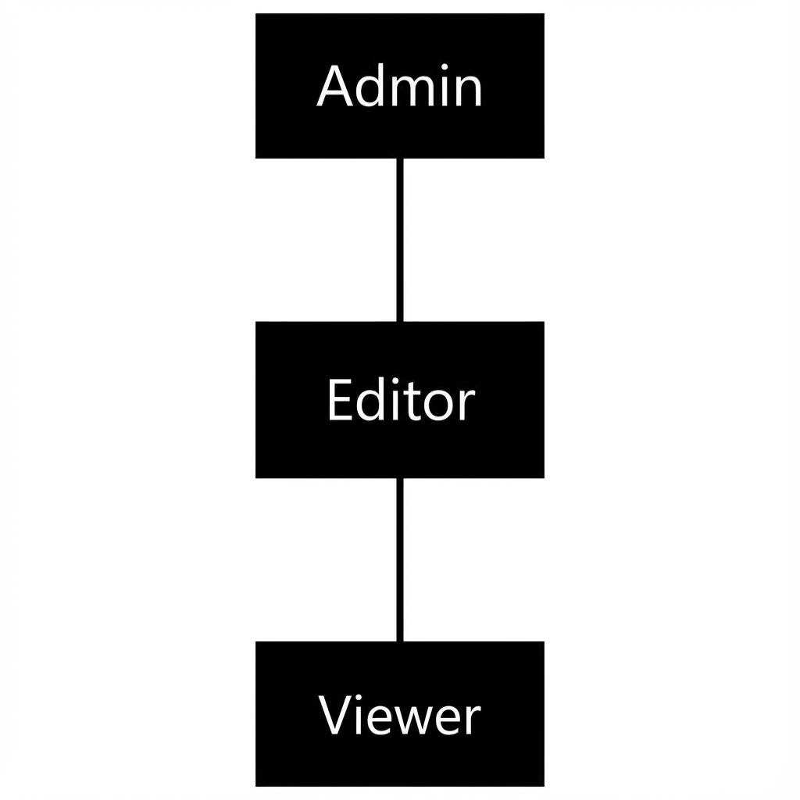

# Role-Based Access Control (RBAC)

PhilJS Enterprise provides a powerful, hierarchical RBAC system designed for B2B multi-tenant applications.

## Key Features

-   **Role Inheritance**: Roles can inherit permissions from other roles (e.g., `admin` inherits `editor` inherits `viewer`).
-   **Granular Permissions**: Permissions are defined as `resource:action` pairs.
-   **Conditions**: Permissions can be conditional based on context (e.g., "Can edit document IF document.ownerId === user.id").
-   **Multi-Tenancy**: Built-in support for tenant scoping.


*Figure 7-1: Role Inheritance Hierarchy*

## Defining Roles & Permissions

Use the `createRBACManager` to initialize your authorization engine.

```typescript
import { createRBACManager } from '@philjs/enterprise/rbac';

const rbac = createRBACManager({
  roles: [
    {
      id: 'viewer',
      name: 'Viewer',
      permissions: ['doc:read']
    },
    {
      id: 'editor',
      name: 'Editor',
      inherits: ['viewer'], // Inherits doc:read
      permissions: ['doc:write', 'doc:create']
    },
    {
      id: 'admin',
      name: 'Admin',
      inherits: ['editor'],
      permissions: ['doc:delete', 'user:manage']
    }
  ],
  permissions: [
    {
      id: 'doc:read',
      name: 'Read Documents',
      resource: 'document',
      actions: ['read']
    },
    {
      id: 'doc:delete',
      name: 'Delete Documents',
      resource: 'document',
      actions: ['delete'],
      conditions: [
        // Only allow deleting if document is NOT archived
        { field: 'isArchived', operator: 'ne', value: true }
      ]
    }
    // ...
  ]
});
```

## Checking Permissions

### Basic Check

```typescript
const userRoles = ['editor'];

if (rbac.can(userRoles, 'write', 'doc')) {
  // User can write documents
}
```

### Conditional Check

When permissions have conditions, pass the context object.

```typescript
const context = {
  isArchived: true
};

// Returns FALSE because of the condition defined above
const canDelete = rbac.can(['admin'], 'delete', 'doc', context);
```
