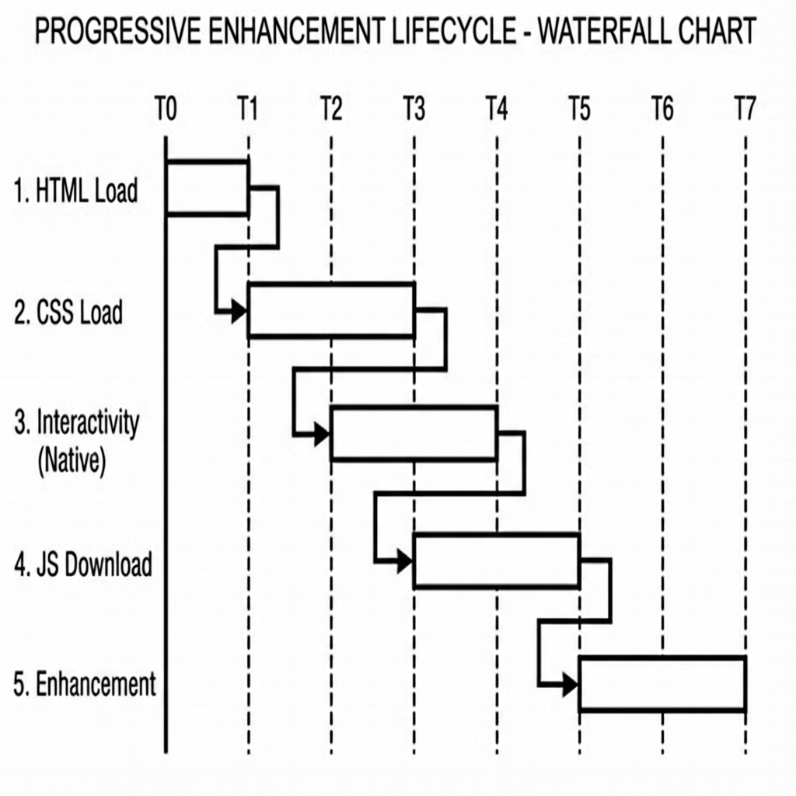

# Progressive Enhancement

PhilJS Forms are designed to work **without JavaScript** first, ensuring reliability across all networks and devices. The framework provides utilities to "enhance" these forms when JavaScript loads.

## Concepts

1.  **Server-First**: Forms are Standard HTML `<form>` elements that submit via full page loads by default.
2.  **Hydration**: When JS loads, the `useProgressiveForm` hook attaches event listeners to intercept submission and provide a smoother experience.
3.  **Resilience**: If JS fails to load or crashes, the form still works.


*Figure 4-4: Progressive Enhancement Hydration Waterfall*

## Usage

### The `useProgressiveForm` Hook

This hook enhances a standard form with features like double-submit prevention, auto-focus on error, and local storage persistence.

```tsx
import { useProgressiveForm } from '@philjs/forms/progressive';

function CheckoutForm() {
  const { formRef, isEnhanced, isSubmitting } = useProgressiveForm({
    preventMultipleSubmit: true,
    focusFirstError: true,
    persistToLocalStorage: true, // Auto-save draft
    storageKey: 'checkout_draft'
  });

  return (
    <form ref={formRef} action="/checkout" method="POST">
      <label>
        Email
        <input name="email" required />
      </label>
      
      <button disabled={isSubmitting()}>
        {isSubmitting() ? 'Placing Order...' : 'Checkout'}
      </button>

      {/* Show message only if JS is missing */}
      <noscript>
        <p>JavaScript is disabled. Don't worry, checkout still works!</p>
      </noscript>
    </form>
  );
}
```

### Server-Side JS Detection

Sometimes the server needs to know if the client has JavaScript enabled (e.g., to return JSON instead of a redirect).

```tsx
// 1. In your form
import { addJavaScriptMarker } from '@philjs/forms/progressive';

<form method="POST">
  {addJavaScriptMarker()} 
  {/* Renders <input type="hidden" name="_js" value="1" /> */}
</form>

// 2. On the server
import { clientHasJavaScript } from '@philjs/forms/progressive';

export async function action({ request }) {
  const formData = await request.formData();
  
  if (clientHasJavaScript(formData)) {
    return { success: true }; // Client handles UI update
  } else {
    return redirect('/success'); // Server redirects
  }
}
```

## Enhancement Utilities

### `isProgressivelyEnhanced`

Checks if a form element has the necessary attributes (`action`, `method`, named inputs) to function without JavaScript.

```typescript
if (!isProgressivelyEnhanced(formElement)) {
  console.warn('This form will fail without JS!');
}
```

### Conditional Rendering

PhilJS provides helpers to render content based on JS availability.

```tsx
import { ClientOnly, NoScript } from '@philjs/forms/progressive';

// Render ONLY if JS is enabled
<ClientOnly fallback={<Spinner />}>
  <InteractiveMap />
</ClientOnly>

// Render ONLY if JS is disabled
<NoScript>
  <StaticMapImage />
</NoScript>
```
