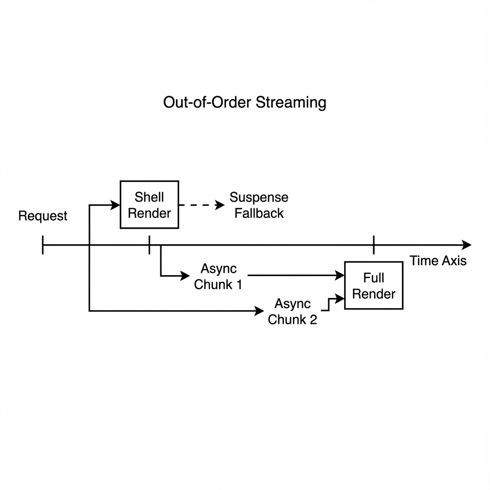

# Service Worker

The `@philjs/pwa` package takes a "Zero-Config" approach to Service Workers. Instead of copy-pasting boilerplate, you generate an optimized worker at build time.

## Auto-Generation

The `ServiceWorkerGenerator` creates a worker that handles:
- **Precaching**: Critical assets are cached on install.
- **Cleanup**: Old caches are automatically deleted.
- **Runtime Caching**: Define strategies for dynamic routes.
- **Offline Fallback**: Serve a fallback page when network fails.


*Figure 11-1: Stale-While-Revalidate Strategy*

### Build Configuration

Use the `generateServiceWorker` function in your build script (e.g., `vite.config.ts` or custom script).

```typescript
import { generateServiceWorker } from '@philjs/pwa';

await generateServiceWorker({
  outDir: 'dist',
  swDest: 'sw.js',
  
  // Static assets to cache immediately
  precache: ['/', '/index.html', '/offline.html'],
  globPatterns: ['**/*.{js,css,png}'],

  // Dynamic caching rules
  runtimeCaching: [
    {
      // API calls: try network, fall back to cache
      urlPattern: /^\/api\//,
      strategy: 'NetworkFirst',
      options: {
        networkTimeout: 3000,
        maxEntries: 50
      }
    },
    {
      // Images: check cache, then network
      urlPattern: /\.(png|jpg|svg)$/,
      strategy: 'CacheFirst',
      options: {
        maxAge: 30 * 24 * 60 * 60 // 30 days
      }
    }
  ],

  // Fallback for navigation requests
  offlineFallback: '/offline.html'
});
```

## Registration

Register the worker in your client-side code using `registerServiceWorker`.

```typescript
import { registerServiceWorker } from '@philjs/pwa';

// Registers /sw.js by default
const registration = await registerServiceWorker();

if (registration) {
  console.log('SW registered:', registration.scope);
}
```

## Update Flow

The package provides reactive hooks to handle the tricky service worker lifecycle.

```tsx
import { usePWA } from '@philjs/pwa';

function App() {
  const { state, update } = usePWA();

  return (
    <div>
      {state.updateAvailable && (
        <div className="toast">
          <p>New version available!</p>
          <button onClick={() => update()}>Reload</button>
        </div>
      )}
    </div>
  );
}
```

## Push Notifications

The generated Service Worker includes built-in support for Web Push.

1. **Subscribe** in your app:
   ```typescript
   const sub = await pwa.subscribeToPush(VAPID_PUBLIC_KEY);
   await sendToServer(sub);
   ```

2. **Send** from your server (using `web-push` library). The SW automatically handles the `push` event and shows a notification.

3. **Handle Clicks**: The SW focuses your app window when the notification is clicked.
