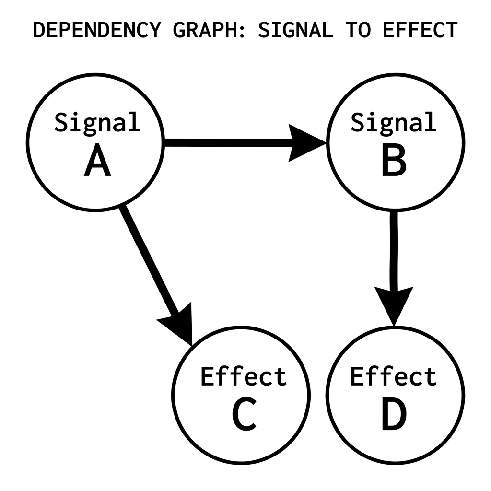

# Universal Component Protocol

The **Universal Component Protocol** (UCP) enables PhilJS to render components from React, Vue, Svelte, Preact, and Solid within the same application. This is achieved through a localized compatibility layer (the "Adapter") that translates PhilJS signals into the target framework's reactivity model.

## How It Works

1.  **Framework Islands**: Components from other frameworks are wrapped as "Islands".
2.  **Adapter Layer**: A lightweight translation layer handles prop passing and event bridging.
3.  **Shared State**: PhilJS Signals act as the source of truth, synchronized automatically to the island's internal state.
4.  **Core Runtime**: PhilJS manages the lifecycle and lazy-loading of these islands.

*Figure 2-2: Signal-to-Prop Bridge Architecture*

When a signal changes in PhilJS, the Adapter selectively updates only the relevant props in the hosted component, triggering a granular re-render within the island.

*Figure 2-3: Universal Component Lifecycle Timeline*
