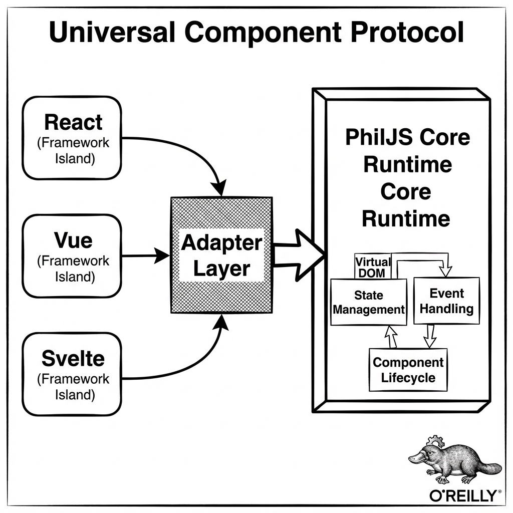

# Scientific Frontier

PhilJS incorporates scientific computing primitives directly into the web runtime, using advanced V8 features and WebGPU to enable client-side numerical analysis.

## Scientific Computing with PhilJS

### The @philjs/science Package

PhilJS includes a comprehensive scientific computing package that brings computational capabilities to the browser:

```typescript
import {
  Matrix,
  Vector,
  FFT,
  Statistics,
  LinearAlgebra,
  Optimization,
} from '@philjs/science';

// Matrix operations with GPU acceleration
const A = Matrix.from2D([
  [1, 2, 3],
  [4, 5, 6],
  [7, 8, 9],
]);

const B = Matrix.identity(3);
const C = A.multiply(B).transpose();

// Automatic GPU offloading for large matrices
const large = Matrix.random(1000, 1000);
const result = await large.eigenvalues(); // Uses WebGPU when available
```

### Statistical Analysis

Built-in statistical functions for data analysis:

```typescript
import { Statistics, DataFrame } from '@philjs/science';

const data = DataFrame.fromCSV(csvString);

// Descriptive statistics
const summary = data.describe();
console.log(summary.mean('column_a'));
console.log(summary.std('column_b'));
console.log(summary.correlation('column_a', 'column_b'));

// Hypothesis testing
const tTest = Statistics.tTest(data.column('group_a'), data.column('group_b'));
console.log(`p-value: ${tTest.pValue}`);

// Regression analysis
const regression = Statistics.linearRegression(
  data.column('x'),
  data.column('y')
);
console.log(`R²: ${regression.rSquared}`);
```

## Neural Networks in the Browser

### @philjs/neural Package

Run neural networks directly in the browser with WebGPU acceleration:


*Figure 12-1: WebGPU Accelerated Neural Network Topology*

```typescript
import { NeuralNetwork, layers, optimizers } from '@philjs/neural';

const model = new NeuralNetwork({
  backend: 'webgpu', // Falls back to webgl/cpu
  precision: 'fp16', // Memory efficient
});

model.add(layers.dense({ units: 128, activation: 'relu' }));
model.add(layers.dropout({ rate: 0.2 }));
model.add(layers.dense({ units: 64, activation: 'relu' }));
model.add(layers.dense({ units: 10, activation: 'softmax' }));

model.compile({
  optimizer: optimizers.adam({ learningRate: 0.001 }),
  loss: 'categoricalCrossentropy',
  metrics: ['accuracy'],
});

// Training with progress updates
const [trainSignal, trainingProgress] = createSignal<TrainingProgress>();

await model.fit(xTrain, yTrain, {
  epochs: 50,
  batchSize: 32,
  validationSplit: 0.2,
  onEpochEnd: (epoch, logs) => {
    trainSignal.set({ epoch, ...logs });
  },
});
```

### Model Deployment

Deploy trained models for inference:

```typescript
import { loadModel, quantize } from '@philjs/neural';

// Load and quantize for edge deployment
const model = await loadModel('/models/classifier.philjs');
const quantizedModel = await quantize(model, {
  precision: 'int8',
  calibrationData: calibrationSet,
});

// Inference with automatic batching
const predictions = await quantizedModel.predict(inputs);
```

## Bioinformatics

### @philjs/bio Package

Specialized tools for biological data analysis:

```typescript
import {
  Sequence,
  Alignment,
  Phylogeny,
  ProteinStructure,
} from '@philjs/bio';

// DNA sequence analysis
const dna = new Sequence('ATCGATCGATCG', 'dna');
const protein = dna.translate();
const gc = dna.gcContent();

// Sequence alignment
const alignment = Alignment.needlemanWunsch(seq1, seq2, {
  matchScore: 2,
  mismatchPenalty: -1,
  gapPenalty: -2,
});

// Phylogenetic analysis
const tree = Phylogeny.neighborJoining(sequences, {
  distanceMatrix: 'kimura',
});

// Protein structure visualization
const structure = await ProteinStructure.fromPDB('1ABC');
<ProteinViewer structure={structure} colorBy="secondary" />
```

## Quantum Computing Simulation

### @philjs/quantum Package

Simulate quantum circuits in the browser:

```typescript
import {
  QuantumCircuit,
  gates,
  Measurement,
  QuantumSimulator,
} from '@philjs/quantum';

// Create a quantum circuit
const circuit = new QuantumCircuit(3);

// Bell state preparation
circuit.addGate(gates.hadamard(0));
circuit.addGate(gates.cnot(0, 1));

// Add more gates
circuit.addGate(gates.rotateX(2, Math.PI / 4));
circuit.addGate(gates.toffoli(0, 1, 2));

// Simulate
const simulator = new QuantumSimulator({
  backend: 'statevector',
  shots: 1000,
});

const results = await simulator.run(circuit);
console.log(results.counts); // { '000': 498, '111': 502 }

// Visualize
<CircuitDiagram circuit={circuit} />
<BlochSphere qubit={0} state={results.statevector} />
```

### Quantum Machine Learning

```typescript
import { QuantumNeuralNetwork, VariationalCircuit } from '@philjs/quantum';

const qnn = new QuantumNeuralNetwork({
  numQubits: 4,
  layers: 3,
  entanglement: 'full',
});

// Hybrid classical-quantum training
await qnn.fit(xTrain, yTrain, {
  optimizer: 'cobyla',
  epochs: 100,
});
```

## High-Performance Computing

### WebGPU Compute Shaders

Direct access to GPU compute capabilities:

```typescript
import { GPUCompute, Kernel } from '@philjs/webgpu';

// Define a compute kernel
const matmulKernel = new Kernel(`
  @group(0) @binding(0) var<storage, read> a: array<f32>;
  @group(0) @binding(1) var<storage, read> b: array<f32>;
  @group(0) @binding(2) var<storage, read_write> result: array<f32>;

  @compute @workgroup_size(16, 16)
  fn main(@builtin(global_invocation_id) id: vec3<u32>) {
    let row = id.x;
    let col = id.y;
    var sum = 0.0;
    for (var k = 0u; k < N; k = k + 1u) {
      sum = sum + a[row * N + k] * b[k * N + col];
    }
    result[row * N + col] = sum;
  }
`);

const compute = new GPUCompute();
const result = await compute.execute(matmulKernel, {
  inputs: { a: matrixA, b: matrixB },
  workgroups: [64, 64, 1],
});
```

### Distributed Computing

PhilJS can distribute computations across multiple workers and devices:

```typescript
import { DistributedCompute, WorkerPool } from '@philjs/workers';

const pool = new WorkerPool({
  minWorkers: 4,
  maxWorkers: navigator.hardwareConcurrency,
  taskTimeout: 30000,
});

// Map-reduce style computation
const results = await pool.mapReduce(
  largeDataset,
  // Map function (runs in parallel)
  (chunk) => chunk.map(processItem),
  // Reduce function
  (results) => results.flat().reduce(combineResults)
);

// Peer-to-peer computation
const p2p = new DistributedCompute({
  discovery: 'webrtc',
  encryption: true,
});

await p2p.joinCluster('computation-group');
const distributedResult = await p2p.compute(heavyTask, {
  strategy: 'work-stealing',
  replication: 2,
});
```

## Data Visualization

### Scientific Plotting

Publication-quality visualizations:

```typescript
import { Plot, ScatterPlot, Heatmap, Surface3D } from '@philjs/charts';

// Statistical scatter plot with regression line
<ScatterPlot
  data={data}
  x="variable_x"
  y="variable_y"
  color="category"
  regression={{ type: 'linear', confidence: 0.95 }}
  annotations={[
    { type: 'text', x: 5, y: 10, text: 'R² = 0.87' },
  ]}
/>

// Interactive 3D surface plot
<Surface3D
  data={surfaceData}
  x="x"
  y="y"
  z="z"
  colorScale="viridis"
  contours={{ z: { show: true, spacing: 0.1 } }}
/>

// Heatmap with clustering
<Heatmap
  data={expressionMatrix}
  rowCluster={true}
  colCluster={true}
  dendrogram={{ row: true, col: true }}
  colorScale="redblue"
  annotations={geneAnnotations}
/>
```

## Real-Time Data Processing

### Streaming Analytics

Process continuous data streams:

```typescript
import { StreamProcessor, windows, aggregations } from '@philjs/streaming';

const processor = new StreamProcessor();

// Define processing pipeline
const pipeline = processor
  .source(websocketStream)
  .parse(JSON.parse)
  .filter(record => record.value > 0)
  .window(windows.tumbling('5s'))
  .aggregate({
    count: aggregations.count(),
    sum: aggregations.sum('value'),
    avg: aggregations.avg('value'),
    p99: aggregations.percentile('value', 99),
  })
  .sink(results => updateDashboard(results));

pipeline.start();

// Reactive integration
const [metrics] = createSignal<Metrics>();
pipeline.onEmit(metrics.set);
```

## Summary

PhilJS's scientific computing capabilities enable:

- **Matrix operations** with automatic GPU acceleration
- **Statistical analysis** with comprehensive functions
- **Neural networks** running in the browser
- **Bioinformatics** tools for biological data
- **Quantum simulation** for quantum computing research
- **GPU computing** through WebGPU compute shaders
- **Distributed computing** across workers and peers
- **Scientific visualization** with publication-quality charts

These capabilities bring high-performance computing to the web platform, enabling new classes of applications that were previously impossible in browsers.

## Next Steps

- Explore [Future Technologies](./future_tech.md)
- Learn about [WebGPU Integration](./packages/webgpu/overview.md)
- Understand [AI Integration](./packages/ai/overview.md)
