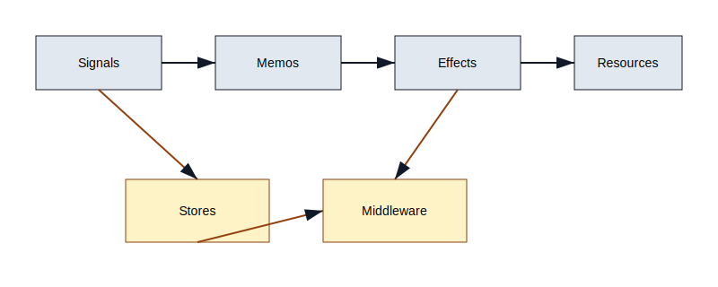

# State Management Deep Dive

PhilJS ships signals for fine-grained reactivity and a lightweight store for structured state. Use signals for local UI and derived values; use stores when you need predictable updates, history, or middleware. This chapter extends the brief primer in `docs/core` and mirrors store guidance in `docs/patterns` so you can copy/paste working patterns.



## Signals vs Store

- **Signals**: best for component-local or tightly scoped shared state; zero boilerplate and no reducers.
- **Store**: immutable-ish updates with middleware, undo/redo, persistence, and derived selectors baked in.

## Creating a store

```typescript
import { createStore } from '@philjs/core';

const [state, setState, store] = createStore({
  user: { id: 'u1', name: 'Ava' },
  todos: [{ id: 't1', title: 'Ship PhilJS' }]
});

setState('user', 'name', 'Phil');           // path-based updates
setState('todos', t => [...t, { id: 't2', title: 'Docs' }]);
```

### Derived selectors

```typescript
const completedCount = store.select(s => s.todos.filter(t => t.done).length);
```

Selectors memoize by default and only re-run when their inputs change.

For expensive derivations, debounce or throttle inside selectors to avoid UI stutter during rapid updates.

## Middleware

Middleware receive the next state and the patch being applied. Use it for logging, analytics, feature flags, or enforcing invariants.

```typescript
store.use((next, patch) => {
  console.info('patch', patch);
  if (patch.path[0] === 'adminOnly') throw new Error('blocked');
  return next();
});
```

Order matters—register middleware in the order they should run.

Common middleware examples:

- **Logger**: send patches to `console.info` or a remote collector.
- **Feature flags**: prevent writes to guarded slices unless a flag is on.
- **Analytics**: emit events when specific paths change (e.g., `checkout.status`).
- **Schema guard**: validate patches with Zod/Valibot before applying.

## History (undo/redo)

Enable history to get time travel during development or for user-facing undo:

```typescript
const [state, setState, store] = createStore(initial, { history: { limit: 100 } });
store.undo();
store.redo();
```

Recommendations:

- Keep history limits sane (25–100).
- Clear redo when applying new patches after an undo (handled automatically).
- Avoid storing large blobs directly; store handles ref equality efficiently but payload size still matters.
- For collaborative scenarios, pair history with intent logs instead of storing every patch verbatim.

## Persistence

Persist slices of state to storage (localStorage, IndexedDB, custom drivers):

```typescript
store.persist({
  driver: 'localStorage',
  paths: ['auth', 'preferences']
});
```

Use encryption for sensitive data; avoid persisting secrets entirely when possible.

### Custom drivers

Implement a driver with `get`, `set`, and `remove` to target IndexedDB, FileSystem, or secure storage on mobile (Capacitor):

```typescript
const idbDriver = {
  async get(key) { /* ... */ },
  async set(key, value) { /* ... */ },
  async remove(key) { /* ... */ }
};

store.persist({ driver: idbDriver, paths: ['drafts'] });
```

## Patterns

- **Slice-first**: derive child stores (`store.slice('todos')`) for complex apps to prevent prop-drilling.
- **Selectors > effects**: prefer selectors to recompute view data instead of side-effect-driven mutations.
- **Cross-tab sync**: combine persistence with storage events or BroadcastChannel for multi-tab coherence.
- **Server state**: do not overuse store for server data; pair with loaders/resources and keep cache lifetimes explicit.
- **Undo-friendly UI**: expose `undo/redo` in UI where users edit large documents.
- **Time travel debugging**: wire store history to the PhilJS DevTools panel for replay.
- **Symbols and Maps**: prefer plain objects/arrays for best reactivity; if you must use Symbols/Maps, expose derived POJOs for rendering.
- **Multi-tenant**: key store slices by tenant/user to avoid data bleed when switching accounts.
- **SSR-aware**: initialize stores from loader data; avoid leaking server-only secrets into serialized state.
- **SharedWorker/ServiceWorker**: for cross-tab state, share updates via a worker and hydrate per tab through a store slice.

## Testing stores

- Test reducers/updaters as pure functions.
- Assert middleware order and failure modes.
- Use fake storage for persistence tests.
- Snapshot derived selectors to lock in business logic.
- Run long-lived mutation tests to ensure history limits and persistence do not leak memory.

## Try it now: guarded store with history and persistence

```typescript
import { createStore } from '@philjs/core';
import { z } from 'zod';

const [state, setState, store] = createStore({ todos: [] }, { history: { limit: 50 }});

// Schema guard middleware
const todoSchema = z.object({ id: z.string(), title: z.string(), done: z.boolean().optional() });
store.use((next, patch) => {
  if (patch.path[0] === 'todos' && patch.value) {
    const arr = Array.isArray(patch.value) ? patch.value : [patch.value];
    arr.forEach(todoSchema.parse);
  }
  return next();
});

// Persistence
store.persist({ driver: 'localStorage', paths: ['todos'] });

// Updates
setState('todos', t => [...t, { id: crypto.randomUUID(), title: 'Ship PhilJS', done: false }]);
```

Inspect the history in DevTools, undo/redo a few steps, and refresh to confirm persistence.

