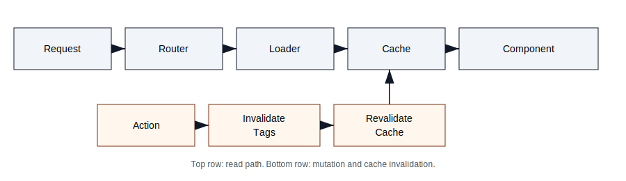
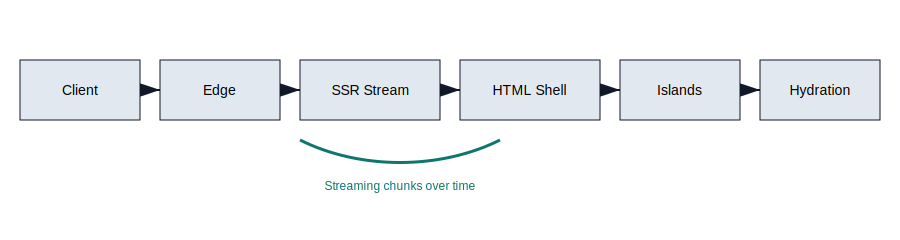
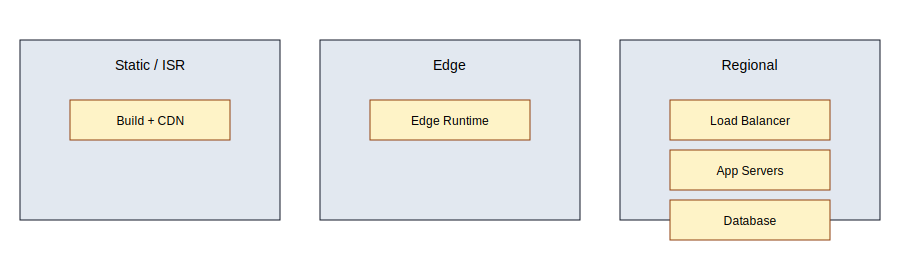
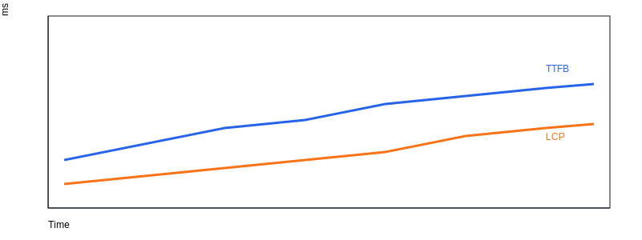
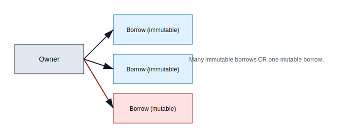

# Charts, Graphics, and Diagrams

This chapter provides the visuals referenced throughout the book. Use them as anchors when reviewing routing flow, SSR pipelines, state graphs, and performance metrics.

## Architecture and routing

## SSR and state

## Observability and deployment

## Performance charts

## Appendix visuals

## Notes

- All visuals are SVG for clarity in PDF and EPUB exports.
- Keep alt text in place for accessibility and searchability.
- Update diagrams in `docs/philjs-book/visuals` if any workflows change.

