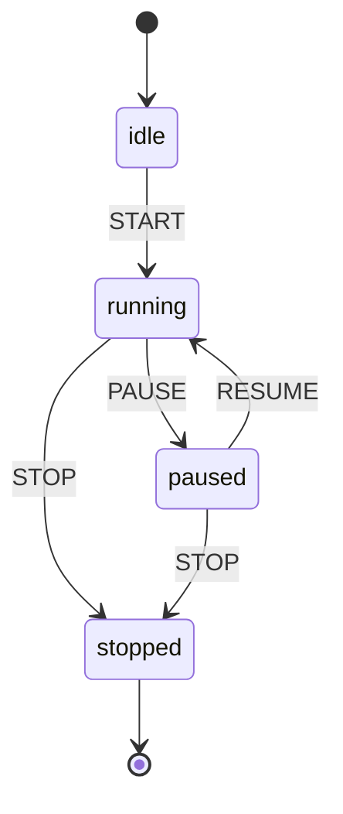

# philjs-xstate

XState-inspired state machines for PhilJS with signal-based reactivity.

## Features

- Finite state machines with clear state transitions
- Signal-based reactivity for optimal performance
- Guards and actions
- Entry/exit actions
- Context management
- Actor model support
- Delayed transitions
- Invoked services
- State visualization (Mermaid diagrams)
- TypeScript support

## Installation

```bash
npm install philjs-xstate philjs-core
```

## Basic Usage

### Create a State Machine

```typescript
import { createMachine } from 'philjs-xstate';

const toggleMachine = createMachine({
  id: 'toggle',
  initial: 'inactive',
  states: {
    inactive: {
      on: { TOGGLE: 'active' }
    },
    active: {
      on: { TOGGLE: 'inactive' }
    }
  }
});
```

### Use in Components

```typescript
import { useMachine } from 'philjs-xstate';

function Toggle() {
  const [state, send] = useMachine(toggleMachine);

  return (
    <div>
      <p>State: {state().value}</p>
      <button onClick={() => send('TOGGLE')}>
        {state().value === 'active' ? 'Turn Off' : 'Turn On'}
      </button>
    </div>
  );
}
```

## Advanced Examples

### Traffic Light Machine

```typescript
const trafficLightMachine = createMachine({
  id: 'trafficLight',
  initial: 'red',
  states: {
    red: {
      after: {
        3000: 'green' // Auto-transition after 3 seconds
      }
    },
    yellow: {
      after: {
        1000: 'red'
      }
    },
    green: {
      after: {
        2000: 'yellow'
      }
    }
  }
});
```

### Fetch Machine with Context

```typescript
import { createMachine, assign } from 'philjs-xstate';

interface FetchContext {
  data: any;
  error: Error | null;
  retries: number;
}

const fetchMachine = createMachine<FetchContext>({
  id: 'fetch',
  initial: 'idle',
  context: {
    data: null,
    error: null,
    retries: 0,
  },
  states: {
    idle: {
      on: { FETCH: 'loading' }
    },
    loading: {
      invoke: {
        src: async (ctx, evt) => {
          const response = await fetch(evt.url);
          return response.json();
        },
        onDone: {
          target: 'success',
          actions: assign((ctx, evt) => ({ data: evt.data }))
        },
        onError: {
          target: 'failure',
          actions: assign((ctx, evt) => ({
            error: evt.error,
            retries: ctx.retries + 1
          }))
        }
      }
    },
    success: {
      on: { FETCH: 'loading' }
    },
    failure: {
      on: {
        RETRY: {
          target: 'loading',
          cond: (ctx) => ctx.retries < 3
        }
      }
    }
  }
});
```

### Form Validation Machine

```typescript
import { createMachine, assign, guard } from 'philjs-xstate';

const formMachine = createMachine({
  id: 'form',
  initial: 'editing',
  context: {
    email: '',
    password: '',
    errors: [],
  },
  states: {
    editing: {
      on: {
        CHANGE: {
          actions: assign((ctx, evt) => ({
            [evt.field]: evt.value
          }))
        },
        SUBMIT: {
          target: 'validating',
          cond: guard((ctx) =>
            ctx.email.length > 0 && ctx.password.length > 0
          )
        }
      }
    },
    validating: {
      entry: assign((ctx) => {
        const errors = [];
        if (!ctx.email.includes('@')) {
          errors.push('Invalid email');
        }
        if (ctx.password.length < 8) {
          errors.push('Password too short');
        }
        return { errors };
      }),
      always: [
        {
          target: 'submitting',
          cond: (ctx) => ctx.errors.length === 0
        },
        {
          target: 'editing'
        }
      ]
    },
    submitting: {
      invoke: {
        src: async (ctx) => {
          const response = await fetch('/api/login', {
            method: 'POST',
            body: JSON.stringify(ctx)
          });
          return response.json();
        },
        onDone: 'success',
        onError: {
          target: 'editing',
          actions: assign((ctx, evt) => ({
            errors: [evt.error.message]
          }))
        }
      }
    },
    success: {
      type: 'final'
    }
  }
});
```

## Entry and Exit Actions

```typescript
const doorMachine = createMachine({
  initial: 'closed',
  states: {
    closed: {
      on: { OPEN: 'open' },
      entry: (ctx, evt) => console.log('Door is now closed'),
      exit: (ctx, evt) => console.log('Opening door...')
    },
    open: {
      on: { CLOSE: 'closed' },
      entry: (ctx, evt) => console.log('Door is now open'),
      exit: (ctx, evt) => console.log('Closing door...')
    }
  }
});
```

## Guards (Conditional Transitions)

```typescript
const ageMachine = createMachine({
  initial: 'checkAge',
  context: { age: 0 },
  states: {
    checkAge: {
      on: {
        SUBMIT: [
          {
            target: 'adult',
            cond: (ctx) => ctx.age >= 18
          },
          {
            target: 'minor',
            cond: (ctx) => ctx.age > 0
          },
          {
            target: 'invalid'
          }
        ]
      }
    },
    adult: {},
    minor: {},
    invalid: {}
  }
});
```

## Visualization

### Generate Mermaid Diagram

```typescript
import { createMachine, toMermaid } from 'philjs-xstate';

const machine = createMachine({
  initial: 'idle',
  states: {
    idle: {
      on: { START: 'running' }
    },
    running: {
      on: {
        PAUSE: 'paused',
        STOP: 'stopped'
      }
    },
    paused: {
      on: {
        RESUME: 'running',
        STOP: 'stopped'
      }
    },
    stopped: {
      type: 'final'
    }
  }
});

console.log(toMermaid(machine));
```

Output:


### Generate Visualization Data

```typescript
import { visualize } from 'philjs-xstate';

const graph = visualize(machine);

console.log(graph.nodes); // Array of state nodes
console.log(graph.edges); // Array of transitions

// Use with visualization libraries like D3, Cytoscape, etc.
```

## Actor API

### Create and Control Actors

```typescript
const machine = createMachine({
  initial: 'idle',
  states: {
    idle: {
      on: { START: 'active' }
    },
    active: {
      on: { STOP: 'idle' }
    }
  }
});

const actor = machine.createActor();

// Subscribe to state changes
const unsubscribe = actor.subscribe((state) => {
  console.log('State changed:', state.value);
});

// Send events
actor.send('START');
actor.send({ type: 'STOP', data: 'custom data' });

// Get current state
const snapshot = actor.getSnapshot();
console.log(snapshot.value);

// Clean up
actor.stop();
unsubscribe();
```

## State Matching

```typescript
const [state, send] = useMachine(machine);

if (state().matches('loading')) {
  return <Spinner />;
}

if (state().matches('success')) {
  return <Success data={state().context.data} />;
}

if (state().matches('error')) {
  return <Error error={state().context.error} />;
}
```

## Context Updates

```typescript
import { assign } from 'philjs-xstate';

const counterMachine = createMachine({
  context: { count: 0 },
  initial: 'active',
  states: {
    active: {
      on: {
        INCREMENT: {
          actions: assign((ctx) => ({ count: ctx.count + 1 }))
        },
        DECREMENT: {
          actions: assign((ctx) => ({ count: ctx.count - 1 }))
        },
        ADD: {
          actions: assign((ctx, evt) => ({
            count: ctx.count + evt.value
          }))
        }
      }
    }
  }
});
```

## TypeScript

Full TypeScript support with type inference:

```typescript
import { createMachine, EventObject } from 'philjs-xstate';

interface ToggleContext {
  count: number;
}

type ToggleEvent =
  | { type: 'TOGGLE' }
  | { type: 'RESET' };

const machine = createMachine<ToggleContext, ToggleEvent>({
  context: { count: 0 },
  initial: 'inactive',
  states: {
    inactive: {
      on: {
        TOGGLE: {
          target: 'active',
          actions: assign((ctx) => ({ count: ctx.count + 1 }))
        }
      }
    },
    active: {
      on: { TOGGLE: 'inactive' }
    }
  }
});
```

## API Reference

### `createMachine(config)`

Creates a state machine.

**Config:**
- `id` - Machine identifier (optional)
- `initial` - Initial state (required)
- `context` - Initial context (optional)
- `states` - State definitions (required)

### `useMachine(machine)`

Creates a signal-based actor for use in components.

**Returns:** `[state: Signal<State>, send: (event) => void]`

### `machine.createActor()`

Creates an actor instance.

**Returns:** `ActorRef` with methods:
- `send(event)` - Send event to machine
- `subscribe(listener)` - Subscribe to state changes
- `getSnapshot()` - Get current state
- `stop()` - Stop actor and clean up

### `assign(assigner)`

Creates an action that updates context.

### `guard(predicate)`

Creates a guard condition for transitions.

### `visualize(machine)`

Generates visualization data.

**Returns:** `{ nodes, edges }`

### `toMermaid(machine)`

Generates Mermaid diagram syntax.

**Returns:** String

## Best Practices

1. Keep state machines focused on a single concern
2. Use guards for conditional logic
3. Use context for data, states for behavior
4. Name events with SCREAMING_CASE
5. Use final states to mark completion
6. Leverage visualization for documentation
7. Test state machines thoroughly

<!-- API_SNAPSHOT_START -->
## API Snapshot

This section is generated from the package source. Run `node scripts/generate-package-atlas.mjs` to refresh.

### Entry Points
- Export keys: .
- Source files: packages/philjs-xstate/src/index.ts

### Public API
- Direct exports: Action, ActorRef, EventObject, Guard, Machine, MachineConfig, Service, ServiceConfig, State, StateNode, StateValue, TransitionConfig, VisualizationGraph, VisualizationNode, assign, createMachine, guard, toMermaid, useMachine, visualize
- Re-exported names: (none detected)
- Re-exported modules: (none detected)
<!-- API_SNAPSHOT_END -->

## License

MIT
